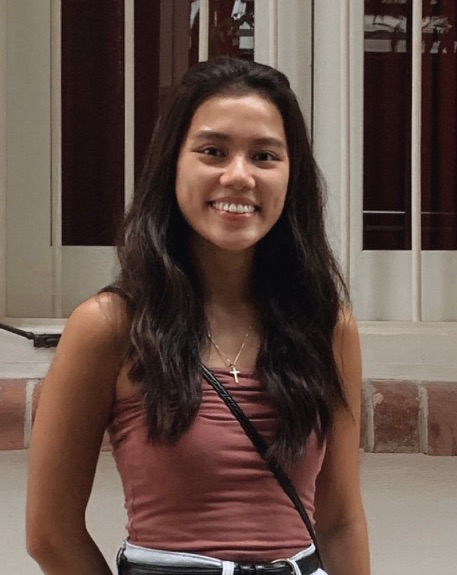

We are a team based in the [School of Computing, National University of Singapore](http://www.comp.nus.edu.sg).

You can reach us at the respective emails: 
* `dylan.ghee@u.nus.edu`
* `chee.erynne@u.nus.edu`
* `rachel.limjt@u.nus.edu`
* `e0424909@u.nus.edu`

## Project team

### Dylan Ghee Shao Kang

[[github](https://github.com/zatkiller)]
[[portfolio](team/zatkiller.md)]

* Role: Team Lead
* Responsibilities: Deliverables and Scheduling, Code Quality

### Chee Erynne

[[github](http://github.com/cheeerynne)]
[[portfolio](team/cheeerynne.md)]

* Role: Software Developer
* Responsibilities: Documentation, Testing 

### Lim Jean Tong, Rachel

[[github](http://github.com/rachelljt)]
[[portfolio](team/rachelljt.md)]

* Role: Software Developer
* Responsibilities: UI 

### Tasha Marion Wan hui lin

[[github](https://github.com/tashawan23)]
[[portfolio](team/tashawan23.md)]

* Role: Software Developer
* Responsibilities: Documentation, Integration 
