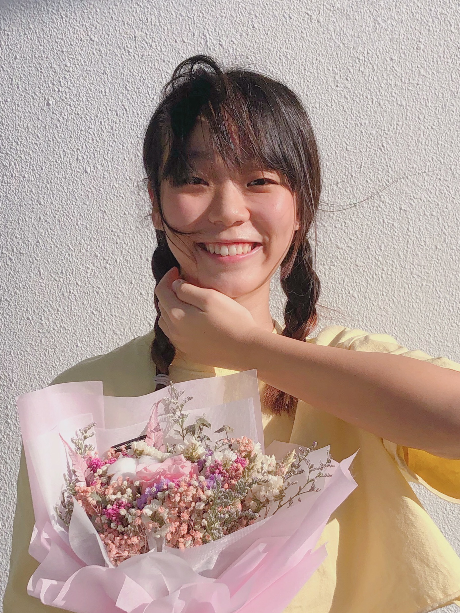

We are a team based in the [School of Computing, National University of Singapore](http://www.comp.nus.edu.sg).

## Project team

### Cheng Yu Feng

[[github](https://github.com/YuFeng0930)]
[[portfolio](team/YuFeng0930.md)]

* Role: Developer
* Responsibilities: Events Team

### Ding You Jia, Danelynn

[[github](http://github.com/icelenaugust)]
[[portfolio](team/icelenaugust.md)]

* Role: Developer
* Responsibilities: Tasks Team

### Li Jiahe

[[github](https://github.com/ljhgab)]
[[portfolio](team/ljhgab.md)]

* Role: Developer
* Responsibilities: Tasks Team, Testing

### Yap Jing Kang

[[github](http://github.com/souluseless)]
[[portfolio](team/souluseless.md)]

* Role: Developer
* Responsibilities: Tasks Team

### Yu Jiaxiang

[[github](http://github.com/litone01)]
[[portfolio](team/litone01.md)]

* Role: Developer
* Responsibilities: Tasks Team, Logic
