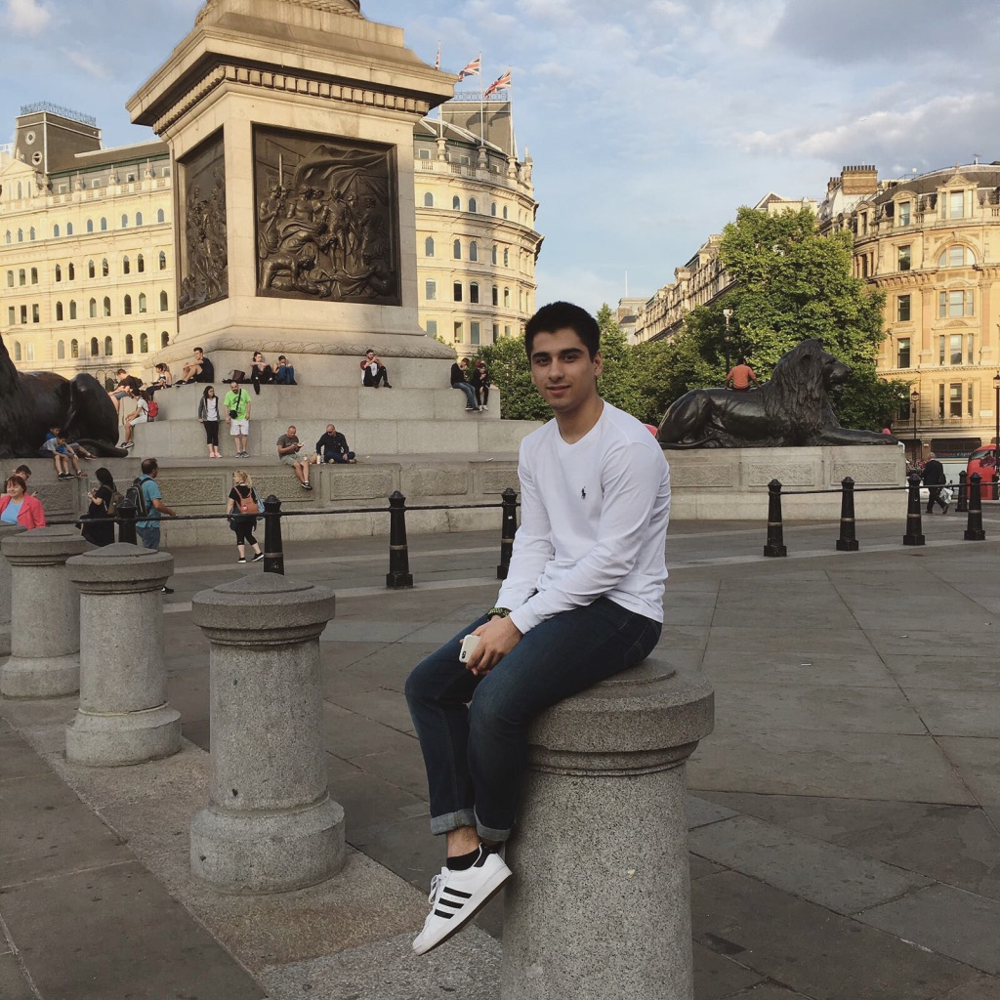

We are a team based in the [School of Computing, National University of Singapore](http://www.comp.nus.edu.sg).

## Project team

### Tay Yi Hsuen

[[github](https://github.com/yhtMinceraft1010X)]

* Role: Developer, Documentation IC
* Responsibility: Logic Component

### Umer Siddiqui

[[github](https://github.com/umergta)]
[[portfolio](team/johndoe.md)]

* Role: Developer
* Responsibilities: Developer for ModuleBook3.5

### Lee Ze Xin

[[github](http://github.com/figo2127)]
[[portfolio](team/johndoe.md)]

* Role: Developer
* Responsibilities: Developer for ModuleBook3.5

### Wang Yuanzhe

[[github](https://github.com/AiwassPrime)]
[[portfolio](team/johndoe.md)]

* Role: Developer
* Responsibilities: Develop ModuleBook3.5

### He Qiyuan

[[homepage](https://qy-h00.github.io/)]
[[github](https://github.com/qy-h00)]
[[portfolio](team/qy-h00.md)]

* Role: Developer, QA Engineer
* Responsibility: Testing and Project Management

