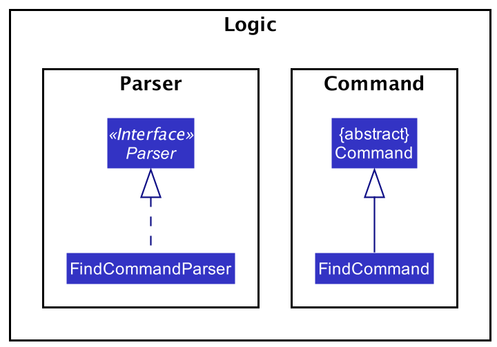
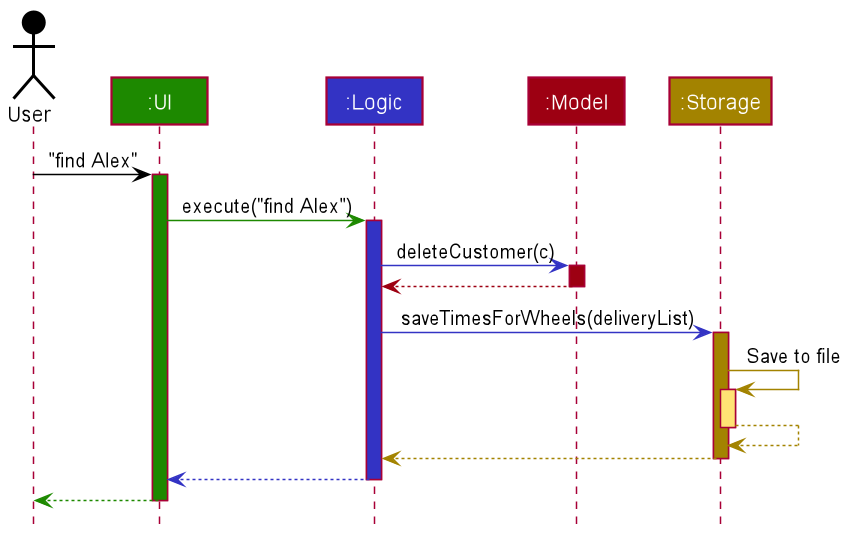

* Table of Contents
{:toc}

--------------------------------------------------------------------------------------------------------------------
## **1. Introduction to BookCoin**

Welcome! This is BookCoin, a compact application for booking management for administrative personnel. This developer guide is created to give a quick introduction of BookCoin to interested developers on its structure and implementation. All are welcome to contribute!

This guide covers several aspects of BookCoin, starting from its high-level design implementation and following with an overview of the implementation behind key features and rationale behind certain design decisions. Links are also provided to various guides on the tools used in Documentation, Testing, and DevOps. Finally, the appendices specify the product scope, requirements, a glossary, and instructions for manual testing.

--------------------------------------------------------------------------------------------------------------------

## **2. Setting up, getting started**

Refer to the guide [_Setting up and getting started_](SettingUp.md).

--------------------------------------------------------------------------------------------------------------------

## **3. Design**

This section provides an overview of the high-level design of BookCoin.

### 3.1 Architecture

The ***Architecture Diagram*** given above explains the high-level design of the App. Given below is a quick overview of each component.

:bulb: **Tip:** The `.puml` files used to create diagrams in this document can be found in the [diagrams](https://github.com/AY2021S2-CS2103-W17-3/tp/tree/master/docs/diagrams/) folder. Refer to the [_PlantUML Tutorial_ at se-edu/guides](https://se-education.org/guides/tutorials/plantUml.html) to learn how to create and edit diagrams.

**`Main`** has two classes called [`Main`](https://github.com/AY2021S2-CS2103-W17-3/tp/tree/master/src/main/java/seedu/booking/Main.java) and [`MainApp`](https://github.com/AY2021S2-CS2103-W17-3/tp/tree/master/src/main/java/seedu/booking/MainApp.java). It is responsible for,
* At app launch: Initializes the components in the correct sequence, and connects them up with each other.
* At shut down: Shuts down the components and invokes cleanup methods where necessary.

[**`Commons`**](#common-classes) represents a collection of classes used by multiple other components. One example class is (#LogsCenter), which is used by many classes to write log messages to BookCoin’s log file.

The rest of the App consists of four components.

* [**`UI`**](#ui-component): The UI of the App.
* [**`Logic`**](#logic-component): The command executor.
* [**`Model`**](#model-component): Holds the data of BookCoin in memory.
* [**`Storage`**](#storage-component): Reads data from, and writes data to, the hard disk.

Each of the four components

* defines its *API* in an `interface` with the same name as the Component.
* exposes its functionality using a concrete `{Component Name}Manager` class (which implements the corresponding API `interface` mentioned in the previous point.

For example, the `Logic` component (see the class diagram given below) defines its API in the `Logic.java` interface and exposes its functionality using the `LogicManager.java` class which implements the `Logic` interface.

**How the architecture components interact with each other**

The *Sequence Diagram* below shows how the components interact with each other for the scenario where the user issues the command `delete_booking 1`.

The sections below give more details of each component.

### 3.2 UI component

**API** :
[`Ui.java`](https://github.com/AY2021S2-CS2103-W17-3/tp/tree/master/src/main/java/seedu/booking/ui/Ui.java)

The UI consists of a `MainWindow` that is made up of parts e.g.`CommandBox`, `ResultDisplay`, `PersonListPanel`, `StatusBarFooter` etc. All these, including the `MainWindow`, inherit from the abstract `UiPart` class.

The `UI` component uses JavaFx UI framework. The layout of these UI parts are defined in matching `.fxml` files that are in the `src/main/resources/view` folder. For example, the layout of the [`MainWindow`](https://github.com/AY2021S2-CS2103-W17-3/tp/tree/master/src/main/java/seedu/booking/ui/MainWindow.java) is specified in [`MainWindow.fxml`](https://github.com/AY2021S2-CS2103-W17-3/tp/tree/master/src/main/resources/view/MainWindow.fxml)

The `UI` component,

* Executes user commands using the `Logic` component.
* Listens for changes to `Model` data so that the UI can be updated with the modified data.

### 3.3 Logic component

**API** :
[`Logic.java`](https://github.com/AY2021S2-CS2103-W17-3/tp/tree/master/src/main/java/seedu/booking/logic/Logic.java)

1. `Logic` uses the `BookingSystemParser` class to parse the user command.
1. This results in a `Command` object which is executed by the `LogicManager`.
1. The command execution can affect the `Model` (e.g. adding a person).
1. The result of the command execution is encapsulated as a `CommandResult` object which is passed back to the `Ui`.
1. In addition, the `CommandResult` object can also instruct the `Ui` to perform certain actions, such as displaying help to the user.

Given below is the Sequence Diagram for interactions within the `Logic` component for the `execute("delete_booking 1")` API call.

:information_source: **Note:** The lifeline for `DeleteCommandParser` should end at the destroy marker (X) but due to a limitation of PlantUML, the lifeline reaches the end of diagram.

### 3.4 Model component

**API** : [`Model.java`](https://github.com/AY2021S2-CS2103-W17-3/tp/tree/master/src/main/java/seedu/booking/model/Model.java)

The `Model`,

* stores a `UserPref` object that represents the user’s preferences.
* stores the booking system data.
* exposes an unmodifiable `ObservableList<Person>` that can be 'observed' e.g. the UI can be bound to this list so that the UI automatically updates when the data in the list change.
* does not depend on any of the other three components.

:information_source: **Note:** An alternative (arguably, a more OOP) model is given below. It has a `Tag` list in the `BookingSystem`, which `Person` references. This allows `BookingSystem` to only require one `Tag` object per unique `Tag`, instead of each `Person` needing their own `Tag` object. 

### 3.5 Storage component

**API** : [`Storage.java`](https://github.com/AY2021S2-CS2103-W17-3/tp/tree/master/src/main/java/seedu/booking/storage/Storage.java)

The `Storage` component,
* can save `UserPref` objects in json format and read it back.
* can save the booking system data in json format and read it back.

### 3.6 Common classes

Classes used by multiple components are in the `seedu.booking.commons` package.

--------------------------------------------------------------------------------------------------------------------

## **4. Implementation**

This section describes some noteworthy details on how certain features are implemented.

### 4.1 Find feature
BookCoin allows users to narrow down the search of persons, venues and bookings through filters. 

#### 4.1.1 Implementation details
The find functionality is implemented through an FindCommand and FindCommandParser for Person, Venue and Booking. Corner cases such as searching for non-existent entries are also handled properly with suitable notifications displayed to the user. For example, if a search returns with no results, the corresponding notice that there are no persons/ venues/ bookings is displayed. The find feature is implemented with FindPersonCommand/ FindVenueCommand/ FindBookingCommand and their respective parsers FindPersonCommandParser/ FindVenueCommandParser/ FindBookingCommandParser.
 

Since the functionality for all three classes are similar, we can focus our discussion here on the Person class here without loss of generality. The `find_person` command has the following format:
`find_person [n/NAME] [p/PHONE] [e/EMAIL] [t/TAG]`, where at least one field must be provided.

Given below is a sequence diagram how the `find_person` command behaves in BookCoin after user input is parsed if a user wishes to find all persons by the name of "Anna" and inputs `find_person n/Anna`.

#### 4.1.2 Design considerations:
##### Aspect: Deciding between full and partial matching

* **Alternative 1 (current choice):** Full matching which requires users to input at least one full word for a field.
    * Pros: Easier to implement and use, prevents the return of too many unrelated results.
    * Cons: User has to be able to remember and input at least one complete field for find command to work.

* **Alternative 2:** Partial matching which would return all valid partial results when users input a field.
    * Pros: More convenient for situations when a user cannot remember a full field.
    * Cons: Results returned may contain many unrelated and undesirable entries (e.g. if searching for a person "Ann", the system would return partial matches "Annabelle", "Annabella", "Anna" etc.)

### 4.2 Delete feature
BookCoin supports the deletion of person, venue and booking objects. However, since there are dependencies between the different classes (e.g. there is a possibility that a venue is deleted while it still has bookings associated with it), we also had to ensure that a deletion of persons/ venues would also result in a deletion of the corresponding affected bookings.

#### 4.2.1 Implementation details

### 4.4 \[Proposed\] Undo/redo feature

#### 4.4.1 Proposed implementation

The proposed undo/redo mechanism is facilitated by `VersionedBookingSystem`. It extends `BookingSystem` with an undo/redo history, stored internally as an `bookingSystemStateList` and `currentStatePointer`. Additionally, it implements the following operations:

* `VersionedBookingSystem#commit()` — Saves the current booking system state in its history.
* `VersionedBookingSystem#undo()` — Restores the previous booking system state from its history.
* `VersionedBookingSystem#redo()` — Restores a previously undone booking system state from its history.

These operations are exposed in the `Model` interface as `Model#commitBookingSystem()`, `Model#undoBookingSystem()` and `Model#redoBookingSystem()` respectively.

Given below is an example usage scenario and how the undo/redo mechanism behaves at each step.

Step 1. The user launches the application for the first time. The `VersionedBookingSystem` will be initialized with the initial booking system state, and the `currentStatePointer` pointing to that single booking system state.

Step 2. The user executes `delete 5` command to delete the 5th person in BookCoin. The `delete` command calls `Model#commitBookingSystem()`, causing the modified state of the booking system after the `delete 5` command executes to be saved in the `bookingSystemStateList`, and the `currentStatePointer` is shifted to the newly inserted booking system state.

Step 3. The user executes `add n/David …​` to add a new person. The `add` command also calls `Model#commitBookingSystem()`, causing another modified booking system state to be saved into the `bookingSystemStateList`.

:information_source: **Note:** If a command fails its execution, it will not call `Model#commitBookingSystem()`, so the booking system state will not be saved into the `bookingSystemStateList`.

Step 4. The user now decides that adding the person was a mistake, and decides to undo that action by executing the `undo` command. The `undo` command will call `Model#undoBookingSystem()`, which will shift the `currentStatePointer` once to the left, pointing it to the previous booking system state, and restores the booking system to that state.

:information_source: **Note:** If the `currentStatePointer` is at index 0, pointing to the initial BookingSystem state, then there are no previous BookingSystem states to restore. The `undo` command uses `Model#canUndoBookingSystem()` to check if this is the case. If so, it will return an error to the user rather
than attempting to perform the undo.

The following sequence diagram shows how the undo operation works:

:information_source: **Note:** The lifeline for `UndoCommand` should end at the destroy marker (X) but due to a limitation of PlantUML, the lifeline reaches the end of diagram.

The `redo` command does the opposite — it calls `Model#redoBookingSystem()`, which shifts the `currentStatePointer` once to the right, pointing to the previously undone state, and restores the booking system to that state.

:information_source: **Note:** If the `currentStatePointer` is at index `bookingSystemStateList.size() - 1`, pointing to the latest booking system state, then there are no undone BookingSystem states to restore. The `redo` command uses `Model#canRedoBookingSystem()` to check if this is the case. If so, it will return an error to the user rather than attempting to perform the redo.

Step 5. The user then decides to execute the command `list`. Commands that do not modify the booking system, such as `list`, will usually not call `Model#commitBookingSystem()`, `Model#undoBookingSystem()` or `Model#redoBookingSystem()`. Thus, the `bookingSystemStateList` remains unchanged.

Step 6. The user executes `clear`, which calls `Model#commitBookingSystem()`. Since the `currentStatePointer` is not pointing at the end of the `bookingSystemStateList`, all booking system states after the `currentStatePointer` will be purged. Reason: It no longer makes sense to redo the `add n/David …​` command. This is the behavior that most modern desktop applications follow.

The following activity diagram summarizes what happens when a user executes a new command:

#### 4.4.2 Design considerations:

##### Aspect: How undo & redo executes

* **Alternative 1 (current choice):** Saves the entire booking system.
  * Pros: Easy to implement.
  * Cons: May have performance issues in terms of memory usage.

* **Alternative 2:** Individual command knows how to undo/redo by
  itself.
  * Pros: Will use less memory (e.g. for `delete`, just save the person/ venue/ booking being deleted).
  * Cons: We must ensure that the implementation of each individual command are correct.
    

--------------------------------------------------------------------------------------------------------------------

## **5. Documentation, logging, testing, configuration, dev-ops**

* [Documentation guide](Documentation.md)
* [Testing guide](Testing.md)
* [Logging guide](Logging.md)
* [Configuration guide](Configuration.md)
* [DevOps guide](DevOps.md)

--------------------------------------------------------------------------------------------------------------------

## **Appendix A: Requirements**

### A.1 Product scope

**Target user profile**:

* needs to manage a large number of bookings
* has to ensure bookings abide by restrictions
* needs to check that the bookings are valid
* is the administrative personnel of schools or similar organisations
* prefers desktop apps over other types
* can type fast
* prefers typing to mouse interactions
* is reasonably comfortable using CLI apps

**Value proposition**:

* manage bookings faster than a typical mouse/GUI driven app
* ease of managing bookings since it is a centralised system
* automatically keeps track of room usage, conflicts and rule violations
* clear and structured way to avoid ambiguity

### **Appendix B: User Stories**

Priorities: High (must have) - `* * *`, Medium (nice to have) - `* *`, Low (unlikely to have) - `*`

| Priority | As a …​                                    | I want to …​                     | So that I can…​                                                        |
| -------- | ------------------------------------------ | ------------------------------ | ---------------------------------------------------------------------- |
| `* * *`  | admin in charge of facilities              | add venues                     | make bookings in that venue.                                                                       |
| `* * `  | admin in charge of facilities              | edit venues                    | reflect the most up to date details of the venue.                       |
| `* * *`  | admin in charge of facilities              | delete venues                  | remove venues not available for booking.                                                                       |
| `* * *`  | admin in charge of facilities              | view venues                    | check the venues that have been added.                                                                       |
| `* *`  | admin in charge of facilities              | find a venue by searching the venue's attribute(s)| quickly get details of that venue.                                                                      |
| `* * *`  | admin in charge of facilities              | add bookings                   | keep track of bookings.                                                                       |
| `* * `  | admin in charge of facilities              | edit bookings                  | change booking details when the person decides to amend the booking.    |
| `* * *`  | admin in charge of facilities              | delete bookings                | remove bookings that have been cancelled by the booker.                                                                       |
| `* * *`  | admin in charge of facilities              | view bookings                  | check the bookings that have been made.
| `* *`  | admin in charge of facilities              | find a booking by searching the booking's attribute(s)| quickly get details of that booking.                                                                        ||
| `* * *`  | admin in charge of facilities              | add persons                    | make bookings for that person.                                                                       |
| `* * `  | admin in charge of facilities              | edit persons                   | reflect the most up to date details of the person.                       |
| `* * *`  | admin in charge of facilities              | delete persons                 | remove persons who are not able to make a booking.                                                                       |
| `* * *`  | admin in charge of facilities              | view persons                   | check the persons that have been added.
| `* *`  | admin in charge of facilities              | find a person by searching the person's attribute(s)| quickly get details of that person.                                                                        ||
| `*`      | admin in charge of facilities              | be able to access past data           | easily check the history of certain venues                      |

### **Appendix D: Use Cases**

(For all use cases below, the **System** is `BookCoin` and the **Actor** is the `user`, unless specified otherwise)

**Use case: UC01 - Add a venue**

**MSS**

1.  User requests to add a new venue into the system, and provides venue details.
2.  BookCoin adds the venue into the system.

    Use case ends.

**Extensions**

* 1a. The venue to be added is already in the system.
    * 1a1. BookCoin shows an error message.

  Use case resumes at step 1.

* 1b. Venue details are invalid or missing compulsory fields.
    * 1b1. BookCoin shows an error message and prompts the user to reenter their command.
* 1b. Venue details are missing, or are provided but invalid.
    * 1b1. BookCoin shows an error message.

  Use case resumes at step 1.

**Use case: UC02 - Add a booking**

This use case is similar to UC01 - Add a venue, except that venues are replaced with bookings.

**Use case: UC03 - Add a person**

This use case is similar to UC01 - Add a venue, except that venues are replaced with persons.
 

**Use case: UC04 - Delete a venue**

**MSS**

1.  User requests to delete a specific venue.
2.  BookCoin deletes the venue.

    Use case ends.

**Extensions**

* 1a. The specified venue does not exist in the system.

    * 1a1. BookCoin shows an error message.

      Use case resumes at step 1.

**Use case: UC05 - Delete a booking**

This use case is similar to UC04 - Delete a venue, except that venues are replaced with bookings.

**Use case: UC06 - Delete a person**

This use case is similar to UC04 - Delete a venue, except that venues are replaced with persons.

**Use case: UC07 - List all bookings**

**MSS**

1.  User requests to list all bookings.
2.  BookCoin shows a list of bookings.

    Use case ends.

**Use case: UC08 - List all venues**

This use case is similar to UC07 - List all bookings, except that bookings are replaced with venues.

**Use case: UC09 - List all person**

This use case is similar to UC07 - List all bookings, except that bookings are replaced with persons.

**Use case: UC10 - Find a venue**

**MSS**

1.  User requests to find all venues that match the specified fields.
2.  BookCoin shows the matching venue(s).

    Use case ends.

**Extensions**

* 1a. No venues with the specified field(s) exists in the system.

    * 1a1. BookCoin shows an error message.

      Use case ends.

* 1b. The field(s) specified is/are invalid.

    * 1a1. BookCoin shows an error message.

      Use case resumes at step 1.

**Use case: UC11 - Find a booking**

**MSS**

This use case is similar to UC10 - Find a venue, except that venues are replaced with bookings.

**Use case: UC12 - Find a person**

This use case is similar to UC10 - Find a venue, except that venues are replaced with persons.

**Use case: UC13 - Edit a venue**

**MSS**

1.  User requests to edit certain fields belonging to a specified venue.
2.  BookCoin updates the venue information and saves it to the booking system.
1.  User requests to edit certain fields belonging to a specific venue.
2.  BookCoin updates the venue information and saves it to the booking system.

    Use case ends.

**Extensions**

* 1a. The specified venue to be edited does not exist in the system.

    * 1a1. BookCoin shows an error message.

      Use case resumes at step 1.

* 1b. The specified field(s) and/or the specified venue to be edited is/are invalid.

    * 1b1. BookCoin shows an error message.

      Use case resumes at step 1.

**Use case: UC14 - Edit a booking**

**MSS**

This use case is similar to UC13 - Edit a venue, except that venues are replaced with bookings.

**Use case: UC15 - Edit a person**

This use case is similar to UC13 - Edit a venue, except that venues are replaced with persons.

**Use case: UC16 - Exit the program**

**MSS**

1.  User requests to exit the program.
2.  BookCoin closes the window and terminates.

    Use case ends.

### **Appendix E: Non-Functional Requirements**

1.  Should work on any _mainstream OS_ as long as it has Java `11` or above installed.
2.  Should be able to hold up to 1000 venues and bookings without a noticeable sluggishness in performance for typical usage.
3.  A user with above average typing speed for regular English text (i.e. not code, not system admin commands) should be able to accomplish most of the tasks faster using commands than using the mouse.
4.  Should be able to perform queries quickly even with significant amounts of data present.

### **Appendix F: Glossary**

* **Mainstream OS**: Windows, Linux, Unix, OS-X
* **Booking**: A person's request to occupy a venue for a specified duration

--------------------------------------------------------------------------------------------------------------------

### **Appendix G: Instructions for Manual Testing**

Given below are instructions to test the app manually.

:information_source: **Note:** These instructions only provide a starting point for testers to work on;
testers are expected to do more *exploratory* testing.

### G.1 Launch and shutdown

1. Initial launch

   1. Download the jar file and copy into an empty folder

   1. Double-click the jar file Expected: Shows the GUI with a set of sample contacts. The window size may not be optimum.

1. Saving window preferences

   1. Resize the window to an optimum size. Move the window to a different location. Close the window.

   1. Re-launch the app by double-clicking the jar file. 
       Expected: The most recent window size and location is retained.

### G.2 Adding a person
1. A multi-step command to add a person to the booking system
    1. Prerequisites: list all persons using the `list_person` command. A person with the same email address and/or phone number cannot already exist. If it is present as a record in the system, delete it.

    2. Test case: `add_person n/John Doe` followed by `johnd@example.com ` 
       Expected: There should be an error stating that the booking command is invalid. This is due to a missing phone number.

    3. Test case: `add_person n/John Doe` followed by `johnd@` 
       Expected: There should be an error stating that the booking command is invalid. This is due to the wrong format of the email, and a missing phone number.

    4. Test case: `add_person n/John Doe` followed by `johnd@example.com` followed by `98765432`  
       Expected: A new person by the name John Doe, with email address johnd@example.com and phone number 98765432 is added into the booking system.

    5. Test case: `add_person n/John Doe` followed by `johnd@example.com` followed by `98765432` followed by `student` 
      Expected: A new person by the name John Doe, with email address johnd@example.com, phone number 98765432 and tag student is added into the booking system.

### G.3 Adding a venue
1. A multi-step command to add a venue to the booking system
    1. Prerequisites: list all venues using the `list_venue` command. A venue by the same name cannot already exist. If it is present as a record in the system, delete it.

    2. Test case: `add_venue v/Victoria Hall` 
    Expected: Victoria Hall should appear in the list of venues. The default capacity should be set to 10 as it was unspecified in the command, and there should be no description or tag.

    3. Test case: `add_venue v/Victoria Hall` followed by `50` 
    Expected: Victoria Hall should appear in the list of venues with a capacity indicated to be 50. No description or tag should be present.

    4. Test case: `add_venue v/Victoria Hall` followed by `50` followed by `Popular concert hall` 
    Expected: Victoria Hall should appear in the list of venues with a capacity indicated to be 50, and a description "Popular concert hall". There should be no tag.

    5. Test case: `add_venue v/Victoria Hall` followed by `50` followed by `Popular concert hall` followed by `indoors` 
    Expected: Victoria Hall should appear in the list of venues with a capacity indicated to be 50, a description "Popular concert hall", and a tag "indoors".
       

### G.4 Adding a booking
1. A multi-step command to add a booking for Victoria Hall
    1. Prerequisites: a venue by the same name already exists, and a venue by the name of Hall does not exist. If it is not present as a record in the system, create one. Similarly, for the email of a person booking, create one if not present

    2. Test case: `add_booking` followed by `example@gmail.com` followed by `Hall` followed by `For FYP Meeting` followed by `2012-01-31 22:59` followed by `2012-01-31 23:59` followed by `meeting` 
    Expected: There should be an error stating that the venue does not exist in the system

    3. Test case: `add_booking` followed by `example@gmail.com` followed by `Victoria Hall` followed by `For FYP Meeting` followed by `2012-02-01 22:59` followed by `2012-01-31 23:59` followed by `meeting` 
    Expected: There should be an error stating that the starting time of a booking should not be later than its ending time.

    4. Test case: `add_booking` followed by `example@gmail.com` followed by `Victoria Hall` followed by `For FYP Meeting` followed by `2012-01-31 22:59` followed by `2012-01-31 23:59` followed by `meeting` 
    Expected: A booking for Victoria Hall should appear in the list of bookings with a description "For FYP Meeting.", a date range from 31st Jan 2012, 22:59 to 23:59 and a tag "meeting".

### G.5 Deleting a person

1. Deleting a person while all persons are being shown

   1. Prerequisites: List all persons using the `list_person` command. 
      Multiple persons in the list. Person with email `johndoe@gmail.com` is in the list.
      Person with email `nonexistent@gmail.com` is not in the list.

   1. Test case: `delete_person e/johndoe@gmail.com` 
      Expected: Person with email `johndoe@gmail.com` is deleted from the list.
      Details of the deleted contact shown in the status message.

   1. Test case: `delete_person e/nonexistent@gmail.com` 
      Expected: No person is deleted. 
      Error details shown in the status message. 

   1. Other incorrect delete commands to try: `delete_person`, `delete_person x`  
      Expected: Similar to previous.

### G.6 Deleting a venue

1. Deleting a venue while all venues are being shown

    1. Prerequisites: List all venues using the `list_venue` command.
       Multiple venues in the list. Venue with venue name `Victoria Hall` is in the list.
       Venue with venue name `NonExistent Venue` is not in the list.

    1. Test case: `delete_venue v/Victoria Hall` 
       Expected: Venue with venue name `Victoria Hall` is deleted from the list.
       Details of the deleted venue shown in the status message.

    1. Test case: `delete_venue v/NonExistent Venue` 
       Expected: No venue is deleted. Error details shown in the status message.

    1. Other incorrect delete venue commands to try: `delete_venue`, `delete_venue x`  
       Expected: Similar to previous.

1. _{ more test cases …​ }_

### G.7 Deleting a booking

1. Deleting a booking while all bookings are being shown

    1. Prerequisites: List all bookings using the `list_booking` command.
       Multiple bookings in the list. Booking with booking id 8653792312 is in the list.
       Booking with booking id 9348125689 is not in the list.

    1. Test case: `delete_booking bid/8653792312` 
       Expected: Booking with booking id 8653792312 is deleted from the list.
       Details of the deleted booking shown in the status message.

    1. Test case: `delete_booking bid/9348125689` 
       Expected: No booking is deleted. Error details shown in the status message.

    1. Other incorrect delete booking commands to try: `delete_booking`, `delete_booking x`  
       Expected: Similar to previous.

1. _{ more test cases …​ }_

### G.8 Editing a person

1. Editing a person while all persons are being shown

    1. Prerequisites: List all persons using the `list_person` command.
       At least one person in the list. Person with email `johndoe@gmail.com` is in the list.
       Person with email `nonexistent@gmail.com` is not in the list.

    1. Test case: `edit_person eo/johndoe@gmail.com p/90398472` 
       Expected: Person with email `johndoe@gmail.com` has his/her phone number edited to 90398472.
       Details of the edited person in the status message.

    1. Test case: `edit_person eo/nonexistent@gmail.com` 
       Expected: No person is edited.
       Error details shown in the status message.

    1. Other incorrect delete commands to try: `delete_person`, `delete_person x`  
       Expected: Similar to previous.
       

### G.9 Accessing help

1. Accessing help feature

    1. Test case: `help`
    Expected: An additional pop up help window should appear with a url to the user guide for Bookcoin.

### G.10 Saving data

1. Dealing with missing/corrupted data files

   1. _{explain how to simulate a missing/corrupted file, and the expected behavior}_

1. _{ more test cases …​ }_
