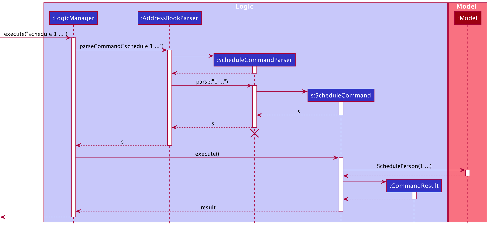
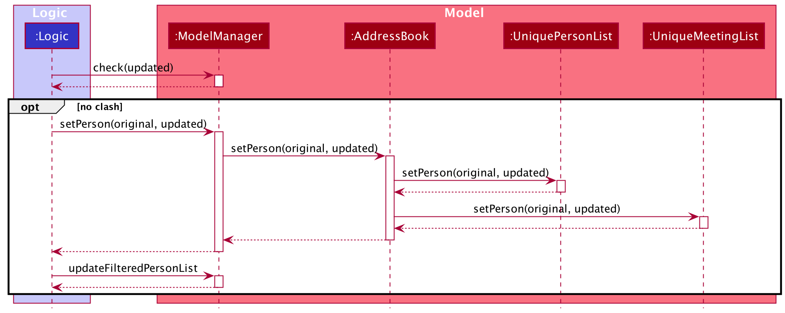

* Table of Contents
{:toc}

--------------------------------------------------------------------------------------------------------------------

## **Setting up, getting started**

Refer to the guide [_Setting up and getting started_](SettingUp.md).

--------------------------------------------------------------------------------------------------------------------

## **Design**

### Architecture

The ***Architecture Diagram*** given above explains the high-level design of the App. Given below is a quick overview of each component.

:bulb: **Tip:** The `.puml` files used to create diagrams in this document can be found in the [diagrams](https://github.com/AY2021S2-CS2103T-W12-3/tp/tree/master/docs/diagrams) folder. Refer to the [_PlantUML Tutorial_ at se-edu/guides](https://se-education.org/guides/tutorials/plantUml.html) to learn how to create and edit diagrams.

**`Main`** has two classes called [`Main`](https://github.com/AY2021S2-CS2103T-W12-3/tp/blob/master/src/main/java/seedu/address/Main.java) and [`MainApp`](https://github.com/AY2021S2-CS2103T-W12-3/tp/blob/master/src/main/java/seedu/address/MainApp.java). It is responsible for,
* At app launch: Initializes the components in the correct sequence, and connects them up with each other.
* At shut down: Shuts down the components and invokes cleanup methods where necessary.

[**`Commons`**](#common-classes) represents a collection of classes used by multiple other components.

The rest of the App consists of four components.

* [**`UI`**](#ui-component): The UI of the App.
* [**`Logic`**](#logic-component): The command executor.
* [**`Model`**](#model-component): Holds the data of the App in memory.
* [**`Storage`**](#storage-component): Reads data from, and writes data to, the hard disk.

Each of the four components,

* defines its *API* in an `interface` with the same name as the Component.
* exposes its functionality using a concrete `{Component Name}Manager` class (which implements the corresponding API `interface` mentioned in the previous point.

For example, the `Logic` component (see the class diagram given below) defines its API in the `Logic.java` interface and exposes its functionality using the `LogicManager.java` class which implements the `Logic` interface.

**How the architecture components interact with each other**

The *Sequence Diagram* below shows how the components interact with each other for the scenario where the user issues the command `delete 1`.

The sections below give more details of each component.

### UI component

**API** :
[`Ui.java`](https://github.com/AY2021S2-CS2103T-W12-3/tp/blob/master/src/main/java/seedu/address/ui/Ui.java)

The UI consists of a `MainWindow` that is made up of parts e.g.`CommandBox`, `ResultDisplay`, `PersonListPanel`, `StatusBarFooter` etc. All these, including the `MainWindow`, inherit from the abstract `UiPart` class.

The `UI` component uses JavaFx UI framework. The layout of these UI parts are defined in matching `.fxml` files that are in the `src/main/resources/view` folder. For example, the layout of the [`MainWindow`](https://github.com/se-edu/addressbook-level3/tree/master/src/main/java/seedu/address/ui/MainWindow.java) is specified in [`MainWindow.fxml`](https://github.com/se-edu/addressbook-level3/tree/master/src/main/resources/view/MainWindow.fxml)

The `UI` component,

* Executes user commands using the `Logic` component.
* Listens for changes to `Model` data so that the UI can be updated with the modified data.

### Logic component

**API** :
[`Logic.java`](https://github.com/AY2021S2-CS2103T-W12-3/tp/blob/master/src/main/java/seedu/address/logic/Logic.java)

1. `Logic` uses the `AddressBookParser` class to parse the user command.
1. This results in a `Command` object which is executed by the `LogicManager`.
1. The command execution can affect the `Model` (e.g. adding a person).
1. The result of the command execution is encapsulated as a `CommandResult` object which is passed back to the `Ui`.
1. In addition, the `CommandResult` object can also instruct the `Ui` to perform certain actions, such as displaying help to the user.

Given below is the Sequence Diagram for interactions within the `Logic` component for the `execute("delete 1")` API call.

:information_source: **Note:** The lifeline for `DeleteCommandParser` should end at the destroy marker (X) but due to a limitation of PlantUML, the lifeline reaches the end of diagram.

### Model component

**API** : 
[`Model.java`](https://github.com/AY2021S2-CS2103T-W12-3/tp/blob/master/src/main/java/seedu/address/model/Model.java)

The `Model`,

* stores a `UserPref` object that represents the user’s preferences.
* stores the address book data.
* exposes an unmodifiable `ObservableList<Person>` that can be 'observed' e.g. the UI can be bound to this list so that the UI automatically updates when the data in the list change.
* does not depend on any of the other three components.

:information_source: **Note:** An alternative (arguably, a more OOP) model is given below. It has a `Tag` list in the `AddressBook`, which `Person` references. This allows `AddressBook` to only require one `Tag` object per unique `Tag`, instead of each `Person` needing their own `Tag` object. 

### Storage component

**API** : [`Storage.java`](https://github.com/AY2021S2-CS2103T-W12-3/tp/blob/master/src/main/java/seedu/address/storage/Storage.java)

The `Storage` component,
* can save `UserPref` objects in json format and read it back.
* can save the address book data in json format and read it back.

### Common classes

Classes used by multiple components are in the `seedu.addressbook.commons` package.

--------------------------------------------------------------------------------------------------------------------

## **Implementation**

This section describes some noteworthy details on how certain features are implemented.

### \[Proposed\] Undo/redo feature

#### Proposed Implementation

The proposed undo/redo mechanism is facilitated by `VersionedAddressBook`. It extends `AddressBook` with an undo/redo history, stored internally as an `addressBookStateList` and `currentStatePointer`. Additionally, it implements the following operations:

* `VersionedAddressBook#commit()` — Saves the current address book state in its history.
* `VersionedAddressBook#undo()` — Restores the previous address book state from its history.
* `VersionedAddressBook#redo()` — Restores a previously undone address book state from its history.

These operations are exposed in the `Model` interface as `Model#commitAddressBook()`, `Model#undoAddressBook()` and `Model#redoAddressBook()` respectively.

Given below is an example usage scenario and how the undo/redo mechanism behaves at each step.

Step 1. The user launches the application for the first time. The `VersionedAddressBook` will be initialized with the initial address book state, and the `currentStatePointer` pointing to that single address book state.

Step 2. The user executes `delete 5` command to delete the 5th person in the address book. The `delete` command calls `Model#commitAddressBook()`, causing the modified state of the address book after the `delete 5` command executes to be saved in the `addressBookStateList`, and the `currentStatePointer` is shifted to the newly inserted address book state.

Step 3. The user executes `add n/David …​` to add a new person. The `add` command also calls `Model#commitAddressBook()`, causing another modified address book state to be saved into the `addressBookStateList`.

:information_source: **Note:** If a command fails its execution, it will not call `Model#commitAddressBook()`, so the address book state will not be saved into the `addressBookStateList`.

Step 4. The user now decides that adding the person was a mistake, and decides to undo that action by executing the `undo` command. The `undo` command will call `Model#undoAddressBook()`, which will shift the `currentStatePointer` once to the left, pointing it to the previous address book state, and restores the address book to that state.

:information_source: **Note:** If the `currentStatePointer` is at index 0, pointing to the initial AddressBook state, then there are no previous AddressBook states to restore. The `undo` command uses `Model#canUndoAddressBook()` to check if this is the case. If so, it will return an error to the user rather
than attempting to perform the undo.

The following sequence diagram shows how the undo operation works:

:information_source: **Note:** The lifeline for `UndoCommand` should end at the destroy marker (X) but due to a limitation of PlantUML, the lifeline reaches the end of diagram.

The `redo` command does the opposite — it calls `Model#redoAddressBook()`, which shifts the `currentStatePointer` once to the right, pointing to the previously undone state, and restores the address book to that state.

:information_source: **Note:** If the `currentStatePointer` is at index `addressBookStateList.size() - 1`, pointing to the latest address book state, then there are no undone AddressBook states to restore. The `redo` command uses `Model#canRedoAddressBook()` to check if this is the case. If so, it will return an error to the user rather than attempting to perform the redo.

Step 5. The user then decides to execute the command `list`. Commands that do not modify the address book, such as `list`, will usually not call `Model#commitAddressBook()`, `Model#undoAddressBook()` or `Model#redoAddressBook()`. Thus, the `addressBookStateList` remains unchanged.

Step 6. The user executes `clear`, which calls `Model#commitAddressBook()`. Since the `currentStatePointer` is not pointing at the end of the `addressBookStateList`, all address book states after the `currentStatePointer` will be purged. Reason: It no longer makes sense to redo the `add n/David …​` command. This is the behavior that most modern desktop applications follow.

The following activity diagram summarizes what happens when a user executes a new command:

#### Design consideration:

##### Aspect: How undo & redo executes

* **Alternative 1 (current choice):** Saves the entire address book.
  * Pros: Easy to implement.
  * Cons: May have performance issues in terms of memory usage.

* **Alternative 2:** Individual command knows how to undo/redo by
  itself.
  * Pros: Will use less memory (e.g. for `delete`, just save the person being deleted).
  * Cons: We must ensure that the implementation of each individual command are correct.

_{more aspects and alternatives to be added}_

### Scheduling meetings and Meeting List Display

#### Design consideration:

##### The current implementation

Currently, the implementation of the `Meeting` class is placing the `Meeting` as an attribute of  `Person`.
While this current implementation was designed at a time when the Meeting List on the screen was not in mind,
the implementation is kept as is. While it certainly makes more sense for extensions and many-to-many relations to 
adopt such a implementation, it would cause an issue where we would have to examine and update every meeting object
to edit the person if we were to update and change a Person as the current implementation does not give the `Person` 
object an immutable unique identifier upon construction. The identifier in this case - the name is mutable, and would
not suffice for immutability purposes.

As a result, the current implementation of the Meeting list takes in the `Person` class as the element of the list, and 
accesses the meeting attribute within the `Person` object when needed. To be more exact, the storage structure of the
`Meetings` is actually a `TreeMap` with the `Meeting` as the key and its owner `Person` as the value. `Meetings` are 
iterable and take the iteration value by the datetime of its occurence. The `Person` class is included in order to keep 
track of the owner of the `Meeting` and to avoid duplicity, which is not yet supported in this implementation. The 
`Meeting` list is then generated by taking the collection of values in the `TreeMap`.

In regards to the editing of the `UniqueMeetingList`, we implemented it in such a way that the meeting list is edited
everytime the `UniquePersonList` is edited. Hence the impact of the alteration only remains on the `Model` component and
the `UI` components, with the `Logic` component only impacted in terms of accessing the `Model`.

In the future, this implementation may be scraped in favor for an implementation where the `Meeting` class acts as the 
wrapper for the `Person` class, but for the sake of functionality, we shall keep the current implementation as is.

The implementation of the `ScheduleCommand` integrates both adding and removing for the sake of simplicity of
implementation as well as usability, as the team has concluded that having different commands that does similiar actions
in regards to the data is overkill and would be a hassle to implement and use. Hence, we've taken the liberty to set the
removal of a meeting as a type of "special input" case that is processed directly in the parser, rather than sending
into a further and smaller parser.

### Representing birthdates of clients

#### Current Implementation
The birthdate of each client is currently represented as a `LocalDate` object instead of a `String`. This allows us to 
use `LocalDate.parse()` to check for the validity of dates, as well as restricting the range of input dates from 
`1900-01-01` to `LocalDate.now()`.

#### Proposed Extension
One of the planned features is to alert the user if the birthday of a client is occurring in the upcoming week. This 
requires us to check through each person stored within the app to see whether their birthday (derived from their 
birthdate) occurs before `LocalDate.now().plusDays(7)`. This check will be done upon launching the app. If >=1 persons
have upcoming birthdays, a pop-up box will be served to the user to remind them of the birthdays.

--------------------------------------------------------------------------------------------------------------------

## **Documentation, logging, testing, configuration, dev-ops**

* [Documentation guide](Documentation.md)
* [Testing guide](Testing.md)
* [Logging guide](Logging.md)
* [Configuration guide](Configuration.md)
* [DevOps guide](DevOps.md)

--------------------------------------------------------------------------------------------------------------------

## **Appendix: Requirements**

### Product scope

**Target user profile**:

* is an insurance agent
* has a need to manage a significant number of contacts
* has a need to maintain close relations with clients over a long time period (usually 10+ years)
* prefer desktop apps over other types
* can type fast
* prefers typing to mouse interactions
* is reasonably comfortable using CLI apps

**Value proposition**:
* manage contacts faster than a typical mouse/GUI driven app
* maintain notes on their client, their needs, their likes/dislikes, insurance plans, applications for insurance claims, etc.
* get automated reminders about upcoming meetups/ notifications if they haven’t contacted clients in a long time.

### User stories

Priorities: High (must have) - `* * *`, Medium (nice to have) - `* *`, Low (unlikely to have) - `*`

| Priority | As a …​                                 | I want to …​                                             | So that I can…​                                                           |
| -------- | ------------------------------------------ | ----------------------------------------------------------- | ---------------------------------------------------------------------------- |
| `* * *`  | insurance agent                            | add a new client                                            |                                                                              |
| `* * *`  | insurance agent                            | view a list of all clients                                  | get an overview of all my clients                                            |
| `* * *`  | insurance agent                            | view a specific client and all of his/her information       | look up their personal information                                           |
| `* * *`  | insurance agent                            | delete a client                                             | remove clients that I am no longer serving                                   |
| `* * *`  | insurance agent                            | edit a client                                               | update clients' information without having to delete and add a new entry     |
| `* * *`  | insurance agent with many clients          | find a client by name                                       | locate details of client without having to go through the entire list        |
| `* * *`  | insurance agent with many clients          | filter clients by tag                                       | locate clients with a certain tag, without going through the entire list     |
| `* * *`  | new user                                   | clear all entries                                           | remove sample data and make it ready for me to use                           |
| `* * *`  | insurance agent                            | add contact information of each client                      | be able to conveniently check their contact when I need to get in touch      |
| `* * *`  | insurance agent                            | add important dates (e.g. birthdays) related to each client | keep track of client's personal information more easily                      |
| `* * *`  | insurance agent                            | check the age of each client                                | know if their insurance plan should be updated/ changed, as they get older   |
| `* * *`  | insurance agent                            | add the current insurance plan of each client               | be aware of their current insurance requirements and coverage                |
| `* * *`  | insurance agent                            | schedule meetings with people or groups of people           | keep track of upcoming meetings                                              |
| `* * `   | user with many persons in the address book | sort clients by criteria (name/age/premium/contract length) | locate clients more easily                                                   |
| `* * `   | new user                                   | see usage instructions                                      | refer to instructions when I forget how to use the App                       |
| `* * `   | first-time user                            | see sample entries already in the app                       | get a good idea of the functionalities of the app before deciding to use it  |
| `* * `   | forgetful insurance agent                  | reminders when clients' important dates are approaching     | prepare a meaningful greeting/ gift                                          |
| `* * `   | insurance agent                            | add likes & dislikes of each client                         | be thoughtful to them and prepare appropriate gifts                          |
| `* * `   | insurance agent                            | take notes about the personality of each client             | deal with them in a more effective way                                       |
| `* * `   | meticulous insurance agent                 | take notes about the insurance needs of each client         | recommend relevant plans and offerings                                       |
| `* * `   | insurance agent                            | track the status of claims made on behalf of clients        | update clients of the claims progress                                        |
| `* * `   | insurance agent                            | archive clients                                             | separate clients who have passed or have switched providers                  |
| `* * `   | insurance agent                            | pin clients to the top of the app                           | easily access clients that I am currently actively dealing with              |
| `* * `   | inexperienced insurance agent              | add photographs of each client                              | more easily identify them                                                    |
| `* * `   | expert user                                | create my own categories for grouping clients               | better organise and group my client contacts                                 |
| `* `     | first-time user                            | go through an interactive tutorial                          | learn how to use the app                                                     |
| `* `     | insurance agent                            | suggestions on what to do for clients' important dates      | save time on brainstorming for a gift                                        |
| `* `     | insurance agent                            | add hobbies of each client                                  | recommend certain plans if they partake in high-risk activities              |
| `* `     | social media savvy insurance agent         | add social media accounts of each client                    | keep up to date with their lifes and be attentive                            |
| `* `     | insurance agent                            | track the total claims amount made by each client           | recommend better plans and offerings if needed                               |
| `* `     | insurance agent                            | add info on the insurance plans of clients' family members  | give insurance advice for client's family                                    |
| `* `     | insurance agent                            | add info on the previous insurance plans of each client     | have a reference when recommending insurance plans                           |
| `* `     | insurance agent with few clients           | add potential clients                                       | contact and find new clients                                                 |
| `* `     | insurance agent                            | track the financial status of each client                   | better recommend plans, such as for investment                               |
| `* `     | insurance agent                            | add basic medical information of each client                | refuse new contracts in case of terminal illness                             |
| `* `     | expert user                                | create my own shortcuts for commonly performed actions      | save time on these actions                                                   |
| `* `     | expert user                                | disable certain UI elements that I do not use               | have a cleaner UI                                                            |

*{More to be added}*

### Use cases

(For all use cases below, the **System** is the `AddressBook` and the **Actor** is the `user`, unless specified otherwise)

**Use case: Add a person**

**MSS**

1.  User adds a person with corresponding information.
2.  AddressBook shows the list of persons.

    Use case ends.

**Extensions**

* 1a. The user's input format is invalid.
  
    * 1a1. AddressBook shows an error message.

      Use case resumes at step 1.

* 1b. The given tag is invalid/nonexistent.

    * 1b1. AddressBook shows an error message.

      Use case ends.

**Use case: Edit a person**

**MSS**

1.  User requests to list persons
2.  AddressBook shows the list of persons
3.  User requests to edit a specific person in the list
4.  AddressBook edits the person

    Use case ends.

**Extensions**

* 2a. The list is empty.

  Use case ends.

* 3a. The given index is invalid.

    * 3a1. AddressBook shows an error message.

      Use case resumes at step 2.

* 3b. No optional fields are given.

    * 3b1. AddressBook shows an error message.
      
      Use case resumes at step 2.

* 3c. The user input is invalid.
  
    * 3a1. AddressBook shows an error message.

      Use case resumes at step 2.

**Use case: Delete a person**

**MSS**

1.  User requests to list persons
2.  AddressBook shows a list of persons
3.  User requests to delete a specific person in the list
4.  AddressBook deletes the person

    Use case ends.

**Extensions**

* 2a. The list is empty.

  Use case ends.

* 3a. The given index is invalid.

    * 3a1. AddressBook shows an error message.

      Use case resumes at step 2.

**Use case: Scheduling a meetup with a client**

**MSS**

1.  User requests to list clients
2.  AddressBook shows a list of clients
3.  User requests to schedule a meeting a specific client in the list at a specified date and time
4.  AddressBook adds the specified client, as well as the specified date and time of the meeting, to the schedule list

    Use case ends.

**Extensions**

* 2a. The list is empty.

  Use case ends.

* 3a. The given index is invalid.

    * 3a1. AddressBook shows an error message.

      Use case resumes at step 2.

* 3b. The given date-and-time has an invalid syntax (eg. user input HH:MM_yyyy-mm-dd instead of yyyy-mm-dd_HH:MM
  (correct version))

    * 3b1. AddressBook shows an error message and reminds the user of the correct format.

      Use case resumes at step 2.

* 3c. The given date-and-time is invalid (eg. user input 2020-02-31_14:30)

    * 3c1. AddressBook shows an error message

      Use case resumes at step 2.

* 3d. The given date-and-time coincides with the meeting with another client (eg. user is meeting client no.24601 at
  2020/2/28 2:30 pm but is also meeting client no.24600 at the same time)

    * 3d1. AddressBook alerts the user that the meeting coincides with another meeting with a specified client
      and asks the user to double-check the meeting time (request user to input Y/N to proceed or cancel).

      If Y, use case continues to step 4. If N, user case resumes at step 2.

**Use case: Filter according to tag**

**MSS**

1.  User requests to search for persons according to tag.
2.  AddressBook shows the list of persons
    
    Use case ends.

**Extensions**

* 1a. The list is empty.

  Use case ends.

* 2a. The given tag is invalid/nonexistent.

    * 2a1. AddressBook shows an error message.

      Use case resumes at step 1.
    

*{More to be added}*

### Non-Functional Requirements

1.  Should work on any _mainstream OS_ as long as it has Java `11` or above installed.
2.  The software should not use any OS-dependent libraries and OS-specific features.
3.  Should be able to hold up to 1000 persons without a noticeable sluggishness in performance for typical usage.
4.  A user with above average typing speed for regular English text (i.e. not code, not system admin commands) should be able to accomplish most of the tasks faster using commands than using the mouse.
5.  The software should work without requiring an installer.
6.  The software should not depend on a remote server.
7.  The data should be stored locally and should be in a human editable text file.
8.  The software should be packaged into a single JAR file.
9.  The project is expected to adhere to a schedule that delivers a new iteration every two weeks.
10. The project JAR file should not exceed 100MB.
11. Project PDF files should not exceed 15MB each.
12. The Developer Guide and User Guide should be PDF-friendly and should not contain expandable panels, embedded videos and animated GIFs.

*{More to be added}*

### Glossary

* **Mainstream OS**: Windows, Linux, Unix, macOS
* **Private contact detail**: A contact detail that is not meant to be shared with others
* **Tag**: ...

--------------------------------------------------------------------------------------------------------------------

## **Appendix: Instructions for manual testing**

Given below are instructions to test the app manually.

:information_source: **Note:** These instructions only provide a starting point for testers to work on;
testers are expected to do more *exploratory* testing.

### Launch and shutdown

1. Initial launch

   1. Download the jar file and copy into an empty folder

   1. Double-click the jar file Expected: Shows the GUI with a set of sample contacts. The window size may not be optimum.

1. Saving window preferences

   1. Resize the window to an optimum size. Move the window to a different location. Close the window.

   1. Re-launch the app by double-clicking the jar file. 
       Expected: The most recent window size and location is retained.

1. _{ more test cases …​ }_

### Deleting a person

1. Deleting a person while all persons are being shown

   1. Prerequisites: List all persons using the `list` command. Multiple persons in the list.

   1. Test case: `delete 1` 
      Expected: First contact is deleted from the list. Details of the deleted contact shown in the status message. Timestamp in the status bar is updated.

   1. Test case: `delete 0` 
      Expected: No person is deleted. Error details shown in the status message. Status bar remains the same.

   1. Other incorrect delete commands to try: `delete`, `delete x`, `...` (where x is larger than the list size) 
      Expected: Similar to previous.

1. _{ more test cases …​ }_

### Saving data

1. Dealing with missing/corrupted data files

   1. _{explain how to simulate a missing/corrupted file, and the expected behavior}_

1. _{ more test cases …​ }_
