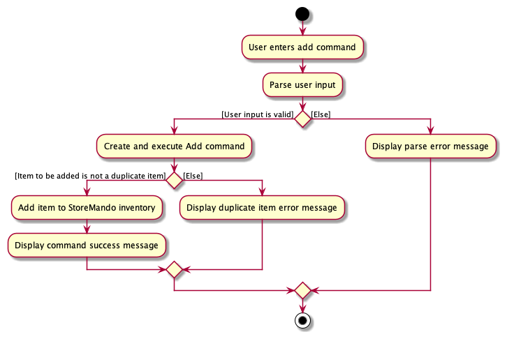

* Table of Contents
{:toc}

--------------------------------------------------------------------------------------------------------------------

## **Setting up, getting started**

Refer to the guide [_Setting up and getting started_](SettingUp.md).

--------------------------------------------------------------------------------------------------------------------

## **Introduction** 

Pawbook is a desktop application for dog school managers to facilitate their bookkeeping of puppies and dogs in the
school, optimized for input via a **Command Line Interface (CLI)** which caters to fast-typers who prefer to use a 
keyboard. You can navigate the application with ease and execute instructions by typing text-based commands in the 
command box provided without ever having to reach for your mouse!

## **Purpose** 

This document  aims to serve as a guide for developers, testers and designers who are interested in working on Pawbook. 
It describes both the design and architecture of Pawbook. 

## **Target User Profile**

The target user profile are dog school managers that own and manage the daily operations of the dog schools. They
handle a wide range of operations such as keeping track of the dogs under their care, arranging classes and taking care
of the dogs on a daily basis. They need a systematic way of maintaining their handle on the operations of their school
at all times.

## **Value Proposition**

In Singapore, dog schools are popular among dog owners. Besides day care, they also provide training,
grooming and workshops. With many moving parts daily, managing operations  can get overwhelming.
PawBook is an all-in-one management system to help dog school managers keep track of attendance, scheduling and services
and maintain organisation. At present, there is no such application to help dog school owners to organise and
manage their dog school currently. This application serves to increase the effectiveness and efficacy of dog schools
which in turn allows dog schools and its owners to take in more dogs. This application is necessary to help organise the
school's system. By increasing the intake of dogs in dog schools, this increases the number of trained dogs in Singapore
in general which solves the general problem of untrained dogs in Singapore being a nuisance to the public.

--------------------------------------------------------------------------------------------------------------------

## **Design**

### Architecture

The ***Architecture Diagram*** given above explains the high-level design of the App. Given below is a quick overview of each component.

**`Main`** has two classes called [`Main`](https://github.com/AY2021S2-CS2103T-T10-1/tp/blob/master/src/main/java/dog/pawbook/Main.java) and [`MainApp`](https://github.com/AY2021S2-CS2103T-T10-1/tp/blob/master/src/main/java/dog/pawbook/MainApp.java). It is responsible for:
* At app launch: Initializes the components in the correct sequence, and connects them up with each other.
* At shut down: Shuts down the components and invokes cleanup methods where necessary.

[**`Commons`**](#common-classes) represents a collection of classes used by multiple other components.

The rest of the App consists of four components.

* [**`UI`**](#ui-component): The UI of the App.
* [**`Logic`**](#logic-component): The command executor.
* [**`Model`**](#model-component): Holds the data of the App in memory.
* [**`Storage`**](#storage-component): Reads data from, and writes data to, the local persistent storage.

Each of the four components,

* defines its *API* in an `interface` with the same name as the Component.
* exposes its functionality using a concrete `{Component Name}Manager` class (which implements the corresponding API `interface` mentioned in the previous point.

For example, the `Logic` component (see the class diagram given below) defines its API in the `Logic.java` interface and exposes its functionality using the `LogicManager.java` class which implements the `Logic` interface.

**How the architecture components interact with each other**

The *Sequence Diagram* below shows how the components interact with each other for the scenario where the user issues the command `delete owner 1`.

The sections below give more details of each component.

### UI component

**API** :
[`Ui.java`](https://github.com/AY2021S2-CS2103T-T10-1/tp/blob/master/src/main/java/dog/pawbook/ui/Ui.java)

The UI consists of a `MainWindow` that is made up of parts e.g.`CommandBox`, `ResultDisplay`, `EntityListPanel`, `StatusBarFooter` etc. All these, including the `MainWindow`, inherit from the abstract `UiPart` class.

The `UI` component uses JavaFx UI framework. The layout of these UI parts are defined in matching `.fxml` files that are in the `src/main/resources/view` folder. For example, the layout of the [`MainWindow`](https://github.com/AY2021S2-CS2103T-T10-1/tp/blob/master/src/main/java/dog/pawbook/ui/MainWindow.java) is specified in [`MainWindow.fxml`](https://github.com/AY2021S2-CS2103T-T10-1/tp/blob/master/src/main/resources/view/MainWindow.fxml)

The `UI` component,

* Executes user commands using the `Logic` component.
* Listens for changes to `Model` data so that the UI can be updated with the modified data.

### Logic component

**API** :
[`Logic.java`](https://github.com/AY2021S2-CS2103T-T10-1/tp/blob/master/src/main/java/dog/pawbook/logic/Logic.java)

1. `Logic` uses the `PawbookParser` class to parse the user command.
2. This results in a `Command` object which is executed by the `LogicManager`.
3. The command execution can affect the `Model` (e.g. adding a owner).
4. The result of the command execution is encapsulated as a `CommandResult` object which is passed back to the `Ui`.
5. In addition, the `CommandResult` object can also instruct the `Ui` to perform certain actions, such as displaying help to the user.

Given below is the Sequence Diagram for interactions within the `Logic` component for the `execute("delete owner 1")` API call.

:information_source: **Note:** The lifeline for `DeleteOwnerCommandParser` should end at the destroy marker (X) but due to a limitation of PlantUML, the lifeline reaches the end of diagram.

### Model component

**API** : [`Model.java`](https://github.com/AY2021S2-CS2103T-T10-1/tp/blob/master/src/main/java/dog/pawbook/model/Model.java)

The `Model`,

* stores a `UserPref` object that represents the user’s preferences.
* stores the pawbook database data.
* exposes an unmodifiable `ObservableList<Entity>` that can be 'observed' e.g. the UI can be bound to this list so that the UI automatically updates when the data in the list change.
* does not depend on any of the other three components.

### Storage component

**API** : [`Storage.java`](https://github.com/AY2021S2-CS2103T-T10-1/tp/blob/master/src/main/java/dog/pawbook/storage/Storage.java)

The `Storage` component,
* can save `UserPref` objects in json format and read it back.
* can save the Pawbook Database data in json format and read it back.

### Common classes

Classes used by multiple components are in the `pawbook.commons` package.

--------------------------------------------------------------------------------------------------------------------

## **Implementation**

This section describes some noteworthy details on how certain features are implemented.

### Adding/Deleting feature

#### What it is

Pawbook manages more than one type of entity, each with their own unique attributes. An OOP approach is used here whereby both the `AddCommand` and `DeleteCommand` are generic classes that extends the `Command` class. This way any number of other classes extending `Entity` can be added/deleted as well.
Example: `add owner n/NAME p/PHONE e/EMAIL a/ADDRESS [t/TAG]..`

#### Implementation

The actual execution of these commands are largely the same and can be easily reimplemented to include more verification to the data if necessary, e.g. verifying that the owner ID refers to an actual owner instead of taking in an arbitrary number.

In order to generate the respective commands, the raw input needs to be parsed first. It is required that the user provide a second keyword right after the `add`/`delete` command keyword to indicate the correct entity type to be added. Using this information, the arguments can be forwarded to the correct parser from within `PawbookParser` to be further processed.

Given below is an example usage scenario and how the add command behaves at each step.

Step 1. The user launches the application and executes `add owner n/BRUCE p/92019201 e/bruce@example.com a/BLK 123 Adam Road t/friendly` to save an owner.

Step 2. The owner  is added to the model.

Below is an example activity diagram for a valid add command from the user.

Below is an example sequence diagram for a valid add command from the user.

Below is an example activity diagram for a valid delete command from the user.

Below is an example sequence diagram for a valid delete command from the user.

### Edit feature

Pawbook allows the user to `edit` an entity. For instance, the user may want to `edit`  some features of an owner. By entering the edit command with the correct identification number of the owner to be edited, the specified features of the owner will be modified accordingly.

In order to generate the respective commands, the raw input needs to be parsed first. It is required that the user provide a second keyword right after the `edit` command keyword to indicate the correct entity type to be edited. Using this information, the arguments can be forwarded to the correct parser from within `PawbookParser` to be further processed.

Below is an example activity diagram for a valid view command from the user.

### Find feature

Pawbook allows the users to `find` an entity based on keyword searches. The `find` function entertains multiple keyword
searches and reveals the entire list of commands that match one or more of the results.

When the user enters a valid command with the keyword searches, the arguments are parsed by the `FindCommmandParser` that
converts the string of arguments into a list, that is subsequently passed on to a `NameContainsKeywordsPredicate` instance
that uses the list of keywords to find the search results based on the supplied keywords.

This predicate is passed into the `ModelManager`'s `updateFilteredEntityList()` method and subsequently generates the
CommandResult instance that is then passed on in the LogicManager.

### View feature

Pawbook allows the user to `view` an entity and all its related entities. For instance, the user may want to `view` all the dogs of one particular owner or all the dogs enrolled in a program. By entering the correct view command with the correct identification number, the entire list will be generated.

When the user enters a valid command with the target entity ID, the ViewCommandParser will firstly parse the command and store the ID as an integer that is then passed on to as a parameter into the constructor method of a new ViewCommand instance.

Subsequently, once the new `ViewCommand` instance has been created, in its execute method, it will retrieve the entity via the ID that was passed in, from the `ModelManager`. With a handle on the target entity now, we build a list consisting of the entity IDs that are to be shown as search results.

Based on the class type of the target entity, we will reveal the search results accordingly. If the target entity is a `Dog`, then we will show the relevant owner profile. If the target entity is a `Owner`, then we will list out all of the owner's dogs. Similar to owner, for `Program`, we will reveal the full list of dogs enrolled in that program.

This list is subsequently passed on to the `RelatedEntityPredicate` that will later be used in the ModelManager's `updatefilteredEntityList())` method to finally reveal the search results.

Below is an example activitiy diagram for a valid view command from the user.

### Enrol feature

Pawbook supports the enrolling of specific dogs into specific programs.

In order to enrol a dog into a program, the raw input needs to be parsed first. It is required that the user provides 2 parameters, namely `dogId` and `programId`. These inputs have the prefix `/d` and `/p`, and is followed by an integer. Using this information, the arguments will be forwarded to the `EnrolCommandParser` from within `PawbookParser`, which converts the String input to int.

Below is an example activity diagram for a valid enrol command from the user.

Below is an example sequence diagram for a valid enrol command from the user.

### Drop feature

While Pawbook allows the enrolling of dogs into programs, conversely it supports dropping previously-enrolled dogs from the programs.

To drop a dog from a program, the raw input is parsed and goes through several checks to ensure that the provided dog and program IDs are both valid and are indeed referring to dog and program objects respectively. Subsequently, the arguments will be forwarded to `DropCommandParser` followed by `PawbookParser` where they are converted from the String input to int.

Below is an example activity diagram for a valid drop command from the user.

Below is an example sequence diagram for a valid drop command from the user.

1. The `LogicManager` uses the `PawbookParser` to parse the given user input.
1. The `PawbookParser` will identify the command given by the user based on the first command word and pass the user input down to `EnrolDropCommandParser`.
1. The `EnrolDropCommandParser` will then create a `dropCommand` object with the user input `dogIdSet` and `programIdSet` as input parameters, in this case,
`dogIdSet` will be [2] and `programIdSet` will be [3].
1. The `EnrolDropCommandParser` will then return a `enrolCommand` object.
1. The `LogicManager` will now call the execute method in the `dropCommand` object.
1. The `DropCommand` will now call the `updateFilteredEntityList` method of the existing `Model` object.
1. The `DropCommand` will now create a `CommandResult` object and returns it, indicating a successful execution of the `DropCommand`.

Here is a more specific breakdown of the command's execute method.

1. The `LogicManager` will call the execute method in the `DropCommand` object. 
1. The `DropCommand` will then call the `checkIdValidity` method of the existing `Model` object.
1. If the ID is valid, the `DropCommand` will create an `IdMatchPredicate` object.
1. The `DropCommand` will call the `updateFilteredEntityList` method of the existing `Model` object update the `IdMatchPredicate` object into Pawbook.
1. The `DropCommand` then creates a `CommandResult` object and returns it, indicating the successful updating of the `IdMatchPredicate` object. 

### Alternate implementations

As dogs and programs can also be identified by their respective names instead of IDs, another implementation could be replacing the parameters of `dogId` and `programId` with their respective names.

However, this requires there to be no duplicate dog or program names.

--------------------------------------------------------------------------------------------------------------------

## **Documentation, logging, testing, configuration, dev-ops**

* [Documentation guide](Documentation.md)
* [Testing guide](Testing.md)
* [Logging guide](Logging.md)
* [Configuration guide](Configuration.md)
* [DevOps guide](DevOps.md)

--------------------------------------------------------------------------------------------------------------------

## **Appendix: Requirements**

### Product Scope

**Target user profile**:

* Has a need to manage a significant number of dogs and owners
* Prefers desktop apps over other types
* Is a fast typist
* Prefers typing to mouse interactions
* Is reasonably comfortable using CLI apps
* Prefers a portable and lightweight application

**Value proposition**:

* Manages contacts faster than a typical mouse/GUI driven app
* Saves significant time for the business owner, who beforehand had to manage the details of dogs and owners
* Consolidates information on dogs, owners and programs into one place
* Clutter-free user interface
* Application is optimised for keyboard navigation 

### User Stories

Priorities: High (must have) - `* * *`, Medium (nice to have) - `* *`, Low (unlikely to have) - `*`

| Priority | As a …​                                    | I want to …​                     | So that I can…​                                                        |
| -------- | ------------------------------------------ | ------------------------------ | ---------------------------------------------------------------------- |
| `* * *`  | Dog school manager   | Create a list of dogs and their respective owners in the dog school        | Keep track of the dogs we are responsible for     |
| `* * *`  | Busy owner          | Delete dog profiles and owner profiles            | Remove dogs or owners that are no longer in the school                                                           |
| `* * *`  | Dog school manager   | Add dog profiles and owner profiles             |  Add new dogs or owners that join the school         |
| `* * *`  | Dog school manager   | Get instructions         | Get help when I do not know how to use the application |
| `* * *`  | Dog school manager   | Exit the application   |           |
| `* *`    | Dog school manager   | Edit a dog profile when the information is wrong/outdated |                                             |
| `* *`    | Dog school manager   | Create a dog program for the dog students            |                                                  |
| `* *`    | Dog school manager   | Enrol dogs into a specific dog program | Dogs who recently joined a program are added to the class list |
| `* *`    | Dog school manager   | Drop dogs out of a specific dog program | Dogs that have left the class are no longer in the class list  |
| `* *`    | Advanced user        | Edit in bulk quickly without having to be familiar with the app | Minimize chance of someone else seeing them by accident |

*{More to be added}*

### Use cases

(For all use cases below, the **System** is the `Pawbook` and the **Actor** is the `user`, unless specified otherwise)

**Use case: UC01 - Add a dog/owner profile or program**

**MSS**

1.  User requests to add a dog/owner profile or program to the list.
2.  Pawbook adds the dog/owner.

    Use case ends.

**Extensions**

* 1a. Missing mandatory dog/owner/program details.

    * 1a1. Pawbook shows an error message.
    * 1a2. User supplies missing details.

      Use case resumes at step 2.

*Note:* The mandatory details here refer to name, breed, owner ID for dogs; name, phone number, email and address for owners; name and time for programs.

**Use case: UC02 - Delete a dog/owner profile or program**

**MSS**

1.  User requests to delete a specific dog/owner profile or program in the list.
2.  Pawbook deletes the dog/owner profile or program.

    Use case ends.

**Extensions**

* 1a. The given dog/owner/program ID is invalid or not specified.

    * 1a1. Pawbook shows an error message.
    * 1a2. User supplies the corrected dog/owner/program ID.

      Use case resumes at step 2.

**Use case: UC03 - List**

**MSS**

1.  User requests to list dog/owner/program.
2.  Pawbook lists the related dogs/owners/programs.

    Use case ends.

**Use case: UC04 - Enrol dog to program**

**MSS**

1.  User requests to enrol dog to program.
2.  Pawbook enrols the dog to the correct program.

    Use case ends.

**Extensions**

* 1a. The dog/program ID is invalid/not specified.

    * 1a1. Pawbook shows an error message.
    * 1a2. User supplies correct dog/program ID.

      Use case resumes at step 2.
    
* 1b. The user requests to enrol multiple dogs to multiple programs.

    * 1b1. Pawbook shows an error message.
    * 1b2. User changes request to either enrolling one dog to one program, one dog to multiple programs, or multiple dogs to one program.
    
    Use case resumes at step 2.

**Use case: UC05 - Drop dog from program**

**MSS**

1.  User requests to drop dog from program.
2.  Pawbook drops dog from the correct program.

    Use case ends.

**Extensions**

* 1a. The dog/program ID is invalid/not specified.

    * 1a1. Pawbook shows an error message.
    * 1a2. User supplies correct dog/program ID.

      Use case resumes at step 2.

* 1b. The user requests to drop multiple dogs from multiple programs.

    * 1b1. Pawbook shows an error message.
    * 1b2. User changes request to either dropping one dog from one program, one dog from multiple programs, or multiple dogs from one program.

  Use case resumes at step 2.

**Use case: UC06 - View schedule**

**MSS**

1.  User requests to view schedule.
2.  Pawbook shows the schedule.

    Use case ends.

**Use case: UC07 - View Help**

**MSS**

1.  User requests to for help with using the application.
2.  User enters `help` command into the command box and presses <kbd>enter</kbd>.   
3.  Pawbook opens a help window containing the link to the user guide
and also a command summary for the user.

    Use case ends.

**Extensions**

- 2a. The given command/format is invalid.
    - 2a1. Pawbook shows an error message to the user.
    Use case resumes at step 2.
      

**Use case: UC08 - Exit Pawbook**

**MSS**

1.  User requests to exit Pawbook.
2.  User enters the `exit` command into the command box and presses <kbd>enter</kbd>.    
2.  Pawbook shows goodbye message.
3.  Pawbook terminates.

    Use case ends.

**Extensions**

- 2a. The given command/format is invalid.
    - 2a1. Pawbook shows an error message to the user.
      Use case resumes at step 2.

*{More to be added}*

### Non-Functional Requirements

1.  Should work on any [mainstream OS](#glossary-OS) as long as it has `Java 11` or above installed.
2.  Should be able to hold up to 1000 dogs, owners and dog programs without a noticeable sluggishness in performance for typical usage.
3.  Should be usable by a tech novice who is not familiar with CLI.
4.  Should respond within 2 seconds.
5.  A user with above average typing speed for regular English text (i.e. not code, not system admin commands)
    should be able to accomplish most of the tasks faster using commands than using the mouse.
6.  A simple interface that is easy to navigate.
7.  Not required to handle finance-related bookkeeping.
8.  Should not crash or throw unexpected errors when internet connection is
    unavailable.

### Glossary

* **Mainstream OS**:  Windows, Linux, Unix, OS-X
* **JSON**: JSON is short for **JavaScript Object Notation** which is a lightweight format for data storage 

--------------------------------------------------------------------------------------------------------------------

## **Appendix: Instructions for manual testing**

Given below are instructions to test the app manually. These instructions should be complemented with the user
guide for comprehensive testing. The state of the application is assumed to contain the sample data from when the 
application is first launched.

:information_source: **Note:** These instructions only provide a starting point for testers to work on;
testers are expected to do more *exploratory* testing.

### Launch and shutdown

1. Initial launch

   1. Download the jar file and copy into an empty folder

   1. Double-click the jar file  
      Expected: Shows the GUI with a set of sample contacts. The window size may not be optimum.

1. Saving window preferences

   1. Resize the window to an optimum size. Move the window to a different location. Close the window.

   1. Re-launch the app by double-clicking the jar file. 
       Expected: The most recent window size and location is retained.

1. Exiting the app

    1. With the application still open, enter `exit` in the command box or click on the close window button [X]. 
       Expected: Application terminates.   
      
1. For the sake of all manual testing, we will be using the preset typical entities loaded from Pawbook database.
      
### Add Command 

1. Adding a dog

    1. Prerequisites: Pawbook is launched and running.

    1. Test case: `add dog n/Bruce b/Chihuahua d/12-02-2019 s/Male o/1 t/playful t/active`  
       Expected: If database does not already contain a Bruce, a successful command result should show.

    1. Test case: `add dog o/1 b/Chihuahua d/12-02-2019 n/Bruce s/Male t/playful t/active`  
       Expected: Similar to previous.

    1. Test case : `add dog o/1 b/Chihuahua d/12-02-2019 n/Bruce t/playful t/active`  
       Expected: Missing parameters, status message indicates invalid command format.

1. Adding an owner 

    1. Prerequisites: Pawbook is launched and running. 
    
    1. Test case: `add owner n/John Doe p/98765432 e/johnd@example.com a/311, Clementi Ave 2, #02-25 t/friends t/owesMoney`  
        Expected: If database does not already contain a John Doe, a successful command result should show. 
       
    1. Test case: `add owner n/John Doe a/311, Clementi Ave 2, #02-25 e/johnd@example.com p/98765432  t/friends t/owesMoney`  
        Expected: Similar to previous.
       
    1.  Test case : `add owner n/John Doe p/98765432 e/johnd@example.com a/311, Clementi Ave 2, #02-25 t/friends t/owesMoney`  
        Expected: Missing parameter, status message indicates invalid command format.
        
1. Adding a program 

    1. Prerequisites: Pawbook is launched and running.

    1. Test case: `add program n/Obedience Training s/01-02-2021 18:00 t/puppies`  
       Expected: If database does not already contain a Bruce, a successful command result should show.
       
    1. Test case: `add program s/01-02-2021 n/Obedience Training 18:00 t/puppies`  
       Expected: Similar to previous.

    1. Test case : `add program n/Obedience Training t/puppies`  
       Expected: Missing parameters, status message indicates invalid command format.
        
### Delete Command

1. Deleting an owner while all owners are being shown

    1. Prerequisites: List all owners using the `list owner` command. Multiple owners in the list.

    1. Test case: `delete owner 1` 
       Expected: Owner with ID 1 is deleted from the list. All the dogs belonging to the first owner is also deleted. 
       Details of the deleted contact shown in the status message. Timestamp in the status bar is updated. 

    1. Test case: `delete owner 0` 
       Expected: No owner is deleted. Error details shown in the status message. Status bar remains the same.
       
    1. Test case: `delete owner 2`  
       Expected: No owner is deleted as ID 2 is not an owner. Error details shown in the status message. Status bar remains the same.

    1. Other incorrect delete commands to try: `delete owner`, `delete owner x`, `delete owner -x` (where x is larger than list size or negative) 
       Expected: Similar to previous.
       
1. Deleting a dog while all dogs are being shown 

    1. Prerequisites: List all dogs using the `list dog` command. Multiple dogs in the list. 
    
    1. Test case: `delete dog 2`  
       Expected: Dog with ID 2 is deleted from the list. The dogs will also be removed from all programs they were previously
       enrolled in.

    1. Test case: `delete dog 0` 
      Expected: No dog is deleted. Error details shown in the status message. Status bar remains the same.

    1. Test case: `delete dog 1` 
      Expected: No owner is deleted as ID 1 is not a dog. Error details shown in the status message. Status bar remains the same.

    1. Other incorrect delete commands to try: `delete dog`, `delete dog x`, `delete dog -x` (where x is larger than list size or negative) 
      Expected: Similar to previous.

1. Deleting a program while all programs are being shown

    1. Prerequisites: List all programs using the `list program` command. Multiple programs in the list.

    1. Test case: `delete program 3` 
       Expected: Program with ID 3 is deleted from the list. The dogs that were enrolled in the program will no longer be enrolled in that program. 
       
    1. Test case: `delete program 0` 
       Expected: No program is deleted. Error details shown in the status message. Status bar remains the same.

    1. Test case: `delete program 1` 
       Expected: No owner is deleted as ID 1 is not a dog. Error details shown in the status message. Status bar remains the same.

    1. Other incorrect delete commands to try: `delete program`, `delete program x`, `delete program -x` (where x is larger than list size or negative) 
       Expected: Similar to previous.
       
### Edit Command

1. Pre-requisites

    1. Start with an empty database by deleting all entities.

    1. Add a sample owner with `add owner n/John Doe p/98765432 e/johnd@example.com a/311, Clementi Ave 2, #02-25 t/friends t/owesMoney`. Ensure John Doe has ID 1.

    1. Add a sample dog with `add dog n/Bruce b/Chihuahua d/12-02-2019 s/Male o/1 t/playful t/active`

    1. Add a sample program with `add program n/Obedience Training s/01-02-2021 18:00 t/puppies`
    
    1. Add another sample owner with `add owner n/James Bond p/90139122 e/jamesbond@example.com a/322, Clementi Ave 2, #02-25 t/friends t/owesMoney` Ensure James Bond has ID 4. 

1. Editing a dog

    1. Test case: `edit dog 2 n/Milo` 
       Expected: Successfully renamed Bruce to Milo. 
       
    1. Test case: `edit dog 2 n/Bruce o/4`
       Expected: Successfully renamed Milo to Bruce and changed owner from John Doe to James Bond. 
       
    1. Test case: `edit dog 3 n/Milo o/4`
       Expected: Error status message shown, indicating dog ID provided is invalid. 

1. Editing an owner 

    1. Test case: `edit owner 1 p/91234567`
       Expected: Successfully changes John Doe's number. 

    1. Test case: `edit owner 1 p/97538642 e/ilovedogs@sample.com`
       Expected: Successfully changed John Doe's number and updated his email.

    1. Test case: `edit owner 3 n/Keith`
       Expected: Error status message shown, indicating owner ID provided is invalid.

1. Editing a program 

    1. Test case: `edit program 3 n/Kennel Training`
       Expected: Successfully renamed Obedience Training to Kennel Training. 

    1. Test case: `edit program 3 n/Kennel Training s/01-02-2021 17:00`
       Expected: Successfully renamed Obedience Training to Kennel Training and changes the session date to 1700 from 1800. 

    1. Test case: `edit program 4 n/Kennel Training s/01-02-2021 17:00`
       Expected: Error status message shown, indicating program ID provided is invalid.

### Find Command 

1. Find valid entities

    1. Prerequisites: Application is running. List being shown does not matter. 

    1. Test case: `Find Carl` 
       Expected: Carl with ID 5 is shown on the display list. Status message says "1 entity listed!"

    1. Test case: `Find Car` 
       Expected: Similar to previous. 

    1. Test case: `Find Car` 
       Expected: Similar to previous. 

    1. Test case: `find carl` 
       Expected: Similar to previous  
       
    1. Test case: `find Elsa Flora Genie`  
       Expected: Else, Flora and Genie are displayed on the list. Status messages says: "3 entities listed!"
       
1. Finding invalid entities

    1. Test case: `find InvalidName` 
       Expected: Zero entities listed. 
       
    1. Test case: `find 12345`  
       Expected: Zero entities listed. 
       
### List Command

1. Listing dogs 

    1. Test case: `list dog` 
       Expected: All the dogs in the school listed. 

1. Listing owners

    1. Test case: `list owner` 
       Expected: All the owners in the school listed.

1. Listing program

    1. Test case: `list program` 
       Expected: All the programs in the school listed.

1. Invalid List commands

    1. Test case: `list`  
       Expected: Error message indicates unknown entity, shows supported entities.
       
    1. Test case: `list invalidEntity`  
       Expected: Similar to previous. 
       
### View Command 

1. Pre-requisites

    1. Start with an empty database by deleting all entities. 
    
    1. Add a sample owner with `add owner n/John Doe p/98765432 e/johnd@example.com a/311, Clementi Ave 2, #02-25 t/friends t/owesMoney`. Ensure John Doe has ID 1. 
    
    1. Add a sample dog with `add dog n/Bruce b/Chihuahua d/12-02-2019 s/Male o/1 t/playful t/active`

    1. Add a sample program with `add program n/Obedience Training s/01-02-2021 18:00 t/puppies`
    
    1. Enrol Bruce into Obedience Training with `enrol d/2 p/3`
    
    1. Ensure that Bruce is successfully added to the Obedience Training program. 
    
1. Viewing owner 

    1. Test case: `view 1`
       Expected: John's and Bruce's contacts are listed. John Doe's contact is at the top, followed by Bruce.
       
1. Viewing dog 
    
    1. Test case: `view 2`
       Expected: John, Bruce and Obedience Training program is listed. Bruce's contact is at the top, followed by John, 
        followed by Obedience Training. 

1. Viewing program

    1. Test case: `view 3`
       Expected: Bruce and Obedience Training program is listed. Obedience training details are at the top, followed by Bruce's details. 
       
1. Invalid view ID 

    1. Test case: `view 4`
       Expected: Error status message is provided, indicating invalid ID. 
       
    1. Test case: 'view -1'
       Expected: Similar to previous. 

### Schedule Command 

1. Pre-requisites 

    1. Start with an empty database by deleting all entities. 

    1. Add a sample program with `add program n/Obedience Training 1 s/[TODAY'S DATE] 18:00 t/puppies`. Fill in today's
      date in the `[TODAY'S DATE]` field.

    1. Add a sample program with `add program n/Obedience Training 2 s/01-02-2021 18:00 t/puppies`
    
    1. Ensure that sample programs are successfully added. 

1. Viewing schedules on a valid day 

    1. Test case: `schedule`  
       Expected: Successful status message, shows the sample Obedience Training 1 happening today.

    1. Test case: `schedule 01-02-2021`  
       Expected: Successful status message, shows the sample Obedience Training 1 happening on 01-02-2021. 
       
    
1. Viewing schedules on an invalid day 

    1. Test case: `schedule 31-02-2021`
       Expected: Error status message thrown, indicating day of the month does not exist.
       
    1. Test case: `schedule 031-02-2021`
       Expected: Error status message thrown, indicating that date format should be in dd-MM-yyyy format. 
       
### Enrol Command 

1. Pre-requisites

    1. Start with an empty database by deleting all entities.

    1. Add a sample owner with `add owner n/John Doe p/98765432 e/johnd@example.com a/311, Clementi Ave 2, #02-25 t/friends t/owesMoney`. Ensure John Doe has ID 1.

    1. Add a sample dog with `add dog n/Bruce b/Chihuahua d/12-02-2019 s/Male o/1 t/playful t/active` Ensure Bruce has ID 2.

    1. Add a sample program with `add program n/Obedience Training s/01-02-2021 18:00 t/puppies` Ensure Obedience Training has ID 3.
    
1. Enrol valid dog into valid program 

    1. Test case: `enrol d/2 p/3`  
       Expected: Bruce is successfully added to the Obedience Training program.
       
1. Enrol valid dog into invalid program 

    1. Test case: `enrol d/2 p/4`  
       Expected: Error status message stating program ID is invalid.  

1. Enrol invalid dog into valid program 

    1. Test case:  `enrol d/3 p/3`  
       Expected: Error status message stating dog ID is invalid.
       
1. Enrol multiple valid dogs into valid program

    1. Repeat Pre-requisites
    
    1. Add another sample dog with `add dog n/Apple b/Golden Retriever d/28-04-2020 s/Female o/1 t/friendly` Ensure Apple as ID 4.
    
    1. Test case: `enrol d/2 d/4 p/3`  
        Expected: Bruce and Apple are successfully added to the Obedience Training program.
        
1. Enrol one valid dog into multiple valid programs

    1. Repeat Pre-requisites
    
    1. Add another sample program with `add program n/Potty Training s/14-03-2021 12:00 t/puppies` Ensure Potty Training has ID 4.
    
    1. Test case: `enrol d/2 p/3 p/4`  
        Expected: Bruce is successfully added to the Obedience Training program and the Potty Training program.
        
1. Enrol multiple valid dogs into multiple valid programs
    
    1. Repeat Pre-requisites
    
    1. Add another sample dog with `add dog n/Apple b/Golden Retriever d/28-04-2020 s/Female o/1 t/friendly` Ensure Apple has ID 4.
    
    1. Add another sample program with `add program n/Potty Training s/14-03-2021 12:00 t/puppies` Ensure Potty Training has ID 5.
        
    1. Test case: `enrol d/2 d/4 p/3 p/5 `  
        Expected: Error messaging stating that enrollment of multiple dogs into multiple programs is not supported.
       
1. Invalid enrol command 

    1. Test case: `enrol invalidCommand`
       Expected: Error status message indicating wrong command format.  

### Drop Command 

1. Pre-requisites

    1. Start with an empty database by deleting all entities.

    1. Add a sample owner with `add owner n/John Doe p/98765432 e/johnd@example.com a/311, Clementi Ave 2, #02-25 t/friends t/owesMoney`. Ensure John Doe has ID 1.

    1. Add a sample dog with `add dog n/Bruce b/Chihuahua d/12-02-2019 s/Male o/1 t/playful t/active`. Ensure Bruce has ID 2.

    1. Add a sample program with `add program n/Obedience Training s/01-02-2021 18:00 t/puppies` Ensure Obedience Training has ID 3.

1. Drop valid dog from valid program

    1. Enrol dog into program with: `enrol d/2 p/3`
    
    1. Test case: `drop d/2 p/3`  
       Expected: Bruce is successfully dropped from Obedience Training program.

1. Drop valid dog from invalid program

    1. Enrol dog into program with: `enrol d/2 p/3`
    
    1. Test case: `drop d/2 p/4`  
       Expected: Error status message stating program ID is invalid.

1. Drop invalid dog from valid program

    1. Enrol dog into program with: `enrol d/2 p/3`

    1. Test case:  `drop d/3 p/3`  
       Expected: Error status message stating dog ID is invalid.
       
1. Drop multiple valid dogs from valid program

    1. Repeat Pre-requisites
    
    1. Add another sample dog with `add dog n/Apple b/Golden Retriever d/28-04-2020 s/Female o/1 t/friendly` Ensure Apple as ID 4.
    
    1. Enrol dogs into program with: `enrol d/2 d/4 p/3`
    
    1. Test case: `drop d/2 d/4 p/3`  
        Expected: Bruce and Apple are successfully added to the Obedience Training program.
        
1. Drop one valid dog from multiple valid programs

    1. Repeat Pre-requisites
    
    1. Add another sample program with `add program n/Potty Training s/14-03-2021 12:00 t/puppies` Ensure Potty Training has ID 4.
    
    1. Enrol dog into programs with: `enrol d/2 p/3 p/4`
    
    1. Test case: `drop d/2 p/3 p/4`  
        Expected: Bruce is successfully added to the Obedience Training program and the Potty Training program.
        
1. Drop multiple valid dogs from multiple valid programs
    
    1. Repeat Pre-requisites
    
    1. Add another sample dog with `add dog n/Apple b/Golden Retriever d/28-04-2020 s/Female o/1 t/friendly` Ensure Apple has ID 4.
    
    1. Add another sample program with `add program n/Potty Training s/14-03-2021 12:00 t/puppies` Ensure Potty Training has ID 5.
        
    1. Enrol dog into program with: `enrol d/2 p/3` and `enrol d/4 p/5`
    
    1. Test case: `drop d/2 d/4 p/3 p/5 `  
        Expected: Error messaging stating that droplment of multiple dogs from multiple programs is not supported.

1. Invalid drop command

    1. Test case: `drop invalidCommand`
       Expected: Error status message indicating wrong command format.
       
### Help Command

1. Test case: `help` 
   Opens a pop-up window that shows the command summary and

### Exit Command

1. Test case: `exit` 
    1. Expected: The program should exit and close.

### Saving data

1. Dealing with missing/corrupted data files

   1. _{explain how to simulate a missing/corrupted file, and the expected behavior}_

1. _{ more test cases …​ }_
