* Table of Contents
{:toc}

--------------------------------------------------------------------------------------------------------------------

## **Setting up, getting started**

Refer to the guide [_Setting up and getting started_](SettingUp.md).

--------------------------------------------------------------------------------------------------------------------

## **Design**

### Architecture

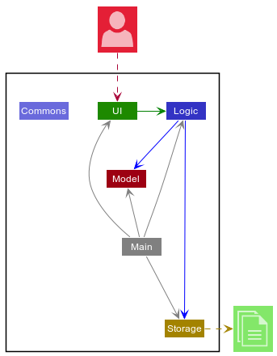

The ***Architecture Diagram*** given above explains the high-level design of the App. Given below is a quick overview of each component.

:bulb: **Tip:** The `.puml` files used to create diagrams in this document can be found in the [diagrams](https://github.com/AY2021S2-CS2103-W17-3/tp/tree/master/docs/diagrams/) folder. Refer to the [_PlantUML Tutorial_ at se-edu/guides](https://se-education.org/guides/tutorials/plantUml.html) to learn how to create and edit diagrams.

**`Main`** has two classes called [`Main`](https://github.com/AY2021S2-CS2103-W17-3/tp/tree/master/src/main/java/seedu/booking/Main.java) and [`MainApp`](https://github.com/AY2021S2-CS2103-W17-3/tp/tree/master/src/main/java/seedu/booking/MainApp.java). It is responsible for,
* At app launch: Initializes the components in the correct sequence, and connects them up with each other.
* At shut down: Shuts down the components and invokes cleanup methods where necessary.

[**`Commons`**](#common-classes) represents a collection of classes used by multiple other components.

The rest of the App consists of four components.

* [**`UI`**](#ui-component): The UI of the App.
* [**`Logic`**](#logic-component): The command executor.
* [**`Model`**](#model-component): Holds the data of the App in memory.
* [**`Storage`**](#storage-component): Reads data from, and writes data to, the hard disk.

Each of the four components,

* defines its *API* in an `interface` with the same name as the Component.
* exposes its functionality using a concrete `{Component Name}Manager` class (which implements the corresponding API `interface` mentioned in the previous point.

For example, the `Logic` component (see the class diagram given below) defines its API in the `Logic.java` interface and exposes its functionality using the `LogicManager.java` class which implements the `Logic` interface.

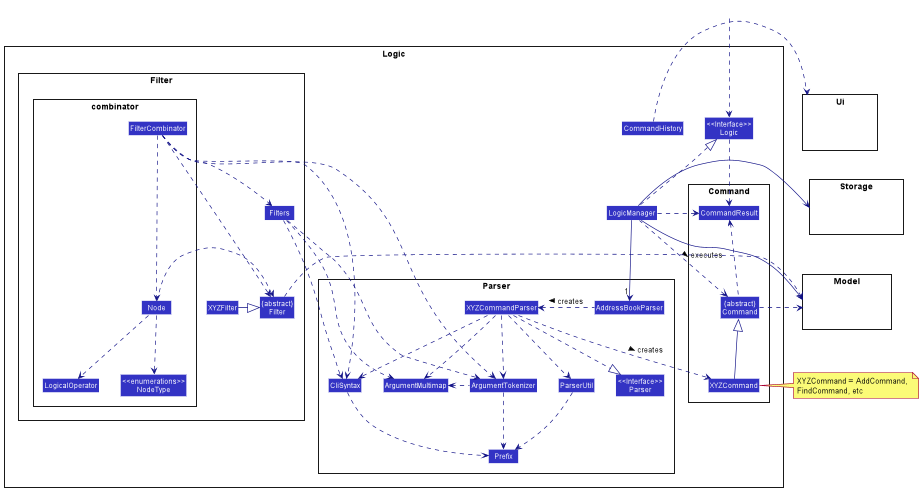

**How the architecture components interact with each other**

The *Sequence Diagram* below shows how the components interact with each other for the scenario where the user issues the command `delete 1`.

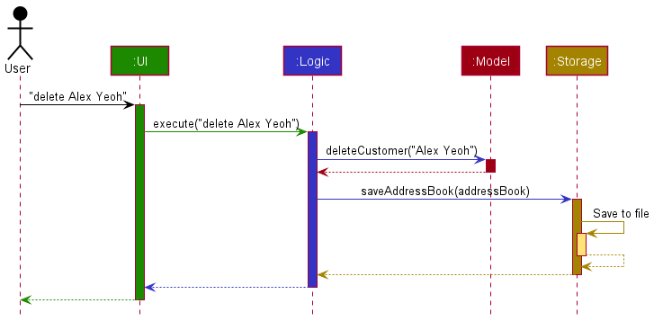

The sections below give more details of each component.

### UI component

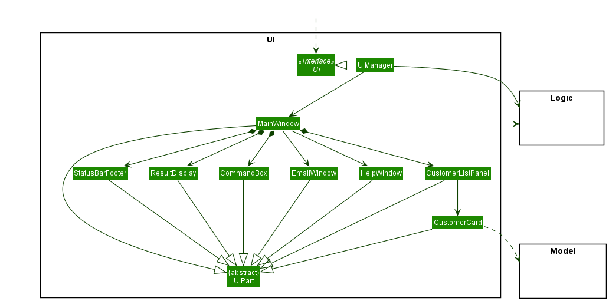

**API** :
[`Ui.java`](https://github.com/AY2021S2-CS2103-W17-3/tp/tree/master/src/main/java/seedu/booking/ui/Ui.java)

The UI consists of a `MainWindow` that is made up of parts e.g.`CommandBox`, `ResultDisplay`, `PersonListPanel`, `StatusBarFooter` etc. All these, including the `MainWindow`, inherit from the abstract `UiPart` class.

The `UI` component uses JavaFx UI framework. The layout of these UI parts are defined in matching `.fxml` files that are in the `src/main/resources/view` folder. For example, the layout of the [`MainWindow`](https://github.com/AY2021S2-CS2103-W17-3/tp/tree/master/src/main/java/seedu/booking/ui/MainWindow.java) is specified in [`MainWindow.fxml`](https://github.com/AY2021S2-CS2103-W17-3/tp/tree/master/src/main/resources/view/MainWindow.fxml)

The `UI` component,

* Executes user commands using the `Logic` component.
* Listens for changes to `Model` data so that the UI can be updated with the modified data.

### Logic component

**API** :
[`Logic.java`](https://github.com/AY2021S2-CS2103-W17-3/tp/tree/master/src/main/java/seedu/booking/logic/Logic.java)

1. `Logic` uses the `BookingSystemParser` class to parse the user command.
1. This results in a `Command` object which is executed by the `LogicManager`.
1. The command execution can affect the `Model` (e.g. adding a person).
1. The result of the command execution is encapsulated as a `CommandResult` object which is passed back to the `Ui`.
1. In addition, the `CommandResult` object can also instruct the `Ui` to perform certain actions, such as displaying help to the user.

Given below is the Sequence Diagram for interactions within the `Logic` component for the `execute("delete 1")` API call.

:information_source: **Note:** The lifeline for `DeleteCommandParser` should end at the destroy marker (X) but due to a limitation of PlantUML, the lifeline reaches the end of diagram.

### Model component

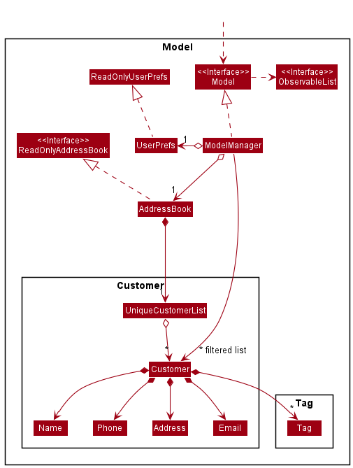

**API** : [`Model.java`](https://github.com/AY2021S2-CS2103-W17-3/tp/tree/master/src/main/java/seedu/booking/model/Model.java)

The `Model`,

* stores a `UserPref` object that represents the user’s preferences.
* stores the booking system data.
* exposes an unmodifiable `ObservableList<Person>` that can be 'observed' e.g. the UI can be bound to this list so that the UI automatically updates when the data in the list change.
* does not depend on any of the other three components.

:information_source: **Note:** An alternative (arguably, a more OOP) model is given below. It has a `Tag` list in the `BookingSystem`, which `Person` references. This allows `BookingSystem` to only require one `Tag` object per unique `Tag`, instead of each `Person` needing their own `Tag` object. 
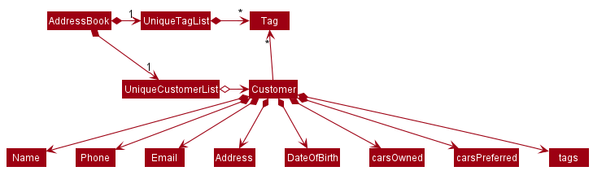

### Storage component

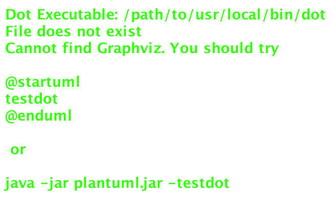

**API** : [`Storage.java`](https://github.com/AY2021S2-CS2103-W17-3/tp/tree/master/src/main/java/seedu/booking/storage/Storage.java)

The `Storage` component,
* can save `UserPref` objects in json format and read it back.
* can save the address book data in json format and read it back.

### Common classes

Classes used by multiple components are in the `seedu.booking.commons` package.

--------------------------------------------------------------------------------------------------------------------

## **Implementation**

This section describes some noteworthy details on how certain features are implemented.

### \[Proposed\] Undo/redo feature

#### Proposed Implementation

The proposed undo/redo mechanism is facilitated by `VersionedBookingSystem`. It extends `BookingSystem` with an undo/redo history, stored internally as an `bookingSystemStateList` and `currentStatePointer`. Additionally, it implements the following operations:

* `VersionedBookingSystem#commit()` — Saves the current address book state in its history.
* `VersionedBookingSystem#undo()` — Restores the previous address book state from its history.
* `VersionedBookingSystem#redo()` — Restores a previously undone address book state from its history.

These operations are exposed in the `Model` interface as `Model#commitBookingSystem()`, `Model#undoBookingSystem()` and `Model#redoBookingSystem()` respectively.

Given below is an example usage scenario and how the undo/redo mechanism behaves at each step.

Step 1. The user launches the application for the first time. The `VersionedBookingSystem` will be initialized with the initial address book state, and the `currentStatePointer` pointing to that single address book state.

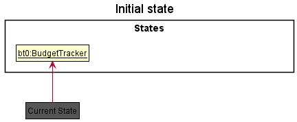

Step 2. The user executes `delete 5` command to delete the 5th person in the address book. The `delete` command calls `Model#commitBookingSystem()`, causing the modified state of the address book after the `delete 5` command executes to be saved in the `bookingSystemStateList`, and the `currentStatePointer` is shifted to the newly inserted address book state.

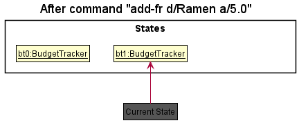

Step 3. The user executes `add n/David …​` to add a new person. The `add` command also calls `Model#commitBookingSystem()`, causing another modified address book state to be saved into the `bookingSystemStateList`.

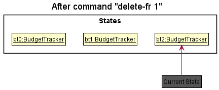

:information_source: **Note:** If a command fails its execution, it will not call `Model#commitBookingSystem()`, so the address book state will not be saved into the `bookingSystemStateList`.

Step 4. The user now decides that adding the person was a mistake, and decides to undo that action by executing the `undo` command. The `undo` command will call `Model#undoBookingSystem()`, which will shift the `currentStatePointer` once to the left, pointing it to the previous address book state, and restores the address book to that state.

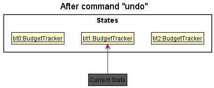

:information_source: **Note:** If the `currentStatePointer` is at index 0, pointing to the initial BookingSystem state, then there are no previous BookingSystem states to restore. The `undo` command uses `Model#canUndoBookingSystem()` to check if this is the case. If so, it will return an error to the user rather
than attempting to perform the undo.

The following sequence diagram shows how the undo operation works:

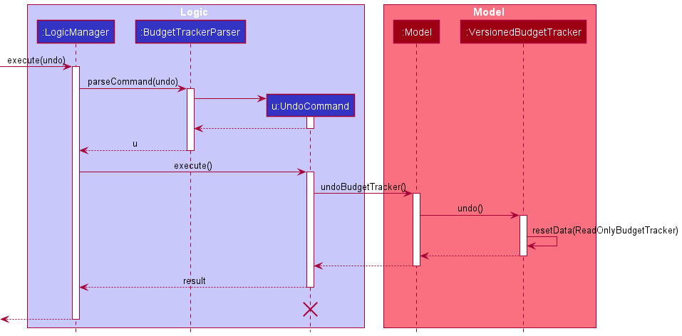

:information_source: **Note:** The lifeline for `UndoCommand` should end at the destroy marker (X) but due to a limitation of PlantUML, the lifeline reaches the end of diagram.

The `redo` command does the opposite — it calls `Model#redoBookingSystem()`, which shifts the `currentStatePointer` once to the right, pointing to the previously undone state, and restores the address book to that state.

:information_source: **Note:** If the `currentStatePointer` is at index `bookingSystemStateList.size() - 1`, pointing to the latest address book state, then there are no undone BookingSystem states to restore. The `redo` command uses `Model#canRedoBookingSystem()` to check if this is the case. If so, it will return an error to the user rather than attempting to perform the redo.

Step 5. The user then decides to execute the command `list`. Commands that do not modify the address book, such as `list`, will usually not call `Model#commitBookingSystem()`, `Model#undoBookingSystem()` or `Model#redoBookingSystem()`. Thus, the `bookingSystemStateList` remains unchanged.

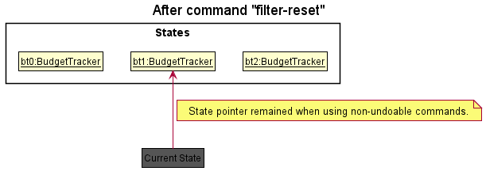

Step 6. The user executes `clear`, which calls `Model#commitBookingSystem()`. Since the `currentStatePointer` is not pointing at the end of the `bookingSystemStateList`, all address book states after the `currentStatePointer` will be purged. Reason: It no longer makes sense to redo the `add n/David …​` command. This is the behavior that most modern desktop applications follow.

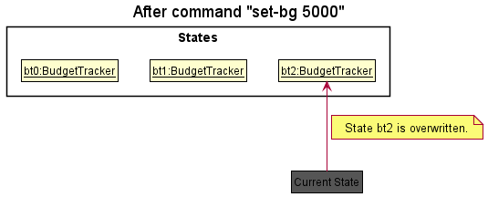

The following activity diagram summarizes what happens when a user executes a new command:

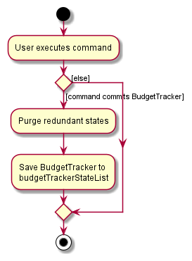

#### Design consideration:

##### Aspect: How undo & redo executes

* **Alternative 1 (current choice):** Saves the entire address book.
  * Pros: Easy to implement.
  * Cons: May have performance issues in terms of memory usage.

* **Alternative 2:** Individual command knows how to undo/redo by
  itself.
  * Pros: Will use less memory (e.g. for `delete`, just save the person being deleted).
  * Cons: We must ensure that the implementation of each individual command are correct.

_{more aspects and alternatives to be added}_

### \[Proposed\] Data archiving

_{Explain here how the data archiving feature will be implemented}_

--------------------------------------------------------------------------------------------------------------------

## **Documentation, logging, testing, configuration, dev-ops**

* [Documentation guide](Documentation.md)
* [Testing guide](Testing.md)
* [Logging guide](Logging.md)
* [Configuration guide](Configuration.md)
* [DevOps guide](DevOps.md)

--------------------------------------------------------------------------------------------------------------------

## **Appendix: Requirements**

### Product scope

**Target user profile**:

* has a need to manage a large number of venue bookings
* has to ensure bookings abide by restrictions
* needs to check that the bookings are valid
* is administrative personnel of schools or organisations
* prefers desktop apps over other types
* can type fast
* prefers typing to mouse interactions
* is reasonably comfortable using CLI apps

**Value proposition**:

* manage bookings faster than a typical mouse/GUI driven app
* ease of managing bookings since it is a centralised system
* automatically keeps track of room usage, conflicts and rule violations
* clear and structured way to avoid ambiguity

### User stories

Priorities: High (must have) - `* * *`, Medium (nice to have) - `* *`, Low (unlikely to have) - `*`

| Priority | As a …​                                    | I want to …​                     | So that I can…​                                                        |
| -------- | ------------------------------------------ | ------------------------------ | ---------------------------------------------------------------------- |
| `* * *`  | admin in charge of facilities              | add venues                     |                                                                        |
| `* * *`  | admin in charge of facilities              | edit venues                    | reflect the most up to date details of the venue                       |
| `* * *`  | admin in charge of facilities              | delete venues                  |                                                                        |
| `* * *`  | admin in charge of facilities              | view venues                    |                                                                        |
| `* * *`  | admin in charge of facilities              | add bookings                   |                                                                        |
| `* * *`  | admin in charge of facilities              | edit bookings                  | change booking details when the booker decides to amend the booking    |
| `* * *`  | admin in charge of facilities              | delete bookings                |                                                                        |
| `* * *`  | admin in charge of facilities              | view bookings                  |                                                                        |
| `* * *`  | admin in charge of facilities              | add bookers                    |                                                                        |
| `* * *`  | admin in charge of facilities              | edit bookers                   | reflect the most up to date details of the booker                       |
| `* * *`  | admin in charge of facilities              | delete bookers                 |                                                                        |
| `* * *`  | admin in charge of facilities              | view bookers                   |                                                                        |
| `* *`    | admin in charge of facilities              | query booking information of a particular venue | quickly find out the relevant information instead of search one by one |
| `*`      | admin in charge of facilities              | be able to access past data           | easily check the history of certain venues                      |

### Use cases

(For all use cases below, the **System** is `BookCoin To The Moon` and the **Actor** is the `user`, unless specified otherwise)

**Use case: UC01 - Delete a venue**

**MSS**

1.  User requests to delete a specific venue.
2.  BookCoin To The Moon deletes the venue.

    Use case ends.

**Extensions**

* 1a. The given venue is invalid.

    * 1a1. BookingSystem shows an error message.

      Use case resumes at step 1.

**Use case: UC02 - Delete a booking**

**MSS**

1.  User requests to delete a specific booking.
2.  BookCoin To The Moon deletes the booking.

    Use case ends.

**Extensions**

* 1a. The given booking is invalid.

    * 1a1. BookingSystem shows an error message.

      Use case resumes at step 1.

**Use case: UC03 - Delete a booker**

**MSS**

1.  User requests to delete a specific booker.
2.  BookCoin To The Moon deletes the booker.

    Use case ends.

**Extensions**

* 1a. The given booker is invalid.

    * 1a1. BookCoin To The Moon shows an error message.

      Use case resumes at step 1.

**Use case: UC04 - Add a venue**

**MSS**

1.  User requests to add a new venue into the system.
2.  BookCoin To The Moon adds the venue into the system.

    Use case ends.

**Extensions**

* 1a. The venue to be added is already in the system.
    * 1a1. BookCoin To The Moon shows an error message.

  Use case ends.

* 1b. The request misses compulsory fields, such as a venue name.
    * 1b1. BookCoin To The Moon shows an error message and prompts the user to reenter their command.

**Use case: UC05 - Add a booking**

**MSS**

1.  User requests to add a new booking into the system.
2.  BookCoin To The Moon adds the booking into the system.

    Use case ends.

**Extensions**

* 1a. The booking to be added is already in the system.
    * 1a1. BookCoin To The Moon shows an error message.

  Use case ends.

**Use case: UC06 - Add a booker**

**MSS**

1.  User requests to add a new booker into the system.
2.  BookCoin To The Moon adds the booker into the system.

    Use case ends.

**Extensions**

* 1a. The booker to be added is already in the system.
    * 1a1. BookCoin To The Moon shows an error message.

  Use case ends.

**Use case: UC07 - List all bookings**

**MSS**

1.  User requests to list all bookings.
2.  BookCoin To The Moon shows a list of bookings.

    Use case ends.

**Use case: UC08 - List all venues**

**MSS**

1.  User requests to list all venues.
2.  BookCoin To The Moon shows a list of venues.

    Use case ends.

**Use case: UC09 - List all bookers**

**MSS**

1.  User requests to list all bookers.
2.  BookCoin To The Moon shows a list of bookers.

    Use case ends.

**Use case: UC10 - Find a booking**

**MSS**

1.  User requests to find information about a specific booking.
2.  BookCoin To The Moon shows the information for that booking.

    Use case ends.

**Extensions**

* 1a. The booking requested cannot be found.
    * 1a1. BookCoin To The Moon shows an error message.

  Use case ends.

**Use case: UC11 - Find a venue**

**MSS**

1.  User requests to find information about a specific venue.
2.  BookCoin To The Moon shows the information for that venue.

    Use case ends.

**Extensions**

* 1a. The venue requested cannot be found.
    * 1a1. BookCoin To The Moon shows an error message.

  Use case ends.

**Use case: UC12 - Edit a venue**

**MSS**

1.  User requests to edit information about a specific venue.
2.  BookCoin To The Moon edits the venue information.

    Use case ends.

**Extensions**

* 1a. The venue requested cannot be found.
    * 1a1. BookCoin To The Moon shows an error message.

  Use case ends.

**Use case: UC13 - Edit a booking**

**MSS**

1.  User requests to edit information about a specific booking.
2.  BookCoin To The Moon edits the booking information.

    Use case ends.

**Extensions**

* 1a. The booking requested cannot be found.
    * 1a1. BookCoin To The Moon shows an error message.

  Use case ends.

**Use case: UC14 - Edit a booker**

**MSS**

1.  User requests to edit information about a specific booker.
2.  BookCoin To The Moon edits the booker information.

    Use case ends.

**Extensions**

* 1a. The booker requested cannot be found.
    * 1a1. BookCoin To The Moon shows an error message.

  Use case ends.

**Use case: UC15 - Exit the program**

**MSS**

1.  User requests to exit the program.
2.  BookCoin To The Moon closes the window and terminates.

    Use case ends.

### Non-Functional Requirements

1.  Should work on any _mainstream OS_ as long as it has Java `11` or above installed.
2.  Should be able to hold up to 1000 venues and bookings without a noticeable sluggishness in performance for typical usage.
3.  A user with above average typing speed for regular English text (i.e. not code, not system admin commands) should be able to accomplish most of the tasks faster using commands than using the mouse.
4.  Should be able to perform queries quickly even with significant amounts of data present.

### Glossary

* **Mainstream OS**: Windows, Linux, Unix, OS-X
* **Booking**: A person's request to occupy the room for a specific amount of time at a specific date

--------------------------------------------------------------------------------------------------------------------

## **Appendix: Instructions for manual testing**

Given below are instructions to test the app manually.

:information_source: **Note:** These instructions only provide a starting point for testers to work on;
testers are expected to do more *exploratory* testing.

### Launch and shutdown

1. Initial launch

   1. Download the jar file and copy into an empty folder

   1. Double-click the jar file Expected: Shows the GUI with a set of sample contacts. The window size may not be optimum.

1. Saving window preferences

   1. Resize the window to an optimum size. Move the window to a different location. Close the window.

   1. Re-launch the app by double-clicking the jar file. 
       Expected: The most recent window size and location is retained.

### Creating a venue
1. Adding Victoria Hall
    1. Prerequisites: a venue by the same name cannot already exist. If it is present as a record in the system, delete it.

    2. Test case: `create_venue v/Victoria Hall` 
    Expected: Victoria Hall should appear in the list of venues. The default capacity should be set to 10 as it was unspecified in the command, and there should be no description.

    3. Test case: `create_venue v/Victoria Hall max/50` 
    Expected: Victoria Hall should appear in the list of venues with a capacity indicated to be 50. No description should be present.

    4. Test case: `create_venue v/Victoria Hall d/Popular concert hall` 
    Expected: Victoria Hall should appear in the list of venues with a description "Popular concert hall". Capacity should be set to a default of 10.

### Creating a person
1. Adding a person record for John Doe
    1. Prerequisites: a person by the same name cannot already exist. If it is present as a record in the system, delete it.

    2. Test case: `add n/John Doe e/johnd@example.com ` 
    Expected: There should be an error stating that the the booking command is invalid. This is due to a missing phone number.

    3. Test case: `add n/John Doe p/98765432` 
    Expected: There should be an error stating that the the booking command is invalid. This is due to a missing email.

    4. Test case: `add n/John Doe p/98765432 e/johnd@example.com ` 
    Expected: John Doe should appear in the list of persons with the number 98765432 and email johnd@example.com.

### Creating a booking
1. Adding a booking for Victoria Hall
    1. Prerequisites: a venue by the same name already exist and a venue by the name of Hall does not exist. If it is not present as a record in the system, create one. Similarly for the email of a person booking, create one if not present

    2. Test case: `create_booking b/example@gmail.com v/Hall d/For FYP Meeting. bs/2012-01-31 22:59:59 be/2012-01-31 23:59:59` 
    Expected: There should be an error stating that the venue does not exist in the system

    3. Test case: `create_booking v/Victoria Hall d/For FYP Meeting. bs/2012-01-31 22:59:59 be/2012-01-31 23:59:59` 
    Expected: There should be an error stating that the the booking command is invalid. This is due to a missing email.

    4. Test case: `create_booking b/example@gmail.com v/Hall d/For FYP Meeting. bs/2012-01-31 22:59:59 be/2012-01-31 23:59:59` 
    Expected: A booking for Victoria Hall should appear in the list of bookings with a description "For FYP Meeting." with a date range from 31st Jan 2012, 22:59:59 to 23:59:59.

### Deleting a person

1. Deleting a person while all persons are being shown

   1. Prerequisites: List all persons using the `list` command. Multiple persons in the list.

   1. Test case: `delete 1` 
      Expected: First contact is deleted from the list. Details of the deleted contact shown in the status message. Timestamp in the status bar is updated.

   1. Test case: `delete 0` 
      Expected: No person is deleted. Error details shown in the status message. Status bar remains the same.

   1. Other incorrect delete commands to try: `delete`, `delete x`, `...` (where x is larger than the list size) 
      Expected: Similar to previous.

### Deleting a venue

1. Deleting a venue while all venues are being shown

    1. Prerequisites: List all venues using the `list_venue` command.
       Multiple venues in the list. Venue with venue name Victoria Hall is in the list.
       Venue with venue name Nonexistent Venue is not in the list.

    1. Test case: `delete_venue v/Victoria Hall` 
       Expected: Venue with venue name Victoria Hall is deleted from the list.
       Details of the deleted venue shown in the status message.

    1. Test case: `delete_venue v/Nonexistent Venue` 
       Expected: No venue is deleted. Error details shown in the status message.

    1. Other incorrect delete venue commands to try: `delete_venue`, `delete_venue x`  
       Expected: Similar to previous.

1. _{ more test cases …​ }_

### Deleting a booking

1. Deleting a booking while all bookings are being shown

    1. Prerequisites: List all bookings using the `list_booking` command.
       Multiple bookings in the list. Booking with booking id 8653792312 is in the list.
       Booking with booking id 9348125689 is not in the list.

    1. Test case: `delete_booking bid/8653792312` 
       Expected: Booking with booking id 8653792312 is deleted from the list.
       Details of the deleted booking shown in the status message.

    1. Test case: `delete_booking bid/9348125689` 
       Expected: No booking is deleted. Error details shown in the status message.

    1. Other incorrect delete booking commands to try: `delete_booking`, `delete_booking x`  
       Expected: Similar to previous.

1. _{ more test cases …​ }_

### Accessing help

1. Accessing help feature

    1. Test case: `help`
    Expected: An additional pop up help window should appear with a url to the user guide for Bookcoin.

### Saving data

1. Dealing with missing/corrupted data files

   1. _{explain how to simulate a missing/corrupted file, and the expected behavior}_

1. _{ more test cases …​ }_
