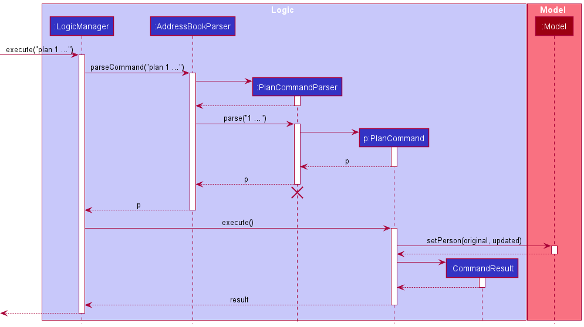
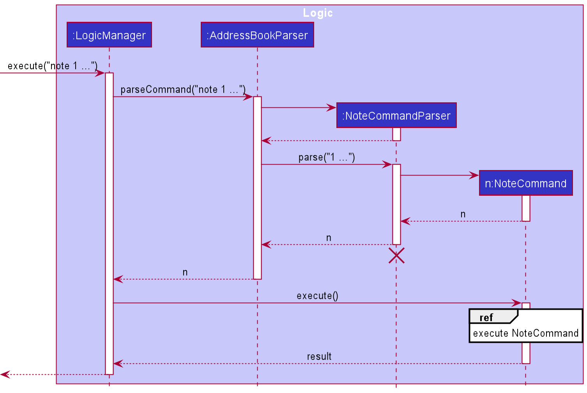
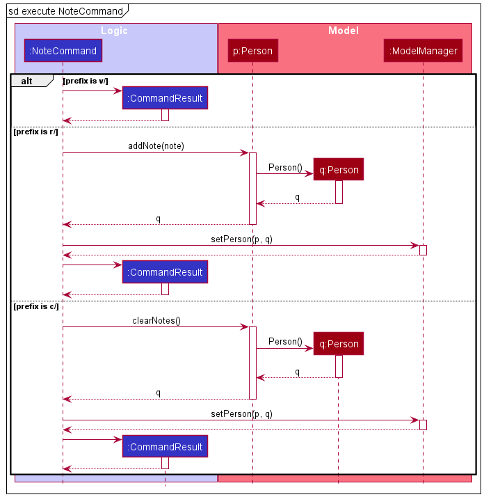
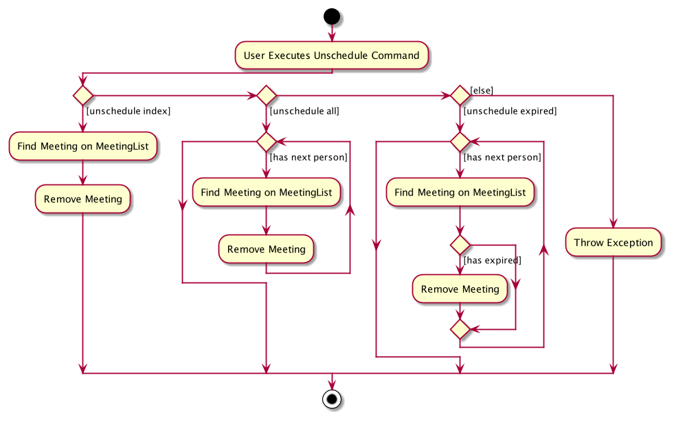
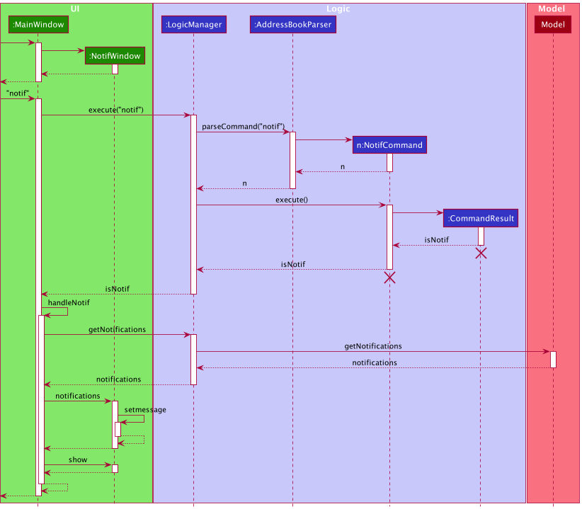

* Table of Contents 
{:toc}

--------------------------------------------------------------------------------------------------------------------

## **Setting up, getting started**

Refer to the guide [_Setting up and getting started_](SettingUp.md).

--------------------------------------------------------------------------------------------------------------------

## **Design**

### Architecture

The ***Architecture Diagram*** given above explains the high-level design of the App. Given below is a quick overview of
each component.

:bulb: **Tip:** The `.puml` files used to create diagrams in this document can be found in
the [diagrams](https://github.com/AY2021S2-CS2103T-W12-3/tp/tree/master/docs/diagrams) folder. Refer to the 
[PlantUML Tutorial at se-edu/guides](https://se-education.org/guides/tutorials/plantUml.html) to learn how to create 
and edit diagrams.

:information_source:
**Note:** The lifeline for classes in sequence diagrams shown in this Developer's Guide should end at the destroy marker
(X) but due to a limitation of PlantUML, the lifeline reaches the end of diagram.

**`Main`** has two classes
called [`Main`](https://github.com/AY2021S2-CS2103T-W12-3/tp/blob/master/src/main/java/seedu/address/Main.java)
and [`MainApp`](https://github.com/AY2021S2-CS2103T-W12-3/tp/blob/master/src/main/java/seedu/address/MainApp.java). It
is responsible for,

* At app launch: Initializes the components in the correct sequence, and connects them up with each other.
* At shut down: Shuts down the components and invokes cleanup methods where necessary.

[**`Commons`**](#common-classes) represents a collection of classes used by multiple other components.

The rest of the App consists of four components.

* [**`UI`**](#ui-component): The UI of the App.
* [**`Logic`**](#logic-component): The command executor.
* [**`Model`**](#model-component): Holds the data of the App in memory.
* [**`Storage`**](#storage-component): Reads data from, and writes data to, the hard disk.

Each of the four components,

* defines its *API* in an `interface` with the same name as the Component.
* exposes its functionality using a concrete `{Component Name} Manager` class (which implements the corresponding
  API `interface` mentioned in the previous point.

**How the architecture components interact with each other**

An example of how the components interact with each other upon user input is given in the sequence diagram below.
The user input in this example is `delete 1`:

The sections below give more details about each individual component.

### UI component

**API** :
[`Ui.java`](https://github.com/AY2021S2-CS2103T-W12-3/tp/blob/master/src/main/java/seedu/address/ui/Ui.java)

The UI consists of a `MainWindow` that is made up of parts e.g.`CommandBox`, `ResultDisplay`, `PersonListPanel`
, `StatusBarFooter` etc.

The `NotifWindow` and `NotesWindow` classes inherit from the `Alert` class.
All other classes, including `MainWindow`, inherit from the abstract `UiPart` class.

The `UI` component uses JavaFx UI framework. The layout of these UI parts are defined in matching `.fxml` files that are
in the `src/main/resources/view` folder. For example, the layout of
the [`MainWindow`](https://github.com/AY2021S2-CS2103T-W12-3/tp/blob/master/src/main/java/seedu/address/ui/MainWindow.java)
is specified
in [`MainWindow.fxml`](https://github.com/AY2021S2-CS2103T-W12-3/tp/blob/master/src/main/resources/view/MainWindow.fxml)

The `UI` component,

* Executes user commands using the `Logic` component.
* Listens for changes to `Model` data so that the UI can be updated with the modified data.

### Logic component

**API** :
[`Logic.java`](https://github.com/AY2021S2-CS2103T-W12-3/tp/blob/master/src/main/java/seedu/address/logic/Logic.java)

1. `Logic` uses the `AddressBookParser` class to parse the user command.
1. This results in a `Command` object which is executed by the `LogicManager`.
1. The command execution can affect the `Model` (e.g. adding a person).
1. The result of the command execution is encapsulated as a `CommandResult` object which is passed back to the `Ui`.
1. In addition, the `CommandResult` object can also instruct the `Ui` to perform certain actions, such as displaying
   help to the user.

Given below is the Sequence Diagram for interactions within the `Logic` component for the `execute("delete 1")` API
call.

### Model component

**API** :
[`Model.java`](https://github.com/AY2021S2-CS2103T-W12-3/tp/blob/master/src/main/java/seedu/address/model/Model.java)

The `Model`,

* stores a `UserPref` object that represents the user’s preferences, including GUI sizings and more.
* stores client data.
* exposes an unmodifiable `ObservableList<Person>` that can be 'observed' e.g. the UI can be bound to this list so that
  the UI automatically updates when the data in the list change.
* does not depend on any of the other three components.

### Storage component

**API** : [`Storage.java`](https://github.com/AY2021S2-CS2103T-W12-3/tp/blob/master/src/main/java/seedu/address/storage/Storage.java)

The `Storage` component,

* can save `UserPref` objects in json format and read it back.
* can save client data in json format and read it back.

### Common classes

Classes used by multiple components are in the `seedu.addressbook.commons` package.
These include configuration settings and common utilities.

--------------------------------------------------------------------------------------------------------------------

## **Implementation**

This section describes some noteworthy details on how features added in this iteration are implemented.

### Representing gender of clients

The gender of each client is represented as a `String` with the full gender (Male/ Female/ Non-binary). However, the
parse will accept any of `M`, `F`, `N`, `Male`, `Female`, `Non-binary` in any combination of upper and lower cases, and then
convert it to the full gender. For example, `NoN-binARy` will be successfully recognized as non-binary.

### Representing birthdate of clients

The birthdate of each client is currently represented as a `LocalDate` object instead of a `String`. This allows us to
use `LocalDate.parse()` to check for the validity of dates, as well as restricting the range of input dates from
`1900-01-01` to `LocalDate.now()`. Link.me supports only strict parsing, which means all invalid dates will not be
recognized and common mistakes like inputting non-existent dates such as the 31st of September will not be automatically 
round down to the 30th of September.

### Representing insurance premiums of insurance plans

The premium of a client's insurance plan is represented and stored as a `String` to support large amounts without the
risk of overflow. This is to support all currency values, including those that have a much lower value than SGD.
The validity of the user's input amount is checked using regular expressions. Unnecessary leading zeroes in the input 
string are trimmed, and the input string is padded with zeroes as necessary to format it to 2 decimal places.

### Adding or removing insurance plans of clients

The `PlanCommand` is created and parsed similar to other commands, as shown in the sequence diagram above. Depending
on the `Prefix` the user inputs (`i/` or `c/`), an `AddPlanCommand` or a `RemovePlanCommand` will be created and 
returned respectively. 

### Recording, viewing and clearing notes for clients

The `NoteCommand` is created and parsed similar to other commands, as shown in the sequence diagram above. The `Prefix` 
that the user called the command with (`r/` to record note, `v/` to view notes, `c/` to clear notes) is stored as an
additional parameter in the `NoteCommand`.

Upon executing a `NoteCommand`, a different sequence of actions is performed by the `NoteCommand`, depending on the
`Prefix` stored in the `NoteCommand`. 

Viewing notes will simply create and return a `CommandResult`. This `CommandResult` contains the `Person` object
representing the appropriate `Person`. This `Person` is passed back to the `Ui`, which will display the notes of this
`Person` in the `NotesWindow`.

Recording and clearing notes will call the respective methods of the appropriate
`Person` that the user has indicated. The `Person` will return an updated `Person` object, and `NoteCommand`
will proceed to call the `ModelManager` to replace the original `Person` with the updated `Person`. A `CommandResult`
is then created and returned.

### Listing, Finding and filtering clients

Upon executing a `ListCommand`, `FindCommand` or `FilterCommand`, a sequence of action is performed by the 
corresponding commands. All 3 commands work similarly: while `ListCommand` does not require any additional user
inputs, additional users inputs for `FindCommand` and `FilterCommand` are required and will be parsed to create
Predicate objects. As for the `ListCommand`, the Predicate object will simply return true. These predicates will then
be used to determine which `Person` in the `UniquePersonList` found in the `AddressBook` will be added to the
`FilteredList`, which will then be iteratively displayed to the user.

### Scheduling meetings and Meeting List Display

The implementation of scheduling a meeting is as showcased below:

The current implementation of the `Meeting` class places `Meeting` as an attribute of `Person`. While it
certainly makes more sense to adopt an implementation where `Person` is an attribute of `Meeting` in order to better
support extensions and many-to-many relations, we would have to examine and update every `Meeting` object to edit the 
`Person` if we were to update and change a `Person` as the current implementation of `Person` does not contain an 
immutable and unique identifier. 

As a result, the current implementation of `UniqueMeetingList` takes in `Person` as the element of the list, and 
accesses the meeting attribute within the `Person` object when needed. `UniqueMeetingList` contains both a `TreeMap` 
with `Meeting` as the key and the owner `Person` as the value, as well as an internal `List`. Regarding the editing of 
the `UniqueMeetingList`, every time the `UniquePersonList` is edited, `UniqueMeetingList` is edited as well. Hence, 
alteration only remains on the `Model` and `Ui` components.

In future installments, this implementation may be scraped in favor for an implementation where the `Meeting` class acts
as the wrapper for the `Person` class, or an implementation where `Person` and `Meeting` are separate entities,
but for the sake of functionality and simplicity, we shall keep the current implementation as is.

### Unscheduling meetings

The implementation of unscheduling meetings is very similar to scheduling meetings, so we skip the details of the
implementations here and would like to ask the reader to refer to the implementation of scheduling meetings as reference.

The behavior of the unscheduling command and its options are shown as below.

The internal operation of removing a `Meeting` involves locating the owner `Person` on the internal `List` stored in
`UniqueMeetingList`, then use the `Meeting` (the key) to remove the owner `Person` (the value) from the internal 
`TreeMap`, then exporting the values in the `TreeMap` back into the internal `List`.

### Displaying Notifications

The implementation of showing notifications is separated into two parts. The first part handles the input `Command` and
returns a `CommandResult` indicating whether the `Command` is a `NotifCommand` and returns it to the `MainWindow`. For the
second part of the implementation, the `MainWindow` handles the `CommandResult` and requests the notifications from
`Logic`, which in turn requests from `Model`. The `MainWindow` then sends the notification string to the `NotifWindow` to
be displayed.

<!--

--------------------------------------------------------------------------------------------------------------------

## **Documentation, logging, testing, configuration, dev-ops**

* [Documentation guide](Documentation.md)
* [Testing guide](Testing.md)
* [Logging guide](Logging.md)
* [Configuration guide](Configuration.md)
* [DevOps guide](DevOps.md)

--------------------------------------------------------------------------------------------------------------------

-->

## **Appendix: Requirements**

### Product scope

**Target user profile**:

* is an insurance agent
* has a need to manage a significant number of contacts
* has a need to maintain close relations with clients over a long time period (usually 10+ years)
* prefers desktop apps over other application types
* can type fast
* prefers typing to mouse interactions
* is reasonably comfortable using CLI apps

**Value proposition**:

* manage contacts faster than a typical mouse/GUI driven app
* maintain notes on their client, their needs, their likes/dislikes, insurance plans etc.
* get automated reminders about upcoming meetups and notifications on the client's birthday.

### User stories

Priorities: High (must have) - `* * *`, Medium (nice to have) - `* *`, Low (unlikely to have) - `*`

| Priority | As a …​                                 | I want to …​                                             | So that I can…​                                                           |
| -------- | ------------------------------------------ | ----------------------------------------------------------- | ---------------------------------------------------------------------------- |
| `* * *`  | insurance agent                            | add a new client along with their contact information       | be able to conveniently check their contact when I need to get in touch      |
| `* * *`  | insurance agent                            | view a list of all clients                                  | get an overview of all my clients                                            |
| `* * *`  | insurance agent                            | delete a client                                             | remove clients that I am no longer serving                                   |
| `* * *`  | insurance agent                            | edit a client                                               | update clients' information without having to delete and add a new entry     |
| `* * *`  | insurance agent with many clients          | find a client by name                                       | locate details of client without having to go through the entire list        |
| `* * *`  | insurance agent with many clients          | filter clients by address, gender, age, tags, plan name     | locate clients without going through the entire list     |
| `* * *`  | new user                                   | clear all entries                                           | remove sample data and make it ready for me to use                           |
| `* * *`  | insurance agent                            | add important dates (e.g. birthdays) related to each client | keep track of client's personal information more easily                      |
| `* * *`  | insurance agent                            | add the current insurance plan of each client               | be aware of their current insurance requirements and coverage                |
| `* * *`  | insurance agent                            | schedule meetings with people or groups of people           | keep track of upcoming meetings                                              |
| `* * `   | insurance agent                            | check the age of each client                                | know if their insurance plan should be updated/ changed, as they get older   |
| `* * `   | user with many clients in Link.me | sort clients by criteria (name/age/premium/contract length) | locate clients more easily                                                   |
| `* * `   | new user                                   | see usage instructions                                      | refer to instructions when I forget how to use the App                       |
| `* * `   | first-time user                            | see sample entries already in the app                       | get a good idea of the functionalities of the app before deciding to use it  |
| `* * `   | forgetful insurance agent                  | reminders when clients' important dates are approaching     | prepare a meaningful greeting/ gift                                          |
| `* * `   | insurance agent                            | record, view and clear notes regarding each client          | remind myself of things to take note of                                      |
| `* * `   | insurance agent                            | track the status of claims made on behalf of clients        | update clients of the claims progress                                        |
| `* `     | insurance agent                            | archive clients                                             | separate clients who have passed or have switched providers                  |
| `* `     | insurance agent                            | pin clients to the top of the app                           | easily access clients that I am currently actively dealing with              |
| `* `     | inexperienced insurance agent              | add photographs of each client                              | more easily identify them                                                    |
| `* `     | first-time user                            | go through an interactive tutorial                          | learn how to use the app                                                     |
| `* `     | social media savvy insurance agent         | add social media accounts of each client                    | keep up to date with their lives and be attentive                            |
| `* `     | expert user                                | create my own categories for grouping clients               | better organise and group my client contacts                                 |
| `* `     | expert user                                | create my own shortcuts for commonly performed actions      | save time on these actions                                                   |

<!-- Removed user stories
| `* * `   | insurance agent                            | add likes & dislikes of each client                         | be thoughtful to them and prepare appropriate gifts                          |
| `* `     | insurance agent                            | track the financial status of each client                   | better recommend plans, such as for investment                               |
| `* `     | insurance agent                            | add basic medical information of each client                | refuse new contracts in case of terminal illness                             |
| `* `     | insurance agent with few clients           | add potential clients                                       | contact and find new clients                                                 |
| `* `     | insurance agent                            | suggestions on what to do for clients' important dates      | save time on brainstorming for a gift                                        |
| `* `     | insurance agent                            | track the total claims amount made by each client           | recommend better plans and offerings if needed                               |
| `* `     | insurance agent                            | add hobbies of each client                                  | recommend certain plans if they partake in high-risk activities              |
| `* `     | insurance agent                            | add info on the insurance plans of clients' family members  | give insurance advice for client's family                                    |
| `* `     | insurance agent                            | add info on the previous insurance plans of each client     | have a reference when recommending insurance plans                           |
| `* `     | expert user                                | disable certain UI elements that I do not use               | have a cleaner UI                                                            |
-->

### Use cases

(For all use cases below, the **System** is the `Link.me` and the **Actor** is the `user`, unless specified
otherwise)

**Use case: Add a client**

**MSS**
1.  User adds a client with corresponding information
2.  Link.me shows the list of clients
3.  Use case ends

**Extensions**

* 1a. The user's input format is invalid
    * 1a1. Link.me shows an error message
    * Use case resumes at step 1

**Use case: Edit a client**

**MSS**
1.  User requests a list of clients
2.  Link.me shows the list of clients
3.  User requests to edit a specific client in the list
4.  Link.me edits the client
5.  Use case ends

**Extensions**

* 2a. The list is empty
    * Use case ends

* 3a. The given index is invalid
    * 3a1. Link.me shows an error message
    * Use case resumes at step 2

* 3b. No optional fields are given
    * 3b1. Link.me shows an error message
    * Use case resumes at step 2

* 3c. The user input is invalid
    * 3c1. Link.me shows an error message
    * Use case resumes at step 2

**Use case: Delete a client**

**MSS**
1.  User requests to list clients
2.  Link.me shows a list of clients
3.  User requests to delete a specific client in the list
4.  Link.me deletes the client
5.  Use case ends

**Extensions**

* 2a. The list is empty
    * Use case ends

* 3a. The given index is invalid
    * 3a1. Link.me shows an error message
    * Use case resumes at step 2

**Use case: Scheduling a meetup with a client**

**MSS**

1. User requests to list clients
2. Link.me shows a list of clients
3. User requests to schedule a meeting a specific client in the list at a specified date and time, alond with a description of the meeting
4. Link.me adds the specified client, as well as the specifics of the meeting, to the meeting list
5. Use case ends

**Extensions**

* 2a. The list is empty
    * Use case ends

* 3a. The given index is invalid
    * 3a1. Link.me shows an error message
    * Use case resumes at step 2

* 3b. The given meeting input is invalid (user input not formatted as DESCRIPTION @ yyyy-mm-dd HH:MM)
    * 3b1. Link.me shows an error message and reminds the user of the correct format
    * Use case resumes at step 2

* 3c. The given date-and-time is invalid (eg. user input 2020-02-31 14:30)
    * 3c1. Link.me shows an error message
    * Use case resumes at step 2

* 3d. The given date-and-time coincides with the meeting with another client (eg. user is meeting 2 different clients at
  the same date and time)
    * 3d1. Link.me shows an error message alerting the user that the meeting coincides with another meeting with another client
    * Use case resumes at step 2

**Use case: Filter according to attributes**

**MSS**
1.  User requests to search for clients with corresponding attribute information (at least one parameter is required)
    * address: a/ADDRESS
    * gender: g/GENDER 
    * tag: t/TAG
    * age: age/[AGE] or age/[AGE_LOWER_BOUND]-[AGE_HIGHER_BOUND]
    * insurance plan name: i/PLAN_NAME
2.  Link.me shows the list of clients with matching attributes that match the user's search keywords
3.  Use case ends

**Extensions**

* 1a. The user inputs an invalid prefix.
    * 1a1. Link.me shows an error message.
    * Use case resumes at step 1
    
* 1b. The user inputs an invalid age parameter or age range as an attribute to filter
    * 1b1. Link.me shows an error message
    * Use case resumes at step 1
    
* 1c. The user inputs an invalid gender parameter (must be 'M', 'F' or 'N')
    * 1c1. Link.me shows an error message
    * Use case resumes at step 1
    
* 1d. The user does not input any filter parameters (eg. `filter ` instead of `filter age/25`)
    * 1d1. Link.me shows an error message
    * Use case resumes at step 1

* 2a. The filtered list is empty.
    * Use case ends.

**Use case: Find by name**

**MSS**
1.  User requests to search for clients by name
2.  Link.me shows the list of clients whose name matches the user's search keywords
3.  Use case ends

**Extensions**

* 1a. The user does not input any parameter (eg. `find ` instead of `find Alex`)
    * 1d1. Link.me shows an error message
    * Use case resumes at step 1

* 2a. The search result list is empty.
    * Use case ends.

### Non-Functional Requirements

1.  Should work on any _mainstream OS_ as long as it has Java `11` or above installed.
2.  The software should not use any OS-dependent libraries and OS-specific features.
3.  Should be able to hold up to 1000 clients without a noticeable sluggishness in performance for typical usage.
4.  A user with average typing speed for regular English text (i.e. not code, not system admin commands) should be able 
    to accomplish most of the tasks faster using commands than using the mouse.
5.  The software should work without requiring an installer.
6.  The software should not depend on a remote server.
7.  The data should be stored locally and should be in a human editable text file.
8.  The software should be packaged into a single JAR file.
9.  The project is expected to adhere to a schedule that delivers a new iteration every two weeks.
10. The project JAR file should not exceed 100MB.
11. Project PDF files should not exceed 15MB each.
12. The Developer Guide and User Guide should be PDF-friendly and should not contain expandable panels, embedded videos
    and animated GIFs.

### Glossary

* **Mainstream OS**: Windows, Linux, Unix, macOS
* **CLI**: Command Line Interface, an interface that processes commands to a computer program in the form of lines of text
* **GUI**: Graphic User Interface, an interface that allows users to interact with programs through graphical icons instead of text
* **Tag**: Small and simple labels that can serve as an indicator of the client
* **Note** : Longer and complex remarks that gives details about the client
* **JAR** : Java Archive File, the deployment format of the Link.me application

--------------------------------------------------------------------------------------------------------------------
## **Appendix: Instructions for manual testing**

Given below are instructions to test the app manually.

:information_source: **Note:** These instructions only provide a starting point for testers to work on;
testers are expected to do more *exploratory* testing.

### Launch and shutdown

* Initial launch

   1. Download the jar file and copy into an empty folder

   1. Double-click the jar file Expected: Shows the GUI with a set of sample contacts. The window size may not be optimum.

* Saving window preferences

   1. Resize the window to an optimum size. Move the window to a different location. Close the window.

   1. Re-launch the app by double-clicking the jar file. 
       Expected: The most recent window size and location is retained.

### Scheduling a meeting

* Scheduling a meeting with a client

   1. Prerequisites: List all clients using the `list` command. Multiple clients in the list.

   1. Test case: `schedule 1 m/Insurance Plan Talk @ 2032-01-02 16:30` 
      Expected: Meeting scheduled with first client. Meeting list panel on the right should be updated. 
      Status bar should display a message indicating success.

   1. Test case: `schedule 0 m/Insurance Plan Talk @ 2032-01-02 16:30` 
      Expected: No meeting is scheduled. Error details shown in the status message. Status bar remains the same.

   1. Test case: `schedule 1 m/Insurance Plan Talk 2032-01-02 16:30` 
      Expected: No meeting is scheduled. Error details shown in the status message. Status bar remains the same.
    
   1. Test case: `schedule 1 m/Insurance Plan Talk ` 
      Expected: No meeting is scheduled. Error details shown in the status message. Status bar remains the same.

   1. Other incorrect schedule commands to try: `schedule`, `schedule x m/ DESCRIPTION @ DATETIME ` (where x is larger than the list size), `...` 
      Expected: Similar to previous.

### Unscheduling a meeting

* Unscheduling a meeting with a client

  1. Prerequisites: Meetings are scheduled and shown in the Meeting List Panel on the right on the Ui

  1. Test case: `unschedule 2` 
     Expected: First meeting on the meeting list panel removed. 
     Meeting list panel on the right should be updated.
     Status bar should display a message indicating success.

  1. Test case: `unschedule expired` 
     Expected: All meetings on the meeting list panel whose scheduled time has passed are removed. 
     Meeting list panel on the right should be updated.
     Status bar should display a message indicating success.

  1. Test case: `unschedule all` 
     Expected: All meetings on the meeting list panel are removed.
     Meeting list panel on the right should be updated.
     Status bar should display a message indicating success.

  1. Test case: `unschedule 0 ` 
     Expected: No meeting is unscheduled. Error details shown in the status message. Status bar remains the same.

  1. Other incorrect unschedule commands to try: `unschedule everything`, `unschedule x` (where x is negative), `...` 
     Expected: Similar to previous.

### Generating Notifications

* Generating Notifications

  1. Prerequisites: None

  1. Test case: `notif` 
     Expected: Notification window should pop up.

  1. Test case: `notif 12345` 
     Expected: Notification window should pop up.

  1. Other correct notif commands to try: `notif x`(where x is any string appended) 
     Expected: Similar to previous.

### Listing all clients

1. Get a list of all clients

  1. Test case: `list`, `list alex`, `list 123`  
    Expected: All clients will be displayed in the list, additional parameters are ignored

### Finding clients by name

1. Finding clients using (a) name(s) as keyword

  1. Test case: `find Alex`  
    Expected: All clients with that has "Alex" in their name will be displayed in the list

  1. Test case: `find Alex Bernice`  
    Expected: All clients with that has "Alex" OR "Bernice" in their name will be displayed in the list

  1. Test case: `find`  
    Expected: Error message "Invalid command format!" followed by instructions on how to properly use the find 
command

## Filtering clients using attributes. Attributes include a/ADDRESS, g/GENDER, t/TAG, age/[AGE] or 
age/[AGE_LOWER_BOUND]-[AGE_HIGHER_BOUND], i/INSURANCE_PLAN_NAME

  1. Test case: `filter a/Clementi g/M t/medical i/Protecc age/23-30`  
    Expected: Returns a list of clients who have "Clementi" in their address, and  
      clients who are Male, and  
      clients with the "medical" tag, and  
      clients with the insurance plan "Protecc", and  
      clients aged between 23 and 30 years old, inclusive

  1. Test case: `filter`, `filter 20`, `filter Clementi`  
    Expected: Error message "Invalid command format!" followed by instructions on how to properly use the filter 
command

  1. Test case: `filter age/abc`, `filter age/-1`, `filter age/30-20`, `filter age/ab-20`, `filter age/-1-20`  
    Expected: Error message "Invalid age (range) input!" followed by instructions on how to properly use the filter 
command  

### Adding or removing an insurance plan of a client

1. Adding a new insurance plan to a client while all clients are being shown

   1. Prerequisites: List all clients using the `list` command. At least 1 client in the list.

   1. Test case: `plan 1 i/Investment $1000` 
      Expected: A new insurance plan is added to the 1st client in the list. Details are shown in the result display.

   1. Test case: `plan 1 i/Investment $0` 
      Expected: No insurance plan is added. Error details are shown in the result display.

   1. Other incorrect plan commands to try: `plan 0 i/Investment $1000`, `plan 1 i/` 
      Expected: Similar to previous.
      
2. Removing an existing insurance plan from a client while all clients are being shown

   1. Prerequisites: List all clients using the `list` command. At least 1 client in the list and the 1st client has at least 1 insurance plan.

   1. Test case: `plan 1 c/1` 
      Expected: The 1st insurance plan of the 1st client in the list is removed. Details are shown in the result display.

   1. Test case: `plan 1 c/0` 
      Expected: No insurance plan is removed. Error details are shown in the result display.

   1. Other incorrect plan commands to try: `plan 0 c/1`, `plan 1 c/` 
      Expected: Similar to previous.

### Saving data

1. Editing linkme.json

  1. Prerequisites: Link.me is not started while data files are edited
     
  1. Test case: delete the `linkme.json` file 
      Expected: Link.me will load sample data upon initialization the next time it starts
      
  1. Test case: valid edits are made in the `linkme.json` file
     Expected: Link.me will the data in from the json file correctly

  1. Test case: invalid edits are made in the `linkme.json` file
     Expected: Link.me will start with an empty data set upon initialization the next time it starts

--------------------------------------------------------------------------------------------------------------------
## **Appendix: Effort**

### Meetings and scheduling
While AB3 only deals with a single entity, `Link.me` deals with an additional entity - `Meeting`. As `Meeting` and 
`Person` are closely intertwined, the level of dependency between the two entities had to be carefully determined.
Another issue we had to face with `Meeting` was that the `Meeting` entity was time-related, thus some operations could
not be easily tested. Due to the time-related nature of `Meeting`, we also had to come up with a method to order 
`Meeting` according to time when put on display.

### Notifications and notes
Notifications and notes had too much information to fit on the main GUI window, thus we had to display the information 
on a separate window. As the construction of a new stage was troublesome especially when we still wanted keyboard 
operations like `Enter` to still work on the new window as well as keep the main GUI consistent, we decided to piggyback 
the implementation on the inbuilt `JavaFX Alert` class, which proved to be another hassle, as `Alert` windows were not
designed to hold that much information. As a result, we had to sacrifice a bit of UI theme consistency over successful
functionality.

### Insurance plans
For insurance plans, the troubling part was to try to keep the similar functionalities of adding and removing within the
same command in order to reduce user confusion. A separate parser had to be implemented. Another challenge was that the
insurance premiums could be very large when we wanted to subject it to different small value currencies. Hence, we had
to store the value as a `String` with validations made with regular expressions, something else we had to learn, instead
of an `Integer`.

### Filtering clients
For filtering clients, the main issue was trying to express the selection criteria of different attributes as 
predicates, to which we had to utilize functional programming techniques instead of more common OOP usage. The parser 
for the filter command was also more complex than other commands to construct. In particular, for filtering, we also
had to filter by age, which required an extra processing step as compared to filtering by other attributes.

### UI
The UI tinkering for the MainWindow proved to be a major hurdle as we wanted the UI to remain viewable even after 
extreme inputs, which we allowed in order to give our users the greatest flexibility. The GUI also had to stay intact
when the window is restarted. Furthermore, GUI behaviors could be different on different OSes, so we had to test the GUI
under different environments.