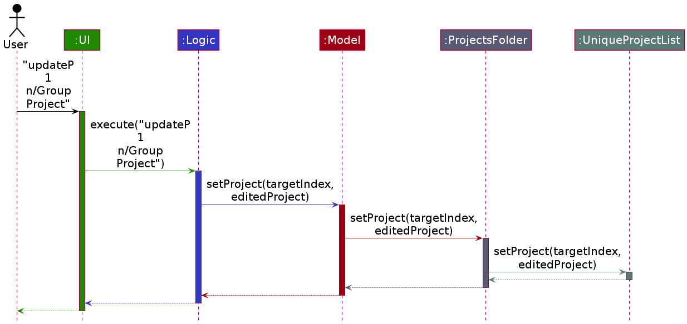

* Table of Contents
{:toc}

--------------------------------------------------------------------------------------------------------------------

## **Setting up, getting started**

Refer to the guide [_Setting up and getting started_](SettingUp.md).

--------------------------------------------------------------------------------------------------------------------

## **Design**

### Architecture

The ***Architecture Diagram*** given above explains the high-level design of the App. Given below is a quick overview of each component.

:bulb: **Tip:** The `.puml` files used to create diagrams in this document can be found in the [diagrams](https://github.com/se-edu/addressbook-level3/tree/master/docs/diagrams/) folder. Refer to the [_PlantUML Tutorial_ at se-edu/guides](https://se-education.org/guides/tutorials/plantUml.html) to learn how to create and edit diagrams.

**`Main`** has two classes called [`Main`](https://github.com/se-edu/addressbook-level3/tree/master/src/main/java/seedu/address/Main.java) and [`MainApp`](https://github.com/se-edu/addressbook-level3/tree/master/src/main/java/seedu/address/MainApp.java). It is responsible for,
* At app launch: Initializes the components in the correct sequence, and connects them up with each other.
* At shut down: Shuts down the components and invokes cleanup methods where necessary.

[**`Commons`**](#common-classes) represents a collection of classes used by multiple other components.

The rest of the App consists of four components.

* [**`UI`**](#ui-component): The UI of the App.
* [**`Logic`**](#logic-component): The command executor.
* [**`Model`**](#model-component): Holds the data of the App in memory.
* [**`Storage`**](#storage-component): Reads data from, and writes data to, the hard disk.

Each of the four components,

* defines its *API* in an `interface` with the same name as the Component.
* exposes its functionality using a concrete `{Component Name}Manager` class (which implements the corresponding API `interface` mentioned in the previous point.

For example, the `Logic` component (see the class diagram given below) defines its API in the `Logic.java` interface and exposes its functionality using the `LogicManager.java` class which implements the `Logic` interface.

**How the architecture components interact with each other**

The *Sequence Diagram* below shows how the components interact with each other for the scenario where the user issues the command `delete 1`.

The sections below give more details of each component.

### UI component

**API** :
[`Ui.java`](https://github.com/se-edu/addressbook-level3/tree/master/src/main/java/seedu/address/ui/Ui.java)

The UI consists of a `MainWindow` that is made up of parts e.g.`CommandBox`, `ResultDisplay`, `PersonListPanel`, `StatusBarFooter` etc. All these, including the `MainWindow`, inherit from the abstract `UiPart` class.

The `UI` component uses JavaFx UI framework. The layout of these UI parts are defined in matching `.fxml` files that are in the `src/main/resources/view` folder. For example, the layout of the [`MainWindow`](https://github.com/se-edu/addressbook-level3/tree/master/src/main/java/seedu/address/ui/MainWindow.java) is specified in [`MainWindow.fxml`](https://github.com/se-edu/addressbook-level3/tree/master/src/main/resources/view/MainWindow.fxml)

The `UI` component,

* Executes user commands using the `Logic` component.
* Listens for changes to `Model` data so that the UI can be updated with the modified data.

### Logic component

**API** :
[`Logic.java`](https://github.com/se-edu/addressbook-level3/tree/master/src/main/java/seedu/address/logic/Logic.java)

1. `Logic` uses the `AddressBookParser` class to parse the user command.
1. This results in a `Command` object which is executed by the `LogicManager`.
1. The command execution can affect the `Model` (e.g. adding a person).
1. The result of the command execution is encapsulated as a `CommandResult` object which is passed back to the `Ui`.
1. In addition, the `CommandResult` object also contains a `UiCommand` object, which encapsulates information needed to instruct the `Ui` to perform certain actions, such as displaying help to the user.

Given below is the Sequence Diagram for interactions within the `Logic` component for the `execute("delete 1")` API call.

:information_source: **Note:** The lifeline for `DeleteCommandParser` should end at the destroy marker (X) but due to a limitation of PlantUML, the lifeline reaches the end of diagram.

### Model component

**API** : [`Model.java`](https://github.com/se-edu/addressbook-level3/tree/master/src/main/java/seedu/address/model/Model.java)

The `Model`,

* stores a `UserPref` object that represents the user’s preferences.
* stores the address book data.
* exposes an unmodifiable `ObservableList<Person>` that can be 'observed' e.g. the UI can be bound to this list so that the UI automatically updates when the data in the list change.
* does not depend on any of the other three components.

:information_source: **Note:** An alternative (arguably, a more OOP) model is given below. It has a `Tag` list in the `AddressBook`, which `Person` references. This allows `AddressBook` to only require one `Tag` object per unique `Tag`, instead of each `Person` needing their own `Tag` object. 

### Storage component

**API** : [`Storage.java`](https://github.com/se-edu/addressbook-level3/tree/master/src/main/java/seedu/address/storage/Storage.java)

The `Storage` component,
* can save `UserPref` objects in json format and read it back.
* can save the address book data in json format and read it back.

### Common classes

Classes used by multiple components are in the `seedu.addressbook.commons` package.

--------------------------------------------------------------------------------------------------------------------

## **Implementation**

This section describes some noteworthy details on how certain features are implemented.

### UI Commands [Coming soon in v1.3]

The mechanism to issue commands to change some aspect of the `Ui` (e.g. displaying a new panel) is facilitated by `UiCommand` abstract class. This mechanism is similar to the command pattern. 

The client creates a concrete `UiCommand` that encapsulates all information needed to make a change to the Ui. Each concrete `UiCommand` implements the `UiCommand#execute(MainWindow)` method, which calls the appropriate method(s) in `MainWindow` to make a change to the UI.

Given below is an example usage scenario and how the mechanism behaves at each step.

Step 1. The user issues executes the command `viewP 1`, which displays a panel containing information about the first project in the project list. 

Step 2. A `CommandResult` object is created (see section on [Logic Component](#logic-component)) containing a `ViewProjectUiCommand` object, a concrete implementation of `UiCommand`.

Step 3. The `CommandResult` is passed to the `Ui`, which gets the `UiCommand` by calling `CommandResult#getUiCommand()`.

Step 4. The `Ui` calls `UiCommand#execute(MainWindow)`, which will result in a call to the overridden method `ViewProjectUiCommand#execute(MainWindow)`. Execution of this method will result in calls to the relevant method(s) in `MainWindow` required to display the new project.

#### Design Considerations

##### Aspect: How to store and pass around UI related instructions

* **Alternative 1 (current choice):** Encapsulate instructions using `UiCommand` Object.
    * Pros: 
        * Design allows behaviour of `Ui` to be extended without (or with minimal) changes to the `Ui` and `CommandResult`.
        * `UiCommand` encapsulates all information needed to execute the instruction (e.g. index of project).
        
    * Cons:
        * Many classes required.

* **Alternative 2 (implementation used in AB3):** Store instructions in `CommandResult` as boolean fields.
    * Pros: 
        * Easy to implement.
        * Minimal changes needed if the new instruction is a combination of already existing instructions as the already existing boolean fields can be set to true.  
    * Cons: 
        * `Ui` and `CommandResult` are not closed to modification. A new instruction might require the addition of fields to `CommandResult` (to store instructions and related data) as well as a new conditional statement in `Ui` to handle the new instruction.

### Update Commands [Coming soon in v1.3]

CoLAB has several update commands for projects, events, deadlines, tasks and groupmates. They are used to edit details of entities that have already been created.

The update project command and the update contact command are relatively straight forward.

`ModelManager` is passed to `execute`, tmp
tmp
tmp
tmp
tmp
tmp
tmp
tmp
tmp
tmp
tmp
tmp
tmp
tmp
tmp
tmp
tmp
tmp
tmp
tmp
tmp
tmp
tmp
tmp
tmp
tmp
tmp
tmp
tmp
tmp
tmp
tmp
tmp
tmp
tmp
tmp
tmp

### \[Proposed\] Undo/redo feature

#### Proposed Implementation

The proposed undo/redo mechanism is facilitated by `VersionedAddressBook`. It extends `AddressBook` with an undo/redo history, stored internally as an `addressBookStateList` and `currentStatePointer`. Additionally, it implements the following operations:

* `VersionedAddressBook#commit()` — Saves the current address book state in its history.
* `VersionedAddressBook#undo()` — Restores the previous address book state from its history.
* `VersionedAddressBook#redo()` — Restores a previously undone address book state from its history.

These operations are exposed in the `Model` interface as `Model#commitAddressBook()`, `Model#undoAddressBook()` and `Model#redoAddressBook()` respectively.

Given below is an example usage scenario and how the undo/redo mechanism behaves at each step.

Step 1. The user launches the application for the first time. The `VersionedAddressBook` will be initialized with the initial address book state, and the `currentStatePointer` pointing to that single address book state.

Step 2. The user executes `delete 5` command to delete the 5th person in the address book. The `delete` command calls `Model#commitAddressBook()`, causing the modified state of the address book after the `delete 5` command executes to be saved in the `addressBookStateList`, and the `currentStatePointer` is shifted to the newly inserted address book state.

Step 3. The user executes `add n/David …​` to add a new person. The `add` command also calls `Model#commitAddressBook()`, causing another modified address book state to be saved into the `addressBookStateList`.

:information_source: **Note:** If a command fails its execution, it will not call `Model#commitAddressBook()`, so the address book state will not be saved into the `addressBookStateList`.

Step 4. The user now decides that adding the person was a mistake, and decides to undo that action by executing the `undo` command. The `undo` command will call `Model#undoAddressBook()`, which will shift the `currentStatePointer` once to the left, pointing it to the previous address book state, and restores the address book to that state.

:information_source: **Note:** If the `currentStatePointer` is at index 0, pointing to the initial AddressBook state, then there are no previous AddressBook states to restore. The `undo` command uses `Model#canUndoAddressBook()` to check if this is the case. If so, it will return an error to the user rather
than attempting to perform the undo.

The following sequence diagram shows how the undo operation works:

:information_source: **Note:** The lifeline for `UndoCommand` should end at the destroy marker (X) but due to a limitation of PlantUML, the lifeline reaches the end of diagram.

The `redo` command does the opposite — it calls `Model#redoAddressBook()`, which shifts the `currentStatePointer` once to the right, pointing to the previously undone state, and restores the address book to that state.

:information_source: **Note:** If the `currentStatePointer` is at index `addressBookStateList.size() - 1`, pointing to the latest address book state, then there are no undone AddressBook states to restore. The `redo` command uses `Model#canRedoAddressBook()` to check if this is the case. If so, it will return an error to the user rather than attempting to perform the redo.

Step 5. The user then decides to execute the command `list`. Commands that do not modify the address book, such as `list`, will usually not call `Model#commitAddressBook()`, `Model#undoAddressBook()` or `Model#redoAddressBook()`. Thus, the `addressBookStateList` remains unchanged.

Step 6. The user executes `clear`, which calls `Model#commitAddressBook()`. Since the `currentStatePointer` is not pointing at the end of the `addressBookStateList`, all address book states after the `currentStatePointer` will be purged. Reason: It no longer makes sense to redo the `add n/David …​` command. This is the behavior that most modern desktop applications follow.

The following activity diagram summarizes what happens when a user executes a new command:

#### Design consideration:

##### Aspect: How undo & redo executes

* **Alternative 1 (current choice):** Saves the entire address book.
    * Pros: Easy to implement.
    * Cons: May have performance issues in terms of memory usage.

* **Alternative 2:** Individual command knows how to undo/redo by
  itself.
    * Pros: Will use less memory (e.g. for `delete`, just save the person being deleted).
    * Cons: We must ensure that the implementation of each individual command are correct.

_{more aspects and alternatives to be added}_

### \[Proposed\] Data archiving

_{Explain here how the data archiving feature will be implemented}_

--------------------------------------------------------------------------------------------------------------------

## **Documentation, logging, testing, configuration, dev-ops**

* [Documentation guide](Documentation.md)
* [Testing guide](Testing.md)
* [Logging guide](Logging.md)
* [Configuration guide](Configuration.md)
* [DevOps guide](DevOps.md)

--------------------------------------------------------------------------------------------------------------------

## **Appendix: Requirements**

### Product scope

**Target user profile**:

* student currently enrolled in a university
* has a need to manage a significant number of contacts
* prefer desktop apps over other types
* can type fast
* prefers typing to mouse interactions
* is reasonably comfortable using CLI apps

**Value proposition**:

* supports only features a university student needs without additional clutter
* information organised by categories relevant to university students (e.g. tag by modules)
* manage contacts faster than a typical mouse/GUI driven app

### User stories

Priorities: High (must have) - `* * *`, Medium (nice to have) - `* *`, Low (unlikely to have) - `*`

| Priority | As a …​                                 | I want to …​                | So that I can…​                                                     |
| -------- | ------------------------------------------ | ------------------------------ | ---------------------------------------------------------------------- |
| `* * *`  | new user                                   | see usage instructions         | refer to instructions when I forget how to use the App                 |
| `* * *`  | user                                       | add a new person               | keep track of details from peers I have crossed paths with             |
| `* * *`  | user                                       | edit a person's details        | update their details when there is change                              |
| `* * *`  | user                                       | delete a person                | remove entries that I no longer need                                   |
| `* * *`  | user                                       | find a person by name          | locate details of persons without having to go through the entire list |
| `* * *`  | user                                       | tag a person with tags         | easily keep track of who the contact is                                |
| `* *`    | University Student                         | find contacts by modules taken | easily find contacts who take the same module as me                    |
| `* *`    | Student Teaching Assistant                 | find contacts by tutorial group| easily find contacts of students in my class                           |
| `* *`    | user                                       | purge all data in the app      | start my address book from fresh                                       |
| `*`      | long time user                             | archive data files             | refer to old address books when needed                                 |

*{More to be added}*

### Use cases

(For all use cases below, the **System** is `CoLAB` and the **Actor** is the `user`, unless specified otherwise)

#### UC1 - Add a person

**MSS**

1. User requests to add a person
2. CoLAB adds the person

   Use case ends.

**Extensions**

* 1a. The given arguments are invalid.

    * 1a1. CoLAB shows an error message.

      Use case resumes at step 1.

#### UC2 - Find details of a specific person

**MSS**

1. User requests to find a person.
2. CoLAB shows a list of persons that match user's query.
3. User requests to view more details about a specific person in the list.
4. CoLAB shows more information about the person in the list.

   Use case ends.

**Extensions**

* 2a. The list of persons is empty.

  Use case ends.

* 3a. The given index is invalid.

    * 3a1. CoLAB shows an error message.

      Use case resumes at step 2.

#### UC3 - Delete a person

**MSS**

1. User requests to list persons.
2. CoLAB shows a list of persons.
3. User requests to delete a specific person in the list.
4. CoLAB deletes the person.

   Use case ends.

**Extensions**

* 2a. The list of persons is empty.

  Use case ends.

* 3a. The given index is invalid.

    * 3a1. CoLAB shows an error message.

      Use case resumes at step 2.

#### UC4 - Purge all entries from the app

**MSS**

1. User requests to delete all entries from the app.
2. CoLAB asks user to confirm request.
3. User confirms that they want to delete all entries.
4. CoLAB deletes all data from the app.

   Use case ends.

**Extensions**

* 3a. User decides not to delete all entries.

  Use case ends.

#### UC5 - Find all persons that take a certain module

**MSS**

1. User requests to list all persons by modules taken.
2. CoLAB lists all entries who have taken the modules.

   Use case ends.

**Extensions**

* 1a. The given modules are invalid

    * 1a1. CoLAB shows an error message.

      Use case resumes at step 1.

* 2a. The list of persons is empty.

  Use case ends.

#### UC6 - Adding or Modifying information about a person

**MSS**

1. User requests to edit information about a person.
2. CoLAB updates entry with new information.

   Use case ends.

**Extensions**

* 1a. The given arguments are invalid.

    * 1a1. CoLAB shows an error message.

      Use case resumes at step 1.

*{More to be added}*

### Non-Functional Requirements

* Technical requirements:
    * CoLAB should work on any _mainstream OS_ on both 32-bit and 64-bit architectures as long as it has Java `11` or above installed.
    * CoLAB should work under _common screen resolutions_. (i.e. the window should not be out of boundary)
* Performance requirements:
    * CoLAB should be able to hold _up to 1000 persons_ without a noticeable sluggishness in performance for typical usage.
    * The response to any command should be shown _within 1 second_.
* Constraints:
    * CoLAB should be _backward compatible_ with data files produced by earlier versions as much as possible. If one release is not compatible with earlier versions, a migration guide should be provided.
    * CoLAB must be open source under [the MIT License](https://raw.githubusercontent.com/AY2021S2-CS2103T-T11-2/tp/master/LICENSE).
* Quality requirements:
    * A user with above average typing speed for regular English text (i.e. not code, not system admin commands) should be able to accomplish most of the tasks faster using commands than using the mouse.
    * A user familiar with CLI tools should find CoLAB commands very intuitive.
    * A user who has no experience with CLI tools should be able to find CoLAB easy to use with the help of the [_User Guide_](UserGuide.md).
* Process requirements:
    * the project is expected to adhere to a schedule that delivers a feature set every two weeks.

### Glossary

* **Common screen resolutions**: minimum _640×480_, maximum _3840×2160_
* **Mainstream OS**: Windows, Linux, Unix, macOS
* **MSS**: Main Success Scenario
* **Private contact detail**: A contact detail that is not meant to be shared with others

--------------------------------------------------------------------------------------------------------------------

## **Appendix: Instructions for manual testing**

Given below are instructions to test the app manually.

:information_source: **Note:** These instructions only provide a starting point for testers to work on;
testers are expected to do more *exploratory* testing.

### Launch and shutdown

1. Initial launch

    1. Download the jar file and copy into an empty folder

    1. Double-click the jar file Expected: Shows the GUI with a set of sample contacts. The window size may not be optimum.

1. Saving window preferences

    1. Resize the window to an optimum size. Move the window to a different location. Close the window.

    1. Re-launch the app by double-clicking the jar file. 
       Expected: The most recent window size and location is retained.

1. _{ more test cases …​ }_

### Deleting a person

1. Deleting a person while all persons are being shown

    1. Prerequisites: List all persons using the `list` command. Multiple persons in the list.

    1. Test case: `delete 1` 
       Expected: First contact is deleted from the list. Details of the deleted contact shown in the status message. Timestamp in the status bar is updated.

    1. Test case: `delete 0` 
       Expected: No person is deleted. Error details shown in the status message. Status bar remains the same.

    1. Other incorrect delete commands to try: `delete`, `delete x`, `...` (where x is larger than the list size) 
       Expected: Similar to previous.

1. _{ more test cases …​ }_

### Saving data

1. Dealing with missing/corrupted data files

    1. _{explain how to simulate a missing/corrupted file, and the expected behavior}_

1. _{ more test cases …​ }_
