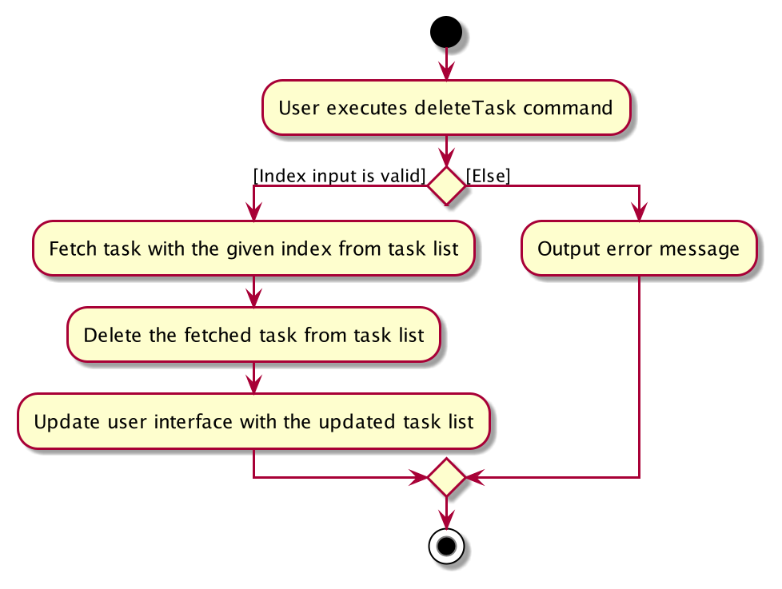

* Table of Contents
{:toc}

--------------------------------------------------------------------------------------------------------------------

## **Setting up, getting started**

Refer to the guide [_Setting up and getting started_](SettingUp.md).

--------------------------------------------------------------------------------------------------------------------

## **Design**

### Architecture

The ***Architecture Diagram*** given above explains the high-level design of the App. Given below is a quick overview of each component.

:bulb: **Tip:** The `.puml` files used to create diagrams in this document can be found in the [diagrams](https://github.com/AY2021S2-CS2103T-W14-3/tp/tree/master/docs/diagrams) folder. Refer to the [_PlantUML Tutorial_ at se-edu/guides](https://se-education.org/guides/tutorials/plantUml.html) to learn how to create and edit diagrams.

**`Main`** has two classes called [`Main`](https://github.com/AY2021S2-CS2103T-W14-3/tp/blob/master/src/main/java/seedu/heymatez/Main.java) 
and [`MainApp`](https://github.com/AY2021S2-CS2103T-W14-3/tp/blob/master/src/main/java/seedu/heymatez/MainApp.java). It is responsible for,
* At app launch: Initializes the components in the correct sequence, and connects them up with each other.
* At shut down: Shuts down the components and invokes cleanup methods where necessary.

[**`Commons`**](#common-classes) represents a collection of classes used by multiple other components.

The rest of the App consists of four components.

* [**`UI`**](#ui-component): The UI of the App.
* [**`Logic`**](#logic-component): The command executor.
* [**`Model`**](#model-component): Holds the data of the App in memory.
* [**`Storage`**](#storage-component): Reads data from, and writes data to, the hard disk.

Each of the four components,

* defines its *API* in an `interface` with the same name as the Component.
* exposes its functionality using a concrete `{Component Name}Manager` class (which implements the corresponding API `interface` mentioned in the previous point.

For example, the `Logic` component (see the class diagram given below) defines its API in the `Logic.java` interface and exposes its functionality using the `LogicManager.java` class which implements the `Logic` interface.

**How the architecture components interact with each other**

The *Sequence Diagram* below shows how the components interact with each other for the scenario where the user issues the command `deleteTask 1`.

The sections below give more details of each component.

### UI component

**API** :
[`Ui.java`](https://github.com/AY2021S2-CS2103T-W14-3/tp/blob/master/src/main/java/seedu/heymatez/ui/Ui.java)

The UI consists of a `MainWindow` that is made up of parts e.g.`CommandBox`, `ResultDisplay`, `PersonListPanel`, `TaskListPanel`, `StatusBarFooter` etc. All these, including the `MainWindow`, inherit from the abstract `UiPart` class.

The `UI` component uses JavaFx UI framework. The layout of these UI parts are defined in matching `.fxml` files that are in the `src/main/resources/view` folder. For example, the layout of the [`MainWindow`](https://github.com/AY2021S2-CS2103T-W14-3/tp/blob/master/src/main/java/seedu/heymatez/ui/MainWindow.java) is specified in [`MainWindow.fxml`](https://github.com/AY2021S2-CS2103T-W14-3/tp/blob/master/src/main/resources/view/MainWindow.fxml)

The `UI` component,

* Executes user commands using the `Logic` component.
* Listens for changes to `Model` data so that the UI can be updated with the modified data.

### Logic component

**API** :
[`Logic.java`](https://github.com/AY2021S2-CS2103T-W14-3/tp/blob/master/src/main/java/seedu/heymatez/logic/Logic.java)

1. `Logic` uses the `HeyMatezParser` class to parse the user command.
1. This results in a `Command` object which is executed by the `LogicManager`.
1. The command execution can affect the `Model` (e.g. adding a task).
1. The result of the command execution is encapsulated as a `CommandResult` object which is passed back to the `Ui`.
1. In addition, the `CommandResult` object can also instruct the `Ui` to perform certain actions, such as displaying help to the user.

Given below is the Sequence Diagram for interactions within the `Logic` component for the `execute("deleteTask 1")` API call.

:information_source: **Note:** The lifeline for `DeleteTaskCommandParser` should end at the destroy marker (X) but due to a limitation of PlantUML, the lifeline reaches the end of diagram.

### Model component

**API** : [`Model.java`](https://github.com/AY2021S2-CS2103T-W14-3/tp/blob/master/src/main/java/seedu/heymatez/model/Model.java)

The `Model`,

* stores a `UserPref` object that represents the user’s preferences.
* stores the heymatez data.
* exposes an unmodifiable `ObservableList<Person>` and `ObservableList<Task>` that can be 'observed' e.g. the UI can be bound to this list so that the UI automatically updates when the data in the list change.
* does not depend on any of the other three components.

### Storage component

**API** : [`Storage.java`](https://github.com/AY2021S2-CS2103T-W14-3/tp/blob/master/src/main/java/seedu/heymatez/storage/Storage.java)

The `Storage` component,
* can save `UserPref` objects in json format and read it back.
* can save the Hey Matez data in json format and read it back.

### Common classes

Classes used by multiple components are in the `seedu.heymatez.commons` package.

--------------------------------------------------------------------------------------------------------------------

## **Implementation**
This section documents some of the noteworthy details on how certain features are implemented

### Mark as completed / uncompleted features

The implementation of the mark as completed and uncompleted features are facilitated by the `DoneTaskCommand` and `UndoTaskCommand` classes respectively, both of which extends from the Command abstract class.

The execution of the command is also facilitated by the following Parser Classes:
* `DoneTaskCommandParser`
* `UndoTaskCommandParser`

The above mentioned Parser classes inherit the `#parse` method from the `Parser` interface.

* `DoneTaskCommandParser#parse` - checks if the arguments passed to the current DoneTaskCommand is valid and creates an DoneTaskCommand instance if it is.
* `UndoTaskCommandParser#parse` - checks if the arguments passed to the current UndoTaskCommand is valid and creates an UndoTaskCommand instance if it is.

Subsequently, the created `DoneTaskCommand` / `UndoTaskCommand` object contains an `#execute` method which is responsible for
updating the status of the Task to `completed` or `uncompleted`. This is achieved by creating a new `Task` object with the
same fields and values but updating the `TaskStatus` field depending on which command is being executed.

 
Below is the usage scenario and how the mark task as completed mechanism behaves.

Assumptions:
1. User has already launched the app
2. HEY MATEz application has an existing task whose status is `uncompleted`

Step 1. User executes the `done 1` command to mark the task with index number 1 in the task list of HEY MATEz as `completed`. 
 A `DoneTaskCommandParser` object is created and it calls `DoneTaskCommandParser#parse` on the arguments given.

Step 2. The `DoneTaskCommandParser#parse` method will check the validity of the argument given for a `DoneTaskCommand`. If it
is valid, it will create a new `DoneTaskCommand` instance by calling the constructor of `DoneTaskCommand`.

Step 3. The `DoneTaskCommand#execute` method is then called by the `LogicManager`. The task with the same `Index` is retrieved and
a copy of the task is created with the same attribute values. However, the `TaskStatus` value is updated to `completed`. The task copy
with the updated status replaces the old task in the `Model`.

Step 4. Once the execution is completed, the message `MESSAGE_DONE_TASK_SUCCESS` is used to return a new Command Result
with the attached message.

Below is the sequence diagram to show how the mark task as completed mechanism works:

### Find Tasks with deadline before a selected date feature

The implementation of the finding of tasks with deadlines before a selected date is facilitated by the `FindTasksBeforeCommand`
class, which extends from the Command abstract class.

It is also facilitated by the following Parser Class:
* `FindTasksBeforeCommandParser`

The above mentioned Parser class inherits the `#parse` method from the Parser interface.

* `FindTasksBeforeParser#parse` - checks if the deadline passed to the current FindTasksBeforeCommand is in the correct format and is valid, then creates a FindTasksBeforeCommand instance if they are.

Subsequently, the created `FindTasksBeforeCommand` object contains an `#execute` method which is responsible for
updating the task list to contain the tasks with deadlines before the selected date. This is achieved by calling on `Model#updateFilteredTaskList`
with the DeadlineBeforeDatePredicate which updates the task list with tasks that match the given predicate.

Below is the usage scenario and how the finding of tasks due before a selected date mechanism behaves.

Assumptions:
1. User has already launched the app
2. HEY MATEz application has existing tasks with their corresponding deadlines

Step 1. User executes the `findBefore 2021-04-04` command to show the tasks in the task list of HEY MATEz with deadlines before 2021-04-04.  A
`FindTasksBeforeCommandParser` is created and it calls `FindTasksBeforeParser#parse` on the arguments

Step 2. The `FindTasksBeforeCommandParser#parse` method will check the validity of the deadline argument for a `FindTasksBeforeCommand`. If it is
valid,  it will create a new `FindTasksBeforeCommand` instance by calling the constructor with the DeadlineBeforeDatePredicate.

Step 3. The `FindTasksBeforeCommand#execute` method is then called by the `LogicManager`. The tasks with deadline before 2021-04-04 are selected by the 
DeadlineBeforeDatePredicate.

Step 4. Once the execution is completed, the message `MESSAGE_TASKS_LISTED_OVERVIEW,` is used to return a new Command Result
with the attached message.

Below is the sequence diagram:

### Delete a Task feature

The implementation of the delete a task feature is facilitated by the DeleteTaskCommand, which extends from the Command abstract class.

It is also enabled by the following Parser class:
* `DeleteTaskCommandParser`

The above mentioned Parser class inherits the `#parse method` from the Parser interface.

* `DeleteTaskCommandParser#parse` - checks if the arguments passed to the current DeleteTaskCommand is valid. 
  If the arguments are valid, it creates a DeleteTaskCommand instance.

Subsequently, the created `DeleteTaskCommand` object contains an `#execute` method which 
is responsible for deleting the given Task with respect to the index. This is achieved by calling on
`Model#deleteTask` with the task to be deleted where it will be removed from the list of tasks. 

Below is the usage scenario of how delete task mechanism behaves.

Assumptions:
1. User has already launched the app
2. HEY MATEz application has an existing task

Step 1. User executes the `deleteTask 1` command to delete the task at the 1st index in the task list of HEY MATEz. 
A `DeleteTaskCommandParser` object is created and calls the `DeleteTaskCommandParser#parse` on the arguments.

Step 2. The `DeleteTaskCommandParser#parse` method then checks on the validity of the arguments given for a `DeleteTaskCommand`. 
If it is valid, it will create a new `DeleteTaskCommand` instance by calling the constructor along with the task `Index`.

Step 3. The `DeleteTaskCommand#execute` method is then called by `Logic Manager`. The task with the same `Index` is retrieved
and deleted from the task list when `Model#deleteTask` is called.

Step 4. Once the execution is completed, the message `MESSAGE_DELETE_TASK_SUCCESS` is used to return a 
new Command Result with the attached message.

Below is the sequence diagram: 

The following activity diagram below summarizes what happens when a user executes the delete task command:

### Clear all Assignees of a Task feature

The implementation of the clear all assignees of a task feature is facilitated by the `ClearAssigneeCommand` 
class which extends from the Command abstract class.

It is also facilitated by the following Parser Classes:
* `ClearAssigneesCommandParser`

The above mentioned Parser class inherits the `#parse` method from the Parser interface.

* `ClearAssigneesCommandParser#parse` - checks if the arguments passed to the current ClearAssigneeCommand is valid. 
  If the arguments are valid, it creates a ClearAssigneeCommand instance.

Subsequently, the created `ClearAssigneeCommand` object contains an `#execute` method which is responsible for
clearing all assignees of the Task, with respect to its index. This is achieved by creating a new 
`Task` object with the same fields and values as before but with the assignees field set to be a new empty HashSet. 

Below is the usage scenario of how the clear all assignees of a Task mechanism behaves.

Assumptions:
1. User has already launched the app
2. HEY MATEz application has an existing task with **assignees**

Step 1. User executes the `clearAssignees 1` command to clear all the assignees of the task at index 1 in the task list of 
HEY MATEz. A ` ClearAssigneesCommandParser` object is created and it calls `ClearAssigneesCommandParser#parse` on the arguments.

Step 2. The `ClearAssigneesCommandParser#parse` method will check on the validity of the arguments given for a `ClearAssigneesCommand`. 
If it is valid, it will create a new `ClearAssigneesCommand` instance by calling the constructor of `ClearAssigneesCommand`.

Step 3. The `ClearAssigneesCommand#execute` method is then called by the `LogicManager`. The task with the same `Index` 
is retrieved and a copy of the task is created with the same attribute values but with the assignees field updated to be a 
new empty HashSet. The copy of the task with the updated assignees field replaces the old task in the `Model`.

Step 4. Once the execution is completed, the message `MESSAGE_CLEARED_ASSIGNEES_SUCCESS` is used to return a new Command Result
with the attached message.

The following sequence diagram shows how the clear all assignees of a Task mechanism behaves. 

* Note: The lifeline for `ClearAssigneesCommandParser` and `ClearAssigneesCommand` should end at the destroy marker (X) 
  but due to the limitation of PlantUML, the lifeline reaches the end of the sequence diagram.
  
--------------------------------------------------------------------------------------------------------------------

## **Documentation, logging, testing, configuration, dev-ops**

* [Documentation guide](Documentation.md)
* [Testing guide](Testing.md)
* [Logging guide](Logging.md)
* [Configuration guide](Configuration.md)
* [DevOps guide](DevOps.md)

--------------------------------------------------------------------------------------------------------------------

## **Appendix: Requirements**

### Product scope

**Target user profile**:

* CCA / Club head who is managing many members and tasks
* Needs an efficient and organised method to assign tasks to these members
* Prefer desktop apps over other types
* Prefers typing to mouse interactions

**Value proposition**: Manage the members and tasks of a club quickly and efficiently.

### User stories

Priorities: High (must have) - `* * *`, Medium (nice to have) - `* *`, Low (unlikely to have) - `*`

| Priority | As a …​                                    | I want to …​                     | So that I can…​                                                        |
| -------- | ------------------------------------------ | ------------------------------ | ---------------------------------------------------------------------- |
| `* * *`  | user starting to use the app| be able to add in the contacts of my CCA members | have a better overview of the members in my CCA and access their information easily|
| `* * *`  | forgetful CCA leader | be able to view who have been added into my contacts | retrieve their information and add the remaining members too |
| `* * *`  | CCA leader with many tasks to be done | be able to add the tasks of our CCA | better manage the tasks |
| `* * *`  | CCA leader whose tasks' details need to be updated constantly | be able to edit the details of the tasks accordingly | keep the tasks' details updated |
| `* * *`  | CCA leader with tasks that are no longer relevant | be able to delete tasks that are either completed or unnecessary | keep the list organized and clear |
| `* * *`  | CCA leader with projects and tasks piling up | be able to view a list of tasks that is to be completed by members of the CCA | be updated with what needs to be done |
| `* * *`  | CCA leader who has members leaving the CCA | be able to remove details of the members from the application | better manage my members |
| `* * *`  | CCA leader whose members’ details have changed | be able to edit the details of the members in the application | keep my contacts up-to-date |
| `* * *` | CCA leader with many deadlines to meet | be able to set deadlines for specific tasks | keep track of the tasks' deadlines |
| `* * *` | CCA leader with tasks to be distributed | be able to assign tasks to students | track the distribution of tasks to certain members|
| `* * `  | CCA leader with tasks that are being completed every other week | be able to mark tasks as ‘completed’  | track which tasks are completed |
| `* * `  | CCA leader | be able to change the assignee of a task | easily update the member assigned to the task |
| `* * `  | CCA leader | be able to assign a priority to a task | take note of the tasks that are more important and need to be completed first |
| `* * `  | CCA leader who has many tasks to supervise | be able to search for tasks of a certain priority | better manage tasks of different priorities |
| `* * `  | CCA leader whose members have different roles | be able to assign roles to the members | be aware of the members' roles |
| `* * `  | CCA leader whose members have different roles | be able to edit the roles to the members | update the members' roles when there is a change in their roles |
| `* `  | CCA leader who is very forgetful | be notified if I have accidentally added duplicate tasks | prevent repeated tasks from being added |
| `* `  | CCA leader who has a lot of tasks to manage | search for tasks which contain a particular word  | find tasks more efficiently and quickly |
| `* `  | forgetful CCA leader who has forgotten which tasks have not been assigned | be able to get a list of tasks that have not been assigned | distribute tasks more efficiently |
| `* `  | CCA leader | be able to get a list of tasks that have not been completed | check on the progress of the tasks |
| `* `  | CCA leader | be able to get a list of tasks with deadlines that are prior to a certain date | make sure I do not miss those deadlines |
| `* `  | CCA leader | be able to get a list of tasks assigned to a particular member | check on the workload of a particular member |

### Use cases

(For all use cases below, the **System** is the `HEY MATEz` and the **Actor** is the `user`, unless specified otherwise)

:pencil2: **Use case: Add a Member**

**MSS**

1.  User requests to add a member
2.  HEY MATEz adds the member to the list of members

Use case ends.

**Extensions**

* 1a. Member already exists (Matching Name) in the list
    * 1a1. HEY MATEz shows an error message
* 1b. The name, phone number, email or role provided for the member is invalid
    * 1b1. HEY MATEz shows an error message   
  
Use case ends.

:pencil2: **Use case: View Members**

**MSS**

1.  User requests to view the members
2.  HEY MATEz lists the members and their details
    
Use case ends.

:pencil2: **Use case: Delete a Member**

**MSS**

1.  User requests to delete a member by specifying the member's name
2.  HEY MATEz searches for the member's name in the currently displayed list of members
3.  HEY MATEz deletes the specified member from the members list
    
Use case ends. 

**Extensions** 

* 2a. Member name provided by user does not exist in the currently displayed list of members
    * 2a1. HEY MATEz shows an error message
  
Use case ends.

:pencil2: **Use case: Edit Member's details**

**MSS**

1.  User requests to edit the details of a member by specifying the member's name
2.  HEY MATEz searches for the member's name in the currently displayed list of members 
3.  HEY MATEz edits the corresponding member with the new details 
    
Use case ends. 

**Extensions**

* 1a. The new name, phone number, email or role provided for the member is invalid
    * 1a1. HEY MATEz shows an error message   
* 2a. Member name provided by user does not exist in the currently displayed list of members
    * 2a1. HEY MATEz shows an error message

Use case ends.

:pencil2: **Use case: Find Members with keywords**

**MSS**

1.  User requests to find members using the keywords specified
2.  HEY MATEz searches through each member's details 
3.  HEY MATEz lists members whose details matches any of the keywords 
    
Use case ends.

:pencil2: **Use case: Add a Task**

**MSS**

1.  User requests to add a task
2.  HEY MATEz adds the task to the task list
    
Use case ends.

**Extensions**

* 1a. Task already exists (Matching Title) in the list
    * 1a1. HEY MATEz shows an error message
* 1b. The title, description, deadline, status or priority provided for the task is invalid
    * 1b1. HEY MATEz shows an error message     
      
Use case ends.

:pencil2: **Use case: View Tasks**

**MSS**

1.  User requests to view the list of tasks
2.  HEY MATEz lists all the tasks along with its details
    
Use case ends.

:pencil2: **Use case: Delete a Task**

**MSS**

Similar to deleting a member but user specifies task index instead of name

**Extensions**

* 2a. Task index does not exist in the current displayed list of tasks
    * 2a1. HEY MATEz shows an error message
  
Use case ends.

:pencil2: **Use case: Edit a Task**

**MSS**

Similar to editing a member except that the user specifies task index instead of name

**Extensions**

* 1a. The new title, description, deadline, status or priority provided for the task is invalid
    * 1a1. HEY MATEz shows an error message   
* 2a. Task index does not exist in the currently displayed list of tasks
    * 2a1. HEY MATEz shows an error message
  
Use case ends.

:pencil2: **Use case: Find Tasks with keywords**

**MSS**

Similar to finding members with keywords except that HEY MATEz 
lists tasks with its title or description matching any of the keywords

:pencil2: **Use case: Find tasks with deadline before a specified date**

**MSS**

1. User requests to find tasks which deadlines before their specified date
2. HEY MATEz searches through tasks' deadline 
3. HEY MATEz lists tasks with deadlines before the specified date
   
Use case ends.

Extensions
* 1a. The deadline provided by user is not in the correct format or is invalid
    * 1a1. HEY MATEz shows an error message
    
Use case ends.

:pencil2: **Use case: Find Tasks using Priority**

**MSS**

1.  User requests to find tasks of a certain priority
2.  HEY MATEz searches through each task
3.  HEY MATEz lists tasks with a matching priority
    
Use case ends.

**Extensions**
* 1a. The priority input provided by the user is not a valid priority
    * 1a1. HEY MATEz shows an error message
      
Use case ends.

:pencil2: **Use case: Mark a Task as Completed**

**MSS**

1.  User requests to mark a task as completed using the task's index
2.  HEY MATEz searches for the task index
3.  HEY MATEz changes the status of the task in the list to completed
    
Use case ends.

**Extensions**
* 2a. Task index does not exist in the currently displayed list of tasks
    * 2a1. HEY MATEz shows an error message
  
Use case ends.

:pencil2: **Use case: Mark a Task as Uncompleted**

**MSS**

1.  User requests to mark a task as uncompleted using the task's index
2.  HEY MATEz searches for the task index 
3.  HEY MATEz changes the status of the task in the list to uncompleted
    
Use case ends.

**Extensions**
* 2a. Task index does not exist in the currently displayed list of tasks
    * 2a1. HEY MATEz shows an error message
  
Use case ends.

:pencil2: **Use case: Remove all Members Assigned to a Task**

**MSS**

1.  User requests to remove all assignees from a task using the task's index
2.  HEY MATEz searches for the task index 
3.  HEY MATEz removes all members assigned to the task

**Extensions**
* 2a. Task index does not exist in the currently displayed list of tasks
    * 2a1. HEY MATEz shows an error message

Use case ends.

:pencil2: **Use case: View Uncompleted Tasks**

**MSS**

1.  User requests to view the list of uncompleted tasks
2.  HEY MATEz lists the uncompleted tasks 
    
Use case ends.

:pencil2: **Use case: View Unassigned Tasks**

**MSS**

Similar to viewing a list of uncompleted tasks but a list of unassigned task is displayed instead.

:pencil2: **Use case: Find all Tasks assigned to a particular Member**

**MSS**

1.  User requests to find tasks assigned to a member using the member's name
2.  HEY MATEz searches through each task and checks the assignees of the task
3.  HEY MATEz lists tasks which has the specified name as an assignee
    
Use case ends.

--------------------------------------------------------------------------------------------------------------------

### Non-Functional Requirements
1. Should work on any _mainstream OS_ as long as it has Java `11` or above installed.
2. Data should be persistent after exiting and reopening the app.
3. App should run locally on the user's computer.

### Glossary
* **Mainstream OS**: Windows, Linux, Unix, OS-X
* **CCA / Club head**: A person who has a position in a Club / CCA and is required to manage the tasks and members within the club

--------------------------------------------------------------------------------------------------------------------

## **Appendix: Instructions for manual testing**

Given below are instructions to test the app manually.

:information_source: **Note:** These instructions only provide a starting point for testers to work on;
testers are expected to do more *exploratory* testing.

### Launch and Shutdown

1. Initial launch

   1. Download the jar file and copy into an empty folder.

   2. Double-click the jar file Expected: Shows the GUI with a set of sample contacts and tasks. The window size may not be optimum.

2. Saving window preferences

   1. Resize the window to an optimum size. Move the window to a different location. Close the window.

   2. Re-launch the app by double-clicking the jar file. 
       Expected: The most recent window size and location is retained.

3. Shutting down
    1. Launch the help window using the `help` command. 
    
    2. Close the app using the `exit` command.  
        Expected: Both the help and main window should be closed.

### Viewing Help 

1. Viewing help 

    1. Test case: `help`  
        Expected: A help window is being displayed. 

### Clearing Data

1. Clearing all the data in the app
   
    1. Prerequisites: There is at least 1 member in the members list or 1 task in the task list.

    2. Test case: `clear`  
       Expected: All the data in HEY MATEz is cleared.
       
### Adding a member

1. Adding a member 

   1. Prerequisites: No duplicate members exist.

   1. Test case: `addMember Alice p/12345678 e/Alice@gmail.com` 
      Expected: Member is successfully added, with the details of the member displayed in the status bar.

   1. Test case: `addMember Bryan p/45678910 e/Bryan@gmail.com r/President` 
      Expected: Member is successfully added, with the details of the member displayed in the status bar.
   
   1. Test case: `addMember Charlie p/12345678 e/Charlie.com ` 
      Expected: No member is added since the email given is invalid. Error details shown in the status bar.

   1. Test case: `addMember Charlie p/12 e/Charlie@gmail.com` 
      Expected: No member is added since the phone number given is invalid. Error details shown in the status bar.

   1. Other incorrect commands to try: `addMember`, `addMember Alice`, `addMember Alice p/12345678`, `addMember Alice e/Alice@gmail.com`  
      Expected: similar to previous.

### Viewing members

1. Lists all members within HEY MATEz

   1. Test case: `viewMembers` 
      Expected: Lists all members within HEY MATEz.

### Deleting a Member

1. Deleting a member

    1. Prerequisites: List all members using the `viewMembers` command. A member with the name of Rachel exists in the members list
       while no members with the name of John exists.

    2. Test case: `deleteMember Rachel` 
       Expected: Member with the name Rachel is deleted from the members list. Details of the deleted member is shown in the
       status message.

    3. Test case: `deleteMember John` 
       Expected: No member is deleted. Error details is shown in the status message.

    4. Other incorrect delete commands to try: `delete`, `deleteMember x` (where x is a name which does not exist in the members list)  
       Expected: Similar to previous test case.

### Editing a Member

1. Editing a member

    1. Prerequisites: List all members using the `viewMembers` command. Members with the name of Alice and Timothy exists
       in the members list while no members with the name of Dylan exists.

    2. Test case: `editMember Alice n/Allyson` 
       Expected: Member with the name Alice is edited to have a new name of Allyson. Details of the edited member is shown
       in the status message.

    3. Test case: `editMember Alice n/Timothy` 
       Expected: No member is edited since a member with the name Timothy already exists. Error details is shown in the status
       message.
       
    4. Test case: `editMember Alice n/Alice Tan p/98887777 e/aliceTan@gmail.com`
       Expected: Member with the name Alice is edited to have the new details as specified. Details of the edited member is shown
       in the status message.

    5. Test case: `editMember Dylan` 
       Expected: No member is edited. Error details is shown in the status message.

    6. Other incorrect delete commands to try: `edit`, `editMember x` (where x is a name which does not exist in the members list)  
       Expected: Similar to previous test case.

### Finding Members by Keywords

1. Finding members in HEY MATEz whose details (i.e. name, phone number, email, role) contain any of the specified keywords

    1. Prerequisites: HEY MATEz contains 2 members with the following details:  
        * 1. Name: Alice, Phone Number: 98887777, Email: alice@gmail.com, Role: Secretary
        * 2. Name: Bryan, Phone Number: 89996666, Email: bryan@gmail.com, Role: Secretary

    2. Test case: `findMembers Alice` 
       Expected: Alice is listed in the members list.

    3. Test case: `findMembers alice@gmail.com bryan@gmail.com`  
       Expected: Both Alice and Bryan are listed in the members list.

    4. Test case: `findMembers secretary` 
       Expected: Both Alice and Bryan are listed in the members list since keywords specified are case-insensitive.

    5. Test case: `findMembers President`  
       Expected: Both Alice and Bryan are not listed since none of their details matches the specified keyword.

    6. Test case: `findMembers` 
       Expected: Invalid command format, error details is shown in the status message.
       
### Viewing tasks

1. Lists all tasks within HEY MATEz. 
   
    1. Test case: `viewTasks` 
       Expected: Lists all tasks within the HEY MATEz.
       
### Deleting a Task

1. Deleting a Task while all tasks are being shown.

    1. Prerequisites: List all tasks using the `viewTasks` command. 3 different tasks in the list. 
       All 3 tasks have different indexes(1, 2, 3).

    2. Test case: `deleteTask 1` 
       Expected: Task with the index `1` is deleted from the list. Details of the deleted task shown in the status message.

    3. Test case: `deleteTask 4` 
       Expected: No task is deleted. Error details shown in the status message(Index is invalid).

    4. Other incorrect commands to try: `deleteTask`, `deleteTask abc`, `deleteTask -1`, `...`  
       Expected: Similar to previous.
       
### Mark a task as completed

1. Mark a task as completed:

   1. Prerequisites: List all tasks with the `viewTasks` command. There exists a task at index 1 whose task status is **uncompleted**.

   1. Test case: `done 1` 
      Expected: Status of task at index 1 is updated to **completed**. Successful task status update message is shown in the status bar.
      
   1. Test case: `done 0` 
      Expected: No task marked as **completed**. Error details is shown in the status bar.      
      
   1. Other incorrect commands to try: `done`, `done -1` 
      Expected: Similar to previous. 
      
### Mark a task as uncompleted

1. Mark a task as uncompleted: 

   1. Prerequisites: List all tasks with the `viewTasks` command. There exists a task at index 1 whose task status is **completed**.

   1. Test case: `undo 1` 
      Expected: Status of task at index 1 is updated to **uncompleted**. Successful task status update message is shown in the status bar.
      
   1. Test case: `undo 0` 
      Expected: No task marked as **uncompleted**. Error details is shown in the status bar.      
      
   1. Other incorrect commands to try: `undo`, `undo -1` 
      Expected: Similar to previous.   
      
### Viewing a list of unassigned tasks

1. Lists all unassigned tasks within HEY MATEz.

    1. Test case: `viewUnassignedTasks` 
       Expected: Lists all tasks that are unassigned within the HEY MATEz.

### Viewing a list of uncompleted tasks

1. Lists all uncompleted tasks within HEY MATEz.

    1. Test case: `viewUncompletedTasks` 
       Expected: Lists all tasks that are uncompleted within the HEY MATEz.

### Find tasks by priority

1. Find all tasks within HEY MATEz with the specified priority

   1. Test case: `findPriority high` 
      Expected: Lists all tasks within HEY MATEz whose priority is **high**.

   1. Test case: `findPriority medium` 
      Expected: Lists all tasks within HEY MATEz whose priority is **medium**.

   1. Test case: `findPriority low` 
      Expected: Lists all tasks within HEY MATEz whose priority is **low**.

   1. Test case: `findPriority unassigned` 
      Expected: Lists all tasks within HEY MATEz whose priority is **unassigned**.

   1. Test case: `findPriority unsure` 
      Expected: Error message displayed in the status bar.

   1. Test case: `findPriority HIGH` 
      Expected: Error message displayed in the status bar.

   1. Other incorrect commands to try: `findPriority, findPriority LOW`, `findPriority MeDIum`, etc.
      Expected: Similar to previous.   

### Find tasks assigned to a member

1. Lists all tasks assigned to a member

   1. Prerequisites: There exists a member with the name of Alice and a task assigned to Alice within HEY MATEz.
   
   1. Test case: `findTasksFor Alice` 
      Expected: Lists the task which is assigned to Alice.
      
   1. Test case: `findTasksFor`
      Expected: Error message displayed in the status bar.

### Finding Tasks by Keywords

1. Finding tasks in HEY MATEz whose title or description contain any of the specified keywords

    1. Prerequisites: HEY MATEz contains 2 tasks, T1 and T2, with the following details:  
        * T1. Title: Community outreach proposal, Description: Write detailed proposal for MINDS outreach session
        * T2. Title: Proposal for EXCO event, Description: Plan and discuss timeline for EXCO event 

    2. Test case: `findTasks Community` 
        Expected: Task T1 is listed in the task list. 

    3. Test case: `findTasks Community EXCO`  
        Expected: Both task T1 and T2 are listed in the task list.

    4. Test case: `findTasks proposal` 
       Expected: Both task T1 and T2 are listed in the task list since keywords specified are case-insensitive.

    5. Test case: `findTasks Pitch`  
       Expected: Both task T1 and T2 are not listed since their title and description does not contain the specified keyword.
       
    6. Test case: `findTasks` 
       Expected: Invalid command format, error details is shown in the status message.

### Clearing all Assignees of a Task

1. Clearing all Assignees of a Task
    1. Prerequisites: List all tasks using the `viewTasks` command. There exists a task at index 1 with at least 1 member 
       assigned to it.

   2. Test case: `clearAssignees 1` 
      Expected: All members assigned to the task at index 1 is cleared. Details of the task being cleared is shown
      in the status message.
      
   3. Test case: `clearAssignees 0` 
      Expected: No task is being cleared. Error details is shown in the status bar.

   1. Other incorrect commands to try: `clearAssignees`, `clearAssignees -1`
      Expected: Similar to previous test case.
