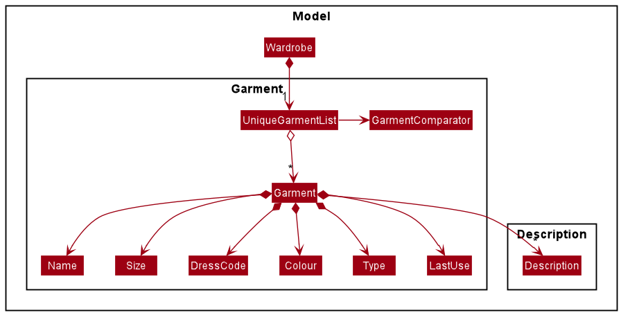

# Developer Guide
---
layout: page
title: Developer Guide
---
* Table of Contents
  {:toc}

--------------------------------------------------------------------------------------------------------------------

## **Setting up, getting started**

Refer to the guide [_Setting up and getting started_](SettingUp.md).

--------------------------------------------------------------------------------------------------------------------

## **Design**

### Architecture

The ***Architecture Diagram*** given above explains the high-level design of the App. Given below is a quick overview of each component.

:bulb: **Tip:** The `.puml` files used to create diagrams in this document can be found in the [diagrams](https://github.com/se-edu/addressbook-level3/tree/master/docs/diagrams/) folder. Refer to the [_PlantUML Tutorial_ at se-edu/guides](https://se-education.org/guides/tutorials/plantUml.html) to learn how to create and edit diagrams.

**`Main`** has two classes called [`Main`](https://github.com/se-edu/addressbook-level3/tree/master/src/main/java/seedu/address/Main.java) and [`MainApp`](https://github.com/se-edu/addressbook-level3/tree/master/src/main/java/seedu/address/MainApp.java). It is responsible for,
* At app launch: Initializes the components in the correct sequence, and connects them up with each other.
* At shut down: Shuts down the components and invokes cleanup methods where necessary.

[**`Commons`**](#common-classes) represents a collection of classes used by multiple other components.

The rest of the App consists of four components.

* [**`UI`**](#ui-component): The UI of the App.
* [**`Logic`**](#logic-component): The command executor.
* [**`Model`**](#model-component): Holds the data of the App in memory.
* [**`Storage`**](#storage-component): Reads data from, and writes data to, the hard disk.

Each of the four components,

* defines its *API* in an `interface` with the same name as the Component.
* exposes its functionality using a concrete `{Component Name}Manager` class (which implements the corresponding API `interface` mentioned in the previous point.

For example, the `Logic` component (see the class diagram given below) defines its API in the `Logic.java` interface and exposes its functionality using the `LogicManager.java` class which implements the `Logic` interface.

**How the architecture components interact with each other**

The *Sequence Diagram* below shows how the components interact with each other for the scenario where the user issues the command `delete 1`.

The sections below give more details of each component.

### UI component

**API** :
[`Ui.java`](https://github.com/AY2021S2-CS2103T-T12-1/tp/blob/master/src/main/java/seedu/address/ui/Ui.java)

The UI consists of a `MainWindow` that is made up of parts e.g.`CommandBox`, `ResultDisplay`, `GarmentListPanel`, `StatusBarFooter` etc. All these, including the `MainWindow`, inherit from the abstract `UiPart` class.

The `UI` component uses JavaFx UI framework. The layout of these UI parts are defined in matching `.fxml` files that are in the `src/main/resources/view` folder. For example, the layout of the [`MainWindow`](https://github.com/AY2021S2-CS2103T-T12-1/tp/blob/master/src/main/java/seedu/address/ui/MainWindow.java) is specified in [`MainWindow.fxml`](https://github.com/AY2021S2-CS2103T-T12-1/tp/blob/master/src/main/resources/view/MainWindow.fxml)

The `UI` component,

* Executes user commands using the `Logic` component.
* Listens for changes to `Model` data so that the UI can be updated with the modified data.

### Logic component

**API** :
[`Logic.java`](https://github.com/AY2021S2-CS2103T-T12-1/tp/blob/master/src/main/java/seedu/address/logic/Logic.java)

1. `Logic` uses the `WardrobeParser` class to parse the user command.
1. This results in a `Command` object which is executed by the `LogicManager`.
1. The command execution can affect the `Model` (e.g. adding a person).
1. The result of the command execution is encapsulated as a `CommandResult` object which is passed back to the `Ui`.
1. In addition, the `CommandResult` object can also instruct the `Ui` to perform certain actions, such as displaying help to the user.

Given below is the Sequence Diagram for interactions within the `Logic` component for the `execute("delete 1")` API call.

:information_source: **Note:** The lifeline for `DeleteCommandParser` should end at the destroy marker (X) but due to a limitation of PlantUML, the lifeline reaches the end of diagram.

### Model component

**API** : [`Model.java`](https://github.com/AY2021S2-CS2103T-T12-1/tp/blob/master/src/main/java/seedu/address/model/Model.java)

The `Model`,

* stores a `UserPref` object that represents the user’s preferences.
* stores the address book data.
* exposes an unmodifiable `ObservableList<Garment>` that can be 'observed' e.g. the UI can be bound to this list so that the UI automatically updates when the data in the list change.
* does not depend on any of the other three components.

:information_source: **Note:** An alternative (arguably, a more OOP) model is given below. It has a `Description` list in the `Wardrobe`, which `Garment` references. This allows `Wardrobe` to only require one `Description` object per unique `Description`, instead of each `Garment` needing their own `Description` object. 

### Storage component

**API** : [`Storage.java`](https://github.com/AY2021S2-CS2103T-T12-1/tp/blob/master/src/main/java/seedu/address/storage/Storage.java)

The `Storage` component,
* can save `UserPref` objects in json format and read it back.
* can save the wardrobe data in json format and read it back.

### Common classes

Classes used by multiple components are in the `seedu.address.commons` package.

--------------------------------------------------------------------------------------------------------------------

## Implementation
This section describes some noteworthy details on how certain features are implemented.

### [Completed] Default Sorting Order of Garments in Wardrobe

#### Proposed Implementation

The proposed default sorting order of Garments in the Wardrobe, which lists out the Garments based on when they have been last used. The new default sorting order sorts the list of garments
based on the date that they were last used, and outputs the entries from the earliest used date to the latest used date.

This is achieved through the creation of the `LastUse` attribute that is tied to the `Garment` object, that gives a date as to when it was last used.

The Wardrobe is sorted at the `UniqueGarmentList` level with the help of `GarmentComparator`.

The following diagram shows where sorting occurs in the Model component (higher level elements omitted).

#### Design Consideration:

##### Aspect: Sorting the garments
* **Alternative 1 (Chosen implementation)**:  
  Lists out the garments based on chronological ordering of the `LastUse` attribute.
  * Pros: Garments that have not been used for a longer period of time come up earlier in the list, which would 
    encourage and remind users to wear all their clothes.
  * Cons: Garments may not have been used for a reason, which may result in user taking a longer time to sieve 
    through the list.
* **Alternative 2**:  
  Sorts garments based on reverse chronological ordering of the `LastUse` attribute, from the latest used date to the earliest used date.
  * Pros: Garments that are often used could be better suited for the users' needs, and making them come 
    earlier in the list allows users sieving through the list quicker.
  * Cons: Users may forget about the Garments that they have not worn in some time.
* **Alternative 3**:  
    Sorts the garments based on chronological or reverse chronological ordering of the `LastUse` attribute based on user input.
  * Pros: Allows users to choose which ordering they want, and they can get the respective benefits as above.
  * Cons: Requires more time to implement.

### [Proposed] Find feature

#### Proposed Implementation

The proposed `find` mechanism extends the `find` mechanism of `Wardrobe`, which only allows users to find entries based on the "Name" attribute. This extended find mechanism allows users to find entries based on any attribute, namely:
* Name
* Size
* Colour
* DressCode
* Type
* Description

This is achieved through the creation of new Predicates (in addition to the existing NameContainsKeywordsPredicate):
* SizeContainsKeywordsPredicate
* ColourContainsKeywordsPredicate
* etc.

FindCommandParser is updated to detect the prefixes for multiple attributes (i.e. `n/` for Name, `c/` for Colour, etc.) and the respective predicate is hence used to create the FindCommand Object

#### Design Consideration:

##### Aspect: How many attributes Find can account for at a time
* **Alternative 1 (Current implementation)**:  
  Finds with only one attribute at a time.  
  E.g. `find n/jeans c/blue` will only find entries whose Name attribute contains the keyword "jeans".
  * Pros: Easier to implement.
  * Cons: Limited functionality.
* **Alternative 2**:  
  Finds with multiple given attributes.  
  E.g. `find n/jeans c/blue` will find entries whose Name attribute contains the keyword "jeans" **and** whose Colour attribute contains the keyword "blue".
  * Pros: More precise results.
  * Cons: Requires a single predicate to account for all combinations of user input.

### [Proposed] Match feature

#### Proposed Implementation

The proposed `match` mechanism matches extends the proposed `find` mechanism of `NuFash`. It 
finds garments that match the colour and dress code of a specified garment, and 
also complements the type of the specified garment.

This is achieved through the creation of three new Predicates (in addition to the existing NameContainsKeywordsPredicate):
* ColourContainsKeywordsPredicate
* DressCodeContainsKeywordsPredicate
* TypeContainsKeywordsPredicate

MatchCommand is updated to use an updated find command
with multiple attributes (i.e. `c/` for Colour, `d/` for dressCode and `t/` for type) and the respective predicate is hence used to create the FindCommand Object

#### Design Consideration:

##### Aspect: Matching based on multiple attributes
* **Alternative 1 (Current implementation)**:  
  Matches based on a single garment.  
  E.g. `match 1` will find entries that match the colour and dress code of garment at index 1 in the wardrobe,
  and complement its type.
    * Pros: Easier to implement.
    * Cons: Requires multiple match commands to generate a full outfit.
* **Alternative 2**:  
  Matches based on multiple garments  
  E.g. `match 1 2` will find entries that match the colours and dress codes of the garments at indices 1 and 2
  in the wardrobe, and complements their types.
    * Pros: Can generate a full outfit with one match command.
    * Cons: Difficult to implement.

### [Proposed] Select feature

#### Proposed Implementation
The proposed `select` mechanism is facilitated by the `SelectCommand` class
The mechanism allows for the `LastUse` attribute to be updated in the specified Garment.
`LastUse` is an attribute of `Garment` which implements the `Model` interface.
It implements the following operations:
* `Select()` - Takes the specified object and updates the LastUse attribute

Given below is an example usage scenario and how the Select mechanism behaves at each step.

Step 1. The user launches the application for the first time. The Wardrobe will be initialized with the stored garments.
Each garment has the distinct attributes: Colour, DressCode, LastUse, Name, Size, Type.

Step 2. The user executes add n/NAME s/SIZE c/COLOUR r/DRESSCODE t/TYPE to add a new garment to the existing list.
The LastUse attribute of this garment is instantiated with the local time and date.

Step 3. The user decides that they would like to indicate that a particular garment was worn. They can do this
by viewing the garments by using List, following which they can use the Select Command by specifying the garment's index.

The following sequence diagram shows how the select operation works:

The following activity diagram summarizes what happens when a user executes a new command:

#### Design consideration:

##### Aspect: How select executes

* **Alternative 1 (current choice):** Uses index of garment object to select it
    * Pros: Easy to implement.
    * Cons: The garment indexing is not fixed. The User has to use the List command to use the correct index.

* **Alternative 2:** Use a set of attributes to select it
    * Pros: User can use either Find or List command to view relevant garments.
    * Cons: User will need to key in more information in the GUI.

## Appendix: Requirements

### Product Scope

**Target User Profile:**

* Students currently in tertiary educational institutions

* Users that prefer desktop applications as opposed to other types of applications

* Users that are reasonably comfortable with command line interfaces

* Users who are able to type fast and hence prefer typing to mouse interaction

* Users who have a hard time organising their wardrobe
  
  

**Value Proposition:**

* Ability to organise clothing items based on attributes such as colour, size, material, type of clothing

* Maintain outfit schedules to prevent repetitive dressing

* Receive clothing suggestions based on factors such as weather, temperature, or the nature of events the user may be attending

### User stories

Priorities: High (must have) - `* * *`, Medium (nice to have) - `* *`, Low (unlikely to have) - `*`

| Priority | As a …​ | I want to …​ | So that I can…​ |  
| -------- | ------------------------------------------ | ------------------------------ | ---------------------------------------------------------------------- |  
| `* * *`  | new user                                   | have a tutorial to teach me how to use the app| so that I will be able to learn how to use the app quicker                 |  
| `* * *`  | user                                       | add an item of clothing               |        keep a record of clothing items                                                                |  
| `* * *`  | user                                       | edit details of clothing logged in                | correct incorrect details pertaining to items          |  
| `* * *`  | user                                       | find a clothing by name          | locate details of clothing without having to go through the entire list |  
| `* *`    | user                                       | remove an item of clothing from my wardrobe   | so that I can reflect that an item of clothing has been discarded                |  
|  `* *`      | user        | easily plan a schedule for what clothes to wear                                                |  so that I do not have to waste time deciding at the last minute
|  `* *`      | user        | be reminded on the clothes I have not worn                                                 |  so that I would not be wearing the same clothes all the time
|  `*`      | user        | to see whether certain colours and types of clothing match                                                 |  so that I will be able to ascertain if the clothes match without having to try them on physically
 

### Use cases
(For all use cases below, the System is the `nufash` and the Actor is the `user`, unless specified otherwise)

**Use case: Add a clothing item**

**MSS**

1. User requests to add a clothing item with specified attributes
2. nufash adds the specified clothing item to list of existing clothing items

   Use case ends.

**Extensions**
* 1a. The specified attributes are in an invalid format.
    * 1a1. nufash shows an error message with the valid format.

    * 1a2. User enters new data.
    
        Steps 1a1-1a2 are repeated until data entered is in a valid format.
        
        Use case resumes from step 2.

      
**Use case: Delete a clothing item**

**MSS**

1. User requests to list all clothing items
2. nufash shows a list of clothing items
3. User requests to delete a specific clothing item in the list
4. nufash deletes the specified clothing item 
   
    Use case ends.

**Extensions**
* 2a. The list is empty.
  
  Use case ends.

* 3a. The given index is invalid.
    * 3a1. nufash shows an error message.
      
        Use case resumes at step 2.
  

**Non-Functional Requirements:**
1. Should work on any mainstream OS as long as it has Java 11 or above installed.
2.  Should be able to hold up to 1000 articles of clothing without a noticeable sluggishness in performance for typical usage.
3.  A user with above average typing speed for regular English text (i.e. not code, not system admin commands) should be able to accomplish most of the tasks faster using commands than using the mouse.
  
    
**Glossary:**
* **Mainstream OS**: Windows, Linux, Unix, OS-X
