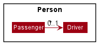
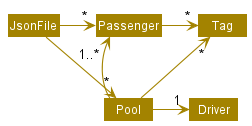

* Table of Contents
{:toc}

--------------------------------------------------------------------------------------------------------------------
## **Setting up, getting started**

Refer to the guide [_Setting up and getting started_](SettingUp.md).

--------------------------------------------------------------------------------------------------------------------

## **Design**

### Architecture

The ***Architecture Diagram*** given above explains the high-level design of the App. Given below is a quick overview of each component.

:bulb: **Tip:** The `.puml` files used to create diagrams in this document can be found in the [diagrams](https://github.com/AY2021S2-CS2103T-W10-1/tp/tree/master/docs/diagrams/) folder. Refer to the [_PlantUML Tutorial_ at se-edu/guides](https://se-education.org/guides/tutorials/plantUml.html) to learn how to create and edit diagrams.

**`Main`** has two classes called [`Main`](https://github.com/AY2021S2-CS2103T-W10-1/tp/tree/master/src/main/java/seedu/address/Main.java) and [`MainApp`](https://github.com/AY2021S2-CS2103T-W10-1/tp/tree/master/src/main/java/seedu/address/MainApp.java). It is responsible for,
* At app launch: Initializes the components in the correct sequence, and connects them up with each other.
* At shut down: Shuts down the components and invokes cleanup methods where necessary.

[**`Commons`**](#common-classes) represents a collection of classes used by multiple other components.

The rest of the App consists of four components.

* [**`UI`**](#ui-component): The UI of the App.
* [**`Logic`**](#logic-component): The command executor.
* [**`Model`**](#model-component): Holds the data of the App in memory.
* [**`Storage`**](#storage-component): Reads data from, and writes data to, the hard disk.

Each of the four components,

* defines its *API* in an `interface` with the same name as the Component.
* exposes its functionality using a concrete `{Component Name}Manager` class (which implements the corresponding API `interface` mentioned in the previous point.

For example, the `Logic` component (see the class diagram given below) defines its API in the `Logic.java` interface and exposes its functionality using the `LogicManager.java` class which implements the `Logic` interface.

**How the architecture components interact with each other**

The *Sequence Diagram* below shows how the components interact with each other for the scenario where the user issues the command `delete 1`.

The sections below give more details of each component.

### UI component

**API** :
[`Ui.java`](https://github.com/AY2021S2-CS2103T-W10-1/tp/tree/master/src/main/java/seedu/address/ui/Ui.java)

The UI consists of a `MainWindow` that is made up of parts e.g.`CommandBox`, `ResultDisplay`, `PassengerListPanel`, `StatusBarFooter` etc. All these, including the `MainWindow`, inherit from the abstract `UiPart` class.

The `UI` component uses JavaFx UI framework. The layout of these UI parts are defined in matching `.fxml` files that are in the `src/main/resources/view` folder. For example, the layout of the [`MainWindow`](https://github.com/AY2021S2-CS2103T-W10-1/tp/tree/master/src/main/java/seedu/address/ui/MainWindow.java) is specified in [`MainWindow.fxml`](https://github.com/AY2021S2-CS2103T-W10-1/tp/tree/master/src/main/resources/view/MainWindow.fxml)

The `UI` component,

* Executes user commands using the `Logic` component.
* Listens for changes to `Model` data so that the UI can be updated with the modified data.

### Logic component

**API** :
[`Logic.java`](https://github.com/AY2021S2-CS2103T-W10-1/tp/tree/master/src/main/java/seedu/address/logic/Logic.java)

1. `Logic` uses the `AddressBookParser` class to parse the user command.
1. This results in a `Command` object which is executed by the `LogicManager`.
1. The command execution can affect the `Model` (e.g. adding a passenger).
1. The result of the command execution is encapsulated as a `CommandResult` object which is passed back to the `Ui`.
1. In addition, the `CommandResult` object can also instruct the `Ui` to perform certain actions, such as displaying help to the user.

Given below is the Sequence Diagram for interactions within the `Logic` component for the `execute("delete 1 2")` API call. This is also explained [below](#deleting-a-passenger).

:information_source: **Note:** The lifeline for `DeleteCommandParser` should end at the destroy marker (X) but due to a limitation of PlantUML, the lifeline reaches the end of diagram.

### Model component

**API** : [`Model.java`](https://github.com/AY2021S2-CS2103T-W10-1/tp/tree/master/src/main/java/seedu/address/model/Model.java)

The `Model`,

* stores a `UserPref` object that represents the user’s preferences.
* stores the GME terminal data.
* exposes an unmodifiable `ObservableList<Passenger>` and `ObservableList<Pool>` that can be 'observed' e.g. the UI can be bound to this list so that the UI automatically updates when the data in the list change.
* does not depend on any of the other three components.

:information_source: **Note:** An alternative (arguably, a more OOP) model is given below. It has a `Tag` list in the `AddressBook`, which `Passenger` references. This allows `AddressBook` to only require one `Tag` object per unique `Tag`, instead of each `Passenger` needing their own `Tag` object. 

### Storage component

**API** : [`Storage.java`](https://github.com/AY2021S2-CS2103T-W10-1/tp/tree/master/src/main/java/seedu/address/storage/Storage.java)

The `Storage` component,
* can save `UserPref` objects in json format and read it back.
* can save the address book data in json format and read it back.

### Common classes

Classes used by multiple components are in the `seedu.addressbook.commons` package.

--------------------------------------------------------------------------------------------------------------------

## **Implementation**
This section describes some noteworthy details on how certain features are implemented.

### Model

The class diagram for the `Model` can be seen [above](#model-component) in the Design section. Such a design was chosen after a few iterations on other designs. One such design is briefly documented as below:

**v1.2**

In v1.2, `Passenger` has-an optional `Driver`, which was initially chosen for its ease of implementation and storage. However, it was spotted that this would lead to issues in future when implementing trips on multiple days, since each `Driver` would have their own times, leading to a lot of duplication of `Drivers`. Further, this was not an easy format to display to the user intuitively, and would require a traverse of the whole `Passenger` list just to group `Passengers` by `Drivers`.

#### Implementation
Therefore, the decision was made to encapsulate the details of each trip (which is a trip by 1 driver with multiple passengers), into a `Pool` class. This `Pool` class would have it's own CRUD, and would contain a `Driver`, `Passengers`, `TripDay` and `TripTime`.

This is done to facilitate `Storage` and `UI`, and also from a Users perspective, to allow for `Pools` with timings that may be slightly different from the `Passengers` preferred time.

A package `Pool` containing class `Pool` and `UniquePoolList` was created. This package performs a function that is similar to the `Passenger` package, exposing CRUD operations through `ModelManager`.

The decision was also made to make `Passenger` and `Driver` extend `Person`, so that for future iterations, we can support a `Driver` who is also a `Passenger` with minimal changes to the code.

### Storage

As above, with regards to [Model](#model-component), the initial implementation of `Storage` was simply to store a `Driver` as a `String` field inside Passenger.

However, this involved extra parsing to ensure that the `Driver` String was still a valid `Driver` on load. Therefore, `Driver` was also made into a Jackson `JsonProperty`.

The class diagram for `Storage` can be found [above](#storage-component).

#### Implementation

As of v1.3, the relation between `Driver` and `Passenger` is encapsulated in a `Pool`. All of `Driver`, `Passenger`, `Pool` and `Tag` are stored as JSON Objects. The choice was also made to store all data in 1 file, for ease of portability, such that the user only needs to manage 1 file.

At a high level, the JSON file is structured as such:

The `Passengers` are duplicated between the `Passenger` list and each of the `Pools` that reference the `Passenger` simply so we can reuse the `JsonSerializablePassenger` structure. This association would be much better represented in a RDBMS, which would be an easy change for a potential future iteration.

`JsonSerializableAddressBook` implements checks to ensure the following from the read JSON file:
* There are no duplicate Passengers
* There are no duplicate Pools
* No more than one Pool can reference a single Passenger
* There are no Pools that reference a Passenger that does not exist

This is to ensure the sanitization of data that is read from JSON, if the user decides to edit the JSON file directly.

### Pool feature
This feature allows users to create and add a pool to the list of pools, through the use of a `pool` command.

Design considerations include the `pool` command being able to be used in conjunction with the `find` command. For instance, the user would
first use `find tag/female` and then followed by `pool n/Alice p/91234567 d/MONDAY t/1930 c/2 c/3`.
The `find tag/female` command first filters the list of displayed passengers, such that only passengers with the `female` tag would be displayed. Calling the `pool` command
would then assign `Alice` with number `91234567` to be the driver of the passengers specified by the indices for the currently displayed list.

The activity diagram below encapsulates the user workflow of adding passengers, finding passengers and then pooling the passengers:

The rationale behind this implementation was because once the GME terminal is populated with a large number of passengers, it would be rather difficult for the user to find a specific passenger.
By allowing the user to first filter the passengers then subsequently pooling from the filtered list would greatly enhance the feature, thereby making the product much more cohesive as features work well together.

Given below is the Sequence Diagram for interactions within the Logic component for the `execute("pool n/Alice p/91234567 d/monday t/1930 c/2 c/3")` command.

:information_source: **Note:**  The `command` argument that is passed into
`execute()`, represents the string `"pool n/Alice p/91234567 d/monday t/1930 c/2 c/3"`, and has been abstracted for readability.
 
The lifeline for `PoolCommandParser` should end at the destroy marker (X) but due to a limitation of PlantUML, the lifeline reaches the end of diagram.

From the diagram illustrated above:
1. `LogicManager` has its `execute()` method called when a user enters the `"pool n/Alice p/91234567 d/monday t/1930 c/2 c/3"` command.
1. `AddressBookParser` class is then accessed, which subsequently instantiates `PoolCommandParser` class to help parse the user's command.
1. `AddressBookParser` would then have its `parse()` method invoked to parse the arguments of `"n/Alice p/91234567 d/monday t/1930 c/2 c/3"` to
   `PoolCommandParser` which creates and returns a `PoolCommand`.
1. `LogicManager` would subsequently invoke the `execute()` method of the `PoolCommand`, which in turn calls its own method of `getPassengersFromIndexes()`
    that gets a list of passengers from `Model` by calling `getFilteredPassengerList()`.
1. A `Pool` object is then instantiated with the list of passengers returned by `getPassengersFromIndexes()`, and then added to the model by the `addPool()` method.
1. The model filtered pool list is then updated with `updateFilteredPoolList()` with a predicate to show all pools in the list `PREDICATE_SHOW_ALL_POOLS`.
1. Finally, a `CommandResult` would be instantiated to indicate the completion status of the command and returned back to `LogicManager`.

It is worth noting that in the case of adding a passenger, a `Passenger` object is created by `AddCommandParser` and used in the constructor of `AddCommand`.
However, in the case of adding a pool, a `PoolCommand` is constructed using the details specified and parsed from `PoolCommandParser`, instead of creating and passing a `Pool` object.
The rationale is due the fact that a list of passengers have to be obtained from the indexes specified, which requires interactions with the model.
The current implementation thus encapsulates all the interactions with model, within the methods of `PoolCommand`.

### ListPool feature
This feature allows users to list all the pools from the pool list without any filter.

Given below is the Sequence Diagram for interactions within the Logic component for the `execute("listPool")`.

From the diagram illustrated above:
1. `LogicManager` has its `execute()` method called when a user enters the `"listPool"` command.
1. `AddressBookParser` class is then accessed, which subsequently instantiates an `ListPoolCommand` object to be returned to `LogicManager`.
1. `LogicManager` would subsequently invoke the `execute()` method of the `ListPoolCommand`.
1. The model filtered pool list is then updated with `updateFilteredPoolList()` with a predicate to show all pools in the list `PREDICATE_SHOW_ALL_POOLS`.
1. Finally, a `CommandResult` would be instantiated to indicate the completion status of the command and returned back to `LogicManager`.

### Unpool feature
This feature allows users to remove a pool from the pool list through the specification of an index.

Design considerations include the `findPool` command being able to be used in conjunction with the `unpool` command. For instance, the user might first use `findPool n/Alice` and then followed by `unpool 1`.
The `findPool n/Alice` command first filters the list of displayed pools, such that only pools in which there is a passenger named Alice will be displayed. Calling the `unpool` command would then remove the pool specified by the provided indices from the currently displayed list, removing it from the system. The `findPool` command works similarly to the `find` command, except that it currently only supports the use of the name prefix: "/n"

The activity diagram below encapsulates the user workflow of adding passengers, finding passengers and then pooling the passengers:

The rationale behind this implementation was because once the GME terminal is populated with a large number of pools, it would be rather difficult for the user to find a specific pool with a specific passenger.
By allowing the user to first filter the pools before subsequently removing the pool from the filtered list, the findPool feature greatly enhances the unpool feature, thereby making the product much more cohesive as features work well together.

Given below is the Sequence Diagram for interactions within the Logic component for the `execute("unpool 1")`.

:information_source: **Note:** The lifeline for `UnpoolCommandParser` should end at the destroy marker (X) but due to a limitation of PlantUML, the lifeline reaches the end of diagram.

From the diagram illustrated above:
1. `LogicManager` has its `execute()` method called when a user enters the `"unpool 1"` command.
1. `AddressBookParser` class is then accessed, which subsequently instantiates `UnpoolCommandParser` class to help parse the user's command.
1. `AddressBookParser` would then have its `parse()` method invoked, passing the argument `"1"` to `UnpoolCommandParser`.
1. Given that the index `"1"` is a valid index, an `UnpoolCommand` object would be instantiated and returned to `LogicManager`.
1. `LogicManager` would subsequently invoke the `execute()` method of the `UnpoolCommand` which in turn invokes `deletePool()` method with an argument of `1`.
1. This would update the model by deleting the specified pool at the first index, then a `CommandResult` would be instantiated to indicate the completion status of the command and returned back to `LogicManager`.

### FindPool feature
This feature allows users to find a pool that contains a passenger with a provided keyword in their name.

Given below is the Sequence Diagram for interactions within the Logic component for the `execute("findPool n/Alice")` command.

:information_source: **Note:**  The `command` argument that is passed into
`execute()`, represents the string `"findPool n/Alice"`, and has been abstracted for readability.
 
The lifeline for `FindPoolCommandParser` should end at the destroy marker (X) but due to a limitation of PlantUML, the lifeline reaches the end of diagram.

From the diagram illustrated above:
1. `LogicManager` has its `execute()` method called when a user enters the `"findPool n/Alice"` command.
1. `AddressBookParser` class is then accessed, which subsequently creates `FindPoolCommandParser` class to help parse the user's command.
1. `AddressBookParser` would then have its `parse()` method invoked to parse the argument `"n/Alice"` and passes it to
   `FindPoolCommandParser`.
1. `FindPoolCommandParser` parses the argument `"n/Alice"` and creates a `PooledPassengerContainsKeywordPredicate` which is returned to the `FindPoolCommandParser`.
1. `FindPoolCommandParser` then creates a `FindPoolCommand`, and provides the newly created `PooledPassengerContainsKeywordPredicate` to it. The `FindPoolCommand` object is then returned to `LogicManager`.
1. `LogicManager` would subsequently invoke the `execute()` method of the `FindPoolCommand`, which in turn calls the `updateFilteredPoolList()` method in `Model`, causing the shown pool list to be updated according to the predicate in the `FindPoolCommand` object.
1. A `Pool` object is then created with the list of passengers returned by `getPassengersFromIndexes()`, and then added to the model by the `addPool()` method.
1. Finally, a `CommandResult` would be returned to `LogicManager` to indicate the completion status of the command.

### Find feature

The rationale behind expanding on the find feature is to allow for the user to find passengers by more attributes to improve usability.
Instead of being restricted to searching for names only, the user can now find other passengers with the same day or of a certain area.
This is vital as it is necessary to improve the usability for the user when attempting to find passengers to carpool with drivers.

:information_source: **Note:**  The `command` argument that is passed into
`execute()`, represents the string `"find n/Lucy n/Adam"`, and has been abstracted for readability.
 
The lifeline for `FindCommandParser` should end at the destroy marker (X) but due to a limitation of PlantUML, the lifeline reaches the end of diagram.

From the diagram illustrated above:
1. `LogicManager` has its `execute()` method called when a user enters the `"find n/Lucy n/Adam"` command.
1. Object of `AddressBookParser` class is then accessed, which then subsequently creates `FindCommandParser` class object to help parse the user's command.
1. `AddressBookParser` would then invoke the `parse()` method of `FindCommandParser`, with parameters `n/Lucy n/Adam`, to parse the arguments `n/Lucy n/Adam`.
1. `FindCommandParser` parses the arguments `n/Lucy n/Adam` and creates a `NameContainsKeywordPredicate` object named `predicate` which is returned to the `FindCommandParser` object.
1. `FindCommandParser` then instantiates a `FindCommand` object with `predicate` as a parameter. The `FindCommand` object is then returned to `LogicManager`.
1. `LogicManager` would subsequently invoke the `execute()` method of `FindCommand`, which in turn calls the `updateFilteredPoolList()` method in `Model`, causing the shown pool list to be updated according to `predicate` in the `FindCommand` object.
1. A `CommandResult` object is then created with a message which includes the number of passengers found on the list updated by `updateFilteredPoolList()`.
1. Finally, the `CommandResult` object is returned to `LogicManager`.

### Delete feature

This feature was adapted from AB-3. It allows users to delete `Passengers`.

Design considerations include being able to delete multiple`Passengers` with one command, and prevent the deletion of any `Passengers` that are currently in a `Pool`. This is done to prevent any accidental deletions of `Passengers` without either party being informed.

Given below is the Sequence Diagram for interactions within the `Logic` component for the `delete 1 2` command

:information_source: **Note:** The lifeline for `DeleteCommandParser` and `DeleteCommand` should end at the destroy marker (X) but due to a limitation of PlantUML, the lifeline reaches the end of diagram.

From the diagram illustrated above:
1. `LogicManager` has its `execute()` method called when a user enters the `"delete 1 2"` command.
1. Object of `AddressBookParser` class is then accessed, which then subsequently creates `DeleteCommandParser` class object to help parse the user's command.
1. `AddressBookParser` would then invoke the `parse()` method of `DeleteCommandParser`, with parameters `1 2`.
1. `DeleteCommandParser` invokes the `parseDeleteIndex()` method of `ParserUtil`, with the arguments `"1 2"`, which splits the arguments into tokens via whitespace.
1. `ParserUtil` self invokes `parseIndex()` on each token, which is used for parsing single indexes, and returns all the `Index` objects created to `DeleteCommandParser` as `indexes`.
1. `DeleteCommandParser` then instantiates a `DeleteCommand` object with `indexes` as a parameter. The `DeleteCommand` object is then returned to `LogicManager`.
1. `LogicManager` would subsequently invoke the `execute()` method of `DeleteCommand`, which in turn calls the `getFilteredPassengerList()` method in `Model`, to get the current passenger list being shown to the user as `lastShownList`.
1. `lastShownList` is then iterated through to and each passenger is passed to `Model` via `hasPoolWithPassenger()`, to check if that passenger is indeed currently being `Pool`ed.
    1. If any `Passenger` is found to be contained in a `Pool`, a new `CommandException` is thrown, informing the user as such.
1. After checking that it is indeed safe to delete all the `Passengers` in `lastShownList`, each `Passenger` is then deleted in `Model` via passing it to the `deletePassenger()` method.
1. A `CommandResult` object is then created with a message which includes the names of the `Passengers` deleted, in `lastShownList`
1. Finally, the `CommandResult` object is returned to `LogicManager`.

--------------------------------------------------------------------------------------------------------------------

## **Documentation, logging, testing, configuration, dev-ops**

* [Documentation guide](Documentation.md)
* [Testing guide](Testing.md)
* [Logging guide](Logging.md)
* [Configuration guide](Configuration.md)
* [DevOps guide](DevOps.md)

--------------------------------------------------------------------------------------------------------------------

## **Appendix: Requirements**

### Product scope

**Target user profile**:

- a HR executive who is required to find and pool passengers with drivers from an already existing database.
- prefer desktop apps over other types
- is able to type fast
- prefers typing to mouse interactions
- is reasonably comfortable using CLI apps

**Value proposition**: Greater ease of use in managing driver and passenger profiles as compared to an Excel sheet.

--------------------------------------------------------------------------------------------------------------------

### User Stories

Priorities: High (must have) - `* * *`, Medium (nice to have) - `* *`, Low (unlikely to have) - `*`

|Priority|As a …​    |I want to …​                                                  |So that                                                                                         |
|--------|--------------|-----------------------------------------------------------------|------------------------------------------------------------------------------------------------|
|* * *   |HR Executive  |allocate drivers to passengers to be picked up                   |I can arrange carpooling trips for my colleagues                                                |
|* * *   |HR Executive  |search for specific type of passengers                            |I can see if any passengers fulfil a criteria and view their carpool details                     |
|* * *   |HR Executive  |list all passengers                                              |I can see all the passengers available                                                          |
|* * *   |HR Executive  |create a profile                                                  |I can easily manage and track drivers and passengers                                            |
|* * *   |HR Executive  |delete employee profile                                           |passenger's data will not be stored when they are no longer looking to carpool                  |
|* *     |HR Executive  |filter passengers' based on their preference for female drivers   |their concerns for their personal safety are taken into account                                 |
|* *     |HR Executive  |filter passengers' destination based on location                  |drivers are not heavily inconvenienced to pick up passengers                                    |
|* *     |HR Executive  |edit drop off location                                           |passengers and drivers who have negotiated a new drop off location can be easily updated        |
|*       |HR Executive  |indicate the price willing to pay                                |drivers are more likely to choose these passengers                                              |

### Use Cases

**System: HR executive's terminal**

**Use case: UC01 - Allocate drivers to passengers to be picked up**

**Actor: User**

**MSS:**
1. User lists out passengers available to be picked up.
2. GME shows a list of passengers.
3. User chooses and view the details of the specific passenger.
4. User allocates drivers to specific passenger to the driver's carpooling group.
   
   Use case ends.

***Extensions***

* 1a. User <ins>searches for a passenger (UC02)</ins>.

  Use case ends.

--------------------------------------------------------------------------------------------------------------------
**System: HR executive's terminal**

**Use case: UC02 - Search for specific type of passengers**

**Actor: User**

**MSS:**
1. HR executive chooses the criteria that the passengers need to fulfil in order to be picked up.
2. HR exective initiates the search.
3. GME shows a list of passengers that fulfils the criteria.

   Use case ends.

***Extensions***

* 3a. No passenger fulfils the criteria.
  * 3a1. GME shows empty list.

  Use case ends.

--------------------------------------------------------------------------------------------------------------------
**System: HR executive's terminal**

**Use case: UC03 - Create a passenger profile**

**Actor: User**

**MSS:**
1. HR exeuctive fills out the passenger's name, contact number and pickup address.
2. GME verifies that all the required fields are not empty.
3. GME adds passenger's details to GME.

   Use case ends.

***Extensions***

* 2a. Any required field is missing.
  * 2a1. GME warns the user to input the data missing.

    Use case ends.
    
--------------------------------------------------------------------------------------------------------------------
**System: HR executive's terminal**

**Use case: UC04 - Delete a passenger profile**

**Actor: User**

**MSS:**
1. HR exeuctive indicates they would like to delete a passenger profile.
2. GME verifies that passenger exists.
3. GME deletes the specific passenger's profile.

   Use case ends.

***Extensions***

* 2a. Index number of passenger does not exist.
    * 2a1. GME warns that no such passenger exists.

      Use case ends.
    
--------------------------------------------------------------------------------------------------------------------

### Non-Functional Requirements

1. **Usability**:
    - GME shall work on any *mainstream OS* as long as it has Java `11` or above installed.
    - GME's interface shall be user-friendly and easy to use by using mouse when not using commands, meaning all buttons and interaction should be self-explanatory and intuitive which can be used by people without training.
    - A user with above average typing speed for regular English text (i.e. not code, not system admin commands) should be able to accomplish most of the tasks faster using commands than using the mouse.
2. **Reliability**:
    - GME shall allow drivers to pick passengers throughout the week ant any time during the day, up to 6 passengers depending on car size.
    - GME Should be able to hold up to 1000 persons (drivers and passengers included) without a noticeable sluggishness in performance for typical usage.
3. **Security:**
    - Only users that creates their own profile can view their private information and change the privacy settings
4. **Integrity**
    - All monetary amounts (including passenger's tips) must be accurate to two decimal places and in SGD.
    - All geolocation coordinates must be accurate to six decimal places.
    - All email and phone numbers provided by users must pass through format check.
    - All time-related data that is presented to user must be accurate to minutes, and use `DD-MM-YYYY` format
    - All timestamps for any events occurred recorded by the GME shall be in UTC (Universal Time Coordinated) when placed into permanent storage.
5. **Flexibility**
    - GME shall be able to process different date formats input by user and converts to `DD-MM-YYYY`

--------------------------------------------------------------------------------------------------------------------

### Glossary

Term used | Meaning
--------|------------------
Pool | A group of employees carpooling together. Consists of one driver and at least one passenger. The pools generated for a specifc day and time are the same every week unless reorganised by the user. Passenger | An employee carpooling with at least one driver.
TripDay | Day of the intended carpooling trip.
TripTime | Time of the intended carpooling trip.
Tag | A miscellaneous piece of information about the pool, passenger, or driver that isn't captured by the other fields but is good to have.
Price | The amount of money a passenger is willing to pay for the carpooling trip.
Alphanumeric | A combination of letters and numbers only.
Home Folder | The folder where the app's data will be stored
GME | GreenMileageEfforts, this software that is used to arrange carpooling.
Passenger | An employee carpooling with at least one driver.
Driver | An employee that is in-charge of driving passengers within the pool to their location.
Mainstream OS | Windows, Linux, Unix, MacOS.
Command Line Interface (CLI) | An interface that relies primarily on text input and little to no point and click UI elements exist.

--------------------------------------------------------------------------------------------------------------------

## **Appendix: Instructions for manual testing**

Given below are instructions to test the app manually.

:information_source: **Note:** These instructions only provide a starting point for testers to work on;
testers are expected to do more *exploratory* testing.

### Launch and shutdown

1. Initial launch.

    1. Download the jar file and copy into an empty folder.

    1. Double-click the jar file Expected: Shows the GUI with a set of sample contacts. The window size may not be optimum.

1. Saving window preferences.

    1. Resize the window to an optimum size. Move the window to a different location. Close the window.

    1. Re-launch the app by double-clicking the jar file. 
       Expected: The most recent window size and location is retained.

### Creating a pool

1. Creating a pool from using the list of all passengers being shown.

    1. Prerequisites: List all passengers using the `list` command.
       Multiple passengers in the list, with the first four passengers having the same the trip day of `MONDAY` and trip time of `1930`.
       This can be achieved through the editing the details of the passengers with the `edit` command and the `d/` and `t/` prefixes.
       The remaining passengers must have a different trip day and trip time from `MONDAY` and `1930` respectively.

    1. Test case: `pool n/Paul p/90101231 d/MONDAY t/1930 c/1 c/2` 
       
       Expected: A pool is created and added to the pool list, with a trip by the driver named `Paul`, phone number `90101231`, at `MONDAY 1930`.
       Names of the passengers from the passenger list at index 1 and 2 are also displayed in the pool.
       Status message shows the details of the pool created.

   1. Test case: `pool n/Sarah p/96663777 d/MONDAY t/1400 c/3 c/4` 
      
      Expected: A pool is created and added to the pool list, with a trip by the driver named `Sarah`, phone number `96663777`, at `MONDAY 1400`.
      Names of the passengers from the passenger list at index 3 and 4 are also displayed in the pool.
      Status message shows a message to warn the user that there are passengers with a time difference of more than 15 minutes of the pool time.

   1. Test case: `pool n/Patricia p/90102020 d/WEDNESDAY t/1930 c/1 c/5` 
      
      Expected: No pool is added. Error details shown in the status message, prompting user to check for a trip day mismatch. Text in command bar turns red.

   1. Test case: `pool n/Jose p/85553777 d/MONDAY t/1930 c/0` 
      
      Expected: No pool is added. Error details shown in the status message. Text in command bar turns red.

### Deleting a pool

1. Deleting a pool while all pools are being shown.

    1. Prerequisites: List all pools using the `listPool` command. Multiple pools in the list.

    1. Test case: `unpool 1` 

       Expected: First pool is deleted from the list. Details of the deleted pool shown in the status message.

    1. Test case: `unpool 0` 

       Expected: No pool is deleted. Error details shown in the status message. Status bar remains the same.

    1. Other incorrect delete commands to try: `unpool`, `unpool x`, `...` (where x is larger than the list size) 

       Expected: Similar to previous.

### Deleting a passenger

1. Deleting a passenger while all passengers are being shown.

    1. Prerequisites: List all passengers using the `list` command. Multiple passengers in the list. Passengers to be deleted are not in a pool.

    1. Test case: `delete 1`. 
       Expected: First contact is deleted from the list. Name of the deleted contact shown in the status message.

    1. Test case: `delete 0`. 
       Expected: No passenger is deleted. Error details shown in the status message. Text in command bar turns red.

    1. Other incorrect delete commands to try: `delete`, `delete x`, `...` (where x is larger than the list size). 
       Expected: Similar to previous.

1. Deleting multiple passengers while all passengers are being shown.

    1. Prerequisites: List all passengers using the `list` command. Multiple passengers in the list. Passengers to be deleted are not in a pool.

    1. Test case: `delete 1 2`. 
       Expected: First and second contact is deleted from the list. Names of deleted contacts are shown in the status message.

### Finding a passenger

1. Finding passengers by name while all passengers shown.

    1. Prerequisites: Newly generated sample data is used. This can be done by deleting `data/GMEdata.json`. 
       All passengers listed using `list`.

    1. Test case: `find n/bernice`. 
       Expected: Details of passenger named `Bernice Yu` is shown. Status message shows 1 passenger listed.

    1. Test case: `find n/bob`. 
       Expected: No passengers are shown. Status message shows 0 passenger listed.

    1. Test case: `find n/ROY n/lEnny`. 
       Expected: Details of passengers named `Roy Balakrishnan` and `Lenny Hoon` shown. Status message shows 2 passengers listed.

    1. Test case: `find n/   David lI`. 
       Expected: Details of passenger named `David Li` is shown. Status message shows 1 passenger listed.

1. Finding passengers by tag while all passengers are shown.

    1. Prerequisites: Newly generated sample data is used. This can be done by deleting `data/GMEdata.json`.
       All passengers listed using `list`.

    1. Test case: `find tag/finance`. 
       Expected: Details of `Bernice Yu` and `Roy Balakrishnan` are shown. Status message shows 2 passengers listed.

    1. Test case: `find tag/marketing tag/sales`. 
       Expected: Details of `Alex Yeoh`, `Bernice Yu`, `Irfan Ibrahim` and `Turner Peck` are shown. Status message shows 4 passengers listed.

    1. Test case: `find tag/marketing sales`. 
       Expected: Passengers are shown are same as previous. Status message shows tag provided is invalid.

### Finding a pool

1. Finding a pool while all pools are being shown.

    1. Prerequisites: Newly generated sample data is used. This can be done by deleting `data/GMEdata.json`.
       All pools listed using `listPool`.

    1. Test case: `findPool n/lenny`. 
       Expected: Details of only the pool with `Alan Poh`, `Lenny Hoon`, and `Turner Peck` is shown. Status message shows 1 pool listed.

    1. Test case: `findPool n/michael`. 
       Expected: No pools are listed. Status message shows 0 pool listed.

    1. Test case: `findPool n/...`. 
       Expected: Pool list on right pane shows no change. Error details shown in the status message.
       
    1. Other variations to use after the prefix n/: `///`, `?#$%`, `...`, any other non alphanumeric characters. 
       Expected: Similar to previous.

### Editing a passenger

1. Editing passengers with 1 parameter while all passengers shown.

    1. Prerequisites: Newly generated sample data is used. This can be done by deleting `data/GMEdata.json`. All passengers listed using `list`.

    1. Test case: `edit 1 n/Alice`. 
       Expected: Name of passenger previously named `Alex Yeoh` is changed to `Alice`. Status message shows all the details of `Alice`.
       
    1. Test Case: `edit 0 n/Alice`.  
       Expected: No passenger is edited. Result box shows error: `One of the passenger indexes provided is invalid`. Command box text turns red.
       
    1. Other incorrect edit commands to try: `edit n/Alice`, `edit x n/Alice`, ... (where x is larger than the list size).
       Expected: Similar to previous.

1. Editing passengers with multiple parameters while all passengers shown.
    1. Prerequisites: Newly generated sample data is used. This can be done by deleting `data/GMEdata.json`. All passengers listed using `list`.
       
    1. Test case: `edit 1 p/12345678 a/Floor Street tag/abcd`. 
       Expected: Phone number, address, and tag of passenger named `Alice` is changed to `12345678`, `Floor Street`, and `abcd` respectively. Status message shows all the new details of `Alice`

1. Editing passenger to match an existing passenger's identity.
    1. Prerequisites: Using sample passengers, list all passengers using the `list` command. Multiple passengers in the list.

    1. Test case: `edit 1 n/Bernice Yu p/99272758`. 
       Expected: No passenger is edited. Result box shows error: `This passenger already exists in the GME Terminal.`. Command box text turns red.

1. Editing passenger that is in a Pool.
    1. Prerequisites: Newly generated sample data is used. This can be done by deleting `data/GMEdata.json`. All passengers listed using `list`. All pools listed using `listPool`.

    1. Test case: `edit 7 n/Kelly`. 
       Expected: Name of passenger previously named `Kristen Woo` is changed to `Kelly`. Status message shows all the details of `Kelly`. `Trip by Irfan Ibrahim` in Pool list updates to `Roy Balakrishnan, Kelly`.

    1. Test case: `edit 7 d/TUESDAY`. 
       Expected: No passenger is edited. Result box shows error: `TThe Passenger to be edited exists in a pool. Day cannot be edited.`. Command box text turns red.

    1. Test case: `edit 7 t/1400`. 
       Expected: Time of passenger named `Kelly` is changed to `1400`. Status message shows all the details of `Kelly`, and `NOTE: The passenger edited exists in a pool and has had their preferred trip time edited. This might result in a time difference of more than 15 minutes with the pool time.`
 
--------------------------------------------------------------------------------------------------------------------

## **Appendix: Effort**

The creation of GreenMileageEfforts came with a great deal of effort from each of the team members. Since the start of the project we have
made the effort to consistently conduct team meetings every week, most of these meetings were held in physical settings such that we could communicate our ideas effectively.
Upon completion of the project, we have achieved a product that is a direct reflection of our hard work and determination.
GreenMileageEfforts is a product that has been adapted and morphed from AB3, where there have been significant enhancements made since AB3.

### Challenges faced, Effort and Achievement

The following section describes the challenges our team faced in this project, the efforts we took to overcome it, as well as what we have achieved as a result of the efforts we have taken.

#### Extension of Model

As our group had initially decided on morphing the existing AB3, changes to the model consisted mainly of refactoring existing classes. Although a rather trivial task, this process was rather time-consuming and tedious. Due to the scale of the existing AB3 code, some difficulty was encountered during this refactoring stage as some making seemingly minute changes in method signatures or names would result in a need to edit other segments of affected code. Although the use of IntelliJ’s toolbox greatly sped up the process, the nature of some of the refactoring changes we intended to make meant that some of said changes were not as easily detected by IntelliJ, resulting in some uncaught bugs following our refactoring stage. The brownfield nature of the project also led to some difficulty in understanding the model and how the different modules interact with each other.

Towards the end of the first milestone, every team member had a better understanding of the existing code allowing for a better segmentation of work. As this was also the period where new additions were made to the existing AB3 model instead of simple refactoring, there was also less confusion surrounding what components of the model needed to be modified. This was also helped by the fact that in the case of adding features, we had a clearer idea of what needed to be done for the new feature instead of following the trails of an existing one. However, some difficulty was still present as the original AB3 dealt only with a list of one entity(person) while our intended final product would have to handle a list of two entities that interact with each other (Passenger and Pool). These interactions between the two entities led to some difficulty in the implementation of CRUD commands and in coding to avoid too much cyclic dependency.

However, by the end of the second milestone, many of us have a firm grasp of the model and its components. This allowed us to make improvements to not just to the code of the features we had added, but also to the code that was existed in the original AB3.

#### Reworking of `drive` command to `pool` command

The initial concept for this product included two commands `drive` and `undrive` which was later reworked to `pool` and `unpool` after much discussion with the team to better suit the needs of our users.
These changes were made after the addition of a pool list to the model. Prior to the change, the passengers in the model consisted of a driver with a phone number attached to it,
where `drive` was intended to be implemented in a way which merely edits the driver field in each passenger. Likewise, `undrive` was intended to be implemented to edit the driver field within the
specified passengers to be empty. Upon extension of the model to include a list of pools, `pool` was implemented to add a pool to the list, while `unpool` was implemented to delete a pool from the list.
This change involved a significant amount of effort from all of our team members, as the change involved almost all components of the project.
Each team member tested their own component as extensively as possible before integration of the parts together, eventually coming together to fix the bugs that came from integration.
As a result, we have achieved a product that is relatively bug-free and extensible as each component has already be properly tested.

#### Extension and rework of UI

While the user interface of AB3 consists of one panel to illustrate a list of persons, GreenMileageEfforts was required to illustrate a list of passengers as well as a list of pools. This
was not a trivial task, as each of the panels had their own set of commands such as adding, deleting and filtering. On top of that, enhancements were made to ensure a cleaner looking user interface
that is the current GreenMileageEfforts product today.

#### Extension of `find` command

The initial implementation of `find` inherited from AB3 only allowed users to search by names. 
To improve usability for users, we introduced searching of other fields of a passenger. 
While implementing the first iteration in v1.2, it took some additional time as it took some time to understand which classes interacted with each other when `find` was executed.
This was harder to understand as there was no sequence diagram included for the `find` command as well.
To implement the command, a predicate was needed for each of the attributes as well as the parsing of the arguments in `FindCommandParser` to allow for different type of searches to be possible.

#### Extension of `delete` command
The initial implementation of `delete` inherited from AB3 only allowed users to delete 1 passenger at a time. 
To improve usability for users, we introduced multi-passenger deletion using indexes.
The first iteration of this allowed for passengers to be deleted despite some other passengers being already in a pool.
This was later revised to prevent users from executing `delete` all together when there are passengers still in a pool.
This was chosen as better code quality could be achieved through such a decision.

#### Workflow

At the start of the project, work delegation and flow was not ideal, where one team member had to wait for the changes that another had to make.
For instance, while one team member added new fields such as (TripTime and TripDay), another team member was tasked to update the logic of `Add` and `Edit` command for the new fields.
Upon a post-mortem to reflect and evaluate our workflow, we managed to refine our workflow to make it much more efficient by the second milestone, this included the proper
segmentation and delegation of work into its features. Finally, by doing so we have achieved a far better workflow by the end of the project that enabled us to create the GreenMileageEfforts product as it is today.
