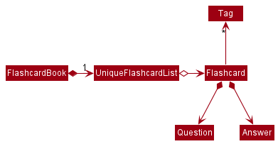
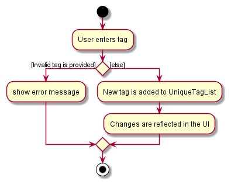

* Table of Contents
{:toc}

--------------------------------------------------------------------------------------------------------------------

## **Setting up, getting started**

Refer to the guide [_Setting up and getting started_](SettingUp.md).

--------------------------------------------------------------------------------------------------------------------

## **Design**

### Architecture

The ***Architecture Diagram*** given above explains the high-level design of the App. Given below is a quick overview of each component.

:bulb: **Tip:** The `.puml` files used to create diagrams in this document can be found in the [diagrams](https://github.com/se-edu/addressbook-level3/tree/master/docs/diagrams/) folder. Refer to the [_PlantUML Tutorial_ at se-edu/guides](https://se-education.org/guides/tutorials/plantUml.html) to learn how to create and edit diagrams.

**`Main`** has two classes called [`Main`](https://github.com/se-edu/addressbook-level3/tree/master/src/main/java/seedu/address/Main.java) and [`MainApp`](https://github.com/se-edu/addressbook-level3/tree/master/src/main/java/seedu/address/MainApp.java). It is responsible for,
* At app launch: Initializes the components in the correct sequence, and connects them up with each other.
* At shut down: Shuts down the components and invokes cleanup methods where necessary.

[**`Commons`**](#common-classes) represents a collection of classes used by multiple other components.

The rest of the App consists of four components.

* [**`UI`**](#ui-component): The UI of the App.
* [**`Logic`**](#logic-component): The command executor.
* [**`Model`**](#model-component): Holds the data of the App in memory.
* [**`Storage`**](#storage-component): Reads data from, and writes data to, the hard disk.

Each of the four components,

* defines its *API* in an `interface` with the same name as the Component.
* exposes its functionality using a concrete `{Component Name}Manager` class (which implements the corresponding API `interface` mentioned in the previous point).

For example, the `Logic` component (see the class diagram given below) defines its API in the `Logic.java` interface and exposes its functionality using the `LogicManager.java` class which implements the `Logic` interface.

**How the architecture components interact with each other**

The *Sequence Diagram* below shows how the components interact with each other for the scenario where the user issues the command `delete 1`.

The sections below give more details of each component.

### UI component

**API** :
[`Ui.java`](https://github.com/se-edu/addressbook-level3/tree/master/src/main/java/seedu/address/ui/Ui.java)

The UI consists of a `MainWindow` that is made up of parts e.g.`CommandBox`, `ResultDisplay`, `FlashcardListPanel`, `StatusBarFooter` etc. All these, including the `MainWindow`, inherit from the abstract `UiPart` class.

The `UI` component uses JavaFx UI framework. The layout of these UI parts are defined in matching `.fxml` files that are in the `src/main/resources/view` folder. For example, the layout of the [`MainWindow`](https://github.com/se-edu/addressbook-level3/tree/master/src/main/java/seedu/address/ui/MainWindow.java) is specified in [`MainWindow.fxml`](https://github.com/se-edu/addressbook-level3/tree/master/src/main/resources/view/MainWindow.fxml)

The `UI` component,

* Executes user commands using the `Logic` component.
* Listens for changes to `Model` data so that the UI can be updated with the modified data.

### Logic component

**API** :
[`Logic.java`](https://github.com/se-edu/addressbook-level3/tree/master/src/main/java/seedu/address/logic/Logic.java)

1. `Logic` uses the `WeeblingoParser` class to parse the user command.
1. This results in a `Command` object which is executed by the `LogicManager`.
1. The command execution can affect the `Model` (e.g. adding a flashcard).
1. The result of the command execution is encapsulated as a `CommandResult` object which is passed back to the `Ui`.
1. In addition, the `CommandResult` object can also instruct the `Ui` to perform certain actions, such as displaying help to the user.

Given below is the Sequence Diagram for interactions within the `Logic` component for the `execute("start 3")` API call.

### Model component

**API** : [`Model.java`](https://github.com/se-edu/addressbook-level3/tree/master/src/main/java/seedu/address/model/Model.java)

The `Model`,

* stores a `UserPref` object that represents the user’s preferences.
* stores the Weeblingo data.
* exposes an unmodifiable `ObservableList<Flashcard>` that can be 'observed' e.g. the UI can be bound to this list so that the UI automatically updates when the data in the list change.
* does not depend on any of the other three components.

:information_source: **Note:** An alternative (arguably, a more OOP) model is given below. It has a `Tag` list in the `FlashcardBook`, which `Flashcard` references. This allows `FlashcardBook` to only require one `Tag` object per unique `Tag`, instead of each `Flashcard` needing their own `Tag` object. 

### Storage component

**API** : [`Storage.java`](https://github.com/se-edu/addressbook-level3/tree/master/src/main/java/seedu/address/storage/Storage.java)

The `Storage` component,
* can save `UserPref` objects in json format and read it back.
* can save the address book data in json format and read it back.

### Common classes

Classes used by multiple components are in the `seedu.weeblingo.commons` package.

--------------------------------------------------------------------------------------------------------------------

## **Implementation**

This section describes some noteworthy details on how certain features are implemented.

The following activity diagram summarizes what happens when a user executes a new command:

### Tagging Flashcards

The tagging mechanism allows users to add tags to flashcards of their choice while in the _Learn Mode_
of the WeebLingo application. Each flashcard has a set of default tags which cannot be edited, followed by
any unique user added tags. 

The following activity diagram summarizes what happens when a user adds a new command:

The tags function ties together with the Start function of the application, as users can choose to start a quiz
containing flashcards that have the same tag only (to be implemented...)

--------------------------------------------------------------------------------------------------------------------

## **Documentation, logging, testing, configuration, dev-ops**

* [Documentation guide](Documentation.md)
* [Testing guide](Testing.md)
* [Logging guide](Logging.md)
* [Configuration guide](Configuration.md)
* [DevOps guide](DevOps.md)

--------------------------------------------------------------------------------------------------------------------

## **Appendix: Requirements**

### Product scope

**Target user profile**:

* Young aspiring J-Culture enthusiast who wants to learn basic Japanese
* goes to a Japanese Culture Club so is low on time after school
* interested in learning the Japanese language
* prefers using flashcards to learn
* prefers desktop apps over other types
* prefers typing to mouse interactions
* is reasonably comfortable using CLI apps

**Value proposition**: Ability to learn the Japanese language through flashcards in a fun and interactive manner

### User stories

Priorities: High (must have) - `* * *`, Medium (nice to have) - `* *`, Low (unlikely to have) - `*`

| Priority | As a …​                                 | I want to …​                        | So that I can…​                              |
| -------- | ------------------------------------------ | -------------------------------------- | ----------------------------------------------- |
| `* * *`  | new user                                   | view valid commands                    | remember how to use the App                     |
| `* * *`  | user                                       | view a flashcard                       |                                                 |
| `* * *`  | user                                       | see the answer to a flashcard          | check if I answered correctly                   |
| `* * *`  | user                                       | start a practice run of all flashcards | practice all flashcards in a single session     |
| `* *`    | user                                       | view all flashcards                    | study the flashcards before a session           |

*{More to be added}*

### Use cases

(For all use cases below, the **System** is the `Weeblingo` and the **Actor** is the `user`, unless specified otherwise)

**Use case: See flashcards one by one**

**MSS**

1.  User requests to view flashcards
2.  WeebLingo shows a new flashcard on the screen
3.  User clicks next
4.  Go to step 2 again

**Extensions**

* 2a. All flashcards have been shown.

  Use case ends.

**Use case: Take a quiz**

**MSS**

1.  User clicks quiz
2.  WeebLingo shows a new question on the screen
3.  User enters his answer
4.  WeebLingo shows whether user's answer is correct/wrong
5.  WeebLingo displays correct answer if user's answer is wrong
6.  WeebLingo removes this question from the list of questions for this session
7.  Go to step 2 again

**Extensions**

* 2a. All questions have been shown.

  Use case ends.

**Use case: Save and see all my study data**

**MSS**

1.  User looks at a flashcard
2.  User can save a flashcard if he is confident he has learnt the japanese word
3.  WeebLingo saves the learnt flashcard to a storage file
4.  User can request to see all learnt flashcards

    Use case ends.

**Use case: Delete a flashcard**

**MSS**

1.  User requests to list flashcards
2.  AddressBook shows a list of flashcards
3.  User requests to delete a specific flashcard in the list
4.  AddressBook deletes the flashcard

    Use case ends.

**Extensions**

* 2a. The list is empty.

  Use case ends.

* 3a. The given index is invalid.

    * 3a1. AddressBook shows an error message.

      Use case resumes at step 2.

*{More to be added}*

### Non-Functional Requirements
<!-- Updated and maintained by [Yucheng](https://github.com/cheng20010201) -->
1.  The product should work on any _mainstream OS_ as long as it has Java `11` or above installed.
2.  The product should be available for download and usage after each release.
3.  The product's size of the final Jar released should not exceed 100MB.
4.  The product should be an offline application, which should work either with or without presence of internet
    connection.
5.  The product should allow one user to have different instances of the application running at the same time.
6.  The product should be able to hold up to 2000 Japanese words without causing a delay in commands longer than 0.5 seconds.
7.  The project should be open-sourced.
8.  A user with above average typing speed for regular English text (i.e. not code, not system admin commands) and
    beginner typing speed for simple Japanese text (i.e. simple words and sentences) should be able to accomplish most
    of the learning faster using commands than using the mouse.
9. A user should find interacting with the user interface easy, even if he/she is relatively new to the application.
10. More to be added.

### Glossary

* **Mainstream OS**: Windows, Linux, Unix, OS-X
* **Question**: A Japanese character/word
* **Answer**: The reading/definition of the Japanese given in the corresponding question
* **Flashcard**: An object that can display a question and its answer
--------------------------------------------------------------------------------------------------------------------

## **Appendix: Instructions for manual testing**

Given below are instructions to test the app manually.

:information_source: **Note:** These instructions only provide a starting point for testers to work on;
testers are expected to do more *exploratory* testing.

### Launch and shutdown

1. Initial launch

   1. Download the jar file and copy into an empty folder

   1. Double-click the jar file Expected: Shows the GUI with a set of sample contacts. The window size may not be optimum.

1. Saving window preferences

   1. Resize the window to an optimum size. Move the window to a different location. Close the window.

   1. Re-launch the app by double-clicking the jar file. 
       Expected: The most recent window size and location is retained.

1. _{ more test cases …​ }_

### Using the  `end` command

1. Ending a quiz before it is started

   1. Prerequisites: No quiz has been started

   1. Test case: `end` _while in the quiz_  
      Expected: The current quiz is ended and displayed flashcard disappears. 

   1. Test case: `end` _while in the start menu_ 
      Expected: Nothing happens. An error message is displayed to the user telling them that no Quiz has started yet.

   1. Other incorrect end commands locations to try: _while in learn mode_, _right after ending a Quiz, …​  
      Expected: Similar to previous.

1. _{ more test cases …​ }_

### Saving data

1. Dealing with missing/corrupted data files

   1. _{explain how to simulate a missing/corrupted file, and the expected behavior}_

1. _{ more test cases …​ }_

