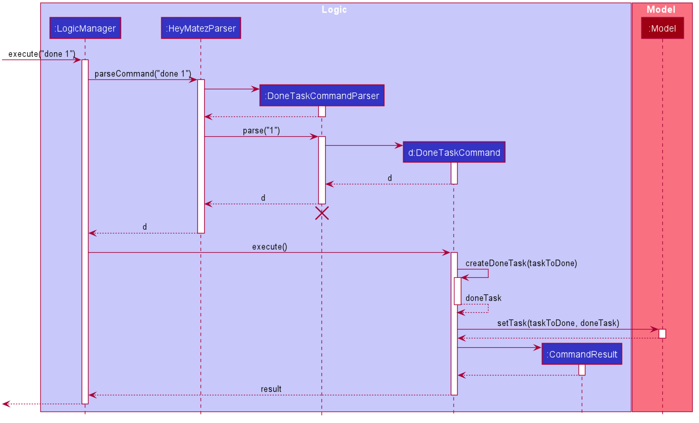

* Table of Contents
{:toc}

--------------------------------------------------------------------------------------------------------------------

## **Setting up, getting started**

Refer to the guide [_Setting up and getting started_](SettingUp.md).

--------------------------------------------------------------------------------------------------------------------

## **Design**

### Architecture

The ***Architecture Diagram*** given above explains the high-level design of the App. Given below is a quick overview of each component.

:bulb: **Tip:** The `.puml` files used to create diagrams in this document can be found in the [diagrams](https://github.com/se-edu/addressbook-level3/tree/master/docs/diagrams/) folder. Refer to the [_PlantUML Tutorial_ at se-edu/guides](https://se-education.org/guides/tutorials/plantUml.html) to learn how to create and edit diagrams.

**`Main`** has two classes called [`Main`](https://github.com/se-edu/addressbook-level3/tree/master/src/main/java/seedu/address/Main.java) and [`MainApp`](https://github.com/se-edu/addressbook-level3/tree/master/src/main/java/seedu/address/MainApp.java). It is responsible for,
* At app launch: Initializes the components in the correct sequence, and connects them up with each other.
* At shut down: Shuts down the components and invokes cleanup methods where necessary.

[**`Commons`**](#common-classes) represents a collection of classes used by multiple other components.

The rest of the App consists of four components.

* [**`UI`**](#ui-component): The UI of the App.
* [**`Logic`**](#logic-component): The command executor.
* [**`Model`**](#model-component): Holds the data of the App in memory.
* [**`Storage`**](#storage-component): Reads data from, and writes data to, the hard disk.

Each of the four components,

* defines its *API* in an `interface` with the same name as the Component.
* exposes its functionality using a concrete `{Component Name}Manager` class (which implements the corresponding API `interface` mentioned in the previous point.

For example, the `Logic` component (see the class diagram given below) defines its API in the `Logic.java` interface and exposes its functionality using the `LogicManager.java` class which implements the `Logic` interface.

**How the architecture components interact with each other**

The *Sequence Diagram* below shows how the components interact with each other for the scenario where the user issues the command `delete 1`.

The sections below give more details of each component.

### UI component

**API** :
[`Ui.java`](https://github.com/se-edu/addressbook-level3/tree/master/src/main/java/seedu/address/ui/Ui.java)

The UI consists of a `MainWindow` that is made up of parts e.g.`CommandBox`, `ResultDisplay`, `PersonListPanel`, `StatusBarFooter` etc. All these, including the `MainWindow`, inherit from the abstract `UiPart` class.

The `UI` component uses JavaFx UI framework. The layout of these UI parts are defined in matching `.fxml` files that are in the `src/main/resources/view` folder. For example, the layout of the [`MainWindow`](https://github.com/se-edu/addressbook-level3/tree/master/src/main/java/seedu/address/ui/MainWindow.java) is specified in [`MainWindow.fxml`](https://github.com/se-edu/addressbook-level3/tree/master/src/main/resources/view/MainWindow.fxml)

The `UI` component,

* Executes user commands using the `Logic` component.
* Listens for changes to `Model` data so that the UI can be updated with the modified data.

### Logic component

**API** :
[`Logic.java`](https://github.com/se-edu/addressbook-level3/tree/master/src/main/java/seedu/address/logic/Logic.java)

1. `Logic` uses the `AddressBookParser` class to parse the user command.
1. This results in a `Command` object which is executed by the `LogicManager`.
1. The command execution can affect the `Model` (e.g. adding a person).
1. The result of the command execution is encapsulated as a `CommandResult` object which is passed back to the `Ui`.
1. In addition, the `CommandResult` object can also instruct the `Ui` to perform certain actions, such as displaying help to the user.

Given below is the Sequence Diagram for interactions within the `Logic` component for the `execute("delete 1")` API call.

:information_source: **Note:** The lifeline for `DeleteCommandParser` should end at the destroy marker (X) but due to a limitation of PlantUML, the lifeline reaches the end of diagram.

### Model component

**API** : [`Model.java`](https://github.com/se-edu/addressbook-level3/tree/master/src/main/java/seedu/address/model/Model.java)

The `Model`,

* stores a `UserPref` object that represents the user’s preferences.
* stores the address book data.
* exposes an unmodifiable `ObservableList<Person>` that can be 'observed' e.g. the UI can be bound to this list so that the UI automatically updates when the data in the list change.
* does not depend on any of the other three components.

:information_source: **Note:** An alternative (arguably, a more OOP) model is given below. It has a `Tag` list in the `AddressBook`, which `Person` references. This allows `AddressBook` to only require one `Tag` object per unique `Tag`, instead of each `Person` needing their own `Tag` object. 

### Storage component

**API** : [`Storage.java`](https://github.com/se-edu/addressbook-level3/tree/master/src/main/java/seedu/address/storage/Storage.java)

The `Storage` component,
* can save `UserPref` objects in json format and read it back.
* can save the address book data in json format and read it back.

### Common classes

Classes used by multiple components are in the `seedu.addressbook.commons` package.

--------------------------------------------------------------------------------------------------------------------

## **Implementation**

This section describes some noteworthy details on how certain features are implemented.

### \[Proposed\] Undo/redo feature

#### Proposed Implementation

The proposed undo/redo mechanism is facilitated by `VersionedAddressBook`. It extends `AddressBook` with an undo/redo history, stored internally as an `addressBookStateList` and `currentStatePointer`. Additionally, it implements the following operations:

* `VersionedAddressBook#commit()` — Saves the current address book state in its history.
* `VersionedAddressBook#undo()` — Restores the previous address book state from its history.
* `VersionedAddressBook#redo()` — Restores a previously undone address book state from its history.

These operations are exposed in the `Model` interface as `Model#commitAddressBook()`, `Model#undoAddressBook()` and `Model#redoAddressBook()` respectively.

Given below is an example usage scenario and how the undo/redo mechanism behaves at each step.

Step 1. The user launches the application for the first time. The `VersionedAddressBook` will be initialized with the initial address book state, and the `currentStatePointer` pointing to that single address book state.

Step 2. The user executes `delete 5` command to delete the 5th person in the address book. The `delete` command calls `Model#commitAddressBook()`, causing the modified state of the address book after the `delete 5` command executes to be saved in the `addressBookStateList`, and the `currentStatePointer` is shifted to the newly inserted address book state.

Step 3. The user executes `add n/David …​` to add a new person. The `add` command also calls `Model#commitAddressBook()`, causing another modified address book state to be saved into the `addressBookStateList`.

:information_source: **Note:** If a command fails its execution, it will not call `Model#commitAddressBook()`, so the address book state will not be saved into the `addressBookStateList`.

Step 4. The user now decides that adding the person was a mistake, and decides to undo that action by executing the `undo` command. The `undo` command will call `Model#undoAddressBook()`, which will shift the `currentStatePointer` once to the left, pointing it to the previous address book state, and restores the address book to that state.

:information_source: **Note:** If the `currentStatePointer` is at index 0, pointing to the initial AddressBook state, then there are no previous AddressBook states to restore. The `undo` command uses `Model#canUndoAddressBook()` to check if this is the case. If so, it will return an error to the user rather
than attempting to perform the undo.

The following sequence diagram shows how the undo operation works:

:information_source: **Note:** The lifeline for `UndoCommand` should end at the destroy marker (X) but due to a limitation of PlantUML, the lifeline reaches the end of diagram.

The `redo` command does the opposite — it calls `Model#redoAddressBook()`, which shifts the `currentStatePointer` once to the right, pointing to the previously undone state, and restores the address book to that state.

:information_source: **Note:** If the `currentStatePointer` is at index `addressBookStateList.size() - 1`, pointing to the latest address book state, then there are no undone AddressBook states to restore. The `redo` command uses `Model#canRedoAddressBook()` to check if this is the case. If so, it will return an error to the user rather than attempting to perform the redo.

Step 5. The user then decides to execute the command `list`. Commands that do not modify the address book, such as `list`, will usually not call `Model#commitAddressBook()`, `Model#undoAddressBook()` or `Model#redoAddressBook()`. Thus, the `addressBookStateList` remains unchanged.

Step 6. The user executes `clear`, which calls `Model#commitAddressBook()`. Since the `currentStatePointer` is not pointing at the end of the `addressBookStateList`, all address book states after the `currentStatePointer` will be purged. Reason: It no longer makes sense to redo the `add n/David …​` command. This is the behavior that most modern desktop applications follow.

The following activity diagram summarizes what happens when a user executes a new command:

#### Design consideration:

##### Aspect: How undo & redo executes

* **Alternative 1 (current choice):** Saves the entire address book.
  * Pros: Easy to implement.
  * Cons: May have performance issues in terms of memory usage.

* **Alternative 2:** Individual command knows how to undo/redo by
  itself.
  * Pros: Will use less memory (e.g. for `delete`, just save the person being deleted).
  * Cons: We must ensure that the implementation of each individual command are correct.

_{more aspects and alternatives to be added}_

### \[Proposed\] Data archiving

_{Explain here how the data archiving feature will be implemented}_

--------------------------------------------------------------------------------------------------------------------

## **Documentation, logging, testing, configuration, dev-ops**

* [Documentation guide](Documentation.md)
* [Testing guide](Testing.md)
* [Logging guide](Logging.md)
* [Configuration guide](Configuration.md)
* [DevOps guide](DevOps.md)

--------------------------------------------------------------------------------------------------------------------
## **Implementation details**
This section documents some of the noteworthy details on how certain features are implemented

### Mark as completed / uncompleted features

The implementation of the mark as completed features are facilitated by the `DoneTaskCommand` and `UndoTaskCommand` classes
respectively, both of which extends from the Command abstract class.

It is also facilitated by the following Parser Classes:
* `DoneTaskCommandParser`
* `UndoTaskCommandParser`

The above mentioned Parser classes all inherit the `#parse` method from the Parser interface.

* `DoneTaskCommandParser#parse` - checks if the arguments passed to the current DoneCommand is valid and creates an DoneTaskCommand instance if it is.

* `UndoTaskCommandParser#parse` - checks if the arguments passed to the current Undo Command is valid and creates an UndoTaskCommand instance if it is.

Subsequently, the created `DoneTaskCommand` / `UndoTaskCommand` object contains an `#execute` method which is responsible for
updating the status of the Task to "completed" or "uncompleted". This is achieved by creating a new `Task` object with the
same fields and values but updating the `TaskStatus` field according to the input.

Below is the usage scenario and how the mark as completed / uncompleted mechanism behaves.

Assumptions:
1. User has already launched the app
2. HEY MATEz application has an existing task

Step 1. User executes the `done 1` command to mark the 1st task in the task list of HEY MATEz to be completed.  A
`DoneTaskCommandParser` is created and it calls the `DoneTaskCommandParser#parse` on the arguments

Step 2. `DoneTaskCommandParser#parse` method will check on the validity of the arguments for a `DoneTaskCommand`. If it
is valid,  it will call the create a new `DoneTaskCommand` by calling the constructor.

Step 4. The `DoneTaskCommand#execute` is then called by the `LogicManger`. The task with the same `Index` is retrieved and
a copy of the task is created with the same attribute values. However. the `TaskStatus` value is updated to be 'completed'
in the `Model`.

Step 5. Once the execution is completed, the message `MESSAGE_DONE_TASK_SUCCESS` is used to return a new Command Result
with the attached message.

Below is the sequence diagram:

--------------------------------------------------------------------------------------------------------------------

## **Appendix: Requirements**

### Product scope

**Target user profile**:

* CCA / Club head who is managing many members
* Needs an efficient and organised method to assign tasks to these members.
* Need to manage a significant number of members
* prefer desktop apps over other types
* prefers typing to mouse interactions

**Value proposition**: Manage contacts faster than a typical mouse/GUI driven app

### User stories

Priorities: High (must have) - `* * *`, Medium (nice to have) - `* *`, Low (unlikely to have) - `*`

| Priority | As a …​                                    | I want to …​                     | So that I can…​                                                        |
| -------- | ------------------------------------------ | ------------------------------ | ---------------------------------------------------------------------- |
| `* * *`  | user starting to use the app| add in the contacts of my CCA members | have a better overview of the members in my CCA and access their information easily|
| `* * *`  | forgetful CCA leader | can view who have been added into my contacts | I can retrieve their information and add the remaining members too |
| `* * *`  | CCA leader with many tasks to be done in the CCA | add tasks into the application | better manage the tasks |
| `* * *`  | CCA leader with tasks that are constantly changing in details | edit the details of the tasks accordingly | I can keep the task details updated |
| `* * *`  | CCA leader with tasks that are no longer relevant | can delete tasks that are either completed or unnecessary | I can keep the list organized and clear |
| `* * *`  | CCA leader with projects and tasks piling up | view a list of tasks that is to be completed by members of the CCA  | I am updated with what needs to be done |
| `* * *`  | CCA leader who has members leaving the CCA | be able to remove details of the user from that application | better manage my members |
| `* * *`  | CCA leader whose members’ details have changed | be able to edit the details of the user in the application | keep my contacts up-to-date |
| `* * *` | CCA leader with many deadlines to meet | set deadlines for specific tasks to ensure that I am clear about the deadlines | track the deadline of tasks |
| `* * *` | CCA leader with tasks to distribute | be able to assign tasks to students in the application | track the distribution of tasks |
| `* * `  | CCA leader with tasks that are being completed every other week | mark tasks as ‘done’  | track completed tasks |
| `* * `  | CCA leader | change the assignee of a task | easily update the member assigned to the task |
| `* * `  | CCA leader | assign a priority to a task | see which tasks need to be completed first |
| `* * `  | CCA leader who has many tasks to supervise | search for tasks which are of a certain priority | better manage tasks of different priorities |
| `* * `  | CCA leader whose members have different roles | assign roles to the members in the application | now who has a certain role |
| `* * `  | CCA leader whose members have different roles | edit the roles to the members in the application  | update the member roles when there is a change in roles |
| `* `  | CCA leader who is very forgetful | be notified if I have accidentally added duplicate items/tasks | I will not add repeated tasks. |
| `* `  | CCA leader who has a lot of tasks to delegate | search for tasks which contain a particular word  | find tasks more efficiently |
| `* `  | forgetful CCA leader who has forgotten which tasks have not been assigned | be able to get a list of tasks that have not been assigned | distribute tasks more efficiently |
| `* `  | CCA leader | be able to get a list of tasks that have not be completed | check on the progress of the tasks |

*{More to be added}*

### Use cases

(For all use cases below, the **System** is the `HEY MATEz` and the **Actor** is the `user`, unless specified otherwise)

**Use case: Add a member**

**MSS**

1.  User requests to add a member
2.  HEY MATEz adds the member to the list of members

    Use case ends.

**Extensions**

* 1a. Member already exists (Matching Name) in the list
    * 1a1. HEY MATEz shows an error message

  Use case ends.

**Use case: View members**

**MSS**

1.  User requests to view the members
2.  HEY MATEz lists the members in the list and their contact details

    Use case ends.

**Use case: Delete member**

**MSS**

1.  User requests to delete a member using the member's name
2.  HEY MATEz searches for the member 
3.  HEY MATEz deletes the member from the list
    Use case ends. 

**Extensions**

* 2a. Member does not exist in the list of members
    * 2a1. HEY MATEz shows an error message

  Use case ends.

**Use case: Edit member's details**

**MSS**

1.  User requests to edit the details of a member using the member's name
2.  HEY MATEz searches for the member 
3.  HEY MATEz edits the corresponding member with the new details 
    
    Use case ends. 

**Extensions**

* 2a. Member does not exist in the list of members
    * 2a1. HEY MATEz shows an error message

  Use case ends.

**Use case: Find members using keywords**

**MSS**

1.  User requests to find members using the keywords specified
2.  HEY MATEz searches through each member's details 
3.  HEY MATEz lists members whose details matches any of the keywords 

    Use case ends.

**Use case: Add a task**

**MSS**

1.  User requests to add a task
2.  HEY MATEz adds the task to the task board

    Use case ends.

**Extensions**

* 2a. Task already exists (Matching Title) in the list
    * 2a1. HEY MATEz shows an error message

  Use case ends.

**Use case: View Tasks**

**MSS**

1.  User requests to view the list of tasks
2.  HEY MATEz lists the tasks along with the description

    Use case ends.

**Use case: Delete Task**

**MSS**

1.  User requests to delete a task using the task's index
2.  HEY MATEz searches for the task index and deletes the task from the list

**Extensions**

* 2a. Task index does not exist in the list of tasks
    * 2a1. HEY MATEz shows an error message

  Use case ends.

**Use case: Edit a task**

**MSS**

1.  User requests to edit a task with the task index
2.  HEY MATEz edits the corresponding task with the new fields

    Use case ends.

**Extensions**

* 1a. Task does not exist (Task index out of bounds)
    * 1a1. HEY MATEz shows an error message

  Use case ends.

**Use case: Find tasks using keywords**

**MSS**

1.  User requests to find tasks using the keywords specified
2.  HEY MATEz searches through each task's title and description
3.  HEY MATEz lists tasks with its title or description matching any of the keywords

    Use case ends.

**Use case: View Uncompleted Tasks**

**MSS**

1.  User requests to view the list of uncompleted tasks
2.  HEY MATEz lists the uncompleted tasks along with the description

    Use case ends.

### Non-Functional Requirements
1. Should work on any _mainstream OS_ as long as it has Java `11` or above installed.
2. Data should be persistent after closing and reopening the app
3. App should be run locally on the user's computer

*{More to be added}*

### Glossary

* **Mainstream OS**: Windows, Linux, Unix, OS-X
* **CCA Leader**: A person who has a position in a CCA which requires supervising or managing other member

--------------------------------------------------------------------------------------------------------------------

## **Appendix: Instructions for manual testing**

Given below are instructions to test the app manually.

:information_source: **Note:** These instructions only provide a starting point for testers to work on;
testers are expected to do more *exploratory* testing.

### Launch and shutdown

1. Initial launch

   1. Download the jar file and copy into an empty folder

   1. Double-click the jar file Expected: Shows the GUI with a set of sample contacts. The window size may not be optimum.

1. Saving window preferences

   1. Resize the window to an optimum size. Move the window to a different location. Close the window.

   1. Re-launch the app by double-clicking the jar file. 
       Expected: The most recent window size and location is retained.

1. _{ more test cases …​ }_

### Deleting a person

1. Deleting a person while all persons are being shown

   1. Prerequisites: List all persons using the `list` command. Multiple persons in the list.

   1. Test case: `delete 1` 
      Expected: First contact is deleted from the list. Details of the deleted contact shown in the status message. Timestamp in the status bar is updated.

   1. Test case: `delete 0` 
      Expected: No person is deleted. Error details shown in the status message. Status bar remains the same.

   1. Other incorrect delete commands to try: `delete`, `delete x`, `...` (where x is larger than the list size) 
      Expected: Similar to previous.

1. _{ more test cases …​ }_

### Saving data

1. Dealing with missing/corrupted data files

   1. _{explain how to simulate a missing/corrupted file, and the expected behavior}_

1. _{ more test cases …​ }_
