

  

# Developer Guide

## Table of Contents

<!--ts-->
* [Design](#design)
* [Implementation](#implementation)
  * [User Object](#user-object)
  * [Date Format](#date-format)
  * [Food Object](#food-object)
    * [Add food item feature](#add-food-item-feature)
    * [Update food item feature](#update-food-item-feature)
    * [List food item feature](#list-food-item-feature)
    * [Delete food item feature](#delete-food-item-feature)
  * [FoodIntake Object](#foodintake-object)
  * [FoodIntakeList Object](#foodintakelist-object)
    * [Add food intake feature](#add-food-intake-feature)
    * [Delete food intake feature](#delete-food-intake-feature)
    * [Update food intake feature](#update-food-intake-feature)
  * [Progress Report feature](#progress-report-feature)
  * [Reset feature](#reset-feature)
  * [Mifflin-St Joer Formula](#mifflin-st-joer-formula)
* [Product Scope](#product-scope)
* [User Stories](#user-stories)
* [Use Cases](#use-cases)
  * [Calculate BMI](#use-case-calculate-bmi)
  * [Query height and weight](#use-case-query-height-and-weight)
  * [Update height and weight](#use-case-update-height-and-weight)
  * [Add food item as consumption](#use-case-add-food-item-as-consumption)
  * [Get diet recommendation](#use-case-get-diet-recommendation)
  * [View diet plan](#use-case-view-diet-plan)
  * [Add food item as an intake](#use-case-add-food-item-as-an-intake)
  * [Display current food intake for the day](#use-case-display-current-food-intake-for-the-day)
* [Non-Functional Requirements](#non-functional-requirements)
* [Glossary](#glossary)
* [References](#references)
* [Appendix: Instructions for Manual Testing](#appendix-instructions-for-manual-testing)
* [Appendix: Effort](#appendix-effort)
<!--te-->

---

## Introduction

DietLAH! is a desktop app with a Command-Line Interface (CLI) that allows users to easily track and maintain their meals so that they are able to maintain their ideal body weight. The application also stores all the application data in a JSON (JavaScript Object Notation) storage file so that the user's progress and records will remain when they re-open the application.

This developer guide serves as a documentation and manual of how the existing system was designed, and provides information on how certain important features were implemented.

---

## Understanding the Developer Guide

To make the Developer Guide more comprehensible, certain labelling and highlights are used in the guide. Familiarising yourself with these syntaxes may help you get the most out of the Developer Guide.

Legend | Description
-------|-------------
`Inline code` | Highlights Objects, Classes and Code segments
💡 <strong>Tip</strong> | Tip - Extra information that may be useful
✏️ <strong>Note</strong> | Note - Important things to take note of
⚠️ <strong>Warning</strong> | Warning - Be extra careful with these

## Design

### Architecture

The ***Architecture Diagram*** given above explains the high-level design of the App. Given below is a quick overview of each component.

**`Main`** has two classes called [`Main`](https://github.com/se-edu/addressbook-level3/tree/master/src/main/java/seedu/address/Main.java) and [`MainApp`](https://github.com/se-edu/addressbook-level3/tree/master/src/main/java/seedu/address/MainApp.java). It is responsible for,
* At app launch: Initializes the components in the correct sequence, and connects them up with each other.
* At shut down: Shuts down the components and invokes cleanup methods where necessary.

[**`Commons`**](#common-classes) represents a collection of classes used by multiple other components.

The rest of the App consists of four components.

* [**`UI`**](#ui-component): The UI of the App.
* [**`Logic`**](#logic-component): The command executor.
* [**`Model`**](#model-component): Holds the data of the App in memory.
* [**`Storage`**](#storage-component): Reads data from, and writes data to, the hard disk.

Each of the four components,

* defines its *API* in an `interface` with the same name as the Component.
* exposes its functionality using a concrete `{Component Name}Manager` class (which implements the corresponding API `interface` mentioned in the previous point.

For example, the `Logic` component (see the class diagram given below) defines its API in the `Logic.java` interface and exposes its functionality using the `LogicManager.java` class which implements the `Logic` interface.

**How the architecture components interact with each other**

The *Sequence Diagram* below shows how the components interact with each other for the scenario where the user issues the command `delete 1`.

The sections below give more details of each component.

### UI component

**API** :
[`Ui.java`](https://github.com/se-edu/addressbook-level3/tree/master/src/main/java/seedu/address/ui/Ui.java)

The UI consists of a `MainWindow` that is made up of parts e.g.`CommandBox`, `ResultDisplay`, `StatusBarFooter` etc. All these, including the `MainWindow`, inherit from the abstract `UiPart` class.

The `UI` component uses JavaFx UI framework. The layout of these UI parts are defined in matching `.fxml` files that are in the `src/main/resources/view` folder. For example, the layout of the [`MainWindow`](https://github.com/se-edu/addressbook-level3/tree/master/src/main/java/seedu/address/ui/MainWindow.java) is specified in [`MainWindow.fxml`](https://github.com/se-edu/addressbook-level3/tree/master/src/main/resources/view/MainWindow.fxml)

The `UI` component,

* Executes user commands using the `Logic` component.
* Listens for changes to `Model` data so that the UI can be updated with the modified data.

### Logic component

**API** :
[`Logic.java`](https://github.com/se-edu/addressbook-level3/tree/master/src/main/java/seedu/address/logic/Logic.java)

1. `Logic` uses the `DietLahParser` class to parse the user command.
1. This results in a `Command` object which is executed by the `LogicManager`.
1. The command execution can affect the `Model` (e.g. adding a person).
1. The result of the command execution is encapsulated as a `CommandResult` object which is passed back to the `Ui`.
1. In addition, the `CommandResult` object can also instruct the `Ui` to perform certain actions, such as displaying help to the user.

Given below is the Sequence Diagram for interactions within the `Logic` component for the `execute("food_delete n/grape")` API call.

:information_source: **Note:** The lifeline for `DeleteFoodItemCommandParser` should end at the destroy marker (X) but due to a limitation of PlantUML, the lifeline reaches the end of diagram.

### Model component

**API** : [`Model.java`](https://github.com/se-edu/addressbook-level3/tree/master/src/main/java/seedu/address/model/Model.java)

The `Model`,

* stores a `UserPref` object that represents the user’s preferences.
* stores the address book data.
* exposes an unmodifiable `ObservableList<Person>` that can be 'observed' e.g. the UI can be bound to this list so that the UI automatically updates when the data in the list change.
* does not depend on any of the other three components.

    :information_source: **Note:** An alternative (arguably, a more OOP) model is given below. It has a `Tag` list in the `AddressBook`, which `Person` references. This allows `AddressBook` to only require one `Tag` object per unique `Tag`, instead of each `Person` needing their own `Tag` object. 
    

### Storage component

**API** : [`Storage.java`](https://github.com/se-edu/addressbook-level3/tree/master/src/main/java/seedu/address/storage/Storage.java)

The `Storage` component,
* can save `UserPref` objects in json format and read it back.
* can save the address book data in json format and read it back.

### Common classes

Classes used by multiple components are in the `seedu.addressbook.commons` package.

---

## **Implementation**

This section describes some noteworthy details on how certain features are implemented.

## Date Format
DietLAH! uses the following date format for command inputs: `d Mmm yyyy` which is clearer to interpret and reduces the chances of typos. Refer to the table below for more information:

Legend | Description
-------|-------------
d | Day in the calendar month, ranging from 0 - 31, without leading zeroes
Mmm | 3-letter textual representation of a month in the calendar year, ranging from Jan - Dec, case sensitive
yyyy | Numerical 4-digit representation of a year in the calendar, e.g. 2021

Some example date inputs: `3 Jan 2021`, `21 Feb 2021`, `30 Mar 2021`

### User Object

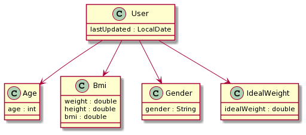

The User object is where the majority of the user's information and parameters are stored.

The 'User' object contains the following components:
1. `age`: Represents the Integer value holding the age of the user
2. `bmi`: Represents the Bmi object, which holds the height and weight values of the user (in double)
3. `gender`: Represents the String value holding the gender of the user
4. `IdealWeight`: Represents the Double value providing the ideal weight of the user

Some of the actions that can be performed with the User component are:
1. Set and retrieve the user's chosen diet plan (Active Diet Plan)
2. Update and retrieve the list of Food items that the user has stored

### Food Object

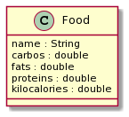

The food object stores the name of the food and its nutrient values (Carbohydrates, Fats and Proteins).

The 'Food' contains the following components:
1. `name`: Represents the name of the food item stored in the food component
2. `carbos`: Represents the carbo values that is associated with the food item stored in the food component
3. `fats`: Represents the fat values that is associated with the food item stored in the food component
4. `proteins`: Represents the proteins values that is associated with the food item stored in the food component
5. `kilocalories`: Represents the kilocalories values that is associated with the food item stored in the food component

There are some actions that can be performed with the Food component.
1. Update respective nutrients' values.
2. Calculate total kilocalories' values.

Below is the Sequence Flow Diagram when a Food gets added to the UniqueFoodList through the Add-Command: to-do

#### Design consideration:

##### Aspect: How the components within `Food` are added or changed

* Current Choice:
  * The food components are not immutable and its nutrients value will update each time an update command is passed.
* Pros:
  * Faster as food objects do not have to be created everytime when a change is done
  * Flexible to changes since only an update command is called to change the value
* Cons:
  * More prone to bugs as the components can be changed freely
* Alternative 1: Make `Food` components immutable.
  * Pros:
    * Less prone to bugs
  * Cons:
    * More overhead to update items as a new object is created every time

### UniqueFoodList Object

The UniqueFoodList class represents a list of food recorded by the user.

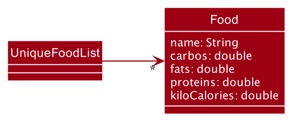

The UniqueFoodList class stores an ObservableList of Food:
1. `ObservableList<Food>`: Represents the list of recorded `Food`

Additionally, here are some information to note:
1. `Food` with similar names to existing items will not be allowed to be added in. More information on the information is provided in the section below.

#### Design consideration

##### Aspect: A single `UniqueFoodList` used for the program

* Current Choice:
    * A single `UniqueFoodList` is used to store all the `Food` item(s) by the user

* Pros:
    * Easier management for all the `Food` items
    * No duplicated record for a certain `Food` item

* Cons:
    * Reduces the convenience of storing multiple nutrients' value for a certain `Food` item

* Alternative 1: Keep multiple `UniqueFoodList`
    * Pros:
        * Similar `Food` items can store multiple nutrients' value across
    * Cons:
        * Referencing a particular value from multiple lists can be quite complicated and buggy

### Add food item feature

The following activity diagram summarizes what happens when a user executes a `food_add` command:

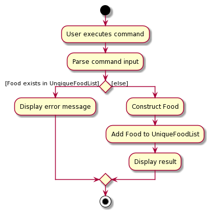

#### Description:

This command adds a valid food item into the unique food list. Users are able to add a food item in with the valid input to the command below. If a food item with a similar name is added, this command will not allow it and an error will be shown to ask the user if they want to update the value instead.

Example: `food_add n/FOOD_NAME c/CARBOS f/FATS p/PROTEINS`

#### Implementation:

Once the user types in the command to add food, the parser will check for all the required prefixes. If all required prefixes are present and the input values are valid, `AddFoodItemCommand` object is created. `AddFoodItemCommand` is a class that extends `Command` abstract class. `AddFoodItemCommand` implements the `execute()` method from the `Command` abstract class. Upon execution, the command will check with the food list whether it has a food item that has a similar name. If there is, it will prompt an error that the food item exist and suggest updating the food item value instead. Otherwise, a new food item object will be created and added into the food list.

Below is an example of a usage scenario:

Step 1: The user launches the application and executes `food_add n/chocolate c/100 f/100 p/100` to create the food item.

Step 2: The food item is added to the food list.

The following sequence diagram shows how the add operation works:
Diagram flow to be inserted here

### Update food item feature

#### Description:

This command updates a valid food item with the new value(s) specified in the unique food list. Food item has to exist in the food list and nutrient values specified has to be different from original before an update is permitted.

Example: `food_update n/FOOD_NAME c/CARBOS f/FATS p/PROTEINS`

#### Implementation:

Once the user types in the command to update food, the parser will check for the presence of the name prefix and the presence of at least one of the nutrient prefix. If the required prefixes and valid value(s) are present, the `UpdateFoodItemCommand` object is created and a temporary food item object is created with the new values. `UpdateFoodItemCommand` is a class that extends `Command` abstract class. `UpdateFoodItemCommand` implements the `execute()` method from the `Command` abstract class. Upon execution, the command will check with the food list whether it has a food item that has a similar name. If there is, it will check for any difference of the original values with the new value(s). If there is at least 1 difference, the food item in the food list will be updated to the new value(s). Otherwise, it will prompt for the user to modify at least 1 of the food item's value to be different from original.

Below is an example of a usage scenario:

Step 1: The user launches the application and executes `food_update n/chocolate c/200 f/200 p/200` to update the specified food item.

Step 2: The food item specified will have its value(s) updated to the new value(s) in the food list.

The following sequence diagram shows how the update operation works:

### List food item feature

#### Description:

This command lists all the food item(s) in the food list.

Example: `food_list`

#### Implementation:

Once the user types in the command, the list of food items in the food list will be displayed.`ListFoodItemCommand` is a class that extends `Command` abstract class. `ListFoodItemCommand` implements the `execute()` method from the `Command` abstract class. Upon execution, the command will list all the food items stored in the food list.

Below is an example of a usage scenario:

Step 1: The user launches the application and executes `food_list`.

Step 2: The food item(s) in the food list will be displayed.

The following sequence diagram shows how the delete operation works:

### Delete food item feature

The following activity diagram summarizes what happens when a user executes a `food_delete` command:

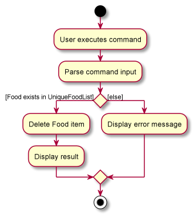
#### Description:

This command deletes a valid food item from the unique food list. Food item has to exist in the food list before the deletion can be carried out.

Example: `food_delete n/FOOD_NAME`

#### Implementation:

Once the user types in the command to delete food, the parser will check for the required name prefix. If the name prefix is present, the `DeleteFoodItemCommand` object is created with the food name captured from the parser. `DeleteFoodItemCommand` is a class that extends `Command` abstract class. `DeleteFoodItemCommand` implements the `execute()` method from the `Command` abstract class. Upon execution, the command will check with the food list whether it has a food item that has a similar name. If there is, it will delete the food item from the list. Otherwise, it will prompt an error that the food item is not found.

Below is an example of a usage scenario:

Step 1: The user launches the application and executes `food_delete n/chocolate`.

Step 2: The food item specified will be deleted from the food list.

The following sequence diagram shows how the delete operation works:

### FoodIntake Object

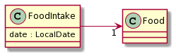

The food intake object represents the date and food associated with a particular food intake.

The 'FoodIntake' class stores a `LocalDate` and `Food`:

1. `date` : Represents the date that the FoodIntake was recorded
2. `food` : Represents the `Food` object associated with the FoodIntake record

The `Food` object associated with each `FoodIntake` object is independent of the `UniqueFoodList` and editing a `Food` in the `UniqueFoodList` will not affect old FoodIntake values, and vice versa.

#### FoodIntake Constructors

There are two constructors for the creation of a FoodIntake object.

1. `public FoodIntake(LocalDate date, Food temporaryFood)` : Creates a `FoodIntake` object given the `LocalDate` and `Food` object - used in the general FoodIntakeCommand when there is no need to alter the `Food` name e.g. appending the numerical duplicate count.
2. `public FoodIntake(LocalDate date, String name, double carbos, double fats, double proteins)` : Creates a FoodIntake object given the `LocalDate` and individual food name and nutrient values - used when loading to file and saving duplicate `FoodIntake` Food names.

#### Design consideration

##### Aspect: Allowing special `Food` names for duplicate `FoodIntake` names

When adding multiple `FoodIntake`s with the same `Food` name in a given date, the `FoodIntake` with the duplicate name will be appended with a **duplicate count**.

For example, adding two 'chicken rice' will result in the following list of food intakes: chicken rice, chicken rice #2.

Hence, there is a need to allow for a by-pass in the name validation by `Food` which conventionally only allows **alphanumeric characters**. When a `Food` contains a duplicate name and is added to the `FoodIntakeList`, the name will be renamed to include the duplicate count which contains the '#' character - which is not allowed by the default constructor.

* Current Choice:
  * Create two different constructors for the `FoodIntake` class. One directly accepts a `Food` object, which must adhere to the naming validation by `Food`, while the other accepts all the individual name and nutrient values.
  * In the background, the `FoodIntake` class creates a `Food` object with a temporary name and then calls the `setName()` method to reflect the name with the duplicate count - bypassing the alphanumeric check.
* Pros:
  * There is no need to amend the original `Food` class and potentially harm the integrity of the `Food` names
  * Does not affect the `UniqueFoodList`
* Cons:
  * Results in two different constructors
* Alternative 1: Make a separate class to store foods specifically in the `FoodIntake`
  * Pros:
    * No need for multiple constructors in `Food`
  * Cons:
    * Less intuitive, as both classes are essentially taking on the role of a 'Food'

### FoodIntakeList Object

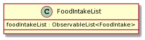

The FoodIntake class represents a list of recorded food intakes by the user.

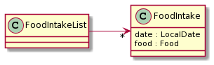

The FoodIntake class stores an ObservableList of `FoodIntake`s:
1. `ObservableList<FoodIntake>`: Represents the list of recorded `FoodIntake`s

Additionally, some noteworthy information to note:
1. `FoodIntake`s with duplicate `Food` names will have their names renamed to include a duplicate count. More information on the implementation is provided in the below section.
2. Whenever a `FoodIntake` is deleted, the duplicate count is re-ordered for `FoodIntake`s matching the name and date. More information on the implementation is provided in the below section.

#### Design consideration

##### Aspect: A single `FoodIntakeList` used for the program

* Current Choice:
  * A single `FoodIntakeList` is used to store all `FoodIntake`s by the user
* Pros:
  * Easier maintenance and storage of files
* Cons:
  * All data from multiple plans may reside in the same list when the user switches plans midway
* Alternative 1: Keep multiple `FoodIntakeList`s
  * Pros:
    * Looking at the individual storage files would be clearer as different FoodIntakes from different plans are located in different files
  * Cons:
    * It is generally more complicated to implement and harder to ensure that the user is saving to the right `FoodIntakeList` instance

### Add Food Intake feature

The following activity diagram summarizes what happens when a user executes a `food_intake_add` command:

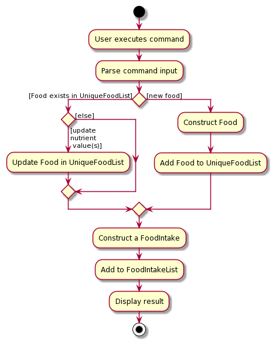

#### Description:

For the user's convenience, there are 3 scenarios for recording food intake.

1. Add `FoodIntake` for new `Food` not currently in the `UniqueFoodList`. 
Example: `food_intake_add d/dd MMM yyy n/FOOD_NAME c/CARBOS f/FATS p/PROTEINS`

2. Add `FoodIntake` using existing `Food` in the `UniqueFoodList` and update its nutrient values. 
Example: `food_intake_add d/dd MMM yyy n/FOOD_NAME p/PROTEINS <at least 1 nutrient value>`

3. Add `FoodIntake` using existing `Food` in the `UniqueFoodList` without updating its values. 
Example: `food_intake_add d/dd MMM yyy n/FOOD_NAME`

#### Implementation:

The following sequence diagram shows how the food intake command works when adding a new food not in the `UniqueFoodList`:

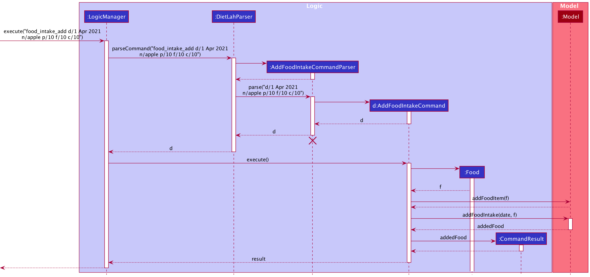

:information_source: **Note:** Since the 3 scenarios will have roughly similar sequence diagrams, we have only included one detailed diagram showcasing the more complex scenario (when a food is not in the `UniqueFoodList`) 

The `AddFoodIntakeParser` first verifies that the expected format is met and then calls the `AddFoodIntakeCommand()` method which checks whether an existing `Food` exists in the `UniqueFoodList`.

1. If there exists an existing `Food` found in the `UniqueFoodList`, the `Food` object is retrieved, and if at least 1 nutrient value is provided, the `UniqueFoodList` will be updated with the new `Food` information.
2. If no match is found in the `UniqueFoodList`, a new `Food` object is created and added to the `UniqueFoodList` for the user's convenience using the provided nutrient values. Values that are not provided are default to **0**.

  :information_source: **Note:** When updating a `Food` to its new nutrient values, `FoodIntake`s already in the `FoodIntakeList` will not be affected by the update.

The `addFoodIntake()` method of the `FoodIntakeList` is finally called to add the `FoodIntake` into the list. Refer to the detailed implementation below.

##### addFoodIntake(FoodIntake foodIntake)

The method first strips the duplicate count, if any, from the `Food` name in the `FoodIntake` using the `getOriginalName()`. Thereafter, the `getFoodIntakeItemCount()` method is called which returns the number of `FoodIntakes` matching the `Food` name and `date` (item count).

If the item count is 0, the `FoodIntake` is added as it is. Otherwise, it means that there is at least 1 `FoodIntake` with the same name and date - and would require a duplicate count to be appended to the name.

For example, if the original name is 'chocolate', and there are 3 `FoodIntake`s with 'chocolate' as their original name (duplicate count stripped out), then the name will be updated to 'chocolate #4' as it would be the 4th chocolate added to the `FoodIntakeList` on the specified date.

### Delete Food Intake feature

The following activity diagram summarizes what happens when a user executes a `food_intake_delete` command:

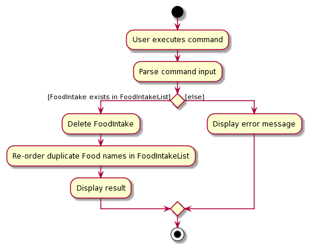

#### Description:

The user can delete food intakes already added to the application by providing the food name, and date of intake.

Example: `food_intake_delete d/dd MMM yyy n/FOOD_NAME`

#### Implementation:

When the user deletes a food intake, the matching `FoodIntake` with the same date will be deleted. Because of the duplicate count appended in the add process, all names are guaranteed unique for a specified date.

The `deleteFoodIntake()` method in the `FoodIntakeList`  looks for the matching `FoodIntake` `Food` name with the specified date and deletes the `FoodIntake` if it exists or throw a `FoodIntakeNotFoundException`. After successfully deleting, the `reorderDuplicateFoodNames()` is called to re-order all matching `Food` names as the counter might be out-of-date. This step is crucial, as the duplicate count's numbering may be out of order if they are not re-ordered.

### Update Food Intake feature

The following activity diagram summarizes what happens when a user executes a `food_intake_update` command:

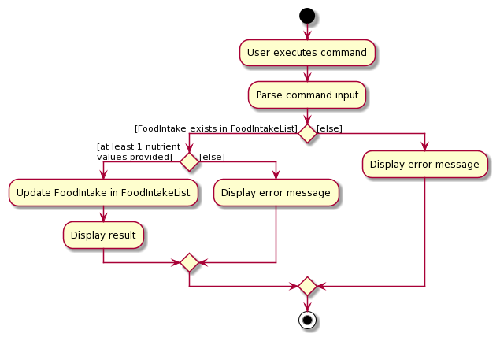

#### Description:

The user can update the nutrient values of previously recorded food intakes. At least 1 nutrient value must be provided to be updated and values not provided will remain unchanged.

Example: `food_intake_update d/dd MMM yyy n/FOOD_NAME p/PROTEINS <at least 1 nutrient value>`

#### Implementation:

The `UpdateFoodIntakeCommand` will take in the provided nutrient values to be updated, and for those that were not provided, the original `FoodIntake`'s `Food` values will be copied over and retained.

The newly packaged `FoodIntake` object with the updated `Food` values is passed to the `updateFoodIntake()` method in the `FoodIntakeList` and will replace the matching `FoodIntake`.

### Progress Report feature

The progress report gives the user the ability to track the progress of his/her food intake against the requirements of the diet plan selected by the user.
Each progress report provides the following information:

* The general details of the active diet plan, such as the name, description and its macronutrient composition.
* The required daily macronutrient intake based on the user's Body Mass Index (BMI)
* The foods consumed by the user, grouped in the day it was consumed, and their macronutrient compositions
* How much the daily intake has adhered to the diet plan's macronutrient requirements
* How much the user has adhered to the diet plan's macronutrient requirements in total

Example: `progress`

#### Implementation:

Before the `progress` command can be successfully run, the user needs to have selected an active diet plan to follow. Otherwise, the user will be prompted to select a diet plan first.
A progress report will then be generated whenever the `progress` command is entered.

Below is an example of a usage scenario:

Step 1: The user launches the application and executes `plan_set p/1` to set an active diet plan.

Step 2: The user adds the food consumed using the `food_intake_add` command (refer to the Add food intake feature for more details)

Step 3: The user executes `progress` to view a progress report based on the active diet plan and his/her food intake.

#### ProgressCalculator class

The `ProgressCalulator` class is a static class containing the `calculateProgress` method which accepts a `user` input parameter in the form of a `User` class object.
This `user` object will contain the necessary information required to calculate the precentage of adherence to the diet plan. These information are:

1. The `DietPlan` class object which contains the macronutrients requirements for the plan
2. The `FoodIntakeList` class object which contains the list of foods consumed by the user on which day

The progress calculator will first calculate the required calories and macronutrients to fit the goal of the user's active diet plan. Documented below are the steps involved in deciding the daily amount of calories and macronutrients needed for the user to adhere to the diet plan:

1. The user's weight maintenance calories are calculated based on the **Mifflin-St Joer Formula**.
2. Depending on the type of diet plan (weight gain, weight loss or weight maintenance), the amount of calories required is calculated:
   * For weight gain plans, the daily amount of calories required is **maintenance calories + 400**
   * For weight loss plans, the daily amount of calories required is **maintenance calories - 500**
   * For weight maintenance plans, the daily amount of calories required is the **maintenance calories**
3. The *macronutrients' percentages* for the diet plan is applied to the calculated calories to determine how much of each macronutrient is required (in grams).

The progress calculator then uses the *macronutrients' percentages* to decide whether the user has fulfiled the diet plan's requirements. This information is displayed via 3 main sections of the report:
* Active diet plan details
* Daily report
* Total report

The following sections will explain how each of these information is collected by the `ProgressCalculator` class.

#### Active diet plan details

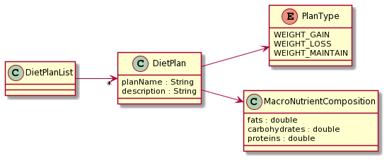

This section of the progress report details information pertaining to the active diet plan. These information is retrieved from the respective `DietPlan` class of the active diet plan selected by the user.
This includes the name of the diet plan, a brief description of the diet plan and the macronutrient requirements (in percentages).
 

Additionally, this section also shows the daily macronutrients requirements the user needs to follow in order to fulfil the plan's requirements. This includes the daily calorie intake, daily carbohydrate intake, daily protein intake and daily fats intake, in grams.

#### Daily report

This section of the progress report details the foods consumed within each day as well as whether the daily total of each macronutrient adheres to the plan's requirements.  

The total of each macronutrient intake is calculated by summing up the macronutrients *(carbohydrates, proteins and fats)* in each food consumed within that particular day.
These totals are divided by their respective daily macronutrient requirements to get a percentage of how much the user has adhered to the plan's requirements. This *daily adherence percentage* indicates whether the user has exceeded, is under or is within the diet plan's requirements for that day.

A leeway value of **5%** is allowed should the user's *daily adherence percentage* fall just above or below the required amount.

#### Total report

This section of the progress report details the user's total adherence to the diet plan's requirements. This is calculated by taking the average of all *daily adherence percentages* of each day.
This *total adherence percentage* is then reported to the user.

Similar to the *daily adherence percentage*, the *total adherence percentage* has a leeway value of **10%** should it fall just above or below the required amount.

#### Design consideration:

The are certain design considerations made when adding the progress calculator feature. The first of which is the use of the Mifflin-St Joer Formula to calculate the BMR as opposed to other formulas.
Frankenfield (2005) studied 4 equations that were commonly used in calculating BMR. These equations were the Mifflin-St Joer equation, the Harris-Benedict equation, the Owen equation and the WHO/FAO/UNU equation.
The study found that the Mifflin-St Joer formula was most accurate in calculating the BMR, being within 10% of the actual value measured.
As such, the DietLAH! team has decided to use the Mifflin-St Joer formula as the basis for calculating BMR of users.
 

Secondly, there are leeways given for the *daily adherence percentage* and the *total adherence percentage* to provide more flexibility to the application. This is made in consideration of human errors, such as inaccurate estimation of macronutrients, as well as inaccuracies in nutrition labels.

### Reset feature

#### Description:

DietLAH! allows users to reset the application data to either blank or to some sample template data for testing purposes.

Example: `reset t/blank` to a fresh copy

Example: `reset t/template` to the sample template data

#### Implementation:
Both the `resetToTemplate()` and `resetToBlank()` methods reside in the `FoodIntakeList` and `UniqueFoodList` respectively. When the `reset` command is called, the respective reset method is called in both the `FoodIntakeList` and `UniqueFoodList`.

`resetToTemplate()` makes use of the `TemplateInitializer` to populate the lists with a fixed set of sample template data, while `resetToBlank()` resets the list to blank.

Thereafter, a new `User` is created via `createUser(this.foodList, this.foodIntakeList)` with the cleared `UniqueFoodList` and `FoodIntakeList`. If the reset type is set to `blank`, the `User` storage file is **deleted** and the user will be required to re-setup their BMI.

### Mifflin-St Joer Formula

The Mifflin-St Joer Formula is used to calculate the Basal Metabolic Rate (BMR), which is the rate at which calories are burned daily when the individual is not performing any activity.
The formula takes into account the individual's weight, height, age and sex.
 

For men, the formula is as follows: **(10 * weight(kg)) + (6.25 x height(cm)) – (5 x age(years)) + 5**
 
For women, the formula is as follows: **(10 * weight(kg)) + (6.25 x height(cm)) – (5 x age(years)) - 161**

### Product Scope

**Target user profile**
  * want to start a diet
  * track their progress against a diet plan
  * track the macronutrients of the food consumed
  * is comfortable with command-line interface

**Value proposition**: quickly input daily food intake and calculate their macronutrients to check if diet plan is progressing as planned

### User Stories

Priorities: High (must have) - `***`, Medium (nice to have) - `**`, Low (unlikely to have) - `*`

|Priority|   As a ...   |   I want to ...  |   So that I can​ ...   |
|------------|------------------|----------------------|---------------------------|
|`***`|User|Set a deadline for my diet plan|Stay on track of when the diet finishes|
|`***`|User|Add a new diet plan|Start a new diet plan|
|`***`|User|Delete my diet plan|Give up on the current diet plan|
|`***`|User|Track my weight|See if the diet is working|
|`***`|User|View a list of recommended diets|find out what to diet on as I am not sure|
|`***`|First-time User|Skim through some example templates|Know how the application works|
|`**`|Long-time User|See a history of my past diet|I can backtrack what diets I have been on|
|`**`|Frequent user|Store information on the popular foods that I eat|Quickly input my intake for the day|
|`**`|User|Customize my diet plan|Adjust my diet plan to fit my needs|
|`**`|User with dietary requirements|Filter the list of diets to fit my dietary requirements|Choose diets that are suited to my dietary needs|
|`*`|Social Users|See/Give reviews on diets|Know which diets are more effective for others|
|`*`|Social Users|Connect with peers to see their dietary plans and progress|Stay up-to-date with my peers and possibly motivate myself|

*{More to be added}*

### Use Cases

(For all use cases below, the **Body Mass Index (BMI) Tracker** is the `BMITracker`, **Diet Plan Selector** is the `DietSelector`, **Macronutrients Tracker** is the `MacroTracker` and the **Actor** is the `user`, unless specified otherwise)

#### Use case: Calculate BMI

**MSS**

1.  User keys in the weight, height and ideal weight
2.  BMITracker calculates BMI from the user input
3.  BMITracker updates the height, weight and BMI of the user

    Use case ends.

#### Use case: Query height and weight

**MSS**

1.  User queries for height and weight
2.  BMITracker displays information for height and weight

    Use case ends.

#### Use case: Update height and weight

**MSS**

1.  User queries for height and weight
2.  BMITracker displays information for height and weight
3.  User updates the height and weight if they are different
4.  BMITracker updates the height, weight and BMI of the user

    Use case ends.

#### Use case: Add food item as consumption

**MSS**

1.  User keys in the date and food item with information such as its name, fats, carbos, proteins
2.  MacroTracker keeps track of that and calculates its kilocalories
3.  MacroTracker computes the total kilocalories for the day

    Use case ends.

#### Use case: Get diet recommendation

**MSS**

1.  User requests to get a list of diet recommendation
2.  DietSelector displays a list of diet recommendation based on user's BMI

    Use case ends.

#### Use case: View diet plan

**MSS**

1.  User requests for a certain diet type
2.  DietSelector displays a detailed requirement for that certain diet type

    Use case ends.

#### Use case: Add food item as an intake

**MSS**

1.  User adds a particular food item
2.  MacroTracker tracks the food and computes the total kilo calories consumption for the day

    Use case ends.

**Extensions**
*  1a. The food item exists.

   * 1a1. MacroTracker updates food item details in the list of food.

*  1b. The food item does not exists.

   * 1b1. MacroTracker adds the food item into the list of food.

   Use case resumes at step 2.

#### Use case: Display current food intake for the day

**MSS**

1.  User queries a particular day intake.
2.  MacroTracker displays the summary intake for that day.

    Use case ends.

#### Use case: Update food intake for a particular food and date

**MSS**

1.  User keys in the date, food name, and nutrient values.
2.  MacroTracker displays updated list of food intakes for the specified date.

    Use case ends.
    
**Extensions**
*  1a. The food intake exists.

   * 1a1. MacroTracker updates the provided nutrient values in the food intake list.
   * Use case resumes at step 2.

*  1b. The food intake does not exists.

   * 1b1. Show invalid food intake message
   * Use case ends

*{More to be added}*

### Non-Functional Requirements

1.  Should work on any _mainstream OS_ as long as it has Java `11` or above installed.
2.  Should be able to hold diet plans for up to the past two years (730 days) without a noticeable sluggishness in performance for typical usage.
3.  A user with above average typing speed for regular English text (i.e. not code, not system admin commands) should be able to accomplish most of the tasks faster using commands than using the mouse.
4.  Should help users as they start the application for the first time with sample data.
5.  Interface should not hinder the users' usage of the application in order to input the data they need and get the desired response.
6.  The data files should be easily modifiable by a user with a basic understanding of the JavaScript Object Notation (JSON).
7.  Errors should display vividly and differently from the rest of the normal input such that users are aware something has gone wrong.
8.  Should be easily deployable to all systems running any _mainstream OS_ once compiled executable is distributed via a release.

### Glossary

* **Mainstream OS**: Windows, Linux, Unix, OS-X

*{More to be added}*

### References

Frankenfield, D., Roth-Yousey L. & Compher C. (2005). Comparison of predictive equations for resting metabolic rate in healthy nonobese and obese adults: a systematic review. *Journal of the American Dietetic Association*, 105(5), 775-89. doi: 10.1016/j.jada.2005.02.005.

## **Appendix: Instructions for Manual Testing**

Included in this section are some basic instructions developers may make use of to test features implemented in the app.

### On-boarding and closing the app

1. Initial launch

    1. Download the latest release of the JAR file from the [releases](https://github.com/AY2021S2-CS2103T-T12-2/tp/releases) section and copy into your desired empty folder.

    1. Launch the JAR file with the Java 11 runtime. You should see the app with a welcome screen, along with some sample data already pre-loaded into the app.

1. Closing the app

    1. You may type `exit` in the command box at the top to exit the application.

### Clear sample data

1. As we populate the data files with sample information on first launch, some of the commands may return unexpected results unless you clear this data first.
    1. Thus, to clear the data and enter a "blank slate", type `reset t/blank`.
    1. Alternatively, if you want to prepare the app for showcase and populate some sample data, you can reset it to the template with `reset t/template`.

### Record, show or update BMI information

1. After clearing the sample data (instructions provided above), you are now ready to record, show and update your BMI information.
    1. Test case: `bmi_query` 
       Result: Error message printed because no BMI information is available after clearing the sample data.
       
    1. Using the command `bmi g/F a/30 h/170 w/70 i/50`, this will create a new user information with the given parameters. 
       Result: Success message with User object created with the corresponding values.
       
    1. Test case: `bmi_query` 
      Result: BMI information corresponding to above values is printed.
       
    1. Test case: `bmi g/F a/30 h/170 w/70 i/50` 
       Result: Error message is printed as the User object already exists.
       
    1. Test case: `bmi_update g/F a/30 h/165 w/65 i/45` 
       Result: Success message with User object updated to the corresponding values.

### Diet Plan Selector

1. Show ALL available diet plans
    1. Test case: `plan_list` 
       Result: All 6 currently implemented diet plans are shown in a list-fashion.

1. Get recommended diet plans

    1. Test case: `plan_recommend` 
        Result: As the BMI is in the overweight range, and the ideal weight is lower, weight-loss plans are recommended. (Standard Ketogenic and High-Protein Ketogenic diets)
       
    1. Test case: `bmi_update g/F a/30 h/165 w/40 i/60`; `plan_recommend` 
        Result: As the BMI is in the underweight range, and the ideal weight is higher, weight-gain plans are recommended. (Balanced Weight Gain, Bulk and High Carbo diets)
    
1. Get information on diet plan:
    1. Test case: `plan p/2` 
        Result: Shows information on plan 2, the "High-Protein Ketogenic Diet"
       
1. Select and view selected diet plan
    1. Test case: `plan_set p/2` 
        Result: Shown that you have selected "High-Protein Ketogenic Diet"
       
       1. Test case: `plan_current` 
        Result: Shown that you have selected "High-Protein Ketogenic Diet"
          
### Manage food items

1. Add food item
    1. Test case: `food_add n/tomato c/10 f/10 p/10` 
        Result: Tomato food item added.
       
    1. Test case: `food_add n/tomato c/10.1555 f/10 p/10` 
        Result: Error message that macronutrients can only be up to 2 decimal places long.

1. Update food item
    1. Test case: `food_update n/tomato c/20 f/30 p/40` 
        Result: Tomato food item updated.
       
    1. Test case: `food_update n/tomato c/20.1515 f/30 p/40` 
        Result: Error message that macronutrients can only be up to 2 decimal places long.
       
1. List food items
    1. Test case: `food_list` 
        Result: List of food is printed (only tomato should exist at this point).
       
1. Delete food items
    1. Test case: `food_delete n/tomato` 
        Result: Tomato food item deleted.
       
### Manage food intake
1. Add food intake for a food item that is not in the food list
    1. Test case: `food_intake_add d/31 Mar 2021 n/tomato c/10 f/10 p/10` 
        Result: Food item with name "tomato" is added into FoodIntake list for 31 Mar 2021.
       
1. Add food intake for a food item that is already in the food list
    1. Prerequisite: `food_add n/potato c/10 f/10 p/10`
    1. Test case: `food_intake_add d/31 Mar 2021 n/potato` 
        Result: Food item that was in the list "potato" is added into FoodIntake list for 31 Mar 2021.

1. Add food intake for a food item that is already in the food list, but with different nutritional values
    1. Test case: `food_intake_add d/31 Mar 2021 n/potato c/20 f/35 p/50` 
        Result: Food item that was in the list "potato" is added into FoodIntake list for 31 Mar 2021, but with the new nutritional values.
       
1. Update food intake
    1. Test case: `food_intake_update d/31 Mar 2021 n/tomato c/20 f/40 p/50` 
        Result: "tomato" that was in the list for 31 Mar 2021 is updated with the new nutritional values.
       
    1. Test case: `food_intake_update d/31 Mar 2021 n/asdasdf c/20 f/40 p/50` 
        Result: Error message that the food item could not be found.
       
1. Delete food intake
    1. Test case: `food_intake_delete d/31 Mar 2021 n/tomato` 
        Result: "tomato" deleted from the FoodIntake list for 31 Mar 2021.
       
    1. Test case: `food_intake_delete d/31 Mar 2021 n/asdasdad` 
        Result: Error message that the food item could not be found.
       
1. List food intake
    1. Test case: `food_intake_query d/31 Mar 2021` 
        Result: Food intake for 31 Mar 2021 is listed.
       
    1. Test case: `food_intake_query d/32 Mar 2021` 
        Result: Error message that date format is wrong.
       
    1. Test case: `food_intake_query df/1 Mar 2021 dt/31 Mar 2021` 
        Result: Food intake from 1 Mar to 31 Mar is listed.
       
### Progress Report

1. Show progress report
    1. Test case: `progress` 
        Result: Progress report is printed.

### Print help message

1. Print help message

    1. Test case: `help` 
       Result: The initial launch message is printed.

## **Appendix: Effort**

If AB3 required an implementation effort of 10, DietLAH!'s implementation effort is 18.

This is primarily due to the fact that AB3 primarily simply took information in and showcased it back to the user (input-output).

In DietLAH!'s case, we have to deal with several different aspects such as:
1. Storage of not just the User class and object, but also of varying supporting functions such as the FoodIntake list and the FoodList. This is done separately to allow for more flexibility in the future.

1. Adding functionality to track the user's progress and putting in design considerations that would allow for the user to update their BMI, and selected diet plans at a later time (Rationale: People lose/gain weight, and sometimes they may feel a plan does not actually suit them halfway in)
