## Contents
- [Quick Start](#setting-up-getting-started)
- [Design](#design)
  - [Architecture](#architecture)
  - [UI](#ui-component)
  - [Logic](#logic-component)
  - [Model](#model-component)
  - [Storage](#storage-component)
- [Implementation](#implementation)
  - [Blacklist](#blacklist-feature)
  - [Collect](#collect-feature)
  - [Find](#finding-contacts-by-details)
  - [Light](#light-feature)
  - [Dark](#dark-feature)
  - [Mode of Contact](#mode-of-contact-feature)
  - [Mass Blacklist](#mass-blacklist-feature)
  - [Mass Delete](#mass-delete-feature)
  - [Remark](#remark-feature)
  - [Navigate Previous Commands](#navigate-previous-commands-feature)
  - [Sort](#sort-feature)
  - [Undo](#undo-feature)
- [Additional guides](#documentation-logging-testing-configuration-dev-ops)
- [Appendix: Requirements](#appendix-requirements)
  - [Product scope](#product-scope)
  - [User stories](#user-stories)
  - [Use cases](#use-cases)
  - [Non-Functional Requirements](#non-functional-requirements)
- [Appendix: Instructions for manual testing](#appendix-instructions-for-manual-testing)
  - [Launch and shutdown](#launch-and-shutdown)
  - [Saving data](#saving-data)
  - [Adding a contact](#adding-a-contact)
  - [Blacklisting or un-blacklisting a contact](#blacklisting-or-un-blacklisting-a-contact)
  - [Blacklisting or un-blacklisting multiple contacts](#blacklisting-or-un-blacklisting-multiple-contacts)
  - [Changing to dark mode](#changing-to-dark-mode)
  - [Changing to light mode](#changing-to-light-mode)
  - [Collecting details from all listed contacts](#collecting-details-from-all-listed-contacts)
  - [Deleting a contact](#deleting-a-contact)
  - [Deleting multiple contacts](#deleting-multiple-contacts)
  - [Editing remark for a contact](#editing-remark-for-a-contact)
  - [Finding contacts](#finding-contacts)
  - [Navigating through commands](#navigating-through-commands)
  - [Sorting entries by name](#sorting-entries-by-name)
  - [Undoing previous operations](#undoing-previous-operations)

--------------------------------------------------------------------------------------------------------------------

## **Setting up, getting started**

Refer to the guide [_Setting up and getting started_](SettingUp.md).

--------------------------------------------------------------------------------------------------------------------

## **Design**

### Architecture

The ***Architecture Diagram*** given above explains the high-level design of the App. Given below is a quick overview of each component.

:bulb: **Tip:** The `.puml` files used to create diagrams in this document can be found in the [diagrams](https://github.com/se-edu/addressbook-level3/tree/master/docs/diagrams/) folder. Refer to the [_PlantUML Tutorial_ at se-edu/guides](https://se-education.org/guides/tutorials/plantUml.html) to learn how to create and edit diagrams.

**`Main`** has two classes called [`Main`](https://github.com/se-edu/addressbook-level3/tree/master/src/main/java/seedu/address/Main.java) and [`MainApp`](https://github.com/se-edu/addressbook-level3/tree/master/src/main/java/seedu/address/MainApp.java). It is responsible for,
* At app launch: Initializes the components in the correct sequence, and connects them up with each other.
* At shut down: Shuts down the components and invokes cleanup methods where necessary.

[**`Commons`**](#common-classes) represents a collection of classes used by multiple other components.

The rest of the App consists of four components.

* [**`UI`**](#ui-component): The UI of the App.
* [**`Logic`**](#logic-component): The command executor.
* [**`Model`**](#model-component): Holds the data of the App in memory.
* [**`Storage`**](#storage-component): Reads data from, and writes data to, the hard disk.

Each of the four components,

* defines its *API* in an `interface` with the same name as the Component.
* exposes its functionality using a concrete `{Component Name}Manager` class (which implements the corresponding API `interface` mentioned in the previous point.

For example, the `Logic` component (see the class diagram given below) defines its API in the `Logic.java` interface and exposes its functionality using the `LogicManager.java` class which implements the `Logic` interface.

**How the architecture components interact with each other**

The *Sequence Diagram* below shows how the components interact with each other for the scenario where the user issues the command `delete 1`.

The sections below give more details of each component.

### UI component

**API** :
[`Ui.java`](https://github.com/se-edu/addressbook-level3/tree/master/src/main/java/seedu/address/ui/Ui.java)

The UI consists of a `MainWindow` that is made up of parts e.g.`CommandBox`, `ResultDisplay`, `PersonListPanel`, `StatusBarFooter` etc. All these, including the `MainWindow`, inherit from the abstract `UiPart` class.

The `UI` component uses JavaFx UI framework. The layout of these UI parts are defined in matching `.fxml` files that are in the `src/main/resources/view` folder. For example, the layout of the [`MainWindow`](https://github.com/se-edu/addressbook-level3/tree/master/src/main/java/seedu/address/ui/MainWindow.java) is specified in [`MainWindow.fxml`](https://github.com/se-edu/addressbook-level3/tree/master/src/main/resources/view/MainWindow.fxml)

The `UI` component,

* Executes user commands using the `Logic` component.
* Listens for changes to `Model` data so that the UI can be updated with the modified data.

### Logic component

**API** :
[`Logic.java`](https://github.com/se-edu/addressbook-level3/tree/master/src/main/java/seedu/address/logic/Logic.java)

1. `Logic` uses the `AddressBookParser` class to parse the user command.
1. This results in a `Command` object which is executed by the `LogicManager`.
1. The command execution can affect the `Model` (e.g. adding a person).
1. The result of the command execution is encapsulated as a `CommandResult` object which is passed back to the `Ui`.
1. In addition, the `CommandResult` object can also instruct the `Ui` to perform certain actions, such as displaying help to the user.

Given below is the Sequence Diagram for interactions within the `Logic` component for the `execute("delete 1")` API call.

:information_source: **Note:** The lifeline for `DeleteCommandParser` should end at the destroy marker (X) but due to a limitation of PlantUML, the lifeline reaches the end of diagram.

### Model component

**API** : [`Model.java`](https://github.com/se-edu/addressbook-level3/tree/master/src/main/java/seedu/address/model/Model.java)

The `Model`,

* stores a `UserPref` object that represents the user’s preferences.
* stores the address book data.
* exposes an unmodifiable `ObservableList<Person>` that can be 'observed' e.g. the UI can be bound to this list so that the UI automatically updates when the data in the list change.
* does not depend on any of the other three components.

:information_source: **Note:** An alternative (arguably, a more OOP) model is given below. It has a `Tag` list in the `AddressBook`, which `Person` references. This allows `AddressBook` to only require one `Tag` object per unique `Tag`, instead of each `Person` needing their own `Tag` object. 

### Storage component

**API** : [`Storage.java`](https://github.com/se-edu/addressbook-level3/tree/master/src/main/java/seedu/address/storage/Storage.java)

The `Storage` component,
* can save `UserPref` objects in json format and read it back.
* can save the address book data in json format and read it back.

### Common classes

Classes used by multiple components are in the `seedu.addressbook.commons` package.

--------------------------------------------------------------------------------------------------------------------

## **Implementation**

This section describes some noteworthy details on how certain features are implemented.

### Blacklist feature
The blacklist mechanism is facilitated by `Person`.
It represents if a `Person` is blacklisted or not, stored internally by adding a `Blacklist` object to the parameters of `Person`.
Blacklist status is displayed externally via `PersonListCard#blacklist`.

Given below is an example usage scenario.

Step 1. The user executes `add n/David …​` to add a new person.
A new `Person` is created, with the default status of un-blacklisted.
It is then added to `AddressBook`.

Step 2. The user decides to blacklist the person, and executes the `blist INDEX` command.
The `blist INDEX` command will create a new `Person` with the same information as the person at `INDEX` in `AddressBook`,
but with a new `Blacklist` with a different blacklist status, which then replaces the original person.

The following sequence diagram shows how the blacklist operation works:

The following activity diagram summarizes what happens when a user executes a blacklist command:

#### Design considerations:

##### Aspect: The command format of blacklist

* **Alternative 1 (current choice):** `blist INDEX` to toggle blacklist status.
    * Pros: Easier to remember, faster to type.
            More straightforward and logical for a value with only 2 states.
    * Cons: Requires checking current blacklist status.

* **Alternative 2:** `+blist INDEX` to blacklist, `-blist INDEX` to un-blacklist.
    * Pros: Able to directly set blacklist status without checking current status.
    * Cons: More commands to remember.

### Collect feature
The collect feature is facilitated by `CommandResult`, which is responsible for displaying the results after
collecting the details. Currently, only details from the 4 main fields (name, phone, address, email)
can be collected.

The following sequence diagram shows how the `collect` command works.

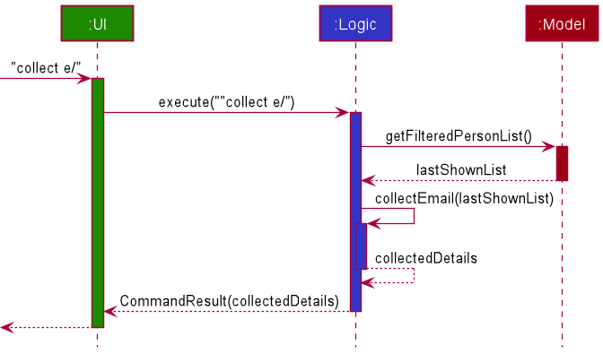

#### Design considerations:

##### Aspect: The number of fields to be collected from

* **Alternative 1 (current choice):** Exactly 1 field out of 4 possible choices.
    * Pros: Simpler and more intuitive command format.
      Usually only 1 field is needed at a time when copying to messaging applications.
    * Cons: Not customisable for all needs.

* **Alternative 2:** Exactly 1 field out of all existing fields.
    * Pros: Able to be used for more situations.
    * Cons: More complex command format for likely unnecessary details.

##### Aspect: The ability to start or end the separator with blank space

* **Alternative 1 (current choice):** Leading or trailing blank space is ignored.
    * Pros: Easier to implement due to reuse of `ArgumentTokenizer`.
      Blank space is not the main separator in the recipient list for most messaging applications,
      so functionality is not significantly impacted.
    * Cons: Collected details are not in reader-friendly format.

* **Alternative 2:** Include all leading and trailing blank spaces
    * Pros: Able to be used for more situations.
    * Cons: More complicated implementation resulting in possibly more bugs.

### Finding contacts by details
This feature is built on the current `find` command, which is used to be limited to only finding persons by names. With this change, the format of the `find` command is now modified to `find n/[NAME] t/[TAG] a/[ADDRESS] p/[PHONE] e/[EMAIL] b/[IS_BLACKLISTED] m/[MODE_OF_CONTACT]`.
This command returns the persons with attributes that matches at least one of the attributes of interest (See User Guide for more details).
Note that users are only required to provide at least one of the parameters to use this command. In other words, commands such as `find n/Alex` and `find t/autistic` are valid commands.

To facilitate the implementation of this feature, several new predicate classes are introduced, for instance, `PersonTagContainsKeywordsPredicate` `AddressContainsKeywordsPredicate`, `ReturnTruePredicate` etc. Of course, As the name suggests, `ReturnTruePredicate` always returns `true`.

The introduction of `ReturnTruePredicate` may seem pointless, but it is of great use. The key here is to realize that if X is a boolean variable, then X `and` `true` simplifies to X. If all keywords are given, the `FindCommand` class will receive all the predicates. If, say, only `name` keywords are given, then rest of the predicates will be replaced with `ReturnTruePredicate`s. As such, the filter will now solely depend on `NameContainsKeywordsPredicate` since the other predicates always returns
true.

The following sequence diagram shows how the `find` command works: 

The following activity diagram shows what happens when `find` command is executed. 

#### Design considerations:

##### Aspect: Command design

* **Alternative 1 (current choice):** `find` command alone supports finding by the different fields.
    * Pros: More intuitive to use since most commands have similar format. Makes further extensions easier as developers only need to define a new predicate class.
    * Cons: Can make debugging harder since further extensions are centralized into one class.

* **Alternative 2:** Find by names and find by tags are separate commands.
    * Pros: Easier to debug as one command is meant for one criterion.
    * Cons: It is now not possible to combine both criteria together. More commands to remember. Due to similarity of the commands, they can be confused from one another.

### Light Feature

The light feature is implemented in the `LightCommand` class.
The following is an example usage scenario.

Step 1: The user executes `light` to switch the current theme to a light theme.
The `UI` component then passes the string to the `LogicManager` class in `Logic` component.

Step 2: The `Logic` component executes the command which changes the boolean light to true. This is passed back to the `UI` component.

Step 3: The `UI` component loads the fxml file containing the light theme and is displayed back to the user.

The following sequence diagram shows how the light command works:

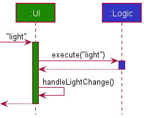

The following activity diagram shows what happens when a user executes the light command:

### Dark Feature

The dark feature is implemented in the `DarkCommand` class.
The following is an example usage scenario.

Step 1: The user executes `dark` to switch the current theme to a dark theme.
The `UI` component then passes the string to the `LogicManager` class in `Logic` component.

Step 2: The `Logic` component executes the command which changes the boolean dark to true. This is passed back to the `UI` component.

Step 3: The `UI` component loads the fxml file containing the dark theme and is displayed back to the user.

The following sequence diagram shows how the dark command works:

The following activity diagram shows what happens when a user executes the dark command:

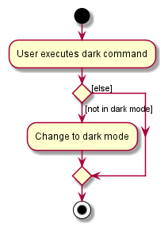

### Mode of Contact feature
The mode of contact feature is built on the current `AddCommand` class.
The following is an example usage scenario.

Step 1: The user executes `add n/Bob …/m email …` to add a new Person with the mode of contact as `email`.
The `UI` component then passes the string to the `LogicManager` class in `Logic` component.

Step 2: The `Logic` component parses the string and creates an `AddCommand` object.

Step 3: The `LogicManager` class then executes the `AddCommand` object, which calls all the appropriate methods including `mode of contact` in the `Model` component.

Step 4: The `Model` component adds the inputted string and the appropriate method in the `Storage` component is executed to update the file.

Step 5: The `Model` component passes the `CommandResult` to the `Logic` component, which is then passed to the `UI` component to display to the user.

The following sequence diagram shows how the add command works:
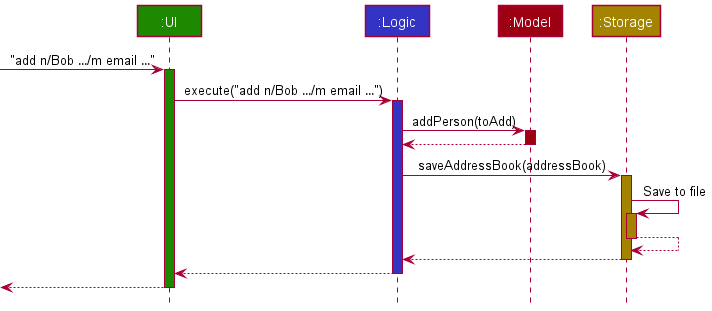

### Mass Blacklist feature
The mass blacklist/un-blacklist mechanism is facilitated by `MassBlacklistCommand`.
Below is an example usage scenario for mass blacklist.

Step 1: The user executes `massblist 2-5 b/blacklist ` to blacklist all contacts within the index range 2-5.
The string is passed to the `Logic` component.

Step 2: The `Logic` component parses the string and creates a corresponding `MassBlacklistCommand` object.

Step 3: The `MassBlacklistCommand` object calls `Model#massBlacklist(2,5)` to blacklist all contacts
in the `AddressBook` with index between 2 to 5.

Step 4: After the contacts have been blacklisted, `filteredPersons` in `ModelManager` is updated to reflect the change.

The following sequence diagram illustrates how the mass blacklist operation works:
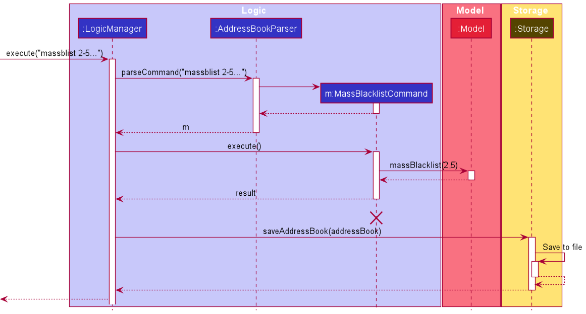

:information_source: **Note:** The lifeline for `MassBlacklistCommand`
should end at the destroy marker (X) but due to a limitation of PlantUML, the lifeline reaches the end of diagram.

The following activity diagram summarizes what happens when a user executes a mass delete command:
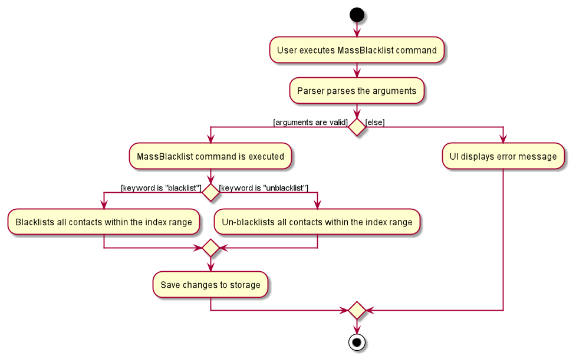

#### Design considerations:

##### Aspect: Implementation of mass blacklist command
* **Alternative 1 (current choice):** Input format is `massdelete START-END`.
  * Pros: More inutitive for the user.
  * Cons: More difficult to implement as new methods will have to be written to parse the hyphen (-) symbol.

* **Alternative 2:** Input format is `massdelete start/START end/END`.
  * Pros: Easier to implement as the existing `ArgumentMultimap` and `CliSyntax` classes are
    well-suited to parse such input formats.
  * Cons: There are more prefixes for the user to remember.
  
### Mass Delete feature
The mass delete mechanism is facilitated by `MassDeleteCommand`.
Below is an example usage scenario.

Step 1: The user executes `massdelete 2-5` to delete all contacts within the index range 2-5.
The string is passed to the `Logic` component.

Step 2: The `Logic` component parses the string and creates a corresponding `MassDeleteCommand` object.

Step 3: The `MassDeleteCommand` object calls `Model#massDelete(2,5)` to delete all contacts
in the `AddressBook` with index between 2 to 5.

Step 4: After deletion, `filteredPersons` in `ModelManager` is updated to reflect the change.

The following sequence diagram illustrates how the mass delete operation works:

:information_source: **Note:** The lifeline for `MassDeleteCommand`
should end at the destroy marker (X) but due to a limitation of PlantUML, the lifeline reaches the end of diagram.

The following activity diagram summarizes what happens when a user executes a mass delete command:
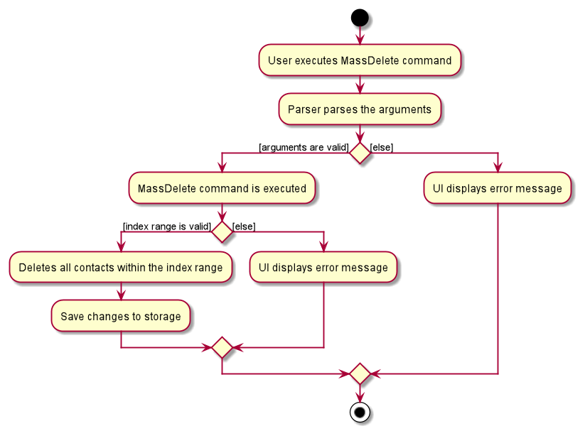

#### Design considerations:

##### Aspect: Input format
* **Alternative 1 (current choice):** Input format is `massdelete START-END`.
    * Pros: More inutitive for the user.
    * Cons: More difficult to implement as new methods will have to be written to parse the hyphen (-) symbol.

* **Alternative 2:** Input format is `massdelete start/START end/END`.
    * Pros: Easier to implement as the existing `ArgumentMultimap` and `CliSyntax` classes are
      well-suited to parse such input formats.
    * Cons: There are more prefixes for the user to remember.

### Remark feature
The Remark feature is facilitated by the classes `Remark` and `RemarkCommand`.
Below is an example usage scenario.

Step 1: The user executes `add n/John Doe...` to add a new contact. This creates a new `Person` object. By default,
the new contact is displayed as having "No remark".

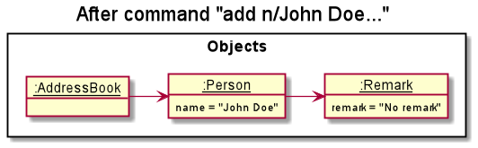

Step 2: The user now decides to add a new remark to the new contact by executing `remark 3 r/Absent`.
The `Logic` component creates a new `RemarkCommand` object for execution.

Step 4: `RemarkCommand` creates a new `Person` object which is identical to the original `Person` object in
every field except that the `Remark` of the new `Person` object have been updated.

Step 6: `RemarkCommand` calls `Model#setPerson()` to replace the original `Person` in the `AddressBook` with the new
`Person`.

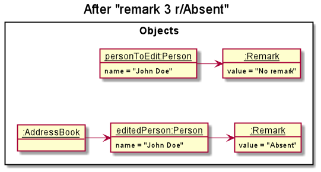

Step 7: After the `AddressBook` has been updated, the `ModelManager` class will update `filteredPersons`
to reflect the change.

The following activity diagram summarizes what happens when a user executes a remark command:
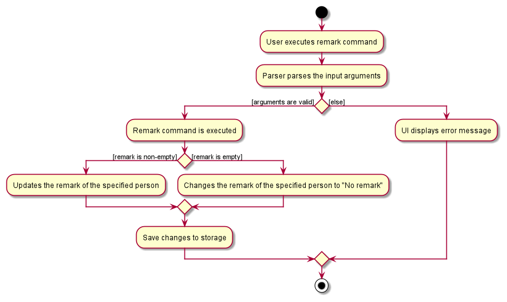

#### Design considerations:

##### Aspect: Implementation of remark
* **Alternative 1 (current choice):** Editing the `Remark` field is done in a separate command.
    * Pros: Reduces coupling and increases abstraction. Code for the `Remark` command can be reused elsewhere.
    * Cons: More commands for the user to remember.

* **Alternative 2:** Use the existing `Edit` command to edit the `Remark` field.
    * Pros: Easier to implement as the edit command already has a parser and many helper methods.
    * Cons: The edit command is already the largest class in the `commands` package. Adding more code will make the
      class even bigger and thus more difficult to maintain.

### Navigate previous commands feature

#### Implementation

The implementation of this feature is facilitated by `CommandList` class, which is a self-implemented linked list class.
Whenever a command is executed, regardless of validity, a new node containing the command will be created and added into the linked list.
The nodes in the linked list are implemented using `CommandNode` class, which keeps track of the following information:

* Command executed
* A reference to the previous `CommandNode` in the linked list.
* A reference to the next `CommandNode` in the linked list.

In addition, a `cursor` is introduced in `CommandList` class to help with navigation of the commands.
The `cursor` keeps track of the current command while users are traversing through the commands using up and down arrow keys.
Its position will be reset to the newly added `CommandNode`, which is the last node in the list, once a new command has been executed.

When the user presses the up arrow key, there are two possible scenarios:
* The `cursor` is at the first node in the list.
    * Nothing happens.
* The `cursor` is not at the first node in the list.
    * The `cursor` is moved to the previous node and a new command is retrieved.

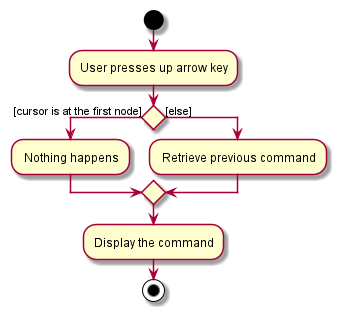

Similarly, when the user presses the down arrow key, there are two possible scenarios:
* The `cursor` is at the last node in the list.
    * Nothing happens.
* The `cursor` is not at the last node in the list.
    * The `cursor` is moved to the next node and a new command is retrieved.

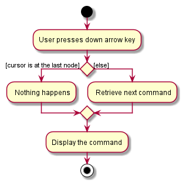

#### Design considerations:

#### Aspect: Data structure used to model the list of commands

* **Alternative 1 (Current choice)**: Use a self-implemented linked list.
    * Pros: More control on the implementation. Cursor lies on the element themselves.
    * Cons: Higher chance of errors in implementation, especially when it comes to addition of nodes.
* **Alternative 2**: Use the `LinkedList` class provided by Java.
    * Pros: Easier implementation. Most operations have been provided by Java.
    * Cons: Need to devise a workaround to traverse the commands since the `ListIterator` places the cursor in between the elements.

### Sort feature
The sort mechanism is facilitated by `SortCommand`.
Below is an example usage scenario.

Step 1: The user executes `sort ascending` to sort the contact list by name in ascending order. The
string is passed to the `Logic` component.

Step 2: The `Logic` component parses the string and creates a corresponding `SortCommand` object.

Step 3: The `SortCommand` object calls `Model#sortByName()` to sort the
internal `AddressBook`.

Step 4: After sorting, `filteredPersons` in `ModelManager` is updated to reflect the change.

The following sequence diagram illustrates how the sort operation works:

:information_source: **Note:** The lifeline for `SortCommand` should end
at the destroy marker (X) but due to a limitation of PlantUML, the lifeline reaches the end of diagram.

The following activity diagram summarizes what happens when a user executes a sort command:
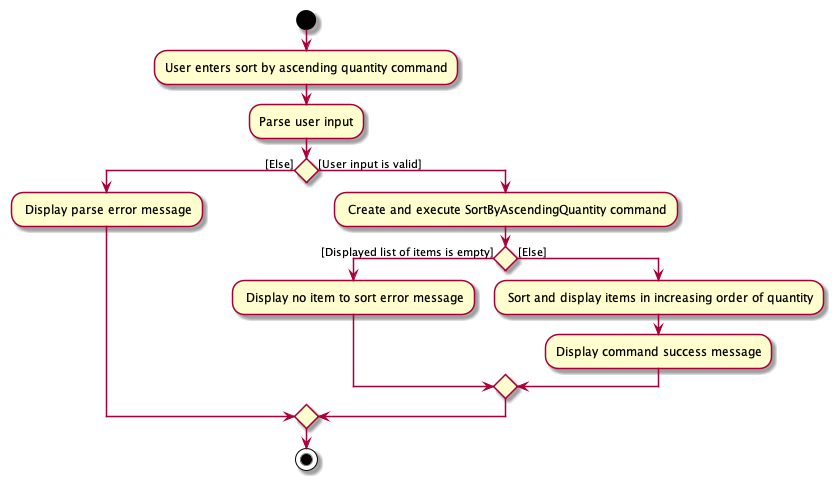

#### Design considerations:

##### Aspect: Sort input format
* **Alternative 1 (current choice):** `sort ascending` and `sort descending`
  * Pros: Easier for the user to remember
  * Cons: Difficult to extend the command to accept more parameters.

* **Alternative 2:** `sort d/ascending` and `sort d/descending`
  * Pros: This implementation makes it easier to extend the command in the future to accept more parameters. For example, `sort
    c/modeofcontact c/name d/descending` is a possible format that can be used to sort the list firstly by mode of contact then by name in
    descending order.
  * Cons: Not as user friendly as the user will have to remember more commands.

### Undo feature

#### Implementation

The undo mechanism is facilitated by `State` class. It contains a list of `AddressBookCommandPair`s, which are made up of the state of `AddressBook` and the command executed.
They are stored internally as `addressBookStates`. Additionally, it implements the following operations:

* `State#addState()` — Saves a new `AddressBookCommandPair` in its history.
* `State#deleteState()` — Deletes the last `AddressBookCommandPair` in the list. The undo operation is done by calling this method.

Given below is an example usage scenario and how the undo/redo mechanism behaves at each step.

Step 1. The user launches the application for the first time. The `State` will be initialized with the initial `AddressBookCommandPair`. Since no command is executed, the command stored in the pair will be an empty string.

Step 2. The user executes `delete 5` command to delete the 5th person in the contact list. After execution, `State#addState()` is called, causing the modified state of the contact list after the `delete 5` command executes to be saved in the `addressBookStates`.

Step 3. The user executes `add n/David …​` to add a new person. This causes another modified contact list state to be saved into the `addressBookStateList`.

:information_source: **Note:** If a command fails its execution or does not modify the contact list in anyway, it will not call `State#addState()`, so the contact list state will not be saved into the `addressBookStates`.
Examples of commands that do not modify the list include <code>find</code>, <code>list</code> etc.

Step 4. The user now decides that adding the person was a mistake, and decides to undo that action by executing the `undo` command. The `undo` command will first call `State#deletePreviousState()` to delete `pair2` and then call `model#setAddressBook` to set the contact list to be the same `AddressBook` as in `pair1`.

:information_source: **Note:** If there is only one state saved in the <code>addressBookStates</code>, then there are no previous AddressBook states to restore. The `undo` command uses `State#getPreviousState` to check if this is the case. If so, the method will return <code>null</code>
, causing the command to return an error to the user rather than attempting to perform the undo.

The following sequence diagram shows how the undo operation works:

:information_source: **Note:** The lifeline for `UndoCommand` should end at the destroy marker (X) but due to a limitation of PlantUML, the lifeline reaches the end of diagram.

The following activity diagram summarizes what happens when a user executes a new command:

#### Design considerations:

##### Aspect: How undo executes

* **Alternative 1 (current choice):** Saves the entire contact list.
    * Pros: Easy to implement.
    * Cons: May have performance issues in terms of memory usage.

* **Alternative 2:** Individual command knows how to undo/redo by
  itself.
    * Pros: Will use less memory (e.g. for `delete`, just save the person being deleted).
    * Cons: We must ensure that the implementation of each individual command are correct.
--------------------------------------------------------------------------------------------------------------------

## **Documentation, logging, testing, configuration, dev-ops**

* [Documentation guide](Documentation.md)
* [Testing guide](Testing.md)
* [Logging guide](Logging.md)
* [Configuration guide](Configuration.md)
* [DevOps guide](DevOps.md)

--------------------------------------------------------------------------------------------------------------------

## **Appendix: Requirements**

### Product scope

**Target user profile**:

* has a need to manage a significant number of contacts
* prefer desktop apps over other types
* can type fast
* prefers typing to mouse interactions
* is reasonably comfortable using CLI apps
* is an NUS Computer Science undergraduate
* works in the NUS Office of Campus Amenities communications team

**Value proposition**: OCA has a wide range of information to disseminate
to students / staff at NUS. The large number of emails to send, and the large
student / staff population may introduce errors during dissemination.
We aim to help them classify this information based on the relevant parties
and the required means of communication.

### User stories

Priorities: High (must have) - `* * *`, Medium (nice to have) - `* *`, Low (unlikely to have) - `*`

| Priority | As a …​                                 | I want to …​                                      | So that I can…​                                                      |
| -------- | ------------------------------------------ | ---------------------------------------------------- | ----------------------------------------------------------------------- |
| `* * *`  | new user                                   | see usage instructions                               | refer to instructions when I forget how to use the app                  |
| `* * *`  | user                                       | add a new contact                                    |                                                                         |
| `* * *`  | user                                       | delete a contact                                     | remove contacts that I no longer need                                   |
| `* * *`  | user                                       | list all contacts                                    | see the full list of my contacts                                        | 
| `* * *`  | user                                       | edit a contact                                       | keep my contact list up-to-date                                         |
| `* * *`  | user                                       | find contacts by keywords                            | minimize time spent to find the contacts I need                         |
| `* * *`  | user                                       | specify preferred mode of contact                    | maximize chance of recipient seeing the information                     |
| `* * *`  | user                                       | blacklist a contact                                  | reduce dissemination of information to people who do not want it        |
| `* * *`  | user                                       | undo my operations                                   | correct any recent mistakes                                             |
| `* * *`  | user                                       | collect specified details of all contacts            | reduce time spent copying details of each contact                       |
| `* *`    | user                                       | assign each contact an additional remark             | note down specific details about certain contacts                       |
| `* *`    | user                                       | sort contacts by name                                | work with the contact list more easily                                  |
| `* *`    | user                                       | delete multiple contacts at once                     | remove groups of unneeded contacts more efficiently                     |
| `* *`    | user                                       | blacklist multiple contacts at once                  | blacklist groups of contacts more efficiently                           |
| `* *`    | user                                       | review my previous commands                          | simply modify them instead of retyping the commands, especially for the commands with longer parameters list
| `* *`    | user                                       | change between light and dark mode                   | reduce the strain on my eyes                                            |
| `* *`    | user                                       | clear the entire contact list                        | start over from a new contact list                                      |

### Use cases

(For all use cases below, the **System** is `SpamEZ` and the **Actor** is the `User`, unless specified otherwise)

**Use case: UC01 - Delete a person**

**MSS**

1.  User requests to list contacts.
2.  SpamEZ shows a list of contacts.
3.  User requests to delete a specific contact in the list.
4.  SpamEZ deletes the contact.

    Use case ends.

**Extensions**

* 2a. The list is empty.

  Use case ends.

* 3a. The given index is invalid.

    * 3a1. SpamEZ shows an error message.

      Use case resumes at step 2.

**Use case: UC02 - Filter contacts by tags**

**MSS**
1. User requests to list contacts.
2. SpamEZ shows a list of contacts.
3. User requests to find the contacts using name and/or tags.
4. SpamEZ returns a filtered list of contacts.

   Use case ends.

**Extensions**
* 2a. The list is empty.

  Use case ends.

* 3a. No keywords are given or invalid syntax.
    * 3a1. SpamEZ shows an error message.

      Use case resumes at step 2.

**Use case: UC03 - Specify a preferred mode of contact for a contact**

**MSS**

1.  User requests to list contacts.
2.  SpamEZ shows a list of contacts.
3.  User requests to edit the preferred mode of contact for a contact.
4.  SpamEZ edits the contact.
    
    Use case ends.

**Extensions**

* 2a. The list is empty.

  Use case ends.

**Use case: UC04 - Blacklist a contact**

**MSS**

1. User requests to list contacts.
2. SpamEZ shows a list of contacts.
3. User requests to change the blacklist status of a specific contact
   in the list.
4. SpamEZ changes the blacklist status of the contact.

   Use case ends.

**Extensions**

* 2a. The list is empty.

  Use case ends.

* 3a. The given index is invalid.

    * 3a1. SpamEZ shows an error message.

      Use case resumes at step 2.

**Use case: UC05 - Add an optional remark to a contact**

**MSS**

1. User requests to list contacts.
2. SpamEZ shows a list of contacts.
3. User requests to add a remark to a specific contact in the list.
4. SpamEZ adds the optional remark to the specific contact.
5. SpamEZ shows the updated list of contacts.
   
   Use case ends.

**Extensions**

* 3a. The given index is invalid.

    * 3a1. SpamEZ shows an error message.
      
      Use case resumes at step 3.

* 4a. The contact already has a remark.

    * 4a1. The old remark is replaced with the new remark.

      Use case ends.

**Use case: UC06 - Sort contacts by name**

**MSS**

1. User requests to sort the contact list by name in alphabetical order.
2. SpamEZ sorts the contact list.
3. SpamEZ displays the updated contact list.
   
   Use case ends.

**Extensions**

* 1a. The contact list currently being displayed is not the full contact list. 
    * 1a1. SpamEZ will sort both the full contact list and the currently displayed contact list.
      1a2. SpamEZ displays the updated partial contact list.
      
      Use case ends.

**Use case: UC07 - Mass blacklist contacts**

**MSS**

1. User requests to list contacts.
2. SpamEZ shows a list of contacts.
3. User requests to blacklist all contacts within a certain index range.
4. SpamEZ blacklists all relevant contacts.
5. SpamEZ displays the updated contact list.

   Use case ends.

**Extensions**

* 3a. The given index is invalid.
  * 3a1. SpamEZ shows an error message.
    
    Use case resumes at step 2.

**Use case: UC08 - Mass delete contacts**

**MSS**

1. User requests to list contacts.
2. SpamEZ shows a list of contacts.  
3. User requests to delete all contacts within a certain index range.
4. SpamEZ deletes all relevant contacts.
5. SpamEZ displays the updated contact list.

   Use case ends.

**Extensions**

* 3a. The given index is invalid.
    * 3a1. SpamEZ shows an error message.
      
      Use case resumes at step 2.
  
**Use case: UC09 - Changing to light mode**

**MSS**

1. User requests to change mode of view to light mode.
2. SpamEZ changes the mode of view to light mode.

**Extensions**

* 1a. SpamEZ is already in light mode.

  Use case ends.   
    
**Use case: UC10 - Changing to dark mode**

**MSS**

1. User request to change mode of view to dark mode.
2. SpamEZ changes the mode of view to dark mode.

**Extensions**

* 1a. SpamEZ is already in dark mode.
    
  Use case ends.    

### Non-Functional Requirements

1.  Should work on any _mainstream OS_ as long as it has Java `11` or above installed.
2.  Should be able to hold up to 1000 persons without a noticeable sluggishness in performance for typical usage.
3.  A user with above average typing speed for regular English text (i.e. not code, not system admin commands) should be able to accomplish most of the tasks faster using commands than using the mouse.
4.  Every command that is accessible via the graphical user interface should be possible using only command line inputs.

### Glossary

* **Mainstream OS**: Windows, Linux, Unix, OS-X

--------------------------------------------------------------------------------------------------------------------

## **Appendix: Instructions for manual testing**

Given below are instructions to test the app manually.

:information_source: **Note:** These instructions only provide a starting point for testers to work on;
testers are expected to do more *exploratory* testing.

### Launch and shutdown

1. Initial launch

    1. Download the jar file and copy it into an empty folder.

    1. Double-click the jar file. 
       Expected: Shows the GUI with a set of sample contacts. The window size may not be optimum.

1. Saving window preferences

    1. Resize the window to an optimum size. Move the window to a different location. Close the window.

    1. Re-launch the app by double-clicking the jar file. 
       Expected: The most recent window size and location is retained.
       
### Saving data

1. Dealing with missing/corrupted data files

    1. Test case: Editing the data file to remove a name field to simulate a corrupted data file, while the app is not running. 
       Expected: Upon opening the app, there are no contacts in the GUI.

    1. Test case: Deleting the data file. 
       Expected: Upon opening the app, the default sample contacts are shown in the GUI.

### Adding a contact

1. Adding a new contact
  
    1. Test case : `add n/John Doe p/98765432 e/johnd@example.com a/311, Clementi Ave 2, #02-25 m/email t/friends t/owesMoney` 
       Expected: New contact `John Doe`is added to the contact list.
  
    1. Test case: `add n/John Doe` 
       Expected: No contact is added. Error details are shown in the status message.

### Blacklisting or un-blacklisting a contact

1. Blacklisting or un-blacklisting a contact while some contacts are being shown

    1. Prerequisites: List some contacts using the `list` or `find` commands. At least 1 contact in the list.
    
    1. Test case: `blist 1` 
       Expected: The blacklist status of the first contact is changed (from blacklisted to un-blacklisted or vice versa).
       Details of the updated contact are shown in the status message.
   
    1. Test case: `blist 0` 
       Expected: No contact is edited. Error details are shown in the status message.
   
    1. Other incorrect blacklist commands to try: `blist`, `blist x`, `...` (where x is larger than the list size). 
       Expected: Similar to previous.

### Blacklisting or un-blacklisting multiple contacts

1. Blacklisting or un-blacklisting multiple contacts while some contacts are being shown

    1. Prerequisites: List some contacts using the `list` or `find` commands. At least 2 contacts in the list.
   
    1. Test case: `massblist 1-2 b/blacklist` 
       Expected: The first and second contact in the list will be blacklisted. If the contact is already 
       blacklisted, then there will be no change to the contact.

    1. Test case: `massblist 0-2 b/unblacklist` 
       Expected: No change in the address book. Error details shown in status message.
      
    1. Other incorrect massblacklist commands to try: `massblist`, `massblist 3-4`  
       Expected: Similar to previous.

### Changing to dark mode

1. Change the mode of view to dark mode
  
    1. Test case : `dark` 
       Expected: Mode of view is now in dark mode.
  
    1. Test case : `dark 1234 ` 
       Expected: Mode of view is now in dark mode.
  
    1. Other dark commands to try: `dark light`, `dark delete 1`, `...`(any additional input after dark). 
       Expected: Similar to previous.

### Changing to light mode

1. Change the mode of view to light mode
  
    1. Test case : `light` 
       Expected: Mode of view is now in light mode.
  
    1. Test case : `light 1234 ` 
       Expected: Mode of view is now in light mode.
  
    1. Other light commands to try: `light dark`, `light delete 1`, `...`(any additional input after light). 
       Expected: Similar to previous.

### Collecting details from all listed contacts

1. Collecting details while some contacts are being shown

    1. Prerequisites: List some contacts using the `list` or `find` commands. At least 1 contact in the list.

    1. Test case: `collect e/` 
       Expected: Emails of all the contacts in the list are collected, separated by `;`.
       The result is shown in the status message.

    1. Test case: `collect e/ s/,` 
       Expected: Emails of all the contacts in the list are collected, separated by `,`.
       The result is shown in the status message.

    1. Test case: `collect` 
       Expected: No details are collected. Error details are shown in the status message.

    1. Other incorrect collect commands to try: `collect m/`, `collect n/ e/`, `...` (trying to collect multiple types of details at once). 
       Expected: Similar to previous.

### Deleting a contact

1. Deleting a contact while all contacts are being shown

    1. Prerequisites: List some contacts using the `list` or `find` commands. At least 1 contact in the list.

    1. Test case: `delete 1` 
       Expected: First contact is deleted from the list. Details of the deleted contact are shown in the status message.

    1. Test case: `delete 0` 
       Expected: No contact is deleted. Error details are shown in the status message.

    1. Other incorrect delete commands to try: `delete`, `delete x`, `...` (where x is larger than the list size) 
       Expected: Similar to previous.

### Deleting multiple contacts

1. Deleting multiple contacts while some contacts are being shown

    1. Prerequisites: List some contacts using the `list` or `find` commands. At least 2 contacts in the list.

    1. Test case: `massdelete 1-2`  
       Expected: The first and second contact in the list will be deleted.

    1. Test case: `massdelete 0-3`  
       Expected: No change in the address book. Error details shown in status message.

    1. Other incorrect massdelete commands to try: `massdelete`, `massdelete 3-`  
       Expected: Similar to previous.

### Editing remark for a contact

1. Editing the remark for a contact while some contacts are being shown

    1. Prerequisites: List some contacts using the `list` or `find` commands. At least 1 contact in the list.
  
    1. Test case: `remark 1 r/Absent` 
       Expected: The remark of the first contact in the list will be changed to 'Absent'. If the contact has an existing
       remark, the old remark will be replaced with the new remark.
  
    1. Test case: `remark 2` 
       Expected: No contact is edited. Error details are shown in the status message.
  
    1. Other incorrect remark commands to try: `remark`, `remark x`, `...` (where x is larger than the list size) 
       Expected: Similar to previous.

### Finding contacts

1. Finding contacts with details matching the keywords provided

    1. Prerequisites: List all contacts using the `list` command. Multiple contacts in the list.
  
    1. Test case: `find n/Alex Bernice`  
       Expected: A list of contacts whose name contains `Alex` **or** `Bernice`. The filter is case-insensitive, so `Alex` will match with `aLeX` too, for instance.
  
    1. Test case: `find t/friends NEIGHBOUR`  
       Expected: A list of contacts whose tags contain `friends` **or** `NEIGHBOUR`.
  
    1. Test case: `find n/Alex Bernice t/friends neighbour`  
       Expected: A list of contacts whose name contains `Alex` or `Bernice` **and** tags contains `friends` or `neighbour`.
  
    1. Test case: `find`  
       Expected: No filtering is done, and the original list is presented. Error details shown in the status message.
  
    1. Other incorrect find commands to try: `find n/`, `find t/`, `...`  
       Expected: Similar to previous.

### Navigating through commands

1. Navigating to previous commands

    1. Test case: Execute `light`, `edit 1 n/Alex`, `find n/Alex` in this order and press up arrow key three times.  
       Expected: The commands above are shown in the command box in the reverse order, i.e. `find n/Alex`, `edit 1 n/Alex` and finally `light`.

1. Navigating to later commands
    
    1. Prerequisites: Perform test case 1.i.
  
    1. Test case: Press down arrow key. 
       Expected: The command `edit 1 n/Alex` is shown.
  
    1. Test case: Press down arrow key again. 
       Expected: The command `find n/Alex` is shown.
  
    1. Test case: Press down arrow key again. 
       Expected: The command `find n/Alex` is shown again since this is the last command executed.

1. Attempting to navigate through commands when there are no commands executed

    1. Test case: Press up arrow key. 
       Expected: Nothing is shown in the command box.
  
    1. Test case: Press down arrow key. 
       Expected: Similar to previous.

1. Attempting to navigate to later commands after executing a command

    1. Test case: Execute any command and press down arrow key. 
       Expected: Nothing is shown in the command box.

### Sorting entries by name

1. Sorting the contact list
  
    1. Test case: `sort ascending` 
       Expected: The entire contact list will be sorted by name in ascending alphabetical order. If only a
       partial list is currently being displayed, the partial list will also be sorted and displayed.
  
    1. Test case: `sort` 
       Expected: No change in the address book. Error details are shown in the status message.
  
    1. Other incorrect sort commands to try: `sort 121`, `sort ascending ascending`  
       Expected: Similar to previous.

### Undoing previous operations

1. Undoing previous operations

   1. Prerequisites: List all persons using the `list` command. Multiple contacts in the list.
      
   1. Test case: Execute `add n/Andy p/81234567 e/andy@example.com a/somewhere over the rainbow, Singapore 069420 m/email` followed by `undo`.  
      Expected: `Andy` is no longer in the contact list after `undo` is executed. Command that is undone is shown in the status message.
      
   1. Test case: Execute `blacklist 2`, `find b/true` and `undo` in this order. 
      Expected: The second contact in the list is no longer blacklisted. Command that is undone (i.e. `blacklist 2`) is shown in the status message.

1. Attempting to undo when no changes were done to the contact list 

   1. Prerequisites: No commands have been executed before executing the following test cases.
   
   1. Test case: `undo` 
      Expected: An error stating there is nothing to undo is shown in the status message.
      
   1. Test case: execute `light` and `undo` in this order. 
      Expected: Similar to previous.
