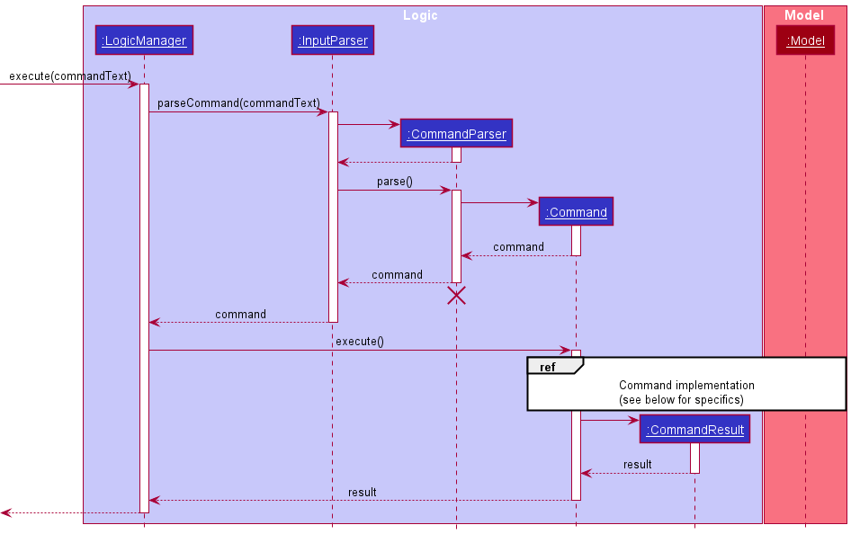
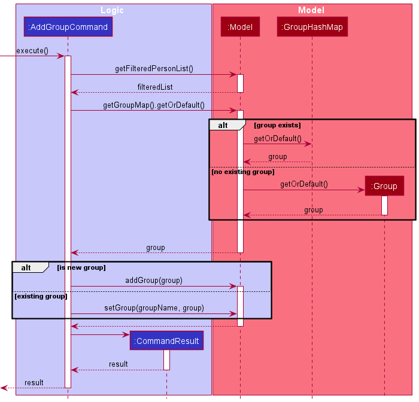

* Table of Contents
{:toc}

--------------------------------------------------------------------------------------------------------------------

## **Setting up, getting started**

Refer to the guide [_Setting up and getting started_](SettingUp.md).

--------------------------------------------------------------------------------------------------------------------

## **Design**

### Architecture

The ***Architecture Diagram*** given above explains the high-level design of the App. Given below is a quick overview of
each component.

:bulb: **Tip:** The `.puml` files used to create diagrams in this document can be found in
the [diagrams](https://github.com/AY2021S2-CS2103T-W14-1/tp/blob/master/docs/diagrams/) folder. Refer to the [_PlantUML
Tutorial_ at se-edu/guides](https://se-education.org/guides/tutorials/plantUml.html) to learn how to create and edit
diagrams.

**`Main`** has two classes
called [`Main`](https://github.com/AY2021S2-CS2103T-W14-1/tp/blob/master/src/main/java/seedu/address/Main.java)
and [`MainApp`](https://github.com/AY2021S2-CS2103T-W14-1/tp/blob/master/src/main/java/seedu/address/MainApp.java). It
is responsible for,

* At app launch: Initializes the components in the correct sequence, and connects them up with each other.
* At shut down: Shuts down the components and invokes cleanup methods where necessary.

[**`Commons`**](#common-classes) represents a collection of classes used by multiple other components.

The rest of the App consists of four components.

* [**`UI`**](#ui-component): The UI of the App.
* [**`Logic`**](#logic-component): The command executor.
* [**`Model`**](#model-component): Holds the data of the App in memory.
* [**`Storage`**](#storage-component): Reads data from, and writes data to, the hard disk.

Each of the four components,

* defines its *API* in an `interface` with the same name as the Component.
* exposes its functionality using a concrete `{Component Name}Manager` class (which implements the corresponding
  API `interface` mentioned in the previous point.

For example, the `Logic` component (see the class diagram given below) defines its API in the `Logic.java` interface and
exposes its functionality using the `LogicManager.java` class which implements the `Logic` interface.

**How the architecture components interact with each other**

The *Sequence Diagram* below shows how the components interact with each other for the scenario where the user issues
the command `delete 1`.

The sections below give more details of each component.

### UI component

**API** :
[`Ui.java`](https://github.com/AY2021S2-CS2103T-W14-1/tp/blob/master/src/main/java/seedu/address/ui/Ui.java)

The UI consists of a `MainWindow` that is made up of parts e.g.`CommandBox`, `ResultDisplay`, `PersonListPanel`
, `StatusBarFooter` etc. All these, including the `MainWindow`, inherit from the abstract `UiPart` class.

The `UI` component uses JavaFx UI framework. The layout of these UI parts are defined in matching `.fxml` files that are
in the `src/main/resources/view` folder. For example, the layout of
the [`MainWindow`](https://github.com/AY2021S2-CS2103T-W14-1/tp/blob/master/src/main/java/seedu/address/ui/MainWindow.java)
is specified
in [`MainWindow.fxml`](https://github.com/AY2021S2-CS2103T-W14-1/tp/blob/master/src/main/resources/view/MainWindow.fxml)

The `UI` component,

* Executes user commands using the `Logic` component.
* Listens for changes to `Model` data so that the UI can be updated with the modified data.

### Logic component

**API** :
[`Logic.java`](https://github.com/AY2021S2-CS2103T-W14-1/tp/blob/master/src/main/java/seedu/address/logic/Logic.java)

1. `Logic` uses the `AddressBookParser` class to parse the user command.
1. This results in a `Command` object which is executed by the `LogicManager`.
1. The command execution can affect the `Model` (e.g. adding a person).
1. The result of the command execution is encapsulated as a `CommandResult` object which is passed back to the `Ui`.
1. In addition, the `CommandResult` object can also instruct the `Ui` to perform certain actions, such as displaying
   help to the user.

Given below is the Sequence Diagram for interactions within the `Logic` component for a typical Command.

:information_source: **Note:** The lifeline for `CommandParser` should end at the destroy marker (X) but due to a limitation of PlantUML, the lifeline reaches the end of diagram.

#### Command Implementations
The diagram below further explains the implementation of individual commands.
1. AddGroup Command

### Model component

**
API** : [`Model.java`](https://github.com/AY2021S2-CS2103T-W14-1/tp/blob/master/src/main/java/seedu/address/model/Model.java)

The `Model`,

* stores a `UserPref` object that represents the user’s preferences.
* stores the address book data.
* exposes an unmodifiable `ObservableList<Person>` that can be 'observed' e.g. the UI can be bound to this list so that
  the UI automatically updates when the data in the list change.
* does not depend on any of the other three components.

### Storage component

**
API** : [`Storage.java`](https://github.com/AY2021S2-CS2103T-W14-1/tp/blob/master/src/main/java/seedu/address/storage/Storage.java)

The `Storage` component,

* can save `UserPref` objects in json format and read it back.
* can save the address book data in json format and read it back.

### Common classes

Classes used by multiple components are in the `seedu.addressbook.commons` package.

--------------------------------------------------------------------------------------------------------------------

## **Implementation**

This section describes some noteworthy details on how certain features are implemented.

### \[Proposed\] Undo/redo feature

#### Proposed Implementation

The proposed undo/redo mechanism is facilitated by `VersionedAddressBook`. It extends `AddressBook` with an undo/redo
history, stored internally as an `addressBookStateList` and `currentStatePointer`. Additionally, it implements the
following operations:

* `VersionedAddressBook#commit()` — Saves the current address book state in its history.
* `VersionedAddressBook#undo()` — Restores the previous address book state from its history.
* `VersionedAddressBook#redo()` — Restores a previously undone address book state from its history.

These operations are exposed in the `Model` interface as `Model#commitAddressBook()`, `Model#undoAddressBook()`
and `Model#redoAddressBook()` respectively.

Given below is an example usage scenario and how the undo/redo mechanism behaves at each step.

Step 1. The user launches the application for the first time. The `VersionedAddressBook` will be initialized with the
initial address book state, and the `currentStatePointer` pointing to that single address book state.

Step 2. The user executes `delete 5` command to delete the 5th person in the address book. The `delete` command
calls `Model#commitAddressBook()`, causing the modified state of the address book after the `delete 5` command executes
to be saved in the `addressBookStateList`, and the `currentStatePointer` is shifted to the newly inserted address book
state.

Step 3. The user executes `add n/David …​` to add a new person. The `add` command also calls `Model#commitAddressBook()`
, causing another modified address book state to be saved into the `addressBookStateList`.

:information_source: **Note:** If a command fails its execution, it will not call `Model#commitAddressBook()`, so the address book state will not be saved into the `addressBookStateList`.

Step 4. The user now decides that adding the person was a mistake, and decides to undo that action by executing
the `undo` command. The `undo` command will call `Model#undoAddressBook()`, which will shift the `currentStatePointer`
once to the left, pointing it to the previous address book state, and restores the address book to that state.

:information_source: **Note:** If the `currentStatePointer` is at index 0, pointing to the initial AddressBook state, then there are no previous AddressBook states to restore. The `undo` command uses `Model#canUndoAddressBook()` to check if this is the case. If so, it will return an error to the user rather
than attempting to perform the undo.

The following sequence diagram shows how the undo operation works:

:information_source: **Note:** The lifeline for `UndoCommand` should end at the destroy marker (X) but due to a limitation of PlantUML, the lifeline reaches the end of diagram.

The `redo` command does the opposite — it calls `Model#redoAddressBook()`, which shifts the `currentStatePointer` once
to the right, pointing to the previously undone state, and restores the address book to that state.

:information_source: **Note:** If the `currentStatePointer` is at index `addressBookStateList.size() - 1`, pointing to the latest address book state, then there are no undone AddressBook states to restore. The `redo` command uses `Model#canRedoAddressBook()` to check if this is the case. If so, it will return an error to the user rather than attempting to perform the redo.

Step 5. The user then decides to execute the command `list`. Commands that do not modify the address book, such
as `list`, will usually not call `Model#commitAddressBook()`, `Model#undoAddressBook()` or `Model#redoAddressBook()`.
Thus, the `addressBookStateList` remains unchanged.

Step 6. The user executes `clear`, which calls `Model#commitAddressBook()`. Since the `currentStatePointer` is not
pointing at the end of the `addressBookStateList`, all address book states after the `currentStatePointer` will be
purged. Reason: It no longer makes sense to redo the `add n/David …​` command. This is the behavior that most modern
desktop applications follow.

The following activity diagram summarizes what happens when a user executes a new command:

#### Design consideration:

##### Aspect: How undo & redo executes

* **Alternative 1 (current choice):** Saves the entire address book.
    * Pros: Easy to implement.
    * Cons: May have performance issues in terms of memory usage.

* **Alternative 2:** Individual command knows how to undo/redo by itself.
    * Pros: Will use less memory (e.g. for `delete`, just save the person being deleted).
    * Cons: We must ensure that the implementation of each individual command are correct.

_{more aspects and alternatives to be added}_

### \[Proposed\] Data archiving

_{Explain here how the data archiving feature will be implemented}_

--------------------------------------------------------------------------------------------------------------------

## **Documentation, logging, testing, configuration, dev-ops**

* [Documentation guide](Documentation.md)
* [Testing guide](Testing.md)
* [Logging guide](Logging.md)
* [Configuration guide](Configuration.md)
* [DevOps guide](DevOps.md)

--------------------------------------------------------------------------------------------------------------------

## **Appendix: Requirements**

### Product scope

**Target user profile**:

* is a young programmer studying in NUS Computer Science
* prefers typing to mouse interactions
* has difficulty maintaining personal relationships
* cannot recall previous conversations with others
* is a goal-driven individual and seeks new challenges.

**Value proposition**:

* makes relationship management easier for the user
    * keeps track of personal relationship with users' friends
* manages relationship faster than a mouse-driven app.

### User stories

| Category            | As a/an...         | I can...                                                                               | So that...                                                          |
|---------------------|--------------------|----------------------------------------------------------------------------------------|---------------------------------------------------------------------|
| Birthdays           | Forgetful User     | Add a birthday to a contact                                                            | I can remember when that person's birthday is                       |
|                     |                    |                                                                                        |                                                                     |
| Grouping/tagging    | Forgetful User     | Tags to identify people with the same name                                             | I can easily differentiate between friends who has the same name.   |
| Grouping/tagging    | Orderly User       | Create new friend groups                                                               | Customize my own categories of friends                              |
| Grouping/tagging    | Orderly User       | Group my contacts by categories                                                        | I easily check contacts in a certain category                       |
|                     |                    |                                                                                        |                                                                     |
| Friend details      | Forgetful User     | Track how much debt is owed by/to the person                                           | I can get my money back or pay the money back.                      |
| Friend details      | User               | Store dietary habits/allergies on the contact                                          | I don't accidentally kill him when buying food for him              |
|                     |                    |                                                                                        |                                                                     |
| Customized UI       | User               | Choose between light/dark mode for the app                                             | It fits the aesthetics of my comptuer                               |
| Customized UI       | Artsy User         | Customize the way the application looks                                                | It matches the aesthetics of my computer                            |
|                     |                    |                                                                                        |                                                                     |
| User Guide          | New User           | Easily access the user guide                                                           | I can understand how the app works easily                           |
| User Guide          | New User           | Search for frequently asked question in the application                                | I can find help easily                                              |
|                     |                    |                                                                                        |                                                                     |
| Reminders           | Forgetful User     | Add reminders for special dates                                                        | I can remember my anniversary                                       |
|                     |                    |                                                                                        |                                                                     |
| Notes               | Forgetful User     | Takes notes on specific user                                                           | I can remember certain things                                       |
|                     |                    |                                                                                        |                                                                     |
| Calendar            | Visual User        | Have a calendar view of birthdays for the month                                        | I can plan my timetable ahead                                       |
| Calendar            | New User           | See who are the friends I have not met in a long time                                  | I am reminded to meet them soon                                     |
|                     |                    |                                                                                        |                                                                     |
| UX                  | Expert User        | Perform most tasks with a single command                                               | I can save time                                                     |
| UX                  | Non-Technical User | Have the option to use the mouse                                                       | I will not be overwhelmed by the CLI                                |
| UX                  | New User           | Easily undo previous commands                                                          | I do not have to be afraid of making mistakes                       |
|                     |                    |                                                                                        |                                                                     |
| Storage/backup/data | Tech-Savvy User    | Export/import information from the application                                         | I can back up the data                                              |
| Storage/backup/data | Tech-Savvy User    | Detect conflicts when importing information                                            | I can detect if there are any changes to the after exporting        |
|                     |                    |                                                                                        |                                                                     |
| Search              | Forgetful User     | See suggested commands as i type in the command bar                                    | I do not have to memorise all commands                              |
| Search              | Tech-Savvy User    | Search for contacts via regex                                                          | I can find contacts easily                                          |
| Search              | User               | Search for my contacts by name                                                         | I can find contacts easily                                          |
| Search              | Intermediate User  | Sort search result on different things                                                 | I can find whatever I'm looking for easily                          |
| Search              | Experienced User   | Write SQL like statements to search for things                                         | I can have full control over search                                 |
|                     |                    |                                                                                        |                                                                     |
| Profile             | Forgetful User     | Add a profile picture to the contact                                                   | I can remember how they look like                                   |
|                     |                    |                                                                                        |                                                                     |
| Relationship management   | Good friend        | Set a desired frequency for meeting each contact                                       | I am reminded to meet my friends either weekly, monthly, yearly etc |
| Relationship management   | Forgetful friend   | Be reminded of who i should meet soon                                                  |                                                                     |
| Relationship management   | Friend             | See upcoming dates (birthdays/special dates/due-to-meet)                               |                                                                     |
|                     |                    |                                                                                        |                                                                     |
| Dashboard           | User               | See upcoming birthdays at a glance                                                     | I know what to expect in the week to come                           |
| Dashboard           | User               | See upcoming events at a glance                                                        |                                                                     |
| Dashboard           | User               | See goals that will reach deadline                                                     |                                                                     |
| Dashboard           | Friend             | See which friends I have to meet soon                                                  |                                                                     |
|                     |                    |                                                                                        |                                                                     |
| Friendship Journal  | User               | Record brief summary of last meeting with the other person (include last meeting date) | I know why we last met.                                             |

### Use cases

(For all use cases below, the **System** is the `FriendDex` and the **Actor** is the `user`, unless specified otherwise)

**Use case: Add profile picture to person**

**MSS**

1. User requests to list persons.
2. FriendDex shows a list of persons.
3. User requests to add a picture to a person in the list.
4. FriendDex attaches a picture to the person.

   Use case ends.

**Extensions**

* 2a. The list is empty.

  Use case ends.

* 3a. User supplies an invalid file location to FriendDex

    * 3a1. FriendDex shows an error message of the error.

      Use case resumes at step 2.

* 3b. User supplies a valid file location but wrong file format

    * 3b1. FriendDex shows an error message of the error.

      Use case resumes at step 2.

**Use case: Add birthday to a person**

**MSS**

1. User requests to list persons
2. FriendDex shows a list of persons
3. User requests to add a birthday to a specific person in the list
4. FriendDex stores the birthday information for the person

   Use case ends

**Extensions**

* 2a. The list is empty

  Use case ends

* 3a. The given date is invalid

    * 3a1. FriendDex shows an error message, and the accepted date format(s)

      Use case ends

**Use case: Create a friend group**

**MSS**

1. User requests to list persons
2. FriendDex shows a list of persons
3. User requests to add a group of friends to a new friend group.
4. FriendDex creates the friend group and adds the group of friends to the friend group.

   Use case ends

**Extensions**

* 3a. The friend group is already existing.

    * 3a1. FriendDex will add the indicated group to the existing group.

      Use case ends

* 4a. Some indicated users already exist in the friend group

    * 4a1. FriendDex will indicate the contacts that already exist in the friend group.

      Use case ends

**Use case: Edit a person**

**MSS**

1. User requests to list persons.
2. FriendDex shows a list of persons.
3. User requests to edit a specific person in the list.
4. FriendDex stores the edited information.

   Use case ends

**Extensions**

* 2a. The list is empty.

  Use case ends

* 3a. The new details supplied contain formatting errors.

    * 3a1. FriendDex shows an error message and displays the correct format for the command.

      Use case ends

* 3b. A supplied Date field is in an invalid format.

    * 3b1. FriendDex shows an error message and displays the accepted date formats.

      Use case ends

### Non-Functional Requirements

1. Should work on any mainstream OS as long as it has Java 11 or above installed.
2. The application should be able to support up to 1000 contacts.
3. The system should respond within two seconds.
4. The application should be portable (The user should be able to copy content over to another computer using some
   storage medium and still be able to work).
5. Should work on most mainstream keyboards (works without numpad/touchbar etc).

### Glossary

* **Mainstream OS**: Windows, Linux, Unix, OS-X

-------------------------------------------------------------------------------------

## **Appendix: Instructions for manual testing**

Given below are instructions to test the app manually.

:information_source: **Note:** These instructions only provide a starting point for testers to work on;
testers are expected to do more *exploratory* testing.

### Launch and shutdown

1. Initial launch

    1. Download the jar file and copy into an empty folder

    1. Double-click the jar file Expected: Shows the GUI with a set of sample contacts. The window size may not be
       optimum.

1. Saving window preferences

    1. Resize the window to an optimum size. Move the window to a different location. Close the window.

    1. Re-launch the app by double-clicking the jar file. 
       Expected: The most recent window size and location is retained.

1. _{ more test cases …​ }_

### Deleting a person

1. Deleting a person while all persons are being shown

    1. Prerequisites: List all persons using the `list` command. Multiple persons in the list.

    1. Test case: `delete 1` 
       Expected: First contact is deleted from the list. Details of the deleted contact shown in the status message.
       Timestamp in the status bar is updated.

    1. Test case: `delete 0` 
       Expected: No person is deleted. Error details shown in the status message. Status bar remains the same.

    1. Other incorrect delete commands to try: `delete`, `delete x`, `...` (where x is larger than the list size) 
       Expected: Similar to previous.

1. _{ more test cases …​ }_

### Saving data

1. Dealing with missing/corrupted data files

    1. _{explain how to simulate a missing/corrupted file, and the expected behavior}_

1. _{ more test cases …​ }_
