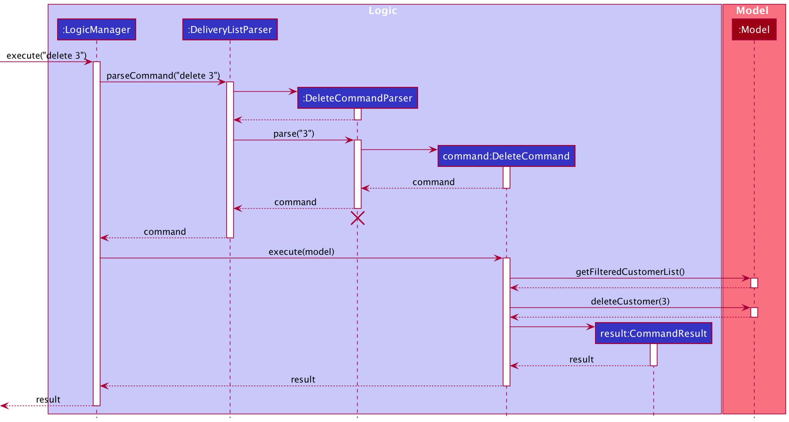
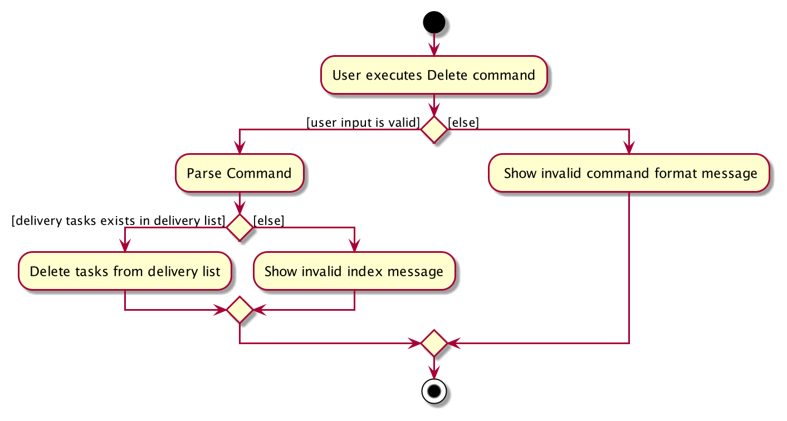
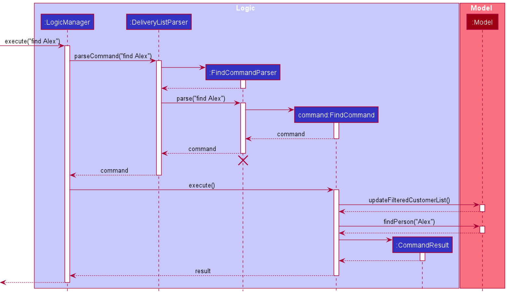
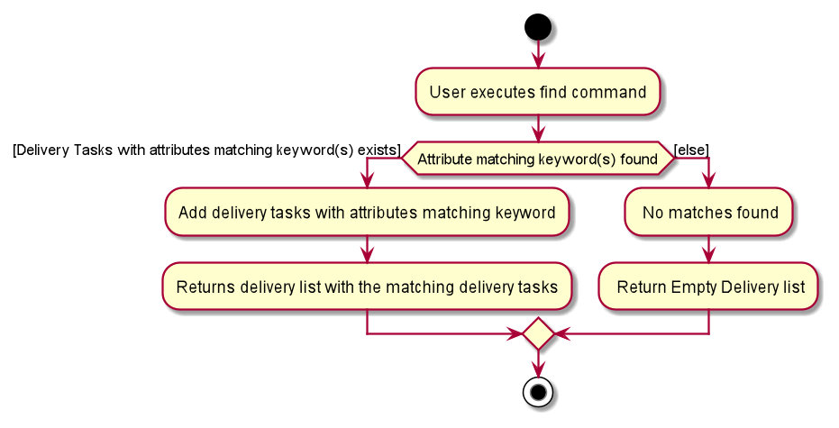

* Table of Contents
{:toc}

--------------------------------------------------------------------------------------------------------------------

## **Setting up, getting started**

Refer to the guide [_Setting up and getting started_](SettingUp.md).

--------------------------------------------------------------------------------------------------------------------

## **Design**

### Architecture

The ***Architecture Diagram*** given above explains the high-level design of the App. Given below is a quick overview of each component.

:bulb: **Tip:** The `.puml` files used to create diagrams in this document can be found in the [diagrams](https://github.com/se-edu/addressbook-level3/tree/master/docs/diagrams/) folder. Refer to the [_PlantUML Tutorial_ at se-edu/guides](https://se-education.org/guides/tutorials/plantUml.html) to learn how to create and edit diagrams.

**`Main`** has two classes called [`Main`](https://github.com/AY2021S2-CS2103T-W10-3/tp/blob/master/src/main/java/seedu/timeforwheels/Main.java) and [`MainApp`](https://github.com/AY2021S2-CS2103T-W10-3/tp/blob/master/src/main/java/seedu/timeforwheels/MainApp.java). It is responsible for,
* At app launch: Initializes the components in the correct sequence, and connects them up with each other.
* At shut down: Shuts down the components and invokes cleanup methods where necessary.

[**`Commons`**](#common-classes) represents a collection of classes used by multiple other components.

The rest of the App consists of four components.

* [**`UI`**](#ui-component): The UI of the App.
* [**`Logic`**](#logic-component): The command executor.
* [**`Model`**](#model-component): Holds the data of the App in memory.
* [**`Storage`**](#storage-component): Reads data from, and writes data to, the hard disk.

Each of the four components,

* defines its *API* in an `interface` with the same name as the Component.
* exposes its functionality using a concrete `{Component Name}Manager` class (which implements the corresponding API `interface` mentioned in the previous point.

For example, the `Logic` component (see the class diagram given below) defines its API in the `Logic.java` interface and exposes its functionality using the `LogicManager.java` class which implements the `Logic` interface.

**How the architecture components interact with each other**

The *Sequence Diagram* below shows how the components interact with each other for the scenario where the user issues the command `delete 1`.

The sections below give more details of each component.

### UI component

**API** :
[`Ui.java`](https://github.com/AY2021S2-CS2103T-W10-3/tp/blob/master/src/main/java/seedu/timeforwheels/ui/Ui.java)

The UI consists of a `MainWindow` that is made up of parts e.g.`CommandBox`, `ResultDisplay`, `PersonListPanel`, `StatusBarFooter` etc. All these, including the `MainWindow`, inherit from the abstract `UiPart` class.

The `UI` component uses JavaFx UI framework. The layout of these UI parts are defined in matching `.fxml` files that are in the `src/main/resources/view` folder. For example, the layout of the [`MainWindow`](https://github.com/AY2021S2-CS2103T-W10-3/tp/blob/master/src/main/java/seedu/timeforwheels/ui/MainWindow.java) is specified in [`MainWindow.fxml`](https://github.com/AY2021S2-CS2103T-W10-3/tp/blob/master/src/main/resources/view/MainWindow.fxml)

The `UI` component,

* Executes user commands using the `Logic` component.
* Listens for changes to `Model` data so that the UI can be updated with the modified data.

### Logic component

**API** :
[`Logic.java`](https://github.com/AY2021S2-CS2103T-W10-3/tp/blob/master/src/main/java/seedu/timeforwheels/logic/Logic.java)

1. `Logic` uses the `TimeforWheelsParser` class to parse the user command.
1. This results in a `Command` object which is executed by the `LogicManager`.
1. The command execution can affect the `Model` (e.g. adding a customer).
1. The result of the command execution is encapsulated as a `CommandResult` object which is passed back to the `Ui`.
1. In addition, the `CommandResult` object can also instruct the `Ui` to perform certain actions, such as displaying help to the user.

Given below is the Sequence Diagram for interactions within the `Logic` component for the `execute("delete 1")` API call.

:information_source: **Note:** The lifeline for `DeleteCommandParser` should end at the destroy marker (X) but due to a limitation of PlantUML, the lifeline reaches the end of diagram.

### Model component

**API** : [`Model.java`](https://github.com/AY2021S2-CS2103T-W10-3/tp/blob/master/src/main/java/seedu/timeforwheels/model/Model.java)

The `Model`,

* stores a `UserPref` object that represents the user’s preferences.
* stores the address book data.
* exposes an unmodifiable `ObservableList<Person>` that can be 'observed' e.g. the UI can be bound to this list so that the UI automatically updates when the data in the list change.
* does not depend on any of the other three components.

:information_source: **Note:** An alternative (arguably, a more OOP) model is given below. It has a `Tag` list in the `AddressBook`, which `Person` references. This allows `AddressBook` to only require one `Tag` object per unique `Tag`, instead of each `Person` needing their own `Tag` object. 

### Storage component

**API** : [`Storage.java`](https://github.com/se-edu/addressbook-level3/tree/master/src/main/java/seedu/address/storage/Storage.java)

The `Storage` component,
* can save `UserPref` objects in json format and read it back.
* can save the address book data in json format and read it back.

### Common classes

Classes used by multiple components are in the `seedu.timeforwheels.commons` package.

--------------------------------------------------------------------------------------------------------------------

## **Implementation**

This section describes some noteworthy details on how certain features are implemented.

### Delete Feature `delete`

The delete feature allows drivers to delete a delivery task from the delivery list by using the index in the displayed list.

Implementation 
The Sequence Diagram below shows how the components interact when a user enters `delete 3` to delete a delivery tasks with task number 3 in the delivery list:

**Description:**

When the user keys in the input 'delete 3', execute method of LogicManager is called with the input as the parameter.
In the method, LogicManager calls the parseCommand method of DeliveryListParser to parse the user input.
The DeliveryListParser parses the input and identifies it as a DeleteCommand and instantiates a DeleteCommandParser object.
DeliveryListParser then invokes the parse method of the DeleteCommandParser object to further parse the arguments provided.
In the parse method, the DeleteCommandParser ensures that the input is of the correct format and identifies the input for the index of the item to be deleted.
If the index specified by the user is valid, a new DeleteCommand instance will be created and returned to LogicManager via DeliveryListParser.
The LogicManager will then invoke the overridden execute method of the DeleteCommand object with Model as the argument.
Subsequently, the DeleteCommand object will invoke deleteCustomer method of Model with the index of the customer to delete as the argument. It will then return a CommandResult object to LogicManager.
This CommandResult will be returned at the end by LogicManager.

The following Activity Diagram summarizes what happens when a user executes the delete command:

**Design consideration**:

**Aspect: How `Delete` delivery task executes**

**Alternative 1 (current choice)**: Delete delivery task based on the index number shown on the delivery list.

**Pros:** User can ensure that the correct delivery tasks is deleted as index number is unique to each delivery task

**Cons:** User is required to look through the list first to find the index of the delivery tasks they wish to delete

**Alternative 2:** Delete delivery task using name

**Pros**: User may no longer need to look through the delivery list to find the index number of the task they wish to delete

**Cons:** If there are duplicates in the name, the wrong delivery task might get deleted. Furthemore, the User has to type a longer command text if the name is long.

Hence, Alternative 1 was chosen because it is less likely to be buggy when in production even though for a larger delivery list, the user may dislike deleting delivery task based on index

### Edit Feature `edit`

The edit feature allows drivers to edit the name, address, email, tag and date of a delivery task from the delivery list using the index/task number of the delivery task

Implementation 
The Sequence Diagram below shows how the components interact when a user enters `edit 1 n/Jacob` to change the name of the first delivery task in the delivery list:

**Description:**

When the user keys in the input 'edit 1 n/Jacob', execute method of LogicManager is called with the input as the parameter.
In the method, LogicManager calls the parseCommand method of DeliveryListParser to parse the user input.
The DeliveryListParser parses the input and identifies it as a EditCommand and instantiates a EditCommandParser object.
DeliveryListParser then invokes the parse method of the EditCommandParser object to further parse the arguments provided.
In the parse method, the EditCommandParser ensures that the input is of the correct format and identifies the index of the item to be edited.
If both the index and attributes specified by the user is valid, a new EditCommand instance will be created and returned to LogicManager via DeliveryListParser.
The LogicManager will then invoke the overridden execute method of the EditCommand object with Model as the argument.
EditCommand calls the getFilteredCustomerList method of Model to get the customer list. It also calls the createEditedCustomer method to create an edited customer
Using the index attribute of the EditCommand object, the customer to be edited from the customer list is retrieved and set to the edited customer.
Then, EditCommand will create a CommandResult object and return it to LogicManager.
This CommandResult will be returned at the end by LogicManager.

The following Activity Diagram summarizes what happens when a user executes the delete command:

**Design consideration**:

**Aspect: How `edit` delivery task executes**

**Alternative 1 (current choice)**: Edit delivery task based on the index number shown on the delivery list.

**Pros:** User can ensure that the correct delivery tasks is edit as index number is unique to each delivery task

**Cons:** User is required to look through the list first to find the index of the delivery tasks they wish to edit

**Alternative 2:** edit delivery task using name

**Pros**: User may no longer need to look through the delivery list to find the index number of the task they wish to edit

**Cons:** If the name is required to be edited, may need to create another new command to edit the name of the delivey task which increase the number of code and testing

Hence, Alternative 1 was chosen because it has less resources for implementation

### Find Feature `find KEYWORDS`

The find feature allows drivers to find a delivery based on attributes that match the keywords that have been typed in.

Implementation
The Sequence Diagram below shows how the components interact when a user enters find Alex to retrieve entries matching the word ALex in the delivery list:

Below is a further breakdown of the logic component of the find command using a sequence diagram

Description:
When the user keys in an input, execute method of LogicManager is called with the user input as the parameter. In the
method, LogicManager calls on the parseCommand method of DeliveryListParser to parse the user input. The
DeliveryListParser parses the user input and identifies it as a FindCommand and instantiates a FindCommandParser object.
DeliveryistParser then invokes the parse method of the FindCommandParser object to further parse the arguments provided.
In the parse method, the FindCommandParser ensures that the input is of the correct format and identifies the keywords.
If the input specified by the user is valid, a new FindCommand instance will be created and returned to LogicManager via
DeliveryListParser. The LogicManager will then invoke the overridden execute method of the FindCommand object with Model
as the argument. Subsequently, the FindCommand object will take in the keywords and invoke the updateFilteredCustomersList method of Model that gets the
entries with attributes that match the keyword(s). It will then return a CommandResult object to LogicManager. This
CommandResult will be returned at the end by LogicManager.

The following Activity Diagram summarizes what happens when a user executes the find command:

--------------------------------------------------------------------------------------------------------------------

## **Documentation, logging, testing, configuration, dev-ops**

* [Documentation guide](Documentation.md)
* [Testing guide](Testing.md)
* [Logging guide](Logging.md)
* [Configuration guide](Configuration.md)
* [DevOps guide](DevOps.md)

--------------------------------------------------------------------------------------------------------------------

## **Appendix: Requirements**

### Product scope

**Target user profile**:

* Freelance delivery drivers and companies that conduct delivery operations.
* Domestic and not international delivery.
* Delivery on land (car, motorcycle, bicycle, foot) and not on sea (ships) or in the air (planes).  
* Need to manage many delivery entries and their respective details.
* Need to personally manage their own deliveries.  
* Prefers navigating using the keyboard to mouse interactions.
* Can type fast.
* Has basic experience and knowledge in using CLI apps.
* Prefers using desktop app to other types when managing their workflow.

**Value proposition**: manage delivery workflows and details faster than a typical mouse/GUI driven app for greater efficiency

### User stories

Priorities: High (must have) - `* * *`, Medium (nice to have) - `* *`, Low (unlikely to have) - `*`

| Priority | As a …​      | I want to …​                                             | So that I can…​                                                        |
| -------- | --------------- | ----------------------------------------------------------- | ------------------------------------------------------------------------- |
| `* * *`  | Delivery driver | Add a delivery entry to the list.                           | Keep track of all the deliveries I am supposed to make.                   |
| `* *`    | Delivery driver | Get the customer’s details of a delivery entry in the list. | Understand the customer of that delivery better.                          |
| `* *`    | Delivery driver | Mark a delivery entry in the list as done.                  | Keep track of which deliveries I have done.                               |
| `* * *`  | Delivery driver | Delete a delivery entry from the list.                      | Remove completed deliveries or deliveries that I no longer require.       |
| `* *`    | Delivery driver | Clear all delivery entries from the list.                   | Clean or reset my delivery list.                                          |
| `* * *`  | Delivery driver | Edit a delivery entry in the list.                          | Make necessary changes to the delivery details.                           |
| `* * *`  | Delivery driver | Exit the app.                                               | Close the app.                                                            |
| `* *`    | Delivery driver | Filter the list by tag.                                     | Get all the deliveries associated with a specific tag.                    |
| `* *`    | Delivery driver | Filter all delivery entries by date.                        | See which deliveries I have to make on that date.                         | 
| `* *`    | Delivery driver | Filter all delivery entries by location.                    | See which deliveries I have to make in that area.                         |
| `* * *`  | Delivery driver | Find all delivery entries by keyword(s).                    | Get all the deliveries with details containing the keyword(s).            |
| `* *`    | Delivery driver | Get help for issues pertaining to the app.                  | Understand the app’s features and how to use them better.                 |
| `* * *`  | Delivery driver | Get the list of all my delivery entries.                    | See all the deliveries I have to make and have done.                      |
| `* *`    | Delivery driver | Get the list of all my completed delivery entries.          | See all the deliveries I have done.                                       |
| `* *`    | Delivery driver | Add a tag to a delivery entry in the list.                  | Add information categorising the parcel for that delivery.                |
| `* *`    | Delivery driver | Delete a tag from a delivery entry in the list.             | Delete the information categorising the parcel for that delivery.         |
| `* *`    | Delivery driver | Edit a tag of a delivery entry in the list.                 | Edit the information categorising the parcel for that delivery.           |
| `* *`    | Delivery driver | View a summary of my current delivery workflow              | track my progress and plan my delivery schedule                           |

*{More to be added}*

### Use cases

**Software System: Delivery App**

**Use case: UC01 - Add a delivery entry to the list.**

**Actor: Delivery driver (app user)**

**Guarantees:**

* Adding a new delivery entry to the list.

**MSS**

1.  User indicates that they will be adding a delivery entry.
2.  Delivery App requests for details of the delivery entry.
3.  User enters the delivery entry to be added to the list.
4.  Delivery App adds the delivery entry to the list and informs the User.

    Use case ends.

**Extensions**

* 3a. The delivery entry to be added has an invalid format.
    * 3a1. Delivery App requests for a valid delivery entry.
    * 3a2. User enters new delivery entry details.
      
    Steps 3a1-3a2 are repeated until the valid details are entered.

    Use case resumes from step 4.

* 3b. The delivery entry to be added already exists in the list.
    * 3b1. Delivery App informs the User of the duplicate.

    Use case ends.

**Software System: Delivery App**

**Use case: UC02 - Get the customer’s details of a delivery entry in the list.**

**Actor: Delivery driver (app user)**

**Guarantees:**

* Getting the customer's details of the selected delivery from the list.

**MSS**

1.  User requests to see all delivery entries in the list.
2.  Delivery App lists out all existing delivery entries.
3.  User requests to see the customer details of a delivery entry by entering the entry number.
4.  Delivery App shows the customer details of the chosen delivery entry.

    Use case ends.

**Extensions**

* 1a. The list is empty.
  * 1a1. Delivery App informs the User that the list is empty.

  Use case ends.

* 3a. The number of the delivery entry is invalid.
  * 3a1. Delivery App requests for a valid entry number.
  * 3a2. User enters new entry number.

  Steps 3a1-3a2 are repeated until the valid entry number is entered.

  Use case resumes from step 4.

**Software System: Delivery App**

**Use case: UC03 - Mark a delivery entry in the list as done.**

**Actor: Delivery driver (app user)**

**Guarantees:**

* Marking the selected delivery entry from the list as done.

**MSS**

1.  User requests to see the list of delivery entries.
2.  Delivery App shows the list.
3.  User indicates which delivery entry to mark as done by entering the entry number.
4.  Delivery App marks that delivery entry as done and informs the User.

    Use case ends.

**Extensions**

* 1a. The list is empty.
    * 1a1. Delivery App informs the User that the list is empty.

    Use case ends.

* 3a. The number of the delivery entry is invalid.
    * 3a1. Delivery App requests for a valid entry number.
    * 3a2. User enters new entry number.

    Steps 3a1-3a2 are repeated until the valid entry number is entered.

    Use case resumes from step 4.

**Software System: Delivery App**

**Use case: UC04 - Delete a delivery entry from the list.**

**Actor: Delivery driver (app user)**

**Guarantees:**

* Deleting the delivery entry from the list.

**MSS**

1.  User requests to see the list of delivery entries.
2.  Delivery App shows the list.
3.  User indicates which delivery entry to be deleted by entering the entry number.
4.  Delivery App removes that delivery entry from the list and informs the User.

    Use case ends.

**Extensions**

* 1a. The list is empty.
    * 1a1. Delivery App informs the User that the list is empty.

  Use case ends.

* 3a. The number of the delivery entry is invalid.
    * 3a1. Delivery App requests for a valid entry number.
    * 3a2. User enters new entry number.

  Steps 3a1-3a2 are repeated until the valid entry number is entered.

  Use case resumes from step 4.

**Software System: Delivery App**

**Use case: UC05 - Clear all delivery entries from the list.**

**Actor: Delivery driver (app user)**

**Guarantees:**

* Deleting all delivery entries from the list, resulting in an empty list.

**MSS**

1.  User indicates to delete all delivery entries from the list.
2.  Delivery App removes all delivery entries from the list and informs the User.

    Use case ends.

**Extensions**

* 1a. The list is empty.
    * 1a1. Delivery App informs the User that there are no delivery entries to delete.

  Use case ends.

**Software System: Delivery App**

**Use case: UC06 - Edit a delivery entry in the list.**

**Actor: Delivery driver (app user)**

**Guarantees:**

* Editing and updating the selected existing delivery entry in the list.

**MSS**

1.  User requests to see the list of delivery entries.
2.  Delivery App shows the list.
3.  User indicates which delivery entry to edit by entering the entry number.
4.  Delivery App requests for updated details of the delivery entry.
5.  User enters the updated details.
6.  Delivery App replaces the old delivery entry with the updated one and informs the User.

    Use case ends.

**Extensions**

* 1a. The list is empty.
    * 1a1. Delivery App informs the User that the list is empty.

  Use case ends.

* 3a. The number of the delivery entry is invalid.
    * 3a1. Delivery App requests for a valid entry number.
    * 3a2. User enters new entry number.

  Steps 3a1-3a2 are repeated until the valid entry number is entered.

  Use case resumes from step 4.

* 5a. The updated details have an invalid format.
    * 5a1. Delivery App requests for a valid format.
    * 5a2. User enters new details.

  Steps 3a1-3a2 are repeated until the valid details are entered.

  Use case resumes from step 6.

* 5b. The edited entry already exists in the list.
    * 5b1. Delivery App informs the User of the duplicate.

  Use case ends.

**Software System: Delivery App**

**Use case: UC07 - Exit the app.**

**Actor: Delivery driver (app user)**

**Guarantees:**

* Closing TimeForWheels.

**MSS**

1.  User indicates to quit the app.
2.  Delivery App exits.

    Use case ends.

**Software System: Delivery App**

**Use case: UC08 - Filter the list by tag.**

**Actor: Delivery driver (app user)**

**Guarantees:**

* Getting the list of deliveries associated with the specified tag.

**MSS**

1.  User filters the list by inputting a tag.
2.  Delivery App lists out all existing delivery entries associated with the specified tag.

    Use case ends.

**Extensions**

* 1a. The list is empty.
  * 1a1. Delivery App informs the User that the list is empty.

  Use case ends.

* 1b. There are no delivery entries associated with the specified tag.
  * 1b1. Delivery App informs the User that there are no delivery entries associated with the specified tag.

  Use case ends.

**Software System: Delivery App**

**Use case: UC09 - Filter all delivery entries by date.**

**Actor: Delivery driver (app user)**

**Guarantees:**

* Getting the list of deliveries associated with the specified date.

**MSS**

1.  User filters the list by inputting a date.
2.  Delivery App lists out all existing delivery entries associated with the specified date.

    Use case ends.

**Extensions**

* 1a. The list is empty.
  * 1a1. Delivery App informs the User that the list is empty.

  Use case ends.

* 1b. There are no delivery entries associated with the specified date.
  * 1b1. Delivery App informs the User that there are no delivery entries associated with the specified date.

  Use case ends.

**Software System: Delivery App**

**Use case: UC10 - Filter all delivery entries by location.**

**Actor: Delivery driver (app user)**

**Guarantees:**

* Getting the list of deliveries associated with the specified location.

**MSS**

1.  User filters the list by inputting a location.
2.  Delivery App lists out all existing delivery entries associated with the specified location.

    Use case ends.

**Extensions**

* 1a. The list is empty.
  * 1a1. Delivery App informs the User that the list is empty.

  Use case ends.

* 1b. There are no delivery entries associated with the specified location.
  * 1b1. Delivery App informs the User that there are no delivery entries associated with the specified location.

  Use case ends.

**Software System: Delivery App**

**Use case: UC11 - Find all delivery entries by the keyword(s) that match an attribute.**

**Actor: Delivery driver (app user)**

**Guarantees:**

* Getting the list of existing delivery entries with attributes matching the specified keyword(s).

**MSS**

1.  User requests to see all delivery entries with the matching keyword(s).
2.  Delivery App lists out all existing delivery entries with attributes matching the specified keyword(s).

    Use case ends.

**Extensions**

* 1a. The list is empty.
  * 1a1. Delivery App informs the User that the list is empty.

  Use case ends.

* 1b. There are no delivery entries with the matching keyword(s).
  * 1b1. Delivery App informs the User that there are no delivery entries with details containing the specified keyword(s).

  Use case ends.

Below is an activity diagram to show a more simplified representation of the find command

**Software System: Delivery App**

**Use case: UC12 - Get help for issues pertaining to the app.**

**Actor: Delivery driver (app user)**

**Guarantees:**

* Getting a link to the TimeForWheels user guide.

**MSS**

1.  User requests for help.
2.  Delivery App provides a link to the app's user guide.

    Use case ends.

**Software System: Delivery App**

**Use case: UC13 - Get the list of all my delivery entries.**

**Actor: Delivery driver (app user)**

**Guarantees:**

* Getting the list of all existing delivery entries in list.

**MSS**

1.  User requests to see all delivery entries in the list.
2.  Delivery App lists out all existing delivery entries.

    Use case ends.

**Extensions**

* 1a. The list is empty.
    * 1a1. Delivery App informs the User that the list is empty.

  Use case ends.

**Software System: Delivery App**

**Use case: UC14 - Get the list of all my completed delivery entries.**

**Actor: Delivery driver (app user)**

**Guarantees:**

* Getting the list of all completed delivery entries.

**MSS**

1.  User requests to see all completed delivery entries in the list.
2.  Delivery App lists out all delivery entries that are marked as done.

    Use case ends.

**Extensions**

* 1a. The list is empty.
  * 1a1. Delivery App informs the User that the list is empty.

* 1b. There are no delivery entries in the list that are marked as done.
    * 1b1. Delivery App informs the User that there are no completed delivery entries in the list.

  Use case ends.

**Software System: Delivery App**

**Use case: UC15 - Add a tag to a delivery entry in the list.**

**Actor: Delivery driver (app user)**

**Guarantees:**

* Having the selected delivery entry updated with the specified tag.

**MSS**

1.  User requests to see all delivery entries in the list.
2.  Delivery App lists out all existing delivery entries.
3.  User selects a delivery entry and inputs a tag to add.
4.  Delivery App adds the specified tag to the selected delivery entry and informs the User.

    Use case ends.

**Extensions**

* 1a. The list is empty.
    * 1a1. Delivery App informs the User that the list is empty.

  Use case ends.

* 3a. The number of the delivery entry is invalid.
    * 3a1. Delivery App requests for a valid entry number.
    * 3a2. User enters new entry number.

  Steps 3a1-3a2 are repeated until the valid entry number is entered.

  Use case resumes from step 4.

* 3b. The selected delivery entry already has the specified tag.
  * 3b1. Delivery App informs the User that the selected delivery entry already has the specified tag.

  Use case ends.

**Software System: Delivery App**

**Use case: UC16 - Delete a tag from a delivery entry in the list.**

**Actor: Delivery driver (app user)**

**Guarantees:**

* Having the selected delivery entry updated without the specified tag.

**MSS**

1.  User requests to see all delivery entries in the list.
2.  Delivery App lists out all existing delivery entries.
3.  User selects a delivery entry.
4.  Delivery App shows all the tags of the selected delivery entry.
5.  User selects a tag to delete.
6.  Delivery App removes the selected tag from the delivery entry and informs the User.

    Use case ends.

**Extensions**

* 1a. The list is empty.
  * 1a1. Delivery App informs the User that the list is empty.

  Use case ends.

* 3a. The number of the delivery entry is invalid.
  * 3a1. Delivery App requests for a valid entry number.
  * 3a2. User enters new entry number.

  Steps 3a1-3a2 are repeated until the valid entry number is entered.

  Use case resumes from step 4.

* 5a. The number of the tag is invalid.
  * 5a1. Delivery App requests for a valid entry number.
  * 5a2. User enters new entry number.

  Steps 5a1-5a2 are repeated until the valid entry number is entered.

  Use case resumes from step 6.

**Software System: Delivery App**

**Use case: UC17 - Edit a tag of a delivery entry in the list.**

**Actor: Delivery driver (app user)**

**Guarantees:**

* Having the selected delivery entry updated with the specified tag.

**MSS**

1.  User requests to see all delivery entries in the list.
2.  Delivery App lists out all existing delivery entries.
3.  User selects a delivery entry.
4.  Delivery App shows all the tags of the selected delivery entry.
5.  User selects a tag to edit and inputs the updated tag.
6.  Delivery App updates the selected tag of the delivery entry and informs the User.

    Use case ends.

**Extensions**

* 1a. The list is empty.
  * 1a1. Delivery App informs the User that the list is empty.

  Use case ends.

* 3a. The number of the delivery entry is invalid.
  * 3a1. Delivery App requests for a valid entry number.
  * 3a2. User enters new entry number.

  Steps 3a1-3a2 are repeated until the valid entry number is entered.

  Use case resumes from step 4.

* 5a. The number of the tag is invalid.
  * 5a1. Delivery App requests for a valid entry number.
  * 5a2. User enters new entry number.

  Steps 5a1-5a2 are repeated until the valid entry number is entered.

  Use case resumes from step 6.

**Use case: UC18 - View a summary of my current delivery workflow.**

**Guarantees:**

* Generating a delivery summary report showing useful statistics for the driver

**MSS**

1.  User requests to see a summary of his delivery workflow.
2.  Delivery App lists out calculated figures for deliveries due/not due, deliveries done/not done and deliveries with tags
    Use case ends.

**Extensions**

* 1a. The list is empty.
  * 1a1. Delivery App informs the User that there is currently no data.

  Use case ends.

*{More to be added}*

### Non-Functional Requirements

1. **Usability**:
    - Should work on any _mainstream OS_ as long as it has Java `11` or above installed.
    - A user with above average typing speed for regular English text (i.e. not code, not system admin commands) should be able to accomplish most of the tasks faster using commands than using the mouse.

2. **Reliability**:
    - Should be able to hold up to 1000 delivery entries and display all data if requested by the user in less than 5 seconds.
    - Should be able to detect and inform users of duplicate delivery entries.

3. **Security:**
    - Users that request for any delivery entry data to be deleted will have the data permanently erased from memory.

4. **Integrity**
    - For any time-related data presented to the user, the date formats will be `YYYY-MM-DD`.
    - Delivery entries made by the user will be stored in a _JSON_ file inside the hard disks.

5. **Flexibility**
    - TimeforWheels should be able to make it easy for users to find the delivery information stored inside such as name, date, address, tags etc.

*{More to be added}*

### Glossary

* **Mainstream OS**: Windows, Linux, Unix, OS-X
* **Private contact detail**: A contact detail that is not meant to be shared with others
* **JSON:** JavaScript Object Notation

--------------------------------------------------------------------------------------------------------------------

## **Appendix: Instructions for manual testing**

Given below are instructions to test the app manually.

:information_source: **Note:** These instructions only provide a starting point for testers to work on;
testers are expected to do more *exploratory* testing.

### Launch and shutdown

1. Initial launch

   1. Download the jar file and copy into an empty folder

   1. Double-click the jar file Expected: Shows the GUI with a set of sample contacts. The window size may not be optimum.

1. Saving window preferences

   1. Resize the window to an optimum size. Move the window to a different location. Close the window.

   1. Re-launch the app by double-clicking the jar file. 
       Expected: The most recent window size and location is retained.

### Deleting a delivery task

1. Deleting a delivery task

   1. Prerequisites: TimeforWheels sample data is loaded in the app. List all delivery task using the `list` command.

   1. Test case: `delete 1` 
      Expected: First delivery task is deleted from the list. Details of the deleted task shown in the status message.

   1. Test case: `delete 0` 
      Expected: No delivery task is deleted. Error details shown in the status message.

   1. Other incorrect delete commands to try: `delete`, `delete x`, `...` (where x is larger than the list size) 
      Expected: Similar to previous.

### Editing a delivery task

1. Editing a delivery task in the delivery list

   1. Prerequisites: TimeforWheels sample data is loaded in the app. List all delivery task using the `list` command.

   1. Test case: `edit 1 n/Jacob` 
      Expected: Name for the First delivery task is changed from Alex Yeoh to Jacob. Details of the edited task shown in the status message.
      
   1. Test case: `edit 1 p/87348970 e/jacob@example.com a/Blk 30 Bukit Batok 29 #05-40 ` 
         Expected: Phone, Email, Address of the first delivery task is changed to 87348970, jacob@example.com and Blk 30 Bukit Batok 29 #05-40 respectively.

   1. Test case: `edit 0 n/John` 
      Expected: No delivery task is edited. Error message shown in the status message.
      
   1. Test case: `edit 2 d/2021-13-05` 
      Expected: No delivery task is edited. Error message indicating that Dates should be of the format YYYY-MM-DD is shown
      
   1. Other incorrect delete commands to try: `edit`, `edit x`, `...` (where x is larger than the list size) 
      Expected: Similar to previous.

