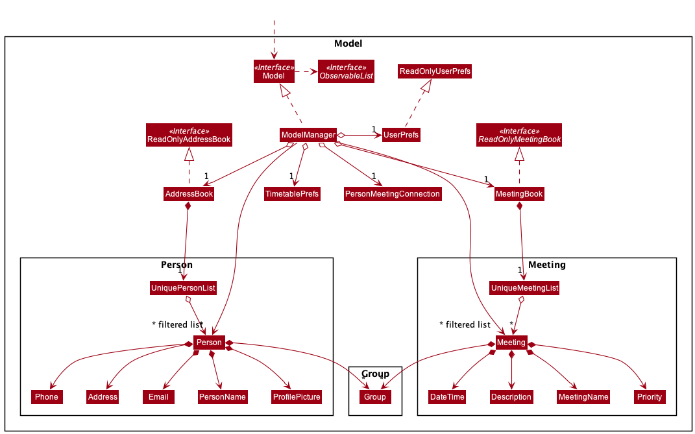
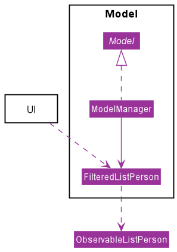
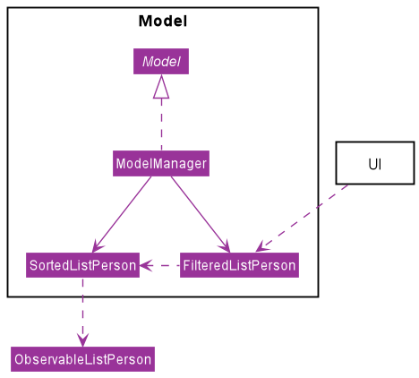
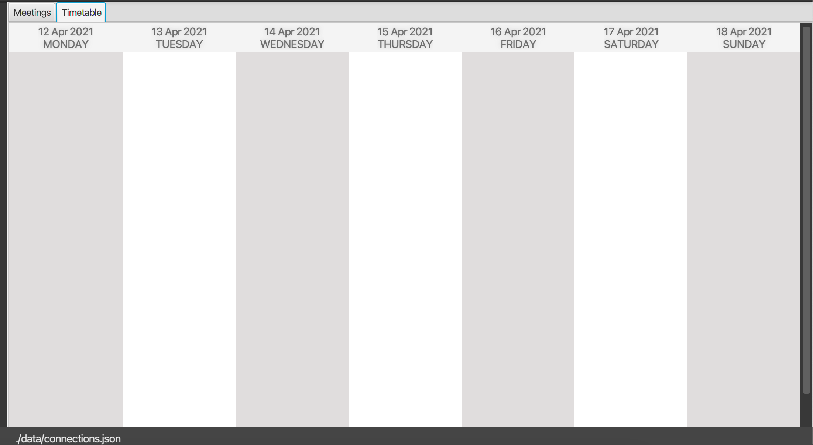
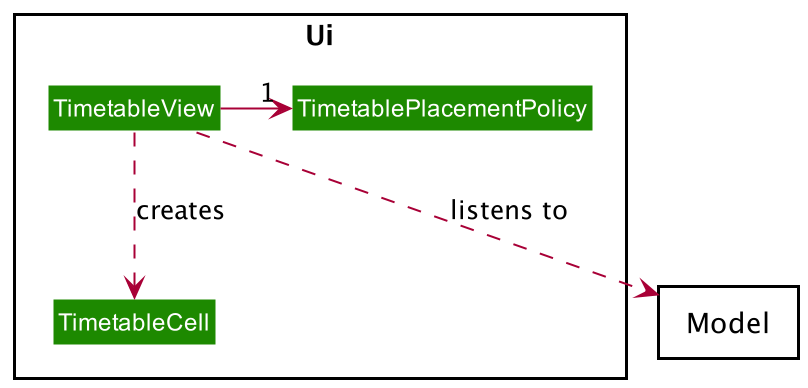
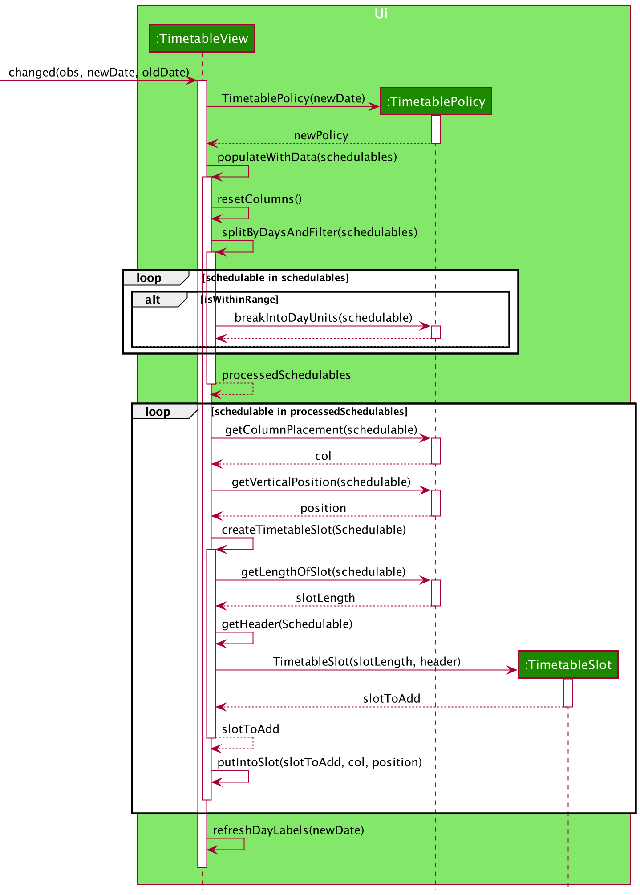
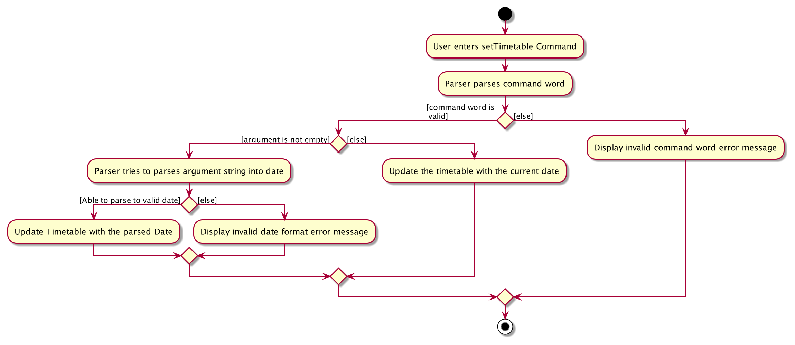
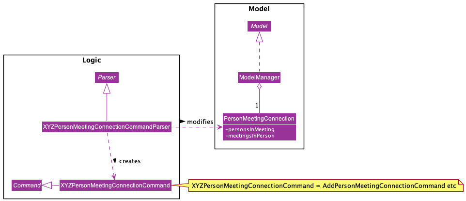
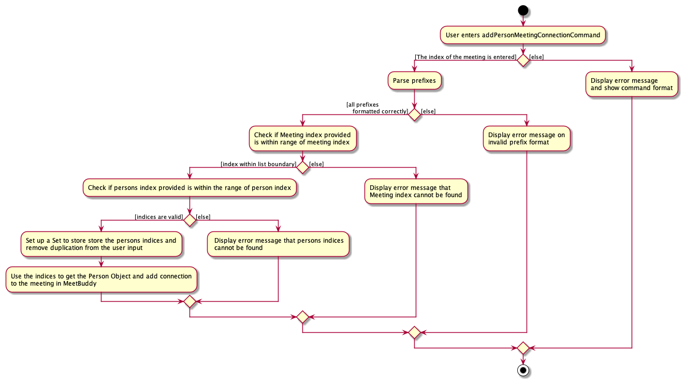

* Table of Contents
{:toc}

---------------------------------------------------------------------------------------------------------------
## Introduction

The following document contains a more technical overview of the project. It is suited for developers 
who wish to develop the project further. 

**MeetBuddy** is a desktop app optimised for people who want to organise their meetings and their contacts.
They can store both meetings and contacts, view the meetings scheduled for the week, and take note of which contacts
they are meeting up with. It also allows users to assign notes to their meetings to keep people informed about meeting
details. Furthermore, it supports automatic syncing of contacts profile photos if they have a Gravatar account. The app is
targeted towards users with a daily 7am - 4pm schedule, have frequent meetings during this period, and prefer typing.

--------------------------------------------------------------------------------------------------------------------

## **Setting up, getting started**

Refer to the guide [_Setting up and getting started_](SettingUp.md).

--------------------------------------------------------------------------------------------------------------------

## **Design**

### Architecture

The ***Architecture Diagram*** given above explains the high-level design of the App. Given below is a quick overview of each component.

:bulb: **Tip:** The `.puml` files used to create diagrams in this document can be found in the [diagrams](https://github.com/se-edu/addressbook-level3/tree/master/docs/diagrams/) folder. Refer to the [_PlantUML Tutorial_ at se-edu/guides](https://se-education.org/guides/tutorials/plantUml.html) to learn how to create and edit diagrams.

**`Main`** has two classes called [`Main`](https://github.com/se-edu/addressbook-level3/tree/master/src/main/java/seedu/address/Main.java) and [`MainApp`](https://github.com/se-edu/addressbook-level3/tree/master/src/main/java/seedu/address/MainApp.java). It is responsible for,
* At app launch: Initializes the components in the correct sequence, and connects them up with each other.
* At shut down: Shuts down the components and invokes cleanup methods where necessary.

[**`Commons`**](#common-classes) represents a collection of classes used by multiple other components.

The rest of the App consists of four components.

* [**`UI`**](#ui-component): The UI of the App.
* [**`Logic`**](#logic-component): The command executor.
* [**`Model`**](#model-component): Holds the data of the App in memory.
* [**`Storage`**](#storage-component): Reads data from, and writes data to, the hard disk.

Each of the four components,

* defines its *API* in an `interface` with the same personName as the Component.
* exposes its functionality using a concrete `{Component Name}Manager` class (which implements the corresponding API `interface` mentioned in the previous point.

For example, the `Logic` component (see the class diagram given below) defines its API in the `Logic.java` interface and exposes its functionality using the `LogicManager.java` class which implements the `Logic` interface.

**How the architecture components interact with each other**

The *Sequence Diagram* below shows how the components interact with each other for the scenario where the user issues the command `delete 1`.

The sections below give more details of each component.

### UI component

**API** :
[`Ui.java`](https://github.com/se-edu/addressbook-level3/tree/master/src/main/java/seedu/address/ui/Ui.java)

The UI consists of a `MainWindow` that is made up of parts e.g.`CommandBox`, `ResultDisplay`, `PersonListPanel`, `StatusBarFooter` etc.
All these, including the `MainWindow`, inherit from the abstract `UiPart` class.

The `UI` component uses JavaFx UI framework. The layout of these UI parts are defined in matching `.fxml` files that are in the `src/main/resources/view` folder. For example, the layout of the [`MainWindow`](https://github.com/se-edu/addressbook-level3/tree/master/src/main/java/seedu/address/ui/MainWindow.java) is specified in [`MainWindow.fxml`](https://github.com/se-edu/addressbook-level3/tree/master/src/main/resources/view/MainWindow.fxml)

The `UI` component,

* Executes user commands using the `Logic` component.
* Listens for changes to `Model` data so that the UI can be updated with the modified data.

### Logic component

**API** :
[`Logic.java`](https://github.com/se-edu/addressbook-level3/tree/master/src/main/java/seedu/address/logic/Logic.java)

1. `Logic` uses the `AddressBookParser` class to parse the user command.
1. This results in a `Command` object which is executed by the `LogicManager`.
1. The command execution can affect the `Model` (e.g. adding a person).
1. The result of the command execution is encapsulated as a `CommandResult` object which is passed back to the `Ui`.
1. In addition, the `CommandResult` object can also instruct the `Ui` to perform certain actions, such as displaying help to the user.

Given below is the Sequence Diagram for interactions within the `Logic` component for the `execute("delete 1")` API call.

:information_source: **Note:** The lifeline for `DeleteCommandParser` should end at the destroy marker (X) but due to a limitation of PlantUML, the lifeline reaches the end of diagram.

Given below is another Sequence Diagram for interactions within the `Logic` component for the more complicated command  `execute("showm1")` API call.

:information_source: **Note:** The lifeline for `ShowMeetingCommandParser` should end at the destroy marker (X) but due to a limitation of PlantUML, the lifeline reaches the end of diagram.

### Model component

**API** : [`Model.java`](https://github.com/se-edu/addressbook-level3/tree/master/src/main/java/seedu/address/model/Model.java)

The `Model`,

* stores a `UserPref` object that represents the user’s preferences.
* stores the MeetBuddy data.
* exposes an unmodifiable `ObservableList<Person>` that can be 'observed' e.g. the UI can be bound to this list so that the UI automatically updates when the data in the list change.
* stores the meeting book data.
* exposes an unmodifiable `ObservableList<Meeting>` that can be 'observed' e.g. the UI can be bound to this list so that the UI automatically updates when the data in the list change.
* stores the connection between the person in the address book and the meeting in the meeting book. e.g. Tom and July both participate in the CS2103 Lecture.
* does not depend on any of the other three components.
* (Some details are omitted)

:information_source: **Note:** An alternative (arguably, a more OOP) model is given below. It has a `Tag` list in the `AddressBook`, which `Person` references. This allows `AddressBook` to only require one `Tag` object per unique `Tag`, instead of each `Person` needing their own `Tag` object. 

### Storage component

**API** : [`Storage.java`](https://github.com/se-edu/addressbook-level3/tree/master/src/main/java/seedu/address/storage/Storage.java)

The `Storage` component,
* can save `UserPref` objects in json format and read it back.
* can save the MeetBuddy data in json format and read it back.

### Common classes

Classes used by multiple components are in the `seedu.addressbook.commons` package.

--------------------------------------------------------------------------------------------------------------------

## **Implementation**

This section describes some noteworthy details on how certain features are implemented.

### Sort feature (author: ToTo Tokaeo)
It can be helpful to sort the list of contacts and the list of meetings by a certain criteria.
For example, sorting contacts by their names could complement the user experience.
However, there were a few implementations details to consider. The implementations for sorting of the contacts and meetings are very similar, so I will only
discuss the one for contacts.

Currently, an essential attribute in the model are the filtered lists, 
which shows the results of searches and finds. 
The indexes used in commands like "edit" are taken with respect to these filtered list.
These filtered lists, however, are backed by immutable observable lists, 
which helps update the JavaFX GUI. I initially tried to make copies of these observable lists,
so that I can mutate them through sorting and filtering. However, this would not work,
since commands like "edit" would be making changes to a copy of the data, 
not the data itself. So, initially, this filtered list was the access point for many other components, 
like the UI. 

The implementation I went with uses another subclass of observable lists called sorted lists.
It goes in as the link between the original immutable observable list and the filtered lists.
Sorting would occur in the sorted list layer, and the filtering will be applied on top.
This has the benefit of still sharing the references with the original observable list, 
so modifications will still be reflected in the correct data structures.

### Unsort (author: ToTo Tokaeo)
To unsort, I simply remove the sorting comparator in the sorted list subclass. The list would become
the original observable list.

### Find meeting (author: ToTo Tokaeo)
The command `findm` leverages the filtering capabilities of the FilteredList for meetings. 
Hence,
the only tricky part is to compute the predicate used to filter this FilteredList.
The predicate is computed by the logical `AND` of all input predicates. For instance,
suppose we want to search for a meeting with name "lecture" and with priority 1. 
The predicate to filter the meeting list is simply: meeting contains "lecture" in its name `AND`
meeting has priority 1.

### Timetable feature (author : Maurice)

The timetable feature will be help the user visualise the free times, as well as his/her 
meetings schedule for the following week. 
It also aids the user in scheduling meetings faster or finding dates that she will be free on.
It should be responsive, such that when the user edits, adds or deletes a meeting, it should
be reflected in the timetable, if that meeting falls within the timetable range.
The user should be able to at a glance tell what meetings she has on a particular day in the 
timetable, and the timeslot of the meeting.
The user should be able to change the start date of the timetable. This allows to view a wider
range of days, as well as view past week schedules.

#### Implementation

To display the weekly schedule of the user, we first implement a timetable grid Ui component 
that would represent the view of the timetable. A JavaFX GridPane layout is chosen, with 2 rows and
7 columns. Each column would represent the days in the timetable. The first row would display 
the date labels for each row, and the second row would be the main timetable view. 

Each meeting in our model can be represented as a slot in our timetable. The length of the slot 
will be scaled linearly with the meeting duration. When displayed, the slot should show the duration
of the meeting and the timeframe the slot it is scheduled on. We implement each slot as a VBox with a 
text label.

The meeting slots should be then slotted into the timetable according to the start times and date.
Therefore each column in our main view should have an anchorPane layout, which allows us control over 
the positioning of the nodes in the timetable.

Using a MVC pattern, the TimetableView Class should act as the Controller logic for positioning the nodes, 
as well as creating the timetable slots of appropriate size, given the list of meetings to schedule.

Since the meetings have a well-defined start and end time, we create an interface called Schedulable, and make
the Meetings class implement that interface. This would allow us to program to an interface, rather than a class,
thus leading to less coupling. In that regard, now a timetable's task would be rendering **schedulable** objects on 
its GUI.

Alternative 1: Park all the logic under the TimetableView Class. It will be responsible for processing the data on 
the Schedulables and rendering it on the timetable UI.
1. `Pros`: Less overhead. 
2. `Cons`: Ties the implementation strategy of data processing, node placement and resizing heavily to the TimetableView class, thus
    leading to more work to be done for future developers to change the strategy.
    
Alternative 2 (current choice): Delegate the logic of node resizing and positioning to a separate class. 
1. `Pros`: More overhead.
2. `Cons`: Allows for easier modification in the future if another developer wants to change how the nodes are placed 
on the timetable, as he just needs to override timetablePolicy class. Allows for the timetable behavior 
to change dynamically (during runtime, say if a person enters a command to display), simply by setting
to a new timetablePolicy class.

We choose 2 because it makes the code neater and separates out the responsibilities nicely. It also keeps future
maintainability in mind.

The next feature was to make the TimetableView class responsive to user commands and changes to the data in the model.
There are two ways this can be done.

Alternative 1: Allow a boolean in CommandResult to indicate whether timetable should be updated. The Ui will then update
accordingly.
1. `Pros`: Allows more precision over when to update the model. Instead of updating at every change, the Command logic 
will do the job of determining if the timetable is necessary to be updated, thus potentially making it faster.
2. `Cons`: Introduces high coupling between Timetable class and every Command, would introduce burden on future
developers. Additionally, it would introduce more costs to unit test.
    
Alternative 2 (current choice): Using an observer pattern, update the timetable whenever the underlying model 
changes.
1. `Pros`: The update command is being executed more times, often unnecessarily. For example, when user adds a date outside 
timetable range.
2. `Cons`: Allows for greater decoupling between the logic and model due to the nature of the Observer Pattern.

#### Overall Design Chosen
These were the overall final design considerations.

Two possible implementations were considered.

Alternative 1 : Represent a seven-day schedule as a 2 dimensional array with each cell representing a
30 minute time interval, with each row representing a day, and each column representing a specified 
timeslot within the day. Similar to a booking system, whenever a meeting is added or deleted,
it will mark the timeslots as taken, or free up the slots.

1. `Pros`: A Ui can listen to the model and the display can be updated quickly with each cell change.
Whenever a meeting is added or removed, it only takes O(1) time to check each timeslot occupied by
the meeting.

2. `Cons`: Takes up more space. Needs a lot of restrictions on handling meetings with not nice start and ending times,
and thus reduces a lot of flexibility for the user.

Alternative 2 (*Current Choice): 
Represent each day as a column in the GUI, for a total of 7 columns. Each meeting will be represented as a slot
of length proportional to the meeting duration. Depending on the meeting's start times and end times, 
the program will determine which column to slot the meeting in, as well as the vertical position in the column to
put the meeting.

1. `Pros`: More flexible in allowing users to display meetings with much more different start end times.
Takes up less space in the model.

2. `Cons`: It takes up more time for each operation to update the GUI, because you have to update at the very least 
a whole column, or search through the slots in the column to find the slot.

#### setTimetable

We store an SimpleObjectProperty of a localDate inside a class called timetablePrefs in the model.
When we initialize the Ui components, a ReadOnlyObservableValue of this localDate is passed to the TimetableView.
TimetableView will then attach a listener to this ReadOnlyObservableValue. We program to
the ReadOnlyObservableValue interface here as a form of defensive programming, as we do not want to alter the 
observableValue outside of the setTimetableCommand.

The following sequence diagram illustrates what happens when setTimetableCommand is called with 
a valid date.

Users can set the timetable to update to start on any date using the command 
`setTimetable [DATE]`. Like before, it also uses the Observer Pattern,
and the design considerations were similar to earlier. Below is a sequence diagram of 
how the timetable is updated.

 Some small considerations were considered in the implementation, for example, if the 
 user leaves the date field empty, it should default set to today's date. The following
 activity diagram shows the setTimetableCommand being parsed.
 
 

### Notes feature (Cooming Soon : v1.5 has already been implemented, but will only be introduced in subsequent iterations)

The note feature has been implemented to help the user insert and delete personal notes.
This feature is introduced with the intention to help users manage their personal notes, and to make
MeetBuddy a more attractive one-stop application for users to manage their contacts, store their meeting 
information, and also keep track of various personal notes. While this feature has already been implemented,
it will only be made available in subsequent iterations, after the storage is made more mature for handling notes.

Just like the AddressBook for managing contacts and MeetingBook for managing meeting information, a NoteBook
was implemented for users to store personal notes. The NoteBook is implemented with a Command Pattern.

The user input command is first passed to the LogicManager class, which then makes use of the MeetBuddyParser
for deciding the type of command. Commands can be related to contacts, meetings, notes or timetable. This is decided
based on the command word. A specific command parser, such as AddNoteCommandParser, will be called which return
a Command such as AddNoteCommand. This command will be executed by the Logic Manager, before encapsulating
the result as a CommandResult object for passing back to the Model. The Ui component may then be invoked to display
the results (e.g. the notes) to the user.

### Person Meeting Connection feature (Written by: Chen Yuheng (Github: skinnychenpi))
MeetBuddy allows users to track and record the contacts related with their meetings.
#### Implementation
A PersonMeetingConnection class stores all of the relevant information of persons in the contact related to certain meetings. The class diagram below shows how all the different components interact to allow the person meeting connection feature to function. Note that the XYZConnectionCommand and XYZConnectionCommandParser refers to all Connection related commands like add, delete etc.

A PersonMeetingConnection(PMC) slot is represented by the PMC class which contains 2 key attributes, personsInMeeting and meetingsInPerson. Both of them are HashMaps. The attribute personsInMeeting is a hashmap whose key is a Meeting object and its value is a UniquePersonList. Another attribute meetingsInPerson is reversed, whose key is a Person object and its value is a UniqueMeetingList.

The XYZPMCCommand class represent classes that extend the abstract class Command and allows the users to add and delete the PMC to MeetBuddy. These XYZPMCCommands are created by the respective XYZPMCCommandParsers.

The PMC object is unique in the model, and it stores all the connections.

Given the class diagram and the understanding of how the PMC class interacts with other classes, let us examine how an addPersonMeetingConnection command behaves, by using the following activity diagram of the system.

The workflow above shows how a connection is added and the various checks that occurs at the different points throughout the workflow.

The workflow for deleting connection is similar as above, except that it has one more step to check whether the person the user wants to delete exist in the meeting.

To summarize the above activity diagram, there are several key checks which MeetBuddy checks for when the user is adding a connection. Firstly, MeetBuddy checks if the index for the meeting and the prefix for person (p/) are presented in the command. Also, MeetBuddy checks if all prefixes present are formatted correctly. Then, it checks if the Meeting index provided is within the range of the Meeting list. Following which, MeetBuddy will check if the persons' indices passed for the prefixes are within the range.

#### Design Considerations
Create a Person Meeting Connection Class or Add new attributes into Person and Meeting (i.e Add meetingsRelated attribute into Person Class).

|       | Alternative 1 (Current Choice): Create a Person Meeting Connection Class | Alternative 1 : Add new attribute into Person and Meeting class|
| ------| ------------- | ------------- |
| Pros  | Don't need to modify the signatures for Person and Meeting classes' constructors and APIs. Reduce level of coupling for both classes. Easier to manage and access connection.  | The GUI is shown based on a meeting card, hence using this way is easier to shown as the personsRelated is stored in a meeting object. Easier for storage implementation. |
| Cons  | More difficult to manage storage, need to take care of the effect to PMC when either the meetings or persons changes.   | Increase the level of coupling and need to modify the codebase in a large scale. |

Reason for choosing Alternative 1: Due to the time constraint of this project, our group has decided to choose alternative 1, as it not only reduces coupling, but is sufficient for us to uniquely identify the Persons Related participating in the meeting.

--------------------------------------------------------------------------------------------------------------------

## **Documentation, logging, testing, configuration, dev-ops**

* [Documentation guide](Documentation.md)
* [Testing guide](Testing.md)
* [Logging guide](Logging.md)
* [Configuration guide](Configuration.md)
* [DevOps guide](DevOps.md)

--------------------------------------------------------------------------------------------------------------------

## **Appendix: Requirements**

### Product scope

**Target user profile**:

* Any user who like typing, and is most of the week spent moving about meeting people for his internship, lectures, or social life, have busy schedules
 from 7 am - 4pm. 
* Has a lot of contacts and meeting alot of people out for events.
* Is more visual and would like to see the meetings on a timetable, and see when he is free. 
Is probably relatively young, and has friends with online gravatar profiles. 
* Would like to keep track of contacts and organise them as well for 
easy searching and easy remembering.
* Can type fast
* Prefers typing to mouse interactions
* Is reasonably comfortable using CLI apps

**Value proposition**: manage contacts faster than a typical mouse/GUI driven app.

Can manage social life and academics by toggling between two modes <-> school activities and non-school activities. Better time management - Priorities of meetups can be ranked and less time to schedule meetings with friends, as well as keep track of existing meetings.
Arrange activities with many people -> events not only tie with single contacts but with a group of contacts that can be added inside. Stay connected -> Keep in touch with old contacts or remove them by querying for old contacts . Keep a log and diary of past meetups, and small bios of people ,as well as images.

Users would be better able to manage their social and academic commitments by toggling between both modes. With the option to rank/prioritise meetups, users can experience better time management, and can stay connected with many people easily. The app also maintains a diary of past meetups, with the inclusion of images and bios of the people.

### User stories

Priorities: High (must have) - `* * *`, Medium (nice to have) - `* *`, Low (unlikely to have) - `*`

| Priority | As a …​                                    | I want to …​                     | So that I can…​                                                        |
| -------- | ------------------------------------------ | ------------------------------ | ---------------------------------------------------------------------- |
| `* * *`  | user                                  |     delete a meeting                       clear our old meetings that I dont need   |                 |
| `* * *`  | user                                       | add a new person               |                                                                        |
| `* * *`  | user                                       | delete a person                | remove entries that I no longer need                                   |
| `* * *`  | user                                       | find a person by personName          | locate details of persons without having to go through the entire list |
| `* *`    | user                                       | add a meeting with start date and end date                       |      keep track of meeting details of when it is happening          |
| `* *`    | user                                       | assign priorities for meetings | arrange my contacts and future tasks better                            |
| `*`      | user with many persons in the MeetBuddy address book | sort persons by personName           | locate a person easily                                                 |
| `* * `   | user with 8-5 schedule | See the current week's timetable of my scheduled meetings |  I can quickly estimate how packed my schedule is   |
| `* *`    | user with packed meetings | Easily find free slots to schedule my meetings | I can quickly find a slot to schedule my meeting|
| `*` | user with friends who have online gravatar profiles| I want to have my friends photos of my contacts without having the hassle of updating the photos manually | So that I can easily remmember them|
| `* * *` | meeting coordinator | I want to know who is coming to my meetings | I can keep note of who is coming to prepare for my meetings|
|`* *`| user with lots of meetings| I want to note a description to the meeting| Store info  like location, any things to take note or tasks to do before the meeting|
|`* * *`| user | I want to note down a contact even if I dont have some fields | I may not know a person's address, or email, or phone number |

*{More to be added}*

### Use cases

(For all use cases below, the **System** is the `AddressBook` and the **Actor** is the `user`, unless specified otherwise)

**Use case: Delete a person**

**MSS**

1.  User requests to list persons
2.  MeetBuddy shows a list of persons
3.  User requests to delete a specific person in the list
4.  MeetBuddy deletes the person

    Use case ends.

**Extensions**

* 2a. The list is empty.

  Use case ends.

* 3a. The given index is invalid.

    * 3a1. MeetBuddy shows an error message.

      Use case resumes at step 2.

**Use case: Assigning priorities to contacts**

**MSS**

1.  User requests to add a contact with priority
2.  MeetBuddy shows the list of persons after adding.

    Use case ends.

**Extensions**

* 1a. The priority is out of range.

    * 1a1. AddressBook shows an error message.

  Use case ends.

**Use case: Assigning priorities to meetings**

**MSS**

1.  User requests to add a meeting with priority
2.  MeetBuddy shows the list of meetings after adding.

    Use case ends.

**Extensions**

* 1a. The priority is out of range.

    * 1a1. MeetBuddy shows an error message.

  Use case ends.

New features on V1.2
5.  Assign priorities to contacts
6.  Notes about the contact.
7.  Sort contacts by (priorities/personName/groups)
8.  Last meetup date for each contact

### Non-Functional Requirements

1.  Should work on any _mainstream OS_ as long as it has Java `11` or above installed.
2.  Should be able to hold up to 1000 persons without a noticeable sluggishness in performance for typical usage.
3.  A user with above average typing speed for regular English text (i.e. not code, not system admin commands) should be able to accomplish most of the tasks faster using commands than using the mouse.
4.  The response to any use action should become visible within 2 seconds.
5.  The source code should be open source.
*{More to be added}*

### Glossary

* **Mainstream OS**: Windows, Linux, Unix, OS-X
* **Private contact detail**: A contact detail that is not meant to be shared with others

--------------------------------------------------------------------------------------------------------------------

## **Appendix: Instructions for manual testing**

Given below are instructions to test the app manually.

:information_source: **Note:** These instructions only provide a starting point for testers to work on;
testers are expected to do more *exploratory* testing.

### Launch and shutdown

1. Initial launch

   1. Download the jar file and copy into an empty folder

   1. Double-click the jar file Expected: Shows the GUI with a set of sample contacts. The window size may not be optimum.

1. Saving window preferences

   1. Resize the window to an optimum size. Move the window to a different location. Close the window.

   1. Re-launch the app by double-clicking the jar file. 
       Expected: The most recent window size and location is retained.

1. _{ more test cases …​ }_

### Deleting a person

1. Deleting a person while all persons are being shown

   1. Prerequisites: List all persons using the `list` command. Multiple persons in the list.

   1. Test case: `delete 1` 
      Expected: First contact is deleted from the list. Details of the deleted contact shown in the status message. Timestamp in the status bar is updated.

   1. Test case: `delete 0` 
      Expected: No person is deleted. Error details shown in the status message. Status bar remains the same.

   1. Other incorrect delete commands to try: `delete`, `delete x`, `...` (where x is larger than the list size) 
      Expected: Similar to previous.

1. _{ more test cases …​ }_

### Saving data

1. Dealing with missing/corrupted data files

   1. _{explain how to simulate a missing/corrupted file, and the expected behavior}_

1. _{ more test cases …​ }_
