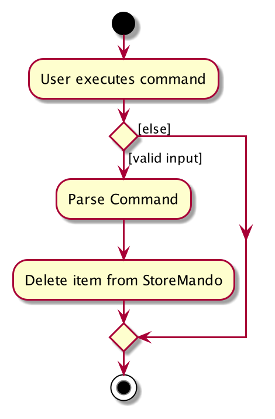
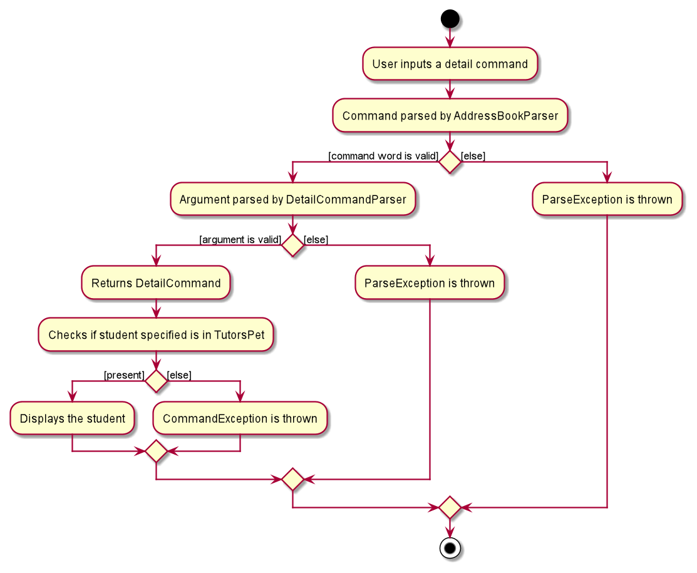
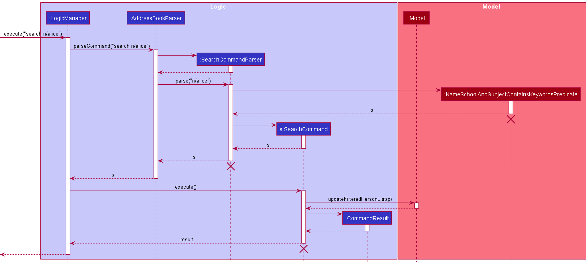
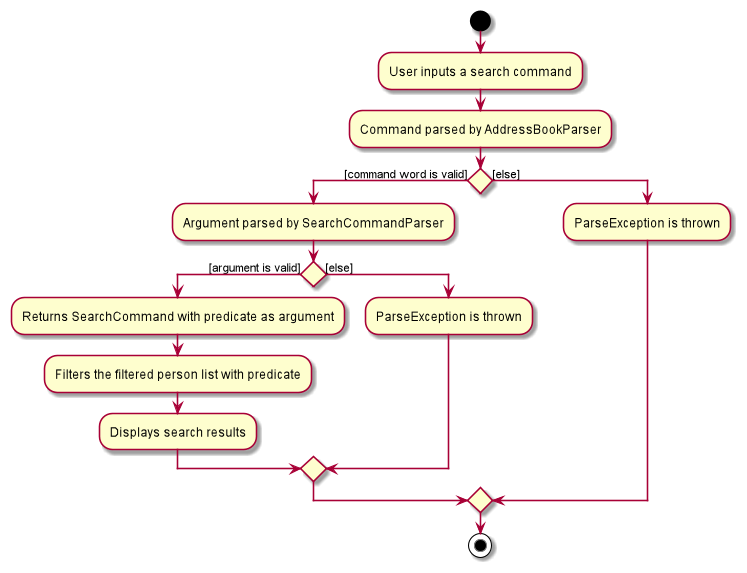

* Table of Contents
{:toc}

--------------------------------------------------------------------------------------------------------------------

## **Setting up, getting started**

Refer to the guide [_Setting up and getting started_](SettingUp.md).

--------------------------------------------------------------------------------------------------------------------

## **Design**

### Architecture

The ***Architecture Diagram*** given above explains the high-level design of the App. Given below is a quick overview of each component.

:bulb: **Tip:** The `.puml` files used to create diagrams in this document can be found in the [diagrams](https://github.com/se-edu/addressbook-level3/tree/master/docs/diagrams/) folder. Refer to the [_PlantUML Tutorial_ at se-edu/guides](https://se-education.org/guides/tutorials/plantUml.html) to learn how to create and edit diagrams.

**`Main`** has two classes called [`Main`](https://github.com/se-edu/addressbook-level3/tree/master/src/main/java/seedu/address/Main.java) and [`MainApp`](https://github.com/se-edu/addressbook-level3/tree/master/src/main/java/seedu/address/MainApp.java). It is responsible for,
* At app launch: Initializes the components in the correct sequence, and connects them up with each other.
* At shut down: Shuts down the components and invokes cleanup methods where necessary.

[**`Commons`**](#common-classes) represents a collection of classes used by multiple other components.

The rest of the App consists of four components.

* [**`UI`**](#ui-component): The UI of the App.
* [**`Logic`**](#logic-component): The command executor.
* [**`Model`**](#model-component): Holds the data of the App in memory.
* [**`Storage`**](#storage-component): Reads data from, and writes data to, the hard disk.

Each of the four components,

* defines its *API* in an `interface` with the same name as the Component.
* exposes its functionality using a concrete `{Component Name}Manager` class (which implements the corresponding API `interface` mentioned in the previous point.

For example, the `Logic` component (see the class diagram given below) defines its API in the `Logic.java` interface and exposes its functionality using the `LogicManager.java` class which implements the `Logic` interface.

**How the architecture components interact with each other**

The *Sequence Diagram* below shows how the components interact with each other for the scenario where the user issues the command `delete 1`.

The sections below give more details of each component.

### UI component

**API** :
[`Ui.java`](https://github.com/se-edu/addressbook-level3/tree/master/src/main/java/seedu/address/ui/Ui.java)

The UI consists of a `MainWindow` that is made up of parts e.g.`CommandBox`, `ResultDisplay`, `PersonListPanel`, `StatusBarFooter` etc. All these, including the `MainWindow`, inherit from the abstract `UiPart` class.

The `UI` component uses JavaFx UI framework. The layout of these UI parts are defined in matching `.fxml` files that are in the `src/main/resources/view` folder. For example, the layout of the [`MainWindow`](https://github.com/se-edu/addressbook-level3/tree/master/src/main/java/seedu/address/ui/MainWindow.java) is specified in [`MainWindow.fxml`](https://github.com/se-edu/addressbook-level3/tree/master/src/main/resources/view/MainWindow.fxml)

The `UI` component,

* Executes user commands using the `Logic` component.
* Listens for changes to `Model` data so that the UI can be updated with the modified data.

### Logic component

**API** :
[`Logic.java`](https://github.com/se-edu/addressbook-level3/tree/master/src/main/java/seedu/address/logic/Logic.java)

1. `Logic` uses the `AddressBookParser` class to parse the user command.
1. This results in a `Command` object which is executed by the `LogicManager`.
1. The command execution can affect the `Model` (e.g. adding a person).
1. The result of the command execution is encapsulated as a `CommandResult` object which is passed back to the `Ui`.
1. In addition, the `CommandResult` object can also instruct the `Ui` to perform certain actions, such as displaying help to the user.

Given below is the Sequence Diagram for interactions within the `Logic` component for the `execute("delete 1")` API call.

:information_source: **Note:** The lifeline for `DeleteCommandParser` should end at the destroy marker (X) but due to a limitation of PlantUML, the lifeline reaches the end of diagram.

### Model component

**API** : [`Model.java`](https://github.com/se-edu/addressbook-level3/tree/master/src/main/java/seedu/address/model/Model.java)

The `Model`,

* stores a `UserPref` object that represents the user’s preferences.
* stores the address book data.
* stores a Person object.
* exposes an unmodifiable `ObservableList<Person>` that can be 'observed'.
  * UI bounded to this list and Person object will be automatically updated when the data in the list change.
* does not depend on any of the other three components.

:information_source: **Note:** An alternative (arguably, a more OOP) model is given below. It has a `Tag` list in the `AddressBook`, which `Person` references. This allows `AddressBook` to only require one `Tag` object per unique `Tag`, instead of each `Person` needing their own `Tag` object. 

### Storage component

**API** : [`Storage.java`](https://github.com/se-edu/addressbook-level3/tree/master/src/main/java/seedu/address/storage/Storage.java)

The `Storage` component,
* can save `UserPref` objects in json format and read it back.
* can save the address book data in json format and read it back.

### Common classes

Classes used by multiple components are in the `seedu.addressbook.commons` package.

--------------------------------------------------------------------------------------------------------------------

## **Implementation**

This section describes some noteworthy details on how certain features are implemented.

### Delete feature

#### Implementation
The delete mechanism is facilitated by `DeleteCommand` and `DeleteCommandParser`.

`DeleteCommand` extends `Command` and implements the following operation: 

* `DeleteCommand#execute()` — deletes the student at the given index if the index is valid, and returns a new
`CommandResult` with a success message.
  
`DeleteCommandParser` implements the `Parser` interface and implements the following operation:

* `DeleteCommandParser#parse()`  —  parses the user's input and returns a `DeleteCommand` if the command format
is valid

Given below is an example usage scenario and how the delete mechanism behaves at each step.

Step 1. The user executes `delete 1` command to delete the 1st student in TutorsPet.

Step 2. The user input is parsed by `AddressBookParser`, which passes the delete command's argument to `DeleteCommandParser`.

Step 3. `DeleteCommandParser` returns a new `DeleteCommand` if the argument is valid. Otherwise, a `ParseException` is thrown.

Step 4. `LogicManager` then calls `DeleteCommand#execute()`.

Step 5. `DeleteCommand#execute()` checks if the student specified exists. If the student exists, he/she gets deleted and
a new `CommandResult` is returned. Otherwise a `CommandException` is thrown.

Step 6. If the delete command has been successfully executed, the success message will be displayed.

#### Sequence Diagram

The sequence diagram below shows how the delete feature works:

#### Activity Diagram

The activity diagram shows the workflow when a delete command is executed:

#### Design consideration:

##### Aspect: Whether to provide options to delete specific fields

* **Alternative 1 (current choice):** Deletes the entire Student object.
    * Pros: Easy to implement, less prone to errors.
    * Cons: Less flexibility. 

* **Alternative 2:** Provide options to delete specific fields that belong to a Student.
    * Pros: Unnecessary information can be removed easily.
    * Cons: Certain fields such as tags and lessons can already be cleared easily with the `edit` command.

### Detail feature

#### Implementation
The detail mechanism is facilitated by `DetailCommand` and `DetailCommandParser`.

`DetailCommand` extends `Command` and implements the following operation:

* `DetailCommand#execute()` — displays the details of the student at the given index if the index is valid, 
  and returns a new `CommandResult` with a success message.

`DetailCommandParser` implements the `Parser` interface and implements the following operation:

* `DetailCommandParser#parse()`  —  parses the user's input and returns a `DetailCommand` if the command format
  is valid

Given below is an example usage scenario and how the detail mechanism behaves at each step.

Step 1. The user executes `detail 1` command to display the details of the 1st student in TutorsPet.

Step 2. The user input is parsed by `AddressBookParser`, which passes the delete command's argument to `DetailCommandParser`.

Step 3. `DetailCommandParser` returns a new `DetailCommand` if the argument is valid. Otherwise, a `ParseException` is thrown.

Step 4. `LogicManager` then calls `DetailCommand#execute()`.

Step 5. `DetailCommand#execute()` checks if the student specified exists. If the student exists, his/her details will
get displayed and a new `CommandResult` is returned. Otherwise, a `CommandException` is thrown.

Step 6. If the detail command has been successfully executed, the success message will be displayed.

#### Sequence Diagram

The sequence diagram below shows how the detail feature works:

#### Activity Diagram

The activity diagram shows the workflow when a delete command is executed:

#### Design consideration:

##### Aspect: Whether to provide options to display multiple contacts

* **Alternative 1 (current choice):** Display one Student object.
    * Pros: Easy to implement, less prone to errors.
    * Cons: Less flexibility.

* **Alternative 2:** Provide options to display multiple Students objects.
    * Pros: Able to user to multi-task.
    * Cons: GUI space restriction.

### Search feature

#### Implementation

The search mechanism is facilitated by `SearchCommand`, `SearchCommandParser` and `NameAndSchoolContainsKeywordsPredicate`.

`SearchCommand` extends `Command` and contains a `Predicate`. It implements the following operation:

* `SearchCommand#execute()`  —  displays a list of students whose name, school or tag matches the keywords following the prefixes n/ s/ t/ respectively in the search command.
  Returns a new `CommandResult` with a message indicating the number of students found.

`SearchCommandParser` implements the `Parser` interface and implements the following operation:

* `SearchCommandParser#parse()`  —  parses the user's input and returns a new `SearchCommand` with a new `NameSchoolAndTagContainsKeywordsPredicate` as argument if the command format is valid.
* `SearchCommandParser#extractKeywordsAsArray()`  —  extracts the keywords following a prefix that is passed as parameter into an array.

`NameSchoolAndTagContainsKeywordsPredicate` implements the `Predicate` interface and contains 3 `List` of keywords: name, school and tag. It implements the following operations:

* `NameSchoolAndTagContainsKeywordsPredicate#test()`  —  tests if the name, school and tag keywords matches the name, school and tag of the student contacts respectively, and returns true if matches.
* `NameSchoolAndTagContainsKeywordsPredicate#testByTag()`  —  tests if the tag keywords matches the tag of the student.
* `NameSchoolAndTagContainsKeywordsPredicate#testBySchool()`  —  tests if the school keywords matches the school of the student.
* `NameSchoolAndTagContainsKeywordsPredicate#testByName()`  —  tests if the name keywords matches the name of the student.

Given below is an example usage scenario and how the search mechanism behaves at each step.

Step 1. The user executes `search n/alice t/math` command to search for students with the name `alice` or with the tag `math`, both case insensitive.

Step 2. `LogicManager#execute()` is called to execute the given command. It first calls `AddressBookParser#parseCommand()` which passes the command’s argument `SearchCommandParser#parse()` to parse the `search` command.

Step 3. `SearchCommandParser#parse()` calls `SearchCommandParser#extractKeywordsAsArray()` to obtain the name, school and tag keywords in separate `List`.
A new `NameSchoolAndTagContainsKeywordsPredicate` is created using the 3 keyword lists, and is passed into the `SearchCommand` constructor as the argument.
The new `SearchCommand` is then returned if the argument is valid with the correct prefixes. Otherwise, a `ParseException` is thrown.

Step 4. After the new `SearchCommand` is returned, the `LogicManager#execute()` continues and calls `SearchCommand#execute()`.

Step 5. `SearchCommand#execute()`  filters the filtered person list by passing the `NameSchoolAndTagContainsKeywordsPredicate` argument into `Model#updateFilteredPersonList()`.
The updated filtered person list with the search results will then be displayed.

Step 6. If the `search` command has been successfully executed, a message will be displayed indicating the number of person listed.

#### Sequence Diagram
The sequence diagram below shows how the `search` feature works:

#### Activity Diagram
The activity diagram shows the workflow when a `search` command is executed:

### \[Proposed\] Undo/redo feature

#### Proposed Implementation

The proposed undo/redo mechanism is facilitated by `VersionedAddressBook`. It extends `AddressBook` with an undo/redo history, stored internally as an `addressBookStateList` and `currentStatePointer`. Additionally, it implements the following operations:

* `VersionedAddressBook#commit()` — Saves the current address book state in its history.
* `VersionedAddressBook#undo()` — Restores the previous address book state from its history.
* `VersionedAddressBook#redo()` — Restores a previously undone address book state from its history.

These operations are exposed in the `Model` interface as `Model#commitAddressBook()`, `Model#undoAddressBook()` and `Model#redoAddressBook()` respectively.

Given below is an example usage scenario and how the undo/redo mechanism behaves at each step.

Step 1. The user launches the application for the first time. The `VersionedAddressBook` will be initialized with the initial address book state, and the `currentStatePointer` pointing to that single address book state.

Step 2. The user executes `delete 5` command to delete the 5th person in the address book. The `delete` command calls `Model#commitAddressBook()`, causing the modified state of the address book after the `delete 5` command executes to be saved in the `addressBookStateList`, and the `currentStatePointer` is shifted to the newly inserted address book state.

Step 3. The user executes `add n/David …​` to add a new person. The `add` command also calls `Model#commitAddressBook()`, causing another modified address book state to be saved into the `addressBookStateList`.

:information_source: **Note:** If a command fails its execution, it will not call `Model#commitAddressBook()`, so the address book state will not be saved into the `addressBookStateList`.

Step 4. The user now decides that adding the person was a mistake, and decides to undo that action by executing the `undo` command. The `undo` command will call `Model#undoAddressBook()`, which will shift the `currentStatePointer` once to the left, pointing it to the previous address book state, and restores the address book to that state.

:information_source: **Note:** If the `currentStatePointer` is at index 0, pointing to the initial AddressBook state, then there are no previous AddressBook states to restore. The `undo` command uses `Model#canUndoAddressBook()` to check if this is the case. If so, it will return an error to the user rather
than attempting to perform the undo.

The following sequence diagram shows how the undo operation works:

:information_source: **Note:** The lifeline for `UndoCommand` should end at the destroy marker (X) but due to a limitation of PlantUML, the lifeline reaches the end of diagram.

The `redo` command does the opposite — it calls `Model#redoAddressBook()`, which shifts the `currentStatePointer` once to the right, pointing to the previously undone state, and restores the address book to that state.

:information_source: **Note:** If the `currentStatePointer` is at index `addressBookStateList.size() - 1`, pointing to the latest address book state, then there are no undone AddressBook states to restore. The `redo` command uses `Model#canRedoAddressBook()` to check if this is the case. If so, it will return an error to the user rather than attempting to perform the redo.

Step 5. The user then decides to execute the command `list`. Commands that do not modify the address book, such as `list`, will usually not call `Model#commitAddressBook()`, `Model#undoAddressBook()` or `Model#redoAddressBook()`. Thus, the `addressBookStateList` remains unchanged.

Step 6. The user executes `clear`, which calls `Model#commitAddressBook()`. Since the `currentStatePointer` is not pointing at the end of the `addressBookStateList`, all address book states after the `currentStatePointer` will be purged. Reason: It no longer makes sense to redo the `add n/David …​` command. This is the behavior that most modern desktop applications follow.

The following activity diagram summarizes what happens when a user executes a new command:

#### Design consideration:

##### Aspect: How undo & redo executes

* **Alternative 1 (current choice):** Saves the entire address book.
  * Pros: Easy to implement.
  * Cons: May have performance issues in terms of memory usage.

* **Alternative 2:** Individual command knows how to undo/redo by
  itself.
  * Pros: Will use less memory (e.g. for `delete`, just save the person being deleted).
  * Cons: We must ensure that the implementation of each individual command are correct.

_{more aspects and alternatives to be added}_

### \[Proposed\] Data archiving

_{Explain here how the data archiving feature will be implemented}_

--------------------------------------------------------------------------------------------------------------------

## **Documentation, logging, testing, configuration, dev-ops**

* [Documentation guide](Documentation.md)
* [Testing guide](Testing.md)
* [Logging guide](Logging.md)
* [Configuration guide](Configuration.md)
* [DevOps guide](DevOps.md)

--------------------------------------------------------------------------------------------------------------------

## **Appendix: Requirements**

### Product scope

**Target user profile**: Private tuition teachers

* has a need to manage a significant number of student contacts
* has to plan lessons based on each student's profile
* is comfortable carrying a laptop around
* can type fast

**Value proposition**: manage many contacts with a lot of different details

### User stories

Priorities: High (must have) - `* * *`, Medium (nice to have) - `* *`, Low (unlikely to have) - `*`

| Priority | As a …​                                    | I want to …​                     | So that I can…​                                                        |
| -------- | ------------------------------------------ | ------------------------------- | ---------------------------------------------------------------------- |
| `* * *`  | new user                                   | see usage instructions          | refer to instructions when I forget how to use the App                 |
| `* * *`  | user                                       | add new student's contact       | I can store information on a student                                   |                                   |
| `* * *`  | user                                       | delete a student's contact      | remove entries that I no longer need and reduce cluttering             |                     |
| `* * *`  | user                                       | edit a student's contact        | I can update the contact book when a student’s details has changed.    |
| `* *`    | user                                       | find a student by name          | locate details of students without having to go through the entire list|
| `* *`    | user                                       | find a student by school        | plan my lesson/schedules according to their school’s curriculum        |
| `* *`    | user                                       | sort students by lesson days    | I can see my schedule for the week                                     |
| `* *`    | user                                       | easily access guardians’ contact| I can quickly reach them in case of any emergencies or sudden changes  |
| `*`      | expert user                                | add customized tags to contacts | I will be able to access each group of students more easily
| `*`      | expert user                                | attach remarks to contacts      | So I remember details that might not be covered in the original program|
| `*`      | user                                       | hide private contact details    | minimize chance of someone else seeing them by accident                |

*{More to be added}*

### Use cases

(For all use cases below, the **System** is the `TutorPets` and the **Actor** is the `user`, unless specified otherwise)

**Use case: Add a new contact**

**MSS**

1.  User keys in the contact to be added
2.  TutorPets shows the added contact into the list

    Use case ends.

**Extensions**

* 1a. The given details is in an incorrect format.

    * 1a1. TutorPets shows an error message.

      Use case ends.

**Use case: Clears all entries contact**

**MSS**

1.  User enters clears all entries contact command
2.  TutorPets clears all the contact in list

    Use case ends.

**Extensions**

* 1a. The given details is in an incorrect format.

    * 1a1. TutorPets shows an error message.

      Use case ends.

**Use case: Delete a student contact**

**MSS**

1.  User requests to list contacts
2.  TutorPets shows a list of students’ contact
3.  User requests to delete a specific contact from the list
4.  TutorPets deletes the person

    Use case ends.

**Extensions**

* 2a. The list is empty.

  Use case ends.

* 3a. The given index is invalid.

    * 3a1. TutorPets shows an error message.

      Use case resumes at step 2.

**Use case: Editing an existing contact**

**MSS**

1.  User requests to list contacts
2.  TutorPets shows a list of students’ contact
3.  User requests to edit a specific contact from the list
4.  TutorPets edits the selected contact

    Use case ends.

**Extensions**

* 1a. The given details is in an incorrect format.

    * 1a1. TutorPets shows an error message.

      Use case ends.

* 2a. The list is empty.

  Use case ends.

* 3a. The given index is invalid.

    * 3a1. TutorPets shows an error message.

      Use case resumes at step 2.

**Use case: Exit TutorPets**

**MSS**

1.  User enters exit into command prompt
2.  TutorPets saves the current contact in the list and exits.

    Use case ends.

**Extensions**

* 1a. The given details is in an incorrect format.

    * 1a1. TutorPets shows an error message.

      Use case resumes at step 2.

**Use case: Search for a student contact**

**MSS**

1.  User enters the student name or specified keyword to be searched.
2.  TutorPets shows a list of searched students.

    Use case ends.

**Extensions**

* 1a. The search result list is empty.

  Use case ends.

*{More to be added}*

### Non-Functional Requirements

1.  Should work on any _mainstream OS_ as long as it has Java `11` or above installed.
2.  Should be able to hold up to 1000 persons without a noticeable sluggishness in performance for typical usage.
3.  A user with above average typing speed for regular English text (i.e. not code, not system admin commands) should be able to accomplish most of the tasks faster using commands than using the mouse.
4.  Should work without requiring an installer.
5.  Should not depend on remote server.
6.  Everything should be packaged into a single JAR file.
7.  JAR file should not exceed 100MB.
8.  System should be usable and understandable by a novice.
9.  System should be able to run even if the data file has errors arising from a user manually editing it.
10. Users should be comfortable with the system even after not using it for a period of time.
11. System should be able to store up to 500 contacts.
12. System should be able to function if a user overwrites the data file with another data file that is named the same.

*{More to be added}*

### Glossary

* **Private tuition teachers**: Freelance tuition teachers not belonging to any organisations
* **Mainstream OS**: Windows, Linux, Unix, OS-X
* **Private contact detail**: A contact detail that is not meant to be shared with others
* **Novice**: A user that is new to using TutorsPet

--------------------------------------------------------------------------------------------------------------------

## **Appendix: Instructions for manual testing**

Given below are instructions to test the app manually.

:information_source: **Note:** These instructions only provide a starting point for testers to work on;
testers are expected to do more *exploratory* testing.

### Launch and shutdown

1. Initial launch

   1. Download the jar file and copy into an empty folder

   1. Double-click the jar file Expected: Shows the GUI with a set of sample contacts. The window size may not be optimum.

1. Saving window preferences

   1. Resize the window to an optimum size. Move the window to a different location. Close the window.

   1. Re-launch the app by double-clicking the jar file. 
       Expected: The most recent window size and location is retained.

1. _{ more test cases …​ }_

### Deleting a person

1. Deleting a person while all persons are being shown

   1. Prerequisites: List all persons using the `list` command. Multiple persons in the list.

   1. Test case: `delete 1` 
      Expected: First contact is deleted from the list. Details of the deleted contact shown in the status message. Timestamp in the status bar is updated.

   1. Test case: `delete 0` 
      Expected: No person is deleted. Error details shown in the status message. Status bar remains the same.

   1. Other incorrect delete commands to try: `delete`, `delete x`, `...` (where x is larger than the list size) 
      Expected: Similar to previous.

1. _{ more test cases …​ }_

### Saving data

1. Dealing with missing/corrupted data files

   1. _{explain how to simulate a missing/corrupted file, and the expected behavior}_

1. _{ more test cases …​ }_
