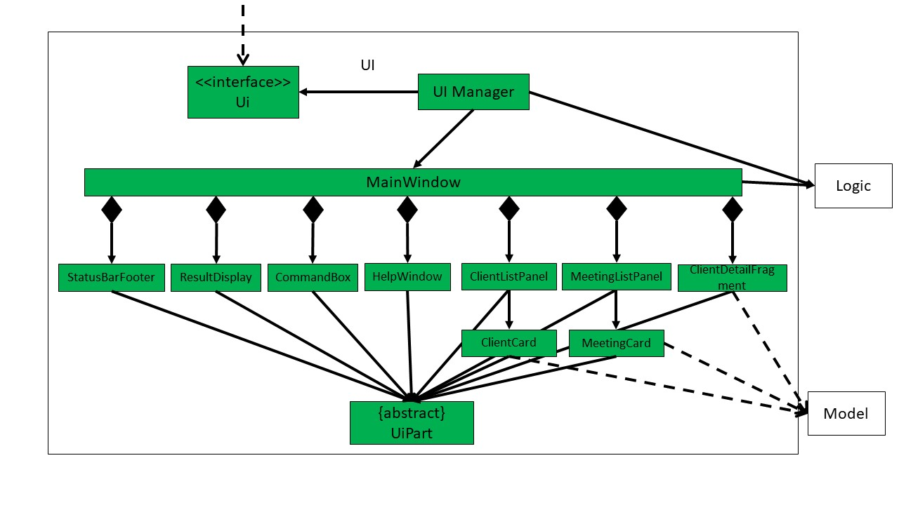
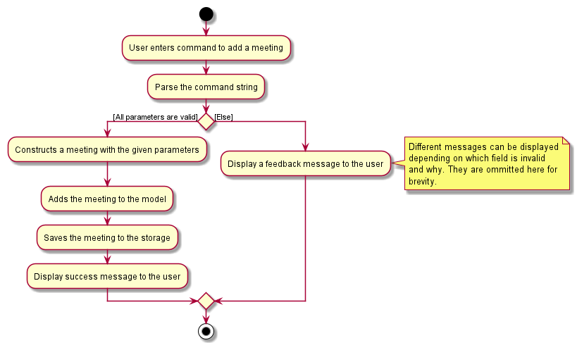
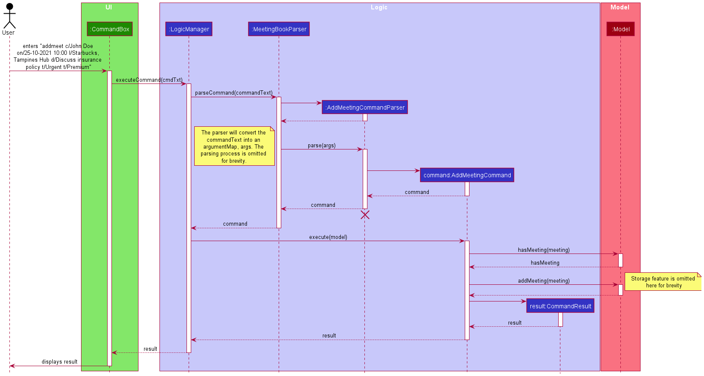
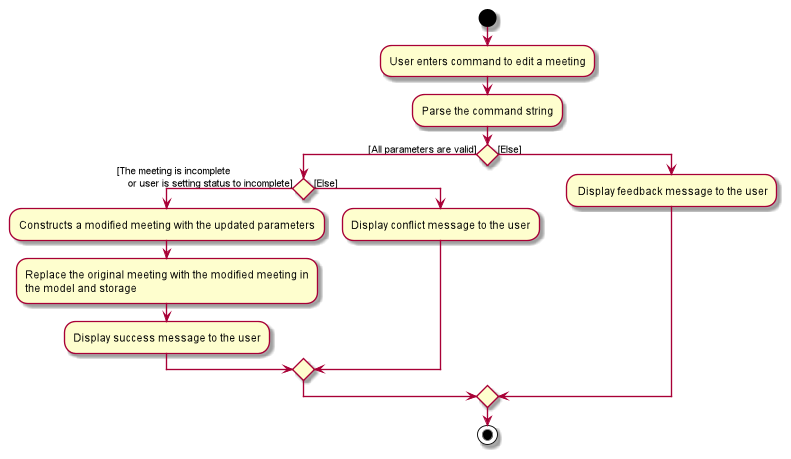
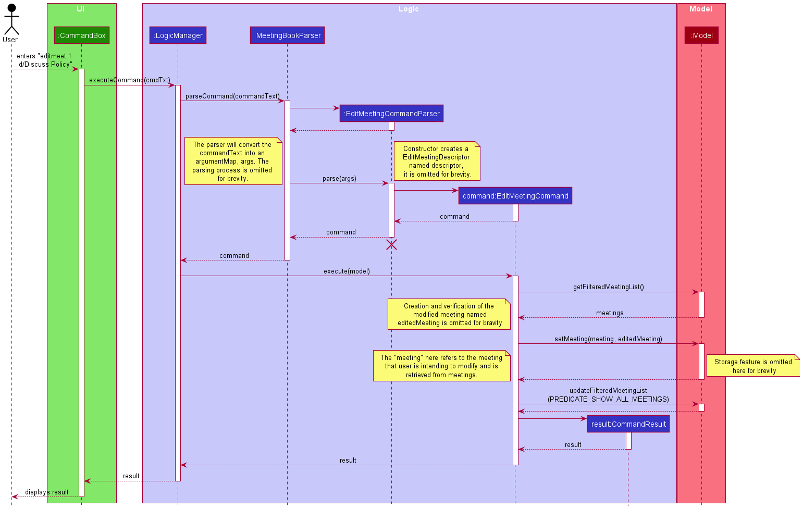
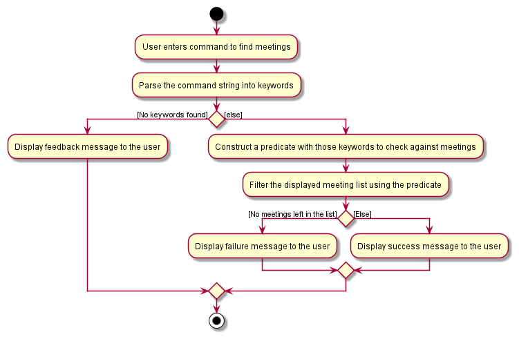
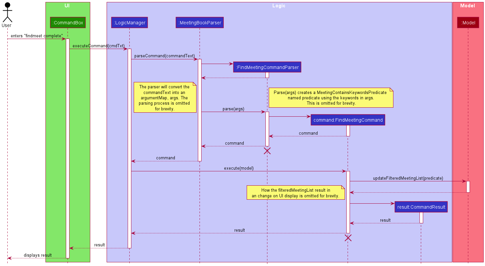

* Table of Contents
{:toc}

--------------------------------------------------------------------------------------------------------------------

## **Setting up, getting started**

Refer to the guide [_Setting up and getting started_](SettingUp.md).

--------------------------------------------------------------------------------------------------------------------

## **Design**

### Architecture

The ***Architecture Diagram*** given above explains the high-level design of the App. Given below is a quick overview of each component.

:bulb: **Tip:** The `.puml` files used to create diagrams in this document can be found in the [diagrams](https://github.com/se-edu/ClientBook-level3/tree/master/docs/diagrams/) folder. Refer to the [_PlantUML Tutorial_ at se-edu/guides](https://se-education.org/guides/tutorials/plantUml.html) to learn how to create and edit diagrams.

**`Main`** has two classes called [`Main`](https://github.com/se-edu/ClientBook-level3/tree/master/src/main/java/seedu/location/Main.java) and [`MainApp`](https://github.com/se-edu/ClientBook-level3/tree/master/src/main/java/seedu/location/MainApp.java). It is responsible for,
* At app launch: Initializes the components in the correct sequence, and connects them up with each other.
* At shut down: Shuts down the components and invokes cleanup methods where necessary.

[**`Commons`**](#common-classes) represents a collection of classes used by multiple other components.

The rest of the App consists of four components.

* [**`UI`**](#ui-component): The UI of the App.
* [**`Logic`**](#logic-component): The command executor.
* [**`Model`**](#model-component): Holds the data of the App in memory.
* [**`Storage`**](#storage-component): Reads data from, and writes data to, the hard disk.

Each of the four components,

* defines its *API* in an `interface` with the same name as the Component.
* exposes its functionality using a concrete `{Component Name}Manager` class (which implements the corresponding API `interface` mentioned in the previous point.

For example, the `Logic` component (see the class diagram given below) defines its API in the `Logic.java` interface and exposes its functionality using the `LogicManager.java` class which implements the `Logic` interface.

**How the architecture components interact with each other**

The *Sequence Diagram* below shows how the components interact with each other for the scenario where the user issues the command `delete 1`.

The sections below give more details of each component.

### UI component

**API** :
[`Ui.java`](https://github.com/se-edu/ClientBook-level3/tree/master/src/main/java/seedu/location/ui/Ui.java)

The UI consists of a `MainWindow` that is made up of parts e.g.`CommandBox`, `ResultDisplay`, `ClientListPanel`, `StatusBarFooter` etc. All these, including the `MainWindow`, inherit from the abstract `UiPart` class.

The `UI` component uses JavaFx UI framework. The layout of these UI parts are defined in matching `.fxml` files that are in the `src/main/resources/view` folder. For example, the layout of the [`MainWindow`](https://github.com/se-edu/ClientBook-level3/tree/master/src/main/java/seedu/location/ui/MainWindow.java) is specified in [`MainWindow.fxml`](https://github.com/se-edu/ClientBook-level3/tree/master/src/main/resources/view/MainWindow.fxml)

The `UI` component,

* Executes user commands using the `Logic` component.
* Listens for changes to `Model` data so that the UI can be updated with the modified data.

### Logic component

**API** :
[`Logic.java`](https://github.com/se-edu/ClientBook-level3/tree/master/src/main/java/seedu/location/logic/Logic.java)

1. `Logic` uses the `ClientBookParser` class to parse the user command.
1. This results in a `Command` object which is executed by the `LogicManager`.
1. The command execution can affect the `Model` (e.g. adding a client).
1. The result of the command execution is encapsulated as a `CommandResult` object which is passed back to the `Ui`.
1. In addition, the `CommandResult` object can also instruct the `Ui` to perform certain actions, such as displaying help to the user.

Given below is the Sequence Diagram for interactions within the `Logic` component for the `execute("delete 1")` API call.

:information_source: **Note:** The lifeline for `DeleteCommandParser` should end at the destroy marker (X) but due to a limitation of PlantUML, the lifeline reaches the end of diagram.

### Model component

**API** : [`Model.java`](https://github.com/se-edu/ClientBook-level3/tree/master/src/main/java/seedu/location/model/Model.java)

The `Model` component,

* stores a `UserPref` object that represents the user’s preferences.
* stores the client book and meeting book data.
* exposes an unmodifiable `ObservableList<Client>` and `Observable<Meeting>` that can be 'observed' e.g. the UI can be bound to these lists so that the UI automatically updates when the data in these lists change.
* does not depend on any of the other three components.

The `Client` object,

* stores the attributes of a client.
* has `Name` to serve as its unique identifer.

The `Meeting` object,

* stores the attributes of a meeting.
* has `Name` to represent a client's name that is not required to be in the `ClientBook`.
* cannot be created by the user if the `DateTime` is in conflict with another `Meeting`'s `DateTime` or before the date and time at the point of creation.
* has `Name` and `DateTime` to serve as its unique identifier.

### Storage component

**API** : [`Storage.java`](https://github.com/AY2021S2-CS2103-W17-4/tp/blob/master/src/main/java/seedu/iscam/storage/Storage.java)

The `Storage` component,
* can save `UserPref` objects in json format and read it back.
* can save the `ClientBook` data in json format and read it back.
* can save the `MeetingBook` data in json format and read it back.

The `ClientBook` object,
* stores the data of clients
* retrieves stored data of clients

The `MeetingBook` object,
* stores the data of meetings
* retrieves stored data of meetings

### Common classes

Classes used by multiple components are in the `seedu.iscam.storage` package.

--------------------------------------------------------------------------------------------------------------------

## **Implementation**

This section describes some noteworthy details on how certain features are implemented.

### Client Features
The Client family of features consist of the following features: Add Client, Edit Client, List Clients, 
Find Clients by Name, Find Clients by Insurance Plan and Delete Client.

#### Client Class
The Client class consists of 7 fields, each of the fields represented by its own representative classes. Within those classes,
methods are provided to verify their respective inputs and display error message when the given input is invalid.
This allows the fields to have a low degree of coupling, and we can change how the fields are verifield without affecting
other classes in the App. Additionally, the Client class can be expanded to contain more fields without affecting the
existing features.

Fields
* `Name` - The client's name.
* `Phone` - The client's phone number.
* `Email` - The client's email address.
* `InsurancePlans` - Insurance Plans the client currently holds.
  * A client may have no Insurance Plans.
* `Location` - The client's preferred meeting location.
* `Tags` - Tags associated with the client.
* `ImageRes` - Image of the client.
  * If no image is provided, a default image will be provided by the App.

The `Client` objects are stored in a `UniqueClientList` within `ClientBook`.

#### Add Client
This section will detail the implementation of the Add Client feature via the `add` command.

##### Overview of Add Client Process
The `AddCommand` is executed through entering `add`, followed by valid parameters of the client's name,
phone number, email, preferred meeting location, as well as his/her insurance plans, tags and image, if needed.
The entire command string will be parsed to extract the parameters that were inputted, and if all inputs are valid,
a Client object is constructed which is then added to the Model and saved to the local storage. Upon successful adding,
a feedback message is displayed to the user.

##### AddCommand
`AddCommand` is inherited from the `Command` class and overrides its `execute()` method to initiate the
creation of a client, addition to the model and saving to the local storage. Through the inheritance from `Command`, the
`Logic` component can deal with `AddCommand` as if it is just a `Command` through polymorphism, further reducing
coupling.

##### Detailed Execution Pathway
The diagram below details how the user's command to add a meeting propagates through the system to eventually add a
meeting.

#### Find Client by Name
This section will detail the implementation of the Find Client by Name feature via the `find` command.

##### Overview of Find Client by Name Process
The `FindCommand` is executed through entering `find` followed by full keywords to return a filtered list
to be displayed by the UI. The entire command string will be parsed to extract the keywords that were inputted and
form a predicate that requires a client to match all the keywords in order to pass. This predicate is then used to
filter the meeting list in the model and display the filtered list onto the UI. Upon successful filtering, a success
message is displayed to the user.

Note
* When no keywords are provided, a feedback message will be displayed to the user.

This process is visualised in the diagram below:

##### FindCommand
Similar to the `AddCommand` class, `FindCommand` is inherited from `Command` class and overrides its `execute()`
method to initiate the search and filtering of the displayed list of Clients in the App's UI. Through the
inheritance from `Command`, the `Logic` component can deal with `FindCommand` as if it were just a `Command` through
polymorphism, further reducing coupling.

##### Detailed Execution Pathway
The diagram below details how the user's command to find clients by their names propagates through the system to
eventually displays the matching clients to the user.

#### Delete Client
This section will detail the implementation of the Delete Client feature via the `delete` command.

##### Overview of DeleteClient Process
The `DeleteCommand` is executed through entering `delete`, followed by the index of the client on the entire list
displayed by the UI. The entire command string will be parsed to extract the index that was entered and identify the
client to be deleted from `UniqueClientList` within `ClientBook`. Subsequently, the new `UniqueClientList` is saved to
local storage.

Note
* When an invalid index is provided, a feedback message will be displayed to the user.

This process is visualised in the diagram below:

##### DeleteCommand
Similar to the `AddCommand` class, `DeleteCommand` is inherited from `Command` class and overrides its `execute()`
method to initiate the search and delete the client from the `UniqueClientList` within `ClientBook`. Through the 
inheritance from `Command`, the `Logic` component can deal with `DeleteCommand` as if it were just a `Command` through
polymorphism, further reducing coupling.

##### Detailed Execution Pathway
The diagram below details how the user's command to delete a client propagates through the system to eventually
remove the matching client from the App.

### Meeting Features
The Meeting family of features consist of the following features: Add Meeting, Edit Meeting, List Meetings,
Find Meetings, Reschedule Meeting, Relocate Meeting, Complete Meeting and Delete Meeting.

#### Meeting Class
The Meeting class consists of 6 fields, each of the fields represented by its own respective classes. Within those classes, 
methods are provided to verify their respective inputs and display error message when the given input is invalid.
This allows the fields to have a low degree of coupling, and we can change how the fields are verified without affecting
other classes in the App. Additionally, the Meeting class can be expanded to contain more fields without affecting the 
existing fields.

Fields
* `ClientName` - Name of the client involved in the meeting.
  * The client referred here does not need to be in the ClientBook.
* `DateTime` - Date and time when the meeting take place.
* `Location` - Location where the meeting take place.
* `Description` - General description of what the meeting is about.
* `Tags` - Tagging the type of meeting it is.
* `CompletionStatus` - Status of the meeting, whether if it is completed or not.

The `Meeting` objects are stored in a `UniqueMeetingList` within `MeetingBook`.

#### Add Meeting
This section will detail the implementation of the Add Meeting feature via the `addmeet` command.

##### Overview of Adding Process
The `AddMeetingCommand` is executed through entering `addmeet` followed by valid parameters of the client's name,
date and time, location and any tags if needed. The entire command string will be parsed to extract the parameters that 
were inputted and if they are all valid, a Meeting object is constructed and added to the Model and saved to the local
storage. Upon successful adding, a feedback message is displayed to the user.

Note
* When given an invalid parameters or no parameters at all, a feedback message will be displayed to the user.

This process is visualised in the diagram below:

##### AddMeetingCommand
The `AddMeetingCommand` is inherited from the `Command` class and overrides its `execute()` method to initiate the 
creation of meeting, addition to the model and saving to the local storage. Through the inheritance from `Command`, the
`Logic` component can deal with `AddMeetingCommand` as if it is just a `Command` through polymorphism, further reducing
coupling.

##### Detailed execution pathway
The diagram below details how the user's command to add a meeting propagates through the system to eventually add a
meeting.

#### Edit Meeting
This section will detail the implementation of the Edit Meeting feature via the `editmeet` command.

##### Overview of Editing process
The `EditMeetingCommand` is executed through entering `editmeet` followed by valid parameters of the displayed index of
the meeting and any fields of a meeting that is going to be modified. The entire command string will be parsed to 
extract the parameters that were inputted and if they are all valid, the Meeting object in the Model that corresponds
to the displayed index will be modified and replaced the original one in the Model and local storage. Upon successful
editing, a feedback message is displayed to the user.

Note. 
* When there are issues with the parameters or the meeting to modify is already completed, a feedback message will be 
  displayed to the user 
* When the edited meeting's date-time collides with an existing meeting in the model, a conflict message will be 
  displayed to the user.

This process is visualised in the diagram below:

##### EditMeetingCommand
Similar to the `AddMeetingCommand`, `EditMeetingCommand` is inherited from `Command` class and overrides its `execute()`
method to initiate the modification of an existing meeting, updating the model and local storage. 

##### Detailed execution pathway
The diagram below details how the user's command to edit a meeting propagates through the system to eventually edit a 
meeting.

#### Find Meeting
This section will detail the implementation of the Find Meeting feature via the `findmeet` command.

##### Overview of Finding Process
The `FindMeetingCommand` is executed through entering `findmeet` followed by partial, full or unique keywords to return 
a list of filtered meetings to be displayed by the UI. The entire command string will be parsed to extract the keywords
that were inputted and form a predicate that require a meeting to match all the keywords in order to pass. This
predicate is then used to filter the meeting list in the model and display the filtered list onto the UI. Upon successful
filtering, a success message is displayed to the user.

Note
* When no keywords are provided, a feedback message will be displayed to the user.
* When no meetings are found, a failure message is displayed to the user.

This process is visualised in the diagram below:

##### FindMeetingCommand
Similar to the `AddMeetingCommand`, `FindMeetingCommand` is inherited from `Command` class and overrides its `execute()`
method to initiate the search and filtering of the displayed list in the UI.

##### Detailed execution pathway
The diagram below details how the user's command to find meetings propagates through the system to eventually displays 
the matching meetings to the user.

### Customisation Features

#### Profile picture for clients

### \[Proposed\] Data archiving

_{Explain here how the data archiving feature will be implemented}_

--------------------------------------------------------------------------------------------------------------------

## **Documentation, logging, testing, configuration, dev-ops**

* [Documentation guide](Documentation.md)
* [Testing guide](Testing.md)
* [Logging guide](Logging.md)
* [Configuration guide](Configuration.md)
* [DevOps guide](DevOps.md)

--------------------------------------------------------------------------------------------------------------------

## **Appendix: Requirements**

### Product scope

**Target user profile**:

* is an insurance agent
* has a need to manage a significant number of clients
* has significant number of client meetings
* has a need to track clients' insurance policy expiration date
* has a lot of details to remember for each client
* prefer desktop apps over other types
* can type fast
* prefers typing to mouse interactions
* is reasonably comfortable using CLI apps

**Value proposition**:
* save time by generating a consolidation of meetings and deadlines with the clients
* target clients better by receiving reminders and tips before a client meeting (client's favourite food, profile)
* increase customer retention by receiving reminders of when the client's insurance is expiring
* improve convenience by providing a one page solution to an insurance agent's fast pace life

### User stories

Priorities: High (must have) - `* * *`, Medium (nice to have) - `* *`, Low (unlikely to have) - `*`

| Priority | As a …​                                 | I can …​                                             | So that I can…​                                                     |
| -------- | ------------------------------------------ | ------------------------------------------------------- | ---------------------------------------------------------------------- |
| `* * *`  | new user                                   | see usage instructions                                  | refer to instructions when I forget how to use the App                 |
| `* * *`  | user                                       | add a new client                                        |                                                                        |
| `* * *`  | user                                       | delete a client                                         | remove entries that I no longer need                                   |
| `* * *`  | user                                       | find a client by name                                   | locate details of clients without having to go through the entire list |
| `* * *`  | popular insurance agent                    | view all my appointments without browsing the whole app | get a quick reminder of my appointments                                |
| `* * *`  | busy insurance agent                       | schedule my meetings with my contacts                   | know when I am meeting my clients                                      |
| `* * *`  | insurance agent                            | track my clients’ insurance expiry                      | remind my clients to renew their contract                              |
| `* *`    | user                                       | hide private contact details                            | minimize chance of someone else seeing them by accident                |
| `* *`    | time-constrained insurance agent           | view my tasks and appointments in a chronological list  | know what work to prioritize                                           |
| `* *`    | opportunistic insurance agent              | filter my clients by their existing insurance plans     | upsell a new, similar plan to them                                     |
| `*`      | user with many clients in the location book | sort clients by name                                    | locate a client easily                                                 |
| `*`      | insurance agent with many contacts         | save my client’s likes/dislikes                         | interact with them more clientally                                     |

### Use cases

(For all use cases below, the **System** is the `iScam` and the **Actor** is the `user`, unless specified otherwise)

**Use case: Add a client**

**MSS**
1. User requests to add a client with parameters like name, contact details, age etc.
2. iScam shows the client to be added.
3. User confirm the addition.
4. iScam adds the client.

    Use case ends.

**Extensions**
* 1a. iScam detects an error in the given client.
    * 1a1. iScam requests for correction.
    * 1a2. User corrected the client info.
    * Steps 1a1-1a2 are repeated until the data entered are correct.

    Use case resumes from step 2.

* 3a. User chooses to cancel the addition.
    * 3a1. iScam requests to confirm the cancellation.
    * 3a2. User confirms the cancellation.

    Use case ends.

**Use case: List clients**

**MSS**
1. User requests to list clients.
2. iScam shows a list of clients.

   Use case ends.

**Extensions**
* 1a. The list is empty.
    * 1a1. iScam shows a message to indicate that there are no clients.

      Use case ends.

**Use case: Update a client**

**MSS**
1. User requests to update a client with new parameters.
2. iScam shows a preview of the updated client.
3. User confirm the update.
4. iScam updates the client.

    Use case ends.

**Extensions**
* 1a. iScam detects an error in the new parameters.
    * 1a1. iScam requests for correction.
    * 1a2. User corrected the update info.
    * Steps 1a1-1a2 are repeated until the data entered are correct.

      Use case resumes from step 2.

* 3a. User chooses to cancel the update.
    * 3a1. iScam requests to confirm the cancellation.
    * 3a2. User confirms the cancellation.

      Use case ends.

**Use case: Search clients**

**MSS**
1. User requests to find clients that matches a search term.
2. iScam shows a list of qualified clients.

    Use case ends.

**Extensions**
* 1a. There is no client in ClientBook.
    * 1a1. iScam shows a message to indicate that there is no client.

        Use case ends.

* 1b. The search term is empty.
    * 1b1. iScam shows a message to indicate that a search term is required.

        Use case ends

**Use case: Delete a client**

**MSS**
1. User requests to delete a client.
2. iScam requests to confirm the deletion.
3. User confirms the deletion.
4. iScam delete the client.

    Use case ends.

**Extensions**
* 1a. The client does not exist.
    * 1a1. iScam requests for correction.
    * 1a2. User corrected which client to delete.
    * Steps 1a1-1a2 are repeated until the client entered is valid.

        Use case resumes from step 2.

* 2a. User chooses to cancel the deletion.
    * 2a1. iScam requests to confirm the cancellation.
    * 2a2. User confirms the cancellation.

        Use case ends.

**Use case: Add a meeting**

**MSS**
1. User requests to add a meeting with a set of parameters.
2. iScam adds the meeting.

    Use case ends.

**Extensions**
* 1a. iScam detects an error within the new parameters.
    * 1a1. iScam displays the first invalid parameter and requests for a new set of parameters.
    * 1a2. User enters a new set of parameters.

    Steps 1a1-1a2 are repeated until all the parameters entered are valid.

    Use case resume from step 2.

* 1b. iScam detects that the user did not provide all required parameters.
    * 1b1. iScam displays the expected command format and requests for a new set of parameters.
    * 1b2. User enters a new set of parameters.

    Steps 1b1-1b2 are repeated until all required parameters are provided.

    Use case resume from either 1a or 2, depending on whether the provided parameter are invalid.

**Use case: List meetings**

**MSS**
1. User requests to list meetings.
2. iScam displays a list of meetings.

    Use case ends.

**Extensions**
* 1a. The list is empty.
    * 1a1. iScam displays a message to indicate that there are no meetings.

    Use case ends.

**Use case: Edit a meeting**

**MSS**
1. User requests to update a meeting with new parameters.
2. iScam updates the meeting.

    Use case ends.

**Extensions**
* 1a. iScam detects an error within the new parameters.
    * 1a1. iScam displays the first invalid parameter and requests for a new set of parameters.
    * 1a2. User enters a new set of parameters.

    Steps 1a1-1a2 are repeated until all the parameters entered are valid.

    Use case resume from step 2.

* 1b. iScam detects that the user did not provide any parameter.
    * 1b1. iScam displays the expected command format and requests for a new set of parameters.
    * 1b2. User enters a new set of parameters.

    Steps 1b1-1b2 are repeated until at least 1 parameter is provided.

    Use case resume from either 1a or 2, depending on whether the provided parameter is invalid.

**Use case: Delete a meeting**

**MSS**
1. User requests to delete a meeting that is specified with an entered index.
2. iScam deletes the meeting and displays a success message.

    Use case ends.

**Extensions**
* 1a. iScam cannot find the specified meeting.
    * 1a1. iScam displays the expected command format and requests for another index.
    * 1a2. User enters a new index.

    Steps 1a1-1a2 are repeated until the given index is valid.

    Use case resumes from step 2.

**Use case: Find a meeting**

**MSS**
1. User requests to find meetings that contain the given keywords.
2. iScam lists out all matched meetings.

    Use case ends.

**Extensions**
* 1a. iScam did not receive any keyword.
    * 1a1. iScam displays the expected command format and requests for keywords.
    * 1a2 User enter keywords.
    * Steps 1a1-1a2 are repeated until keywords are given.

        Use case resumes from step 2.

**Use case: Reschedule a meeting**
1. User requests to change the date time of a meeting by specifying with an entered index and a new date time.
2. iScam changes the date time of the meeting and displays a success message.

    Use case ends.

**MSS**
* 1a. iScam did not receive both parameters.
    * 1a1. iScam displays the expected command format and requests for both index and date time.
    * 1a2. User enters an index and a date time.

    Steps 1a1-1a2 are repeated until both parameters are provided.

    Use cases can resume from either 1b or 2, depending on whether both parameters are valid.

* 1b. iScam receives one or more invalid parameters.
    * 1b1. iScam displays which parameter is invalid and requests for both index and date time.
    * 1b2. User enters an index and a location.

    Steps 1b1-1b2 are repeated until the both parameters are valid.

    Use cases can resume from either 1a or 2, depending on whether both parameters are present.

**Extensions**

**Use case: Relocate a meeting**

**MSS**
1. User requests to change the location of a meeting by specifying with an entered index and a new location.
2. iScam changes the location of the meeting and displays a success message.

    Use case ends.

**Extensions**
* 1a. iScam did not receive both parameters.
    * 1a1. iScam displays the expected command format and requests for both index and location.
    * 1a2. User enters an index and a location.

    Steps 1a1-1a2 are repeated until both parameters are provided.

    Use cases can resume from either 1b or 2, depending on whether both parameters are valid.

* 1b. iScam receives one or more invalid parameters.
    * 1b1. iScam displays which parameter is invalid and requests for both index and location.
    * 1b2. User enters an index and a location.

    Steps 1b1-1b2 are repeated until the both parameters are valid.

    Use cases can resume from either 1a or 2, depending on whether both parameters are present.

**Use case: Complete a meeting**

**MSS**
1. User requests to complete a meeting that is specified by an entered index.
2. iScam marks the meeting as completed and display a success message.

    Use case ends.

**Extensions**
* 1a. iScam did not receive any index from the user.
    * 1a1. iScam displays the expected command format and request for an index.
    * 1a2. User enters a new index.

    Steps 1a1-1a2 are repeated until an index is provided.

    Use case can resume from either 1b or 2, depending on whether the index is valid.

* 1b. iScam cannot find a meeting with the entered index.
    * 1b1. iScam displays that index is invalid and requests for another index.
    * 1b2. User enters a new index.

    Steps 1b1-1b2 are repeated until the index entered is valid.

    Use case resumes from step 2.

*{More to be added}*

### Non-Functional Requirements

1.  Should work on any _mainstream OS_ as long as it has Java `11` or above installed.
2.  Should be able to hold up to 1000 clients and meetings without a noticeable sluggishness in performance for typical usage.
3.  A user with above average typing speed for regular English text (i.e. not code, not system admin commands) should be able to accomplish most of the tasks faster using commands than using the mouse.
4.  A user should be able to quickly identify the purpose of different interface elements through larger buttons, recognizable color scheme etc.
5.  An average user should be able to get a grasp on the user interface within a few iteration of usage

*{More to be added}*

### Glossary

* **Mainstream OS**: Windows, Linux, Unix, OS-X

--------------------------------------------------------------------------------------------------------------------

## **Appendix: Instructions for manual testing**

Given below are instructions to test the app manually.

:information_source: **Note:** These instructions only provide a starting point for testers to work on;
testers are expected to do more *exploratory* testing.

### Launch and shutdown

1. Initial launch

   1. Download the jar file and copy into an empty folder

   1. Double-click the jar file Expected: Shows the GUI with a set of sample contacts. The window size may not be optimum.

1. Saving window preferences

   1. Resize the window to an optimum size. Move the window to a different location. Close the window.

   1. Re-launch the app by double-clicking the jar file. 
       Expected: The most recent window size and location is retained.

1. _{ more test cases …​ }_

### Deleting a client

1. Deleting a client while all clients are being shown

   1. Prerequisites: List all clients using the `list` command. Multiple clients in the list.

   1. Test case: `delete 1` 
      Expected: First contact is deleted from the list. Details of the deleted contact shown in the status message. Timestamp in the status bar is updated.

   1. Test case: `delete 0` 
      Expected: No client is deleted. Error details shown in the status message. Status bar remains the same.

   1. Other incorrect delete commands to try: `delete`, `delete x`, `...` (where x is larger than the list size) 
      Expected: Similar to previous.

1. _{ more test cases …​ }_

### Saving data

1. Dealing with missing/corrupted data files

   1. _{explain how to simulate a missing/corrupted file, and the expected behavior}_

1. _{ more test cases …​ }_

## Attribution

Default image for profile icons retrieved from: https://vectorified.com/facebook-profile-icon#facebook-profile-icon-10.png
Image for iScam icon from: https://www.flaticon.com/catkuro
