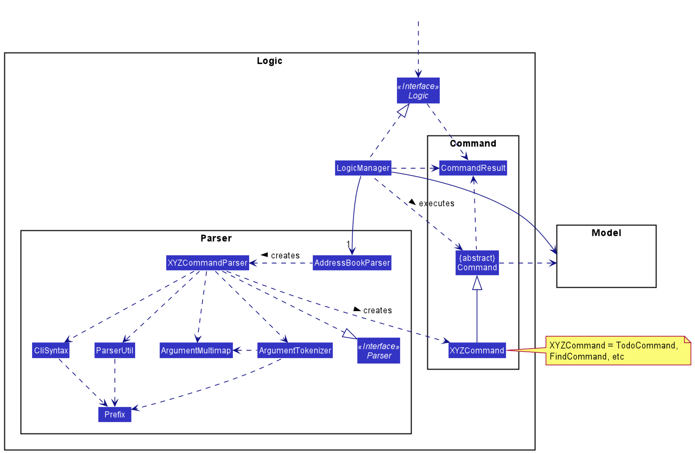
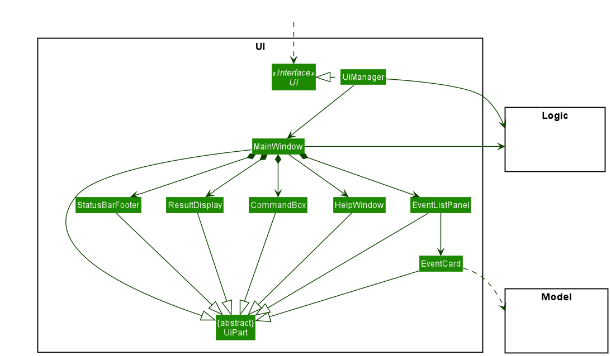
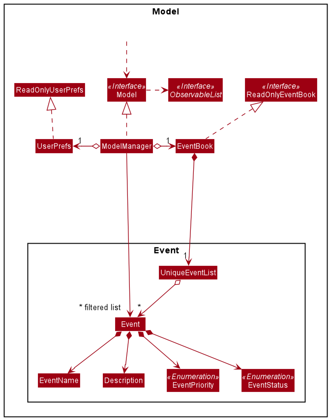
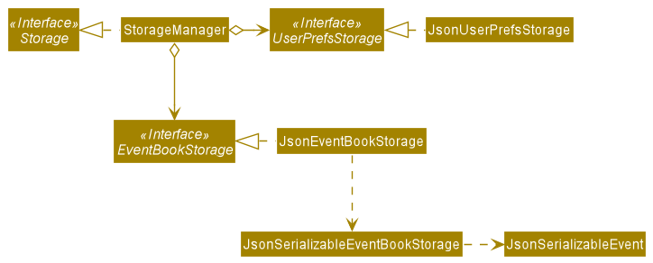

- Table of Contents
  {:toc}

---

## **Setting up, getting started**

Refer to the guide [_Setting up and getting started_](SettingUp.md).

---

## **Design**

### Architecture

The **_Architecture Diagram_** given above explains the high-level design of the App. Given below is a quick overview of each component.

:bulb: **Tip:** The `.puml` files used to create diagrams in this document can be found in the [diagrams](https://github.com/se-edu/addressbook-level3/tree/master/docs/diagrams/) folder. Refer to the [_PlantUML Tutorial_ at se-edu/guides](https://se-education.org/guides/tutorials/plantUml.html) to learn how to create and edit diagrams.

**`Main`** has two classes called [`Main`](https://github.com/se-edu/addressbook-level3/tree/master/src/main/java/seedu/address/Main.java) and [`MainApp`](https://github.com/se-edu/addressbook-level3/tree/master/src/main/java/seedu/address/MainApp.java). It is responsible for,

- At app launch: Initializes the components in the correct sequence, and connects them up with each other.
- At shut down: Shuts down the components and invokes cleanup methods where necessary.

[**`Commons`**](#common-classes) represents a collection of classes used by multiple other components.

The rest of the App consists of four components.

- [**`UI`**](#ui-component): The UI of the App.
- [**`Logic`**](#logic-component): The command executor.
- [**`Model`**](#model-component): Holds the data of the App in memory.
- [**`Storage`**](#storage-component): Reads data from, and writes data to, the hard disk.

Each of the four components,

- defines its _API_ in an `interface` with the same name as the Component.
- exposes its functionality using a concrete `{Component Name}Manager` class (which implements the corresponding API `interface` mentioned in the previous point.

For example, the `Logic` component (see the class diagram given below) defines its API in the `Logic.java` interface and exposes its functionality using the `LogicManager.java` class which implements the `Logic` interface.

**How the architecture components interact with each other**

The _Sequence Diagram_ below shows how the components interact with each other for the scenario where the user issues the command `delete 1`.

The sections below give more details of each component.

### UI component

**API** :
[`Ui.java`](https://github.com/se-edu/addressbook-level3/tree/master/src/main/java/seedu/address/ui/Ui.java)

The UI consists of a `MainWindow` that is made up of parts e.g.`CommandBox`, `ResultDisplay`, `EventListPanel`, `StatusBarFooter` etc. All these, including the `MainWindow`, inherit from the abstract `UiPart` class.

The `UI` component uses JavaFx UI framework. The layout of these UI parts are defined in matching `.fxml` files that are in the `src/main/resources/view` folder. For example, the layout of the [`MainWindow`](https://github.com/se-edu/addressbook-level3/tree/master/src/main/java/seedu/address/ui/MainWindow.java) is specified in [`MainWindow.fxml`](https://github.com/se-edu/addressbook-level3/tree/master/src/main/resources/view/MainWindow.fxml)

The `UI` component,

- Executes user commands using the `Logic` component.
- Listens for changes to `Model` data so that the UI can be updated with the modified data.

### Logic component

**API** :
[`Logic.java`](https://github.com/se-edu/addressbook-level3/tree/master/src/main/java/seedu/address/logic/Logic.java)

1. `Logic` uses the `AddressBookParser` class to parse the user command.
1. This results in a `Command` object which is executed by the `LogicManager`.
1. The command execution can affect the `Model` (e.g. adding a todo event).
1. The result of the command execution is encapsulated as a `CommandResult` object which is passed back to the `Ui`.
1. In addition, the `CommandResult` object can also instruct the `Ui` to perform certain actions, such as displaying help to the user.

Given below is the Sequence Diagram for interactions within the `Logic` component for the `execute("delete 1")` API call.

:information_source: **Note:** The lifeline for `DeleteCommandParser` should end at the destroy marker (X) but due to a limitation of PlantUML, the lifeline reaches the end of diagram.

### Model component

**API** : [`Model.java`](https://github.com/se-edu/addressbook-level3/tree/master/src/main/java/seedu/address/model/Model.java)

The `Model`,

- stores a `UserPref` object that represents the user’s preferences.
- stores the event book data.
- exposes an unmodifiable `ObservableList<Event>` that can be 'observed' e.g. the UI can be bound to this list so that the UI automatically updates when the data in the list change.
- does not depend on any of the other three components.

### Storage component

**API** : [`Storage.java`](https://github.com/se-edu/addressbook-level3/tree/master/src/main/java/seedu/address/storage/Storage.java)

The `Storage` component,

- can save `UserPref` objects in json format and read it back.
- can save the event book data in json format and read it back.

### Common classes

Classes used by multiple components are in the `seedu.addressbook.commons` package.

---

## **Implementation**

This section describes some noteworthy details on how certain features are implemented.

### \[Proposed\] Priority feature

#### Proposed Implementation

The priority feature is an additional field in the Event class. It is implemented as an enumeration named EventPriority and consists of
a set of members named HIGH, MEDIUM, LOW and NONE. If the User decides not to add a priority to an event, NONE will be assigned as the priority.

The following class diagram illustrates how the priority feature is implemented:

#### Design consideration:

##### Aspect: Optional Priority

- **Alternative 1 (current choice):** Include NONE as an enum member

    - Pros: Easy to implement.
    - Cons: Events would have an additional field for priority even if there is no priority.
            May increase memory usage.

- **Alternative 2:** Include an additional constructor that takes in priority as an additional argument.
    - Pros: Will use less memory when no priority is assigned.
    - Cons: We must ensure that the implementation of each individual command are correct and uses the right constructor.

---

## **Documentation, logging, testing, configuration, dev-ops**

- [Documentation guide](Documentation.md)
- [Testing guide](Testing.md)
- [Logging guide](Logging.md)
- [Configuration guide](Configuration.md)
- [DevOps guide](DevOps.md)

---

## **Appendix: Requirements**

### Product scope

**Target user profile**:

- NUS Computing Student
- has a need to manage a significant number of contacts, schedule, and school timetable
- prefer desktop apps over other types
- can type fast
- prefers typing to mouse interactions
- is reasonably comfortable using CLI apps

**Value proposition**:
- Adding of various different types of events, such as, lectures, tutorials, recitations, labs, and tasks
- Adding of events to friends in the address book
- Ability to find a common timeslot where all your friends are available to meet based on their schedules added
- See events that are taken in conjunction with your friends
- Prioritize your tasks and events by assigning priorities to each event

### User stories

Priorities: High (must have) - `* * *`, Medium (nice to have) - `* *`, Low (unlikely to have) - `*`

| Priority | As a …​  | I want to …​                                              | So that I can…​                                                      |
| -------- | -------- | --------------------------------------------------------- | -------------------------------------------------------------------- |
| `* * *`  | new user | see usage instructions                                    | refer to instructions when I forget how to use the App               |
| `* * *`  | user     | add a new TODO event                                      | keep track of events that I have to work on                          |
| `* * *`  | user     | add a new BACKLOG event                                   | keep track of the events that I have upcoming                        |
| `* * *`  | user     | add a new IN PROGRESS event                               | keep track of the events that I am currently working on              |
| `* * *`  | user     | get an overview of all the events by status               | keep track of all events and what stages of completion they are in   |
| `* * *`  | user     | edit an existing event                                    |                                                                      |
| `* * *`  | user     | delete an existing event                                  |                                                                      |
| `* * *`  | user     | remove all existing tasks to make way for the next sprint | focus on tasks to work on in the new sprint                          |
| `* * *`  | user     |                                                           | get an overview of how busy the coming week is                       |
| `* *`    | user     | find an event by name                                     | locate specific events without scrolling through list                |
| `* *`    | user     | attach priorities to different events                     | manage time better by working on events with higher priorities first |

### Use cases

(For all use cases below, the System is Focuris and the Actor is the user, unless specified otherwise)

**Use case: Delete a events**

**MSS**

1.  Focuris currently shows a list of events
2.  User requests to delete a specific event in the list
3.  Focuris deletes the event

    Use case ends.

**Extensions**

- 1a. The list is empty.

  Use case ends.

- 2a. The given index is invalid.

  - 2a1. Focuris shows an error message.

    Use case resumes at step 2.

**Use case: Add an Event**

**MSS**

1.  Focuris currently shows a list of events
2.  User requests to add a Event
3.  Focuris adds the Event

    Use case ends.

**Extensions**

- 2a. The format to add a event is invalid.

  - 2a1. Focuris shows an error message.

    Use case resumes at step 1.

- 2b. The event already exists in Focuris.

  - 2b1. Focuris shows an error message.

    Use case resumes at step 1.

**Use case: Edit a event**

**MSS**

1.  Focuris currently shows a list of events
2.  User requests to edit a specific event in the list
3.  Focuris edits the event

    Use case ends.

**Extensions**

- 2a. The list is empty.

  Use case ends.

- 3a. The given index is invalid.

  - 3a1. Focuris shows an error message.

    Use case resumes at step 2.

- 3b. No fields are provided to edit.

  - 3b1. Focuris shows an error message.

    Use case resumes at step 2.

**Use case: Find a event**

**MSS**

1.  Focuris currently shows a list of events
2.  User requests to find a event
3.  Focuris shows a list of events whose names contain any of the given words

    Use case ends.

**Extensions**

- 2a. There is no such event with the given keyword

  Use case ends.

**Use case: Request help**

**MSS**

1.  User requests help
2.  Focuris shows a link to the User Guide.

    Use case ends.

**Use case: Show list of all events**

**MSS**

1.  User requests to list all events in Focuris
2.  Focuris shows all events

    Use case ends.

**Extensions**

- 2a. The list is empty.

  Use case ends.

**Use case: Clear all entries of events**

**MSS**

1.  User requests to clear all entries of events in Focuris
2.  Focuris clears the entries of events.

    Use case ends.

**Extensions**

- 1a. The list is already cleared.

  Use case ends.

**Use case: Exit Focuris**

**MSS**

1.  User requests to exit Focuris
2.  Focuris closes.

    Use case ends.

**Use case: Sorts Events by Priority**

**MSS**

1. User requests to sort list of events by priority
2. Focuris shows list of events sorted by priority

Use Case Ends.

**Extensions**

- 1. The list is empty

Use case ends.

### Non-Functional Requirements

1.  Should work on any _mainstream OS_ as long as it has Java `11` or above installed.
2.  Should be able to hold up to 1000 events without a noticeable sluggishness in performance for typical usage.
3.  A user with above average typing speed for regular English text (i.e. not code, not system admin commands) should be able to accomplish most of the tasks faster using commands than using the mouse.

_{More to be added}_

### Glossary

- **Mainstream OS**: Windows, Linux, Unix, OS-X
- **Private contact detail**: A contact detail that is not meant to be shared with others
- **Sprint**: A time-boxed iteration of a continuous development cycle, where a planned amount of work is completed by the team.

---

## **Appendix: Instructions for manual testing**

Given below are instructions to test the app manually.

:information_source: **Note:** These instructions only provide a starting point for testers to work on;
testers are expected to do more *exploratory* testing.

### Launch and shutdown

1. Initial launch

   1. Download the jar file and copy into an empty folder

   1. Double-click the jar file Expected: Shows the GUI with a set of sample contacts. The window size may not be optimum.

1. Saving window preferences

   1. Resize the window to an optimum size. Move the window to a different location. Close the window.

   1. Re-launch the app by double-clicking the jar file. 
      Expected: The most recent window size and location is retained.

1. _{ more test cases …​ }_

### Saving data

1. Dealing with missing/corrupted data files

   1. _{explain how to simulate a missing/corrupted file, and the expected behavior}_

1. _{ more test cases …​ }_
