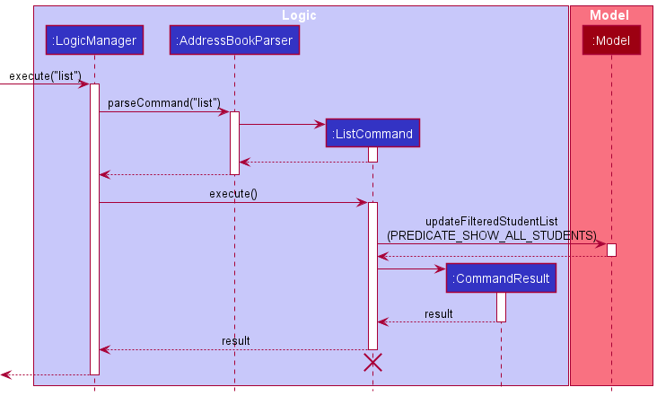
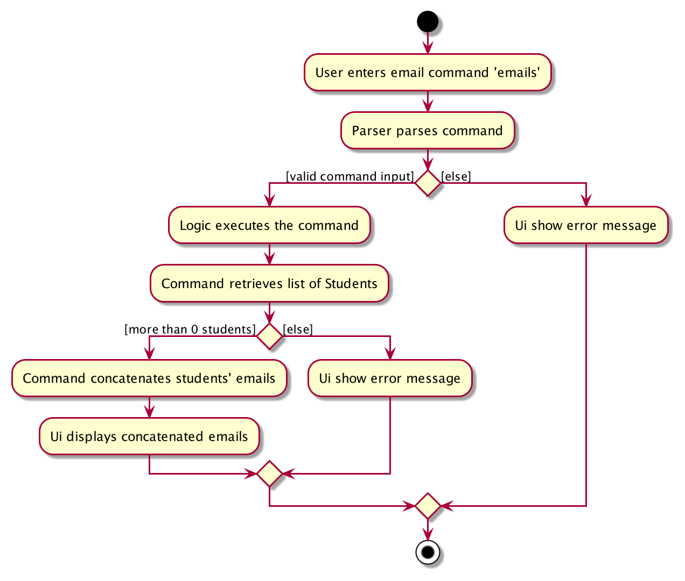
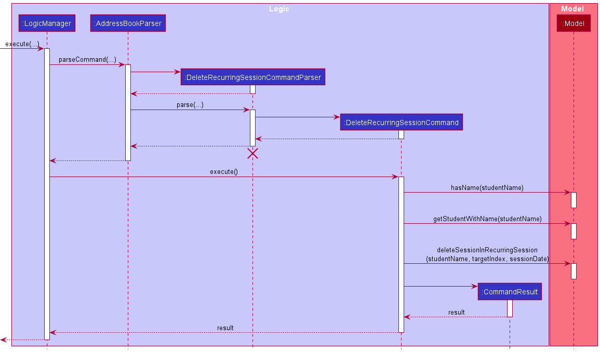
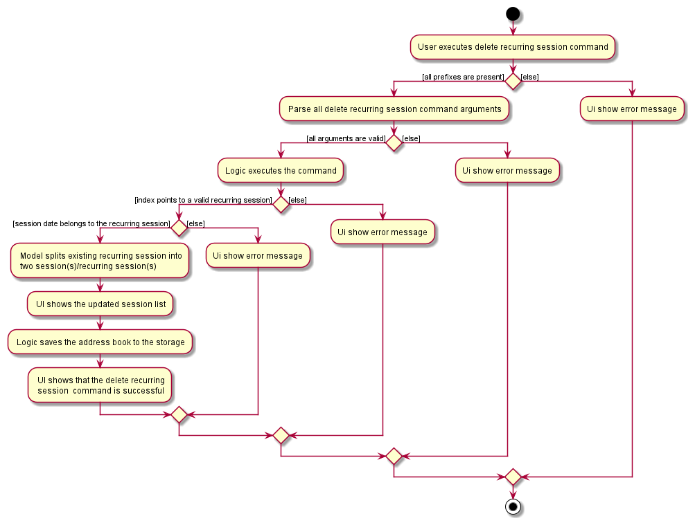

* Table of Contents
{:toc}

--------------------------------------------------------------------------------------------------------------------

## **Setting up, getting started**

Refer to the guide [_Setting up and getting started_](SettingUp.md).

--------------------------------------------------------------------------------------------------------------------

## **Design**

### Architecture

The ***Architecture Diagram*** given above explains the high-level design of the App. Given below is a quick overview of each component.

:bulb: **Tip:** The `.puml` files used to create diagrams in this document can be found in the [diagrams](https://github.com/AY2021S2-CS2103T-T11-1/tp/tree/master/docs/diagrams) folder. Refer to the [_PlantUML Tutorial_ at se-edu/guides](https://se-education.org/guides/tutorials/plantUml.html) to learn how to create and edit diagrams.

**`Main`** has two classes called [`Main`](https://github.com/AY2021S2-CS2103T-T11-1/tp/blob/master/src/main/java/seedu/address/Main.java) and [`MainApp`](https://github.com/AY2021S2-CS2103T-T11-1/tp/blob/master/src/main/java/seedu/address/MainApp.java). It is responsible for,
* At app launch: Initializes the components in the correct sequence, and connects them up with each other.
* At shut down: Shuts down the components and invokes cleanup methods where necessary.

[**`Commons`**](#common-classes) represents a collection of classes used by multiple other components.

The rest of the App consists of four components.

* [**`UI`**](#ui-component): The UI of the App.
* [**`Logic`**](#logic-component): The command executor.
* [**`Model`**](#model-component): Holds the data of the App in memory.
* [**`Storage`**](#storage-component): Reads data from, and writes data to, the hard disk.

Each of the four components,

* defines its *API* in an `interface` with the same name as the Component.
* exposes its functionality using a concrete `{Component Name}Manager` class (which implements the corresponding API `interface` mentioned in the previous point.

For example, the `Logic` component (see the class diagram given below) defines its API in the `Logic.java` interface and exposes its functionality using the `LogicManager.java` class which implements the `Logic` interface.

**How the architecture components interact with each other**

The *Sequence Diagram* below shows how the components interact with each other for the scenario where the user issues with any command.

The sections below give more details of each component.

### UI component
Figure 4: Class Diagram of UI Component

**API** :
[`Ui.java`](https://github.com/AY2021S2-CS2103T-T11-1/tp/blob/master/src/main/java/seedu/address/ui/Ui.java)

The UI consists of a `MainWindow` that is made up of parts e.g.`CommandBox`, `ResultDisplay`, `StudentListPanel`, `StatusBarFooter` etc. All these, including the `MainWindow`, inherit from the abstract `UiPart` class.

The `UI` component uses JavaFx UI framework. The layout of these UI parts are defined in matching `.fxml` files that are in the `src/main/resources/view` folder. For example, the layout of the [`MainWindow`](https://github.com/AY2021S2-CS2103T-T11-1/tp/blob/master/src/main/java/seedu/address/ui/MainWindow.java) is specified in [`MainWindow.fxml`](https://github.com/AY2021S2-CS2103T-T11-1/tp/blob/master/src/main/resources/view/MainWindow.fxml)

The `UI` component,

* Executes user commands using the `Logic` component.
* Listens for changes to `Model` data so that the UI can be updated with the modified data.

### Logic component

**API** :
[`Logic.java`](https://github.com/AY2021S2-CS2103T-T11-1/tp/blob/master/src/main/java/seedu/address/logic/Logic.java)

1. `Logic` uses the `AddressBookParser` class to parse the user command.
1. This results in a `Command` object which is executed by the `LogicManager`.
1. The command execution can affect the `Model` (e.g. adding a student).
1. The result of the command execution is encapsulated as a `CommandResult` object which is passed back to the `Ui`.
1. In addition, the `CommandResult` object can also instruct the `Ui` to perform certain actions, such as displaying help to the user.

Given below is the Sequence Diagram for interactions within the `Logic` component for the `execute("delete_student 1")` API call.

:information_source: **Note:** The lifeline for `DeleteCommandParser` should end at the destroy marker (X) but due to a limitation of PlantUML, the lifeline reaches the end of diagram.

### Model component

**API** : [`Model.java`](https://github.com/AY2021S2-CS2103T-T11-1/tp/blob/master/src/main/java/seedu/address/model/Model.java)

The `Model`,

* stores a `UserPref` object that represents the user’s preferences.
* stores the address book data.
* exposes an unmodifiable `ObservableList<Student>` that can be 'observed' e.g. the UI can be bound to this list so that the UI automatically updates when the data in the list change.
* does not depend on any of the other three components.

### Storage component

**API** : [`Storage.java`](https://github.com/AY2021S2-CS2103T-T11-1/tp/blob/master/src/main/java/seedu/address/storage/Storage.java)

The `Storage` component,
* has the ability to save `UserPref` objects in JSON format and parse it back to an object after.
* has the ability to save `Student` objects in JSON format, nested with its associated list of `Session` or `RecurringSession` objects, and parse it back after.

### Common classes

Classes used by multiple components are in the `seedu.addressbook.commons` package.

--------------------------------------------------------------------------------------------------------------------

## **Implementation**

This section describes some noteworthy details on how certain features are implemented.

### General
#### List Feature
The list feature displays a list of existing students, and a list of sessions of those students in the TutorBuddy application.

##### Implementation
This feature is facilitated by `ListCommand` which extends `Command`.
The method `ListCommand#execute` updates the filtered student list, and the filtered session list by calling the method
`Model#updateFilteredStudentList` exposed in the `Model` interface.

Given below is an example of how the list student
1. The user executes the list command with the input `list`.
2. `LogicManager` executes the input and parses the command using `AddressBookParser`.
3. `AddressBookParser` identifies the correct command and creates a new `ListCommand`.
4. `AddressBookParser` returns the new `ListCommand` to `LogicManager`.
5. `LogicManager` executes the `ListCommand`.
6. `ListCommand` now calls `Model` to update the `filteredStudents` and  to show all students.

The following sequence diagram shows the interactions when user executes the `list` command:

:information_source: **Note:** The lifeline for `ListCommand` should end at the destroy marker (X) but due to a limitation of PlantUML, the lifeline reaches the end of diagram.

The following activity diagram summarizes what happens when a user executes the `list` command.

### Students
Students in TutorBuddy is facilitated by the `Student` class which stores specific details of
a `student` within one `student` object. Students are not allowed to have duplicated names.

#### Add Student Feature
The add student feature allows user to add a student to the TutorBuddy Application.

##### Implementation
This feature makes use of `AddStudentCommandParser` and `AddStudentCommand` to create a new `Student` object. The operation can be accessed in the Model interface through `Model#addStudent()`.

Given below is an example of how the add student mechanism runs:
1. The user executes the add student command with the command word `add_student` and include all the information required.
2. `LogicManager` starts executing and parses the command using `AddressBookParser`.
3. `AddressBookParser` recognises the command and runs the `AddStudentCommandParser` class.
4. `AddStudentCommandParser` then validates the information, and creates a new `Student` object.
5. `AddStudentCommandParser` also creates a new `AddStudentCommand` with the previously created `Student` object as parameter.
6. The command is returned to `LogicManager` which then executes the command.
7. `ModelManager` adds the student to the `AddressBook`.
8. `ModelManager` adds the student to `filteredStudents` list.
9. `Logic` saves the `AddressBook` data in the `Storage`.

The following activity diagram summarizes what happens when a user executes the `add_student` command.

The following sequence diagram summarizes what happens when a user executes the `add_student` command:

#### Delete Student Feature
The delete student feature allows user to delete a student from the TutorBuddy Application.

##### Implementation
The delete student feature is implemented similarly to the add student feature. However, it makes use of the
`DeleteStudentCommandParser` and `DeleteStudentCommand` instead to delete the student from the student list. 
The command word to use is `delete_student`. In step 4, it only validates the information and do not create a new 
`student` object. In step 7 and 8, instead of adding the student to the `AddressBook` and
`filteredStudents`, we remove the student instead.

#### Edit Student Feature
The edit student feature allows user to edit a student profile from the TutorBuddy Application.

##### Implementation
The edit student feature is implemented similarly to the add student feature. However, it makes use of the
`EditStudentCommandParser` and `EditStudentCommand` instead to edit the student from the student list.
The command word to use is `edit_student`. In step 4, it only validates the information, determine the fields to be edited, 
but it does not create a new `student` object. In step 7 and 8, instead of adding the student to the `AddressBook` and
`filteredStudents`, we update the student list instead.

#### Find Student Feature
The find student feature allows user to specific keywords in relation to the student's name in the application.
TutorBuddy will then filter the student list based on given keyword.

##### Implementation
The find student feature is implemented similarly to the add student feature. However, it makes use of the
`FindStudentCommandParser` and `FindStudentCommand` instead to edit the student from the student list.
The command word to use is `find_student`. In step 4, it only validates the information, determine the keywords,
but it does not create a new `student` object. In step 7 and 8, instead of adding the student to the `AddressBook` and
`filteredStudents`, we only update the `filteredStudents` list instead based on the given keywords.

#### List Students' Email Feature
The list students' email feature allows the end-user to retrieve a list of students' emails, which are concatenated with
a semi-colon `;`. This allows for easy copy and pasting to e-mail applications, such as Microsoft Outlook, for mass
e-mail purposes (e.g. newsletter).

##### Implementation
This feature is mainly supported by `EmailCommand`, with retrieval of students' emails through the Model interface
`Model#getFilteredStudentList()`.

Below is an example of how the list students' email mechanism works:
1. The user executes the list students' emails command with the command `emails`
2. `LogicManager` receives the command, and hands off the parsing of command to `AddressBookParser`
3. `AddressBookParser` recognises the command and creates a new `EmailCommand`
4. `EmailCommand` is returned back to `LogicManager`, which then executes the command through `EmailCommand#execute()`
5. Upon `EmailCommand#execute()`, a list of `Student` are retrieved through `Model#getFilteredStudentList()`
6. The list of `Student` emails are then concatenated with ';' into a `String`
7. The concatenated `String` is then returned to `LogicManager` as a new `CommandResult`
8. The `CommandResult` containing the concatenated email is then displayed to the user through `ResultDisplay`

The following activity diagram summarizes what happens when a user executes the `emails` command:

The following sequence diagram summarizes what happens when a user executes the `emails` command:

### Session
Sessions in TutorBuddy is facilitated by the `Session` class which stores specific details of
a tuition session with one student. Each session is composed within a `Student`,
and a `Student` can have multiple `Session`s.

#### Add Session Feature
The add session feature allows users to add individual tuition sessions with specific details of each session.

This section explains the implementation of the `add_session` mechanism and highlights the design considerations taken into account when implementing this feature.

##### Implementation
The creation of a session is facilitated by `AddSessionCommand` and it extends `Command`. The method,
`AddSessionCommand#execute()`, performs a validity check on student name input and session details input by the user
before adding the session.

The following sequence diagram shows the interactions between the Model and Logic components during the execution of
an `AddSessionCommand` with user input `add_session n/STUDENT_NAME d/DATE t/TIME k/DURATION s/SUBJECT f/FEE`:

1. `Logic` uses the `AddressBookParser` class to parse the user command.
2. A new instance of an `AddSessionCommand` would be created by the `AddSessionCommandParser` and returned to `AddressBookParser`.
3. `AddressBookParser` encapsulates the `AddSessionCommand` object as a `Command` object which is executed by the `LogicManager`.
4. The command execution calls `hasStudent(name)` and `hasSession(name, sessionToAdd)` to validate the inputs before calling
   `addSession(name, sessionToAdd)` which adds the session to the specific student.
5. The result of the command execution is encapsulated as a `CommandResult` object which is passed back to the Ui.

##### Design Considerations
Aspect 1: Type of input for `AddSessionCommand`
* **Alternative 1 (current choice)**: Using student name to identify the student to add the session to.
    * Pros:
        * Easier for user to add sessions without constantly having to refer to the application for student id
    * Cons:
        * Slows down user since name takes longer to type than index.

* **Alternative 2**: Using student index to identify the student to add the session to.
    * Pros:
        * Allows fast entering of input.
    * Cons:
        * User has to constantly refer to the application for student index id.

Alternative 1 was chosen because the cons of implementing alternative 2 outweighs the benefits derived from it. Student index id may change when
a user adds a new student into the AddressBook. If the AddressBook contains many students, it may take some time for the user to find the
updated student index id. Student name on the other hand, stays constant throughout the application lifetime unless the user edits this information,
which he also has knowledge of. Therefore, student name can be easily entered without reference to the AddressBook, saving much more time compared
to alternative 2.

#### Delete Session Feature
The `DeleteSessionCommand` does the opposite of `AddSessionCommand` -- it calls `Model#deleteSession(studentName, sessionIndex)` instead
which calls `AddressBook#removeSession(studentName, sessionIndex)` and
`UniqueStudentList#deleteSession(targetStudent, sessionIndex)`.

The following sequence diagram shows how deleting a session works:

It shares the same design considerations as what is mentioned in Add Session Feature.

#### Delete Recurring Session Feature
The delete recurring session feature allows users to remove a single session from an existing recurring session.

This section explains the implementation of the `delete_rec_session` command and highlights the design considerations
taken into account when implementing this feature.

##### Implementation

The deletion of a single session in an existing recurring session is facilitated by the `DeleteRecurringSessionCommand` and it extends `Command`.
The method `DeleteRecurringSessionCommand#execute()` performs a validity check on the student name, target index, and session date to be deleted
before deleting the single session.

The following sequence diagram shows the interactions between the Model and Logic components during the execution of a `DeleteRecurringSessionCommand`
with user input `delete_rec_session n/STUDENT_NAME i/SESSION_INDEX d/DATE`:

:information_source: **Note:** The lifeline for `DeleteRecurringSessionCommandParser` should end at the destroy marker (X) but due to a limitation of PlantUML, the lifeline reaches the end of diagram.

1. `Logic` uses the `AddressBookParser` class to parse the user command.
2. A new instance of a `DeleteRecurringSessionCommand` would be created by the `DeleteRecurringSessionCommandParser` and returned to `AddressBookParser`.
3. `AddressBookParser` encapsulates the `DeleteRecurringSessionCommand` object as a `Command` object which is executed by the `LogicManager`.
4. The execution calls `hasName(studentName)` to validate an existing student in TutorBuddy, and `hasSessionOnDate(sessionDate)` to validate
   the session date belongs to a recurring session.
5. It also calls `getStudentWithName(studentName)` to get the student name before calling `deleteSessionInRecurringSession(studentName, targetIndex, sessionDate)`
which splits the recurring session into two recurring session(s)/session(s), one exclusively before the session date, and another exclusively after the session date.
6. The result of the command execution is encapsulated as a `CommandResult` object which is passed back to the Ui to display the updated list of sessions.

The following activity diagram summarizes what happens when a user executes the `delete_rec_session` command.

##### Design Considerations
Aspect 1: Exclusion of the single session from the recurring session
* **Alternative 1 (current choice)**: Splits the recurring session into two recurring session(s)/session(s), one
  exclusively before the session date, and another exclusively after the session date.
    * Pros:
        * Easier for user to keep track of their sessions since they only need to read the start and end date of the recurring sessions.
        * Easier to handle session entries when displaying recurring sessions in `Calendar`, `Reminders`, and `Fees` components.
    * Cons:
        * More work required for TutorBuddy to execute the splitting of sessions.

* **Alternative 2**: Store a `List<SessionDate>` inside of each `Session` for excluded sessions.
    * Pros:
        * Allows quick exclusion of session dates since we only need to store the session date in the session.
    * Cons:
        * Requires a lot of book-keeping when displaying recurring sessions in `Calendar`, `Reminders`, and `Fees` components.
        * Tedious for user to keep track of their sessions by regularly checking if the date is excluded.
    
Alternative 1 was chosen because of the pros of implementing alternative 1 outweighs the cons that comes along with it.
Although it requires TutorBuddy to do more of the processing work to split the recurring session, it makes it easier to
display recurring sessions in the Calendar view, display upcoming recurring sessions in reminders, and calculation of fees.
It also makes it more intuitive and convenient for the user to see if a recurring session occurs on a certain date without
having to check if the date is excluded when they refer to the `Tuition` page.

### Monthly Fees
Monthly Fees in TutorBuddy is calculated based on the session `fee`. It makes uses of the FeeUtil static method
to perform the calculation.

#### Calculating Monthly Fee Feature
The monthly `fee` feature allows user to quickly calculate the amount of money they should have received
from a particular student in a given month and year.

This section explains the implementation of the `fee` command and highlights the design considerations taken into account when implementing this feature.

##### Implementation
The calculation of the fees is facilitated by the `GetMonthlyFeeCommand` and it extends `Command`. The method,
`GetMonthlyFeeCommand#execute()`, performs a validity check on student name input to ensure that the student name exists in the application.

The following sequence diagram shows the interactions between the Model, Logic and FeeUtil components during the execution of
an `GetMonthlyFeeCommand` with user input `fee n/STUDENT_NAME m/MONTH y/YEAR`:

1. `Logic` uses the `AddressBookParser` class to parse the user command.
2. A new instance of an `GetMonthlyFeeCommand` would be created by the `GetMonthlyFeeCommandParser` and returned to `AddressBookParser`.
3. `AddressBookParser` encapsulates the `AddSessionCommand` object as a `Command` object which is executed by the `LogicManager`.
4. The command execution calls `hasStudent(name)` to validate the inputs.
5. The command execution the calls the `getFeePerStudent(student, startPeriod, endPeriod)` static method in `FeeUtil` and perform the calculation.  
6. The calculation result of the command execution is encapsulated as a CommandResult object which is passed back to the Ui.

#### Design Considerations
Aspect 1: Calculation for the fees
* **Alternative 1 (current choice)**: Abstracting out the calculation to a common file such as `FeeUtil`.
    * Pros:
        * Ensures the "don't repeat yourself" software development principle by allowing both this command, and the 3 monthly fee feature to make use of the same methods in `FeeUtil`.
        * Potentially easier to be maintained by further developer.
    * Cons:
        * Increases coupling.

* **Alternative 2**: Performing the calculation inside `GetMonthlyFeeCommand`.
    * Pros:
        * Reduces coupling.
    * Cons:
        * Repeated code and increased difficult for maintenance when there is a need to update the calculation algorithm.

Alternative 1 was chosen because the pros of implementing alternative 1 outweighs the cons derived from it. By having
an abstracted `FeeUtil` method, we will only need to update the methods in `FeeUtil` which will have a rippling effect
to the rest of the features that uses this method. This allows the UI to make use of the `FeeUtil` methods when calculating the 
3 months fees as well. Although this results in increased coupling, with proper testing in place, we could mitigate the risk 
as we ensure that changes in the `FeeUtil` method do not unintentionally changes the behaviour of the other feature.

--------------------------------------------------------------------------------------------------------------------

## **Documentation, logging, testing, configuration, dev-ops**

* [Documentation guide](Documentation.md)
* [Testing guide](Testing.md)
* [Logging guide](Logging.md)
* [Configuration guide](Configuration.md)
* [DevOps guide](DevOps.md)

--------------------------------------------------------------------------------------------------------------------

## **Appendix: Requirements**

### Product scope

**Target user profile**: An independent tutor

* has a need to manage a significant number of student contacts (100 - 200)
* prefers desktop apps over other types
* can type fast (80 _WPM_ and above)
* prefers typing to mouse interactions
* is reasonably comfortable using CLI apps

**Value proposition**:
* All in one platform to manage their students’ contacts
* Provide a quick overview of scheduled tuition sessions
* Handle monthly tuition fees calculation

### User stories

Priorities: High (must have) - `* * *`, Medium (nice to have) - `* *`, Low (unlikely to have) - `*`

| Priority | As a …​                                 | I want to …​                                   | So that I can…​                                           |
| -------- | ------------------------------------------ | ------------------------------------------------- | ------------------------------------------------------------ |
| `* * *`  | user                                       | create a student's profile                        | keep track of my student's information                       |
| `* * *`  | user                                       | see the profile of a particular student           | get their information                                        |
| `* * *`  | user                                       | remove a student's profile                        | keep track of only students that I teach                     |
| `* * *`  | user                                       | edit the details of a student                     | keep track of up-to-date information                         |
| `* * *`  | user                                       | add individual tuition sessions                   | keep track of my tuition sessions                            |
| `* * *`  | busy user                                  | add recurring tuition sessions                    | save time by creating multiple sessions in one command       |
| `* * *`  | user                                       | delete a non-recurring tuition session            | update my tuition schedule                                   |
| `* * *`  | user                                       | delete the entire recurring session               | update my tuition schedule                                   |
| `* * *`  | user                                       | delete a single session from a recurring session  | update cancelled tuition session                             |
| `* * *`  | user                                       | see a list of all the students profile and sessions|                                                             |
| `* * *`  | user                                       | get all the emails of the parent of my students'  | email them reminders for payment                             |
| `* * *`  | user                                       | calculate the monthly fees of a particular student| use the information when collecting monthly fees             |
| `* * *`  | user                                       | get the monthly fees that I would have received for the past 3 months    | manage my finance better              |
| `* * *`  | forgetful user                             | see a list of upcoming sessions                   | be aware of my teaching schedule for the next few days       |
| `* * *`  | user teaching many lessons                 | see my schedule in a calendar view                | have an overview of my hectic schedules at a glance          |
| `* *`    | new user                                   | get a list of commands of the application         | know at a glance what are the features of the application    |
| `* *`    | potential user                             | see the app populated with sample data on the first run  | try using the features easily                         |
| `* *`    | new user                                   | purge all current data                            | get rid of sample/current data I used for exploring the app  |
| `* *`    | user                                       | exit the application                              |                                                              |

*{More to be added}*

### Use cases

*(For all use cases, the **System** is the TutorBuddy Application, **Actor** is the user, and the **Precondition** is that the application has already been opened, unless otherwise specified)*

**Use case: UC01 - Create a student profile**

MSS:

1. User enters the `add_student` command, together with the student details.
2. TutorBuddy creates the profile in the background.
3. TutorBuddy displays the success message.

    Use case ends.

Extensions:

* 1a. TutorBuddy detects an error in the entered data.
    * 1a1. TutorBuddy displays an error message.

    Use case ends.

**Use case: UC02 - Find a student’s profile**

MSS:

1. User enters the `find_student` command, along with a keyword from the student’s name.
2. TutorBuddy displays all students’ profiles matching the keyword if any.

   Use case ends.

Extensions:

* 1a. TutorBuddy detects empty keyword field
    * 1a1. TutorBuddy displays an error message for no keyword specified.

  Use case ends.

**Use case: UC03 - Delete a student profile**

MSS:

1. User enters the `delete_student` command, along with the student’s name.
2. TutorBuddy verifies that the inputs are valid and student profile exists.
3. TutorBuddy displays a success message.

   Use case ends.

Extensions:

* 2a. TutorBuddy detects an error in the input.
    * 2a1. TutorBuddy displays an error message to the user.

  Use case ends.

**Use case: UC04 - Edit student details**

MSS:

1. User enters the `edit_student` command with the appropriate input.
2. TutorBuddy verifies that the inputs are valid and student profile exists.
3. TutorBuddy edits the student information.
4. TutorBuddy displays a success message.

   Use case ends.

Extensions:

* 2a. TutorBuddy detects an error in the input.
    * 2a1. TutorBuddy displays an error message to the user.
    
  Use case ends.

**Use case: UC05 - Create a session**

MSS:

1. User enters the `add_session` command, together with the session details.
2. TutorBuddy verifies that the student exists, and the inputs are valid.
3. TutorBuddy creates the session.
4. TutorBuddy displays a success message.

   Use case ends.

**Extensions:**

* 2a. TutorBuddy detects an error in the input.
    * 2a1. TutorBuddy displays an error message to the user.

  Use case ends.

* 2b. TutorBuddy detects another overlapping session that the user has in the same timeframe.
    * 2b1. TutorBuddy prompts an error and requests for the correct data.

  Use case ends.

**Use case: UC06 - Create a recurring session**

MSS:

1. User enters the `add_rec_session` command, together with the session details.
2. TutorBuddy verifies that the student exists, and the inputs are valid.
3. TutorBuddy creates the recurring session.
4. TutorBuddy displays a success message.

   Use case ends.

**Extensions:**

* 2a. TutorBuddy detects an error in the input.
    * 2a1. TutorBuddy displays an error message to the user.

  Use case ends.

* 2b. TutorBuddy detects another overlapping session that the user has in the same timeframe.
    * 2b1. TutorBuddy prompts an error and requests for the correct data.

  Use case ends.

**Use case: UC07 - Delete a session or the entire recurring session**

MSS:

1. User enters the `delete_session` command with the appropriate inputs.
2. TutorBuddy verifies that the student exists, and the inputs are valid.
3. TutorBuddy deletes the session.
4. TutorBuddy displays a success message.

   Use case ends.

**Extensions:**

* 2a. TutorBuddy detects an error in the input.
    * 2a1. TutorBuddy displays an error message to the user.

  Use case ends.

**Use case: UC08 - Delete a single session from a recurring session**

MSS:

1. User enters the `delete_rec_session` command with the appropriate inputs.
2. TutorBuddy verifies that the student exists, and the inputs are valid.
3. TutorBuddy deletes the single session and splits up the remaining session into 2 recurring sessions (Before and After).
4. TutorBuddy displays a success message.

   Use case ends.

**Extensions:**

* 2a. TutorBuddy detects an error in the input.
    * 2a1. TutorBuddy displays an error message to the user.

  Use case ends.

**Use case: UC09 - List all students and sessions**

MSS:

1. User enters the `list` command.
2. TutorBuddy shows all the students and sessions information on the `tuition` tab.

   Use case ends.

**Use case: UC10 -  Getting the emails from the application**

MSS:

1. User enters the command to get the email from TutorBuddy.
2. TutorBuddy returns a list of all the email addresses to the user.
3. User copies the email address given.

   Use case ends.

**Use case: UC11 - Calculate fee for a student of a particular month and year**

MSS:

1. User enters the `fee` commands with the appropriate inputs.
2. TutorBuddy verifies that the inputs are valid and student profile exists.
3. TutorBuddy shows the calculated fees to the user.

   Use case ends.

Extensions:

* 2a. TutorBuddy detects an error in the input.
    * 2a1. TutorBuddy displays an error message to the user.

  Use case ends.

**Use case: UC12 - View 3 months monthly fee**

MSS:

1. User toggles to the `Home` tab.
2. TutorBuddy shows the monthly fee that the user would have received for the past 3 months based on current sessions in the application.

   Use case ends.

**Use case: UC13 - Reminders for upcoming sessions**

MSS:

1. User toggles to the `Home` tab.
2. TutorBuddy shows a list of upcoming sessions that would happen, within the next 3 days.

   Use case ends.

**Use case: UC14 - Calendar View**

MSS:

1. User toggles to the `Calendar` tab.
2. TutorBuddy shows a calendar representation of the sessions, showing the schedule of the current week.

   Use case ends.

Extensions:

* 2a. User can toggle between the different weeks using the left and right button in the Calendar page.

* 2b. User can toggle directly move to this week's schedule by clicking on the `Today` button.

  Use case ends.

**Use case: UC15 - Show help**

MSS:

1. User enters the `help` command.
2. TutorBuddy displays a help window that contains a list of commands available on the application, and a link to our user guide.

   Use case ends.

**Use case: UC16 - Sample data for new users**

MSS:

1. A new user opens up the application.
2. TutorBuddy detects that the user does not have a .json file in the data folder.
3. TutorBuddy is populated with sample students and sessions data.

   Use case ends.

**Use case: UC17 - Clear data**

MSS:

1. User enters the `clear` command.
2. TutorBuddy deletes all the current data from the application.

   Use case ends.

**Use case: UC18 - Exit application**

MSS:

1. User enters the `exit` command.
2. TutorBuddy closes.

   Use case ends.

*{More to be added}*

### Non-Functional Requirements
* Technical requirements:
    * TutorBuddy should work on both 32-bit and 64-bit environments.
    * TutorBuddy should work on any _mainstream OS_ with Java `11` or above installed.
    * The user should have enough memory on their computer to ensure that data will be stored in the application without errors.
* Performance requirements:
    * TutorBuddy should be able to hold up to _500 students_ or _500 sessions_ without a noticeable dip in performance for typical usage.
    * Response time from any command should be within 1 second.
* Constraints:
    * TutorBuddy should be backward compatible with data produced by earlier versions of the system.
* Quality requirements:
    * The user should take no longer than 1 hour to learn the different functionalities of TutorBuddy from the user guide.
* Process requirements:
    * TutorBuddy should be completed before AY20/21 Week 13
* Any other noteworthy points:
    * A user with above average typing speed (80 _WPM_ and above) for regular English text (i.e. not code, not system admin commands) should be able to use most of the functionalities in TutorBuddy faster using commands rather than using the mouse.

### Glossary

* **Mainstream OS**: Windows, Linux, Unix, OS-X
* **CLI**: Command Line Interface where users can interact with their OS system.
* **MSS**: Main Success Scenario
* **WPM**: Words Per Minute

--------------------------------------------------------------------------------------------------------------------

## **Appendix: Instructions for manual testing**

Given below are instructions to test the app manually.

:information_source: **Note:** These instructions only provide a starting point for testers to work on;
testers are expected to do more *exploratory* testing.

### General

#### Launching TutorBuddy
1. Download the jar file and copy into an empty folder
1. Double-click the jar file 
   Expected: Shows the GUI with sample students and tuition sessions. The window size may not be optimum.

#### Saving Window Preferences
1. Resize the window to an optimum size (Note that TutorBuddy has a resolution size limit). Move the window to a different location. 
   Close the window.
1. Re-launch the app by double-clicking the jar file. 
   Expected: The most recent window size and location is retained.

#### Clearing all data

:information_source: **WARNING:** Do not clear all data if you have important information in TutorBuddy!

1. Prerequisites: None.
1. Test case: `clear` 
   Expected: Student list view and Session list view becomes empty.
1. To get back the sample data in TutorBuddy, simply delete the data folder in the home folder and restart TutorBuddy.

#### Listing all students and sessions
1. Prerequisites: None.
1. Test case: `list` 
   Expected: On the Tuition tab, all students and sessions will be displayed in the Student list view and Session list view respectively.

### Managing Students

#### Adding a student
1. Prerequisites: None.
1. Test case: `add_student n/John Doe p/98765432 e/johnd@example.com a/John street, Block 123, #01-01 l/Sec2 g/95421323 r/Mother` 
   Expected: The student with the fields entered should be added into the Student view list on the Tuition tab.
1. Incorrect commands to try: `add_student n/John Doe`, `add_student n/John Doe p/28765432 e/johnd@example.com a/John street, Block 123, #01-01 l/Sec2 g/9542 r/Mother` 
   Expected: No student is added. Error details shown in the status message.

#### Finding a student
1. Prerequisites: There must be at least 1 student with the name `Alex` currently displayed on the Student view list.
1. Test case: `find_student alex` 
   Expected: Displays all students that has name matching to the keyword `alex` (case-insensitive).
1. Test case: `find_student alex yu` 
   Expected: Displays all students that has name matching to the keyword `alex` or `yu` (case-insensitive).
1. Incorrect command to try: `find_student` 
   Expected: Student view list does not get updated. Error details shown in the status message.

#### Editing a student
1. Prerequisites: There must be at least 1 student currently displayed on the Student view list.
1. Test case: `edit_student 1 p/99999999` 
   Expected: The first student displayed in the Student view list his/her `Phone` field changed to `99999999`.
1. Incorrect commands to try: `edit_student` or `edit_student x` (where x is larger than the size of the student list)  
   Expected: No student is edited. Error details shown in the status message.

#### Deleting a student
1. Prerequisites: There must be at least 1 student currently displayed on the Student view list.
1. Test case: `delete_student 1` 
   Expected: First student deleted from the list. Details of the deleted student shown in the status message.
1. Incorrect commands to try: `delete_student 0` or `delete_student x` (where x is larger than the size of the student list)  
   Expected: No student is deleted. Error details shown in the status message.

### Managing Sessions

#### Adding a session
1. Prerequisites: There must be at least 1 student named `Alex Yeoh` currently displayed on the Student view list.
1. Test case: `add_session n/Alex Yeoh d/2021-04-10 t/12:00 k/120 s/Math f/100` 
   Expected: The session with the fields will be added to the Session list view under the Student's name. The session will have a light blue "I" labelled
   at the bottom right of the session card. If this session falls within 3 days from the current day (today, tomorrow, day after tomorrow),
   this session will be displayed in the reminder list view on the Home tab.
1. Incorrect commands to try: `add_session` or `add_session n/Alex Yeoh d/10-04-2021 t/12:00 k/120 s/Math f/100`  
   Expected: No session is added. Error details shown in the status message.

#### Adding a recurring session
1. Prerequisites: There must be at least 1 student named `Alex Yeoh` currently displayed on the Student view list.
1. Test case: `add_rec_session n/Alex Yeoh d/2021-04-10 e/2021-06-26 b/7 t/12:00 k/120 s/Math f/100` 
   Expected: The session with the fields will be added to the Session list view under the Student's name. The session will have a orange "R" labelled
   at the bottom right of the session card. If there is a session that falls within 3 days from the current day (today, tomorrow, day after tomorrow),
   this session will be displayed in the reminder list view on the Home tab.
1. Incorrect commands to try: `add_rec_session` or `add_rec_session n/Alex Yeoh d/2021-04-10 e/2021-06-28 b/7 t/12:00 k/120 s/Math f/100`  
   Expected: No recurring session is added. Error details shown in the status message.

#### Deleting a session or recurring session
1. Prerequisites: There must be at least 1 session or recurring session for the student named `Alex Yeoh`.
1. Test case: `delete_session n/Alex Yeoh i/1` 
   Expected: First session from Alex Yeoh will be deleted from the list. Details of the deleted session shown in the status message.
1. Incorrect commands to try: `delete_session n/anonymous i/1` (name does not exist in the student list) or
   `delete_session n/Alex Yeoh i/x` (where x is larger than the size of the session list for `Alex Yeoh`)  
   Expected: No session is deleted. Error details shown in the status message.

#### Deleting a single session from a recurring session
1. Prerequisites: There must be at least 1 student named `Alex Yeoh` currently displayed on the Student view list.
1. Test case: Firstly, add the recurring session with this command: `add_rec_session n/Alex Yeoh d/2021-04-10 e/2021-04-15 b/1 t/10:00 k/60 s/Math f/100`.
   Next, delete the single session with this command: `delete_rec_session n/John Doe i/x d/2021-04-12`(where x is the index of the recurring session). 
   Expected: Two recurring sessions will be displayed on the Session list view for `Alex Yeoh` with the first session that starts on `2021-04-10` that ends on `2021-04-11`
   and the second session that starts on `2021-04-13` that ends on `2021-04-15`.
1. Incorrect commands to try: `delete_rec_session` or `delete_rec_session n/anonymous` (name does not exist in the student list) 
   Expected: No single session is deleted. Error details shown in the status message.

### Managing Fees

#### Checking a monthly fee
1. Prerequisites: There must be at least 1 student named `Alex Yeoh` currently displayed on the Student view list.
1. Test case: `fee n/John Doe m/4 y/2021` 
   Expected: Displays 2021 April's fee on the status message
1. Incorrect commands to try: `fee` or `fee n/anonymous m/4 y/2021` (name does not exist in the student list)  
   Expected: No fee is shown. Error details shown in the status message.
