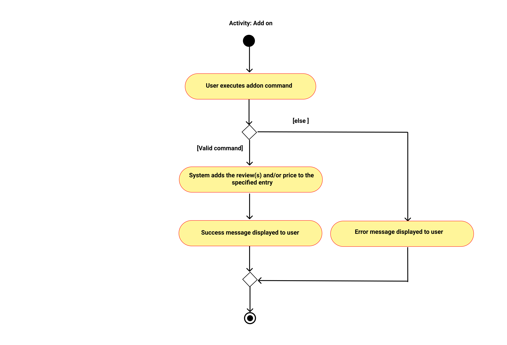
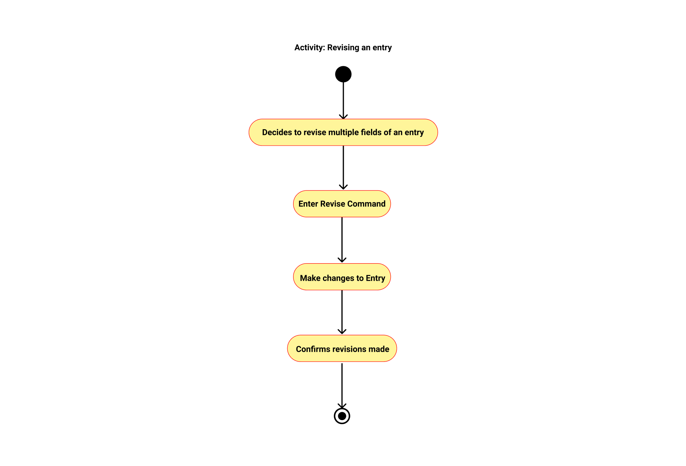
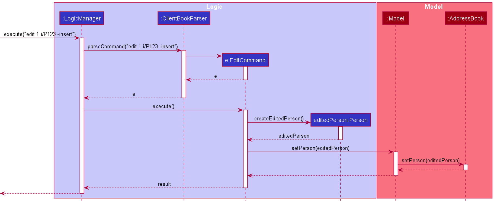
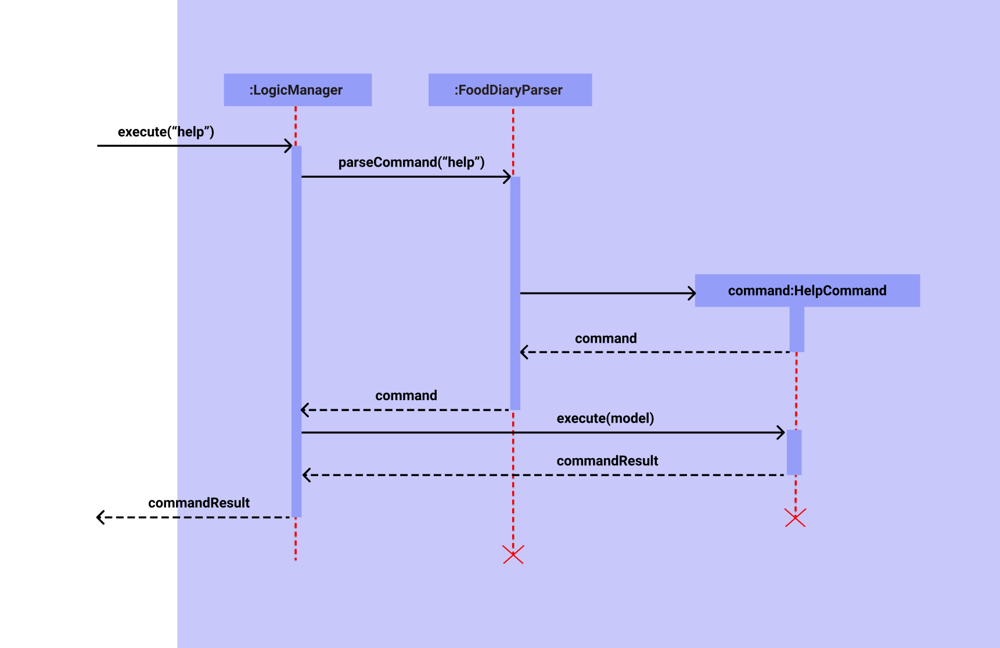

Done by (CS2103-T14-2):
Donavan Lim, Marcus Lee Eugene, Chong Sidney, Dinesh S/O Magesvaran, Prabhakaran Gokul

---

* Table of Contents
{:toc}
--------------------------------------------------------------------------------------------------------------------

## **Description**

The Food Diary is a desktop app for managing food diary entries, optimized with a Command Line Interface (CLI) and 
packaged with a Graphical User Interface (GUI).

The Food Diary caters to food-passionate NUS students who would ideally benefit from keeping records of food options 
tasted in the vicinity of NUS.

The Food Diary will allow students to save time and effort when finding places to eat around the NUS vicinity. The Food 
Diary especially caters to students mainly on 4 aspects:

1. The ability for users to save food diary entries for future reference.
2. The ability for users to find entries based on specific fields.
3. The ability for users to have multiple food reviews for a food place.
4. The option for users to use Commands / UI to perform some tasks quickly.

## **Design**
### Architecture

The **Architecture Diagram** given above explains the high-level design of the App. 
Given below is a quick overview of each component.

`Main` has two classes called `Main` and `MainApp`. It is responsible for, 
* At app launch: Initializes the components in the correct sequence, and connects them up with each other.
* At shut down: Shuts down the components and invokes cleanup methods where necessary.

`Commons` represents a collection of classes used by multiple other components.

The rest of the App consists of four components.
* `UI`: The UI of the App.
* `Logic`: The command executor.
* `Model`: Holds the data of the App in memory.
* `Storage`: Reads data from, and writes data to, the hard disk.

Each of the four components,
* defines its API in an `interface` with the same name as the Component. 
* exposes its functionality using a concrete `{Component Name}Manager` 
  class which implements the corresponding API interface mentioned in the previous point.

For example, the `Logic` component (see the class diagram given below) 
defines its API in the `Logic.java` interface and exposes its functionality 
using the `LogicManager.java` class which implements the `Logic` interface.

#### How the architecture components interact with each other
The *Sequence Diagram* below shows how the components interact with each other for the scenario 
where the user issues the command `addon 1 re/i like this food`.

The sections below give more details of each component. 

### UI component

**API:** [`Ui.java`](https://github.com/AY2021S2-CS2103-T14-2/tp/blob/master/src/main/java/fooddiary/logic/Ui.java)

* The `Ui` interface consists of a `MainWindow` that is made up of smaller Ui parts. Namely, from top to bottom
 these are: `CommandBox`, `ResultDisplay`, `EntryListPanel`, `StatusBarFooter`.
* The `MainWindow` also intialises 3 other windows that are used in The Food Diary. Namely, these are:
 `HelpWindow`, `ViewWindow` and `ReviseWindow`.
* All of these Ui parts and windows, including the `MainWindow`, inheerit from the abstract `UiPart` class
* In addition, the `UI` component also uses the JavaFX UI framework. THe layout of these UI parts are each defined in
 their corresponding `.fxml` files that can be loated in the `src/main/resources/view` folder.
* For example, the layout of the HelpWindow is specified in the `HelpWindow.fxml` file
* A universal styling theme is applied to all components, and the styling is defined in 2 files:
 `DarkTheme.css` and `Extensions.css`. Both are located in the `src/main/resources/view` folder.
* Images/icons used throughout the app windows are located in the `src/main/resources/images` folder.
 
1. The `UI` component executes user commands using the `Logic` component.
2. The `UI` component also listens for changes to the `Model` data, to which the UI will be updated to reflect the
 modified data.
 

### Logic Component

**API:** [`Logic.java`](https://github.com/AY2021S2-CS2103-T14-2/tp/blob/master/src/main/java/fooddiary/logic/Logic.java)

1. `Logic` uses the `FoodDiaryParser` class to parse the user command.
2. This results in a `Command` object which is executed by the `LogicManager`.
3. The command execution can affect the `Model` (e.g. adding an entry to the Food Diary)
4. The result of the command execution is encapsulated as a `CommandResult` object which is
passed back to the `Ui`.
5. In addition, the `CommandResult` object can also instruct the `Ui` to perform certain actions,
such as displaying help to the user.
   
Given below is the Sequence Diagram for interactions within the `Logic` component for the
`execute("addon 1 re/Good")` API call.

### Model Component

**API :** [`Model.java`](https://github.com/AY2021S2-CS2103-T14-2/tp/blob/master/src/main/java/fooddiary/model/Model.java)

The `Model`,
- stores a `UserPref` object that represents the user’s preferences.
- stores the user's food entries data.
- exposes an unmodifiable `ObservableList<Entry>` that can be ‘observed’ e.g. the UI can be bound to this list so that 
  the UI automatically updates when the data in the list change.
- does not depend on any of the other three components.

### Storage Component

**API :** [`Storage.java`](https://github.com/AY2021S2-CS2103-T14-2/tp/blob/master/src/main/java/fooddiary/storage/Storage.java)

The `Storage` component,
- can save `UserPref` objects in json format and read it back.
- can save the food diary data in json format and read it back.

### Common classes
* Classes used by multiple components are in the fooddiary.commons package.
* There are primarily 3 folders of classes classified under common classes. Namely, these are:
    * Index
    * Exceptions
    * Utility
* In general, these classes are responsible for the processing the app's logging information, GUI settings,
 error messages thrown, and file management etc.

Notably:
* The `GuiSetting` class in the `Index` folder contains methods that process all the GUI settings of the app,
 and is essential in allowing the app to restore back the GUI window settings upon reopening the app.
* The `LogCenter` class in the `Index` folder contains methods that process the loggers and handlers responsible for
 logging useful information on the user's usage of the app for the developer's use and understanding.

## **Implementation**
This section describes some noteworthy details on how certain features are implemented.

### AddOn Feature
The AddOn feature allows the user to add review(s) and/or a price to a single entry of a food place. This will be useful
for users who frequently visit a particular place and would like to enter their reviews and the price spent on each visit.
The reviews are added to the user specifed entry and the price added on will be reflected as a price range of the user's spending history 
(e.g. if the current entry has a price of $5, adding on a price of 10 will update the current price of 5 to a price range of $5-10).

Given below is an example usage scenario:

Step 1. The user launches The Food Diary application. Data will be loaded from the storage to the application memory.
The `FoodDiary` will be populated with a list of `Entry`, each contains: `Name`, `Address`, `Price`
, `Rating`, `Review`, `TagCategory` and `TagSchool`.

Step 2. (Optional) The user executes `list` command to list out all the entries and select the entry to add on details.

Step 3. The user executes `addon 1 re/I like this food a lot! p/7` command to add on details to an existing entry. 
The command contains values such as a "I like this food a lot!" review and a price value of 7 dollars.

Step 4. If the parameters entered by the user is valid, the application will create a new `entry` and stores the information in `Model` and `Storage`.
Else, the FoodDiary will display an appropriate error message. 

The following sequence diagram shows how the AddOn feature works:

The following activity diagram summaries the flow of event when a user executes the `addon` command:

#### Design Consideration

##### Aspect: Whether entry class should have a List of Reviews or a single Review as an attribute (for adding on reviews to an existing entry)
* **Alternative 1 (current choice):** Entry containing a List of Reviews as an attribute
    * Pros: Looks neater in a design perspective, as additional reviews added on will just be appended to the list of reviews.
      Easily extendable in the future (e.g. deleting a specific review in an entry).
    * Cons: A lot of refactoring is needed. Takes some time.
* **Alternative 2:** Entry containing a single review attribute 
    * Pros: Easy to implement, as additional reviews can be concatenated as a string to the current review
    * Cons: This cannot be easily extended in the future (e.g. deleting a specific review in an entry).

### List Feature
The List feature allows a user to list all entries that they have keyed in thus far. This will be useful when a user
wants an overview of all the entry he/she has keyed in previously.

Given below is an example usage scenario:

Step 1. The user is in the Food Diary application. 

Step 2. The user executes list. The Food Diary application lists all the entries in the user's database. 
Each Entry contains the `Name`, `Address`, `Price`, `Rating`,  `Review`, `TagCategory` and `TagSchool`.

This feature was brought over to The Food Diary from AB3. 
There were not much changes apart from modifying it to list
entries instead. Similiar to other commands,`MainWindow#executeCommand()` runs and `Logic#execute()`
will be called to parse the user input in `FoodDiaryParser#parseCommand()`. 
The parsed command will be identified
as a list command.

### Find Feature
The Find feature allows a user to find entries that match **ANY** of the keywords provided by the user.
This enables the user to easily sieve out all the entries that meet every single requirement the user
is looking for, which will be useful when deciding where to eat.

This feature is implemented through the `find` command, where the user will provide a list of keywords that
they would like the FoodDiary to utilise to search through the various fields from the FoodDiary entries.
The fields that can be searched through include `Name`, `Rating`, `Price`, `Address`, `TagCategory` and
`TagSchool`. Using the provided list of keywords, the FoodDiary will search through all the specified searchable
fields of all entries, and return all entries that match at least one of the keywords provided. The UI will then
be updated to display the list of entries that were returned as a search result.

Given below is an example usage scenario:

The user wants to find for good food places within NUS.

Step 1: User enters the command `find 5/5`.

Step 2: The food diary displays all entries that have a rating of 5/5.

Step 3: User is considering whether to visit the food place in the first entry, and uses the view command `view 1`
to look through that particular food entry to see past reviews.

Step 4: User decides to visit that particular food place.

To better understand how the Find feature works, refer to the diagrams provided for the FindAll feature, as the
implementation is largely the same.

#### Design Considerations

##### Aspect: Whether the syntax used for the find command should be similar to the add command
* **Alternative 1 (current choice):** Implement the `find` command without using similar syntax to the `add`
  command (eg. `find 5/5 $4-6 western` instead of `find ra/5 p/4-6 c/western`)
    * Pros: Lesser syntax required, making the command more user-friendly (**Important as the `find` command
      will be executed by the user many more times as compared to the `add` command**)
    * Cons: Makes the implementation less standardised across different commands
* **Alternative 2:** Implement the `find` command by using similar syntax as the `add` command
    * Pros: Makes the implementation more standardised across different commands
    * Cons: Greatly slows down the efficiency of performing searches on the FoodDiary, which will negatively
    impact the user experience

##### Aspect: How the user input keywords for the Rating and Price fields should be implemented
* **Alternative 1 (current choice):** Implement the rating and price fields with additional syntax (eg. Rating
  implemented as `RATING/5` instead of `RATING`, and price implemented as `$PRICE` or `$PRICE-PRICE` instead
  of `PRICE` or `PRICE-PRICE`)
    * Pros: More intuitive keywords for the user to type out when performing their search
    * Cons: More typing is required, with additional syntax that needs to be strictly followed
* **Alternative 2:** Implement the rating and price fields without additional syntax
    * Pros: Keywords can be typed out faster, makes performing searches more efficient
    * Cons: Possibility of user getting back results for rating when finding for price, or getting back results
    for price when finding for rating

### FindAll Feature
The FindAll feature allows a user to find entries that match **ALL** the keywords provided by the user.
This enables the user to easily sieve out all the entries that meet every single requirement the user
is looking for, which will be useful when deciding where to eat.

This feature is implemented through the `findall` command, where the user will provide a list of keywords that
they would like the FoodDiary to utilise to search through the various fields from the FoodDiary entries.
The fields that can be searched through include `Name`, `Rating`, `Price`, `Address`, `TagCategory` and
`TagSchool`. Using the provided list of keywords, the FoodDiary will search through all the specified searchable
fields of all entries, and return all entries that match all the keywords provided. The UI will then
be updated to display the list of entries that were returned as a search result.

The FindAll feature is similar to the Find feature. The Find feature finds for all entries that meet
at least **one of the given keywords,** while the FindAll feature only finds for entries that meet **all the
given keywords.**

Given below is an example usage scenario:

The user wants to find for good food places within NUS that are within their budget, from a specific food
category.

Step 1: User enters the command `findall 5/5 $0-10 western`.

Step 2: The food diary displays all entries that have a rating of 5/5, a price range that contains food options
$10 or below, and that have western food available.

Step 3: User is considering whether to visit the food place in the first entry, and uses the view command `view 1`
to look through that particular food entry to see past reviews.

Step 4: User decides to visit that particular food place.

The following sequence diagram shows how the FindAll feature works:

The following activity diagram summarises the events that take place when a user executes the `findall`
command:

#### Design Consideration

##### Aspect: Whether the FindAll feature should be implemented as a separate command from the Find feature
* **Alternative 1 (current choice):** Implement the FindAll feature as a separate command
    * Pros: Easier to implement, and more user-friendly as less syntax is required
    * Cons: User has to utilise 2 different commands despite them both performing a similar search function
* **Alternative 2:** Implement the FindAll feature using the same command as the Find feature
    * Pros: User can carry out all searches using only one command, which makes the features fit together better
      than the first alternative
    * Cons: Much harder to implement, and less user-friendly as more syntax is required due to the user needing to
      specify the method of search between the Find and FindAll features that they would like to use to perform
      their search

### Revise Feature
The Revise feature allows a user to quickly edit different sections of an entry. It is often misunderstood to be 
mutually exclusive with the edit feature or the slower alternative. This feature shines when a user wishes to edit 
while also adding into multiple sections in an entry. The edit and addon features are still necessities for making 
quick and small chanegs to an entry.

The command opens an additional window when a user enters the command in the UI, the command will be passed into 
`MainWindow#executeCommand()`, in which `Logic#execute()` will be called to parse the user input in `FoodDiaryParser#parseCommand()`.
The user input will be parsed as a 'Revise' command and executed to retrieve all the details related to the specified entry.
With the window for revision of the entry, a user can easily make changes to the sections all at once. 

With the revise button, all the changes made are passed into the `MainWindow#executeCommand()`, and makes its way to 
`ReviseCommand#revise()` with calls `MainWindow#executeCommand()` with the content at each section concatenated with its
prefix and the EditCommand. 

The following sequence diagram shows how Revise feature works:

The following activity diagram summarises the events that take place when a user executes the `revise` command:

#### Design Consideration

##### Aspect: Whether to revise entry in command line or in a new UI window.
* **Alternative 1 (current choice):** Revise entry in a new UI window.
    * Pros: View all details of an entry and easily revise them with keyboard shortcuts.
    * Cons: Revise is not done purely in command line, but rather in a UI window.
* **Alternative 2:** Revise entry in command line.
  * Pros: Revise is purely done in the command line.
  * Cons: For entry with lengthy details, it will flood the command line space and be difficult for revising.

### Edit Feature
#### Implementation
At its core, the `edit` feature allows a user to edit multiple fields pertaining to the entry specified by its `index`,
 in a single edit command. The `edit` feature is the fundamental feature for editing an entry, and it is recommended
 for users to use it if minor changes to an entry are to be made, typically caused by a spelling mistake or typo.
 As such, the edit feature runs solely via the command typed in the command box. The following feature,
 the `revise` feature, builds upon the implementation of the `edit` feature. See more below.
 
When the edit command is called the command will be passed into `MainWindow#executeCommand()`, to which
 `Logic#execute()` will be called to parse the user input in `FoodDiaryParser#parseCommand()`.
 The user input will be parsed as an `edit` command and executed to edit the entry specified by
 the index of the command.
 
If the command `edit 1 re/New review` is passed, the `edit` command essentially replaces the old entry with a new
 entry that has the new review. The `edit` coammand calls `Model#setEntry()`, which calls
 `ModelManager#setEntry()`, that calls `FoodDiary#setEntry()` to eventually change the target entry with a new entry.

The following sequence diagram shows how Edit feature works:

The following activity diagram summarises the events that take place when a user executes the `edit`
command:

##### Design Consideration

##### Aspect: Whether to edit a command in the command line or in a new UI window.
* **Alternative 1 (current choice):** Edit entry in command line. 
  * Pros: View all details of an entry and easily revise them with keyboard shortcuts.
  * Cons: For entries with lengthy details, typing long commands in the command line fills up the text field space
  and makes it difficult for editing.
* **Alternative 2:** Edit the entry in a new UI window. 
  * Pros: Edit is purely done in the command line, which might be convenient for minor changes a user want s to make.
  * Cons: Edit is not done purely in command line, but rather in a UI window. This might pose an inconvenience
  for the user given the added step to edit a field of an entry.
  
  As such, we decided to implement a new feature named `revise` for users to achieve the cons of the current choice
  for `edit` and the pros for the alternative.

### Help Feature

The `help` feature primarly helps the user by showing a help guide whenever a user wishes to see it.
 
* The help guide is a succint version of all the commands and keywords for certan input parameters.

* The help guide also dislays examples related to each command for users to quickly get a sense of what
 each command does.
    
* The help guide also contains the link to our User Guide where users can copy the link from
 and visit for more information

An additional `HelpWindow` is opened when a user enters the `help` command in the UI. The command will be passed into 
`MainWindow#executeCommand()`, in which `Logic#execute()` will be called to parse the
user input in `FoodDiaryParser#parseCommand()`. The user input will be parsed as a 'Help' command.
A `HelpWindow` is returned at the end.

The following sequence diagram shows how the Help feature works:

The following activity diagram summarizes what happens when a user executes the `help` command:

### View Feature
`view`: Allows the user to view a specified entry in a new window, allowing the user to carefully look through
all the details of an entry. This feature is mainly used to read lengthy food reviews which cannot be shown on the Main 
UI window.

Given below is an example usage scenario:

Step 1. The user launches The Food Diary application. Data will be loaded from the storage to the application memory. 
The `FoodDiary` will be populated with a list of `Entry`, each contains: `Name`, `Address`, `Price` 
, `Rating`, `Review`, `TagCategory` and `TagSchool`.

Step 2. The user executes `view <INDEX>`, for whichever entry with lengthy reviews he/she wants to view.

Step 3. If the user input is invalid, an error message will be displayed in the command box, If the entry specified do
not exist, the filteredEntryList will be empty and no entry will be displayed on the Main Window.  

The mechanism works in such a way where after the user enters a command in the UI, the command will be passed into
`MainWindow#executeCommand()`, in which `Logic#execute()` will be called to parse the user input in
`FoodDiaryParser#parseCommand()`. The parsed command will be recognised as a `view` command and executed to 
retrieve all the details related to the specified entry. The result of this execution will be passed back to the UI and 
shown in a new window.

The following sequence diagram shows how the View feature works:

The following activity diagram summarizes what happens when a user executes the `view` command:

:information_source: 
**Note:** If the index specified by the user do not exist in The Food Diary, a CommandException will be thrown and the
error will be displayed to the user in the command box. If index is not specified, the error message in the command box
will show the correct syntax to use for the `view` command.

#### Design Consideration
##### Aspect: Whether to view entry with lengthy reviews in the Main UI or in a new window.
* **Alternative 1 (current choice):** View entry with lengthy reviews in a new window.
    * Pros: Easier to implement, do not need to deal with complex UI codes. Entry information looks neater.
    * Cons: User has to close/minimize the window to return to Main Window.
* **Alternative 2:** View entry with lengthy reviews in the Main UI.
    * Pros: Design is integrated within Main UI, which gives it a cleaner look.
    * Cons: Difficult to implement, lesser time for testability given the project deadline duration.

### Clear Feature
`clear`: Allows the user to clear entries in The Food Diary.

Given below is an example usage scenario:

Step 1. The user launches The Food Diary application. Data will be loaded from the storage to the application memory.
The `FoodDiary` will be populated with a list of `Entry`, each contains: `Name`, `Address`, `Price`
, `Rating`, `Review`, `TagCategory` and `TagSchool`.

Step 2. The user executes `clear` to clear all entries in The Food Diary.

This feature was brought over to The Food Diary from AB3. There were not much changes apart from modifying it to clear
entries instead. Similiar to other commands,`MainWindow#executeCommand()` runs and `Logic#execute()` 
will be called to parse the user input in `FoodDiaryParser#parseCommand()`. The parsed command will be identified
as a `clear` command.

### Exit Feature
The Exit feature allows a user to close the application.

Given below is an example usage scenario:

Step 1. The user is the midst of using The Food Diary application. The user has finished using the application.

Step 2. The user executes `exit` and closes the application.

This feature was brought over to The Food Diary from AB3. 
There were no changes. Similiar to other commands,MainWindow#executeCommand() runs and Logic#execute()
will be called to parse the user input in FoodDiaryParser#parseCommand().
The parsed command will be identified as the exit command.

## **Documentation, logging, testing, configuration, dev-ops**
- [Documentation guide](Documentation.md)
- [Testing guide](Testing.md)
- [Logging guide](Logging.md)
- [Configuration guide](Configuration.md)
- [DevOps guide](DevOps.md)

## **Appendix A: Challenges Faced**

### Challenges Faced & Rationalez

1. One of the most significant challenges on the creation of The Food Diary was refactoring and redefining classes and
 methods to match the implementation of a Food Diary, and in doing so do away with previous implementations
 that would otherwise suggest the implementation of an address book.
 
 * This thus involved major refactoring of the code base, followed by converting/creating several entities to match
 a Food Diary, such as the `Pricing` and `Rating` classes etc. pertaining to a journal entry in The Food Diary.
 
 * Creating these new entities entailed creating the appropriate classes in the `Model` package to manage and process
 these new entities in the app's memory.
 
2. We explored several design options when creating new features such as the `revise` and `view` features. We realised
 that while users could rely majorly on the keyboard to execute most of the app's features, this was however not the
 best, since users would miss the capability to view the different fields of their entries in full,
 which would have otherwise further enhanced their usage of the app.

    * This led us to create new separate windows that would pop up and allow users to view/revise the fields of their
    specified entry in greater detail, without compromising their ability to edit. For `revise`, users could choose to
    select which field to edit by clicking, or by using keyboard shortcuts; this did not compromise the
    keyboard-intensive interface that users might rely on.
    
    * We nonetheless still implemented the keyboard-based `edit` feature, and deemed that it was still useful for users
     who had minor edits to perform on their specified entry, which would make having to open up a separate window
     more inconvenient.
     
    * In all, design decisions had to be made, and we put ourselves in the perspectives of our users and implemented
     features and designs to what we felt best fitted them.
     
3. We constantly questioned ourselves as to how The Food Diary could be catered more towards NUS students.

    * As such, we preserved the user interface element of typing to execute functions/features in The Food Diary,
     given that our target users, NUS students would be comfortable using the app via keyboard-reliant interface.
     
    * Additionally, we matched the colour scheme of The Food Diary to subtly reflect the colours of NUS and make 
    The Food Diary appealing to the patronage of NUS students.
    
    * Entries in the Food Diray featured tags that were based off NUS locations. Given the multitude of eateries dotted
    around NUS, this would make identifying entries based on NUS locations essential to an NUS student
    who would have referenced back to previous entries in their usage over the longer term.
    
4. Finally, working together to deliver what we set out to do proved hectic at times of immense commitment from the team
 to other responsibilities in school. Nonetheless, with good planning, open communication and a strong sense of
 ownership for the effort in the work we have done, we have produced what we believe was usable and useful for the
 NUS students to patronise and enjoy.

## **Appendix B: Product scope**

**Target user profile**

This product caters to food-fervent NUS students who would ideally benefit from
keeping records of food options tasted in the vicinity of NUS.

* prefer desktop apps over other types

* can type fast and prefers typing to mouse interactions

* is reasonably comfortable using CLI apps

* occasionally prefers to use ui for certain tasks

**Value proposition**

Product Scope:
The Food Diary will allow NUS foodies to save time and effort when finding places to eat around the NUS vicinity.
The Food Diary especially caters to students chiefly on 2 aspects – One, the ability for users to log personal food
reviews tagged under different NUS-related location categories for future reference; and two, the ability to
effortlessly reference food options based on relevant filters in a user-friendly GUI.

## **Appendix C: User stories**
Priorities: High (must have) - `* * *`, Medium (nice to have) - `* *`, Low (unlikely to have) - `*`

| Priority| As a …​                                                           | I want to …​                                                        | So that I can…​                                                                    |
| ------- | ---------------------------------------------------------------- | ------------------------------------------------------------------ | --------------------------------------------------------------------------------- |
| `* * *` | User wanting to add a review of food experience to a particular restaurant | Add a review of food experience                          | Refer back to the particular element that defined my food experience              |
| `* * *` | User with little patience and time                               | Add names of places I have visited                                 | Efficiently add a review to a place I have visited                                |
| `* *`   | User who wants to look at the places I have visited              | View the list of experiences I have had                            | Easily show them to my friends                                                    |
| `* * *` | Student trying to decide where to eat                            | Look at the places i have visited before                           | Decide where I shall re-visit                                                     |
| `* * *` | User who would like to create custom category of food place      | Add the category of the place                                      | I can have a specific view of certain places                                      |
| `* * *` | User who does not want to visit a place again                    | Remove the place                                                   | Reduce redundant food places in my list                                           |
| `* * *` | User who wants to remember food ratings                          | Give a rating on the overall food experience                       | I can gauge/ballpark the satisfaction level I get against other food experiences  |
| `* * *` | User who wants to read lengthy reviews of an entry               | Glance through reviews of an entry                                 | Quickly arrive at a conclusion for a food place                                   |
| `* *`   | User frequently revisiting a place                               | Add multiple reviews to a single place                             | Store all my food experiences with the place                                      |
| `* *`   | User who wants to eat good food at an affordable price           | Search for places that match both the rating and price that I want | Visit the best food places without overspending                                   |
| `* *`   | User who wants identify a place he/she ate at previously by name | Find entries that match the name of the place I last visited       | Judge if I would like to go back to that place and eat there.                     |
| `* * *` | User who made a mistake in an entry                              | Perform revisions and updates to the entry                         | Keep accurate and up-to-date information of food places                           |
| `* * *` | User who is unclear of what to do with the app                   | Look at a help guide to get familiar with the app usage            | Use the app confidently and use it to its fullest extent                          |

## **Appendix D: Use cases**
(For all use cases below, the **System** is the `Food Diary` and the **Actor** is the `user`, unless specified otherwise)

**UC01: Add an Entry**

Preconditions: There are lesser than 1 000 000 entries in the Food Diary application.

**MSS**

1.  User enters details to add an entry to the Food Diary.
2.  Food Diary adds a new entry to the app.
    Use case ends.

**Extensions**

* 1a.  Food Diary detects invalid command from user.
    *   1a1. Food Diary warns user about invalid command syntax.
    *	1a2. User enters correct command syntax.

         Use case resumes from step 2.

* 2a. Food Diary detects duplicate entry that is already stored in the application.
    *	2a1. Food Diary warns user that the entry to be added already exists in the application.

         Use case ends.

**UC02: List all entries**

**MSS**

1.  User requests to list all entries.
2.  Food Diary displays all the entries.

**Extensions**

* 1a. Food Diary detects invalid command from user.

    * 1a1. Food Diary warns user about wrong syntax.
    * 1a2. User enters correct syntax.

      Use case resumes from step 2.

* 2a. No entries to display.

    * 2a1. Tells users that there are no entries.
    * 1a2. User enters correct syntax.

      Use case ends.

**UC03: Add category**

**MSS**

1. User adds a new category.
2. Food Diary adds the new category into the app.
3. Food Diary displays the new category added in a tag.

   Use case ends.

**Extensions**

* 1a. Food Diary detects invalid command from user.
    * 1a1. Food Diary warns user about wrong syntax.
    * 1a2. User enters correct syntax.

      Use case resumes from step 2.

* 1b. New category already exists.
    * 1b1. Food Diary tells user that the category already exists.

      Use case ends.

**UC04: Add on review(s) and/or price to a specified Food Diary Entry**

**MSS**

1. User requests to add a review(s) and/or a price to a specified entry.
2. Food Diary checks for the specified entry.
3. Food Diary adds review(s) and/or a price to the specified entry.

**Extensions**:

* 1a. Food Diary detects invalid command from user.
    * 1a1. Food Diary warns user about invalid command syntax.
    * 1a2. User enters correct command.

      Use case resumes from step 2.

* 2a. Specified Food Diary entry not found
    * 2a1. Food Diary tells user that the specified entry is invalid.

      Use case ends.

**UC05: Delete an Entry**

**MSS**

1. User requests to delete a Food Diary entry.
2. Food diary removes the entry from its database.

**Extensions**:
* 1a. Food diary detects invalid command from user.
    * 1a1. Food Diary warns user about invalid command syntax.
    * 1a2. User enters a valid command.

      Use case resumes from step 2.

* 2a. Specified Food Diary entry not found
    * 2a1. Food Diary tells user that the specified entry is invalid.

      Use case ends.

**UC06: Find for entries**

**MSS**
1. User enters keywords to be used to search for entries.
2. Food Diary shows all entries matching user requirements (if any).

   Use case ends.

**Extensions**:
* 1a. Food Diary detects invalid command from user.
    * 1a1. Food Diary warns user about wrong syntax.
    * 1a2. User enters correct syntax.

  Use case resumes from step 2.

**UC07: Find all specific entries**

**MSS**
1. User enters keywords to specify requirements for entries.
2. Food Diary shows all entries matching user requirements (if any).

   Use case ends.

**Extensions**:
* 1a. Food Diary detects invalid command from user.
    * 1a1. Food Diary warns user about wrong syntax.
    * 1a2. User enters correct syntax.

  Use case resumes from step 2.
  
**UC08: Get Help**

**MSS**
1. User requests to get help on what commands to use.
2. Food Diary returns a succint help guide with the information he needs.
3. User reads the help guide and is now familiar with the commands to use.
4. User requests to close help guide after use.
5. Food Diary closes help guide.

**Extensions**:
* 1a. Food diary detects invalid command from user.
    * 1a1. Food Diary warns user about wrong syntax.
    * 1a2. User enters correct syntax.

      Use case resumes from step 2.
      
* 2a. User reads help guide but is still unclear of what command to use.
    * 2a1. User requests to see User Guide for more information
    * 2a2. Food Diary returns User Guide link for the user to access

      Use case resumes from step 3.
  
**UC09: View an Entry**

**MSS**
1. User requests to view a specific entry.
2. Food Diary checks requested entry.
3. Food diary shows specified entry details.

**Extensions**:
* 1a. Food diary detects invalid command from user.
    * 1a1. Food Diary warns user about wrong syntax.
    * 1a2. User enters correct syntax.

      Use case resumes from step 2.

* 2a. No entry found
    * 2a1. Food Diary tells user that no entry was found.

      Use case ends.

**UC10: Revise an Entry**

**MSS**
1. User requests to revise a specific entry.
2. Food Diary checks requested entry.
3. Food diary allows user to make revisions to the entry.

**Extensions**:
* 1a. Food diary detects invalid command from user.
    * 1a1. Food Diary warns user about wrong syntax.
    * 1a2. User enters correct syntax.

      Use case resumes from step 2.

* 2a. User key in non-existent index in list
    * 2a1. Food Diary tells user that no entry was found.

      Use case ends.
      
**UC11: Edit an Entry**

**MSS**
1. User requests to edit entry field(s) of a specific entry due to minor errors.
2. Food Diary edits the entry with the updated field(s).

**Extensions**:
* 1a. Food diary detects invalid command from user.
    * 1a1. Food Diary warns user about wrong syntax.
    * 1a2. User enters correct syntax.

      Use case resumes from step 2.
      
* 1b. User keys in non-existent index in list
    * 1b1. Food Diary tells user that no entry was found.

      Use case ends.

**UC12: Clear**

**MSS**
1. User requests to clear all entries.
2. Food Diary clears all entries.

**Extensions**:
* 1a. Food diary detects invalid command from user.
    * 1a1. Food Diary warns user about wrong syntax.
    * 1a2. User enters correct syntax.

      Use case resumes from step 2.

**UC13: Exit**

**MSS**
1. User exits.
2. Food Diary closes and data is saved.

**Extensions**:
* 1a. Food diary detects invalid command from user.
    * 1a1. Food Diary warns user about wrong syntax.
    * 1a2. User enters correct syntax.

      Use case ends.

## **Appendix E: Non-Functional Requirements**

Non-functional requirements specify the constraints under which the system for The Food Diary is developed and operated.
The Food Diary system is made up of the front-end, which is interchangeably referred to as the User Interface (UI),
and the back-end, which handles data management and operations.

### Technical requirements

* The system should be operable on Windows, MacOS and Linux operating systems, with Java 11 or above installed.

### Performance requirements

* The system should be loaded up within 2 seconds or less.
* The UI should appear within 2 seconds or less and be responsive to User input.
* The back-end should be responsive to processing User input at the same time the UI appears.
* The back-end should be able to handle 1,000 or more data entries (Food Diary entries) without noticeable sluggishness
  in performance for typical usage.

### Usability requirements

* The user should have access to a keyboard, and be proficient with typing alphanumeric English characters for commands
  to accomplish most of the usages of The Food Diary.

### Project scope
* The system should mainly comprise the handling of Food Diary-entry addition, deletion, and listing.
* The system would not be responsible for features involving multiple users

### Scalability requirements
* The system can handle a larger user base with many more food reviews being added to it
* Program is extendable for future addition of features easily

### Other Noteworthy Points

* The system should preserve data keyed in by the user

## **Appendix F: Glossary**
The glossary serves to ensure that all stakeholders, including users, have a common understanding of the noteworthy terms, and abbreviations.

* **Sluggishness**: The system starts to be slow in displaying user input when typed, and processing user input when entered.

## **Appendix G: Instructions for manual testing**
Given below are instructions to test the app manually.

:information_source: **Note:** These instructions only provide a starting point for testers
to work on.

### Launch and Shutdown

1. Initial launch

    1. Download the jar file and copy into an empty folder

    2. Double-click the jar file Expected: Shows the GUI with a set of sample food Diary entries. The window size may not be optimum.

2. Saving window preferences

    1. Resize the window to an optimum size. Move the window to a different location. Close the window.

    2. Re-launch the app by double-clicking the jar file.  
       Expected: The most recent window size and location is retained.
       
### Add an entry

1. Add an entry with the provided details.
   
    1. Prerequisite: `list` entries to ensure that the entry going to be added in not already displayed in the Food Diary application.

    2. Test case: `add n/Subway ra/5 p/6 re/I like this food a lot! a/3155 Commonwealth Ave W, Singapore 129588 c/FastFood c/Vegan s/SOC`
     Expected: Add an entry with name Subway, 5/5 Rating, 'I like this food a lot!' review, 3155 Commonwealth Ave W, Singapore 129588 address, 
    FastFood and Vegan categories and a SOC. A new entry will be shown in the entry list panel.
    
    3. Test case: `add n/Subway ra/7 p/6 re/I like this food a lot! a/3155 Commonwealth Ave W, Singapore 129588 c/FastFood c/Vegan s/SOC`
     Expected: Invalid rating error will be shown in the result display. Entry will not be added.
    
    4. Test case: `add n/Subway ra/5 p/1000 re/I like this food a lot! a/3155 Commonwealth Ave W, Singapore 129588 c/FastFood c/Vegan s/SOC`
     Expected: Invalid price error will be shown in the result display. Entry will not be added.
       
    5. Test case: `add n/Subway ra/5 p/6 re/ a/3155 Commonwealth Ave W, Singapore 129588 c/FastFood c/Vegan s/SOC`
     Expected: Invalid review error will be shown in the result display. Entry will not be added.
       
    6. Test case: `add n/Subway ra/5 p/6 re/I like this food a lot! a/ c/FastFood c/Vegan s/SOC`
     Expected: Invalid address error will be shown in the result display. Entry will not be added.

    7. Test case: `add n/Subway ra/5 p/6 re/I like this food a lot! a/Deck c/FastFood c/Math s/SOC`
     Expected: A list of valid categories will be shown in the result display. Entry will not be added.

    8. Test case: `add n/Subway ra/5 p/6 re/I like this food a lot! a/3155 Commonwealth Ave W, Singapore 129588 c/FastFood c/Vegan s/Primary`
     Expected: A list of valid schools will be shown in the result display. Entry will not be added.

    9. Other incorrect add commands to try: `add n/Subway ra/5 p/6 re/I like this food a lot! a/3155 Commonwealth Ave W, Singapore 129588 c/FastFood c/Vegan s/SOC`
    followed by `add n/Subway ra/5 p/6 re/I like this food a lot! a/3155 Commonwealth Ave W, Singapore 129588 c/FastFood c/Vegan s/SOC` (duplicate entry)

### Add on to an entry
1. Add on to an entry with the provided details
   
    1. Prerequisite: `list` to select the entry you want to add on details to. There must be at least one entry displayed.
       
    2. Test case: `addon 1 re/I like this food a lot! p/7`
     Expected: Add on the review "I like this food a lot!" and a price of $7 to the existing price/price range shown in the entry (price range updates if the input price is
       out of the initial price range dispalyed in the entry). Specified Entry will be updated with the addon on fields.
       
    3. Test case: `addon 1`
     Expected: Error message "At least one field to add-on must be provided." will be shown in the result display. Nothing will be added on to the specified entry.
       
    4. Test case: `addon 1 re/`
     Expected: Invalid review error will be shown in the result display. Nothing will be added on to the specified entry.
       
    5. Test case: `addon 1 re/Good Food p/1000`
     Expected: Invalid price error will be shown in the result display. Nothing will be added on to the specified entry.
       
    6. Other incorrect `addon` commands to try: `addon 10000000000 re/Good Food` (invalid index)
    
### Delete an Entry
1. Delete a booking specified by booking ID.
   
    1. Prerequisite: `list` all entries to find out the name of the entry to delete

    2. Test case: `delete 1`
     Expected: Delete entry at index 1. Success message and deleted entry details shown in the result display.
   
    3. Test case: `delete x` (where x is non-existent booking ID)
     Expected: Error of invalid entry shown in result display. No entry is deleted.

    4. Other incorrect delete commands to try: `delete`, `delete Starbucks`
     Expected: Invalid command format error. No entry is deleted.
   
    
### Find entries

1. Finding for entries using the `find` command
   
    1. Prerequisite: the food diary should contain all default entries
    
    2. Test case: `find 4/5`
       
        Expected:
        - All entries shown with a rating of 4/5. 
        - Success message displayed informing the user of the number of entries found.
        - 4 default entries will be shown.
       
    3. Test case: `find $7`
       
       Expected:
       - All entries shown with a price of $7, or a range of price that contains $7. 
       - Success message displayed informing the user of the number of entries found.
       - 1 default entry will be shown.
       
    4. Test case: `find western 5/5 $5-10`
       
       Expected:
       - All entries shown which contain at least one of the three keywords provided.
       - Success message displayed informing the user of the number of entries found.
       - 9 default entries will be shown.
       
    5. Test case: `find 3/7`
       
       Expected:
       - All entries shown which contain the provided keyword: `3/7`, if any.
       - Success message displayed informing the user of the number of entries found.
       - Suggestion message displayed informing the user of a possible typo for a rating search,
       providing directions to correct the typo.
       - 0 default entries will be shown.
       
    6. Test case: `find $5-`
       
        Expected:
        - All entries shown which contain the provided keyword: `$5-`, if any.
        - Success message displayed informing the user of the number of entries found.
        - Suggestion message displayed informing the user of a possible typo for a price search,
        providing directions to correct the typo.
        - 0 default entries will be shown.
       
    7. Test case: `find 3/7 $5-`
       
        Expected:
        - All entries shown which contain either of the keywords provided, if any.
        - Success message displayed informing the user of the number of entries found.
        - Suggestion message displayed informing the user of possible typos for a rating search,
        and a price search, providing directions to correct the typos.
        - 0 default entries will be shown.
       
### Find specific entries

1. Finding for entries using the `findall` command
   
    1. Prerequisite: the food diary should contain all default entries

    2. Test case: `findall 4/5`

       Expected:
       - All entries shown with a rating of 4/5.
       - Success message displayed informing the user of the number of entries found.
       - 4 default entries will be shown.

    3. Test case: `findall $7`

       Expected:
       - All entries shown with a price of $7, or a range of price that contains $7.
       - Success message displayed informing the user of the number of entries found.
       - 1 default entry will be shown.

    4. Test case: `findall western 5/5 $5-10`

       Expected:
       - All entries shown which contain all three keywords provided.
       - Success message displayed informing the user of the number of entries found.
       - 2 default entries will be shown.

    5. Test case: `findall 4/5 5/5`

        Expected:
        - All entries shown which contain both of the keywords provided, if any.
        - Success message displayed informing the user of the number of entries found.
        - 0 default entries will be shown.

    6. Test case: `findall 3/7`

       Expected:
       - All entries shown which contain the provided keyword: `3/7`, if any.
       - Success message displayed informing the user of the number of entries found.
       - Suggestion message displayed informing the user of a possible typo for a rating search,
       providing directions to correct the typo.
       - 0 default entries will be shown.

    7. Test case: `findall $5-`

       Expected:
       - All entries shown which contain the provided keyword: `$5-`, if any.
       - Success message displayed informing the user of the number of entries found.
       - Suggestion message displayed informing the user of a possible typo for a price search,
       providing directions to correct the typo.
       - 0 default entries will be shown.

    8. Test case: `findall 3/7 $5-`

       Expected:
       - All entries shown which contain both of the keywords provided, if any.
       - Success message displayed informing the user of the number of entries found.
       - Suggestion message displayed informing the user of possible typos for a rating search,
       and a price search, providing directions to correct the typos.
       - 0 default entries will be shown.

### View an entry
1. View an expanded view of an entry with lengthy review
   
    1. Prerequisite: Must have entries listed out in the Main Window    

    2. Test Case: Correct command with valid parameters:`view 1` (provided that entry of index 1 already exists)
        
        Expected: A window pops up which shows all details of the specified entry.
       
    3. Test Case: Command without parameters: `view`
       
        Expected: User will be notified that invalid command format is provided. The command box
        will show the correct syntax for `view` command.
       
    4. Test Case: Command not in lower-case: `ViEw 1` (provided that entry of index 1 already exists)
    
        Expected: User will be notified about unknown command in the command box.
       
    5. Test Case: Correct command but with non-existent index: `view 100000` (provided that entry of index 100000 
       do not exists)
       
        Expected: User will be notified of invalid command and the number of entries in The Food Diary.

### Revise an Entry
1. Edit the `Name`, `Rating`, `Price`, `Address`, `Reviews`, `School(s)`, `Category(s)`
   
    1. Prerequisite: Have a list of Entries or at least 1 Entry in view. In command line, execute `Revise <Index>`. 
                    `Index` refers to index of Entry to revise in view.
       
    2. Test case: Under Name, change name to `McDonalds`. Click `Revise` button. 
    
        Expected: Name of entry to be changed to `McDonalds`, Revise window to close and Main Window to show a list of
       all entries. Success Message leads with `Edited Entry: ...` shown in status bar.
       
    3. Test case: Under Rating, change rating to `2`. Click `Revise` button.

        Expected: Rating of entry changes to 2/5, Revise window to close and Main Window to show a list of
       all entries. Success Message leads with `Edited Entry: ...` shown in status bar.
       
    4. Test case: Under Price, change to `5`. Click `Revise` button.

       Expected: Price of entry to be changed to `5`, Revise window to close and Main Window to show a list of
       all entries. Success Message leads with `Edited Entry: ...` shown in status bar.

    5. Test case: Under Address, change to `Computing Drive`. Click `Revise` button.
    
       Expected: Address of entry to be changed to `Computing Drive`, Revise window to close and Main Window to show a list of
       all entries. Success Message leads with `Edited Entry: ...` shown in status bar.
       
    6. Test case: Under Categories, add `western`. Click `Revise` button.
    
       Expected: Categories of entry to add `Western`, Revise window to close and Main Window to show a list of
       all entries. Success Message leads with `Edited Entry: ...` shown in status bar.

   7. Test case: Under Categories, add to `soc`. Click `Revise` button.

       Expected: Categories of entry to add `SOC`, Revise window to close and Main Window to show a list of
       all entries. Success Message leads with `Edited Entry: ...` shown in status bar.
      
    8. Other valid test cases to try: Combine any of the above testcases before pressing `Revise`. All changes should be
    accounted for.
       
    9. Other invalid test cases to try: Use non-alphanumeric names, change name and address to be the same as an Entry that 
    already exists, invalid Categories `westen` and Schools `Com`. 
    
### Edit an entry
1. Edit the `Name`, `Rating`, `Price`, `Address`, `Reviews`, `School(s)`, `Category(-ies)`
   
    1. Prerequisite: Have a list of Entries or at least 1 Entry in view. In command line,
    execute `edit <INDEX> <KEYWORD> ...`. 
    
    * `INDEX` refers to index of Entry to revise in view.
    
    * The following test cases will test different permutations and numbers of `KEYWORD`(s).
       
    2. Test case: `edit 1 n/McDonalds`
    
       Expected:
       - First entry has named changed to "McDonalds".
       - All entries remained shown
       - Success message displayed informing the user of change.

    3. Test case: `edit 2 ra/0`

       Expected:
       - Second entry has rating changed to 0. (0/5)
       - All entries remained shown (with the first entry remaining edited as done previously).
       - Success message displayed informing the user of change.

    4. Test case: `edit 3 a/50 West Coast Road`

       Expected:
       - Third entry has address changed to "50 West Coast Road".
       - All entries remained shown (with all entries updated previously).
       - Success message displayed informing the user of change.

    5. Test case: `edit 4 re/I had a great time here.`

        Expected:
       - Fourth entry has review changed to "I had a great time here".
       - All entries remained shown (with all entries updated previously).
       - Success message displayed informing the user of change.

    6. Test case: `edit 5 p/20`

       Expected:
       - Fifth entry has price changed to "20". ($20)
       - All entries remained shown (with all entries updated previously).
       - Success message displayed informing the user of change.

    7. Test case: `edit 1 n/Hwangs ra/4 p/7 a/NUS re/Korean food makes me happy. s/Utown c/Korean`

       Expected:
       - First entry has name changed to "Hwangs", rating changed to "4" (4/5), price changed to "7" ($7),
        review changed to "Korean food makes me happy.", school location tags changed to "UTOWN", and 
        food category changed to "Korean".
       - All entries remained shown (with all entries updated previously).
       - Success message displayed informing the user of change.
       
    8. Test case: `edit 1 c/Korean c/Others`

       Expected:
       - First entry has food category changed to "Korean" and "Others".
       - All entries remained shown (with all entries updated previously).
       - Success message displayed informing the user of change.
  
### Clear all entries
1. Remove all entries from The Food Diary
   
    1. Prerequisite: None
    
    2. Test Case: Correct command:`clear` 

       Expected: Success message will show up in command box informing user that all entries are cleared.
    3. Test Case: Command not in lower-case: `cLeAr`

       Expected: User will be notified about unknown command in the command box.
       
## UI Mockup

