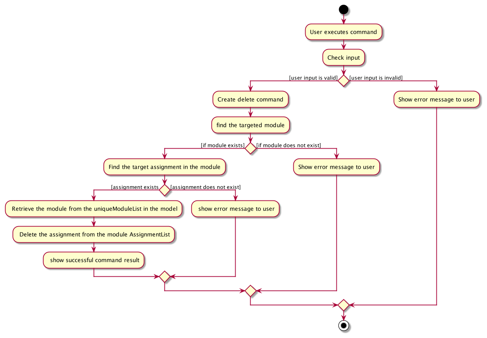
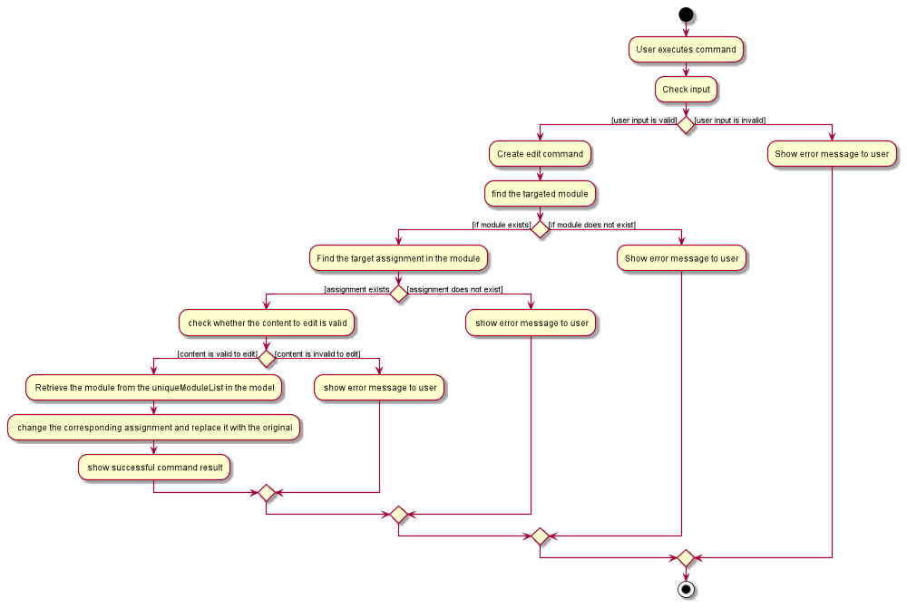

RemindMe Developer Guide
---
RemindMe is a reminder application that features a combination of a list and a calendar. RemindMe makes use of both 
Graphical User Interface(GUI) and Command Line Input(CLI). 

The target users for RemindMe are National University of Singapore(NUS) School of Computing (SOC) students. SOC students
can enjoy the benefits of CLI and GUI, which is not common in reminder applications in the current market. Users can use
RemindMe to store their modules, assignments, exams, contacts and general events. RemindMe aims to reorganise students' 
hectic lives and solve specific needs of SOC students.

The main audience for the RemindMe's developer guide are future developers who wanted to further understand RemindMe's 
inner workings. The developer guide explains the overall structure of RemindMe and the general workflow of RemindMe.
The developer guide also explains how specific implementations work, specifically add, find, delete, edit, and calendar.
The developer guide describes the team's motive for creating RemindMe, and the user stories used when creating RemindMe.

## Table of Contents

* **[1. Setting up, getting started](#1-setting-up-getting-started)**
* **[2. Design](#2-design)**
    * **[2.1 Architecture](#21-architecture)**
    * **[2.2 UI component](#22-ui-component)**
    * **[2.3 Logic component](#23-logic-component)**
    * **[2.4 Model component](#24-model-component)**
    * **[2.5 Storage component](#25-storage-component)**
    * **[2.6 Common classes](#26-common-classes)**
* **[3. Implementation](#3-implementation)**
    * **[3.1 Add feature](#31-add-feature)**
    * **[3.2 Find feature](#32-find-feature)**
    * **[3.3 Delete assignment](#33-delete-feature)**
    * **[3.4 Edit assignment](#34-edit-feature)**
    * **[3.5 Calendar feature](#35-calendar-feature)**
* **[4. Documentation, logging, testing and dev-ops](#4-documentation-logging-testing-configuration-dev-ops)**
* **[5. Effort](#5-effort)**
* **[Appendix-requirements](#appendix-requirements)**
    * **[Product scope](#product-scope)**
    * **[User stories](#user-stories)**
    * **[Use cases](#use-cases)**
    * **[Non Functional Requirements](#non-functional-requirements)**
    * **[Glossary](#glossary)**
* **[Appendix-instructions-for-manual-testing](#appendix-instructions-for-manual-testing)**
    * **[Launch](#launch)**
    * **[Testing commands](#testing-commands)**
    * **[Saving data](#saving-data)**

--------------------------------------------------------------------------------------------------------------------

## **1. Setting up, getting started**

Refer to the guide [_Setting up and getting started_](SettingUp.md).

--------------------------------------------------------------------------------------------------------------------

## **2. Design**

### 2.1 Architecture

The ***Architecture Diagram*** given above explains the high-level design of the App. Given below is a quick overview of each component.

:bulb: **Tip:** The `.puml` files used to create diagrams in this document can be found in the [diagrams](https://github.com/AY2021S2-CS2103T-W15-1/tp/tree/master/docs/diagrams/) folder.
 Refer to the [_PlantUML Tutorial_ at se-edu/guides](https://se-education.org/guides/tutorials/plantUml.html) to learn how to create and edit diagrams.

**`Main`** has two classes called [`Main`](https://github.com/AY2021S2-CS2103T-W15-1/tp/blob/master/src/main/java/seedu/address/Main.java)
 and [`MainApp`](https://github.com/AY2021S2-CS2103T-W15-1/tp/blob/master/src/main/java/seedu/address/MainApp.java). It is responsible for,
* At app launch: Initializes the components in the correct sequence, and connects them up with each other.
* At shut down: Shuts down the components and invokes cleanup methods where necessary.

[**`Commons`**](#26-common-classes) represents a collection of classes used by multiple other components.

The rest of the App consists of four components.

* [**`UI`**](#22-ui-component): The UI of the App.
* [**`Logic`**](#23-logic-component): The command executor.
* [**`Model`**](#24-model-component): Holds the data of the App in memory.
* [**`Storage`**](#25-storage-component): Reads data from, and writes data to, the hard disk.

Each of the four components,

* defines its *API* in an `interface` with the same name as the Component.
* exposes its functionality using a concrete `{Component Name}Manager` class, which implements the corresponding API `interface` mentioned in the previous point.

For example, the `Logic` component (see the class diagram given below) defines its API in the `Logic.java` interface and exposes its functionality using the `LogicManager.java` class which implements the `Logic` interface.

**How the architecture components interact with each other**

The *Sequence Diagram* below shows how the components interact with each other for the scenario where the user issues the command `delete 1`.

The sections below give more details of each component.

### 2.2 UI component

**API** :
[`Ui.java`](https://github.com/AY2021S2-CS2103T-W15-1/tp/blob/master/src/main/java/seedu/address/ui/Ui.java)

The UI consists of a `MainWindow` that is made up of parts e.g.`CommandBox`, `ResultDisplay`, `StatusBarFooter` etc. All these, including the `MainWindow`, inherit from the abstract `UiPart` class.

The `panels` and `cards` packages contain respective list panels and cards for `Module`, `Person` and `GeneralEvent`. While
the `calendar` package contains `CalendarBox`, `UpcomingSchedules` and other relevant UI classes that help build the `CalendarWindow`. 

The `UI` component uses JavaFx UI framework. The layout of these UI parts are defined in matching `.fxml` files that are in the `src/main/resources/view` folder. For example, the layout of the [`MainWindow`](https://github.com/AY2021S2-CS2103T-W15-1/tp/blob/master/src/main/java/seedu/address/ui/MainWindow.java) is specified in [`MainWindow.fxml`](https://github.com/AY2021S2-CS2103T-W15-1/tp/blob/master/src/main/resources/view/MainWindow2.fxml)

The `UI` component,

* Executes user commands using the `Logic` component.
* Listens for changes to `Model` data so that the UI can be updated with the modified data.

### 2.3 Logic component

**API** :
[`Logic.java`](https://github.com/AY2021S2-CS2103T-W15-1/tp/blob/master/src/main/java/seedu/address/logic/Logic.java)

1. `Logic` uses the `RemindMeParser` class to parse the user command.
1. This results in a `Command` object which is executed by the `LogicManager`.
1. The command execution can affect the `Model` (e.g. adding a person).
1. The result of the command execution is encapsulated as a `CommandResult` object which is passed back to the `Ui`.
1. In addition, the `CommandResult` object can also instruct the `Ui` to perform certain actions, such as displaying help to the user.

Given below is the Sequence Diagram for interactions within the `Logic` component for the `execute("clear m/")` API call.

### 2.4 Model component

**API** : [`Model.java`](https://github.com/AY2021S2-CS2103T-W15-1/tp/blob/master/src/main/java/seedu/address/model/Model.java)

The `Model`,

* stores a `UserPref` object that represents the user’s preferences.
* stores the RemindMe data.
* exposes an unmodifiable `ObservableList<Person>` `ObservableList<Module>` or `ObservableList<GeneralEvent>` that can be 'observed' e.g. the UI can be bound to this list so that the UI automatically updates when the data in the list change.
* does not depend on any of the other three components.

:information_source: **Note:** The details of `Module`, `Assignment`, `Exam`, `Person` and `GeneralEvent` are omitted for greater readability of the diagram.

### 2.5 Storage component

**API** : [`Storage.java`](https://github.com/AY2021S2-CS2103T-W15-1/tp/blob/master/src/main/java/seedu/address/storage/Storage.java)

The `Storage` component,
* can save `UserPref` objects in json format and read it back.
* can save the RemindMe data in json format and read it back.
* CalendarStorage is accessed by UI component which is no indicated in the diagram.

### 2.6 Common classes

Classes used by multiple components are in the `seedu.address.commons` package.
  
--------------------------------------------------------------------------------------------------------------------

## **3. Implementation**

This section describes some noteworthy details on how certain features are implemented.  
The features are:
* **[Add Feature](#31-add-feature)**
* **[Find Feature](#32-find-feature)**
* **[Delete Feature](#33-delete-feature)**
* **[Edit Feature](#34-edit-feature)**
* **[Calendar Feature](#35-calendar-feature)**

### 3.1 Add Feature

#### Implementation

The proposed add implementation is facilitated by `ModelManager`, which extends `Model`. `ModelManager` contains FilteredList of each entity:
* Persons
* Modules
* General Events 

The following activity diagram summarises the general workflow for the Add Command:

*[Add Feature Activity Diagram for `add m/CS2103T`]*
  
The following sequence diagram shows how the add operation works:

Given below is an example usage scenario and how the add mechanism behaves at each step. Input: `add m/CS2103T`

**Step 1:** Your input is parsed into `RemindMeParser` using the `parseCommand` method.
 
 

**Step 2:** Based on the command word of your input (i.e., `add`), an AddCommandParser will be used.
 
 

**Step 3:** In `AddCommandParser#parseCommand`, your input will be tokenized using `ArgumentTokenizer`. `ArgumentTokenizer` uses your input, then searches for the prefixes and returns the `ArgumentMultimap`.
 
 

**Step 4**: Using the `ArgumentMultimap` checks the prefixes in your input and returns the respective `AddCommandParser`.

    Module: `m/`: `AddModuleCommandPaser`
    Person: `n/`: `AddPersonCommandParser`
    General Event: `g/`: `AddGeneralEventParser`  
    if it is an unknown prefix, `parseCommand` will throw a ParseException and returns a `AddMessageUsage`. Since the input is `m/`, `AddModuleCommandPaser` will be returned.

**Step 5**: In `AddModuleCommandPaser`, `AddModuleCommandPaser#parse` is called. Again `ArgumentMultimap` is created using `ArgumentTokenizer` but only with `Module` prefix: `m/`. The class diagram shows the Parser class diagram when passing your input into the appropriate `AddModuleCommand`.
 
 

 
 

**Step 6:** The `parse` method does a few checks:

* If there isn't the `PREFIX`: `m/` present, or the preamble of the `PREFIX` is not empty, or your search input after the `PREFIX` is whitespaces, then `parse` method will throw `ParseException` and returns a `AddMessageUsage` for `Module`.
* Else your inputs is used to create a `title` which is then used to create a `module`.
 
 

**Step 7:** `AddModuleCommand` is executed:

* Using the `module` as an input, the `Model#hasModule` method checks if the given `module` is a duplicate or not. If it is, it will throw `CommandException` and return a `MESSAGE_DUPLICATE_MODULE`.
* Else, using the `module` as an input, the `Model#addModule` method is called, and adds the `module` to the `UniqueModuleList` in `RemindMe`.
 
 

**Step 8:** The `CommandResult` is logged in the `logger` and using `resultDisplay#setFeedacktoUser`, returning `resultDisplay`. Using `resultDisplay#setText` shows the `CommandResult` in the `GUI`.
 
 

### 3.2 Find Feature

This section shows how find feature is implemented in RemindMe. It will describe the logic flow of RemindMe step by step. 

#### Implementation

The proposed find implementation is facilitated by `ModelManager`, which extends `Model`. `ModelManager` contains FilteredList of each entity:
* Persons
* Modules
* General Events

Given below is an example usage scenario and how the find mechanism behaves at each step. Input: `find m/CS2101`

**Step 1:** Your input is parsed into `RemindMeParser` using the `parseCommand` method.
 
 

**Step 2:** Based on the command word of your input (i.e., `find`), a FindCommandParser will be used.
 
 

**Step 3:** In `FindCommandParser#parseCommand`, your input will be tokenized using `ArgumentTokenizer`. 
`ArgumentTokenizer` uses your input, then searches for the prefixes and returns the `ArgumentMultimap`.
 
 

**Step 4:** Using the `ArgumentMultimap` checks the prefixes in your input and returns the respective `FindCommandParser`.

    Module: `m/`: `FindModuleCommandPaser`
    Person: `n/`: `FindPersonCommandParser`
    General Event: `g/`: `FindGeneralEventParser`  
    if it is an unknown prefix, `parseCommand` will throw a ParseException and returns a `FindMessageUsage`. 
    Since the input is `m/`, `FindModuleCommandPaser` will be returned.
 

**Step 5:** In `FindModuleCommandPaser`, `FindModuleCommandPaser#parse` is called. Again `ArgumentMultimap` is created 
using `ArgumentTokenizer` but only with `Module` prefix: `m/`. The class diagram shows the Parser class diagram when 
passing your input into the appropriate `FindModuleCommand`.  
 
 

**Step 6:** The `parse` method does a few checks:

* If there isn't the `PREFIX`: 
    * `m/` present, or 
    * the preamble of the `PREFIX` is not empty, or 
    * your search input after the `PREFIX` is whitespaces, 
  * then `parse` method will throw `ParseException` and returns a `FindMessageUsage` for `Module`.
* Else your inputs is split into individual keywords, and contained as a `List of keywords`.
 
 

**Step 7:** The keywords will be stored in `TitleContainsKeywordsPredicate` as a `predicate`, then stored in `FindModuleCommand`.
 
 

**Step 8:** `FindModuleCommand` is executed:
* Using the `predicate`, the `Model#updateFilteredModuleList` is called with `predicate` as input.
* Using the `FilteredList<Module>#setPredicate` returns the filtered list of modules with titles matching to any of the 
  `keywords` as a `CommandResult`.
 
 

**Step 9:** The `CommandResult` is logged in the `logger` and using `resultDisplay#setFeedacktoUser`, returning 
`resultDisplay`. Using `resultDisplay#setText` shows the `CommandResult` in the `GUI`.
 
 

The following sequence diagram shows how the find operation works:
 
*[Find Sequence Diagram for `find m/CS2101`]*

The following activity diagram summarizes what happens when a user executes a `find m/CS2101` command: 
 
*[Find Activity Diagram for `find m/CS2101`]*
 
 

### 3.3 Delete Feature

#### Implementation

The following activity diagram summarizes what happens when a user executes a `delete m/CS2103 a/3` command: 
 
*[Delete Activity Diagram for `delete m/CS2103 a/3`]* 
 
 

The following sequence diagram shows how the delete operation works:  
  
*[Delete Sequence Diagram for `delete m/CS2103 a/3`]*
 
 

RemindMe is able to delete an existing `Assignment` in an existing `Module`

The diagram below shows the relationships between `DeleteAssignmentCommand` and `DeleteAssignmentCommandParser` under 
the `Logic` component and the relationship between `Module` and `Assignment` under the `Model` component.

 
 
The following example usage scenario describes how the delete mechanism behaves at each step.

    Assuming RemindMe has a Module named CS2103. This Module contains a AssignmentList that stores
    a list of Assignmnets:
    
    [D] Assigment1 due on  01/01/2021 2359
    [X] Assignment2 due on 05/05/2022 2359
    [D] Assignment3 due on 25/03/1021 2359
    
**Step 1:** The user launches the RemindMe application, `LogicManager` and `RemindMeParser` will be initialized.
 
 

**Step 2:** The user executes `delete m/CS2103 a/3` to delete the assignment at `Index` 3 from the `AssignmentList` of
the `Module` CS2103. This invokes the method `LogicManager#execute(String)` which then invokes the 
`RemindMeParser#parseCommand(String)` method.
 
 

**Step 3:** RemindMeParser will parse the command word `delete` and will create a DeleteCommandParser. The 
DeleteCommandParser will tokenize the prefixes and will choose to create a deleteAssignmentCommandParser to parse
the `Title` CS2103 and `Index` 3.
 
 

**Step 4:** The `DeleteAssignmentCommandParser` will create a new `DeleteAssignmentCommand` with the `Title` CS203 and 
`Index` 3 and return it back to the LogicManager.
 
 

**Step 5:** The `DeleteAssignmentCommand` verifies whether the target `Module` exist in the `FilteredModuleList` 
and whether an assignment exists at `Index` 3. If either fails, `DeleteAssignmentCommand` will throw a CommandException.
If not, it will invoke the method `Module#deleteAssignment(Index)` which removes the assignment at `Index` 3 from the 
`AssignmentList`
 
 

**Step 6:** A `CommandResult` will be created with a successful message if the user inputs are valid
and returned to `LogicManager`.
 
 

**Step 7:** Lastly, `LogicManager` saves the updated RemindMe.

### 3.4 Edit Feature

#### Implementation
RemindMe is capable of editing an existing `assignment`. 

Below is a class diagram to show the relationship between `EditAssignmentCommand and EditAssignmentCommandParser` under 
the `Logic` component and the relationship between `Module` and `Assignment` under the `Model` component.
 
 

*[Edit Feature Class Diagram]* 
 
 

Given below is an example usage scenario and how the edit mechanism behaves at each step.

     Assuming RemindMe already has a Module named CS2103 and an Assignment Tut1 with time 01/01/2021 2359 stored.

**Step 1:** The user launches the RemindMe application, `LogicManager` and `RemindMeParser` will be initialized.
 
 

**Step 2:** The user executes `edit m/CS2103 a/1 d/Tut2` to edit the description of the first assignment
in the CS2103 module. This invokes the method `LogicManager#execute(String)` which then invokes the
 `RemindedParser#parseCommand(String)` method.

 
 

**Step 3:** RemindMeParser will then create `EditCommandParser` (omitted in the sequence diagram)
which detects the edit conditions and calls `EditAssignmentCommandParser` 
to parse inputs according to the format specified.
 
 

**Step 4:** The `EditAssignmentCommandParser` will create a new `EditAssignmentCommand` 
with the given module `CS2103` , the given index `1`, the description `Tut2` and a null 
date and return it back to `LogicManager`.
 
 

**Step 5:** `LogicManager` calls the `EditAssignmentCommand#execute(Model)` method 
which then verifies whether the target module and assignment exists and whether
 the edited content is valid, e.g. same content.
 
 

**step 6:** The `Model` calls `RemindMe#editAssignment(Module, index, Description)` method which retrieves
the module to edit from the `UniqueModuleList` ,retrieves and update the assignment and place the
module back to the list. 
 
 

**Step 7:** A `CommandResult` will be created with a successful message if the user inputs are valid
and returned to `LogicManager`.
 
 

**Step 8:** Lastly, `LogicManager` saves the updated RemindMe.

    Note: An EditAssignmentCommand can either change the description or date of an assignment, not both.
    
 

The above process is shown in the following sequence diagram:

*[Edit Feature Sequence Diagram for `edit m/CS2103 a/1 d/Tut2`]* 
 

Below is the separate sequence diagram for editAssignment(m, 1 , Tut2):

*[Edit Feature Sequence Diagram for `editAssignment(m, 1, Tut2)`]* 
 

The following activity diagram summarises the general workflow for the Edit Command:

*[Edit Feature Activity Diagram for `edit m/CS2103 a/1 d/Tut2`]* 

### 3.5 Calendar Feature

#### Implementation

*[Calendar Feature Sequence Diagram]* 

**Given below is an example of how the calendar UI is created.**

**Step1:** `CalendarWindow` will be created at the start of the program.
 
 

**Step2:** `CalendarWindow` will then call itself `CalendarWindow#loadCalendar` to load the details into the calendar.
 
 

**Step3:** In the `loadCalendar` method,  to ensure that the details inside calendar are the latest, 
the method will then call `CalendarStorage#refreshStorage` to update the storage for the calendar.
 
 

**Step4:** In the `refreshStorage` method, calendar storage will be cleared first by calling `CalendarStorage#clear`
and then the details about events are retrieved from RemindMe model by calling `RemindMe#getFilteredPersonList`
, `RemindMe#getFilteredModuleList` and `RemindMe#getFilteredEventList`.
 
 

**Step5:** With calendar storage updated, the `CalendarWindow` will then store events to each respective day `CalendarWindow#loadCalendar`
and then the calendar will be ready to be displayed as a GUI. 
 
 

*[Calendar Command Sequence Diagram]*

Given below is an example usage scenario and how the calendar mechanism behaves at each step.  Input: `calendar`.

**Step 1.** Your input is parsed into `RemindMeParser` using the `parseCommand` method.
 
 

**Step 2:** Based on the command word of your input (i.e., `calendar`), a `CalendarCommand` will be created.
 
 

**Step 3:** `CalendarCommand` is executed, and that will set boolean `showCalendar` to be true, the boolean is then 
pushed to `MainWindow` to call `MainWindow#handleCalendar` to show the `CalendarWindow`.
 
 

**Step 4:** `CalendarWindow` loaded by its fxml file and called `CalendarWindow#show` to show its shown 
as a pop-up window for you.

 
 

--------------------------------------------------------------------------------------------------------------------

## **4. Documentation, logging, testing, configuration, dev-ops**

* [Documentation guide](Documentation.md)
* [Testing guide](Testing.md)
* [Logging guide](Logging.md)
* [Configuration guide](Configuration.md)
* [DevOps guide](DevOps.md)

--------------------------------------------------------------------------------------------------------------------

## **5. Effort**

RemindMe is an enhancement on Addressbook 3(AB3). While AB3 only stores and mutate persons, RemindMe deals with Modules, 
Contacts, General Events, Assignments, Birthday and Exams. Assignments and Exams are directly related to Modules, where Modules have
Assignments and Exams. 

As RemindMe deals with multiple entity types, the parsers for RemindMe needs to parse new and different entries and inputs. 
RemindMe also needs new ways to store and display the entries, ensuring that RemindMe still maintains a fresh and clear 
GUI, compared to AB3.

Birthday has a date while Assignment, Exam, and General Event contain a date time. RemindMe makes use of the date time 
to show a reminder when RemindMe starts up. Therefore, RemindMe has to be able to parse date and time into the respective 
entities and ensure they are of the right format. 

Moreover, RemindMe has a calendar which is able to differentiate all entries in RemindMe based on the dates and time.
Assignments in Modules has a checkbox to indicate whether an assignment is done or not. This adds a new logic into RemindMe, 
compared to AB3, and additional GUI. 

--------------------------------------------------------------------------------------------------------------------

## **Appendix: Requirements**

### Product scope

**Target user profile**:

* has a need to manage exams, assignments and events deadlines
* prefer desktop apps over other types
* tend to forget upcoming events/exams
* is reasonably comfortable using CLI and GUI apps

**Value proposition**: Manage deadlines and events in list and calendar view format to remind forgetful users.

### User stories

Priorities: High (must have) - `* * *`, Medium (nice to have) - `* *`, Low (unlikely to have) - `*`

| Priority | As a …​                                 | I want to …​                | So that I can…​                                                     |
| -------- | ------------------------------------------ | ------------------------------ | ---------------------------------------------------------------------- |
| `* * *`  | new user                                   | see instructions help page     | refer to help page when I forget how to use the App |
| `* * *`  | user                                       | exit the App                   | use other applications on my computer |
| `* * *`  | student taking a module                    | add module                     | keep track of the module exams, assignments |
| `* * *`  | student having assignments                 | add assignments to module      | keep track of the assignment deadline |
| `* * *`  | student having exams                       | add exams to module            | keep track of the exam start time |
| `* * *`  | user with friends                          | add person and their birthday  | keep track of birthday and wish them happy birthday promptly |
| `* * *`  | user                                       | add general events             | keep track of events happening outside school curriculum |
| `* * *`  | student                                    | edit a module                  | adjust module name if module name changes |
| `* * *`  | student                                    | edit a assignment              | can adjust schedule when there is a change of plan |
| `* * *`  | student                                    | edit a exam                    | can adjust schedule when there is a change of plan |
| `* * *`  | user                                       | edit a person and birthday     | fine tune person name and birthday according |
| `* * *`  | user                                       | edit a general event           | adjust schedule when there is a change of plan |
| `* * *`  | student                                    | delete a module                | I can remove a module I do not require |
| `* * *`  | student                                    | delete a assignment            | I can remove an assignment once it's done |
| `* * *`  | student                                    | delete a exam                  | I can remove an exam after I completed it |
| `* * *`  | user                                       | delete a person and birthday   | I can remove a person I am no longer close to |
| `* * *`  | user                                       | delete a general event         | I can remove an event that is already over |
| `* * `   | student                                    | find a module                  | quickly locate details for module |
| `* * `   | user                                       | find a person                  | quickly locate details for person |
| `* * `   | user                                       | find a general event           | quickly locate details for event |
| `* * `   | user                                       | see all entries after finding command | I can have a big picture of all my entries |
| `* * `   | student                                    | mark my assignments as done    | identify if assignments are done or not |
| `* * `   | user                                       | clear App                      | quickly delete all details in App |
| `* * `   | student                                    | clear modules                  | quickly delete all details for modules |
| `* * `   | user                                       | clear contacts                 | quickly delete all details for person |
| `* * `   | user                                       | clear general events           | quickly delete all details for events |
| `* *`    | user                                       | view events in a calendar view | to have a better sense of the upcoming events |
| `* *`    | forgetful student                          | be reminded about upcoming events | respond to upcoming events accordingly |  

*{More to be added}*

### Use cases

(For all use cases below, the **System** is the `RemindMe` and the **Actor** is the `user`, unless specified otherwise)

Use Cases: 
* **[Use Case 1: View Help](#Use-Case-1:-view-help)**
* **[Use Case 2: Exit](#Use-Case-2:-exit)**
* **[Use Case 3: Add Module](#Use-Case-3:-add-module)**
* **[Use Case 4: Add Assignment](#Use-Case-4:-add-assignment)**
* **[Use Case 5: Add Exam](#Use-Case-5:-add-exam)**
* **[Use Case 6: Add Person and Birthday](#Use-Case-6:-Add-Person-and-Birthday)**
* **[Use Case 7: Add General Events](#Use-Case-7:-add-general-events)**
* **[Use Case 8: Edit Module](#Use-Case-8:-edit-module)**
* **[Use Case 9: Edit Assignment](#Use-Case-9:-edit-assignment)**
* **[Use Case 10: Edit Exam](#Use-Case-10:-edit-exam)**
* **[Use Case 11: Edit Person](#Use-Case-11:-edit-person)**
* **[Use Case 12: Edit General Event](#Use-Case-12:-edit-general-event)**
* **[Use Case 13: Delete Module](#Use-Case-13:-delete-module)**
* **[Use Case 14: Delete Assignment](#Use-Case-14:-delete-assignment)**
* **[Use Case 15: Delete Exam](#Use-Case-15:-delete-exam)**
* **[Use Case 16: Delete Person](#Use-Case-16:-delete-person)**
* **[Use Case 17: Delete General Event](#Use-Case-17:-delete-general-event)**
* **[Use Case 18: Find Module](#Use-Case-18:-find-module)**
* **[Use Case 19: Find Person](#Use-Case-19:-find-person)**
* **[Use Case 20: Find General Event](#Use-Case-20:-find-general-event)**
* **[Use Case 21: List](#Use-Case-21:-list)**
* **[Use Case 22: Mark Assignment as Done](#Use-Case-22:-Mark-Assignment-as-Done)**
* **[Use Case 23: Clear App](#Use-Case-23:-clear-app)**
* **[Use Case 24: Clear Modules](#Use-Case-24:-clear-modules)**
* **[Use Case 25: Clear Contacts](#Use-Case-25:-clear-contacts)**
* **[Use Case 26: Clear Events](#Use-Case-26:-clear-events)**
* **[Use Case 27: View Calendar](#Use-Case-27:-View-Calendar)**
* **[Use Case 28: Reminder](#Use-Case-28:-Reminder)**

### Use Case 1: View Help

**MSS:**

1. User enters the command to view help.
2. System shows help and url to copy to user guide webpage for more in depth help.
     Use case ends.

**Extensions:**

* 1a. System detects an error in formatting of command.
    * 1a1. System display error message.
        Use case ends.
      
### Use Case 2: Exit

**MSS:**

1. User enters the command to exit system.
2. System exits by closing all relevant GUI.
     Use case ends.

**Extensions:**

* 1a. System detects an error in formatting of command.
    * 1a1. System display error message.
        Use case ends.
      
### Use Case 3: Add Module

**MSS:**

1. User enters command to add a module.
2. System adds module and displays module info.
  Use case ends.
   
**Extensions:**

* 1a. System detects formatting error in command.
    * 1a1. System display formatting error message.
          Use case ends.
* 1b. System detects that module is present in system.
    * 1b1. System display duplicate module error message.
      Use case ends.      

### Use Case 4: Add Assignment

**MSS:**

1. User enters command to add an assignment for a module.
2. System adds assignment and displays assignments info.
  Use case ends.
   
**Extensions:**

* 1a. System detects formatting error in command.
    * 1a1. System display formatting error message.
          Use case ends.
* 1b. System detects that module for assignment is not present in the system.
    * 1b1. System display module missing error message.
      Use case ends.
* 1c. System detects that assignment is present in the module.
    * 1c1. System display duplicate assignment error message.
      Use case ends.
    
### Use Case 5: Add Exam

**MSS:**

1. User enters command to add an exam for a module.
2. System adds exam and displays exam info.
  Use case ends.
   
**Extensions:**

* 1a. System detects formatting error in command.
    * 1a1. System display formatting error message.
          Use case ends.
* 1b. System detects that module for the exam is not present in the system.
    * 1b1. System display module missing error message.
      Use case ends.
* 1c. System detects that exam is present in the module.
    * 1c1. System display duplicate exam error message.
      Use case ends.

### Use Case 6: Add Person and Birthday

**MSS:**

1. User enters command to add a person and his/her birthday.
2. System adds person with his/her birthday and displays person info.
  Use case ends.
   
**Extensions:**

* 1a. System detects formatting error in command.
    * 1a1. System display formatting error message.
          Use case ends.
* 1b. System detects that person is present in system.
    * 1b1. System display duplicate person error message.
      Use case ends.      

### Use Case 7: Add General Events

**MSS:**

1. User enters command to add a general event.
2. System adds the general event and displays general event info.
  Use case ends.
   
**Extensions:**

* 1a. System detects formatting error in command.
    * 1a1. System display formatting error message.
          Use case ends.
* 1b. System detects that general event is present in system.
    * 1b1. System display duplicate event error message.
      Use case ends. 

### Use Case 8: Edit Module

**MSS:**

1. User enters command to edit a module.
2. System edits module and displays edited module info.
  Use case ends.
   
**Extensions:**

* 1a. System detects formatting error in command.
    * 1a1. System display formatting error message.
          Use case ends.
* 1b. System detects index in command to locate the module is invalid.
    * 1b1. System display module missing/invalid input error message.
      Use case ends. 
 
### Use Case 9: Edit Assignment

**MSS:**

1. User enters command to edit an assignment for a module.
2. System edits assignment and displays edited assignment info.
  Use case ends.
   
**Extensions:**

* 1a. System detects formatting error in command.
    * 1a1. System display formatting error message.
          Use case ends. 
* 1b. System detects index in command to locate assignment is invalid.
    * 1b1. System display assignment missing/invalid input error message.
      Use case ends. 
        
### Use Case 10: Edit Exam

**MSS:**

1. User enters command to edit an exam for a module.
2. System edits exam and displays edited exam info.
  Use case ends.
   
**Extensions:**

* 1a. System detects formatting error in command.
    * 1a1. System display formatting error message.
          Use case ends.
* 1b. System detects index in command to locate the exam is invalid.
    * 1b1. System display exam missing/invalid input error message.
      Use case ends.      
    
### Use Case 11: Edit Person

**MSS:**

1. User enters command to edit the person/birthday.
2. System edits person and displays edited person info.
  Use case ends.
   
**Extensions:**

* 1a. System detects formatting error in command.
    * 1a1. System display formatting error message.
          Use case ends.
* 1b. System detects index in command to locate the person is invalid.
    * 1b1. System display person missing error message.
      Use case ends.      

### Use Case 12: Edit General Event

**MSS:**

1. User enters command to edit a general event.
2. System edits the general event and displays edited event info.
  Use case ends.
   
**Extensions:**

* 1a. System detects formatting error in command.
    * 1a1. System display formatting error message.
          Use case ends. 
* 1b. System detects index in command to locate the event is invalid.
    * 1b1. System display event missing/invalid input error message.
      Use case ends.

### Use Case 13: Delete Module

**MSS:**

1. User enters command to delete a module.
2. System deletes module and displays deleted module info.
  Use case ends.
   
**Extensions:**

* 1a. System detects formatting error in command.
    * 1a1. System display formatting error message.
          Use case ends.

### Use Case 14: Delete Assignment

**MSS:**

1. User enters command to delete an assignment for a module.
2. System deletes assignment and displays deleted assignment info.
  Use case ends.
   
**Extensions:**

* 1a. System detects formatting error in command.
    * 1a1. System display formatting error message.
          Use case ends.
* 1b. System detects index in command to locate assignment is invalid.
    * 1b1. System display assignment missing/invalid input error message.
      Use case ends. 
        
### Use Case 15: Delete Exam

**MSS:**

1. User enters command to delete an exam for a module.
2. System deletes exam and displays deleted exam info.
  Use case ends.
   
**Extensions:**

* 1a. System detects formatting error in command.
    * 1a1. System display formatting error message.
          Use case ends.
* 1b. System detects index in command to locate the exam is invalid.
    * 1b1. System display exam missing/invalid input error message.
      Use case ends.      
    
### Use Case 16: Delete Person

**MSS:**

1. User enters command to delete a person.
2. System deletes person and displays deleted person info.
  Use case ends.
   
**Extensions:**

* 1a. System detects formatting error in command.
    * 1a1. System display formatting error message.
          Use case ends. 
* 1b. System detects index in command to locate the person is invalid.
    * 1b1. System display person missing/invalid input error message.
      Use case ends.    

### Use Case 17: Delete General Event

**MSS:**

1. User enters command to delete a general event.
2. System deletes the general event and displays deleted event info.
  Use case ends.
   
**Extensions:**

* 1a. System detects formatting error in command.
    * 1a1. System display formatting error message.
          Use case ends. 
* 1b. System detects index in command to locate the event is invalid.
    * 1b1. System display event missing/invalid input error message.
      Use case ends.

### Use Case 18: Find Module

**MSS:**

1. User enters command to find a module with keyword.
2. System display modules found by the keyword.
  Use case ends.
   
**Extensions:**

* 1a. System detects formatting error in command.
    * 1a1. System display formatting error message.
          Use case ends.
 
### Use Case 19: Find Person

**MSS:**

1. User enters command to find a person with keyword.
2. System display person found by the keyword.
  Use case ends.

**Extensions:**

* 1a. System detects formatting error in command.
 * 1a1. System display formatting error message.
       Use case ends.
 
### Use Case 20: Find General Event

**MSS:**

1. User enters command to find a general event with the user's keywords.
2. System display the general event found by the keyword.
  Use case ends.
 
**Extensions:**

* 1a. System detects formatting error in command.
  * 1a1. System display formatting error message.
        Use case ends.    

### Use Case 21: List

**MSS:**

1. User enters list command.
2. System display full list for modules, persons and events.
  Use case ends.
 
**Extensions:**

* 1a. System detects formatting error in command.
  * 1a1. System display formatting error message.
        Use case ends.    

### Use Case 22: Mark Assignment as Done

**MSS:**

1. User enters command to mark an existing assignment as done.
2. System marks assignment as done and displays assignment info.
  Use case ends.
 
**Extensions:**

* 1a. System detects formatting error in command.
  * 1a1. System display formatting error message.
        Use case ends.
* 1b. System detects index in command to locate assignment is invalid.
    * 1b1. System display assignment missing/invalid input error message.
      Use case ends.

### Use Case 23: Clear App

**MSS:**

1. User enters command to clear App.
2. System clears the App.
  Use case ends.
   
**Extensions:**

* 1a. System detects formatting error in command.
    * 1a1. System display formatting error message.
          Use case ends.

### Use Case 24: Clear Modules

**MSS:**

1. User enters command to clear modules.
2. System clear modules and displays empty module list.
  Use case ends.
   
**Extensions:**

* 1a. System detects formatting error in command.
    * 1a1. System display formatting error message.
          Use case ends.
 
### Use Case 25: Clear Contacts

**MSS:**

1. User enters command to clear contacts (person).
2. System clear contacts and displays empty person list.
  Use case ends.
   
**Extensions:**

* 1a. System detects formatting error in command.
    * 1a1. System display formatting error message.
          Use case ends.

### Use Case 26: Clear Events

**MSS:**

1. User enters command to clear general events.
2. System clear general events and displays empty event list.
  Use case ends.
   
**Extensions:**

* 1a. System detects formatting error in command.
    * 1a1. System display formatting error message.
          Use case ends.

### Use Case 27: View Calendar

**MSS:**

1. User enters the command to view calendar.
2. System shows calendar.
     Use case ends.

**Extensions:**

* 1a. System detects an error in formatting of command.
    * 1a1. System display error message.
        Use case ends.
 
### Use Case 28: Reminder

**MSS:**

1. User starts the system.
2. System shows upcoming events as a reminder.
     Use case ends.

### Non Functional Requirements

1.  Should work on any _mainstream OS_ as long as it has Java `11` or above installed.
2.  Should be able to hold up to 1000 persons and tasks without a noticeable sluggishness in performance for typical usage.
3.  A user with above average typing speed for regular English text (i.e. not code, not system admin commands) should be able to accomplish most of the tasks faster using commands than using the mouse.
4.  RemindMe should be able to respond within one seconds.
5.  RemindMe should be usable by novice who has no prior experience with coding.

### Glossary

Term | Meaning
---|---
**Mainstream OS** | Windows, Linux, Unix, OS-X.
**Module** | A school module consisting of module name/module id. 
**Examination** | Consists of a start time and date which it occurs on under a relevant module.
**Event** | Consists of a start time and date which it occurs on.
**Assignment** | Consists of a deadline under a relevant module.
**GUI** | Graphic User Interface, the visible interface the user sees for the application.
**FilteredList** | List of entries that can take a predicate and show entries that is tested true by the predicated.
**Tokenize** | Splits the user's inputs based on the prefixes for RemindMe.
**Prefix** | Prefixes used by RemindMe to parse user's input.  Prefixes used by RemindMe are `m/`, `a/`, `e/`, `n/`, `b/`, `g/`, `by/` and `on/`.
**Preamble** | Text before the first prefix 

--------------------------------------------------------------------------------------------------------------------

## **Appendix: Instructions for manual testing**

Given below are instructions to test the app manually.

:information_source: **Note:** These instructions only provide a starting point for testers to work on;
testers are expected to do more *exploratory* testing.

### Launch

1. Initial launch

   1. Download the latest [jar](https://github.com/AY2021S2-CS2103T-W15-1/tp/releases) file and copy into an empty folder

   2. Double-click the jar file Expected: Shows the GUI for RemindMe.

   3. Test the following commands according to the flow.

### Testing commands

**Testing Person commands**
   1. Add a person. Test case: `add n/Benson b/30/09/1997 t/friends`. Benson will be added into the contacts list.
   
   2. Edit a person. Test case: `edit 1 n/Benson b/30/09/1997`. Benson will be updated in the contacts list.
      
**Testing Module commands**
   1. Add a module. Test case: `add m/CS1101`. CS1101 will be added into the module list.
   
   2. Edit a module. Test case: `edit 1 m/CS1101S`. CS1101 will be renamed to CS1101S in module list.
   
   3. One can explore adding assignments/exams by referring to the [user guide](https://ay2021s2-cs2103t-w15-1.github.io/tp/UserGuide.html#table-of-contents).
   
**Testing General Event commands**
   1. Add a general event. Test case: `add g/School contest on/10/10/2021 1200`. School contest will be added into the event list. 
   
   2. Edit a general event. Test case: `edit 1 on/01/04/2021 1200` School contest date will be edited in the event list.
   
**Testing finding command**
   1. Find the person. Test case: `find n/Benson`. Benson will be shown in the contact list.
   
   2. Find modules. Test case: `find m/CS1101S` CS1101S will be shown in the module list.
   
   3. Find event. Test case: `find g/School contest`. School contest will be shown in the event list.
   
**Testing Calendar**
   1. Try opening the calendar. Test case: `calendar`. A calendar window (GUI) will pop up.
   
   2. Try clicking the `<` `>` `today` buttons to see if the calendar moves.
   
   3. Click on a date with events to see event for the day on the left panel of the calendar window (GUI).
   
**Test delete commands**
   1. Delete a person. Test case: `delete 1`. Benson will be deleted from the contacts list.

   2. Delete a module. Test case: `delete m/CS1101S`. CS1101S will be deleted from the contacts list.

   3. Delete an event. Test case: `delete g/1` School contest will be deleted from the event list.

**Test clear commands** 
   1. Clear all contacts. Test case: `clear n/`. All contacts should be removed from RemindMe. The contacts' section in 
      RemindMe is empty.
      
   2. Clears all modules. Test case: `clear m/`. All modules should be removed. RemindMe's module section should be empty.

   3. Clears all events. Test case: `clear g/`. All events should be removed. RemindMe's event section should be blank.

   4. Clears RemindMe. Test case: `clear`. RemindMe is cleared completely. 
      (Ensure that RemindMe has some entries in it.) 

### Saving data

   1. Dealing with missing data files
  
   Prerequisites:
   
   Remove the remindMe.json file from the folder with name 'data' in the same directory as your remindMe.jar file.
   Ensure that the data folder is empty.
   
   Test case: Launch ClientBook
   
   Expected: ClientBook launches and loads the data of the sample contacts.
