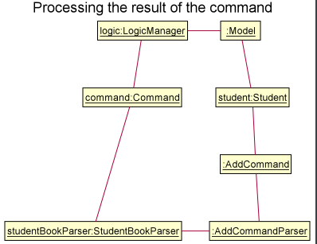

* Table of Contents
{:toc}

--------------------------------------------------------------------------------------------------------------------

## **Setting up, getting started**

Refer to the guide [_Setting up and getting started_](SettingUp.md).

--------------------------------------------------------------------------------------------------------------------

## **Design**

### Architecture

The ***Architecture Diagram*** given above explains the high-level design of the App. Given below is a quick overview of each component.

:bulb: **Tip:** The `.puml` files used to create diagrams in this document can be found in the [diagrams](https://github.com/se-edu/addressbook-level3/tree/master/docs/diagrams/) folder. Refer to the [_PlantUML Tutorial_ at se-edu/guides](https://se-education.org/guides/tutorials/plantUml.html) to learn how to create and edit diagrams.

**`Main`** has two classes called [`Main`](https://github.com/se-edu/addressbook-level3/tree/master/src/main/java/seedu/address/Main.java) and [`MainApp`](https://github.com/se-edu/addressbook-level3/tree/master/src/main/java/seedu/address/MainApp.java). It is responsible for,
* At app launch: Initializes the components in the correct sequence, and connects them up with each other.
* At shut down: Shuts down the components and invokes cleanup methods where necessary.

[**`Commons`**](#common-classes) represents a collection of classes used by multiple other components.

The rest of the App consists of four components.

* [**`UI`**](#ui-component): The UI of the App.
* [**`Logic`**](#logic-component): The command executor.
* [**`Model`**](#model-component): Holds the data of the App in memory.
* [**`Storage`**](#storage-component): Reads data from, and writes data to, the hard disk.

Each of the four components,

* defines its *API* in an `interface` with the same name as the Component.
* exposes its functionality using a concrete `{Component Name}Manager` class (which implements the corresponding API `interface` mentioned in the previous point.

For example, the `Logic` component (see the class diagram given below) defines its API in the `Logic.java` interface and exposes its functionality using the `LogicManager.java` class which implements the `Logic` interface.

**How the architecture components interact with each other**

The *Sequence Diagram* below shows how the components interact with each other for the scenario where the user issues the command `delete 1`.

The sections below give more details of each component.

### UI component

**API** :
[`Ui.java`](https://github.com/se-edu/addressbook-level3/tree/master/src/main/java/seedu/address/ui/Ui.java)

The UI consists of a `MainWindow` that is made up of parts e.g.`CommandBox`, `ResultDisplay`, `PersonListPanel`, `AppointmentListPanel`, `StatusBarFooter` etc. All these, including the `MainWindow`, inherit from the abstract `UiPart` class.

The `UI` component uses JavaFx UI framework. The layout of these UI parts are defined in matching `.fxml` files that are in the `src/main/resources/view` folder. For example, the layout of the [`MainWindow`](https://github.com/se-edu/addressbook-level3/tree/master/src/main/java/seedu/address/ui/MainWindow.java) is specified in [`MainWindow.fxml`](https://github.com/se-edu/addressbook-level3/tree/master/src/main/resources/view/MainWindow.fxml)

The `UI` component,

* Executes user commands using the `Logic` component.
* Listens for changes to `Model` data so that the UI can be updated with the modified data.

### Logic component

**API** :
[`Logic.java`](https://github.com/se-edu/addressbook-level3/tree/master/src/main/java/seedu/address/logic/Logic.java)

1. `Logic` uses the `AddressBookParser` class to parse the user command.
1. This results in a `Command` object which is executed by the `LogicManager`.
1. The command execution can affect the `Model` (e.g. adding a person).
1. The result of the command execution is encapsulated as a `CommandResult` object which is passed back to the `Ui`.
1. In addition, the `CommandResult` object can also instruct the `Ui` to perform certain actions, such as displaying help to the user.

Given below is the Sequence Diagram for interactions within the `Logic` component for the `execute("delete 1")` API call.

:information_source: **Note:** The lifeline for `DeleteCommandParser` should end at the destroy marker (X) but due to a limitation of PlantUML, the lifeline reaches the end of diagram.

### Model component

**API** : [`Model.java`](https://github.com/se-edu/addressbook-level3/tree/master/src/main/java/seedu/address/model/Model.java)

The `Model`,

* stores a `UserPref` object that represents the user’s preferences.
* stores the address book data.
* exposes an unmodifiable `ObservableList<Person>` that can be 'observed' e.g. the UI can be bound to this list so that the UI automatically updates when the data in the list change.
* does not depend on any of the other three components.

:information_source: **Note:** An alternative (arguably, a more OOP) model is given below. It has a `Tag` list in the `AddressBook`, which `Person` references. This allows `AddressBook` to only require one `Tag` object per unique `Tag`, instead of each `Person` needing their own `Tag` object. 

### Storage component

**API** : [`Storage.java`](https://github.com/se-edu/addressbook-level3/tree/master/src/main/java/seedu/address/storage/Storage.java)

The `Storage` component,
* can save `UserPref` objects in json format and read it back.
* can save the address book data in json format and read it back.

### Common classes

Classes used by multiple components are in the `seedu.addressbook.commons` package.

--------------------------------------------------------------------------------------------------------------------

## **Implementation**

This section describes some noteworthy details on how certain features are implemented.

### Add Student

#### Actual Implementation

The `Add` Student mechanism is implemented in the `AddCommand` class and facilitated by the following classes:
* `Command`. `AddCommand` extends `Command` and overrides the `execute` method, which adds a `Person` to the `Model`. 
* `AddCommandParser`. It implements the `Parser` interface, which is used by all commands to read user input. `AddCommandParser` also checks the parameters of `AddCommand` and make sures that the input adheres to the specified format. 

All 8 compulsory fields and 1 optional field in `Person` are updated and added to the system following the user input. 

Given below is an example usage scenario and how the `Add` Student mechanism behaves at each step.

Step 1: The user executes `add n/John Doe i/A1234567X f/COM p/98765432 e/johnd@example.com a/John street, block 123, #01-01 s/vaccinated m/peanut allergy r/RVRC` to add a student. The `AddressBookParser` class determines that the command called is `Add`, and therefore creates a new `AddCommandParser` instance to parse the command.

Step 2: The `AddCommandParser` instance obtains the user input and checks for its validity. It then returns a new `AddCommand` instance to the `LogicManager` via the `AddressBookParser` class.

> **NOTE:** If the input format is incorrect or not found, `AddCommandParser` will throw a `ParseException` to tell the user about the error, and execution will stop. 

Step 3: With the `AddCommand` instance, the overridden `execute` method is called to add the `Model` to the `Person`. The `LogicManager` then receives the result of the execution of the command. 

Step 4: The added `Person` is saved into the `StudentBook`. 

The following sequence diagram shows how the `Add` operation works:

The following activity diagram summarizes what happens when a user executes the `Add` command:

#### Design consideration:

##### Aspect: How `Add` Student executes

* **Alternative 1 (current choice):** Add all the attributes of a student at once
    * Pros: 
      * All the student attributes will be completed in one command, less likely to introduce bugs. 
    * Cons: 
      * Command can be difficult to use, confusing to check. 
      * User needs to know all the attributes of a student before adding to system.  

* **Alternative 2:** Add each student attribute individually
  * Pros: 
    * Easier for user to input, potentially fewer mistakes as user can check each attribute individually.
    * User does not need to know all the information of a student before adding to system. 
  * Cons: 
    * User could forget to add certain attributes, potentially causing bugs later. 
    
In the end, Alternative 1 was chosen because it is less likely to introduce bugs into the system, even though it comes with some usability cost. However, the cost of having multiple bugs could be greater. Moreover, the user can use the edit command afterwards to fix any incorrect information added. This would help to mitigate some downsides of this implementation.

_{more aspects and alternatives to be added}_

--------------------------------------------------------------------------------------------------------------------

## **Documentation, logging, testing, configuration, dev-ops**

* [Documentation guide](Documentation.md)
* [Testing guide](Testing.md)
* [Logging guide](Logging.md)
* [Configuration guide](Configuration.md)
* [DevOps guide](DevOps.md)

--------------------------------------------------------------------------------------------------------------------

## **Appendix: Requirements**

### Product scope

**Target user profile**:

* UHC staff who has a need to manage a significant number of appointments
* UHC staff who has to keep track of NUS students' COVID-19 vaccinations regarding:
  * Who has been vaccinated
  * Who does not want to be vaccinated
  * Who wants to be vaccinated
    * Priority for the vaccine
    * Medical histories, existing medical conditions and allergies
* Prefers desktop apps over other types
* Can type fast
* Prefers typing to mouse interactions
* Is reasonably comfortable using CLI apps

**Value proposition**: a one stop management app to efficiently track and schedule COVID-19 vaccinations for NUS students

### User stories

Priorities: High (must have) - `* * *`, Medium (nice to have) - `* *`, Low (unlikely to have) - `*`

| Priority | As a …​                                 | I want to …​                | So that I can…​                                                     |
| -------- | ------------------------------------------ | ------------------------------ | ---------------------------------------------------------------------- |
| `* * *`  | new user                                   | see usage instructions         | refer to instructions when I forget how to use the App                 |
| `* * *`  | user                                       | add a new student               | keep track of that student's vaccination status                                                                       |
| `* * *`  | user                                       | delete a student                | remove entries that I no longer need or accidentally added                                |
| `* * *`  | user                                       | find a person by matriculation number          | locate student details without traversing the entire list |
| `* * *`  | user                                       | filter student records           | view a specific group of student records  |
| `* * *`  | user                                       | list all students              | view all student records at one go                                     |
| `* * *`  | user                                       | list all upcoming appointments | view all appointments at one go

*{More to be added}*

### Use cases

(For all use cases below, the **System** is the `Vax@NUS` and the **Actor** is the `user`, unless specified otherwise)

**Use case: Add a student entry**

**MSS**

1.  User requests to add a specific student entry.
2.  System prompts for student's details.
3.  User inputs the respective details.
4.  System adds the student entry.

    Use case ends.

**Extensions**

* 1a. The specified student entry exists in the system.

    * 1a1. System shows an error message.
  
        Use case ends.

* 3a. User does not give sufficient inputs to add a student entry.

    * 3a1. System shows an error message.
  
        Use case ends.  

**Use case: Add a vaccination appointment**

**MSS**

1.  User requests to add a vaccination appointment.
2.  System prompts for details about the vaccination appointment.
3.  User inputs the respective details.
4.  System adds the vaccination appointment.

    Use case ends.

**Extensions**

* 3a. 3a. User does not give sufficient inputs to add a vaccination appointment.

    * 3a1. System shows an error message.
  
        Use case ends.
        
* 4a. The given appointment date and time clashes with an existing vaccination appointment for another student.
    
   * 4a1. System shows an error message.

      Use case ends.  
  
**Use case: Delete a student**

**MSS**

1.  User requests to delete a specific student.
2.  System prompts for confirmation of deletion.
3.  User confirms.
4.  System deletes the student. 

    Use case ends.

**Extensions**

* 1a. Specified student does not exist.

    * 1a1. System shows an error message.
  
        Use case ends.

* 3a. User does not confirm.

  Use case ends.

*{More to be added}*

### Non-Functional Requirements

1.  Should work on any _mainstream OS_ as long as it has Java `11` or above installed.
1.  Should be able to hold up to 35000 students (NUS undergraduate cohort size) and 35000 appointments without a noticeable sluggishness in performance for typical usage.
1.  A user with above average typing speed for regular English text (i.e. not code, not system admin commands) should be able to accomplish most of the tasks faster using commands than using the mouse.
1.  The product is not required to export statistics reports to PDF files.
1.  There should be a mechanism to migrate data so that the application can be used with existing data on different machines.

*{More to be added}*

### Glossary

* **Mainstream OS**: Windows, Linux, Unix, OS-X
* **Vaccine**: Singapore has two approved COVID-19 vaccines, one developed by Pfizer-BioNTech, 
  the other by Moderna. Both require two doses, 21 days apart for Pfizer-BioNTech, 28 days apart for Moderna.
  Two appointments must therefore be created per student. 

--------------------------------------------------------------------------------------------------------------------

## **Appendix: Instructions for manual testing**

Given below are instructions to test the app manually.

:information_source: **Note:** These instructions only provide a starting point for testers to work on;
testers are expected to do more *exploratory* testing.

### Launch and shutdown

1. Initial launch

   1. Download the jar file and copy into an empty folder

   1. Double-click the jar file Expected: Shows the GUI with a set of sample contacts. The window size may not be optimum.

1. Saving window preferences

   1. Resize the window to an optimum size. Move the window to a different location. Close the window.

   1. Re-launch the app by double-clicking the jar file. 
       Expected: The most recent window size and location is retained.

1. _{ more test cases …​ }_

### Deleting a person

1. Deleting a person while all persons are being shown

   1. Prerequisites: List all persons using the `list` command. Multiple persons in the list.

   1. Test case: `delete 1` 
      Expected: First contact is deleted from the list. Details of the deleted contact shown in the status message. Timestamp in the status bar is updated.

   1. Test case: `delete 0` 
      Expected: No person is deleted. Error details shown in the status message. Status bar remains the same.

   1. Other incorrect delete commands to try: `delete`, `delete x`, `...` (where x is larger than the list size) 
      Expected: Similar to previous.

1. _{ more test cases …​ }_

### Saving data

1. Dealing with missing/corrupted data files

   1. _{explain how to simulate a missing/corrupted file, and the expected behavior}_

1. _{ more test cases …​ }_
