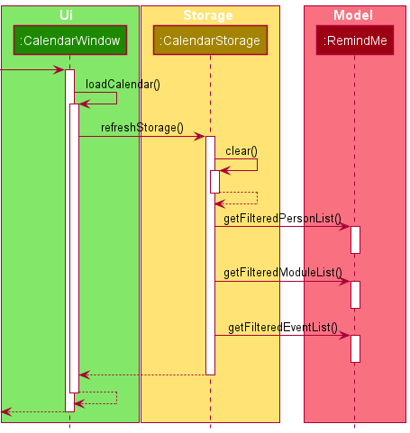

* Table of Contents
{:toc}

--------------------------------------------------------------------------------------------------------------------

## **Setting up, getting started**

Refer to the guide [_Setting up and getting started_](SettingUp.md).

--------------------------------------------------------------------------------------------------------------------

## **Design**

### Architecture

The ***Architecture Diagram*** given above explains the high-level design of the App. Given below is a quick overview of each component.

:bulb: **Tip:** The `.puml` files used to create diagrams in this document can be found in the [diagrams](https://github.com/se-edu/addressbook-level3/tree/master/docs/diagrams/) folder. Refer to the [_PlantUML Tutorial_ at se-edu/guides](https://se-education.org/guides/tutorials/plantUml.html) to learn how to create and edit diagrams.

**`Main`** has two classes called [`Main`](https://github.com/se-edu/addressbook-level3/tree/master/src/main/java/seedu/address/Main.java) and [`MainApp`](https://github.com/se-edu/addressbook-level3/tree/master/src/main/java/seedu/address/MainApp.java). It is responsible for,
* At app launch: Initializes the components in the correct sequence, and connects them up with each other.
* At shut down: Shuts down the components and invokes cleanup methods where necessary.

[**`Commons`**](#common-classes) represents a collection of classes used by multiple other components.

The rest of the App consists of four components.

* [**`UI`**](#ui-component): The UI of the App.
* [**`Logic`**](#logic-component): The command executor.
* [**`Model`**](#model-component): Holds the data of the App in memory.
* [**`Storage`**](#storage-component): Reads data from, and writes data to, the hard disk.

Each of the four components,

* defines its *API* in an `interface` with the same name as the Component.
* exposes its functionality using a concrete `{Component Name}Manager` class (which implements the corresponding API `interface` mentioned in the previous point.

For example, the `Logic` component (see the class diagram given below) defines its API in the `Logic.java` interface and exposes its functionality using the `LogicManager.java` class which implements the `Logic` interface.

**How the architecture components interact with each other**

The *Sequence Diagram* below shows how the components interact with each other for the scenario where the user issues the command `delete 1`.

The sections below give more details of each component.

### UI component

**API** :
[`Ui.java`](https://github.com/se-edu/addressbook-level3/tree/master/src/main/java/seedu/address/ui/Ui.java)

The UI consists of a `MainWindow` that is made up of parts e.g.`CommandBox`, `ResultDisplay`, `PersonListPanel`, `StatusBarFooter` etc. All these, including the `MainWindow`, inherit from the abstract `UiPart` class.

The `UI` component uses JavaFx UI framework. The layout of these UI parts are defined in matching `.fxml` files that are in the `src/main/resources/view` folder. For example, the layout of the [`MainWindow`](https://github.com/se-edu/addressbook-level3/tree/master/src/main/java/seedu/address/ui/MainWindow.java) is specified in [`MainWindow.fxml`](https://github.com/se-edu/addressbook-level3/tree/master/src/main/resources/view/MainWindow.fxml)

The `UI` component,

* Executes user commands using the `Logic` component.
* Listens for changes to `Model` data so that the UI can be updated with the modified data.

### Logic component

**API** :
[`Logic.java`](https://github.com/se-edu/addressbook-level3/tree/master/src/main/java/seedu/address/logic/Logic.java)

1. `Logic` uses the `AddressBookParser` class to parse the user command.
1. This results in a `Command` object which is executed by the `LogicManager`.
1. The command execution can affect the `Model` (e.g. adding a person).
1. The result of the command execution is encapsulated as a `CommandResult` object which is passed back to the `Ui`.
1. In addition, the `CommandResult` object can also instruct the `Ui` to perform certain actions, such as displaying help to the user.

Given below is the Sequence Diagram for interactions within the `Logic` component for the `execute("delete 1")` API call.

:information_source: **Note:** The lifeline for `DeleteCommandParser` should end at the destroy marker (X) but due to a limitation of PlantUML, the lifeline reaches the end of diagram.

### Model component

**API** : [`Model.java`](https://github.com/se-edu/addressbook-level3/tree/master/src/main/java/seedu/address/model/Model.java)

The `Model`,

* stores a `UserPref` object that represents the user’s preferences.
* stores the address book data.
* exposes an unmodifiable `ObservableList<Person>` that can be 'observed' e.g. the UI can be bound to this list so that the UI automatically updates when the data in the list change.
* does not depend on any of the other three components.

:information_source: **Note:** An alternative (arguably, a more OOP) model is given below. It has a `Tag` list in the `AddressBook`, which `Person` references. This allows `AddressBook` to only require one `Tag` object per unique `Tag`, instead of each `Person` needing their own `Tag` object. 

### Storage component

**API** : [`Storage.java`](https://github.com/se-edu/addressbook-level3/tree/master/src/main/java/seedu/address/storage/Storage.java)

The `Storage` component,
* can save `UserPref` objects in json format and read it back.
* can save the address book data in json format and read it back.

### Common classes

Classes used by multiple components are in the `seedu.addressbook.commons` package.

--------------------------------------------------------------------------------------------------------------------

## **Implementation**

This section describes some noteworthy details on how certain features are implemented.

### \[Proposed\] Undo/redo feature

#### Proposed Implementation

The proposed undo/redo mechanism is facilitated by `VersionedAddressBook`. It extends `AddressBook` with an undo/redo history, stored internally as an `addressBookStateList` and `currentStatePointer`. Additionally, it implements the following operations:

* `VersionedAddressBook#commit()` — Saves the current address book state in its history.
* `VersionedAddressBook#undo()` — Restores the previous address book state from its history.
* `VersionedAddressBook#redo()` — Restores a previously undone address book state from its history.

These operations are exposed in the `Model` interface as `Model#commitAddressBook()`, `Model#undoAddressBook()` and `Model#redoAddressBook()` respectively.

Given below is an example usage scenario and how the undo/redo mechanism behaves at each step.

Step 1. The user launches the application for the first time. The `VersionedAddressBook` will be initialized with the initial address book state, and the `currentStatePointer` pointing to that single address book state.

Step 2. The user executes `delete 5` command to delete the 5th person in the address book. The `delete` command calls `Model#commitAddressBook()`, causing the modified state of the address book after the `delete 5` command executes to be saved in the `addressBookStateList`, and the `currentStatePointer` is shifted to the newly inserted address book state.

Step 3. The user executes `add n/David …​` to add a new person. The `add` command also calls `Model#commitAddressBook()`, causing another modified address book state to be saved into the `addressBookStateList`.

:information_source: **Note:** If a command fails its execution, it will not call `Model#commitAddressBook()`, so the address book state will not be saved into the `addressBookStateList`.

Step 4. The user now decides that adding the person was a mistake, and decides to undo that action by executing the `undo` command. The `undo` command will call `Model#undoAddressBook()`, which will shift the `currentStatePointer` once to the left, pointing it to the previous address book state, and restores the address book to that state.

:information_source: **Note:** If the `currentStatePointer` is at index 0, pointing to the initial AddressBook state, then there are no previous AddressBook states to restore. The `undo` command uses `Model#canUndoAddressBook()` to check if this is the case. If so, it will return an error to the user rather
than attempting to perform the undo.

The following sequence diagram shows how the undo operation works:

:information_source: **Note:** The lifeline for `UndoCommand` should end at the destroy marker (X) but due to a limitation of PlantUML, the lifeline reaches the end of diagram.

The `redo` command does the opposite — it calls `Model#redoAddressBook()`, which shifts the `currentStatePointer` once to the right, pointing to the previously undone state, and restores the address book to that state.

:information_source: **Note:** If the `currentStatePointer` is at index `addressBookStateList.size() - 1`, pointing to the latest address book state, then there are no undone AddressBook states to restore. The `redo` command uses `Model#canRedoAddressBook()` to check if this is the case. If so, it will return an error to the user rather than attempting to perform the redo.

Step 5. The user then decides to execute the command `list`. Commands that do not modify the address book, such as `list`, will usually not call `Model#commitAddressBook()`, `Model#undoAddressBook()` or `Model#redoAddressBook()`. Thus, the `addressBookStateList` remains unchanged.

Step 6. The user executes `clear`, which calls `Model#commitAddressBook()`. Since the `currentStatePointer` is not pointing at the end of the `addressBookStateList`, all address book states after the `currentStatePointer` will be purged. Reason: It no longer makes sense to redo the `add n/David …​` command. This is the behavior that most modern desktop applications follow.

The following activity diagram summarizes what happens when a user executes a new command:

#### Design consideration:

##### Aspect: How undo & redo executes

* **Alternative 1 (current choice):** Saves the entire address book.
  * Pros: Easy to implement.
  * Cons: May have performance issues in terms of memory usage.

* **Alternative 2:** Individual command knows how to undo/redo by
  itself.
  * Pros: Will use less memory (e.g. for `delete`, just save the person being deleted).
  * Cons: We must ensure that the implementation of each individual command are correct.

_{more aspects and alternatives to be added}_

### \[Proposed\] Data archiving

_{Explain here how the data archiving feature will be implemented}_

## Add feature

### Proposed Implementation

The proposed add implementation is facilitated by `ModelManager`, which extends `Model`. `ModelManager` contains FilteredList of each entities:
* Persons
* Modules
* General Events

Given below is an example usage scenario and how the find mechanism behaves at each step. Input: `add m/CS2103T`

Step 1. Your input is parsed into `RemindMeParser` using the `parseCommand` method.

Step 2: Based on the command word of your input (i.e., `add`), an AddCommandParser will be used.

Step 3: In `AddCommandParser#parseCommand`, your input will be tokenized using `ArgumentTokenizer`. `ArgumentTokenizer` uses your input, then searches for the prefixes and returns the `ArgumentMultimap`.

Step 4: Using the `ArgumentMultimap` checks the prefixes in your input and returns the respective `AddCommandParser`.
* Module: `m/`: `AddModuleCommandPaser`
* Person: `n/`: `AddPersonCommandParser`
* General Event: `g/`: `AddGeneralEventParser`  
  if it is an unknown prefix, `parseCommand` will throw a ParseException and returns a `AddMessageUsage`. Since the input is `m/`, `AddModuleCommandPaser` will be returned.

Step 5: In `AddModuleCommandPaser`, `AddModuleCommandPaser#parse` is called. Again `ArgumentMultimap` is created using `ArgumentTokenizer` but only with `Module` prefix: `m/`. The class diagram shows the Parser class diagram when passing your input into the appropriate `AddModuleCommand`.

Step 6: The `parse` method does a few checks:
* If there isn't the `PREFIX`: `m/` present, or the preamble of the `PREFIX` is not empty, or your search input after the `PREFIX` is whitespaces, then `parse` method will throw `ParseException` and returns a `AddMessageUsage` for `Module`.
* Else your inputs is used to create a `title` which is then used to create a `module`.

Step 7: `AddModuleCommand` is executed:
* Using the `module` as an input, the `Model#hasModule` method checks if the given `module` is a duplicate or not. If it is, it will throw `CommandException` and return a `MESSAGE_DUPLICATE_MODULE`.
* Else, using the `module` as an input, the `Model#addModule` method is called, and adds the `module` to the `UniqueModuleList` in `RemindMe`.

Step 8: The `CommandResult` is logged in the `logger` and using `resultDisplay#setFeedacktoUser`, returning `resultDisplay`. Using `resultDisplay#setText` shows the `CommandResult` in the `GUI`.

The following sequence diagram shows how the find operation works:

## Find feature

### Proposed Implementation

The proposed find implementation is facilitated by `ModelManager`, which extends `Model`. `ModelManager` contains FilteredList of each entities:
* Persons
* Modules
* General Events

Given below is an example usage scenario and how the find mechanism behaves at each step. Input: `find m/CS2101`

Step 1. Your input is parsed into `RemindMeParser` using the `parseCommand` method.

Step 2: Based on the command word of your input (i.e., `find`), a FindCommandParser will be used.

Step 3: In `FindCommandParser#parseCommand`, your input will be tokenized using `ArgumentTokenizer`. `ArgumentTokenizer` uses your input, then searches for the prefixes and returns the `ArgumentMultimap`.

Step 4: Using the `ArgumentMultimap` checks the prefixes in your input and returns the respective `FindCommandParser`.
* Module: `m/`: `FindModuleCommandPaser`
* Person: `n/`: `FindPersonCommandParser`
* General Event: `g/`: `FindGeneralEventParser`  
  if it is an unknown prefix, `parseCommand` will throw a ParseException and returns a `FindMessageUsage`. Since the input is `m/`, `FindModuleCommandPaser` will be returned.

Step 5: In `FindModuleCommandPaser`, `FindModuleCommandPaser#parse` is called. Again `ArgumentMultimap` is created using `ArgumentTokenizer` but only with `Module` prefix: `m/`. The class diagram shows the Parser class diagram when passing your input into the appropriate `FindModuleCommand`.  

Step 6: The `parse` method does a few checks:
* If there isn't the `PREFIX`: `m/` present, or the preamble of the `PREFIX` is not empty, or your search input after the `PREFIX` is whitespaces, then `parse` method will throw `ParseException` and returns a `FindMessageUsage` for `Module`.
* Else your inputs is split into individual keywords, and contained as a `List of keywords`.

Step 7: The keywords will be stored in `TitleContainsKeywordsPredicate` as a `predicate`, then stored in `FindModuleCommand`.

Step 8: `FindModuleCommand` is executed:
* Using the `predicate`, the `Model#updateFilteredModuleList` is called with `predicate` as input.
* Using the `FilteredList<Module>#setPredicate` returns the filtered list of modules with titles matching to any of the `keywords` as a `CommandResult`.

Step 9: The `CommandResult` is logged in the `logger` and using `resultDisplay#setFeedacktoUser`, returning `resultDisplay`. Using `resultDisplay#setText` shows the `CommandResult` in the `GUI`.

The following sequence diagram shows how the find operation works:

  

### Delete Assignment

#### Proposed Implementation
RemindMe is able to delete an existing `Assignment` in an existing `Module`

The diagram below shows the relationships between `DeleteAssignmentCommand` and `DeleteAssignmentCommandParser` under 
the `Logic` component and the relationship between `Module` and `Assignment` under the `Model` component.

The following example usage scenario describes how the delete mechanism behaves at each step.

    Assuming RemindMe has a Module named CS2103. This Module contains a AssignmentList that stores
    a list of Assignmnets:
    
    [D] Assigment1 due on  01/01/2021 2359
    [X] Assignment2 due on 05/05/2022 2359
    [D] Assignment3 due on 25/03/1021 2359
    
Step 1. The user launches the RemindMe application, `LogicManager` and `RemindMeParser` will be initialized.

Step 2. The user executes `delete m/CS2103 a/3` to delete the assignment at `Index` 3 from the `AssignmentList` of
the `Module` CS2103. This invokes the method `LogicManager#execute(String)` which then invokes the 
`RemindMeParser#parseCommand(String)` method.

Step 3. RemindMeParser will parse the command word `delete` and will create a DeleteCommandParser. The 
DeleteCommandParser will tokenize the prefixes and will choose to create a deleteAssignmentCommandParser to parse
the `Title` CS2103 and `Index` 3.

Step 4. The `DeleteAssignmentCommandParser` will create a new `DeleteAssignmentCommand` with the `Title` CS203 and 
`Index` 3 and return it back to the LogicManager.

Step 5. The `DeleteAssignmentCommand` verifies whether the target `Module` exist in the `FilteredModuleList` 
and whether an assignment exists at `Index` 3. If either fails, `DeleteAssignmentCommand` will throw a CommandException.
If not, it will invoke the method `Module#deleteAssignment(Index)` which removes the assignment at `Index` 3 from the 
`AssignmentList`

Step 7. A `CommandResult` will be created with a successful message if the user inputs are valid
and returned to `LogicManager`.

Step 8. Lastly, `LogicManager` saves the updated RemindMe.

The above process is shown in the following sequence diagram:
[!DeleteFeatureSequenceDiagram](images/DeleteFeatureSequenceDiagram.png)  

The following activity diagram summarises the general workflow for the Delete Command:
[!DeleteFeatureActivityDiagram](images/DeleteFeatureActivityDiagram.png)  

### 5 Edit Assignment

#### 5.1 Implementation
RemindMe is capable of editing an existing `assignment`. 

Below is a class diagram to show the relationship between `EditAssignmentCommand and EditAssignmentCommandParser` under 
the `Logic` component and the relationship between `Module` and `Assignment` under the `Model` component.

Given below is an example usage scenario and how the edit mechanism behaves at each step.

     Assuming RemindMe already has a Module named CS2103 and an Assignment Tut1 with time 01/01/2021 2359 stored.

Step 1. The user launches the RemindMe application, `LogicManager` and `RemindMeParser` will be initialized.

Step 2. The user executes `edit m/CS2103 a/1 d/Tut2` to edit the description of the first assignment
in the CS2103 module. This invokes the method `LogicManager#execute(String)` which then invokes the
 `RemindedParser#parseCommand(String)` method.

Step 3. RemindMeParser will then create `EditCommandParser` 
which detects the edit conditions and calls `EditAssignmentCommandParser` 
to parse inputs according to the format specified.

Step 4. The `EditAssignmentCommandParser` will create a new `EditAssignmentCommand` 
with the given module `CS2103` , the given index `1`, the description `Tut2` and a null 
date and return it back to `LogicManager`.

Step 5. `LogicManager` calls the `EditAssignmentCommand#execute(Model)` method 
which then verifies whether the target module and assignment exists and whether
 the edited content is valid, eg. same content.

step 6. The `Model` calls `RemindMe#editAssignment(Module, index, Description)` method which retrieves
the module to edit from the `UniqueModuleList` ,retrieves and update the assignment and place the
module back to the list.

Step 7. A `CommandResult` will be created with a successful message if the user inputs are valid
and returned to `LogicManager`.

Step 8. Lastly, `LogicManager` saves the updated RemindMe.

    *Note: An EditAssignmentCommand can either change the description or date of an assignment, not both.
    
Step 5. `LogicManager` calls the `EditAssignmentCommand#execute(Model)` method 
which then verifies whether the target module and assignment exists and whether the edited content is valid, eg. same content.

step 6. The `Model` calls `RemindMe#editAssignment(Module, index, Description)` method which retrieves
the module to edit from the `UniqueModuleList` ,retrieves and update the assignment and place the
module back to the list.

Step 7. A `CommandResult` will be created with a successful message if the user inputs are valid
and returned to `LogicManager`.

Step 8. Lastly, `LogicManager` saves the updated RemindMe.

The above process is shown in the following sequence diagram:
[!EditFeatureSequenceDiagram](images/EditFeatureSequenceDiagram.png)

The following activity diagram summarises the general workflow for the Edit Command:
[!EditFeatureActivityDiagram](images/EditFeatureActivityDiagram.png)

## Calendar feature

### Proposed Implementation

At the start of the application, a calendar window is created for the UI.

Given below is an example of how the calendar UI is created.

Step1: `CalendarWindow` will be created at the start of the program.

Step2: `CalendarWindow` will then call itself `CalendarWindow#loadCalendar` to load the details into the calendar.

Step3: In the `loadCalendar` method,  to ensure that the details inside calendar are the latest, 
the method will then call `CalendarStorage#refreshStorage` to update the storage for the calendar.

Step4: In the `refreshStorage` method, calendar storage will be cleared first by calling `CalendarStorage#clear`
and then the details about events are retrieved from RemindMe model by calling `RemindMe#getFilteredPersonList`
, `RemindMe#getFilteredModuleList` and `RemindMe#getFilteredEventList`.

Step5: With calendar storage updated, the calendar will then store events to each respective day and then the calendar
will be ready to be displayed as a GUI. 

Given below is an example usage scenario and how the calendar mechanism behaves at each step.  Input: `calendar`.

Step 1. Your input is parsed into `RemindMeParser` using the `parseCommand` method.

Step 2: Based on the command word of your input (i.e., `calendar`), a `CalendarCommand` will be created.

Step 3: `CalendarCommand` is executed, and that will set boolean `showCalendar` to be true, the boolean is then 
pushed to `MainWindow` to call `MainWindow#handleCalendar` to show the `CalendarWindow`.

Step 4: `CalendarWindow` loaded by its fxml file and called `CalendarWindow#show` to show its shown 
as a pop-up window for you.

--------------------------------------------------------------------------------------------------------------------

## **Documentation, logging, testing, configuration, dev-ops**

* [Documentation guide](Documentation.md)
* [Testing guide](Testing.md)
* [Logging guide](Logging.md)
* [Configuration guide](Configuration.md)
* [DevOps guide](DevOps.md)

--------------------------------------------------------------------------------------------------------------------

## **Appendix: Requirements**

### Product scope

**Target user profile**:

* has a need to manage exams or events deadlines
* prefer desktop apps over other types
* tend to forget upcoming events/exams
* prefers typing to mouse interactions
* is reasonably comfortable using CLI apps

**Value proposition**: manage deadlines and events faster than a typical mouse/GUI driven app

### User stories

Priorities: High (must have) - `* * *`, Medium (nice to have) - `* *`, Low (unlikely to have) - `*`

| Priority | As a …​                                    | I want to …​                     | So that I can…​                                                        |
| -------- | ------------------------------------------ | ------------------------------ | ---------------------------------------------------------------------- |
| `* * *`  | new user                                   | see instructions help page     | refer to help page when I forget how to use the App                 |
| `* * *`  | student taking numerous modules            | add events/exams/assignments deadlines              |                                                                        |
| `* * *`  | user                                       | delete a deadline               | view the ones that matter                                  |
| `* * *`  | user                                       | edit a deadline          | can adjust schedule when there is a change of plan |
| `* *`    | user                                       | view events in a calendar view   | to have a better sense of the upcoming events                |
| `* *`      | forgetful student | get reminded about the most urgent events/assignments/exams          | finish the deadlines on time   
| `* `    | student                                    | distinguish among modules,exams and assignments | |
| `* `    | student                                     | view which friend of mine is enrolled in the same module/event | seek help from them |

*{More to be added}*

### Use cases

(For all use cases below, the **System** is the `RemindMe` and the **Actor** is the `user`, unless specified otherwise)

### Use Case: `UC01` - add assignment

**MSS:**

1. User enters the details of assignment.
2. System adds assignment and displays assignments info.
  Use case ends.
   
**Extensions:**

* 1a. System detects an error in format in entered data.
    * 1a1. System display error message.
      Use case ends.

### Use Case: `UC02` - delete assignment

**MSS:**

1. User enters number to delete a assignment.
2. System deletes assignment and displays assignments info.
     Use case ends.

**Extensions:**

* 1a. System detects an error in number in entered data (out of range).
    * 1a1. System display error message.
        Use case ends.

### Use Case: `UC03` - view assignments

**MSS:**

1. User enters the command to view assignments.
2. System shows list of assignments.
     Use case ends.

**Extensions:**

* 1a. System detects an error in formatting of command.
    * 1a1. System display error message.
        Use case ends.

### Use Case: `UC04` - view events

**MSS:**

1. User enters the command to view events.
2. System shows list of events.
     Use case ends.

**Extensions:**

* 1a. System detects an error in formatting of command.
    * 1a1. System display error message.
        Use case ends.

### Use Case: `UC05` - toggle reminder

**MSS:**

1. User wants to turn on reminder for system.
2. User enters command to turn on reminder.
3. System display message that reminder is on.
     Step 1 - 3 are the same for off.
     Use case ends at step 3.

**Extensions:**

* 2a. System detects an error in formatting of command.
    * 2a1. System display error message.
        Use case ends.

### Use Case: `UC06` - view help

**MSS:**

1. User enters the command to view help.
2. System shows help and url for more in depth help.
     Use case ends.

**Extensions:**

* 1a. System detects an error in formatting of command.
    * 1a1. System display error message.
        Use case ends.

### Use Case: `UC07` - view calendar

**MSS:**

1. User enters the command to view calendar.
2. System shows calendar.
     Use case ends.

**Extensions:**

* 1a. System detects an error in formatting of command.
    * 1a1. System display error message.
        Use case ends.

### Use Case: `UC08` - save data

**MSS:**

1. User enters the command to sava data.
2. System saves data and show saved message.
     Use case ends.

**Extensions:**

* 1a. System detects an error in formatting of command.
    * 1a1. System display error message.
        Use case ends.

### Use Case: `UC09` - edit data

**MSS:**

1. User enters the command to edit data.
2. System edit data and show edited message.
     Use case ends.

**Extensions:**

* 1a. System detects an error in formatting of command.
    * 1a1. System display error message.
        Use case ends.
      
*{More to be added}*

### Non-Functional Requirements

1.  Should work on any _mainstream OS_ as long as it has Java `11` or above installed.
2.  Should be able to hold up to 1000 persons and tasks without a noticeable sluggishness in performance for typical usage.
3.  A user with above average typing speed for regular English text (i.e. not code, not system admin commands) should be able to accomplish most of the tasks faster using commands than using the mouse.
4.  RemindMe should be able to respond within one seconds.
5.  RemindMe should be usable by novice who has no prior experience with coding.

*{More to be added}*

### Glossary

* **Mainstream OS**: Windows, Linux, Unix, OS-X
* **Module**: A school module consists of module ID and module name. 
* **Examination**: Consists of a start time, end time and date which it occurs on and the relevant module.
* **Event**: Consists of a start time, end time, and the date which it occurs on.
* **Assignment**: Consists of a deadlines and the relevant module.

--------------------------------------------------------------------------------------------------------------------

## **Appendix: Instructions for manual testing**

Given below are instructions to test the app manually.

:information_source: **Note:** These instructions only provide a starting point for testers to work on;
testers are expected to do more *exploratory* testing.

### Launch and shutdown

1. Initial launch

   1. Download the jar file and copy into an empty folder

   1. Double-click the jar file Expected: Shows the GUI with a set of sample contacts. The window size may not be optimum.

1. Saving window preferences

   1. Resize the window to an optimum size. Move the window to a different location. Close the window.

   1. Re-launch the app by double-clicking the jar file. 
       Expected: The most recent window size and location is retained.

1. _{ more test cases …​ }_

### Saving data

1. Dealing with missing/corrupted data files

   1. _{explain how to simulate a missing/corrupted file, and the expected behavior}_

1. _{ more test cases …​ }_
