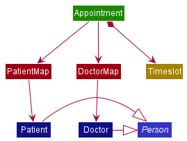

* Table of Contents
{:toc}

--------------------------------------------------------------------------------------------------------------------

## **Setting up, getting started**

Refer to the guide [_Setting up and getting started_](SettingUp.md).

--------------------------------------------------------------------------------------------------------------------

## **Design**

### Architecture

The ***Architecture Diagram*** given above explains the high-level design of the App. Given below is a quick overview of each component.

:bulb: **Tip:** The `.puml` files used to create diagrams in this document can be found in the [diagrams](https://github.com/AY2021S2-CS2103-W17-2/tp/blob/master/docs/diagrams/) folder.

**`Main`** has two classes called [`Main`](https://github.com/AY2021S2-CS2103-W17-2/tp/blob/master/src/main/java/seedu/address/Main.java) and [`MainApp`](https://github.com/AY2021S2-CS2103-W17-2/tp/blob/master/src/main/java/seedu/address/MainApp.java). It is responsible for,
* At app launch: Initializes the components in the correct sequence, and connects them up with each other.
* At shut down: Shuts down the components and invokes cleanup methods where necessary.

[**`Commons`**](#common-classes) represents a collection of classes used by multiple other components.

The rest of the App consists of four components.

* [**`UI`**](#ui-component): The UI of the App.
* [**`Logic`**](#logic-component): The command executor.
* [**`Model`**](#model-component): Holds the data of the App in memory.
* [**`Storage`**](#storage-component): Reads data from, and writes data to, the hard disk.

Each of the four components,

* defines its *API* in an `interface` with the same name as the Component.
* exposes its functionality using a concrete `{Component Name}Manager` class (which implements the corresponding API `interface` mentioned in the previous point.

For example, the `Logic` component (see the class diagram given below) defines its API in the `Logic.java` interface and exposes its functionality using the `LogicManager.java` class which implements the `Logic` interface.

**How the architecture components interact with each other**

The *Sequence Diagram* below shows how the components interact with each other for the scenario where the user issues the command `delete-patient 1`.

The component specifics are elaborated in the following sections.

The ***Appointment Diagram*** given above explains the interactions between the fundamental classes of the App: `Appointment`, `Patient` and `Doctor`.
* `Patient` and `Doctor` are extensions of the `Person` abstract class which defines the criterion for duplicate identities.
* `PatientMap` and `DoctorMap` maintain unique records of patients and doctors respectively via the assignment of `UUID`.
* `Appointment` stores the `UUID` and accesses `Patient` and `Doctor` data through `DoctorMap` and `PatientMap` respectively.
* Conflicts between appointments are then defined by duplicate persons bounded by overlapping `Timeslot`.

This interaction between the 3 classes maintain the integrity of the App's appointment schedule, patient records and doctor records.

### UI component

**API** :
[`Ui.java`](https://github.com/AY2021S2-CS2103-W17-2/tp/blob/master/src/main/java/seedu/address/ui/Ui.java)

The UI consists of a `MainWindow` that is made up of parts e.g.`CommandBox`, `ResultDisplay`,`PatientListPanel`, `DoctorListPanel`, `AppointmentListPanel`, `StatusBarFooter` etc. All these, including the `MainWindow`, inherit from the abstract `UiPart` class.

The `UI` component uses JavaFx UI framework. The layout of these UI parts are defined in matching `.fxml` files that are in the `src/main/resources/view` folder. For example, the layout of the [`MainWindow`](https://github.com/AY2021S2-CS2103-W17-2/tp/blob/master/src/main/java/seedu/address/ui/MainWindow.java) is specified in [`MainWindow.fxml`](https://github.com/AY2021S2-CS2103-W17-2/tp/blob/master/src/main/resources/view/MainWindow.fxml)

The `UI` component,

* Executes user commands using the `Logic` component.
* Listens for changes to `Model` data so that the UI can be updated with the modified data.

### Logic component

**API** :
[`Logic.java`](https://github.com/AY2021S2-CS2103-W17-2/tp/blob/master/src/main/java/seedu/address/logic/Logic.java)

1. `Logic` uses the `UserInputParser` class to parse the user command.
1. This results in a `Command` object which is executed by the `LogicManager`.
1. The command execution can affect the `Model` and `Storage` (e.g. adding a person).
1. The result of the command execution is encapsulated as a `CommandResult` object which is passed back to the `Ui`.
1. In addition, the `CommandResult` object can also instruct the `Ui` to perform certain actions, such as displaying help to the user.

Given below is the Sequence Diagram for interactions within the `Logic` component for the `execute("delete-patient 1")` API call.

:information_source: **Note:** The lifeline for `DeleteCommandParser` should end at the destroy marker (X) but due to a limitation of PlantUML, the lifeline reaches the end of diagram.

### Model component

**API** : [`Model.java`](https://github.com/AY2021S2-CS2103-W17-2/tp/blob/master/src/main/java/seedu/address/model/Model.java)

The `Model`,

* stores a `UserPref` object that represents the user’s preferences.
* stores the address book data and appointment schedule data.
* exposes unmodifiable `ObservableList<Person>` and `ObservableList<Appointment>` that can be 'observed' e.g. the UI can be bound to these lists so that the UI automatically updates when the data in these lists change.
* does not depend on any of the other three components.

The `Person`,

* stores a `Person` class, which the `Doctor` class and `Patient` class inherit from.

The `Appointment`,

* stores a `Appointment` class, which access `Patient` object and `Doctor` object via the `PatientMap` class and `DoctorMap` class.

:information_source: **Note:** An alternative (arguably, a more OOP) Person model is given below. It has a `Tag` list in the `AddressBook`, which `Person` references. This allows `AddressBook` to only require one `Tag` object per unique `Tag`, instead of each `Person` needing their own `Tag` object. Similar design can be applied to the Appointment model. 

### Storage component

**API** : [`Storage.java`](https://github.com/AY2021S2-CS2103-W17-2/tp/blob/master/src/main/java/seedu/address/storage/Storage.java)

The `Storage` component,
* can save `UserPref` objects in json format and read it back.
* can save the address book data in json format and read it back.

### Common classes

Classes used by multiple components are in the `seedu.addressbook.commons` package.

--------------------------------------------------------------------------------------------------------------------

## **Implementation**

This section describes some noteworthy details on how certain features are implemented.

--------------------------------------------------------------------------------------------------------------------

## **Documentation, logging, testing, configuration, dev-ops**

* [Documentation guide](Documentation.md)
* [Testing guide](Testing.md)
* [Logging guide](Logging.md)
* [Configuration guide](Configuration.md)
* [DevOps guide](DevOps.md)

--------------------------------------------------------------------------------------------------------------------

## **Appendix: Requirements**

### Product scope

**Target user profile**:
App-Ointment is intended for Receptionists of Medical Clinics who help schedule appointments, and maintain patient records and accounts.

* has a need to manage a significant number of scheduled appointments
* prefer desktop apps over other types
* can type fast
* prefers typing to mouse interactions
* is reasonably comfortable using CLI apps

**Value proposition**

- Allows users to track and reschedule appointments for a clinic, reducing no-shows.
- Allow users to verify the patient on arriving at the clinic for the appointment.
- No cross clinic support for clinics within a health group.
- No support for users who want to view their own appointments.

### User stories
Priorities: High (must have) - `* * *`, Medium (nice to have) - `* *`, Low (unlikely to have) - `*`

| Priority | As a …​                                      | I want to …​                              | So that I can…​                                                      |
| -------- | ------------------------------------------- | ---------------------------------------- | ------------------------------------------------------------------- |
| `* * *`  | new user                                    | see usage instructions                   | refer to instructions when I forget how to use the App              |
| `* * *`  | user                                        | add a new appointment                    |                                                                     |
| `* * *`  | user                                        | delete an appointment                    | remove appointments that have expired or on behalf of the patient   |
| `* * *`  | user                                        | find an appointment by specific fields   | locate details of relevant appointments without having to go through the entire list |
| `* * *`  | user                                        | edit an appointment by specific fields   | update the appointment information without having to delete and add a new appointment |
| `* * *`  | user                                        | add a new patient                        |                                                                     |
| `* * *`  | user                                        | delete a patient                         | remove patients who on longer have appointments                     |
| `* * *`  | user                                        | find a patient  by specific fields       | locate details of relevant patients without having to go through the entire list |
| `* * *`  | user                                        | edit a patient  by specific fields       | update the patient information without having to delete and add a new patient |
| `* * *`  | user                                        | add a new doctor                         |                                                                     |
| `* * *`  | user                                        | delete a doctor                          | remove doctors who on longer work for the clinic                    |
| `* * *`  | user                                        | find a doctor by specific fields         |  locate details of relevant doctors without having to go through the entire list |
| `* * *`  | user                                        | edit a doctor  by specific fields        | update the doctor information without having to delete and add a new doctor |
| `* * *`  | user                                        | list all appointments                    | see all the appointments or reset the appointment filters           |
| `* * *`  | user                                        | list all patients                        | see all the patients or reset the patient filters                   |
| `* * *`  | user                                        | list all doctors                         | see all the doctors or reset the doctors filters                    |
| `* *`    | user                                        | clear all appointments                   | clear the appointment list without having to delete appointments one by one |
| `* *`    | user                                        | clear all patients                       | clear the patient list without having to delete appointments one by one     |
| `* *`    | user                                        | clear all doctors                        | clear the doctor list without having to delete appointments one by one     |
| `* *`    | user                                        | lookup previous records of an appointment| fill in missing information where ommitted by the appointment       |
| `* *`    | user                                        | lookup previous records of a patient     | fill in missing information where ommitted by the patient           |
| `* *`    | user                                        | lookup previous records of a doctor      | fill in missing information where ommitted by the doctor            |
| `* *`    | user with many appointments in the schedule | be reminded of overdue appointments      | take the appropriate action to resolve the issues                   |
| `* *`    | user with many appointments in the schedule | tag appointments with urgency categories | more urgent appointments can take priority                          |
| `*`      | user with many appointments in the schedule | sort appointments by specific fields     | locate a category of appointments easily                            |
| `*`      | user with many appointments in the schedule | automatically recommended available timings and doctors for new appointments | create appointments without manually checking availability in the schedule |

*{More to be added}*

### Use cases

(For all use cases below, the **System** is the `App-Ointment` and the **Actor** is the `User`, unless specified otherwise)

    For all use cases other than UC01, unless specified otherwise, the use cases will <b>all have UC01 as a precondition</b> (after the user enters the command and corresponding subcommands, if applicable).

 

### UC01: Enters a command:
**Guarantees:**
* Command entered will have a valid command word, with all corresponding required subcommands.

**MSS**
1. User enters a command.
2. App-Ointment attempts to perform the corresponding command.

Use case ends.

**Extensions**
* **1a.** App-Ointment detects an invalid command word from the user.
    * **1a1.** App-Ointment prompts user that the command is invalid, and suggests the closest known command, or "unknown command", if all known commands are too dissimilar. 
    Use case resumes from Step 1.
* **2a.** App-Ointment detects that required subcommands are not specified.
    * **2a1.** App-Ointment prompts user that the command is invalid, i.e. The subcommands do not match the command word.
    Use case resumes from Step 1.

### UC02: Enters Help Command:
**MSS**
1. User enters the `help` command
2. App-Ointment shows the Help Window.

Use case ends.

### UC03: Add a patient 
**MSS**
1. User enters the `add-patient` command and corresponding subcommands.
2. App-Ointment adds a new patient to the patient records.

**Extensions**
* **1a.** App-Ointment detects an invalid subcommand format.
    * **1a1.** App-Ointment prompts user that syntax is incorrect and displays the expected format. 
    Steps 1a1 is repeated until the subcommand entered is correct/free from errors.
    Use case resumes from step 2.

* **1b.** App-Ointment detects that a patient with the same name exists in the patient records.
    * **1b1.** App-Ointment warns user about the duplicate patient. 
    * **1b2.** App-Ointment suggest user to update patient information through an `edit-patient` command instead. 
    Use case ends. 

### UC04: Clear Patient Records
**MSS**
1. User enters the `clear-patient` command.
2. App-Ointment clears the patient records.

Use case ends.

**Extensions**
* **1a** App-Ointment detects at there is at least 1 appointment in the Appointment Schedule.
    * **1a1** App-Ointment prompts user that there are appointments in the appointment schedule, and as such, patient records cannot be cleared, and prompts user to execute the `clear-appt` command first instead.

### UC05: Delete a patient 
**MSS** 
1. User enters the `delete-patient` command and corresponding subcommands. 
2. App-Ointment removes the patient from the patient records. 

**Extensions** 
* **1a.** App-Ointment detects an invalid subcommand format. 
    * **1a1.** App-Ointment prompts user that syntax is incorrect and displays the expected format.  
      Steps 1a1 is repeated until the subcommand entered is correct/free from errors. 
      Use case resumes from step 2. 

* **1b.** The currently displayed list of patients is empty. 
    * **1b1.** App-Ointment prompts user that there are no patients in the current display.  
      Use case ends. 

* **2a.** The index out of the bounds of the displayed list of patients. 
    * **2a1.** App-Ointment warns user that the index is out of bounds and displays the bounds of the displayed list of patients.  
      Steps 2a1 is repeated until the index entered is correct/free from errors. 
      Use case resumes from step 2. 
 
* **2b.** App-Ointment detects at least 1 appointment associated with the patient identified by the index number used in the displayed list of patients.  
    * **2b1.** App-Ointment warns user about the associated appointments, prompts user to use force delete and displays the expected subcommand format.  
    Use case ends. 

### UC06: Edit a patient
**MSS**
1. User enters the `edit-patient` command and corresponding subcommands.
2. App-Ointment changes the details of the patient.

**Extensions**
* **1a.** App-Ointment detects an invalid subcommand format.
    * **1a1.** App-Ointment prompts user that syntax is incorrect and displays the expected format. 
      Steps 1a1 is repeated until the subcommand entered is correct/free from errors.
      Use case resumes from step 2.

* **1b.** The currently displayed list of patients is empty.
    * **1b1.** App-Ointment prompts user that there are no patients in the current display. 
      Use case ends.

* **2a.** The index out of the bounds of the displayed list of patients.
    * **2a1.** App-Ointment warns user that the index is out of bounds and displays the bounds of the displayed list of patients. 
      Steps 2a1 is repeated until the index entered is correct/free from errors.
      Use case resumes from step 2.

### UC07: Find patients by search fields
**MSS**
1. User enters the `find-patient` command and corresponding subcommands.
2. App-Ointment changes the displayed list of patients to fit.

**Extensions**
* **1a.** System detects an invalid subcommand format.
    * **1a1.** App-Ointment prompts user that syntax is incorrect and displays the expected format. 
      Steps 1a1 is repeated until the subcommand entered is correct/free from errors.
      Use case resumes from step 2.

* **2a.** There are no doctors to display.
    * **2a1.** App-Ointment informs user that there are no patients to display. 
      Use case ends.

### UC08: List all patients
**MSS**
1. User enters the `list-patient` command
2. App-Ointment displays all patients in the patient records.

### UC09: Add a doctor 
**MSS**
1. User enters the `add-doctor` command and corresponding subcommands.
2. App-Ointment adds a new doctor to the doctor records.

**Extensions** 
* Similar to `add-patient` command.

### UC10: Clear Doctor Records
**MSS**
1. User enters the `clear-doctor` command.
2. App-Ointment clears the patient records.

Use case ends.

**Extensions**
* Similar to `clear-patient` command.

### UC11: Delete a doctor
**MSS**
1. User enters the `delete-doctor` command and corresponding subcommands.
2. App-Ointment removes the patient from the doctor records.

**Extensions**
* Similar to `delete-patient` command.

### UC12: Edit a doctor
**MSS**
1. User enters the `edit-doctor` command and corresponding subcommands.
2. App-Ointment changes the details of the doctor.

**Extensions**
* Similar to `edit-patient` command.

### UC13: Find doctors by search fields
**MSS**
1. User enters the `find-doctor` command and corresponding subcommands.
2. App-Ointment changes the displayed list of doctors to fit.

**Extensions**
* Similar to `find-patient` command.

### UC14: List all doctors
**MSS**
1. User enters the `list-doctor` command
2. App-Ointment displays all doctors in the doctor records.

### UC15: Add an appointment 
**MSS**
1. User enters the `add-appt` command and corresponding subcommands.
2. App-Ointment adds a new appointment to the appointment schedule.

**Extensions**
* **1a.** App-Ointment detects an invalid subcommand format.
    * **1a1.** App-Ointment prompts user that syntax is incorrect and displays the expected format. 
    Steps 1a1 is repeated until the subcommand entered is correct/free from errors.
    Use case resumes from step 2.

* **1b.** The patient index out of the bounds of the displayed list of patients.
    * **1b1.** App-Ointment warns user that the index is out of bounds and displays the bounds of the displayed list of patients. 
    Steps 1b1 is repeated until the index entered is correct/free from errors.
    Use case resumes from step 2.

* **1c.** App-Ointment detects an existing appointment with the same patient or doctor at an overlapping appointment time.
    * **1c1.** App-Ointment warns user about the conflicting appointment. 
    * **1c2.** App-Ointment suggest user to either change existing appointment details through an `edit-appt` command, before adding the new appointment again, or change the new appointment details. 
    Use case ends. 

### UC16: Clear Appointment Schedule
**MSS**
1. User enters the `clear-patient` command.
2. App-Ointment clears the Appointment Schedule.

Use case ends.

### UC17: Delete an appointment 
**MSS** 
1. User enters the `delete-appt` command and corresponding subcommands. 
2. App-Ointment removes the appointment from the appointment schedule. 

**Extensions** 
* **1a.** App-Ointment detects an invalid subcommand format. 
    * **1a1.** App-Ointment prompts user that syntax is incorrect and displays the expected format.  
      Steps 1a1 is repeated until the subcommand entered is correct/free from errors. 
      Use case resumes from step 2. 

* **1b.** The currently displayed list of appointments is empty. 
    * **1b1.** App-Ointment prompts user that there are no appointments in the current display.  
      Use case ends. 

* **2a.** The index out of the bounds of the displayed list of appointments. 
    * **2a1.** App-Ointment warns user that the index is out of bounds and displays the bounds of the displayed list of appointments.  
      Steps 2a1 is repeated until the index entered is correct/free from errors. 
      Use case resumes from step 2. 

### UC18: Edit an appointment
**MSS**
1. User enters the `edit-appt` command and corresponding subcommands.
2. App-Ointment changes the details of the appointment.

**Extensions**
* **1a.** App-Ointment detects an invalid subcommand format.
    * **1a1.** App-Ointment prompts user that syntax is incorrect and displays the expected format. 
    Steps 1a1 is repeated until the subcommand entered is correct/free from errors.
    Use case resumes from step 2.

* **1b.** The currently displayed list of appointments is empty.
    * **1b1.** App-Ointment prompts user that there are no appointments in the current display. 
    Use case ends.

* **2a.** The index out of the bounds of the displayed list of appointments.
    * **2a1.** App-Ointment warns user that the index is out of bounds and displays the bounds of the displayed list of appointments. 
    Steps 2a1 is repeated until the index entered is correct/free from errors.
    Use case resumes from step 2.

* **2b.** App-Ointment detects an existing appointment having conflict with the new appointment.
    * **2b1.** App-Ointment warns user about the conflicting appointment. 
    * **2b2.** App-Ointment suggest user to either change the other existing appointment details through a separate `edit-appt` command, before editing the current appointment again, or change the edit details of the current appointment. 
    Use case ends.

### UC19: Find appointments by search fields 
**MSS** 
1. User enters the `find-appt` command and corresponding subcommands. 
2. App-Ointment changes the displayed list of appointments to fit. 

**Extensions** 
* **1a.** System detects an invalid subcommand format. 
    * **1a1.** App-Ointment prompts user that syntax is incorrect and displays the expected format.  
    Steps 1a1 is repeated until the subcommand entered is correct/free from errors. 
    Use case resumes from step 2. 

* **2a.** There are no appointments to display. 
    * **2a1.** App-Ointment informs user that there are no appointments to display.  
    Use case ends. 

### UC20: List all appointments
**MSS**
1. User enters the `list-appt` command.
2. App-Ointment displays all appointments in the appointment schedule.

### Non-Functional Requirements
_Non-functional requirements specify the constraints under which App-Ointment is developed and operated._

#### Constraints:
* The system should be backward compatible with data produced by earlier versions of the system.

#### Technical requirements:
* Should work on any _mainstream OS_ as long as it has Java `11` or above installed.

#### Performance requirements:
* Should be able to hold up to 1000 patients without a noticeable sluggishness in performance for typical usage.
* Should be able to hold up to 1000 doctors without a noticeable sluggishness in performance for typical usage.
* Should be able to hold up to 1000 appointments without a noticeable sluggishness in performance for typical usage.

#### Quality requirements:
* A user with above average typing speed for regular English text (i.e. not code, not system admin commands) should be able to accomplish most of the tasks faster using commands than using the mouse.

#### Notes about project scope:
* The App-Ointment data file is private and local to the user.
*{More to be added}*

### Glossary

* **Appointment Schedule**: The list of appointments maintained in App-Ointment, arranged by appointment datetime.
* **Command**: An input containing the Command Word and Subcommands (if applicable).
* **Command Word**: The word that defines the behaviour of the app: eg. `add-doctor`, `list-appt`, `delete-patient`, etc.
* **Doctor Records**: The list of doctors maintained in App-Ointment.
* **Mainstream OS**: Windows, Linux, Unix, OS-X
* **Patient Records**: The list of patients maintained in App-Ointment.
* **Person**: Patient or Doctor
* **Subcommand**: The prefixes and parameters that follow behind a Command Word entered by the user. eg. `n/Some Name`
* **System**: The App-Ointment App
* **User**: The Receptionist, not the patient or doctor

*{More to be added}*

--------------------------------------------------------------------------------------------------------------------

## **Appendix: Instructions for manual testing**

Given below are instructions to test the app manually.

:information_source: **Note:** These instructions only provide a starting point for testers to work on;
testers are expected to do more *exploratory* testing.

### Launch and shutdown

1. Initial launch

   1. Download the [jar file](https://github.com/AY2021S2-CS2103-W17-2/tp/releases) and copy into an empty folder

   1. Double-click the jar file Expected: Shows the GUI with a set of sample contacts. The window size may not be optimum.

1. Saving window preferences

   1. Resize the window to an optimum size. Move the window to a different location. Close the window.

   1. Re-launch the app by double-clicking the jar file. 
       Expected: The most recent window size and location is retained.

1. _{ more test cases …​ }_

### Adding a patient

1. Adding a new patient
   
    1. Prerequisites: The patient to add must not already exist in the patient records.

    1. Test case: `add-patient n/John Doe p/98765432 e/johnd@example.com a/John street, block 123, #01-01` 
       Expected: The new patient is appended to the patient records, and the details of the patient are displayed in the status message.
       
    1. Test case: `add-patient n/John Doe e/johnd@example.com a/John street, block 123, #01-01` 
       Expected: No patient is added. Error details are shown in the status message.
       
    1. Other incorrect `add-patient` commands to try: `add-patient n/John Doe`, `add-patient n/John Doe p/a2345678`, `...` (where a field is missing, or the values are invalid)

1. Adding a duplicate patient
    
    1. Prerequisites: The patient to add has the same `Name` as an existing patient in the patient records.
    
    1. Test case: `add-patient n/John Doe p/98765432 e/johnd@example.com a/John street, block 123, #01-01` 
       Expected: No patient is added. Error details are shown in the status message.

    1. Missing fields and invalid value errors take precedence before duplicate patient errors.

### Adding a doctor

1. Adding a new doctor

    1. Prerequisites: The doctor to add must not already exist in the doctor records.

    1. Test case: `add-doctor n/Dr Meredith Grey` 
       Expected: The new doctor is appended to the doctor records, and the details of the doctor are displayed in the status message.

    1. Test case: `add-doctor n/` 
       Expected: No doctor is added. Error details are shown in the status message. Status bar remains the same.

    1. Other incorrect `add-doctor` commands to try: `add-doctor n/Ca$h Money`, `...` (where the `Name` value is invalid) 
       Expected: Similar to previous.

1. Adding a duplicate doctor

    1. Prerequisites: The doctor to add has the same `Name` as an existing doctor in the doctor records.

    1. Test case: `add-doctor n/Dr Meredith Grey` 
       Expected: No doctor is added. Error details are shown in the status message. Status bar remains the same.

### Adding an appointment

1. Adding a non-conflicting appointment while all patients and doctors are shown

    1. Prerequisites: List all patients and doctors using the `list-patient` and `list-doctor` command. 
       There must be at least 1 patient and doctor in the patient records and doctor records respectively.

    1. Test case: `add-appt pt/1 dr/1 at/2021-01-01 00:00 to/2021-01-01 01:30` 
       Expected: The appointment is appended to the appointment schedule, and the details of the appointment are displayed in the status message.

    1. Test case: `add-appt pt/1` 
       Expected: No appointment is added. Error details are shown in the status message.

    1. Other incorrect `add-appt` commands to try: `add-appt pt/0`, `add-appt pt/1 dr/1 at/2021-01-01 dur/0H 0M`, `...` (where a field is missing, values are invalid, or the indexes are out of bounds) 
       Expected: Similar to previous.

1. Adding a conflicting appointment

    1. Prerequisites: The appointment to add is in conflict with an existing appointment in the appointment schedule. 
       There is an overlap in the `Timeslot` fields with either the same `Patient` or `Doctor`.

    1. Test case: `add-appt pt/1 dr/1 at/2021-01-01 00:00 to/2021-01-01 01:30` 
       Expected: No appointment is added. Error details are shown in the status message.
       
    1. Missing fields and invalid value errors take precedence before conflicting appointment errors.

### Deleting a patient

1. Deleting a patient while all patients with no existing appointments in the appointment schedule.

   1. Prerequisites: List all persons using the `list-patient` command. Multiple persons in the list.

   1. Test case: `delete-patient 3` 
      Expected: The third patient, Charlotte Olivero, is deleted from the patient records. Details of the deleted patient will be shown in the feedback message.

   1. Test case: `delete-patient 0` 
      Expected: No patient is deleted. An error message will be returned.

   1. Test case: `delete-patient 1` 
      Expected: An error message informing that the patient has existing appointments in the appointment schedule and a force delete command is required.

1. Force deleting a patient with existing appointments in the appointment schedule.

   1. Test case: `delete-patient --force 1` 
      Expected: The first patient, Alex Karev, is deleted from the patient records, along with his existing appointments in the appointment schedule. Details of the deleted patient will be shown in the feedback message.

Note: This test case can be similarly performed for doctors in the doctor records by replacing `delete-patient` with `delete-doctor`.

### Saving data

1. Dealing with missing/corrupted data files

   1. _{explain how to simulate a missing/corrupted file, and the expected behavior}_

