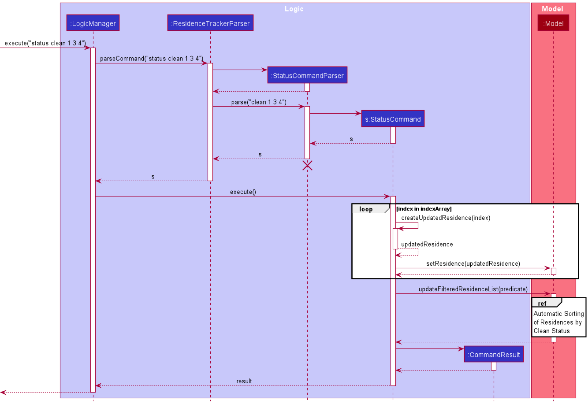
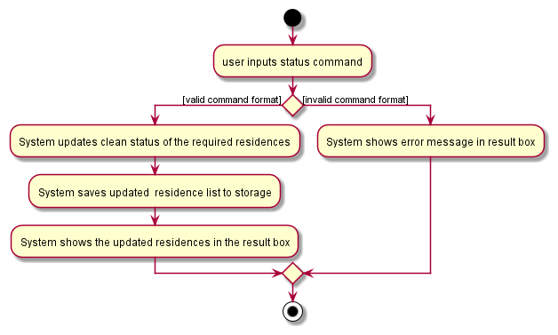

* Table of Contents
{:toc}

--------------------------------------------------------------------------------------------------------------------

## **Setting up, getting started**

Refer to the guide [_Setting up and getting started_](SettingUp.md).

--------------------------------------------------------------------------------------------------------------------

## **Design**

### Architecture

The ***Architecture Diagram*** given above explains the high-level design of the App. Given below is a quick overview of each component.

:bulb: **Tip:** The `.puml` files used to create diagrams in this document can be found in the [diagrams](https://github.com/se-edu/addressbook-level3/tree/master/docs/diagrams/) folder. Refer to the [_PlantUML Tutorial_ at se-edu/guides](https://se-education.org/guides/tutorials/plantUml.html) to learn how to create and edit diagrams.

**`Main`** has two classes called [`Main`](https://github.com/se-edu/addressbook-level3/tree/master/src/main/java/seedu/address/Main.java) and [`MainApp`](https://github.com/se-edu/addressbook-level3/tree/master/src/main/java/seedu/address/MainApp.java). It is responsible for,
* At app launch: Initializes the components in the correct sequence, and connects them up with each other.
* At shut down: Shuts down the components and invokes cleanup methods where necessary.

[**`Commons`**](#common-classes) represents a collection of classes used by multiple other components.

The rest of the App consists of four components.

* [**`UI`**](#ui-component): The UI of the App.
* [**`Logic`**](#logic-component): The command executor.
* [**`Model`**](#model-component): Holds the data of the App in memory.
* [**`Storage`**](#storage-component): Reads data from, and writes data to, the hard disk.

Each of the four components,

* defines its *API* in an `interface` with the same name as the Component.
* exposes its functionality using a concrete `{Component Name}Manager` class (which implements the corresponding API `interface` mentioned in the previous point.

For example, the `Logic` component (see the class diagram given below) defines its API in the `Logic.java` interface and exposes its functionality using the `LogicManager.java` class which implements the `Logic` interface.

**How the architecture components interact with each other**

The *Sequence Diagram* below shows how the components interact with each other for the scenario where the user issues the command `delete 1`.

The sections below give more details of each component.

### UI component

**API** :
[`Ui.java`](https://github.com/se-edu/addressbook-level3/tree/master/src/main/java/seedu/address/ui/Ui.java)

The UI consists of a `MainWindow` that is made up of parts e.g.`CommandBox`, `ResultDisplay`, `PersonListPanel`, `StatusBarFooter` etc. All these, including the `MainWindow`, inherit from the abstract `UiPart` class.

The `UI` component uses JavaFx UI framework. The layout of these UI parts are defined in matching `.fxml` files that are in the `src/main/resources/view` folder. For example, the layout of the [`MainWindow`](https://github.com/se-edu/addressbook-level3/tree/master/src/main/java/seedu/address/ui/MainWindow.java) is specified in [`MainWindow.fxml`](https://github.com/se-edu/addressbook-level3/tree/master/src/main/resources/view/MainWindow.fxml)

The `UI` component,

* Executes user commands using the `Logic` component.
* Listens for changes to `Model` data so that the UI can be updated with the modified data.

### Logic component

**API** :
[`Logic.java`](https://github.com/se-edu/addressbook-level3/tree/master/src/main/java/seedu/address/logic/Logic.java)

1. `Logic` uses the `AddressBookParser` class to parse the user command.
1. This results in a `Command` object which is executed by the `LogicManager`.
1. The command execution can affect the `Model` (e.g. adding a person).
1. The result of the command execution is encapsulated as a `CommandResult` object which is passed back to the `Ui`.
1. In addition, the `CommandResult` object can also instruct the `Ui` to perform certain actions, such as displaying help to the user.

Given below is the Sequence Diagram for interactions within the `Logic` component for the `execute("delete 1")` API call.

:information_source: **Note:** The lifeline for `DeleteCommandParser` should end at the destroy marker (X) but due to a limitation of PlantUML, the lifeline reaches the end of diagram.

### Model component

**API** : [`Model.java`](https://github.com/se-edu/addressbook-level3/tree/master/src/main/java/seedu/address/model/Model.java)

The `Model`,

* stores a `UserPref` object that represents the user’s preferences.
* stores the address book data.
* exposes an unmodifiable `ObservableList<Person>` that can be 'observed' e.g. the UI can be bound to this list so that the UI automatically updates when the data in the list change.
* does not depend on any of the other three components.

:information_source: **Note:** An alternative (arguably, a more OOP) model is given below. It has a `Tag` list in the `AddressBook`, which `Person` references. This allows `AddressBook` to only require one `Tag` object per unique `Tag`, instead of each `Person` needing their own `Tag` object. 

### Storage component

**API** : [`Storage.java`](https://github.com/se-edu/addressbook-level3/tree/master/src/main/java/seedu/address/storage/Storage.java)

The `Storage` component,
* can save `UserPref` objects in json format and read it back.
* can save the address book data in json format and read it back.

### Common classes

Classes used by multiple components are in the `seedu.addressbook.commons` package.

--------------------------------------------------------------------------------------------------------------------

## **Implementation**

This section describes some noteworthy details on how certain features are implemented.

### Remind feature

#### Implementation

The proposed mechanism is facilitated by the `logic` component described above. It filters the displayed `Residence` list to show those with bookings starting in the next 7 days. It makes use of the following new method in `Residence`.

* `Residence#hasUpcomingBooking()` — Returns true if the `Residence` has a booking starting in the next 7 days.

These operations make use of the `Model` interface's `Model#updateFilteredResidenceList(Predicate<Residence> predicate)` method and `Model` has a new public static `Predicate` named `PREDICATE_UPCOMING_BOOKED_RESIDENCES`.

Given below is an example usage scenario and how the reminder filtering mechanism behaves at each step.

Step 1. The user launches the application for the first time. The `ResidenceTracker` will be initialized with the initial residence tracker state.

Step 2. The user executes `addb 2 n/New Tenant p/098 ...` command to add a booking that starts within the next 7 days to the 2nd residence in the residence tracker. The `addb` command calls `Residence#addBooking(Booking booking)`, which replaces the 2nd residence with the new `Residence` after the command execution.

Step 3. The user executes `remind` to list all residences with upcoming bookings. The `remind` command also calls `Model#updateFilteredResidenceList(Predicate<Residence> predicate)`, causing a filtered list of `Residence`s to be displayed which includes the 2nd residence from the previous list displayed.

Step 4. Any successful execution of commands `add(b)`, `edit(b)`, `delete(b)` or `list` will return to the previous display of the full residence list.

### Status feature

#### Implementation

The proposed mechanism is facilitated by the `logic` component described above. It updates clean status of multiple `Residences` at one time. It makes use of the following new method.

* `StatusCommand#createUpdatedResidence()` —  Create updated residence with the required clean status and the same other data.
* `StatusCommandParser#paser()` —  Manage the status command input, return a status command with required clean status and target residence index list.

These operations make use of the `Model` interface's `Model#updateFilteredResidenceList(Predicate<Residence> predicate)` method to update the order of residence list, 
and `Model#setResidence()` to update the residence in the residence list. 

Given below is an example usage scenario and how the `status` filtering mechanism behaves at each step.

Step 1. The user launches the application for the first time. The `ResidenceTracker` will be initialized with the initial residence tracker state.

Step 2. The user executes two or more input`add n/NAME a/ADDRESS c/y ...` command to add multiple residence with the same clean status "CLEAN". The `add` command calls `addResidence()` which checks and adds new residence to the end of unique residence list where "UNCLEAN" residences is in front of "CLEAN" residences. 

Step 3. The user executes `status unclean 4 5` to update the forth and fifth residences' clean status to "UNCLEAN". The `status` command also calls `Model#updateFilteredResidenceList(Predicate<Residence> predicate)`, causing an ordered list of `Residence`s to be displayed.

The following sequence diagram shows how the status operation works:

The following activity diagram summarizes what happens when a user executes a `status` command:

### \[Proposed\] Undo/redo feature

#### Proposed Implementation

The proposed undo/redo mechanism is facilitated by `VersionedAddressBook`. It extends `AddressBook` with an undo/redo history, stored internally as an `addressBookStateList` and `currentStatePointer`. Additionally, it implements the following operations:

* `VersionedAddressBook#commit()` — Saves the current address book state in its history.
* `VersionedAddressBook#undo()` — Restores the previous address book state from its history.
* `VersionedAddressBook#redo()` — Restores a previously undone address book state from its history.

These operations are exposed in the `Model` interface as `Model#commitAddressBook()`, `Model#undoAddressBook()` and `Model#redoAddressBook()` respectively.

Given below is an example usage scenario and how the undo/redo mechanism behaves at each step.

Step 1. The user launches the application for the first time. The `VersionedAddressBook` will be initialized with the initial address book state, and the `currentStatePointer` pointing to that single address book state.

Step 2. The user executes `delete 5` command to delete the 5th person in the address book. The `delete` command calls `Model#commitAddressBook()`, causing the modified state of the address book after the `delete 5` command executes to be saved in the `addressBookStateList`, and the `currentStatePointer` is shifted to the newly inserted address book state.

Step 3. The user executes `add n/David …​` to add a new person. The `add` command also calls `Model#commitAddressBook()`, causing another modified address book state to be saved into the `addressBookStateList`.

:information_source: **Note:** If a command fails its execution, it will not call `Model#commitAddressBook()`, so the address book state will not be saved into the `addressBookStateList`.

Step 4. The user now decides that adding the person was a mistake, and decides to undo that action by executing the `undo` command. The `undo` command will call `Model#undoAddressBook()`, which will shift the `currentStatePointer` once to the left, pointing it to the previous address book state, and restores the address book to that state.

:information_source: **Note:** If the `currentStatePointer` is at index 0, pointing to the initial AddressBook state, then there are no previous AddressBook states to restore. The `undo` command uses `Model#canUndoAddressBook()` to check if this is the case. If so, it will return an error to the user rather
than attempting to perform the undo.

The following sequence diagram shows how the undo operation works:

:information_source: **Note:** The lifeline for `UndoCommand` should end at the destroy marker (X) but due to a limitation of PlantUML, the lifeline reaches the end of diagram.

The `redo` command does the opposite — it calls `Model#redoAddressBook()`, which shifts the `currentStatePointer` once to the right, pointing to the previously undone state, and restores the address book to that state.

:information_source: **Note:** If the `currentStatePointer` is at index `addressBookStateList.size() - 1`, pointing to the latest address book state, then there are no undone AddressBook states to restore. The `redo` command uses `Model#canRedoAddressBook()` to check if this is the case. If so, it will return an error to the user rather than attempting to perform the redo.

Step 5. The user then decides to execute the command `list`. Commands that do not modify the address book, such as `list`, will usually not call `Model#commitAddressBook()`, `Model#undoAddressBook()` or `Model#redoAddressBook()`. Thus, the `addressBookStateList` remains unchanged.

Step 6. The user executes `clear`, which calls `Model#commitAddressBook()`. Since the `currentStatePointer` is not pointing at the end of the `addressBookStateList`, all address book states after the `currentStatePointer` will be purged. Reason: It no longer makes sense to redo the `add n/David …​` command. This is the behavior that most modern desktop applications follow.

The following activity diagram summarizes what happens when a user executes a new command:

#### Design consideration:

##### Aspect: How undo & redo executes

* **Alternative 1 (current choice):** Saves the entire address book.
  * Pros: Easy to implement.
  * Cons: May have performance issues in terms of memory usage.

* **Alternative 2:** Individual command knows how to undo/redo by
  itself.
  * Pros: Will use less memory (e.g. for `delete`, just save the person being deleted).
  * Cons: We must ensure that the implementation of each individual command are correct.

_{more aspects and alternatives to be added}_

### \[Proposed\] Data archiving

_{Explain here how the data archiving feature will be implemented}_

--------------------------------------------------------------------------------------------------------------------

## **Documentation, logging, testing, configuration, dev-ops**

* [Documentation guide](Documentation.md)
* [Testing guide](Testing.md)
* [Logging guide](Logging.md)
* [Configuration guide](Configuration.md)
* [DevOps guide](DevOps.md)

--------------------------------------------------------------------------------------------------------------------

## **Appendix: Requirements**

### Product scope

**Target user profile**:

* has to manage a considerable number of residences
* is constantly renting out residences; high turnover rate
* prefers working on their laptop over using their phone
* is able to type quickly
* prefers using a keyboard to using a mouse
* is reasonably familiar with CLI apps

**Value proposition**: easily keep track of residences and inform cleaning agency whenever necessary

### User stories

Priorities: High (must have) - `* * *`, Medium (nice to have) - `* *`, Low (unlikely to have) - `*`

| Priority | As a …​                                 | I want to …​                    | So that I can…​                                                       |
| -------- | ------------------------------------------ | ---------------------------------- | ----------------------------------------------------------------------   |
| `* * *`  | new user                                   | See a list of all commands         | refer to instructions when I forget how to use the App                   |
| `* * *`  | user                                       | add a new residence                | keep track of all my residences                                                                         |
| `* * *`  | user                                       | delete a residence                 | remove residence that I no longer need to track                             |
| `* * *`  | user                                       | find a residence by name           | locate details of residence without having to go through the entire list |
| `* *`    | user                                       | edit a residence                   | change the information of residence when it is changed or error.            |
| `*`      | user owning and renting out many residences| update status of multiple residence at once  | save the time that editing clean status one by one    |
|`* *`     | new user                                   |clean all example residence          |begin my new Residence Tracker quick
|`* *`     | user                                       | exit the application                |use my computer for other stuff
|`* *`     | user                                       | have a tutorial                     |quikly learn the usage of the application 
|`* *`     | user                                       | add a new booking of a residence    |keep track of all booking information of my residences
|`* *`     | user                                       | edit a new booking of a residence   |change the information of booking when it is changed or error.
|`* *`     | user                                       | delete a new booking of a residence |remove booking details that I no longer need to track
|`* *`     | busy user                                  | remind me of recent booking         |process the most recent booking in time

*{More to be added}*

### Use cases

(For all use cases below, the **System** is the `ResidenceTracker` and the **Actor** is the `user`, unless specified otherwise)

**Use case (UC01): Add a residence** 
**MSS**

1.  User adds in the details of a residence
2.  User confirms the addition
3.  System confirms the addition and residence is added to the list of existing residence
     Use case ends.

**Extensions**

* 2a. Error in submission if user did not provide all relevant fields.  
    * 2a1. ResidenceTracker shows an error message.  
      use case restarts from 1.
 

**Use case (UC02): Delete a residence**

**MSS**
1.  User deletes a residence with a INDEX
2.  System confirms the input number
3.  System deletes the respective entry of the residence
     Use case ends.

**Extensions**

* 2a. System detects an error in the entered INDEX

    * 2ai. System requests for the correct format of deletion.
    * 2aii. User inputs the correct delete command with INDEX.

      Use case resumes at step 2.

 
      
**Use case(UC03): Find a residence**  
**MSS**  
1.  User keys in the keywords to search residences
2.  System returns the residence(s) which include the keyword in their name
     Use case ends.

**Extensions**  
* 1a. no matching residences are found
    * 1ai. a corresponding message is displayed.
       Use case ends.

 

**Use case(UC04): View list of all residences** 
**MSS** 
1.  User keys in the list command
2.  System lists all residences
     Use case ends.

**Extensions**  
* 1a. no residences are found
    * 1ai. a corresponding message is displayed.
       Use case ends.

 

**Use case(UC05): Edit information of a residence**  
**MSS**  
1.  User keys in the index and information of the residence to be edited
2.  System validates the edition
3.  System updates the residence status
     Use case ends.

**Extensions**  
* 2a. System detects an error in the entered INDEX or in entered status

    * 2ai. System requests for the expected format of edit command.
    * 2aii. User inputs the correct edit command with necessary details.
       Use case resumes at step 2.

 

**Use case (UC06): Show all available commands**  
**MSS** 
1.  User keys in the help command
2.  System shows a list of all available commands to help master the use of the app and the URL to the User Guide

    Use case ends.

 

**Use case (UC07): Exit the application**  
**MSS**  
1.  User keys in the exit command
2.  System closes
     Use case ends.
    
 

**Use case(UC08): Update clean status of multiple residences at once**  
**MSS**  
1.  User keys in the required clean status and index of residences to be updated
2.  System confirms the clean status and residences' index list 
3.  System updates the required residences' clean status
         Use case ends.

**Extensions**  
* 2a. System detects an error in the entered INDEX or in entered status

    * 2ai. System requests for the expected format of status command.
    * 2aii. User inputs the correct status command with necessary details.
             Use case resumes at step 2.

 

**Use case(UC09): Adds a new booking of the specified residence**  
**MSS**  
1.  User keys in the index of the specified residence, and the booking details 
2.  System confirms residence's index and booking details
3.  System updates the residence's booking list
         Use case ends.

**Extensions**  
* 2a. System detects an error in the entered INDEX or entered booking information

    * 2ai. System requests for the expected format of addb command.
    * 2aii. User inputs the correct addb command with necessary details.
             Use case resumes at step 2.

 

**Use case(UC10): edit a booking of the specified residence**  
**MSS**  
1.  User keys in the index of the specified residence, the index of booking, and the edited booking details 
2.  System confirms residence index, booking index, and booking details
3.  System updates the residence's booking list
         Use case ends.

**Extensions**  
* 2a. System detects an error in the entered INDEX or entered booking edition 

    * 2ai. System requests for the expected format of eddb command.
    * 2aii. User inputs the correct eddb command with correct index and edition.
             Use case resumes at step 2.

 

**Use case (UC11): Delete a booking of a residence**

**MSS**
1.  User deletes a booking with a residence INDEX and a booking INDEX
2.  System confirms the input number
3.  System deletes the respective entry of the booking
         Use case ends.

**Extensions**

* 2a. System detects an error in the entered residence INDEX or booking INDEX.

    * 2ai. System requests for the correct format of deletion.
    * 2aii. User inputs the correct delete command with two normal INDEX.

      Use case resumes at step 2.

 

**Use case (UC12): Remind Residences with Upcoming Bookings**  
**MSS** 
1.  User keys in the remind command
2.  System shows a list of all residences with bookings starting in the next 7 days.
    Use case ends.

 

**Use case (UC13): CLear all residence at once**  
**MSS** 
1.  User keys in the clear command
2.  System delete all residences information.
    Use case ends.

 

### Non-Functional Requirements

1.  Should work on any _mainstream OS_ as long as it has Java `11` or above installed.
2.  Should be able to hold up to 100 residences without a noticeable sluggishness in performance for typical usage.
3.  A user with above average typing speed for regular English text (i.e. not code, not system admin commands) should be able to accomplish most of the tasks faster using commands than using the mouse.

*{More to be added}*

### Glossary

* **Mainstream OS**: Windows, Linux, Unix, OS-X
* **Residence Status**:
    * **Clean**: The residence has been cleaned
    * **Unclean**: The residence needs to be cleaned
    
--------------------------------------------------------------------------------------------------------------------

## **Appendix: Instructions for manual testing**

Given below are instructions to test the app manually.

:information_source: **Note:** These instructions only provide a starting point for testers to work on;
testers are expected to do more *exploratory* testing.

### Launch and shutdown

1. Initial launch

   1. Download the jar file and copy into an empty folder

   1. Double-click the jar file Expected: Shows the GUI with a set of sample contacts. The window size may not be optimum.

1. Saving window preferences

   1. Resize the window to an optimum size. Move the window to a different location. Close the window.

   1. Re-launch the app by double-clicking the jar file. 
       Expected: The most recent window size and location is retained.

1. _{ more test cases …​ }_

### Deleting a residence

1. Deleting a residence while all residence are being shown

   1. Prerequisites: List all residences using the `list` command. Multiple residences in the list.

   1. Test case: `delete 1` 
      Expected: First residence is deleted from the list. Details of the deleted contact shown in the status message. Timestamp in the status bar is updated.

   1. Test case: `delete 0` 
      Expected: No residence is deleted. Error details shown in the status message. Status bar remains the same.

   1. Other incorrect delete commands to try: `delete`, `delete x`, `...` (where x is larger than the list size) 
      Expected: Similar to previous.

1. _{ more test cases …​ }_

### Saving data

1. Dealing with missing/corrupted data files

   1. _{explain how to simulate a missing/corrupted file, and the expected behavior}_

1. _{ more test cases …​ }_
