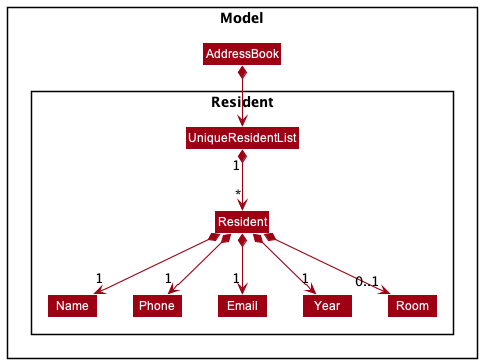
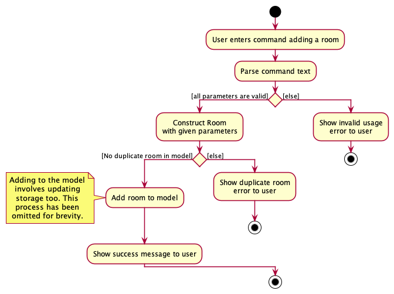
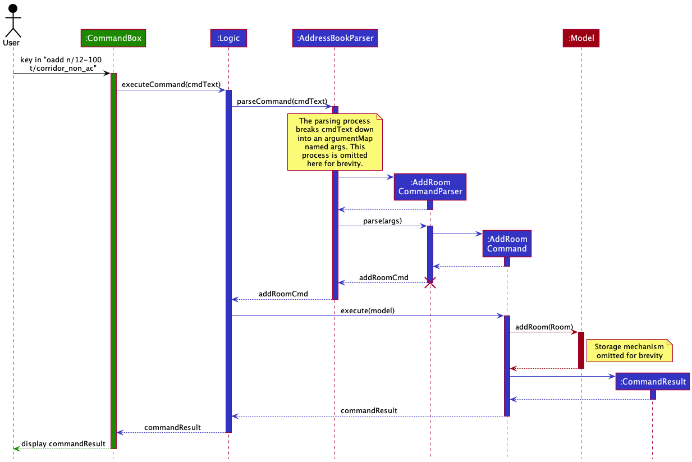
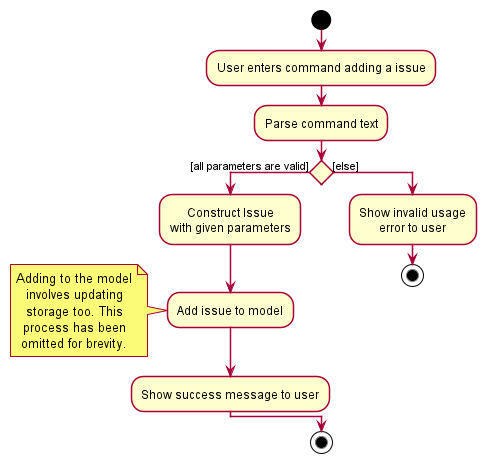
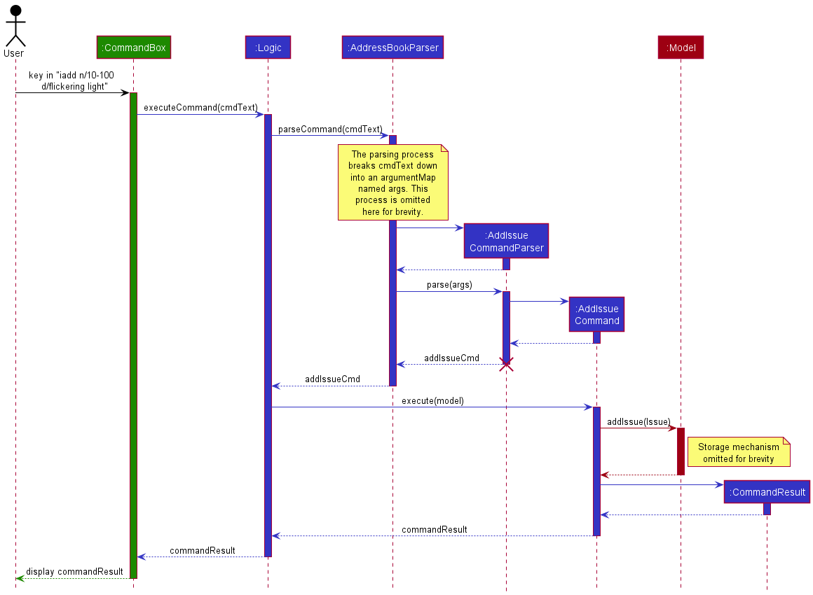
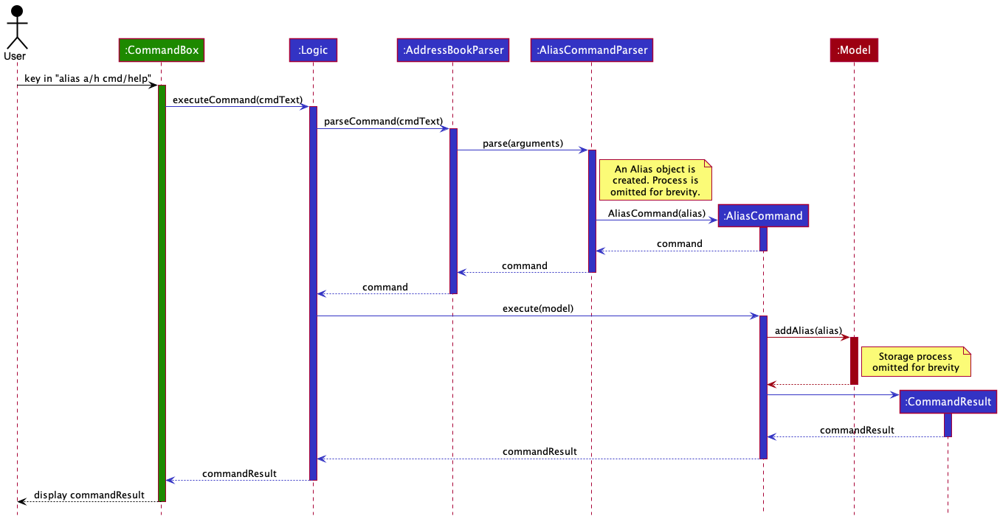
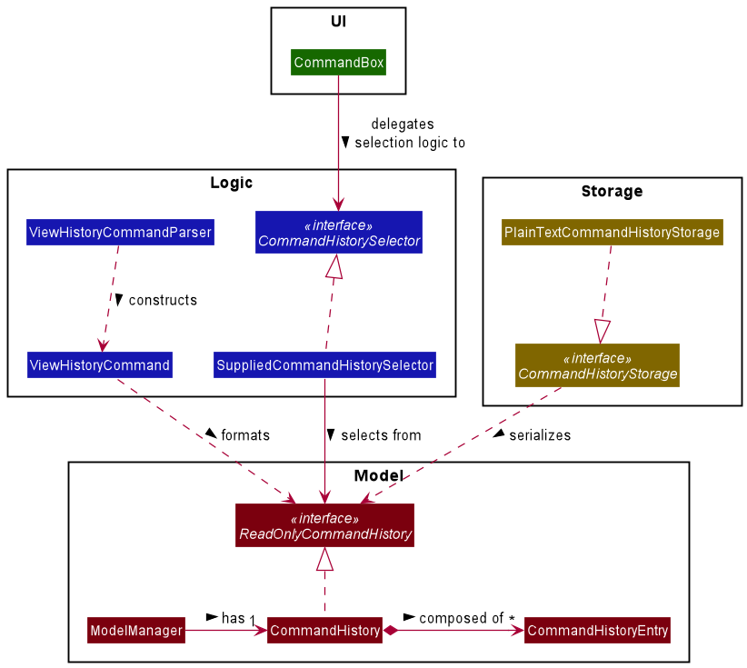
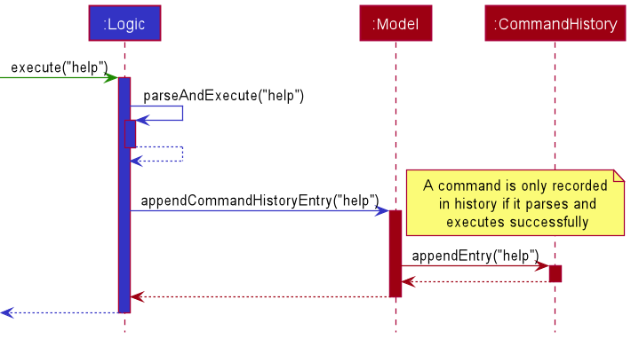
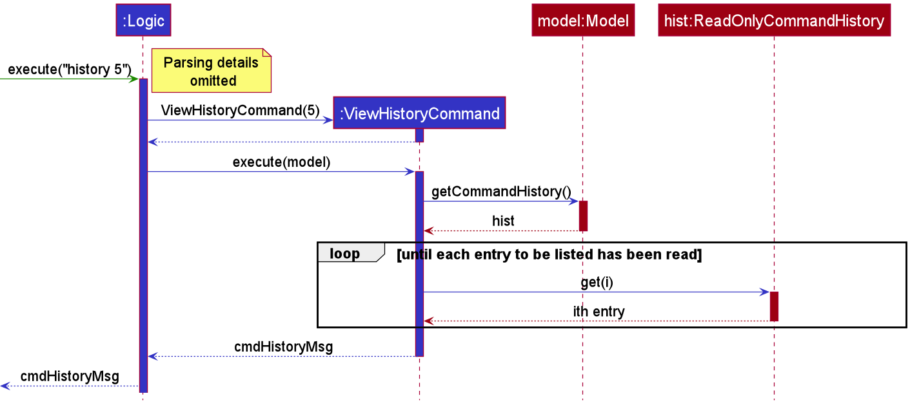
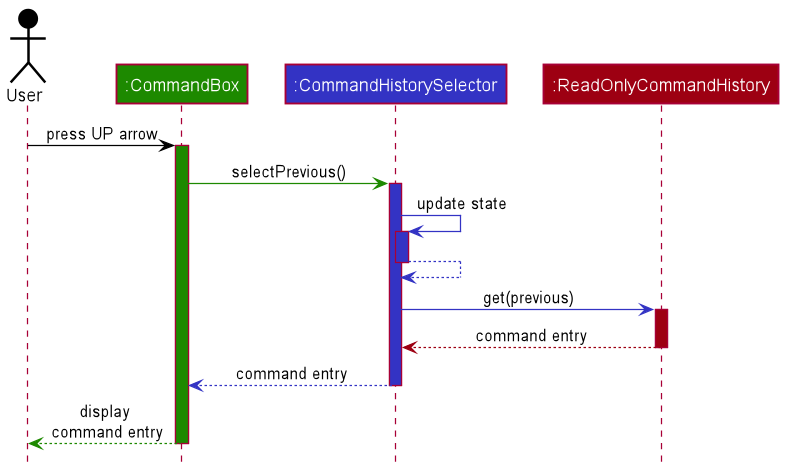

* Table of Contents
{:toc}

--------------------------------------------------------------------------------------------------------------------

## **Setting up, getting started**

Refer to the guide [_Setting up and getting started_](SettingUp.md).

--------------------------------------------------------------------------------------------------------------------

## **Introduction**

**SunRez** is a desktop app designed for college residential staff to efficiently manage student housing services. It
features a Graphical User Interface (GUI) but is optimized for use via a Command Line Interface (CLI).

**SunRez** has the following features:
* Keeps track of maintenance issues
* Keeps track of student records
* Keeps track of room records

--------------------------------------------------------------------------------------------------------------------

## **Who should read this guide?**

This Developer Guide (DG) specifies the architecture, design, implementation, requirements and manual test cases for
SunRez, as well as key design decisions and considerations.

It is intended for developers, QA testers, and anyone who may wish to contribute to the development of SunRez (or
learn from it).

--------------------------------------------------------------------------------------------------------------------

## **About this guide**

### AddressBook

SunRez was built from an open-source starter project called [Address Book](https://se-education.org/addressbook-level3/).
Thus, for legacy reasons many internal components of SunRez have traces of AddressBook. For example, namespaces in the
project start with `seedu.address`, and the primary data class of the Model component is named `AddressBook`. A future
refactoring to rename all aspects of SunRez is planned, but until then, developer-facing parts of SunRez will contain
traces of Address Book. That said, user-facing aspects of SunRez (UI, file names, etc.) should be free of references
to Address Book.

### Diagrams

This guide uses UML diagrams to better illustrate certain design ideas and structures. The following sub-sections
detail how contributors can read, create and edit these diagrams, as well as various things to note about the diagrams.

#### How to read

If you are unfamiliar with how to read UML diagrams, check out [this chapter](https://se-education.org/se-book/uml/index.html) 
of the free online SE-EDU textbook.

:information_source: **Note about sequence diagrams:**  

Some sequence diagrams in this guide have an X on the lifeline of an object to indicate its deletion. These should be
located at the end of the lifeline. However, due to a limitation of PlantUML, an object's lifeline will extend past
the X to the end of the diagram.

#### How to create and edit

This project uses [PlantUML](https://plantuml.com/) to create diagrams in this document. These diagrams are generated
from `.puml` files which can be found in the [diagrams](https://github.com/AY2021S2-CS2103-T14-1/tp/tree/master/docs/diagrams) 
folder. Refer to the [_PlantUML Tutorial_ at se-edu/guides](https://se-education.org/guides/tutorials/plantUml.html) 
to learn how to create and edit diagrams.

--------------------------------------------------------------------------------------------------------------------

## **Design**

### Architecture

The ***Architecture Diagram*** given above explains the high-level design of the App. Given below is a quick overview 
of each component.

**`Main`** has two classes called [`Main`](https://github.com/AY2021S2-CS2103-T14-1/tp/blob/master/src/main/java/seedu/address/Main.java) 
and [`MainApp`](https://github.com/AY2021S2-CS2103-T14-1/tp/blob/master/src/main/java/seedu/address/MainApp.java). It is responsible for,
* At app launch: Initializes the components in the correct sequence, and connects them up with each other.
* At shut down: Shuts down the components and invokes cleanup methods where necessary.

[**`Commons`**](#common-classes) represents a collection of classes used by multiple other components.

The rest of the App consists of four components.

* [**`UI`**](#ui-component): The UI of the App.
* [**`Logic`**](#logic-component): The command executor.
* [**`Model`**](#model-component): Holds the data of the App in memory.
* [**`Storage`**](#storage-component): Reads data from, and writes data to, the hard disk.

Each of the four components,

* defines its *API* in an `interface` with the same name as the Component.
* exposes its functionality using a concrete `{Component Name}Manager` class (which implements the corresponding API `interface` mentioned in the previous point.

For example, the `Logic` component (see the class diagram given below) defines its API in the `Logic.java` interface and exposes its functionality using the `LogicManager.java` class which implements the `Logic` interface.

**How the architecture components interact with each other**

The *Sequence Diagram* below shows how the components interact with each other for the scenario where the user issues the command `delete 1`.

The sections below give more details of each component.

### UI component

**API** :
[`Ui.java`](https://github.com/se-edu/addressbook-level3/tree/master/src/main/java/seedu/address/ui/Ui.java)

The UI consists of a `MainWindow` that is made up of parts e.g.`CommandBox`, `ResultDisplay`, `PersonListPanel`, `StatusBarFooter` etc. All these, including the `MainWindow`, inherit from the abstract `UiPart` class.

The `UI` component uses JavaFx UI framework. The layout of these UI parts are defined in matching `.fxml` files that are in the `src/main/resources/view` folder. For example, the layout of the [`MainWindow`](https://github.com/se-edu/addressbook-level3/tree/master/src/main/java/seedu/address/ui/MainWindow.java) is specified in [`MainWindow.fxml`](https://github.com/se-edu/addressbook-level3/tree/master/src/main/resources/view/MainWindow.fxml)

The `UI` component,

* Executes user commands using the `Logic` component.
* Listens for changes to `Model` data so that the UI can be updated with the modified data.

### Logic component

**Diagram Notes** :
* `XYZCommand` is a placeholder for a concrete command such as `AddResidentCommand`, `ExitCommand`, etc. There are many
  commands (each with its own class), so for a placeholder has been used for simplicity. Likewise, `XYZCommandParser` is
  a placeholder for a concrete command parser.
* Some (but not all) command parsers make use of utility parser classes such as `CliSyntax`, `ParserUtil`,
  `ArgumentMultimap`, `ArgumentTokenizer` and `Prefix`. These classes are not necessary for a high-level understanding
  of the logic component, so they have been omitted from the diagram above for brevity.

**API** :
[`Logic.java`](https://github.com/AY2021S2-CS2103-T14-1/tp/blob/master/src/main/java/seedu/address/logic/Logic.java)

1. `LogicManager` uses the `AddressBookParser` to parse the user command. 
1. `LogicManager` may consult the `AliasMapping` in the `Model` (not shown in the diagram above) in case the user
   uses an alias. How an alias is executed is detailed [here](#alias-execution).
1. This results in a `Command` object which is executed by the `LogicManager`.
1. The command execution may affect the `Model` (e.g. adding a resident or closing an issue).
1. The result of the command execution is encapsulated as a `CommandResult` object which is passed back to the `Ui`.
1. In addition, the `CommandResult` object may also instruct the `Ui` to perform certain actions, such as displaying
   help to the user.
1. `CommandHistorySelector` is responsible for the logic of navigating command history. Its implementation is detailed
   [here](#navigate-history).

Given below is the Sequence Diagram for interactions within the `Logic` component for the `execute("idel 1")` API call.
Many other commands have a similar flow, differing only by the specific command parser class, command class and 
interaction with the model.

**Diagram Notes** :
* To improve readability, some class names have been shortened in the diagram:
    * `DeleteIssueCmdParser` represents the class `DeleteIssueCommandParser`
    * `DeleteIssueCmd` represents the class `DeleteIssueCommand`
    * `CmdResult` represents the class `CommandResult`

### Model component

**API** : [`Model.java`](https://github.com/se-edu/addressbook-level3/tree/master/src/main/java/seedu/address/model/Model.java)

The `Model`,

* stores a `UserPref` object that represents the user’s preferences.
* stores the address book data.
* exposes an unmodifiable `ObservableList<Person>` that can be 'observed' e.g. the UI can be bound to this list so that the UI automatically updates when the data in the list change.
* does not depend on any of the other three components.

:information_source: **Note:** An alternative (arguably, a more OOP) model is given below. It has a `Tag` list in the `AddressBook`, which `Person` references. This allows `AddressBook` to only require one `Tag` object per unique `Tag`, instead of each `Person` needing their own `Tag` object. 

### Storage component

**API** : [`Storage.java`](https://github.com/se-edu/addressbook-level3/tree/master/src/main/java/seedu/address/storage/Storage.java)

The `Storage` component,
* can save `UserPref` objects in json format and read it back.
* can save the address book data in json format and read it back.

### Common classes

Classes used by multiple components are in the `seedu.addressbook.commons` package.

--------------------------------------------------------------------------------------------------------------------

## **Implementation**
This section describes some noteworthy details on how certain features are implemented.

### Resident Features

The Resident family of features consist of the following features: Add Resident, Edit Resident, List Resident, Find Resident and Delete Resident.

#### The Resident Class
The Resident class consists of 5 fields, each of which contain their own methods to verify their respective input. 
This allows for a low degree of coupling, and individual fields can change their input verification rules without affecting the other classes. 
Similarly, the Resident class can expand to contain more fields without affecting existing fields too.

Examples of verification functions in each of the fields include `Resident#isValidName()` etc.

The `Resident` objects are stored in a `UniqueResidentList` which is held by `AddressBook`.

#### Add Resident
This section will detail the implementation of the Add Resident feature via the `radd` command,

##### Overview of Insertion Process
The AddResidentCommand is triggered through the use of `radd` followed by valid parameters such as name, phone, etc. 
The entire command string must then be parsed to extract the parameters that were inserted, and if they are all valid, a Resident object is constructed and added to the model and saved to the backing store. Upon successful insertion, a feedback message is displayed to the user.

This process is summarised in the diagram below

##### Detailed execution pathway
The diagram below details how the user's command to add a resident propagates through the system to eventually add a resident.

### Room Features

The Room family of features consist of the following features: Add Room, Edit Room, List Rooms, Find Room and Delete Room. 

#### The Room Class
The Room class consists of 4 fields, each of which contain their own methods to verify their respective input. This allows for a low degree of coupling, and individual fields can change their input verification rules without affecting the other classes. Similarly, the Room class can expand to contain more fields without affecting existing fields too.

Examples of verification functions in each of the fields include `RoomNumber#isValidRoomNumber()`, `RoomType#isValidRoomType()`, etc.

The `Room` objects are stored in a `UniqueRoomList` which is held by `AddressBook`.

##### Alternatives considered
* **Alternative 1 (current choice):** Abstract fields of Room out as separate classes
    * Pros:
        * Each field can take care of its own validation
        * Updating a field does not update the Room class itself
    * Cons:
        * More classes to manage and individually track
        * Might be unintuitive to initially understand
* **Alternative 2:** Leave fields of Room as member variables of the Room class
    * Pros:
        * Everything is self-contained within the Room class, single source of "truth"
    * Cons
        * Field verification becomes a responsibility of the Room class which is not desirable (Violation of SRP)
        * Changes to individual fields would impact the Room class which may unintentionally break other things
        * Less object oriented approach which goes against the principles of how this project was set up

#### Add Room
This section will detail the implementation of the Add Room feature via the `oadd` command,

##### Overview of Insertion Process 
The AddRoomCommand is triggered through the use of `oadd` followed by valid parameters such as room number, type, etc. The entire command string must then be parsed to extract the parameters that were inserted, and if they are all valid, a Room object is constructed and added to the model and saved to the backing store. Upon successful insertion, a feedback message is displayed to the user. 

This process is summarised in the diagram below

##### AddRoomCommand
The `AddRoomCommand` inherits from the `Command` object and overrides the `execute()` method. It checks if the model already has the room being inserted, and if it does not, it will insert the room.

The inheritance from `Command` allows `Logic` to deal with and manipulate polymorphic `Command` objects without dealing with the specific implemetations of each `Command` object.

##### Detailed execution pathway
The diagram below details how the user's command to add a room propagates through the system to eventually add a room. 

### Resident-Room allocation feature

The allocation feature is facilitated by `ResidentRoom` which is a pair value of
valid `[Resident, Room]` that represents an existing resident allocated to a room.
It should be able to support the following operations:
* `ResidentRoom#getName()` - Returns the resident allocated for a given ResidentRoom.
* `ResidentRoom#getRoomNumber()` - Returns the room assignment for a given ResidentRoom.

A `ResidentRoomList` is a supplementary class that tracks all the `ResidentRoom` assignments. It should support
the following operations.
* `ResidentRoomList#add()` - Adds a `ResidentRoom` new allocation.
* `ResidentRoomList#remove()` - Removes an existing `ResidentRoom` allocation.
* `ResidentRoomList#contains()` - Checks if an allocation exists given the resident and room.

There are two Resident-Room user allocation and deallocation commands, `alloc` and `dealloc` respectively.

The `alloc` command will do the following:

Example: `alloc ri/1 oi/2`
* Check that the 1st resident exists.
* Check that the 2nd room exists exists.
* Check that the 1st resident has not already been allocated to the 2nd room.
* Check that no other room is allocated to the 2nd resident.
* Check that room the 2nd room is not occupied by any resident.

  **If all the above is true,**
* Set the `ROOM` of the resident to be the room number of the room.
* Set the `OCCUPATION_STATUS` of the room to `Y`.

  

The `dealloc` command will do the following:

Example: `dealloc 1`
* Check that the first resident exists.
* Check that the first resident has been allocated to a room.

  **If all the above is true,**
* Set the `ROOM` of  the resident to be `Room unallocated`.
* Set the `OCCUPATION_STATUS` of the room to `N`.

#### Alternatives considered
* **Alternative 1 (current choice):** Resident-Room solely keeps track of resident and room allocation
  performed through `alloc` and `dealloc` commands. Any allocated resident and occupied rooms
  cannot be edited.
    * Pros:
        * Simpler to implement.
        * Better testability for synchronicity between fields.
    * Cons:
        * Less user control.
* **Alternative 2:** Resident-Room allocation is modelled as a Parent-Child where the parent is the
  `Room` and the child is the `Resident`.
    * Pros:
        * Simpler to implement.
    * Cons:
        * Lack of 2-way updates. Room number of the `Resident` cannot be updated and viewed.
          The problem is reversed if the parent-child roles are swapped where the occupancy
          of `Room` cannot be updated and viewed.
* **Alternative 3:** Resident-Room interface as a lookup. `Room` and `Resident` would look up the
  `residentRoom` class every time to get its `OCCUPANCY STATUS` and `ROOM NUMBER`.
    * Pros:
        * User has more control and flexibility.
    * Cons:
        * Creates cascading effect with a lot of dependencies between regular commands
          such as `redit`, `rdel`, `oedit`, `odel`.

### Issue Features

The Issue family of features consist of the following features: Add Issue, Edit Issue, List Issue, Find Issue, Delete Issue and Close Issue.

#### The Issue Class

The Issue class consists of 5 fields, each of which contain their own methods to verify their respective input. This allows for a low degree of coupling, and individual fields can change their input verification rules without affecting the other classes. Similarly, the Issue class can expand to contain more fields without affecting existing fields too.

Examples of verification functions in each of the fields include `Category#isValidCategory()`, `Status#isValidStatus()`, etc.

The `Issue` objects are stored in an `IssueList` which is held by `AddressBook`.

#### Add Issue

This section will detail the implementation of the Add Issue feature via the `iadd` command.

##### Overview of Insertion Process

The AddIssueCommand is triggered through the use of `iadd` followed by valid parameters such as room number, description, etc. The entire command string must then be parsed to extract the parameters that were inserted, and if they are all valid, an Issue object is constructed and added to the model and saved to the backing store. Upon successful insertion, a feedback message is displayed to the user.

This process is summarised in the diagram below

##### AddIssueCommand

The `AddIssueCommand` inherits from the `Command` object and overrides the `execute()` method.

The inheritance from `Command` allows `Logic` to deal with and manipulate polymorphic `Command` objects without dealing with the specific implemetations of each `Command` object.

##### Detailed execution pathway
The diagram below details how the user's command to add an issue propagates through the system to eventually add an issue.

### Alias feature
The `Alias` feature allows users to define a shortcut for a longer command that is often used. The longer command can then be executed by entering the alias instead of the full or partial command.

#### Implementation
User-defined `Alias` is stored in `AliasMapping` within `UserPrefs`. `AliasMapping` internally uses `HashMap<String, Alias>` to store the mapping between the name of an `Alias` object and itself. With `AliasMapping` included in `UserPrefs`, `UserPrefs` supports the following methods:

* `UserPrefs#getAliasMapping()` — Returns the current `AliasMapping`.

* `UserPrefs#setAliasMapping(AliasMapping aliasMappings)` — Sets the current mapping to the specified mapping.

* `UserPrefs#addAlias(Alias alias)` — Adds a user-defined `Alias` to the current mapping.

* `UserPrefs#getAlias(String aliasName)` — Returns an `Alias` based on alias name.

* `UserPrefs#containsAlias(String aliasName)` — Checks if the current mapping contains an `Alias` based on alias name.

* `UserPrefs#isReservedKeyword(String aliasName)` — Checks if the alias name is a reserved keyword. This prevents users from using existing commands as alias name.

* `UserPrefs#isRecursiveKeyword(String commandWord)` — Checks if the command word is a recursive keyword. This prevents users from chaining aliases.

#### Alias creation
User can create a new `Alias` via the `AliasCommand`. The sequence diagram below describes how an `Alias` is created.

#### Alias execution

When a user executes a new command, `AddressBookParser` will follow these steps:

1. If the input begins with an existing command word, parse it as one of those pre-defined command.
    1. If all parameters are valid, return the corresponding `Command` object.
    1. Else show error to the user.
1. Else if the input begins with a mapped `Alias`, replace the alias with the mapped `Command`.
    1. Parse the mapped `Command` as per normal.
1. Else show error to the user.

The following diagram illustrates the flow:

### Command History Feature
The command history feature has a few sub-features:
1. View history command: the user can list the command history.
1. Navigate history: the user can navigate their command history like in a terminal program.
1. Save/load history: command history persists across SunRez runs.

This section starts with an overview of the command history model then looks at each sub-feature in turn.

#### Implementation

##### Command History Overview
SunRez command history is represented by a `CommandHistory`, stored in the `ModelManager`. A `CommandHistory` is 
composed of zero or more `CommandHistoryEntry` objects, each representing a previously entered command. New entries
can be appended to `CommandHistory`. `CommandHistory` implements the `ReadOnlyCommandHistory` interface, 
which provides a non-editable view of the implementing `CommandHistory`; this readonly view is used by other components
that do not need to append to the command history. For example, the view history command reads it to display it - or a 
filtered portion of it - to the user.

The following class diagram shows an overview of the command history subsystem and its relation to other components.

##### How Command History is Updated
`Logic#execute()` triggers the update. Only _after_ a command parses and executes successfully will that command's text 
be appended to the command history via `Model#appendCommandHistoryEntry()`. If either parsing or execution fails,
then `CommandHistory` will be unchanged. The following sequence diagram shows this process pictorially using the 
example command `help`.

:information_source: 
**Note:** In the sequence diagram above, `parseAndExecute()` is not an actual method; rather it is a simplification
of a two-step process in the Logic component. The important thing to note is that `CommandHistory` is updated only
_after_ a command is parsed and executed successfully by the Logic component.

##### View History
SunRez allows the user to list the full command history, or a portion of it, through the command `history [COUNT]` where
`[COUNT]` is an optional integer that the user can specify to limit the number of most-recent entries to be listed.
If `[COUNT]` is omitted, then the full command history is displayed.

Viewing command history is implemented through `ViewHistoryCommand` and supported by `ReadOnlyCommandHistory`. 
`ViewHistoryCommand#execute()` accesses command history through the view of a `ReadOnlyCommandHistory`, reads the 
entries it needs to display, formats the entries into a message, then finally returns the message wrapped in 
a `CommandResult`, to be displayed to the user. The following sequence diagram illustrates the main interactions
between `ViewHistoryCommand` and the Model component. It uses the example command of `history 5`. 

##### Navigate History
The user navigates their command history via the UP and DOWN arrow keys. The UP and DOWN arrow keys respectively 
select the previous and next commands in history, if any.

The UP and DOWN key press events are first handled by `CommandBox` in the UI component. `CommandBox` delegates the 
logic of navigation and keeping track of state (which command we are selecting) to a `CommandHistorySelector`.
The `CommandHistorySelector` is called via `#selectNext()` and `#selectPrevious()` which are expected
to respectively return the next and previous commands in history since they were last called. Upon receiving the 
relevant commands from `CommandHistorySelector`, `CommandBox` will populate its text box with that command's text.
The following sequence diagram shows the aforementioned relationships.

`CommandHistorySelector#selectLast()` can also be called to reset the selection to the most recent command in history.
This is useful, for example, when a user has navigated to the middle of their command history then executes a new 
command. At this point, we want navigation to start from the most recent command again - not where the user was
before he/she executed a command.

Currently, SunRez uses a `SuppliedCommandHistorySelector` as its `CommandHistorySelector`. This implementation uses
a `Supplier<ReadOnlyCommandHistory>` to view SunRez command history whenever it is called to select a new entry.

##### Save/Load History
SunRez automatically saves command history after each command execution, and loads command history (if any) upon app 
start-up. The command history is saved in a plain-text file at `[JAR_file_location]/data/commandhistory.txt`. 

Saving and loading is supported by `CommandHistoryStorage`, an interface that exposes read and write methods. SunRez
currently uses an implementation of this interface called `PlainTextCommandHistoryStorage`, which serializes each
command history entry as a single line of plain text in the command history file. The class structure is shown 
in the class diagram in the _Command History Overview_ subsection above.

Command history is saved immediately after it is updated. Since command history is only updated after a successful
command execution, this implies that only successful commands are saved. In order to save command history, 
`CommandHistoryStorage` creates a serialized string from a `ReadOnlyCommandHistory` view of the command history, then 
writes it to disk using `FileUtil#writeToFile()` as a helper. The following activity diagram shows a simplified flow 
of the storage process from command execution to writing the command history to file.

#### Design Considerations

##### Aspect: Should history include invalid commands?

* **Alternative 1 (current choice):** Only record valid commands (commands which parse and execute successfully).
    * Pros:
        * Less cluttered command history.
        * A User can still easily correct typos in a failed command because SunRez does not consume the input if it 
          fails to execute.
    * Cons: 
        * Behaves less like a regular shell program, so the user might be expecting different behavior.

* **Alternative 2:** Record all command text that the user tries to execute.
    * Pros:
        * Behaves more like a regular shell program.
    * Cons: 
        * More cluttered command history.
        * Arguably does not help the user correct typos in failed commands (see Alternative 1: Pros).

##### Aspect: Should command history selection logic be in `CommandBox`?

* **Alternative 1 (current choice):** No, abstract it out to an interface `CommandHistorySelector` with a backing 
  implementation.
    * Pros:
        * Follows SRP because `CommandBox` is part of the UI component, but history selection is logic. If selection
        logic is left in `CommandBox`, then it now has two reasons (UI and logic) to change.
        * Easier to unit test because logic is separated from UI.
    * Cons:
        * More complex to implement: one additional interface and class.

* **Alternative 2:** Yes, keep the selection logic in `CommandBox`.
    * Pros:
        * Simpler to implement: no additional classes or interfaces; and the selection logic is quite straightforward,
          so the bloat may be acceptable in the short term.
        * Arguably, selection only affects the `CommandBox` so the added complexity may not be worth it.
    * Cons:
        * Harder to unit test because selection logic is bundled with UI.
        * Pollutes a UI component with details of logic. If we wish to change the selection logic in future but not
          the UI, `CommandBox` will still need to change.

--------------------------------------------------------------------------------------------------------------------

## **Documentation, logging, testing, configuration, dev-ops**

* [Documentation guide](Documentation.md)
* [Testing guide](Testing.md)
* [Logging guide](Logging.md)
* [Configuration guide](Configuration.md)
* [DevOps guide](DevOps.md)

--------------------------------------------------------------------------------------------------------------------

## **Appendix: Requirements**

### Product scope

**Target user profile**:

Nina works as a housing service management officer for a Residential College* (in NUS). She is the sole manager of the office. She:
* has to manage a large number of residents and rooms (> 600)
* needs to efficiently assign rooms to residents
* handles room allocation exercise every semester
* needs to track room issues reported by students during the semester
* needs to update the issue lifecycle (reported => maintenance ongoing => fixed/closed)
* prefers typing over interacting via GUI

**Value proposition**: manage residents, rooms, and allocations faster than a typical GUI app.

### User stories

Priorities: High (must have) - `* * *`, Medium (nice to have) - `* *`, Low (unlikely to have) - `*`

| Priority | As a … | I want to … | So that I can…|
| - | - | - | - |
| `* * *` | new user | see usage instructions | refer to instructions if I forget how to use the app |
| `* * *` | confused user | have a help command | learn how to use the application |
| `* * *` | user | add a new person | |
| `* * *` | user | add issues | |
| `* * *` | user | see a list of pending tasks sorted by deadline | prioritise which to do |
| `* * *` | user | search for tasks | |
| `* * *` | user | close issues | focus on open issues |
| `* * *` | user | update issues | |
| `* * *` | user | remove issues | |
| `* * *` | user | add residents | |
| `* * *` | user | search for residents | |
| `* * *` | user | update resident details | ensure their information is up to date |
| `* * *` | user | remove residents | |
| `* * *` | user | add new rooms | |
| `* * *` | user | see a list of rooms with their statuses | know which rooms are available |
| `* * *` | user | search for rooms | |
| `* * *` | user | update room details | |
| `* * *` | user | remove rooms | |
| `* *` | user | see both available rooms and unassigned residents side by side | easily match residents to rooms |
| `* *` | careless user | undo previous commands | easily fix any errors I might make |
| `* *` | careless user | redo previous commands | easily fix an erroneous undo |
| `* * *` | user | allocate a resident to a room | |
| `* * *` | user | deallocate a resident from a room | |
| `* *` | power user | access my command history | efficiently repeat similar commands |
| `* *` | power user | access command history from previous sessions | easily reuse commands from previous sessions |
| `* *` | power user | create aliases for longer commands | avoid typing the same command multiple times |
| `* *` | power user | delete aliases that are no longer needed | avoid triggering the wrong command |

## Use cases

(For all use cases below, the **System** is the `SunRez` and the **Actor** is the `user`, unless specified otherwise. All Use Cases are prefixed with `UC` followed by a 3 digit code)

### UC-001 Add a resident

**MSS**

1. User requests to add a specific resident to the list.
2. SunRez adds the resident and saves the changes.

Use case ends.

**Extensions**

* 1a. The resident's details are incorrectly formatted (e.g. phone number/email/year format does not conform, OR room number is invalid).
    * 1a1. SunRez displays an error stating which field is incorrectly formatted and requests the user to try again after fixing the stated error.
    
        Use case ends.
* 1b. The resident's phone number or email are in use by an existing resident.
    * 1b1. SunRez displays an error stating which field is already in use and requests the user to try again after fixing the stated error.
    
        Use case ends.
* 2a. SunRez encounters an error while saving the content.
    * 2a1. SunRez shows an error message and requests the user to try their command again.
    
        Use case ends.

### UC-002 List all residents

**MSS**

1. User requests to list residents.
2. SunRez shows a list of residents.

Use case ends.

**Extensions**

* 2a. The list is empty.
    
    Use case ends.

### UC-003 Find residents

**MSS**

1. User searches for a resident by keywords.
2. SunRez shows a list of residents whose name contain any of the keywords.

Use case ends.

**Extensions**

* 2a. There are no residents matching the keywords.
    * 2a1. An empty list is displayed.
    
        Use case ends.

### UC-004 Edit a resident record

**MSS**

1. User requests to list residents.
2. SunRez shows a list of residents.
3. User requests to edit a specific resident based on the index from the list displayed in step 2.
4. SunRez edits the residents and saves the changes.

Use case ends.

**Extensions**

* 2a. The list of residents is empty.
    
    Use case ends.
* 3a. The resident's details are invalid (e.g phone number/email/dob format does not conform, OR room number is invalid).
    * 3a1. SunRez shows an error message stating which field is incorrectly formatted and requests the user to try again.
    
        Use case resumes at step 2.

### UC-005 Delete a resident

**MSS**

1. User requests to list residents.
2. SunRez shows a list of residents.
3. User requests to delete a specific resident based on the index from the list displayed in step 2.
4. SunRez deletes the specified resident and saves the changes.

Use case ends.

**Extensions**

* 2a. The list of residents is empty.
    
    Use case ends.
* 3a. The specified resident does not exist.
    * 3a1. SunRez shows an error message.
    
        Use case resumes at step 2.

### UC-006 Add a room

**MSS**

1. User requests to add a specific room to the list.
2. SunRez adds the room and saves the changes.

Use case ends.

**Extensions**
* 1a. The room's details are invalid (e.g room number format is not valid).
    * 1a1. SunRez shows an error stating which field is incorrectly formatted and requests the user to try again after fixing the stated error.

        Use case ends.

### UC-007 List all rooms

Similar to *UC-002 List all residents*, just replace residents with rooms.

### UC-008 Find rooms

Similar to *UC-003 Find residents*, just replace resident with room.

### UC-009 Edit a room record

**MSS**

1. User requests to list rooms.
2. SunRez shows a list of rooms.
3. User requests to edit a specific room based on the index from the list displayed in step 2.
4. SunRez edits the room and saves the changes.

Use case ends.

**Extensions**

* 2a. The list of rooms is empty. 
    
    Use case ends.
* 3a. The room's details are invalid (e.g. room number format is not valid).
    * 3a1. SunRez shows an error message stating which field is incorrectly formatted and requests the user to try again.

        Use case resumes at step 2.

### UC-010 Delete a room

Similar to *UC-005 Delete a resident*, just replace resident with room.

### UC-011 Add an open issue

**MSS**

1. User requests to add a specific open issue to the list.
2. SunRez adds the issue and saves the changes.

Use case ends.

**Extensions**
* 1a. The issue's details are invalid (e.g. invalid room number).
    * 1a1. SunRez shows an error stating which field is incorrectly formatted and requests the user to try again after fixing the stated error. 

        Use case ends.

### UC-012 List all issues

Similar to *UC-002 List all residents*, just replace residents with issues.

### UC-013 Find issues

Similar to *UC-003 Find residents*, just replace residents with issues.

### UC-014 Edit an issue record

**MSS**

1. User requests to list issues.
2. SunRez shows a list of issues.
3. User requests to edit a specific issue based on the index from the list displayed in step 2.
4. SunRez edits the issue and saves the changes.

Use case ends.

**Extensions**

* 2a. The list of issue is empty.
    
    Use case ends.
* 3a. The issue's details are invalid (e.g invalid room number).
    * 3a1. SunRez shows an error message stating which field is incorrectly formatted and requests the user to try again.
    
        Use case resumes at step 2.

### UC-015 Close an issue

**MSS**

1. User requests to list issues.
2. SunRez shows a list of issues.
3. User requests to mark a specific issue as closed based on the index from the list displayed in step 2.
4. SunRez marks the issue as closed and saves the changes.

Use case ends.

**Extensions**

* 2a. The list is empty.

    Use case ends.
* 3a. The given index is invalid.
    * 3a1. SunRez shows an error message.

        Use case resumes at step 2.

### UC-016 Delete an issue

Similar to *UC-005 Delete a resident*, just replace resident with issue.

### UC-017 Undo Previous Command

**MSS**

1.  User requests to undo previous command.
2.  Previous command is undone and SunRez's state is reverted to before that command.

Use case ends.

**Extensions**

* 1a. There are no previous commands that change state.
    * 1a1 SunRez shows an error message.

        Use case ends.

### UC-018 Redo Previous Command

**MSS**

1.  User requests to redo previously undone command.
2.  Previous undone command is redone and SunRez's state is updated accordingly.

Use case ends.

**Extensions**

* 1a. There are no previously undone commands.
    * 1a1 SunRez shows an error message.

        Use case ends.

### UC-019 Allocate a Room

**MSS**

1. User requests to list unassigned residents and unallocated rooms.
2. SunRez displays unassigned residents and unallocated rooms side-by-side.
3. User requests to allocate a room to a resident.
4. SunRez allocates the room and saves the changes.

**Extensions**

* 2a. There are no unassigned residents or unassigned.
    
    Use case ends.
* 3a. The given index is invalid.
    * 3a1. SunRez shows an error message.

        Use case resumes at step 2.

### UC-020 Deallocate a Room

**MSS**

1. User requests to list room allocations.
2. SunRez displays rooms, each with its corresponding allocated resident.
3. User requests to deallocate a room based on the index from the list displayed in step 2.
4. SunRez deallocates the room and saves the changes.

**Extensions**

* 2a. There are no unassigned residents or unassigned.

    Use case ends.
* 3a. The given index is invalid.
    * 3a1. SunRez shows an error message.

        Use case resumes at step 2.

### UC-021 Access Command History

**MSS**

1. User requests to view command history.
2. SunRez displays command history, in reverse order of entry.
3. User selects a previously entered command.
4. SunRez fills the command field with the selected command.
5. User modifies and/or executes the command.

Use case ends.

**Extensions**

* 1a. There is no command history.

    Use case ends.

### UC-022 Add an alias

**MSS**

1. User requests to assign an alias name for a command.
2. SunRez validates the alias name and command.
3. SunRez saves the alias mapping to the user’s preferences.

Use case ends.

**Extensions**

* 2a. Alias name is invalid.
    * 2a1. SunRez shows an error message. 

        Use case ends.

* 3a. An alias with the same name exists.
    * 3a1. SunRez overwrites the existing alias. 

        Use case ends.

### UC-023 Delete an alias

**MSS**

1. User requests to delete an alias.
2. SunRez validates the alias name.
3. SunRez removes the alias and updates the alias mapping in the user’s preferences.

Use case ends.

**Extensions**

* 2a. Alias is not found in the current alias mapping.
    * 2a1. SunRez shows an error message.

      Use case ends.

## Non-Functional Requirements

1. Should work on any _mainstream OS_ as long as it has Java `11` or above installed.
2. Should be able to hold up to 1000 records (residents, rooms and issues) without more than 1 second of lag for
   typical usage.
3. A user with above average typing speed for regular English text (i.e. not code, not system admin commands) should
   be able to accomplish most of the tasks faster using commands than using the mouse.
4. A user should be able to learn the basic commands within half an hour of initial usage.
5. Should work without the internet.
6. Should be a highly portable to enable transfer between different computers with different OS.
7. The executable program (excluding data files) should occupy less than 20 MB of disk space on the computer.
8. Should not require an installer.
9. The data should not be stored in a Database Management System (DBMS).
10. Should not depend on any remote server.

### Glossary

* **Mainstream OS**: Windows, Linux, Unix, OS-X
* **Residential College (RC)**: A university residence for students that offers a 2-year program at NUS
* **NUS**: The National University of Singapore
* **Resident**: A university student staying in the Residential College
* **Issue**: A maintenance problem that concerns the condition of a room

--------------------------------------------------------------------------------------------------------------------

## **Appendix: Instructions for manual testing**

Given below are instructions to test the app manually.

:information_source: **Note:** These instructions only provide a 
starting point for testers to work on; testers are expected to do more *exploratory* testing.

### Launch and shutdown

1. Initial launch

    1. Download the jar file and copy it into an empty folder.

    2. Double-click the jar file.  
       Expected: Shows the SunRez user interface with a set of sample data. The window size may not be optimum.

2. Saving window preferences

    1. Resize the window to an optimum size. Move the window to a different location. Close the window.

    2. Re-launch the app by double-clicking the jar file.  
       Expected: The most recent window size and location is retained.

3. Saving command history

    1. Enter a few successful commands in SunRez. Then check the command history with `history`. Close the window.

    2. Re-launch the app by double-clicking the jar file. Check the command history again with `history`.  
       Expected: The same command history (possibly with one extra `history` and/or `exit` command) is displayed.

### Command history

1. Viewing command history

    1. Prerequisites: There are fewer than 1000 successful commands in command history.

    2. Test case: `history`  
       Expected: All previous successful commands are displayed, or a message indicating that there are no commands
       in history (if command history is empty).

    3. Test case: `history 1000`  
       Expected: An error message is shown indicating that there are fewer than 1000 successful commands in command
       history.

    4. Other incorrect `history` commands to try: `history x` where `x` is either a non-positive number or not a number
       at all. E.g. `history -1` and `history asd`.  
       Expected: An error message indicating the problem is shown.

2. Accessing command history

    1. Prerequisites: There are at least 2 successful commands in command history, and the command box is in focus
       (if it is not, simply click on the command box).

    2. Press the `UP` arrow key on the keyboard.  
       Expected: The command box is filled with the text of the most recent successful command.

    3. After step 2, press the `UP` arrow key again.  
       Expected: The command box is filled with the text of the next most recent successful command.

    4. After step 3, press the `DOWN` arrow key.  
       Expected: The command box is filled with the same command text as in step 2.

    5. After step 4, press the `DOWN` arrow key.  
       Expected: The command box is emptied.

    6. Other tests to try: press the `UP` and `DOWN` arrow keys any number of times in any order.
       Expected: `UP` fills the command box with the next oldest command and `DOWN` fills the command box with the next
       most recent command. When the oldest command is reached, it should remain in the command box even if `UP` is
       pressed again.

### Undo/Redo

**:information_source: _Undoable_ command:** 
An undoable command is one which modifies the data of SunRez.

e.g. `radd`, `redit`, `idel`, `clear`, etc.

**:information_source: Shortcuts to undo:** 
1. **GUI:** Select `Edit` -> `Undo` in the menu at the top of SunRez.
2. **Keyboard:** Press `CTRL+Z` (Windows, Linux) or `CMD+Z` (Mac).

These behave as if you entered `undo` in the command box and hit `ENTER`; an `undo` command will be registered in
command history.

**:information_source: Shortcuts to redo:** 
1. **GUI:** Select `Edit` -> `Redo` in the menu at the top of SunRez.
2. **Keyboard:** Press `CTRL+SHIFT+Z` (Windows, Linux) or `CMD+SHIFT+Z` (Mac).

These behave as if you entered `redo` in the command box and hit `ENTER`; a `redo` command will be registered in
command history.

1. Undoing an undoable command

    1. Prerequisites: There are at least 2 residents visible in the resident list.

    2. Test case: `rdel 1` then `undo`  
       Expected: The deleted resident is restored.

    3. Test case: `rdel 1` twice, then `undo` twice  
       Expected: The two deleted residents are restored in the reverse order of their deletion.

    4. Other tests to try: Chain more undoable commands and `undo` operations in various orders.
       Expected: Undo undoes the commands from most recent to least recent.

2. Undoing a non-undoable command

    1. Prerequisites: No undoable commands have been executed prior. The easiest way to set this up is to close
       and re-open SunRez. Also, there is at least 1 resident visible in the resident list.

    2. Test case: `rlist` then `undo`  
       Expected: An error message is shown, indicating that there are no undoable commands to undo.

    3. Test case: `rdel 1` then `rlist` then `undo`  
       Expected: The resident deleted by `rdel 1` is restored. Undo is effectively ignoring `rlist`.

    4. Other tests to try: Perform several non-undoable commands interspersed with undoable commands. Then try
       performing some `undo` operations.  
       Expected: The undoable commands are undone from most recent to least recent, and the non-undoable commands
       are ignored by `undo`.

3. Redoing an undo

    1. Prerequisites: There are at least 2 residents visible in the resident list.

    2. Test case: `rdel 1` then `undo` then `redo`  
       Expected: The deleted resident is restored by `undo` then re-deleted by `redo`.

    3. Test case: `rdel 1` twice, then `undo` twice, then `redo` twice  
       Expected: The residents restored by the `undo` operations are re-deleted in the same order that they were
       deleted in.

    4. Test case: `rdel 1` then `undo` then `rdel 1` then `redo`  
       Expected: An error message is shown, indicating that redo cannot be performed.

    5. Other tests to try: Perform several undoable commands, `undo` operations and `redo` operations.
       Expected: The `redo` operations undo the `undo` operations in reverse order.
