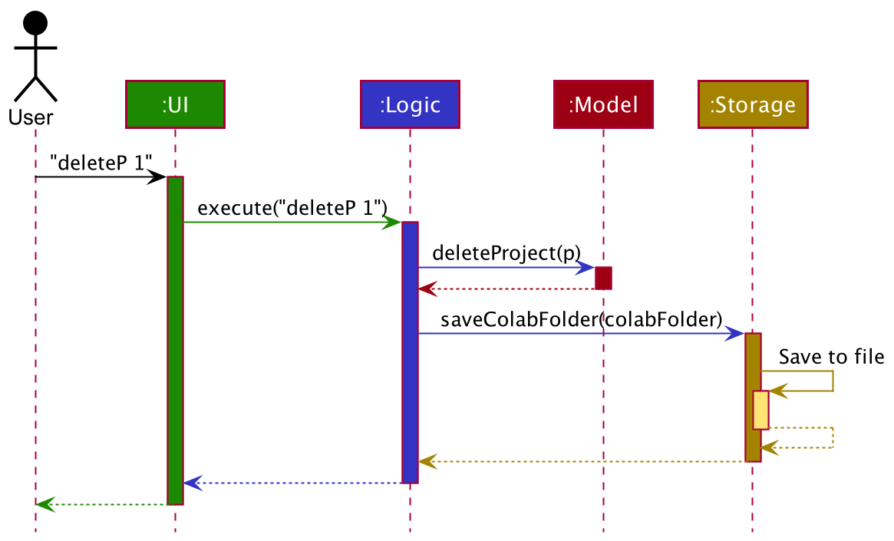
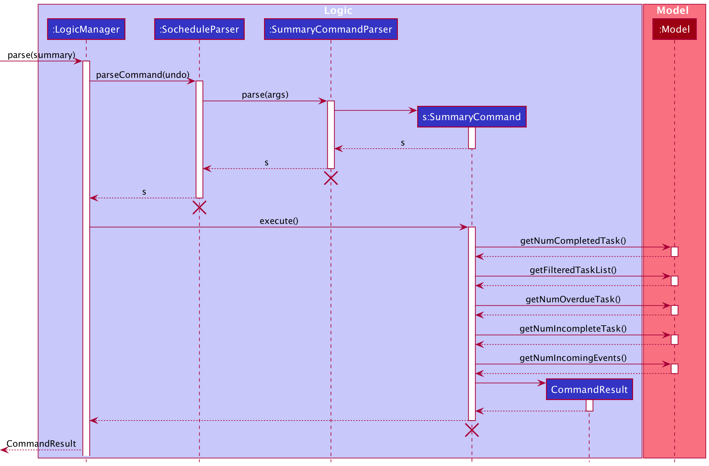

Table of Contents
1. [Preface](#1-preface) 
1. [Setting up, getting started](#2-setting-up-getting-started) 
1. [Design](#3-design) 
   3.1  [Architecture: High Level View](#31-architecture) 
   3.2  [UI Component](#32-ui-component) 
   3.3  [Logic Component](#33-logic-component) 
   3.4  [Model Component](#34-model-component) 
   3.5  [Storage Component](#35-storage-component) 
   3.6  [Common Classes](#36-common-classes) 
1. [Implementation](#4-implementation) 
   4.1 [Sochedule](#41-sochedule) 
   4.2 [Task](#42-task) 
   4.3 [Event](#43-event) 
1. [Planned Features](#5-documentation-logging-testing-configuration-dev-ops) 
1. [Appendix](#appendix) 
   A1. [Product Scope](#a1-product-scope) 
   A2. [User Stories](#a2-user-stories) 
   A3. [Use Cases](#a3-use-cases) 
   A4. [Non-Functional Requirements](#a4-non-functional-requirements) 
   A5. [Glossary](#a5-glossary) 
   A6. [Instructions for Manual Testing](#a6-instructions-for-manual-testing) 
   A7. [Launch and Shutdown](#a7-launch-and-shutdown) 
   A8. [Saving Data](#a8-saving-data) 
   
--------------------------------------------------------------------------------------------------------------------
## 1. Preface
SOChedule is a one-stop solution for managing tasks and events, optimized for use via a Command Line Interface (CLI) while still having the benefits of a Graphical User Interface (GUI).  

The Developer Guide for Sochedule is designed to showcase the high level architecture systems used to design and implement Sochedule.

The link to the repository can be found [here](https://github.com/AY2021S2-CS2103-W16-1/tp).

--------------------------------------------------------------------------------------------------------------------

## 2. Setting up, getting started

Refer to the guide [_Setting up and getting started_](SettingUp.md).

--------------------------------------------------------------------------------------------------------------------

## 3. Design

### 3.1 Architecture

The ***Architecture Diagram*** given above explains the high-level design of the App. Given below is a quick overview of each component.

:bulb: **Tip:** The `.puml` files used to create diagrams in this document can be found in the [diagrams](https://github.com/se-edu/addressbook-level3/tree/master/docs/diagrams/) folder. Refer to the [_PlantUML Tutorial_ at se-edu/guides](https://se-education.org/guides/tutorials/plantUml.html) to learn how to create and edit diagrams.
 

**`Main`** has two classes called [`Main`](https://github.com/se-edu/addressbook-level3/tree/master/src/main/java/seedu/address/Main.java) and [`MainApp`](https://github.com/se-edu/addressbook-level3/tree/master/src/main/java/seedu/address/MainApp.java). It is responsible for,
* At app launch: Initializes the components in the correct sequence, and connects them up with each other.
* At shut down: Shuts down the components and invokes cleanup methods where necessary.

[**`Commons`**](#common-classes) represents a collection of classes used by multiple other components.

The rest of the App consists of four components.

* [**`UI`**](#ui-component): The UI of the App.
* [**`Logic`**](#logic-component): The command executor.
* [**`Model`**](#model-component): Holds the data of the App in memory.
* [**`Storage`**](#storage-component): Reads data from, and writes data to, the hard disk.

Each of the four components,

* defines its *API* in an `interface` with the same name as the Component.
* exposes its functionality using a concrete `{Component Name}Manager` class (which implements the corresponding API `interface` mentioned in the previous point.

For example, the `Logic` component (see the class diagram given below) defines its API in the `Logic.java` interface and exposes its functionality using the `LogicManager.java` class which implements the `Logic` interface.

**How the architecture components interact with each other**

The *Sequence Diagram* below shows how the components interact with each other for the scenario where the user issues the command `delete 1`.

The sections below give more details of each component.

### 3.2 UI component

**API** :
[`Ui.java`](https://github.com/se-edu/addressbook-level3/tree/master/src/main/java/seedu/address/ui/Ui.java)

The UI consists of a `MainWindow` that is made up of parts e.g.`CommandBox`, `ResultDisplay`, `PersonListPanel`, `StatusBarFooter` etc. All these, including the `MainWindow`, inherit from the abstract `UiPart` class.

The `UI` component uses JavaFx UI framework. The layout of these UI parts are defined in matching `.fxml` files that are in the `src/main/resources/view` folder. For example, the layout of the [`MainWindow`](https://github.com/se-edu/addressbook-level3/tree/master/src/main/java/seedu/address/ui/MainWindow.java) is specified in [`MainWindow.fxml`](https://github.com/se-edu/addressbook-level3/tree/master/src/main/resources/view/MainWindow.fxml)

The `UI` component,

* Executes user commands using the `Logic` component.
* Listens for changes to `Model` data so that the UI can be updated with the modified data.

### 3.3 Logic component

**API** :
[`Logic.java`](https://github.com/se-edu/addressbook-level3/tree/master/src/main/java/seedu/address/logic/Logic.java)

1. `Logic` uses the `AddressBookParser` class to parse the user command.
1. This results in a `Command` object which is executed by the `LogicManager`.
1. The command execution can affect the `Model` (e.g. adding a person).
1. The result of the command execution is encapsulated as a `CommandResult` object which is passed back to the `Ui`.
1. In addition, the `CommandResult` object can also instruct the `Ui` to perform certain actions, such as displaying help to the user.

Given below is the Sequence Diagram for interactions within the `Logic` component for the `execute("delete 1")` API call.

:information_source: **Note:** The lifeline for `DeleteCommandParser` should end at the destroy marker (X) but due to a limitation of PlantUML, the lifeline reaches the end of diagram.

### 3.4 Model component

**API** : [`Model.java`](https://github.com/se-edu/addressbook-level3/tree/master/src/main/java/seedu/address/model/Model.java)

The `Model`,

* stores a `UserPref` object that represents the user’s preferences.
* stores the address book data.
* exposes an unmodifiable `ObservableList<Person>` that can be 'observed' e.g. the UI can be bound to this list so that the UI automatically updates when the data in the list change.
* does not depend on any of the other three components.

:information_source: **Note:** An alternative (arguably, a more OOP) model is given below. It has a `Tag` list in the `AddressBook`, which `Person` references. This allows `AddressBook` to only require one `Tag` object per unique `Tag`, instead of each `Person` needing their own `Tag` object. 

### 3.5 Storage component

**API** : [`Storage.java`](https://github.com/AY2021S2-CS2103-W16-1/tp/blob/master/src/main/java/seedu/address/storage/Storage.java)

The `Storage` component,
* can save `UserPref` objects in json format and read it back.
* can save the Sochedule data in json format and read it back.

### 3.6 Common classes

Classes used by multiple components are in the `seedu.addressbook.commons` package.

--------------------------------------------------------------------------------------------------------------------

## 4 Implementation

This section describes some noteworthy details on how [Sochedule](#41-sochedule), [Task](#42-task) and [Event](#43-event) are implemented.

### 4.1 Sochedule

#### 4.1.1 Overview

#### 4.1.2 Implementation

**Implementation of SummaryCommand**  
The following is a detailed explanation on how SummaryCommand is implemented.

**Step 1**: User executes `summary` command to get a summary of the current completion status of tasks and events.
An `SummaryCommandParser` object is created, and the `SummaryCommandParser#parse(String args)` method is called.
A `SummaryCommand` object is returned.

**Step 2**: On `SummaryCommand#execute()`, `Model#getNumCompletedTask()`,
`Model#getFilteredTaskList()`,
`Model#getNumOverdueTask()`,
`Model#getNumIncompleteTask()`,
`Model#getNumIncomingEvents()` are called.
This will get different statistics on task and event completion.
For brevity, lower level implementation is omitted.

**Step 3**: On execution completion a `CommandResult` is created.
A success message will be appended with `CommandResult#MESSAGE_SUCCESS`.

The sequence diagram for `SummaryCommand` can be found below.

### 4.2 Task

#### 4.2.1 Overview

#### 4.2.2 Implementation

**Implementation of SortTaskCommand**  
The following is a detailed explanation on how SortTaskCommand is implemented.

**Step 1**: User executes `sort SORT_VAR` command to sort the tasks based on the `SORT_VAR` provided.
An `SortTaskParser` object is created, and the `SortTaskParser#parse(String args)` method is called. 
The method conducts parses the `SORT_VAR` and conducts validation checks to ensure that it complies with the specification.
A `SortTaskCommand` object is returned.

**Step 2**: On `SortTaskCommand#execute()`, `Model#sortTasks(String comparingVar)` is called.
This will cause the task list to sort itself, based on the provided `comparingVar`.
For brevity, lower level implementation of `Model#sortTasks(String comparingVar)` is omitted.

**Step 3**: On execution completion a `CommandResult` is created.
A success message will be appended with `CommandResult#MESSAGE_SORT_TASK_SUCCESS`.
The UI will also update as the underlying task list has been modified.

The sequence diagram for `sortTaskCommand` can be found below.
  

      
  

### 4.3 Event

#### 4.3.1 Overview

#### 4.3.2 Implementation

--------------------------------------------------------------------------------------------------------------------

## 5. Documentation, logging, testing, configuration, dev-ops

* [Documentation guide](Documentation.md)
* [Testing guide](Testing.md)
* [Logging guide](Logging.md)
* [Configuration guide](Configuration.md)
* [DevOps guide](DevOps.md)

--------------------------------------------------------------------------------------------------------------------

## Appendix

### A1. Product scope

**Target user profile**:

* NUS SOC Student
* Prefer using CLI rather than GUI
* Struggle to manage their schedule
* Have a lot commitments (6 modules, TA and RA roles while balancing a part time internship)
* Can type fast, hate mouse

**Value proposition**:

* Provide a simple platform for target users to manage their schedule
* CLI commands to manage meetings or schedule with some contacts
* CLI commands to add tasks and reminders
* GUI to display the schedule of user

### A2. User stories

Priorities: High (must have) - `* * *`, Medium (nice to have) - `* *`, Low (unlikely to have) - `*`

| Priority | As a …​                            | I want to …​                                                        | So that …​                                                                |
| -------- | ------------------------------------- | ---------------------------------------------------------------------- | ---------------------------------------------------------------------------- |
| `* * *`  | SOC Student                           | Add a task to my schedule                                              | I can track my task better                                                   |
| `* *`    | SOC Student                           | Allocate a priority score to a task                                    | I can prioritise my time better                                              |
| `* *`    | SOC Student                           | Edit a task in my schedule                                             | I can have flexibility in my schedule                                        |
| `* * *`  | SOC Student                           | Mark a task complete in my schedule                                    | I can track which tasks I have completed                                     |
| `* * *`  | SOC Student                           | Delete a task from my schedule from my schedule                        | I can have flexibility in my schedule                                        |
| `* * *`  | SOC Student                           | View tasks in my schedule                                              | I can have a better sense of what will happen in the following days or weeks |
| `* *`    | SOC Student                           | Sort my tasks in my schedule in various orderings                      | I can prioritise my time better                                              |
| `*`      | Forgetful SOC Student                 | Get reminders from SOChedule regarding task deadlines                  | I will not lose track of my tasks                                            |
| `* *`    | SOC student under huge workload       | View my schedule to see my free time slots                             | I can allocate my time better and fill it up with more tasks                 |
| `*`      | SOC Student                           | View the people that I need to work with for a specific event          | I can keep in touch with the person better                                   |
| `* * *`  | SOC Student                           | Add an event (with the required information) to my schedule            | I can track my time better                                                   |
| `* *`    | SOC Student                           | Add recurring events (with the required information) to my schedule    | I can plan ahead for my schedule                                             |
| `*`      | SOC Student                           | Add a person that I have to work with to an event in my schedule       | I can track who I need to work with for an even                              |
| `*`      | SOC Student                           | Add a meeting link to an event in my schedule                          | I can quickly join a online meeting                                          |
| `* *`    | SOC Student                           | Edit event description in my schedule                                  | I can have flexibility in my schedule                                        |
| `* *`    | SOC Student                           | Edit the event time in my schedule                                     | I can have flexibility in my schedule                                        |
| `* * *`  | SOC Student                           | Delete an event from my schedule from my schedule                      | I can have flexibility in my schedule                                        |
| `*`      | SOC Student                           | Remove the person I am working with for an event                       | I can track who I need to work with for an event                             |
| `* * *`  | SOC Student                           | View events in my schedule                                             | I can have a better sense of what will happen in the following days or weeks |
| `* *`    | SOC Student                           | View events for today                                                  | I can have a better sense of what will happen in the following hours         |
| `* *`    | SOC Student                           | Sort the tasks based on the deadline                                   | I can proceed with the task that is closer to the deadline                   |
| `*`      | SOC Student                           | Get alerts for impending events                                        | I can prepare ahead of time for the event                                    |
| `*`      | SOC Student                           | Add the schedule of what I want to do and what I really do             | I can reflect which part of the day being not productive                     |
| `*`      | SOC Student                           | Set alert time frame for events                                        | I can prepare ahead of time                                                  |
| `* *`    | SOC Student                           | Set colours to events                                                  | I can categorise my events                                                   |
| `* *`    | SOC Student                           | Set colours to tasks                                                   | I can categorise my tasks                                                    |
| `* *`    | SOC Student                           | highlight the events that are very important                           | I can differentiate the important tasks from the rest                        |
| `*`      | SOC Student                           | record the progress of a habit user want to cultivate                  | I can cultivate a lot of good habits                                         |
| `*`      | SOC Student                           | write a diary each day                                                 | I can record my life                                                         |
| `*`      | SOC Student with many project modules | know who I am doing the task with                                      | it is easier to schedule meetings or discussions with my group mates         |
| `*`      | SOC Student                           | keep track of the progress of each module                              | I can finish all tasks well and on time                                      |
| `* *`    | SOC Student                           | categorise my tasks                                                    | I can group my tasks to have a clearer schedule                              |
| `* *`    | SOC Student                           | find out the free time between events                                  | fill in other activities to achieve better time management                   |
| `*`      | SOC Student taking several projects   | have a better sense on the project tasks assigned and the due date     | I can finish the tasks assigned on time                                      |

*{More to be added}*

### A3. Use cases

(For all use cases below, the **System** is the `SOChedule` and the **Actor** is the `User`, unless specified otherwise)

**Use case: UC01 - Add a task**

**MSS**

1. User wishes to add a new task.
2. User enters the required parameters.
3. SOChedule displays a success message for adding the task.
  
Use case ends.

**Extensions**

* 2a. Some required information about the event is missing in the command.

    * 1a1. SOChedule displays an error message suggesting that information provided when creating
      the event is incomplete.
      Use case ends.

* 2b. The date provided for the event is invalid

    * 1b1. SOChedule displays an error message suggesting that date provied for the event
      is invalid, or not following the `YYYY-MM-DD` format.
      Use case ends.

**Use case: UC02 - List tasks**

**MSS**

1. User wishes to add a new task.
2. User enters the corresponding command.
3. SOChedule displays all tasks.
  
Use case ends.

**Use case: UC03 - Delete a task**

**MSS**

1. User requests to <u> list tasks (UC02)</u>.
2. SOChedule shows a list of tasks.
3. User chooses to delete a task.
4. User enters the index of the task to be deleted.
5. SOChedule displays a success message for deleting the task.
  
Use case ends.

**Extensions**

* 2a. The task list is empty.

  Use case ends.

   

* 3a. The given index is invalid.

    * 3a1. SOChedule shows an error message.

      Use case resumes at step 2.

**Use case: UC04 - Mark a task as completed**

**MSS**

1. User requests to <u> list tasks (UC02)</u>.
2. SOChedule shows a list of tasks.
3. User chooses to mark a task as completed.
4. User enters the index of the task to be marked.
5. SOChedule displays a success message for marking the task as completed.
  
Use case ends.

**Extensions**

* 2a. The task list is empty.

  Use case ends.

* 3a. The given index is invalid.

    * 3a1. SOChedule shows an error message indicating the invalidity of the index.

      Use case resumes at step 2.

**Use case: UC05 - Add an event**

**MSS**

1. User requests to add a new event.
1. SOChedule displays a success message for adding the event.
  
Use case ends.

**Extensions**

* 1a. Some required information about the event is missing in the command.

    * 1a1. SOChedule displays an error message suggesting that information provided when creating
      the event is incomplete.
      Use case ends.

* 1b. The date provided for the event is invalid

    * 1b1. SOChedule displays an error message suggesting that date provided for the event
      is invalid, or not following the `YYYY-MM-DD` format.
      Use case ends.

**Use case: UC06 - List events**

**MSS**

1. User requests to list all events in the SOChedule.
1. SOChedule displays a list of all events added.
  
Use case ends.

**Extensions**

* 1a. No events have been added.
    * 1a1. SOChedule displays an empty list.
      Use case ends.

**Use case: UC07 - Delete an event**

**MSS**

1. User requests to <u> list events (UC06)</u>.
2. SOChedule shows a list of events.
3. User chooses to delete an event.
4. User enters the index of the event to be deleted.
5. SOChedule displays a success message for deleting the event.
  
Use case ends.

**Extensions**

* 2a. The event scheduler is empty.

  Use case ends.

* 3a. The given index is invalid.

    * 3a1. SOChedule shows an error message.

      Use case resumes at step 2.

      
*{More to be added}*

### A4. Non-Functional Requirements

1.  Should work on any _mainstream OS_ as long as it has Java `11` or above installed.
1.  Should be able to hold up to 1000 tasks without a noticeable sluggishness in performance for typical usage.
1.  Should be able to hold up to 500 events without a noticeable sluggishness in performance for typical usage.
1.  A user with above average typing speed for regular English text (i.e. not code, not system admin commands) should be able to accomplish most of the tasks faster using commands than using the mouse.
1.  Should give a response to user's input within 5 seconds.
1.  The user interface should be intuitive to a SoC freshman with little knowledge about programming.
1.  The source code should be open source.

*{More to be added}*

### A5. Glossary

* **Mainstream OS**: Windows, Linux, Unix, OS-X
* **Event**: Activities that start at a specific time and ends at a specific time.
* **Task**: Activities to be undertaken that can be marked complete/incomplete. Optionally it has a date field to indicate deadlines.

--------------------------------------------------------------------------------------------------------------------

### A6. Instructions for manual testing

Given below are instructions to test the app manually.

:information_source: **Note:** These instructions only provide a starting point for testers to work on;
testers are expected to do more *exploratory* testing.

### A7. Launch and shutdown

1. Initial launch

   1. Download the jar file and copy into an empty folder

   1. Double-click the jar file Expected: Shows the GUI with a set of sample contacts. The window size may not be optimum.

1. Saving window preferences

   1. Resize the window to an optimum size. Move the window to a different location. Close the window.

   1. Re-launch the app by double-clicking the jar file. 
       Expected: The most recent window size and location is retained.

1. _{ more test cases …​ }_

### Deleting a task (Not in use yet)

1. Deleting a task while all tasks are being shown

   1. Prerequisites: List all tasks using the `list_task` command. Multiple tasks in the list.

   1. Test case: `delete_task 1` 
      Expected: First task is deleted from the list. Details of the deleted task shown in the status message.

   1. Test case: `delete_task 0` 
      Expected: No task is deleted. Error details shown in the status message. Status bar remains the same.

   1. Other incorrect delete commands to try: `delete_task`, `delete_task x`, `...` (where x is larger than the list size) 
      Expected: Similar to previous.

1. _{ more test cases …​ }_

### A8. Saving data

1. Dealing with missing/corrupted data files

   1. _{explain how to simulate a missing/corrupted file, and the expected behavior}_

1. _{ more test cases …​ }_
