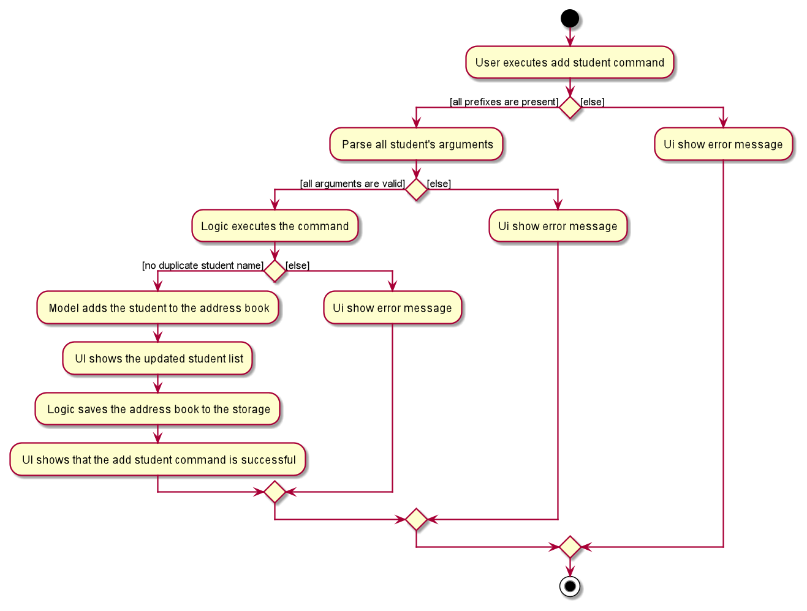
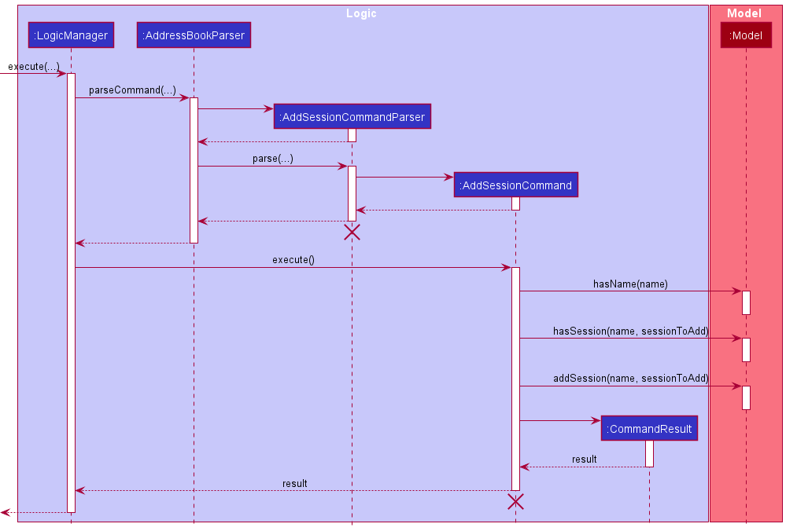

* Table of Contents
{:toc}

--------------------------------------------------------------------------------------------------------------------

## **Setting up, getting started**

Refer to the guide [_Setting up and getting started_](SettingUp.md).

--------------------------------------------------------------------------------------------------------------------

## **Design**

### Architecture

The ***Architecture Diagram*** given above explains the high-level design of the App. Given below is a quick overview of each component.

:bulb: **Tip:** The `.puml` files used to create diagrams in this document can be found in the [diagrams](https://github.com/se-edu/addressbook-level3/tree/master/docs/diagrams/) folder. Refer to the [_PlantUML Tutorial_ at se-edu/guides](https://se-education.org/guides/tutorials/plantUml.html) to learn how to create and edit diagrams.

**`Main`** has two classes called [`Main`](https://github.com/se-edu/addressbook-level3/tree/master/src/main/java/seedu/address/Main.java) and [`MainApp`](https://github.com/se-edu/addressbook-level3/tree/master/src/main/java/seedu/address/MainApp.java). It is responsible for,
* At app launch: Initializes the components in the correct sequence, and connects them up with each other.
* At shut down: Shuts down the components and invokes cleanup methods where necessary.

[**`Commons`**](#common-classes) represents a collection of classes used by multiple other components.

The rest of the App consists of four components.

* [**`UI`**](#ui-component): The UI of the App.
* [**`Logic`**](#logic-component): The command executor.
* [**`Model`**](#model-component): Holds the data of the App in memory.
* [**`Storage`**](#storage-component): Reads data from, and writes data to, the hard disk.

Each of the four components,

* defines its *API* in an `interface` with the same name as the Component.
* exposes its functionality using a concrete `{Component Name}Manager` class (which implements the corresponding API `interface` mentioned in the previous point.

For example, the `Logic` component (see the class diagram given below) defines its API in the `Logic.java` interface and exposes its functionality using the `LogicManager.java` class which implements the `Logic` interface.

**How the architecture components interact with each other**

The *Sequence Diagram* below shows how the components interact with each other for the scenario where the user issues the command `delete_student 1`.

The sections below give more details of each component.

### UI component

**API** :
[`Ui.java`](https://github.com/se-edu/addressbook-level3/tree/master/src/main/java/seedu/address/ui/Ui.java)

The UI consists of a `MainWindow` that is made up of parts e.g.`CommandBox`, `ResultDisplay`, `StudentListPanel`, `StatusBarFooter` etc. All these, including the `MainWindow`, inherit from the abstract `UiPart` class.

The `UI` component uses JavaFx UI framework. The layout of these UI parts are defined in matching `.fxml` files that are in the `src/main/resources/view` folder. For example, the layout of the [`MainWindow`](https://github.com/se-edu/addressbook-level3/tree/master/src/main/java/seedu/address/ui/MainWindow.java) is specified in [`MainWindow.fxml`](https://github.com/se-edu/addressbook-level3/tree/master/src/main/resources/view/MainWindow.fxml)

The `UI` component,

* Executes user commands using the `Logic` component.
* Listens for changes to `Model` data so that the UI can be updated with the modified data.

### Logic component

**API** :
[`Logic.java`](https://github.com/se-edu/addressbook-level3/tree/master/src/main/java/seedu/address/logic/Logic.java)

1. `Logic` uses the `AddressBookParser` class to parse the user command.
1. This results in a `Command` object which is executed by the `LogicManager`.
1. The command execution can affect the `Model` (e.g. adding a student).
1. The result of the command execution is encapsulated as a `CommandResult` object which is passed back to the `Ui`.
1. In addition, the `CommandResult` object can also instruct the `Ui` to perform certain actions, such as displaying help to the user.

Given below is the Sequence Diagram for interactions within the `Logic` component for the `execute("delete_student 1")` API call.

:information_source: **Note:** The lifeline for `DeleteStudentCommandParser` should end at the destroy marker (X) but due to a limitation of PlantUML, the lifeline reaches the end of diagram.

### Model component

**API** : [`Model.java`](https://github.com/se-edu/addressbook-level3/tree/master/src/main/java/seedu/address/model/Model.java)

The `Model`,

* stores a `UserPref` object that represents the user’s preferences.
* stores the address book data.
* exposes an unmodifiable `ObservableList<Person>` that can be 'observed' e.g. the UI can be bound to this list so that the UI automatically updates when the data in the list change.
* does not depend on any of the other three components.

:information_source: **Note:** An alternative (arguably, a more OOP) model is given below. It has a `Tag` list in the `AddressBook`, which `Person` references. This allows `AddressBook` to only require one `Tag` object per unique `Tag`, instead of each `Person` needing their own `Tag` object. 

### Storage component

**API** : [`Storage.java`](https://github.com/se-edu/addressbook-level3/tree/master/src/main/java/seedu/address/storage/Storage.java)

The `Storage` component,
* can save `UserPref` objects in json format and read it back.
* can save the address book data in json format and read it back.

### Common classes

Classes used by multiple components are in the `seedu.addressbook.commons` package.

--------------------------------------------------------------------------------------------------------------------

## **Implementation**

This section describes some noteworthy details on how certain features are implemented.

### List Student Feature

#### Implementation
The list student feature displays a list of existing students in the TutorBuddy application.

This feature is facilitated by `ListStudentCommand` which extends `Command`.
The method `ListStudentCommand#execute` updates the filtered student list by calling the method
`Model#updateFilteredStudentList` exposed in the `Model` interface.

Given below is an example of how the list student 
1. The user executes the list student command with the input `list_student`.
2. `LogicManager` executes the input and parses the command using `AddressBookParser`.
3. `AddressBookParser` identifies the correct command and creates a new `ListStudentCommand`.
4. `AddressBookParser` returns the new `ListStudentCommand` to `LogicManager`.
5. `LogicManager` executes the `ListStudentCommand`.
6. `ListStudentCommand` now calls `Model` to update the `filteredStudentList` to show all students.

The following sequence diagram shows the interactions when user executes the `list_student` command:  

NOTE: The lifeline of `ListStudentCommand` should end at the cross but is not shown due to the limitations of PlantUML.

The following activity diagram summarizes what happens when a user executes the `list_student` command.  

### Add Student Feature

#### Implementation
The add student feature allows user to add a student to the TutorBuddy Application. 

This feature makes use of `AddStudentCommandParser` and `AddStudentCommand` to create a new `Student` object. The operation can be accessed in the Model interface through `Model#addStudent()`. 

Given below is an example of how the add student mechanism runs:
1. The user executes the add student command with the command word `add_student` and include all the information required.
2. `LogicManager` starts executing and parses the command using `AddressBookParser`.
3. `AddressBookParser` recognises the command and runs the `AddStudentCommandParser` class.
4. `AddStudentCommandParser` then validates the information, and creates a new `Student` object.
5. `AddStudentCommandParser` also creates a new `AddStudentCommand` with the previously created `Student` object as parameter.
6. The command is returned to `LogicManager` which then executes the command.
7. `ModelManager` adds the student to the `AddressBook`.
8. `ModelManager` adds the student to `filteredStudents` list.
9. `Logic` saves the `AddressBook` data in the `Storage`.

The following activity diagram summarizes what happens when a user executes the `add_student` command.

### List Students' Email Feature
The list students' email feature allows the end-user to retrieve a list of students' emails, which are concatenated with
a semi-colon `;`. This allows for easy copy and pasting to e-mail applications, such as Microsoft Outlook, for mass
e-mail purposes (e.g. newsletter). 

#### Implementation
This feature is mainly supported by `EmailCommand`, with retrieval of students' emails through the Model interface
`Model#getFilteredStudentList()`.

Below is an example of how the list students' email mechanism works:
1. The user executes the list students' emails command with the command `emails`
2. `LogicManager` receives the command, and hands off the parsing of command to `AddressBookParser`
3. `AddressBookParser` recognises the command and creates a new `EmailCommand`
4. `EmailCommand` is returned back to `LogicManager`, which then executes the command through `EmailCommand#execute()`
5. Upon `EmailCommand#execute()`, a list of `Student` are retrieved through `Model#getFilteredStudentList()`
6. The list of `Student` emails are then concatenated with ';' into a `String`
7. The concatenated `String` is then returned to `LogicManager` as a new `CommandResult`
8. The `CommandResult` containing the concatenated email is then displayed to the user through `ResultDisplay`

The following activity diagram summarizes what happens when a user executes the `emails` command:

The following sequence diagram summarizes what happens when a user executes the `emails` command:

### Add Session Feature
The add session feature allows users to add individual tuition sessions with specific details of each session.

This section explains the implementation of the add session mechanism and highlights the design considerations 
taken into account when implementing this feature.

#### Implementation
The add attendance mechanism is facilitated by `AddAttendanceCommand` and it extends `Command`. The method, 
`AddSessionCommand#execute()`, performs a validity check on student name input and session details input by the user 
before adding the session.

The following sequence diagram shows the interactions between the Model and Logic components during the execution of 
an AddSessionCommand with user input `add_session n/STUDENT_NAME d/DATE t/TIME k/DURATION s/SUBJECT f/FEE`:

1. `Logic` uses the `AddressBookParser` class to parse the user command.
2. A new instance of an `AddSessionCommand` would be created by the `AddSessionCommandParser` and returned to `AddressBookParser`.
3. `AddressBookParser` encapsulates the `AddSessionCommand` object as a `Command` object which is executed by the `LogicManager`.
4. The command execution calls `hasStudent(name)` and `hasSession(name, sessionToAdd)` to validate the inputs before calling
`addSession(name, sessionToAdd)` which adds the session to the specific student.
5. The result of the command execution is encapsulated as a CommandResult object which is passed back to the Ui.

#### Design Considerations
Aspect 1: Type of input for AddSessionCommand
* **Alternative 1 (current choice)**: Using student name to identify the student to add the session to.
    * Pros:
        * Easier for user to add sessions without constantly having to refer to the application for student id
    * Cons:
        * Slows down user since name takes longer to type than index.

* **Alternative 2**: Using student index to identify the student to add the session to.
    * Pros:
        * Allows fast entering of input.
    * Cons:
        * User has to constantly refer to the application for student index id.
    
Alternative 1 was chosen because the cons of implementing alternative 2 outweighs the benefits derived from it. Student index id may change when
a user adds a new student into the AddressBook. If the AddressBook contains many students, it may take some time for the user to find the 
updated student index id. Student name on the other hand, stays constant throughout the application lifetime unless the user edits this information,
which he also has knowledge of. Therefore, student name can be easily entered without reference to the AddressBook, saving much more time compared
to alternative 2.

### \[Proposed\] Undo/redo feature

#### Proposed Implementation

The proposed undo/redo mechanism is facilitated by `VersionedAddressBook`. It extends `AddressBook` with an undo/redo history, stored internally as an `addressBookStateList` and `currentStatePointer`. Additionally, it implements the following operations:

* `VersionedAddressBook#commit()` — Saves the current address book state in its history.
* `VersionedAddressBook#undo()` — Restores the previous address book state from its history.
* `VersionedAddressBook#redo()` — Restores a previously undone address book state from its history.

These operations are exposed in the `Model` interface as `Model#commitAddressBook()`, `Model#undoAddressBook()` and `Model#redoAddressBook()` respectively.

Given below is an example usage scenario and how the undo/redo mechanism behaves at each step.

Step 1. The user launches the application for the first time. The `VersionedAddressBook` will be initialized with the initial address book state, and the `currentStatePointer` pointing to that single address book state.

Step 2. The user executes `delete_student 5` command to delete the 5th student in the address book. The `delete_student` command calls `Model#commitAddressBook()`, causing the modified state of the address book after the `delete_student 5` command executes to be saved in the `addressBookStateList`, and the `currentStatePointer` is shifted to the newly inserted address book state.

Step 3. The user executes `add n/David …​` to add a new student. The `add` command also calls `Model#commitAddressBook()`, causing another modified address book state to be saved into the `addressBookStateList`.

:information_source: **Note:** If a command fails its execution, it will not call `Model#commitAddressBook()`, so the address book state will not be saved into the `addressBookStateList`.

Step 4. The user now decides that adding the student was a mistake, and decides to undo that action by executing the `undo` command. The `undo` command will call `Model#undoAddressBook()`, which will shift the `currentStatePointer` once to the left, pointing it to the previous address book state, and restores the address book to that state.

:information_source: **Note:** If the `currentStatePointer` is at index 0, pointing to the initial AddressBook state, then there are no previous AddressBook states to restore. The `undo` command uses `Model#canUndoAddressBook()` to check if this is the case. If so, it will return an error to the user rather
than attempting to perform the undo.

The following sequence diagram shows how the undo operation works:

:information_source: **Note:** The lifeline for `UndoCommand` should end at the destroy marker (X) but due to a limitation of PlantUML, the lifeline reaches the end of diagram.

The `redo` command does the opposite — it calls `Model#redoAddressBook()`, which shifts the `currentStatePointer` once to the right, pointing to the previously undone state, and restores the address book to that state.

:information_source: **Note:** If the `currentStatePointer` is at index `addressBookStateList.size() - 1`, pointing to the latest address book state, then there are no undone AddressBook states to restore. The `redo` command uses `Model#canRedoAddressBook()` to check if this is the case. If so, it will return an error to the user rather than attempting to perform the redo.

Step 5. The user then decides to execute the command `list`. Commands that do not modify the address book, such as `list`, will usually not call `Model#commitAddressBook()`, `Model#undoAddressBook()` or `Model#redoAddressBook()`. Thus, the `addressBookStateList` remains unchanged.

Step 6. The user executes `clear`, which calls `Model#commitAddressBook()`. Since the `currentStatePointer` is not pointing at the end of the `addressBookStateList`, all address book states after the `currentStatePointer` will be purged. Reason: It no longer makes sense to redo the `add n/David …​` command. This is the behavior that most modern desktop applications follow.

The following activity diagram summarizes what happens when a user executes a new command:

#### Design consideration:

##### Aspect: How undo & redo executes

* **Alternative 1 (current choice):** Saves the entire address book.
  * Pros: Easy to implement.
  * Cons: May have performance issues in terms of memory usage.

* **Alternative 2:** Individual command knows how to undo/redo by
  itself.
  * Pros: Will use less memory (e.g. for `delete_student`, just save the student being deleted).
  * Cons: We must ensure that the implementation of each individual command are correct.

_{more aspects and alternatives to be added}_

### \[Proposed\] Data archiving

_{Explain here how the data archiving feature will be implemented}_

--------------------------------------------------------------------------------------------------------------------

## **Documentation, logging, testing, configuration, dev-ops**

* [Documentation guide](Documentation.md)
* [Testing guide](Testing.md)
* [Logging guide](Logging.md)
* [Configuration guide](Configuration.md)
* [DevOps guide](DevOps.md)

--------------------------------------------------------------------------------------------------------------------

## **Appendix: Requirements**

### Product scope

**Target user profile**: An independent tutor

* has a need to manage a significant number of student contacts (100 - 200)
* prefers desktop apps over other types
* can type fast (80 _WPM_ and above)
* prefers typing to mouse interactions
* is reasonably comfortable using CLI apps

**Value proposition**: 
* Cut down admin overhead for independent tutors
* All in one platform to manage their students' information

### User stories

Priorities: High (must have) - `* * *`, Medium (nice to have) - `* *`, Low (unlikely to have) - `*`

| Priority | As a …​                                 | I want to …​                                   | So that I can…​                                           |
| -------- | ------------------------------------------ | ------------------------------------------------- | ------------------------------------------------------------ |
| `* * *`  | user                                       | create a student's profile                        | keep track of my student's information                       |
| `* * *`  | user                                       | see the profile of a particular student           | get their information                                        |
| `* * *`  | user                                       | see a list of all my students' profile            |                                                              |
| `* * *`  | user                                       | get all the emails of the parent of my students'  | email them reminders for payment                             |
| `* * *`  | user                                       | remove a student's profile                        | keep track of only students that I teach                     |
| `* * *`  | user                                       | add individual tuition sessions                   | keep track of my tuition sessions                            |
| `* * *`  | user                                       | delete an individual tuition session              | update my tuition schedule                                   |

*{More to be added}*

### Use cases

*(For all use cases, the **System** is the TutorBuddy Application, **Actor** is the user, and the **Precondition** is that the application has already been opened, unless otherwise specified)*

**Use case: UC01 - Create a student profile**

MSS:

1. User enters the add student command, together with the student details.
2. TutorBuddy creates the profile in the background.
3. TutorBuddy displays the success message.

    Use case ends.

Extensions:

* 1a. TutorBuddy detects an error in the entered data.
    * 1a1. TutorBuddy displays an error message.

    Use case ends.

**Use case: UC02 - Delete a student profile**

MSS:

1. User enters the delete student command, along with the student’s name.
2. TutorBuddy verifies that the student profile exists.
3. TutorBuddy prompts the user to confirm the deletion.
4. User confirms the deletion.

   Use case ends.

Extensions:

* 2a. TutorBuddy detects an error in the entered command.
    * 2a1. TutorBuddy displays error messages to the user.

  Use case ends.

* 3a. TutorBuddy detects that the user does not exist.
    * 3a1. TutorBuddy displays an error message for unknown student profiles.

  Use case ends.

* 4a. User cancels the confirmation of deletion.
    * 4a1. Student profile is not created; the student is returned to the home page.

  Use case ends.

**Use case: UC03 - Find a student’s profile**

MSS:

1. User enters the find student command, along with a keyword from the student’s name.
2. TutorBuddy displays all students’ profiles matching the keyword if any.

   Use case ends.

Extensions:

* 1a. TutorBuddy detects empty keyword field
    * 1a1. TutorBuddy displays an error message for no keyword specified.

  Use case ends.

**Use case: UC04 - Create a session**

**Preconditions: Student profile linked to session has been created.**

MSS:

1. User enters the add session command, together with the session details.
2. TutorBuddy creates the session.
3. TutorBuddy displays a success message.

   Use case ends.

**Extensions:**

* 1a. TutorBuddy detects an error in the entered data.
    * 1a1. TutorBuddy prompts an error and requests for the correct data.

  Use case ends.

* 1b. TutorBuddy detects another session that the user has in the same timeframe.
    * 1b1. TutorBuddy prompts an error and requests for the correct data.

  Use case ends.

**Use case: UC05 -  Getting the emails from the application**

MSS:

1. User enters the command to get the email from TutorBuddy.
2. TutorBuddy returns a list of all the email addresses to the user.
3. User copies the email address given.

   Use case ends.

*{More to be added}*

### Non-Functional Requirements  
* Technical requirements:  
    * TutorBuddy should work on both 32-bit and 64-bit environments.
    * TutorBuddy should work on any _mainstream OS_ with Java `11` or above installed.
    * The user should have enough memory on their computer to ensure that data will be stored in the application without errors.
* Performance requirements:
    * TutorBuddy should be able to hold up to _500 students_ or _500 sessions_ without a noticeable dip in performance for typical usage.
    * Response time from any command should be within 1 second.
* Constraints:
    * TutorBuddy should be backward compatible with data produced by earlier versions of the system.
* Quality requirements:
    * The user should take no longer than 1 hour to learn the different functionalities of TutorBuddy from the user guide.
* Process requirements:
    * TutorBuddy should be completed before AY20/21 Week 13
* Any other noteworthy points:
    * A user with above average typing speed (80 _WPM_ and above) for regular English text (i.e. not code, not system admin commands) should be able to use most of the functionalities in TutorBuddy faster using commands rather than using the mouse.

### Glossary

* **Mainstream OS**: Windows, Linux, Unix, OS-X
* **CLI**: Command Line Interface where users can interact with their OS system.
* **MSS**: Main Success Scenario
* **WPM**: Words Per Minute

--------------------------------------------------------------------------------------------------------------------

## **Appendix: Instructions for manual testing**

Given below are instructions to test the app manually.

:information_source: **Note:** These instructions only provide a starting point for testers to work on;
testers are expected to do more *exploratory* testing.

### Launch and shutdown

1. Initial launch

   1. Download the jar file and copy into an empty folder

   1. Double-click the jar file Expected: Shows the GUI with a set of sample contacts. The window size may not be optimum.

1. Saving window preferences

   1. Resize the window to an optimum size. Move the window to a different location. Close the window.

   1. Re-launch the app by double-clicking the jar file. 
       Expected: The most recent window size and location is retained.

1. _{ more test cases …​ }_

### Deleting a student

1. Deleting a student while all students are being shown

   1. Prerequisites: List all students using the `list` command. Multiple students in the list.

   1. Test case: `delete_student 1` 
      Expected: First contact is deleted from the list. Details of the deleted contact shown in the status message. Timestamp in the status bar is updated.

   1. Test case: `delete_student 0` 
      Expected: No student is deleted. Error details shown in the status message. Status bar remains the same.

   1. Other incorrect delete commands to try: `delete_student`, `delete_student x`, `...` (where x is larger than the list size) 
      Expected: Similar to previous.

1. _{ more test cases …​ }_

### Saving data

1. Dealing with missing/corrupted data files

   1. _{explain how to simulate a missing/corrupted file, and the expected behavior}_

1. _{ more test cases …​ }_
