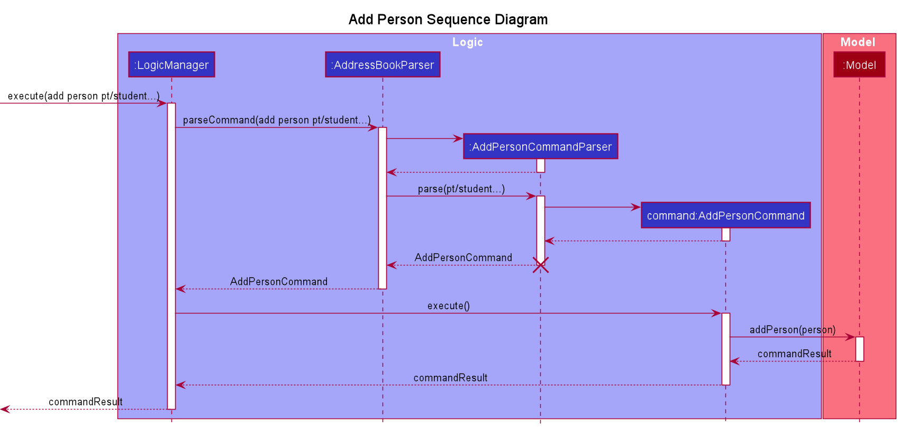
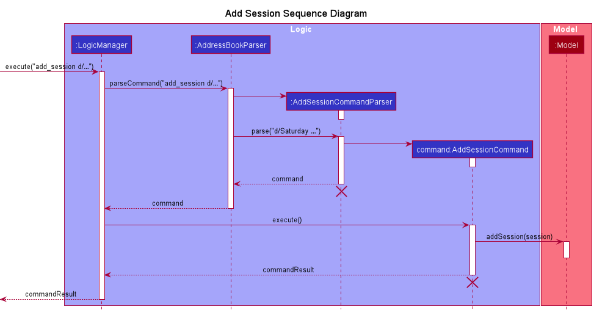
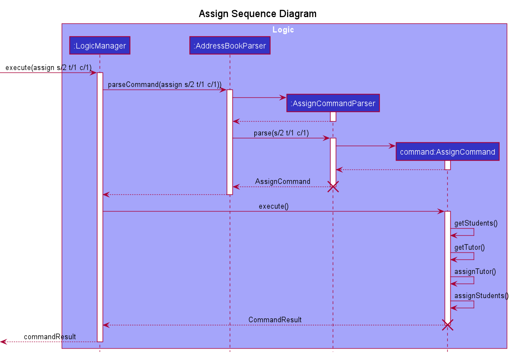
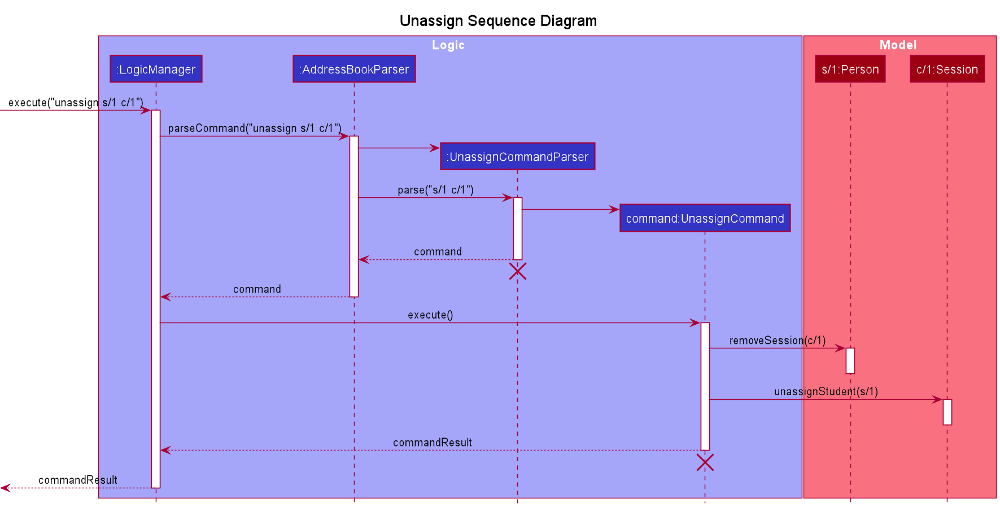
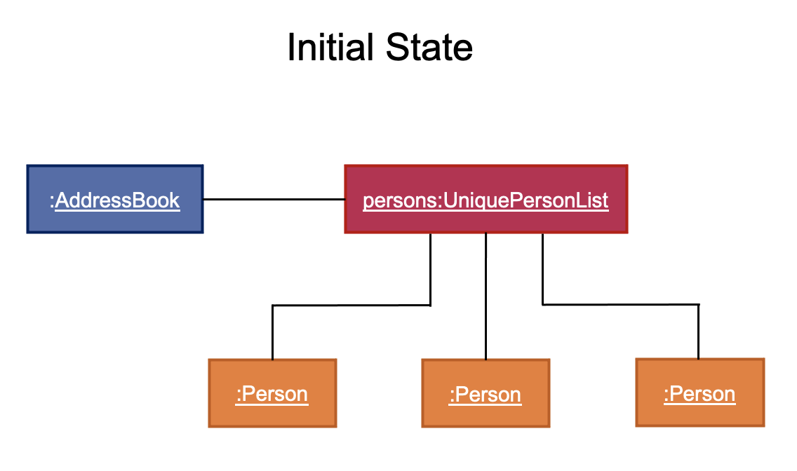
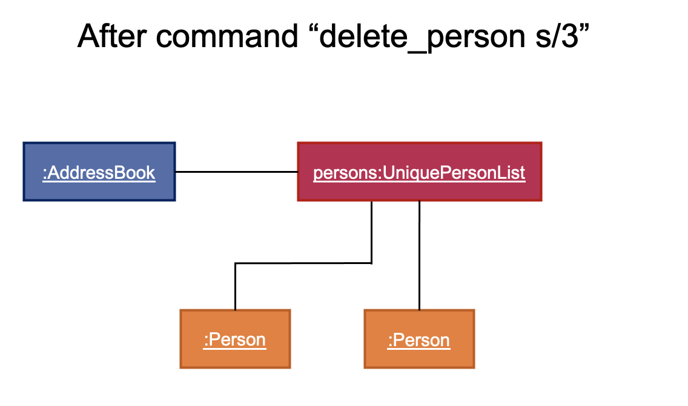
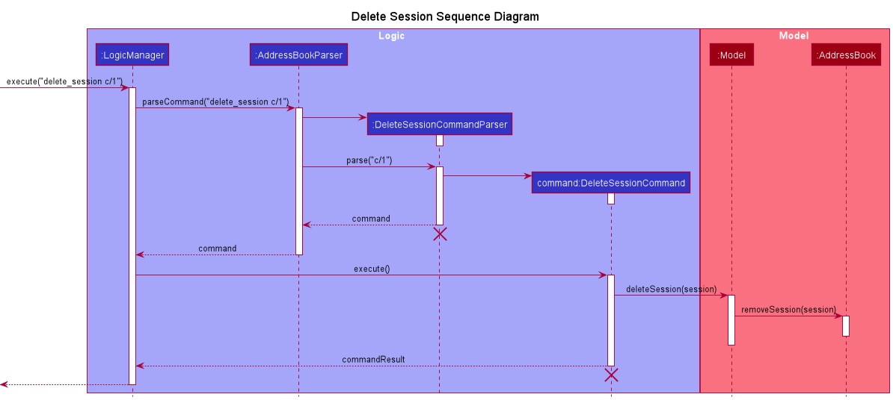
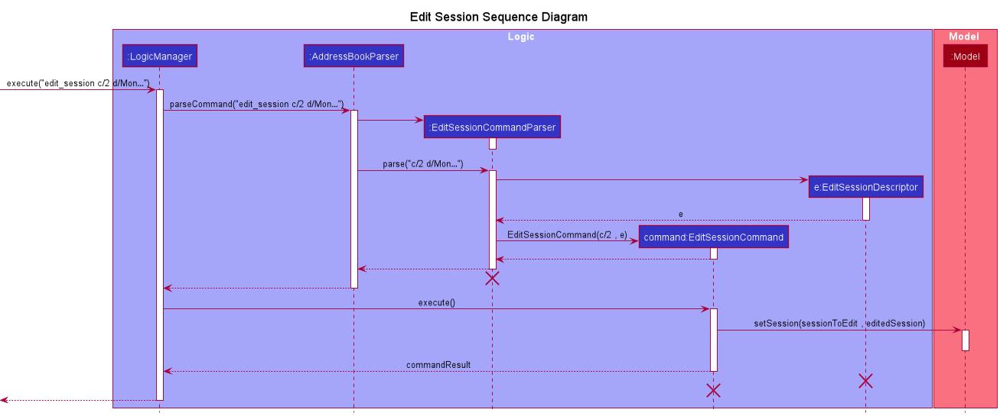

* Table of Contents
{:toc}

--------------------------------------------------------------------------------------------------------------------

## **Setting up, getting started**

Refer to the guide [_Setting up and getting started_](SettingUp.md).

--------------------------------------------------------------------------------------------------------------------

## **Design**

### Architecture

The ***Architecture Diagram*** given above explains the high-level design of the App. Given below is a quick overview of each component.

:bulb: **Tip:** The `.puml` files used to create diagrams in this document can be found in the [diagrams](https://github.com/se-edu/addressbook-level3/tree/master/docs/diagrams/) folder. Refer to the [_PlantUML Tutorial_ at se-edu/guides](https://se-education.org/guides/tutorials/plantUml.html) to learn how to create and edit diagrams.

**`Main`** has two classes called [`Main`](https://github.com/se-edu/addressbook-level3/tree/master/src/main/java/seedu/address/Main.java) and [`MainApp`](https://github.com/se-edu/addressbook-level3/tree/master/src/main/java/seedu/address/MainApp.java). It is responsible for,
* At app launch: Initializes the components in the correct sequence, and connects them up with each other.
* At shut down: Shuts down the components and invokes cleanup methods where necessary.

[**`Commons`**](#common-classes) represents a collection of classes used by multiple other components.

The rest of the App consists of four components.

* [**`UI`**](#ui-component): The UI of the App.
* [**`Logic`**](#logic-component): The command executor.
* [**`Model`**](#model-component): Holds the data of the App in memory.
* [**`Storage`**](#storage-component): Reads data from, and writes data to, the hard disk.

Each of the four components,

* defines its *API* in an `interface` with the same name as the Component.
* exposes its functionality using a concrete `{Component Name}Manager` class (which implements the corresponding API `interface` mentioned in the previous point.

For example, the `Logic` component (see the class diagram given below) defines its API in the `Logic.java` interface and exposes its functionality using the `LogicManager.java` class which implements the `Logic` interface.

**How the architecture components interact with each other**

The *Sequence Diagram* below shows how the components interact with each other for the scenario where the user issues the command `delete_person s/1`.

The sections below give more details of each component.

### UI component

**API** :
[`Ui.java`](https://github.com/se-edu/addressbook-level3/tree/master/src/main/java/seedu/address/ui/Ui.java)

The UI consists of a `MainWindow` that is made up of parts e.g.`CommandBox`, `ResultDisplay`, `PersonListPanel`, `StatusBarFooter` etc. All these, including the `MainWindow`, inherit from the abstract `UiPart` class.

The `UI` component uses JavaFx UI framework. The layout of these UI parts are defined in matching `.fxml` files that are in the `src/main/resources/view` folder. For example, the layout of the [`MainWindow`](https://github.com/se-edu/addressbook-level3/tree/master/src/main/java/seedu/address/ui/MainWindow.java) is specified in [`MainWindow.fxml`](https://github.com/se-edu/addressbook-level3/tree/master/src/main/resources/view/MainWindow.fxml)

The `UI` component,

* Executes user commands using the `Logic` component.
* Listens for changes to `Model` data so that the UI can be updated with the modified data.

### Logic component

**API** :
[`Logic.java`](https://github.com/se-edu/addressbook-level3/tree/master/src/main/java/seedu/address/logic/Logic.java)

1. `Logic` uses the `AddressBookParser` class to parse the user command.
1. This results in a `Command` object which is executed by the `LogicManager`.
1. The command execution can affect the `Model` (e.g. adding a person).
1. The result of the command execution is encapsulated as a `CommandResult` object which is passed back to the `Ui`.
1. In addition, the `CommandResult` object can also instruct the `Ui` to perform certain actions, such as displaying help to the user.

Given below is the Sequence Diagram for interactions within the `Logic` component for the `execute("delete_person s/3")` API call.

:information_source: **Note:** The lifeline for `DeletePersonCommandParser` and `DeletePersonCommand` should end at the destroy marker (X) but due to a limitation of PlantUML, the lifeline reaches the end of diagram.

### Model component

**API** : [`Model.java`](https://github.com/se-edu/addressbook-level3/tree/master/src/main/java/seedu/address/model/Model.java)

The `Model`,

* stores a `UserPref` object that represents the user’s preferences.
* stores the address book data.
* exposes an unmodifiable `ObservableList<Person>` that can be 'observed' e.g. the UI can be bound to this list so that the UI automatically updates when the data in the list change.
* does not depend on any of the other three components.

:information_source: **Note:** An alternative (arguably, a more OOP) model is given below. It has a `Tag` list in the `AddressBook`, which `Person` references. This allows `AddressBook` to only require one `Tag` object per unique `Tag`, instead of each `Person` needing their own `Tag` object. 

### Storage component

**API** : [`Storage.java`](https://github.com/se-edu/addressbook-level3/tree/master/src/main/java/seedu/address/storage/Storage.java)

The `Storage` component,
* can save `UserPref` objects in json format and read it back.
* can save the address book data in json format and read it back.

### Common classes

Classes used by multiple components are in the `seedu.addressbook.commons` package.

--------------------------------------------------------------------------------------------------------------------

## **Implementation**

This section describes some noteworthy details on how certain features are implemented.

### Add person feature

#### Current Implementation

The add person feature allows the user to add either a student or a tutor to EzManage

The add person feature is facilitated by `UniquePersonList`. This list is stored internally in `AddressBook` as persons.

`UniquePersonList` has a method called `addPerson(Person p)` which adds a Person to its list of Person. This person could be a Tutor or a Student depending on its personType attribute.

This operation is exposed in the `Model` interface as `Model#addPerson(Person person)`

Given below is an example usage scenario and how the add person mechanism behaves at each step.

Step 1: The user executes `add_person pt/student …`. The LogicManager takes in the string command and calls `AddressBookParser#parseCommand(String userInput)`.

Step 2: The `parseCommand` method passes the user input to `AddPersonCommandParser#parse(String args)` which returns an AddPersonCommand object. This addPersonCommand object has a reference to a Person which could be either Student or Tutor

Step 3: The LogicManager then executes the AddPersonCommand which calls the `Model#addPerson(Person person)` method.

Step 4: The `Model` adds the new Person to `UniquePersonList` in `AddressBook` and returns a CommandResult

Step 5: The `CommandResult` is then displayed on the UI

The sequence for the example scenario can be found below:

### Add session feature

#### Current Implementation

The add session feature is facilitated by `SessionList`. It is stored internally in `AddressBook` as `sessions`. It implements the following relevant operations:

* `SessionList#add(Session toAdd)` — Adds the given session to the current list of sessions

This operation is exposed in the `Model` interface as `Model#addSession(Session session)`.

Given below is an example usage scenario and how the add session mechanism behaves at each step.

Step 1: The user executes `add_session d/Saturday …` command to add a new session. The `LogicManager` calls `AddressBookParser#parseCommand(String userInput)`. 

Step 2: The `parseCommand` method passes the user input to `AddSessionCommandParser#parse(String args)` which returns an `AddSessionCommand` object.

Step 3: The `LogicManager` then executes the `AddSessionCommand` which calls the `Model#addSession(Session session)` method.

Step 4: The `Model` adds the new session to `sessions` in `AddressBook` and returns a `CommandResult`.

Step 5: The `CommandResult` is then displayed on the UI.

The sequence for the example scenario can be found below:

:information_source: **Note:** The lifeline for `AddSessionCommandParser` and `AddSessionCommand` should end at the destroy marker (X) but due to a limitation of PlantUML, the lifeline reaches the end of diagram.

### Assign person feature

#### Current Implementation

The assign feature is able to assign `sessionId` to the list of sessions in a Person. This person can either be a Student or a Tutor. 

Likewise, `studentId` and `tutorId` will be assigned to the list of students and tutor attribute of a session respectively.

Given below is  an example usage scenario and how the assign command behaves at each step.

Step 1 : The user executes `assign s/1 t/1 c/1` command to assign student `s/1` and tutor `t/1` to session `c/1`The LogicManager takes in the user input the calls `AddressBookParser#parseCommand(String userInput)`

Step 2: The `AddressBookParser` then calls `AssignCommandParser.parse(String args)` that returns a `AssignCommand`. This `AssignCommand` will be return back to LogicManager

Step 3: `LogicManager` then calls `AssignCommand#execute()`. In this method, `ÀssignCommand` calls internal methods `getStudents()` and `getTutor()`to check if provided studentId and tutorId are valid inputs. Once checked, `AssignCommand` calls internal methods `assignTutor()` and `assignStudents` which updates the provided student, tutor and session in both `UniquePersonList` and `SessionList`.

Step 4: A `CommandResult` is returned 

Step 5: The `CommandResult` is then displayed on the UI.

The sequence for the example scenario can be found below:

### Unassign person feature

#### Current Implementation

The unassign feature utilises defensive programming to ensure that the `tutor` and `students` attributes of the session correspond with those persons' `sessions` attribute.

Given below is an example usage scenario and how the unassign command behaves at each step.

Step 1: The user executes `unassign s/1 c/1` command to unassign student `s/1` from session `c/1`. The `LogicManager` calls `AddressBookParser#parseCommand(String userInput)`. 

Step 2: The `parseCommand` method passes the user input to `UnassignCommandParser#parse(String args)` which returns an `UnassignCommand` object.

Step 3: The `LogicManager` then executes the `UnassignCommand`.

Step 4: The `UnassignCommand` calls the `Person#removeSession(SessionID session)` to remove the session from the student `s/1`'s list, and `Session#unassignStudent(PersonId student)` to remove the student from the session `c/1`'s list.

Step 5: A `CommandResult` object is returned and displayed on the UI.

The sequence for the example scenario can be found below:

:information_source: **Note:** The lifeline for `UnassignCommandParser` and `UnassignCommand` should end at the destroy marker (X) but due to a limitation of PlantUML, the lifeline reaches the end of diagram.

### Delete person feature

#### Current Implementation

The delete person feature is facilitated by `UniquePersonList`. It is stored internally in `AddressBook` as `persons`. It implements the following relevant operations:

* `UniquePersonList#remove(Person toRemove)` - Removes the given person (student or tutor) from the current list of persons

This operation is exposed in the `Model` interface as `Model#deletePerson(Person target)`.

Given below is an example usage scenario and how the delete person mechanism behaves at each step.

Step 1: The user launches the application for the first time. The `AddressBook` will contain a `UniquePersonList`.

Step 2: The user executes `delete_person s/3` command to remove the specified person. The `LogicManager` calls `AddressBookParser#parseCommand(String userInput)`. 

Step 3: The `parseCommand` method passes the user input to `DeletePersonCommandParser#parse(String args)` which returns a `DeletePersonCommand` object.

Step 4: The `LogicManager` then executes the `DeletePersonCommand` which calls the `Model#deletePerson(Person target)` method.

Step 5: The `Model` calls `AddressBook#removePerson(Person key)`.

Step 6: The `Model` removes the specified person from `persons` in `AddressBook` and returns a `commandResult`.

Step 7: The `commandResult` is then displayed on the UI.

The sequence for the example scenario can be found below:

:information_source: **Note:** The lifeline for `DeletePersonCommandParser` and `DeletePersonCommand` should end at the destroy marker (X) but due to a limitation of PlantUML, the lifeline reaches the end of diagram.

### Delete session feature

#### Current Implementation

The delete session feature is facilitated by `SessionList`. It is stored internally in `AddressBook` as `sessions`. It implements the following relevant operations:

* `SessionList#remove(Session toRemove)` - Removes the given session from the current list of sessions.

This operation is exposed in the `Model` interface as `Model#deleteSession(Session sessionToDelete)`.

Given below is an example usage scenario and how the delete session mechanism behaves at each step.

Step 1: The user launches the application for the first time. The `AddressBook` will contain a `SessionList`.

Step 2: The user executes `delete_session c/1` command to remove the specified session. The `LogicManager` calls `AddressBookParser#parseCommand(String userInput)`.

Step 3: The `parseCommand` method passes the user input to `DeleteSessionCommandParser#parse(String args)` which returns a `DeleteSessionCommand` object.

Step 4: The `LogicManager` then executes the `DeleteSessionCommand` which calls the `Model#deleteSession(Session sessionToDelete)` method.

Step 5: The `Model` calls `AddressBook#removeSession(Session key)`.

Step 6: The `Model` removes the specified session from `sessions` in `AddressBook` and returns a `CommandResult`.

Step 7: A `CommandResult` object is returned and displayed on the UI.

The sequence for the example scenario can be found below:

:information_source: **Note:** The lifeline for `DeleteSessionCommandParser` and `DeleteSessionCommand` should end at the destroy marker (X) but due to a limitation of PlantUML, the lifeline reaches the end of diagram.

### Edit session feature

#### Current Implementation

The edit session feature is facilitated by `SessionList`. It is stored internally in `AddressBook` as `sessions`. It implements the following relevant operations:

* `SessionList#setSession(Session target, Session editedSession)` — Replaces the target session in the current list of sessions with the edited session.

This operation is exposed in the `Model` interface as `Model#setSession(Session sessionToEdit, Session editedSession)`.

Given below is an example usage scenario and how the edit session mechanism behaves at each step.

Step 1: The user executes `edit_session c/2 d/Monday ts/12:00 to 13:00` command to edit the specified session. The `LogicManager` calls `AddressBookParser#parseCommand(String userInput)`.

Step 2: The `parseCommand` method passes the user input to `EditSessionCommandParser#parse(String args)`.

Step 3: An `EditSessionDescriptor` object is created and used to return an `EditSessionCommand` object.

Step 4: The `LogicManager` then executes the `EditSessionCommand` which calls the `Model#setSession(Session sessionToEdit, Session editedSession)` method.

Step 5: The `Model` replaces the specified session `sessionToEdit` in `sessions` in `AddressBook` with the edited session `editedSession` and returns a `CommandResult`.

Step 6: The `CommandResult` is then displayed on the UI.

The sequence for the example scenario can be found below:

:information_source: **Note:** The lifeline for `EditSessionCommandParser`, `EditSessionCommand` and `EditSessionDescriptor` should end at the destroy marker (X) but due to a limitation of PlantUML, the lifeline reaches the end of diagram.

### View person feature

#### Current Implementation

The view person feature requires the `personID` of the student or tutor, and 
displays the relevant information belonging to the person under that specified ID.
As the user enters the command word `view_person`, the `ViewCommandParser` will verify
if a `personID` has been provided, and an error is thrown if otherwise. With the given `personID`, 
a `PersonIdPredicate` will be created, and subsequently a `ViewPersonCommmand` object will be created.  

The `ViewPersonCommand` class inherits from the `Command` abstract class, and it implements the `execute()`
class where it will use the `PersonIdPredicate` to update the model with the filtered list.  

Given below is an example usage scenario and how the view person merchanism behaves at each step.  

Step 1. The user launches the application and executes `view_person s/1` command to view student with personID `s/1`.  

Step 2. The `parseCommand` method under `AddressBookParser` class passes the user input to `ViewCommandParser`.  

Step 3. The `ViewCommandParser` verifies that a valid `personID` has been provided and throw an exception if otherwise.
The parser then return a `ViewPersonCommand` object using the `PersonIdPredicate` created from the `personID`.  

Step 4. The `LogicManager` then executes the `ViewPersonCommand`.  

Step 5. The `VierPersonCommand` updates the model by calling `Model#updateFilteredPersonList` using the `PersonIdPredicate` created previously.

Step 6. A `CommandResult` object is returned and displayed on the UI.

The following activity diagram illustrates what happens when a user executes a view person command:

--------------------------------------------------------------------------------------------------------------------

## **Documentation, logging, testing, configuration, dev-ops**

* [Documentation guide](Documentation.md)
* [Testing guide](Testing.md)
* [Logging guide](Logging.md)
* [Configuration guide](Configuration.md)
* [DevOps guide](DevOps.md)

--------------------------------------------------------------------------------------------------------------------

## **Appendix: Requirements**

### Product scope

**Target user profile**:

* has a need to manage a significant number of student contacts
* has a need to allocate classes and teachers in a tuition center
* prefer desktop apps over other types
* can type fast
* prefers typing to mouse interactions
* is reasonably comfortable using CLI apps

**Value proposition**: manage contacts and allocations faster than a typical mouse/GUI driven app

### User stories

Priorities: High (must have) - `* * *`, Medium (nice to have) - `* *`, Low (unlikely to have) - `*`

| Priority | As a …​                                | I want to …​                    | So that I can…​                                           |
| -------- | --------------------------------------| ------------------------------ | -------------------------------------------------------- |
| `* * *`  | manager                               | add a new tutor                |                                                          |
| `* * *`  | manager                               | add a new student              |                                                          |
| `* * *`  | manager                               | add a new class slot with a specified subject and time frame | so that I am able to allocate students and tutors correctly     |
| `* * *`  | manager                               | delete a student               | remove students that are no longer enrolled in the tuition center               |
| `* * *`  | manager                               | delete a tutor                 | remove tutors that are no longer working for the tuition center               |
| `* * *`  | manager                               | view the full list of tutors   |                                                          |
| `* * *`  | manager                               | view the full list of students |                                                          |
| `* * *`  | manager                               | view the full list of classes  |                                                          |
| `* * *`  | manager                               | view a specific tutor's details      |                                                    |
| `* * *`  | manager                               | view a specific student's details    |                                                    |
| `* * *`  | manager                               | allocate a tutor to a specific class    |                                                 |
| `* * *`  | manager                               | allocate a student to a specific class  |                                                 |
| `* * `   | manager                               | delete a class                 | remove classes that are no longer available              |
| `* * `   | manager                               | edit tutor information         | ensure tutor information are up to date                  |
| `* * `   | manager                               | edit student information       | ensure student information are up to date                |

### Use cases

(For all use cases below, the **System** is the `EzManage` and the **Actor** is the `user`, unless specified otherwise)

**Use case: Add a person**

**MSS**

1. User requests to add a tutor or student in the list
2. EzManage adds the Person

    Use case ends

**Extensions**

* 1a. The given tutor/student information is already exist in the list

    * 1a1. EzManage shows an error message.

  Use case ends.

**Use case: Add a class**

**MSS**

1. User requests to add a class to the database
2. EzManage adds the class

   Use case ends

**Use case: Delete a student**

**MSS**

1.  User requests to delete a specific student in the list of persons
2.  EzManage deletes the student

    Use case ends.

**Extensions**

* 1a. The given ID is invalid.

    * 1a1. EzManage shows an error message.
    
    Use case ends.

* 1b. The given ID is a person who is currently assigned to a session.

    * 1b1. EzManage shows an error message, informing user to unassign the person from all of his/her sessions, before he/she can be deleted.
    
    Use case ends.

**Use case: View an individual person**

**MSS**

1.  User requests to view a specific tutor/student in the list according to person ID
2.  EzManage shows the person's details and the classes assigned to the person

    Use case ends.

**Extensions**

* 1a. The given index is in the wrong format.

    * 1a1. EzManage shows an error message and show the proper usage of the command.

      Use case resumes at step 2.
    
* 1b. The given index cannot be found in the address book.
    * 1a1. EzManage shows an error message.

      Use case ends.

### Non-Functional Requirements

1.  Should work on any _mainstream OS_ as long as it has Java `11` or above installed.
2.  Should be able to hold up to 1000 persons without a noticeable sluggishness in performance for typical usage.
3.  A user with above average typing speed for regular English text (i.e. not code, not system admin commands) should be able to accomplish most of the tasks faster using commands than using the mouse.
4.  Application should be scalable in the sense of adding more entities in the future
5.  Reliability, application should not crash and handles exception properly 

### Glossary

* **Mainstream OS**: Windows, Linux, Unix, OS-X
* **Private contact detail**: A contact detail that is not meant to be shared with others

--------------------------------------------------------------------------------------------------------------------

## **Appendix: Instructions for manual testing**

Given below are instructions to test the app manually.

:information_source: **Note:** These instructions only provide a starting point for testers to work on;
testers are expected to do more *exploratory* testing.

### Launch and shutdown

1. Initial launch

   1. Download the jar file and copy into an empty folder

   1. Double-click the jar file   Expected: Shows the GUI with a set of sample contacts. The window size may not be optimum.

1. Saving window preferences

   1. Resize the window to an optimum size. Move the window to a different location. Close the window.

   1. Re-launch the app by double-clicking the jar file. 
       Expected: The most recent window size and location is retained.

### Deleting a person

1. Deleting a person

   1. Prerequisites: Know a valid person ID.

   1. Test case: `delete_person s/1` 
      Assumption: `s/1` is a valid person ID.  
      Expected: Person with the ID `s/1` is deleted from the person list. Details of the deleted contact shown in the status message.

   1. Test case: `delete_person t/0` 
      Assumption: `t/0` is an invalid person ID.  
      Expected: No person is deleted. Error details shown in the status message. Status bar remains the same.

   1. Other incorrect delete commands to try: `delete_person`, `delete_person x`, `...` (where x is an invalid person ID) 
      Expected: Similar to previous.

### Viewing a person
1. Viewing a person
    1. Prerequisites: there is at least 1 person in the list, 
       and his/her person ID is known to the tester.
    1. Test case: `view_person s/1`  
        Assumption: `s/1` is a valid person ID  
       Expected: details of person with person ID `s/1` is displayed on the left pane, 
       and his/her associated sessions are displayed on the right
       
    1. Test case: `view_person s/0`  
        Assumption: `s/0` is an invalid person ID since person ID starts from 1  
       Expected: Error message is shown, no person/session is displayed

### Viewing a session
1. Viewing a session
    1. Prerequisites: there is at least 1 session in the list,
       and the session ID is known to the tester.
    1. Test case: `view_session c/1`  
       Assumption: `c/1` is a valid session ID  
       Expected: details of the session with session ID `c/1` is displayed on the left pane,
       and the students in the session are displayed on the right

    1. Test case: `view_session c/0`  
       Assumption: `c/0` is an invalid sessionID since session ID starts from 1  
       Expected: Error message is shown, no person/session is displayed

