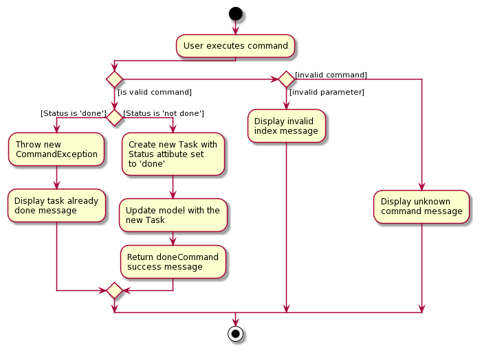
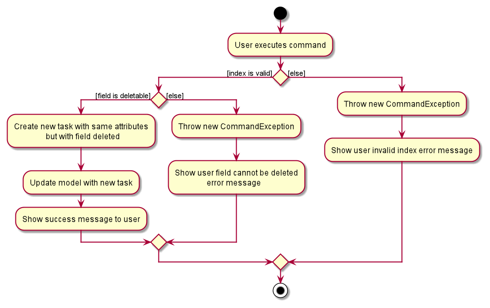
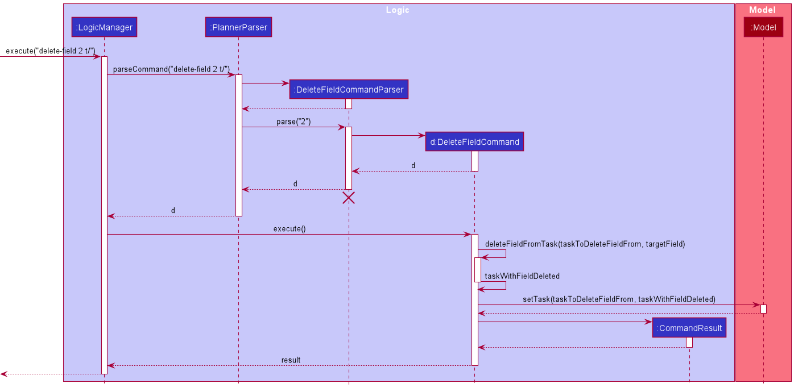
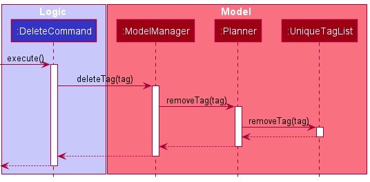

* Table of Contents
{:toc}

--------------------------------------------------------------------------------------------------------------------

## **Setting up, getting started**

Refer to the guide [_Setting up and getting started_](SettingUp.md).

--------------------------------------------------------------------------------------------------------------------

## **Design**

### Architecture


The ***Architecture Diagram*** given above explains the high-level design of the App. Given below is a quick overview of each component.

<div markdown="span" class="alert alert-primary">

:bulb: **Tip:** The `.puml` files used to create diagrams in this document can be found in the [diagrams](https://github.com/se-edu/addressbook-level3/tree/master/docs/diagrams/) folder. Refer to the [_PlantUML Tutorial_ at se-edu/guides](https://se-education.org/guides/tutorials/plantUml.html) to learn how to create and edit diagrams.

</div>

**`Main`** has two classes called [`Main`](https://github.com/se-edu/addressbook-level3/tree/master/src/main/java/seedu/address/Main.java) and [`MainApp`](https://github.com/se-edu/addressbook-level3/tree/master/src/main/java/seedu/address/MainApp.java). It is responsible for,
* At app launch: Initializes the components in the correct sequence, and connects them up with each other.
* At shut down: Shuts down the components and invokes cleanup methods where necessary.

[**`Commons`**](#common-classes) represents a collection of classes used by multiple other components.

The rest of the App consists of four components.

* [**`UI`**](#ui-component): The UI of the App.
* [**`Logic`**](#logic-component): The command executor.
* [**`Model`**](#model-component): Holds the data of the App in memory.
* [**`Storage`**](#storage-component): Reads data from, and writes data to, the hard disk.

Each of the four components,

* defines its *API* in an `interface` with the same name as the Component.
* exposes its functionality using a concrete `{Component Name}Manager` class (which implements the corresponding API `interface` mentioned in the previous point.

For example, the `Logic` component (see the class diagram given below) defines its API in the `Logic.java` interface and exposes its functionality using the `LogicManager.java` class which implements the `Logic` interface.


**How the architecture components interact with each other**

The *Sequence Diagram* below shows how the components interact with each other for the scenario where the user issues the command `delete-task 1`.


The sections below give more details of each component.

### UI component


**API** :
[`Ui.java`](https://github.com/se-edu/addressbook-level3/tree/master/src/main/java/seedu/address/ui/Ui.java)

The UI consists of a `MainWindow` that is made up of parts e.g.`CommandBox`, `ResultDisplay`, `TaskListPanel`, `StatusBarFooter` etc. All these, including the `MainWindow`, inherit from the abstract `UiPart` class.

The `UI` component uses JavaFx UI framework. The layout of these UI parts are defined in matching `.fxml` files that are in the `src/main/resources/view` folder. For example, the layout of the [`MainWindow`](https://github.com/se-edu/addressbook-level3/tree/master/src/main/java/seedu/address/ui/MainWindow.java) is specified in [`MainWindow.fxml`](https://github.com/se-edu/addressbook-level3/tree/master/src/main/resources/view/MainWindow.fxml)

The `UI` component,

* Executes user commands using the `Logic` component.
* Listens for changes to `Model` data so that the UI can be updated with the modified data.

### Logic component


**API** :
[`Logic.java`](https://github.com/se-edu/addressbook-level3/tree/master/src/main/java/seedu/address/logic/Logic.java)

1. `Logic` uses the `PlannerParser` class to parse the user command.
1. This results in a `Command` object which is executed by the `LogicManager`.
1. The command execution can affect the `Model` (e.g. adding a task).
1. The result of the command execution is encapsulated as a `CommandResult` object which is passed back to the `Ui`.
1. In addition, the `CommandResult` object can also instruct the `Ui` to perform certain actions, such as displaying help to the user.

Given below is the Sequence Diagram for interactions within the `Logic` component for the `execute("rmt 1")` API call.


<div markdown="span" class="alert alert-info">:information_source: **Note:** The lifeline for `DeleteTaskCommandParser` should end at the destroy marker (X) but due to a limitation of PlantUML, the lifeline reaches the end of diagram.
</div>

### Model component


**API** : [`Model.java`](https://github.com/se-edu/addressbook-level3/tree/master/src/main/java/seedu/address/model/Model.java)

The `Model`,

* stores a `UserPref` object that represents the user’s preferences.
* stores the planner data.
* exposes an unmodifiable `ObservableList<Task>` and `ObservableList<Tag>` that can be 'observed' e.g. the UI can be bound to these lists so that the UI automatically updates when the data in the lists change.
* exposes an unmodifiable `ObservableCalendarDate` for the calendar to observe.
* does not depend on any of the other three components.

### Storage component


**API** : [`Storage.java`](https://github.com/se-edu/addressbook-level3/tree/master/src/main/java/seedu/address/storage/Storage.java)

The `Storage` component,
* can save `UserPref` objects in json format and read it back.
* can save the planner data in json format and read it back.

### Common classes

Classes used by multiple components are in the `seedu.addressbook.commons` package.

--------------------------------------------------------------------------------------------------------------------

## **Implementation**

This section describes some noteworthy details on how certain features are implemented.

### Enforcing conditions

When executing commands, the planner has to enforce certain logical constraints to prevent unintended command behaviour.
Here is a list of constraints:
 * A task should not have a duration attribute without a date or recurring schedule attribute.
 * A task should not have an empty title.
 * A task should have a title with at most 40 characters.

Note that certain constraints may be relevant to specific commands. For instance (this list is not exhaustive):
 * Checking if the date attribute is empty for commands like `count` which counts down the days from today's date
 * The index specified by the user for commands that require a INDEX parameter,
  should be positive and within the range of the list of displayed tasks.
 
#### Design considerations
##### Bad designs not chosen:
While the task is a composition of the various attributes like: title, status, etc, there is a violation of the Single
Responsibility Principle when the Task class is checking for whether the date of a task object has passed today's date,
or checking if the change in a date is valid.

In addition, checking the constraints in each of the command's execute method (which is the case in v1.2, and some
commands in v1.3) violates the Don't Repeat Yourself principle. As shown in the list of constraints above, there are
many repeated constraints which will be checked across different commands. This also violates the Dependency Inversion
principle when the command's execute method depends on methods from lower level classes such as Date.

##### Chosen design:
Therefore, enforcing conditions has been implemented as shown in the class diagram below.


1. When a XYZCommand runs the execute method, it might call the ConditionLogic class. This acts as the main facade
class.
2. ConditionLogic will then call the relevant condition or constraint manager class.
3. The relevant classes will then create an AttributeManager object to access the functionalities provided by 
each of the attribute classes.

From point 2, the choice to split the ConditionLogic class into secondary facade classes: ConstraintManager,
IndexManager, DateVerifier, RecurringScheduleVerifier, is to ensure that single responsibility principle is upheld.

From point 3, the various secondary facade classes could directly access the attribute classes. However, that would
violate the Law of Demeter, hence the AttributeManager class provides access to the functionalities of the attributes.

The separation of attributes and conditions into their own packages increases cohesion and allows for the future
creation of commands to reuse the code when enforcing conditions.

### Mark task as done

A task has a Status attribute which can be marked as done, using the Done command.

  * The Status attribute is a data field belonging to Task, and only has 2 valid values: 'done' and 'not done'.
  * The doneCommand only takes in a single parameter, INDEX, which must be a valid positive integer.

The following activity diagram illustrates how a user might utilise this feature:



The following sequence diagram has been simplified to show the main processes called during the execution of
DoneCommand.


As seen from the sequence diagram above, the Done Command makes use of the setTask() function to update the model
since this process is equivalent to updating the status attribute from 'not done' to 'done'. This abides by the DRY
principle to avoid writing functions with similar logical processes.


### Find matching task using keyword(s)

The `find` command is applicable to **all tasks** within PlanIT. There are 3 different methods of `find` implementations:
1. Find by title : Find all matching task(s) using any matching full keyword(s) from title of task using `find [KEYWORDS]`
2. First by tag : Find all matching task(s) with exact matching full keyword(s) from tag(s) of task using `find t/[TAG]`
   Only this method can be used to search matching task(s) with full keyword(s) from multiple tags like `find t/ t/`
3. Find by description : Find all matching task(s) using any matching full keyword(s) from description of task using `find d/[DESCRIPTION]`

<div markdown="span" class="alert alert-info">:information_source: **Note:** All 3 methods cannot be mixed with each other.</div>

Below is an activity diagram of the above 3 methods which illustrates the general process applicable for the 3 different find implementation queries.


Below is also an example of the default method of find by title general process description followed by the sequence diagram illustration.

##### Find by title
1. `FindCommandParser` will parses the keywords to `TitleContainsKeywordsPredicate`.
2. `TitleContainsKeywordsPredicate` will be generated and a predicate value will be returned to `FindCommandParser`.
3. `FindCommandParser` will send the predicate value to `FindCommand`.
4. `FindCommand` will be generated and returns the command to the `FindCommandParser`.
5. `FindCommand` will call `execute(model)` function and it will pass predicate value into the `Model` through `updateFilteredTaskList`.
6. `filteredTasks` list will be updated accordingly in `ModelManager` and the filtered list display in PlanIT will be updated.
7. `CommandResult` will eventually be returned and feedback will be given to the user.

<div markdown="span" class="alert alert-info">:information_source: **Note:**For find by tag and find by description,
the steps are similar except for step 3 and 4 where it will be TagContainsKeywordsPredicate and
DescriptionContainsKeywordsPredicate 
respectively in place of TitleContainsKeywordsPredicate </div>


##### Design Considerations
For the `find` command, there are 2 design choices being considered in whether to split the 3 implementation methods
like `findTag`, `findTitle`, `findDescription`  into three different commands separately 
or just use a single command `find` in addition with command line prefix to perform 3 different implementations. 

1. **Current design**: Having a single command `find` to perform 3 different implementations.

    - Advantages:
        - From the user point of view, they do not have to remember extra commands since there are a lot of commands
          within PlanIT and it is quite intuitive to remember the command line prefix like `t/` `d/`
          since these prefix will be used for most commands in the PlanIT.
        - The problem of duplicate codes will be minimised since the general process from FindCommandParser -> 
          FindCommand to Model and CommandResult are similar for the 3 different methods. The place where they differ
          is only from FindCommandParser to TitleContainsKeyWordsPredicate, FindCommandParser 
          to DescriptionContainsKeywordsPredicate and FindCommandParser to TagContainsKeywordsPredicate respectively.
          
    - Disadvantages:
        - The code will be cluttered in a FindCommandParser for the 3 different implementation methods.


2. **Alternative design**: Having 3 different commands `findTag`, `findTitle`, `findDescription`
   to perform 3 different implementations.

    - Advantages:
        - Code will be segregated out and parser for each implementation will not be so complex.

    - Disadvantages:
        - There is a need to use 3 parser and 3 commands in code implementation which increase the likelihood of code
          duplication.
        - Since there are more commands for the user to remember, it is highly likely for the user to
          keep referring to the user guide if the user keeps forgetting the various commands.


#### 4. Sorting tasks

The `Sort` command applies to tasks in List. Both `sort by a` and the `sort by d`
follow similar implementations with slight differences. Below we will look into the implementation of 
the `sort by a`.

The `sort by a` feature sorts the tasks based on the different dates of the tasks from the earliest task
to the last task in chronological order. For tasks with no dates, they would appear last.
1. When the command is executed by the user, the input it passed into
   the `LogicManager` and gets parsed and identified in `AddressBookParser`.
2. Upon identifying the relevant `COMMAND_WORD` and by extension the `ENTITY` (through the `-` input)
   , the corresponding `SortCommandParser` object is formed. The user input then goes
   through another level of parsing in `SortCommandParser`
3. The `SortCommandParser` identifies the order in which the tasks are to be sort and creates a
   `SortComparator` comparator object accordingly.
4. The ```SortCommandParser``` creates a ```SortCommand``` with the above comparator. The command
   is returned to the ```LogicManager```.
5. The ```LogicManager``` calls ```SortCommand#execute()```, which adds a new duplicate list of tasks that is
   sorted in chronological order in ```List``` via the ```Model``` interface.
6. Finally, a ```CommandResult``` with the relevant feedback is returned to the ```LogicManager```.

##### Design Considerations
For the `SortCommand`, we had several considerations that we made on whether to sort the list manually through
the `sort` command or to automatically sort the list for every task that is added or edited.

1. Alternative 1 (current choice): User has the option to sort the list manually in both ascending and descending format.
   The list will not be automatically sorted when a task has been added or changed.

    - Pros:
        - If the user types in wrong information for a certain task, he is able to see the task at the bottom rather
          than filtering through a sorted list which makes it easier to fix the error that he has made.
        - Code will be easier to implement as we so not need to implement the auto sort phase.

    - Cons:
        - User has to manually sort the list, using the `sort` command, after keying in the new tasks to obtain an
          ordered list.

2. Alternative 2: The list will be automatically sorted every time the user makes a new list or edits one.

    - Pros:
        - Tasks will always be in chronological order and user does not have to key in any command to sort the list.

    - Cons:
        - If the user adds in a task with wrong details to a huge list, it will be difficult to find the task.
          If the previous method was used the new task added will be at the bottom of the list.
        - The code will be much more complex compared to alternative 1.
        - User will not be have the ability to sort the list in different orders.


### Removing a field from a task

A task in the planner's task list can contain multiple fields. Some of these fields can be removed without deleting
the entire task, while other fields are compulsory and cannot be removed. 
- Removable fields: `Date`, `RecurringSchedule`, `Description`, `Tags`, `Duration`
- Non-removable fields: `Title`, `Status`

An example of how a user might use this command is shown in the activity diagram below.



The following sequence diagram shows how the delete field command works internally.



Something noteworthy would be the fact that `Duration` cannot exist alone and must exist with either `Date` OR `RecurringSchedule`.
As this approach creates a new task with the same attributes and replaces it with the existing task in the planner, when a user tries
to remove the `Date`/`RecurringSchedule` field without removing the `Duration` first, an error will be thrown. 

####Aspect: How removing a task executes

####Alternatives 1 (current choice): Remove field by setting it to an empty string.  

This approach was chosen as it is easy to implement, and not too much of refactoring of code is needed.

####Alternatives 2: Remove field by setting it to null. 

This approach was not chosen as it would require more refactoring of code - if anything is missed out, 
it will result in undesirable runtime exceptions.

### Viewing list of tags in the tags panel

Each task may be associated with 0 or more tags that are stored in the `UniqueTagList`. The `UniqueTagList` ensures that
no 2 tags are duplicate in the program at 1 time, emphasizing the abstraction of tags as an Object.


The `UniqueTagList` then exposes an unmodifiable `ObservableList<Tag>` to be observed by the `UI`, much like how the
list of tasks is being observed by the `UI`. This tag list is presented visually using `TagListPanel` in `UI`. Below is
an activity diagram illustrating how a command will trigger a change in the `UniqueTagList`, in continuation from the
delete command activity diagram in the
[`Logic`](#logic-component) section:



The `UniqueTagList` class encapsulates the data and related behavior of a unique tag list, which removes the given tag
from its internal list in the diagram above. The `ModelManager` provides access to the list for the `UI` as shown
below:


As seen, there is a clear separation of responsibilities between the `UI`, `Logic` and `Model`, which complies with
the Observer pattern where the view in `UI` communicates with the `UniqueTagList` in `Model` through an
interface, subscribing to the changes in the list. Thus, coupling is reduced.
This interface is actually `<<Logic>>` and `<<Model>>`, implemented by `LogicManager` and `ModelManager`, which are
abstracted out of the diagram for more concrete representation.

### Viewing tasks on a date and changing the calendar's date

The `view` command can get and list all tasks with dates and their recurring schedule's dates on a particular date. The
next argument for the command is taken as the `DATE` and used in the predicate that filters the task list stored. The
resulting filtered task list is displayed on the `TaskListPanel` in the app. The following activity diagram illustrates
the workflow when a user uses the `view` command:


The given date argument is used in `TaskOnDatePredicate` which is an aggregation of 2 other predicates:
`TaskDateOnDatePredicate` and `TaskScheduledOnDatePredicate`. The sequence diagram below shows how the command is parsed
and executed:


Updating the filtered task list causes a change in the `ObservableTaskList` encapsulated in a `UniqueTaskList`, in turn
encapsulated within the model and planner. The `ObservableTaskList` then propagates the changes to the `TaskListPanel`
to be viewed.

#### Changing the calendar's viewing date

The date given in the view command is also used to update the calendar. This is implemented as an `Observable` object
called `ObservableCalendarDate`, stored within the model encapsulated by the planner. It is passed to the
`CalendarPanel` upon instantiation in the `MainWindow` view. The `CalendarPanel` implements an `Observer` interface,
which subscribes to the `Observable` for notifications whenever there is a change in date caused by the `view` command.


Thus, `CalendarPanel` and `ObservableCalendarDate` conforms to the observer pattern, reducing coupling.

## **Documentation, logging, testing, configuration, dev-ops**

* [Documentation guide](Documentation.md)
* [Testing guide](Testing.md)
* [Logging guide](Logging.md)
* [Configuration guide](Configuration.md)
* [DevOps guide](DevOps.md)

## **Appendix: Requirements**

### Product scope

**Target user profile**:

* Mainly NUS computing students
* Users have a need to manage a significant number of task, most of which has deadlines
* For target users, task at hand may take longer than expected
* Users might have many last minute tasks
* Users prefer desktop applications over other types of devices
* Users are able to type quickly
* Users prefer typing over mouse interactions
* User is reasonably comfortable with using Command Line Interface (CLI) applications

**Value proposition**:
* Ability to manage tasks faster than with a typical mouse/GUI driven app
* A quick way to view all tasks due on a specific day
* Organising tasks according to projects/modules/date so that users can view these tasks with different filters
* Ability to edit tasks according to user needs
* Ability to make recurring tasks that is common in students' schedules


### User stories

Priorities: High (must have) - `* * *`, Medium (nice to have) - `* *`, Low (unlikely to have) - `*`

| Priority | As a …​ | I want to …​ | So that I can…​ |
| -------- | ---------- | --------------- | ------------------ |
| `* * *`  | new user | see usage instructions | refer to instructions when I forget how to use the App  |
| `* * *`  | user | add a date to a task | know when to complete it by |
| `* * *`  | computing student | add tag(s) to a task | easily see tasks associated with a certain category |
| `* * *`  | user | mark a task as done | remove tasks from the list after completing them |
| `* * *`  | user | view when a task is due | understand how much time I have to complete it |
| `* * *`  | returning user | view all the tasks previously set | avoid resetting all the tasks |
| `* * *`  | computing student | search using keywords from the task title | find matching tasks quickly when I only can remember the title|
| `* * *`  | computing student | search using keywords from the tag(s) of task|  find matching tasks from the same category quickly when I only can remember the tag(s).|
| `* * *`  | computing student | search using keywords from the task description | find matching tasks quickly when I only can remember the description |
| `* * *`  | computing student | view all my tasks in a list | review tasks whenever I want  |
| `* * *`  | computing student | view all uncompleted tasks in a list | know what tasks are left to be done |
| `* * *`  | computing student | edit my task | make any changes to the task when required |
| `* * *`  | user | remove tasks from the list | reduce clutter or remove a mistakenly added task |
| `* * *`  | user | remove specific fields from a task in the list | manage the details in a task |
| `* * *`  | computing student | schedule recurring tasks at a specified frequency | easily set tasks for the future at one go |
| `* * *`  | user | see how many days I have left until a specific task is due/happening | know how much time I have left to work on the task |
| `* * *`  | user | see all the statistics for the tasks | track my progress |
| `* * *`  | user | view all the tasks on a specific date | schedule new tasks during the free time on that day |
| `* *`  | user | see a list of tags currently used | keep track of all my tags |

### Use cases

(For all use cases below, the **System** is the `PlanIT` and the **Actor** is the `user`, unless specified otherwise)

#### **Use case: Adding a task**

**MSS**

1. User enters command to add a task with optional fields to the list.
2. PlanIT shows the resulting list after adding task to it.

    Use case ends.

**Extensions**
* 1a. PlanIT detects a command of the wrong format.
    * 1a1. PlanIT requests for user to input command in correct format.
    * 1a2. User enters command in correct format.

    Steps 1a1-1a2 are repeated until the data entered is correct.

    Use case resumes from step 2.

#### **Use case: Viewing all possible commands**

**MSS**

1. User enters command to view all possible commands.
2. PlanIT displays all possible commands to user.

   Use case ends.

#### **Use case: Listing all tasks**

**MSS**

1. User enters command to view the list of tasks.
2. PlanIT displays the complete list of tasks.

   Use case ends.

**Extensions**
* 1a. User enters an invalid input format.
    * 1a1. PlanIt display an error message.
    
* 1b. PlanIT detects a command to view only uncompleted tasks.

    * 1b1. PlanIT displays only uncompleted tasks.

    Use case ends.

#### **Use case: Add a date to a task**

**Precondition: The task does not have a recurring schedule.**

**MSS**
1. User <u>adds a task</u> to the list.
2. PlanIt shows task added to the list and updates list.
3. User enters command to add a date to a specified task.
4. PlanIt shows task with updated date and updates list.
5. This task can be viewed in the Calendar User Interface on the day of the date.

   Use case ends.

**Extensions**
* 4a. The given index is invalid.
    * 4a1. PlanIt shows error message.

      Use case resumes at step 3.
    
#### **Use case: Add a duration to a task**

**Precondition: The task has a title and has a deadline date .**

**MSS**

1. User <u>adds a task</u> to the list.
2. PlanIt shows task added to the list and updates list.
3. User enters command to add a duration to a specified task.
4. PlanIt shows task with updated duration and updates list.
5. The duration details can be viewed in the Calendar User Interface on the day of the task.

   Use case ends.

**Extensions**
* 4a. The given timeslot on that date is already taken.
    * 4a1. PlanIt shows error message.

      Use case resumes at step 3.
    
#### **Use case: Add a recurring schedule to the task**

**Precondition: The task has a title, does not have a deadline date and only repeats in weekly or biweekly basis.**

**MSS**
1. User <u>adds a task</u> with recurring schedule consisting of end date, 
   day of week and week frequency to the list.
2. PlanIt shows task with the recurring dates based on the conditions specified by th the user.

   Use case ends.

**Extensions**
* 1a. The given input format is invalid.
    * 1a1. PlanIt display an error message.
    * 1a2. User enters the new details.
    Steps 1a1 to 1a2 are repeated until the user input is of acceptable format. Use case resumes from Step 2.

* 1b. The given input has an end date that has passed the current system date or less than a week from current system date.
    * 1b1. PlanIt display an error message.
    * 1b2. User enters the new details.
    Steps 1b1 to 1b2 are repeated until the user input end date is valid. Use case resumes from Step 2.
    
#### **Use case: Remove a task**

**MSS**
1. User <u>adds a task</u> to the list.
2. PlanIt shows task added to the list and updates list.
3. User enters command to remove a specified task.
4. PlanIt shows task that was removed and updates list.

   Use case ends.

**Extensions**
* 4a. The given index is invalid.
    * 4a1. PlanIt shows error message.

      Use case resumes at step 3.
    
    
#### **Use case: Remove a field from a task**

**MSS**
1. User <u>adds a task</u> with removable field to the list.
2. PlanIT shows task added to the list and updates list.
3. User enters command to remove the removable field from the task.
4. PlanIT shows task with field removed and updates list.

   Use case ends.

**Extensions**
* 4a. The given index is invalid.
    * 4a1. PlanIT shows error message for invalid index.
    
        Use case resumes at step 3.
    
* 4b. The given prefix is invalid. 
    * 4b1. PlanIT shows error message for invalid prefix.
    
        Use case resumes at step 3.
    
* 4c. The field in the task is already removed.
    * 4c1. PlanIT shows error message detailing field is already removed.
    
        Use case ends.
        

#### **Use case: Sort tasks according to date**

**MSS**
1. User <u>adds a task</u> with a dates to the list.
2. PlanIt shows task added to the list and updates list.
3. User enters command to sort tasks either in ascending or descending dates.

   Use case ends.

**Extensions**
* 4a. There are no dates to all tasks.
    * 4a1. PlanIt shows tasks to have no change in terms of order.

      Use case ends.

#### **Use case: Find matching tasks by title**

**MSS**
1. User <u>adds a task</u> with title to the list.
2. PlanIt shows task added to the list and updates list.
3. User enters command to find tasks with given keywords from the task title.
4. PlanIt shows all tasks that matches any full word from the title.

   Use case ends.

**Extensions**
* 3a. The given input format is invalid.
    * 3a1. PlanIt display an error message.
    * 3a2. User enters the new details.
    Steps 3a1 to 3a2 are repeated until the user input is of acceptable format. Use case resumes from Step 4.
      
* 4a. There are no matching tasks.
    * 4a1. PlanIt shows no matching tasks.

      Use case ends.

#### **Use case: Find matching tasks by tag(s)**

**MSS**
1. User <u>adds a task</u> with tag(s) to the list.
2. PlanIt shows task added to the list and updates list.
3. User enters command to find tasks with given keyword(s) from the task tag(s).
4. PlanIt shows all tasks that matches the full keyword of the tag.

   Use case ends.

**Extensions**
* 3a. The given input format is invalid.
    * 3a1. PlanIt display an error message.
    * 3a2. User enters the new details.
    Steps 3a1 to 3a2 are repeated until the user input is of acceptable format. Use case resumes from Step 4.
      
* 4a. There are no matching tasks.
    * 4a1. PlanIt shows no matching tasks.

      Use case ends.

#### **Use case: Find matching tasks by multi-line description**

**MSS**
1. User <u>adds a task</u> with multi-line description to the list.
2. PlanIt shows task added to the list and updates list.
3. User enters command to find tasks with given keyword(s) from the task description.
4. PlanIt shows all tasks that matches any full keyword from the description.

   Use case ends.

**Extensions**
* 3a. The given input format is invalid.
    * 3a1. PlanIt display an error message.
    * 3a2. User enters the new details. 
    Steps 3a1 to 3a2 are repeated until the user input is of acceptable format. Use case resumes from Step 4.
      
* 4a. There are no matching tasks.
    * 4a1. PlanIt shows no matching tasks.

      Use case ends.

#### **Use case: Mark task as done**

**MSS**
1. User <u>adds a task</u> to the list.
2. PlanIt shows task added to the list and updates list.
3. User enters command to mark a task as done.
4. PlanIt updates Task in the model with Status updated to 'done'.
5. PlanIt displays doneCommand success message.

   Use case ends.

**Extensions**
* 3a. The task selected already has a Status: 'done'
    * 4a1. PlanIt displays task already done message.

      Use case ends.

#### **Use case: Counting down to a task's date**

**MSS**
1. User <u>adds a task</u> with a date to the list. 
2. PlanIT shows task added to the list and updates list.
3. User enters command to display number of days left to task's date.
4. PlanIT displays number of days left to task's date.

   Use case ends.

**Extensions** 
* 3a. The task selected does not have a date.
    * 3a1. PlanIT shows error message detailing that task does not have a date. 
    * 3a2. User adds a date to the task. 
      
        Use case resumes from step 3.

* 3b. The task's date is already over. 
    * 3b1. PlanIT shows error message detailing that task's date is already over.
    
        Use case ends.
    
#### **Use case: Displaying statistics of PlanIT**

Preconditions: There is at least one task in PlanIT.

**MSS**
1. User enters command to display statistics of PlanIT.
2. PlanIT displays its statistics.

   Use case ends.

#### **Use case: View tasks on a date**

**MSS**
1. User enters command to view the tasks on a given date.
2. PlanIt shows all the tasks that have their dates on the given date, if any.
3. PlanIt changes the calendar's date to the given date.
4. PlanIt displays a success message.

   Use case ends.

**Extensions**
* 1a. PlanIt detects an error in the entered command.
    * 1a1. PlanIt requests for the correct command.
    * 1a2. User enters new data. 
      
        Steps 1a1-1a2 are repeated until the data entered are correct.
      
        Use case resumes from step 2.


### Non-Functional Requirements

Non-functional requirements specify the constraints under which the system for PlanIT is developed and operated.

#### Technical requirements:
* The system should be compatible on mainstream OS, with only version Java 11
(no other version) installed.
* The system should work on both 32-bit and 64-bit environments.

#### Performance requirements:
* The system should be loaded up within 2 seconds or less.
* The User Interface should be responsive to user input and loaded up within 2 seconds.
* The system should be able to handle 1,000 or more task data entries without noticeable sluggishness
in performance for typical usage.

#### Usability requirements:
* The user should have a keyboard and well-verse in typing alphanumeric keys on the keyboard.

#### Testability requirements:
* The system is not dependent on any remote servers so that it can be tested by anyone at any time without restrictions.

#### Scalability requirements:
* The program is easily extendable for addition of features.

#### Data requirements:
* The system file size should not exceed 100 MB.
* The system should save data entered by the user in a human editable file without any use
of external database management system.

#### Project scope:
* The features within the system is only catered to a single user.
* The system is catered to user who can type fast and prefer typing over any other means.


### Glossary

* **Mainstream OS**: Windows, Linux, Unix, OS-X
* **Recurring Schedule**: A type of task that repeats itself within the same period, can be weekly or biweekly

--------------------------------------------------------------------------------------------------------------------

## **Appendix: Instructions for manual testing**

Given below are instructions to test the app manually.

<div markdown="span" class="alert alert-info">:information_source: **Note:** These instructions only provide a starting point for testers to work on;
testers are expected to do more *exploratory* testing.

</div>

### Launch and shutdown

1. Initial launch

   1. Download the jar file and copy into an empty folder

   1. Double-click the jar file Expected: Shows the GUI with a set of sample tasks. The window size may not be optimum.

1. Saving window preferences

   1. Resize the window to an optimum size. Move the window to a different location. Close the window.

   1. Re-launch the app by double-clicking the jar file.<br>
       Expected: The most recent window size and location is retained.
      
### Making a task
1. Making a task with a title
    1. Test case: `mk`<br>
    Expected: Command format error will be shown.
       
    1. Test case: `mk aaa`<br>
    Expected: Command format error will be shown.
       
    1. Test case: `mk n/`<br>
    Expected: Title format error will be shown.
       
    1. Test case: `mk n/valid task`<br>
    Expected: Task successfully created and added to the list.
       
### Adding a recurring schedule 
1.  Adding a recurring schedule to a new task in PlanIT's task list
    1. Prerequisites: The task has a title.
    
    1. Test case: `mk n/CS2103 r/30/05/2021monweekly`<br>
    Expected: No task with recurring schedule will be added. 
    An error message stating invalid input format of recurring schedule will be shown in the result display.
    
    1. Test case: `mk n/CS2103 r/[30/05/2021][monday][weekly]`<br>
    Expected: No task with recurring schedule will be added.
    An error message stating invalid input format of recurring schedule will be shown in the result display.
       
    1. Test case: `mk n/CS2103 r/[30/05/2021][mon][fortnight]`<br>
    Expected: No task with recurring schedule will be added.
    An error message stating invalid input format of recurring schedule will be shown in the result display.

    1. Test case: `mk n/CS2103 r/[31/06/2021][mon][weekly]`<br>
    Expected: No task with recurring schedule will be added.
    An error message stating invalid date input of recurring schedule will be shown in the result display
    since there are no 31 days in the month of June.
       
    1. Test case: `mk n/CS2103 r/[30/06/2020][mon][weekly]`<br>
    Expected: No task with recurring schedule will be added.
    An error message stating invalid end date input of recurring schedule will be shown in the result display 
    since it should be ahead of current system date.
       
    1. Test case: `mk n/CS2103 r/   [30/05/2021] [mon]  [weekly]`<br>
    Expected: No task with recurring schedule will be added.
    An error message stating invalid input format of recurring schedule will be shown in the result display.
       
    1. Test case: `mk n/CS2103 r/[30/06/2021][mon][weekly]`<br>
    Expected: The task with recurring schedule will be added and recurring dates
    up till `30/06/2020` every `mon` `weekly` will be generated in the result display section of PlanIT. 
    Note that if the day of user input also falls on Monday, it will be excluded and it will only start on the next
    upcoming Monday. Only the upcoming 3 recurring dates for the task will be shown in the task display section.

### Listing tasks in PlanIT
1. Using ls command to list all tasks or uncompleted tasks within PlanIT
       
    1. Test case: `ls`<br>
    Expected: Listed all tasks within PlanIT.

    1. Test case: `ls not done`<br>
    Expected: Listed all uncompleted tasks within PlanIT.

### Searching a task by title
1. Using find command to find matching tasks by title and returns a filtered list with the matching tasks 
   in the task display section.
       
    1. Test case: `find`<br>
    Expected: No filtered list will be returned.
    An error message stating invalid input format of find command will be shown in the result display.

   1. Test case: `find n/CS2103 d/hello`<br>
   Expected: No filtered list will be returned.
   An error message stating multiple prefixes detected in find command will be shown in the result display.
      
   1. Test case: `find n/CS2103`<br>
   Expected: A filtered list will be returned if there exists tasks within PlanIT
   that has keyword `CS2103` in the title.
    
### Searching a task by tag
1.  Using find command to find matching tasks by tag(s) and returns a filtered list with the matching tasks
    in the task display section.

    1. Test case: `find`<br>
       Expected: No filtered list will be returned.
       An error message stating invalid input format of find command will be shown in the result display.

    1. Test case: `find t/CS2103 d/hello`<br>
       Expected: No filtered list will be returned.
       An error message stating multiple prefixes will be shown in the result display 
       and it is not allowed to mix description prefix in search task by tag query.

    1. Test case: `find t/    Project`<br>
       Expected: No filtered list will be returned.
       An error message stating no whitespaces allowed right after the `t/` tag prefix in search task by tag query.
    
    1. Test case: `find t/Project`<br>
       Expected: A filtered list will be returned if there exists tasks within PlanIT
       that has the full tag keyword `Project` (case-insensitive).
       
    1. Test case: `find t/Project t/CS2105`<br>
       Expected: A filtered list will be returned if there exists tasks within PlanIT
       that has the 2 different tags with full case-insensitive keywords `Project` and `CS2105`.

    1. Test case: `find t/Project CS2105`<br>
       Expected: Similar to the fourth test case, a filtered list will be returned if there exists tasks within PlanIT
       that has the 2 different tags with full case-insensitive keywords `Project` and `CS2105`.

### Searching a task by description
1.  Using find command to find matching tasks by description and returns a filtered list with the matching tasks
    in the task display section.

    1. Test case: `find`<br>
       Expected: No filtered list will be returned.
       An error message stating invalid input format of find command will be shown in the result display.

    1. Test case: `find d/hello t/CS2103`<br>
       Expected: No filtered list will be returned.
       An error message stating multiple prefixes will be shown in the result display
       and it is not allowed to mix tag prefix in search task by description query.

    1. Test case: `find d/Project d/CS2105`<br>
       Expected: No filtered list will be returned.
       An error message stating multiple prefixes will be shown in the result display
       and it is not allowed to have more than one `d/` description prefix in search task by description query.

    1. Test case: `find d/    hello`<br>
       Expected: No filtered list will be returned.
       An error message stating no whitespaces allowed right after the `d/` description 
       prefix in search task by description query.

    1. Test case: `find d/hello`<br>
       Expected: A filtered list will be returned if there exists tasks within PlanIT
       that has the full description keyword `hello` (case-insensitive).

### Removing a task

1. Removing a task while all tasks are being shown

   1. Prerequisites: List all existing tasks using the `ls` command. Multiple tasks in the list.

   1. Test case: `rmt 1`<br>
      Expected: First task is deleted from the list. Details of the removed task shown in the status message.

   1. Test case: `rmt 0`<br>
      Expected: No task is removed. Error details shown in the status message. Status bar remains the same.

   1. Other incorrect remove commands to try: `rmt`, `rmt x`, `...` (where x is larger than the list size)<br>
      Expected: Similar to previous.

### Viewing a date

1. Viewing tasks that have dates or recurring schedule on the given date
    1. Test case: `view 12/12/2021`
    Expected: If there are tasks that have their dates or recurring schedule on 12/12/2021, they will appear on the filtered list.
       
    1. Test case: `view 0/0/0`
    Expected: Date format error thrown.
       
    1. Test case: `view a`
    Expected: View command format error thrown.
       
### Navigating the calendar

1. Using `next`
    1. Test case: `next aaa`
    Expected: Calendar displays the next relative month.

1. Using `prev`
    1. Test case: `prev 111`
       Expected: Calendar displays the previous relative month.
       
1. Using the next and prev buttons
    1. Test case: Calendar displays the next or previous month accordingly.
    
### Saving data

1. Dealing with missing/corrupted data files

   1. Test case: Delete the data file which is saved at the same folder as the jar file.<br>
      Expected: PlanIt launches with sample data loaded, and creates a new data file.
      
   1. Test case: Remove an attribute of a task, or fill in an attribute with the wrong format.<br>
      Expected: PlanIt launches with an empty list.

