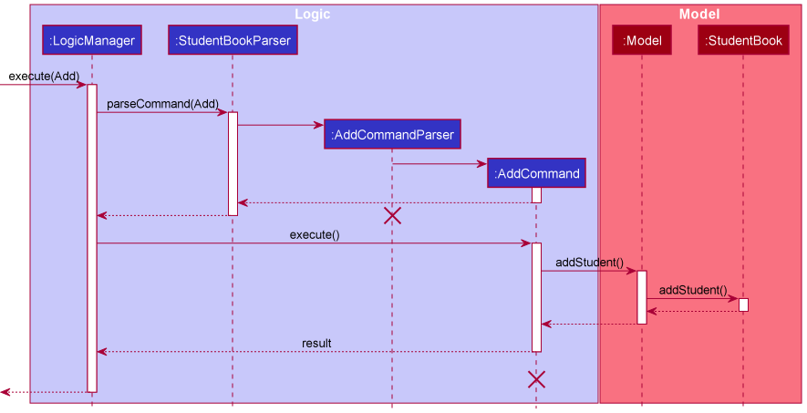
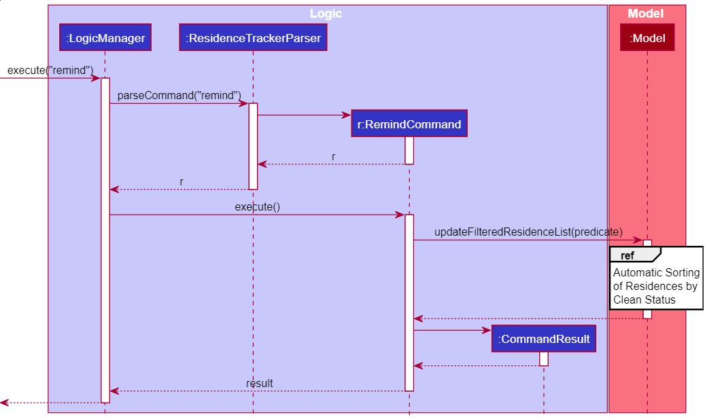

* Table of Contents
{:toc}

--------------------------------------------------------------------------------------------------------------------

## **1. Setting up, getting started**

First, you will need to set up the project file in your local computer. 
Please refer to the guide [_Setting up and getting started_](SettingUp.md) to set up the project properly.

--------------------------------------------------------------------------------------------------------------------

## **2. Introduction**

Welcome to our Developer Guide! CakeCollate promises to be an efficient desktop application that allows you to easily consolidate and manage your orders. Our main features include: 
1. Order management
2. Order Item management
3. Quick search function for your orders
4. Reminder for undelivered orders that have delivery dates approaching the current date
5. Checking the delivery status of your orders

It is optimized for use via a Command Line Interface (CLI) while still having the benefits of a Graphical User Interface (GUI). If you're a small-time cake seller that can type fast, CakeCollate can get your order management tasks done faster than traditional GUI applications.

--------------------------------------------------------------------------------------------------------------------

## **3. Design**

### Architecture

The ***Architecture Diagram*** given above explains the high-level design of the App. Given below is a quick overview of each component.

:bulb: **Tip:** The `.puml` files used to create diagrams in this document can be found in the [diagrams](https://github.com/AY2021S2-CS2103T-T11-4/tp/tree/master/docs/diagrams) folder. Refer to the [_PlantUML Tutorial_ at se-edu/guides](https://se-education.org/guides/tutorials/plantUml.html) to learn how to create and edit diagrams.

**`Main`** has two classes called [`Main`](https://github.com/se-edu/addressbook-level3/tree/master/src/main/java/seedu/address/Main.java) and [`MainApp`](https://github.com/se-edu/addressbook-level3/tree/master/src/main/java/seedu/address/MainApp.java). It is responsible for,
* At app launch: Initializes the components in the correct sequence, and connects them up with each other.
* At shut down: Shuts down the components and invokes cleanup methods where necessary.

[**`Commons`**](#common-classes) represents a collection of classes used by multiple other components.

The rest of the App consists of four components.

* [**`UI`**](#ui-component): The UI of the App.
* [**`Logic`**](#logic-component): The command executor.
* [**`Model`**](#model-component): Holds the data of the App in memory.
* [**`Storage`**](#storage-component): Reads data from, and writes data to, the hard disk.

Each of the four components,

* defines its *API* in an `interface` with the same name as the Component.
* exposes its functionality using a concrete `{Component Name}Manager` class (which implements the corresponding API `interface` mentioned in the previous point.

For example, the `Logic` component (see the class diagram given below) defines its API in the `Logic.java` interface and exposes its functionality using the `LogicManager.java` class which implements the `Logic` interface.

**How the architecture components interact with each other**

The *Sequence Diagram* below shows how the components interact with each other for the scenario where the user issues the command `delete 1`.

The sections below give more details of each component.

### UI component

**API** :
[`Ui.java`](https://github.com/se-edu/addressbook-level3/tree/master/src/main/java/seedu/address/ui/Ui.java)

The UI consists of a `MainWindow` that is made up of parts e.g.`CommandBox`, `ResultDisplay`, `OrderListPanel`, `OrderItemListPanel`, `HelpListPanel`, `StatusBarFooter` etc.

All these, including the `MainWindow`, inherit from the abstract `UiPart` class.

The `UI` component uses the JavaFx UI framework. The layout of these UI parts are defined in matching `.fxml` files that are in the `src/main/resources/view` folder. For example, the layout of the [`MainWindow`](https://github.com/se-edu/addressbook-level3/tree/master/src/main/java/seedu/address/ui/MainWindow.java) is specified in [`MainWindow.fxml`](https://github.com/se-edu/addressbook-level3/tree/master/src/main/resources/view/MainWindow.fxml)

The `UI` component,

* Executes user commands using the `Logic` component.
* Listens for changes to `Model` data so that the UI can be updated with the modified data.

### Logic component

**API** :
[`Logic.java`](https://github.com/se-edu/addressbook-level3/tree/master/src/main/java/seedu/address/logic/Logic.java)

1. `Logic` uses the `CakeCollateParser` class to parse the user command.
1. This results in a `Command` object which is executed by the `LogicManager`.
1. The command execution can affect the `Model` (e.g. adding a order).
1. The result of the command execution is encapsulated as a `CommandResult` object which is passed back to the `Ui`.
1. In addition, the `CommandResult` object can also instruct the `Ui` to perform certain actions, such as displaying help to the user.

Given below is the Sequence Diagram for interactions within the `Logic` component for the `execute("delete 1")` API call.

:information_source: **Note:** The lifeline for `DeleteCommandParser` should end at the destroy marker (X) but due to a limitation of PlantUML, the lifeline reaches the end of diagram.

### Model component

**API** : [`Model.java`](https://github.com/se-edu/addressbook-level3/tree/master/src/main/java/seedu/address/model/Model.java)

The `Model`:

* stores a `UserPref` object that represents the user’s preferences.
* stores CakeCollate's data.
* stores the order item data.
* exposes an unmodifiable `ObservableList<Order>` and `ObservableList<OrderItem>`that can be 'observed' e.g. the UI can be bound to this list so that the UI automatically updates when the data in the list changes.
* does not depend on any of the other three components.

:information_source: **Note:** An alternative (arguably, a more OOP) model is given below. It has a `Tag` list in the `CakeCollate`, which `Order` references. This allows `CakeCollate` to only require one `Tag` object per unique `Tag`, instead of each `Order` needing their own `Tag` object. 

### Storage component

**API** : [`Storage.java`](https://github.com/se-edu/addressbook-level3/tree/master/src/main/java/seedu/address/storage/Storage.java)

The `Storage` component,
* `UserPrefsStorage` can save `UserPref` objects in JSON format and read it back.
* `CakeCollateStorage` can save CakeCollate's data in JSON format and read it back.
* `OrderItemsStorage` can save order items data in JSON format and read it back.

### Common classes

Classes used by multiple components are in the `seedu.cakecollate.commons` package.

--------------------------------------------------------------------------------------------------------------------

## **4. Implementation**

This section describes some noteworthy details on how certain features are implemented.

### Add Command Feature

A key functionality of CakeCollate is the ability to add cake order items into an order. The add command accepts the parameter `o/ORDER_DESCRIPTION` to allow for this. To better accommodate our users, we decided to have a table of order items, and if users wanted to add an item from that table to their order, they could do so by specifying the corresponding indexes using the `oi/` prefix.

However, since the user inputs specified by both the `o/` and `oi/` prefixes were referring to similar data items stored in the `Order` object of the model class, it seemed best to store only one of them to avoid duplication, and the other input had to be mapped. We chose to still contain an `OrderDescription` object in the `Order` class, and decided to map the indexes using the entries from the order items model so that the `Order` object is complete and does not rely on indexes or the model. 

Prior to this feature, there were three relevant implementation details
* the `AddCommand` was initialised using an `Order` object created by the `AddCommandParser`
* the `AddCommand::execute` method took in a model, 
* and the `AddCommandParser::parse` method did not take in a model.

Given this, there were two main options to implement the mapping:

1. Refactor `AddCommandParser::parse` to have access to the Model. 

    * Pros: This meant that the mapping would be done within the parser, which fitted the responsibility of the parser, and the order object for initialising the `AddCommand` can be created in the parser itself.
    * Cons: This seemed like extra coupling between the Parser methods and classes, and the Model class, as the method `CakeCollateParser::parseCommand` which is the caller of `AddCommandParser::parse` will need to have access to the model too.

2. Allow the mapping to take place in the `AddCommand::execute` method, since that method takes in a model as a parameter. 

    * Pros: Keep the existing level of coupling between model and parser classes (i.e. none). 
    * Cons: This meant that the order object cannot be initialised in the `AddCommandParser::parse` method as the `OrderDescriptions` in the `Order` would have been incomplete if the mapping from `indexes` to `OrderDescriptions` was not done yet.

In light of the additional coupling, the second option was chosen. An `AddCommandDescriptor` nested class was created in the `AddCommand` class, similar to the `EditCommand`, so that indexes and order descriptions that were inputted can be stored, and once the mappings were done in the `AddCommand::execute` method, the entire `Order` object could be built before being added to the model.

Hence, based on this implementation, here is the sequence diagram containing the steps that occur when a user inputs an `Order` containing an `o/` and `oi/` field.

**Sequence diagram depicting the `AddCommandParser::parse` method:**

**Sequence diagram depicting the `AddCommand::execute` method:**

### Find feature

The intended usage of the Find feature is for users to locate their orders in CakeCollate quickly and efficiently.
In order to do this, this feature is implemented in a way that allows user to specify the fields of the orders and the keywords that they want to search with. 

The find mechanism is facilitated by `ContainsKeywordsPredicate` which implements Java's `Predicate` interface.
The conditions on which orders to find is then captured in this `Predicate`.
The orders in CakeCollate are extracted and stored in a JavaFX `FilteredList`.
It is then updated through the usage of `FilteredList#setPredicate(Predicate)` while passing `ContainsKeywordsPredicate` into the method.
This updated `FilteredList` is then displayed, showing the results of the find command.

This operation is exposed in the `Model` interface as `Model#updateFilteredOrderList`.

The find feature generally does a generic 'OR' search. When multiple keywords are specified, orders that contains any of these keywords will be displayed.
However, to enable a more specific search, users can specify multiple prefixes such as `n/` and `o/` and their respective keywords. This will trigger an 'AND' search.

If users want to find all order with name `Alex` OR order description `Chocolate`, they can use the command: `find Alex Chocolate`.
If users want to find an order with name `Alex` AND order description `Chocolate`, they can use the command: `find n/Alex o/Chocolate`.

Given below is an example usage scenario and how the find mechanism behaves at each step.

*Step 1.* The user keys in and execute the command `find n/Alex` to find orders with name `Alex`.

*Step 2.* The command is parsed by `FindCommandParser`. The prefixes and their respective keywords are extracted and saved in an `ArgumentMultimap`. Refer to the [Logic Component](#logic-component) for more details.

*Step 3.* The inputs are then checked for their validity. If no exceptions are detected, a `ContainsKeywordPredicate` and a `FindCommand` will be created.

*Step 4.* The `FindCommand#execute` is called which updates the `FilteredList` that is currently being displayed.

The following sequence diagram shows how this works:

:information_source: **Note:** The CakeCollateParser creates FindCommandParser and calls parse("n/Alex") while the LogicManager calls execute(). You can refer to the [Logic Component](#logic-component) for more details.

:information_source: **Note:** The lifelines should end at the destroy marker (X) but due to a limitation of PlantUML, the lifelines reach the end of diagram.

#### Design considerations:

##### Aspect: How to create the `Predicate` to call `Model#updateFilteredOrderList` with.

As CakeCollate is adapted from the AddressBook-Level3 project, the original find feature creates a `NameContainsKeywordsPredicate` and allow for finding keywords in the name field only.

* **Alternative 1 (current choice):** Create a general `ContainsKeywordsPredicate` that tracks each field in an `Order` and their respective keywords. This is done by creating a `HashMap` and mapping each `Prefix` to a list of keywords inputted.
    * Pros:
      * Does not increase coupling as much as alternative 2.
      * Easy to implement both `OR` and `AND` searches.
    * Cons:
      * Many if-else statements to check which fields the user specified.
      * Require a way to map each field to the keywords inputted.

* **Alternative 2:** Create a `[Field]ContainsKeywordsPredicate` for each field in an `Order`.
    * Pros:
      * `Tag`, `OrderDescription` and `DeliveryDate` require more complex method of extracting the `TestString`(the `String` to test the keywords against). This alternative will allow for inheritance to take place and enabling reusability of code.
      * Easy to implement.
    * Cons:
      * Creating many classes causes increased coupling.
      * Hard to implement `OR` searches.

### Remind feature

The intended usage of the Remind feature is for users to locate impending undelivered orders within a certain time frame which the user can specify. 
The user specifies the number of days from the current date for all undelivered orders they want to locate.  

The remind mechanism is facilitated by `ReminderDatePredicate` which implements Java's `Predicate` interface.
The conditions (date period) on which undelivered orders to locate is then captured in this `Predicate`.
The orders in CakeCollate are extracted and stored in a JavaFX `FilteredList`.
It is then updated through the usage of `FilteredList#setPredicate(Predicate)` while passing `ReminderDatePredicate` into the method.
This updated `FilteredList` is then displayed, showing the results of the remind command.

This operation is exposed in the `Model` interface as `Model#updateFilteredOrderList`.

If users want to locate all undelivered orders for today, they can use the command `remind 0`.
If users want to locate all undelivered orders for 1 week, assuming today's date is 11 April 2021, they can use the command `remind 7`. The remind command
returns all undelivered orders within the time frame of 11 April 2021 - 18 April 2021.

Given below is an example usage scenario and how the find mechanism behaves at each step.

*Step 1.* The user keys in and execute the command `remind 7` to locates all undelivered orders within 1 week from today.

*Step 2.* The command is parsed by `RemindCommandParser`. The prefixes and their respective keywords are extracted and saved in an `ArgumentMultimap`. Refer to the [Logic Component](#logic-component) for more details.

*Step 3.* The inputs are then checked for their validity. If no exceptions are detected, a `ReminderDatePredicate` and a `RemindCommand` will be created.

*Step 4.* The `RemindCommand#execute` is called which updates the `FilteredList` that is currently being displayed.

The following sequence diagram shows how this works:

:information_source: **Note:** The CakeCollateParser creates RemindCommandParser and calls parse("7") while the LogicManager calls execute(). You can refer to the [Logic Component](#logic-component) for more details.

:information_source: **Note:** The lifelines should end at the destroy marker (X) but due to a limitation of PlantUML, the lifelines reach the end of diagram.

#### Design considerations:

##### Aspect: How to allow users to receive reminders

* **Alternative 1 (current choice):** Create a `remind` command that allows users to specify the time frame to
for the result of undelivered orders.
    * Pros:
      * Gives users flexibility in specifying the time frame they want to receive reminders for
      * Easy to implement, and to use.
    * Cons:
      * User has to remember to use the remind function in order to receive reminders.

* **Alternative 2:** Automated reminders for impending undelivered orders within a 
time frame of 1 week that pops out whenever the user opens the application.
    * Pros:
      * User does not have to remember to use the remind function since it is automated.
    * Cons:
      * User has no flexibility to specify the time range he/she wants to receive reminders for.
      * If user want to check for reminders again he has to reopen the application.
    

### Add Order Item Feature
The `addItem` command enables users to predefine order items (also known as cake items or order descriptions). The user can choose to add order items directly from this table when adding orders to CakeCollate.

An `OrderItem` consists of a `Type` field which refers to the description of the order item. In the user guide the `Type` field is referred to as `ORDER_DESCRIPTION` in order to make it more user friendly since `Type` is not very descriptive.

All order items input by the user are added to the `UniqueOrderItemList` and displayed on the right side of the Ui.

The underlying functionality for the `addItem` command utilises the `AddOrderItemCommand::execute` method which checks for duplicates of that particular `OrderItem` in the `UniqueOrderItemList` using the `Model::hasOrderItem` method. The `OrderItem` input by the user is added to the `UniqueOrderItemList` using the `Model::addOrderItem` method if no duplicates are found.  

If the user wants to add an order item "Chocolate Cake" they can use the command `addItem Chocolate Cake`.

Given below is an example usage scenario and how the `addItem` mechanism works.

*Step 1.* The user keys in and executes the command `addItem Chocolate Cake` to add an order item with a `Type` field of "Chocolate Cake".

*Step 2.* The command is parsed by `AddOrderItemCommandParser`.

*Step 3.* The inputs are then checked for their validity. If no exceptions are detected, an `AddOrderItemCommand` will be created.

*Step 4.* `AddOrderItemCommand#execute` is called which updates the `UniqueOrderItemList` that is currently being displayed.

The following sequence diagram shows how this works:

:information_source: **Note:** The CakeCollateParser creates AddOrderItemCommandParser and calls parse("Chocolate Cake") while the LogicManager calls execute(). You can refer to the [Logic Component](#logic-component) for more details.

:information_source: **Note:** The lifeline for `AddOrderItemCommandParser` should end at the destroy marker (X) but due to a limitation of PlantUML, the lifeline reaches the end of diagram.

#### Design considerations: 

##### Aspect: Checking for duplicates when adding `OrderItem` to `UniqueOrderItemList`
* **Alternative 1 (current choice):** `Type::equals` method ignores case (returns `True` if the type is the same even if the case is different). 
   * Pros:
     * Prevents user from accidentally adding a duplicate `OrderItem` with the same value for `Type` but different case. 
   * Cons: 
     * Provides lesser flexibility to user who might want to add in the same order item with different case.

* **Alternative 2:** `Type::equals` method considers case (returns `False` if case is different).
    * Pros:
      * Provides more flexibility to user who might want to add in the same order item with different case.
    * Cons:
      * User might accidentally add a duplicate `OrderItem` with the same value for `Type` but different case.

### Delete Order Item Feature
The `deleteItem` command enables users to delete predefined order items (also known as cake items or order descriptions). The user can choose to delete a single order item or multiple order items at the same time.

The `deleteItem` command utilises the `IndexList` class to enable the deletion of multiple items at once. The `IndexList` parser takes in a string of multiple indexes separated by spaces, parses them to `Index` and stores them in an `ArrayList<Index>`.

The underlying functionality for the `deleteItem` command utilises the `DeleteOrderItemCommand::execute` method which sorts the provided `Index List` in descending order. All the order items pertaining to the indexes input by the user are removed from the `UniqueOrderItemList` using the `Model::deleteOrderItem` method.

If the user wants to delete order items at index `1` and `2` in the order items table, they can use the command `deleteItem 1 2`.

Given below is an example usage scenario and how the `deleteItem` mechanism works.

*Step 1.* The user keys in and executes the command `deleteItem 1 2` to delete the order items located at index 1 and 2 in the order items table.

*Step 2.* The command is parsed by `DeleteOrderItemCommandParser`.

*Step 3.* The inputs are then checked for their validity. If no exceptions are detected, a `DeleteOrderItemCommand` will be created.

*Step 4.* `DeleteOrderItemCommand#execute` is called which updates the `UniqueOrderItemList` that is currently being displayed.

The following sequence diagram shows how the `DeleteOrderItemCommandParser` works:

:information_source: **Note:** The CakeCollateParser creates DeleteOrderItemCommandParser and calls parse("1 2"). 

:information_source: **Note:** The lifeline for `DeleteOrderItemCommandParser` should end at the destroy marker (X) but due to a limitation of PlantUML, the lifeline reaches the end of diagram.

The following sequence diagram shows how the `DeleteOrderItemCommand` works:

:information_source: **Note:** The LogicManager calls execute(). You can refer to the [Logic Component](#logic-component) for more details.

#### Design considerations:

##### Aspect: Parsing multiple indexes
* **Alternative 1 (current choice):** Create an IndexList class which can be used to store and parse multiple Indexes.
    * Pros:
        * Other commands which accept multiple indexes can also use methods from the IndexList class.
    * Cons:
        * Different commands have different requirements for index lists. For e.g. `DeleteOrderItemCommand` and `DeleteCommand` require that there should be no duplicate `Indexes` in the `IndexList` after parsing. However, the `AddOrderCommand` requires duplicate `Indexes` to also be stored. Each command has to implement additional checks when using `IndexList` due to differing requirements.
* **Alternative 2:** Simply use an `ArrayList` of `Index` without creating a new class.
    * Pros:
        * Each command can have its own implementation of `ArrayList` which suits its needs.
    * Cons:
        * Not extensible to other commands as they will have to implement their own `List` if they want to accept multiple indexes.

--------------------------------------------------------------------------------------------------------------------

## **4. Documentation, logging, testing, configuration, dev-ops**

* [Documentation guide](Documentation.md)
* [Testing guide](Testing.md)
* [Logging guide](Logging.md)
* [Configuration guide](Configuration.md)
* [DevOps guide](DevOps.md)

--------------------------------------------------------------------------------------------------------------------

## **5. Appendix: Requirements**

### Product scope

**Target user profile**:

* small-time, home-based cake seller
* has a lot of orders to keep track of
* sells cakes on multiple platforms and wants to collect all orders in one place
* prefers desktop apps over other types
* can type fast
* prefers typing to mouse interactions
* is reasonably comfortable using CLI apps

**Value proposition**: keep track of and manage all orders placed on various online selling platforms in one place

### User stories

Priorities: High (must have) - `***`, Medium (nice to have) - `**`, Low (unlikely to have) - `*`

| Priority| As a …​                                   | I can …​                                                        | So that …​                                                                                |
|---------|----------------------------------------------|--------------------------------------------------------------------|----------------------------------------------------------------------------------------------|
| `***`   | User                                         | view all the possible commands that I can execute                  | I know what functionalities I can make use of when using the program                         |
| `***`   | User                                         | add orders                                                         | I can add new orders to my database                                                          |
| `***`   | User                                         | delete orders                                                      | I can remove unnecessary orders from my database                                             |
| `***`   | User                                         | list all the orders I have entered in the app                      | I can view what orders I have to fulfil or have fulfilled                                         |
| `***`   | User                                         | list all my orders for the day                                     | I can view what orders I have to fulfil for the day                                          |
| `***`   | User                                         | retrieve data stored in the previous sessions                      | -                                                                                            |
| `***`   | User logging in after a long time            | delete all orders, reset the application                           | I can start on a clean slate since the previous orders are now meaningless to me             |
| `***`   | User                                         | load the app quickly                                               | I can access the data quickly                                                                |
| `**`    | Advanced user                                | use shortcuts and short forms                                      | I can reduce the time it takes to enter orders                                               |
| `**`    | User                                         | receive reminders for the orders due soon                          | I remember and complete them on time                                                         |
| `**`    | User who is at least slightly experienced    | delete multiple orders at one go                                   | I can reflect mass cancellations in my database if they occur                                |
| `**`    | User                                         | sort the orders according to which one needs to be completed first | I can prioritise the orders to work on for that day                                          |
| `**`    | User                                         | edit individual orders                                             | I can update orders if a customer changes it instead of deleting and adding another order    |
| `**`    | User                                         | add notes and special requests for orders                          | details on customized orders can be mentioned together with the main order                   |
| `**`    | Regular user                                 | be warned of duplicate orders I might have accidentally entered    | I can avoid making more than necessary, which may waste time and resources                   |
| `**`    | User                                         | add different statuses to my orders                                | I can keep track of whether my order is delivered, not delivered yet or cancelled.           |
| `**`    | User                                         | find the orders made by a certain customer                         | I can retrieve information about the orders that this customer have made before, if needed   |
| `**`    | User                                         | input multiple order descriptions at one go                        | I don't need to input multiple entries for customers who order more than one type of cake    |
| `*`     | User                                         | set prices and costs of orders                                     | I can note how much profit I am earning                                                      |
| `*`     | User                                         | save a particular customer's information                           | I can quickly add another order from this customer next time                                 |
| `*`     | Regular user                                 | keep track of the money paid or owed by the customer               | I can ensure that all my dues have been received                                             |

### Use cases

(For all use cases below, the **System** is `CakeCollate` and the **Actor** is the `user`, unless specified otherwise)

**Use case: List all orders**

**MSS**

1.  User requests to list order
2.  CakeCollate shows a list of orders

    Use case ends.

**Extensions**

* 2a. The list is empty.

  Use case ends.

**Use case: Add an order**

**MSS**

1.  User requests to list order
2.  CakeCollate shows a list of orders
3.  User requests to add a specific order in the list
4.  CakeCollate adds the order

    Use case ends.

**Use case: Edit an order**

**MSS**

1.  User requests to list order
2.  CakeCollate shows a list of orders
3.  User requests to edit a specific order in the list
4.  CakeCollate edits the order

    Use case ends.

**Extensions**

* 2a. The list is empty.

  Use case ends.

* 3a. The given index is invalid.

    * 3a1. CakeCollate shows an error message.

      Use case resumes at step 2.

**Use case: Delete an order**

**MSS**

1.  User requests to list order
2.  CakeCollate shows a list of orders
3.  User requests to delete a specific list of orders
4.  CakeCollate deletes the specified orders

    Use case ends.

**Extensions**

* 2a. The list is empty.

  Use case ends.

* 3a. One or more indexes in the index list is invalid, without any negative indexes.

    * 3a1. CakeCollate shows an invalid index error message.

      Use case resumes at step 2.

* 3a. One or more indexes in the index list is negative.

    * 3a1. CakeCollate shows an invalid command format error message.

      Use case resumes at step 2.

    
**Use case: undeliver/deliver/cancel an order**

**MSS**

1.  User requests to list orders
2.  CakeCollate shows a list of orders
3.  User requests to set a specific order, or a list of orders in the above list as undelivered/delivered/cancelled
4.  CakeCollate updates the order and sets the delivery status to undelivered/delivered/cancelled

    Use case ends.

**Extensions**

* 2a. The list is empty.

  Use case ends.

* 3a. One or more indexes in the index list is invalid, without any negative indexes in the index list.

    * 3a1. CakeCollate shows an invalid index error message.

      Use case resumes at step 2.

* 3a. One or more indexes in the index list is negative.

    * 3a1. CakeCollate shows an invalid command format error message.

      Use case resumes at step 2.

**Use case: Add an order item**

**MSS**

1.  User requests to add an order item to the order items table
2.  CakeCollate adds the item and displays it in the Order Items table on the right of the GUI

    Use case ends.

**Extensions**

* 1a. The order item description is invalid i.e. it contains invalid characters such as numbers and special characters or is blank.

    * 1a1. CakeCollate shows an error message stating that the order item description should only contain alphabets and shouldn't be blank.
    
      Use case resumes at step 1.
    
**Use case: Delete an order item**

**MSS**

1.  User requests to delete a specific list of order items
2.  CakeCollate deletes the specified order items

    Use case ends.

**Extensions**

* 2a. The list is empty.

  Use case ends.

* 3a. One or more indexes input by the user exceeds the length of the current list.

    * 3a1. CakeCollate shows an error message stating that the index provided is invalid.

      Use case resumes at step 1.

* 3b. One or more indexes input by the user is negative.

    * 3a1. CakeCollate shows an error message stating that the index can't be negative.

      Use case resumes at step 1.

**Use case: Help needed for command summary**

**MSS**

1.  User requests for help
2.  CakeCollate shows a list of commands, their formats, descriptions, and examples

    Use case ends.

**Use case: Clear all existing orders and order items**

**MSS**

1.  User requests to clear all orders and order items.
2.  CakeCollate clears all orders and order items.

    Use case ends.

**Extensions**

* 2a. Both the order and the order item list are empty.

  Use case ends.

**Use case: Exit from CakeCollate**

**MSS**

1.  User requests to exit.
2.  CakeCollate is closed.

    Use case ends.

### Non-Functional Requirements

* Constraints:
    * CakeCollate should be backward compatible with data produced by earlier releases.

* Technical requirements:
    * CakeCollate should work on any _mainstream OS_ on both 32-bit and 64-bit environments with Java `11` or above installed.

* Performance requirements:
    * CakeCollate should be able to hold up to 1000 orders without a noticeable sluggishness in performance for typical usage.
    * CakeCollate should response within two seconds for all commands.

* Quality requirements:
    * A user with above average typing speed for regular English text (i.e. not code, not system admin commands) should be able to accomplish most of the tasks faster using commands than using the mouse.
    * A user who does not have much experience with command line interface tools should still be able to use CakeCollate with the help of the _[User guide](UserGuide.md)_ and the `help` command in CakeCollate.
    * A user who is experienced with command line interface tools should find CakeCollate commands easy to use.

* Process requirements:
    * The project is expected to adhere to a schedule that delivers a feature set every two weeks.

*{More to be added}*

### Glossary

* **Mainstream OS**: Windows, Linux, Unix, OS-X
* **Private contact detail**: A contact detail that is not meant to be shared with others
* **MSS**: Main success scenario, lists the steps of a typical usage of the application by the user
* **Feature set**: A list of specifications and functionalities of the application

--------------------------------------------------------------------------------------------------------------------

## **7. Appendix: Instructions for manual testing**

Given below are instructions to test the app manually.

:information_source: **Note:** These instructions only provide a starting point for testers to work on;
testers are expected to do more *exploratory* testing.

### Launch and shutdown

1. Initial launch

   1. Download the jar file and copy into an empty folder

   1. Double-click the jar file Expected: Shows the GUI with a set of sample contacts. The window size may not be optimum.

1. Saving window preferences

   1. Resize the window to an optimum size. Move the window to a different location. Close the window.

   1. Re-launch the app by double-clicking the jar file. 
       Expected: The most recent window size and location is retained.
      
### Adding orders 
1. Add an order to the database 
    1. Prerequisites: none
    1. Test case: `add n/Betsy Crowe e/betsycrowe@example.com a/Newgate Prison p/1234567 d/13-05-2022 o/Chocolate Cake o/chocolate cake o/Mochi Cake t/friend t/daughter`  
    Expected: A new entry corresponding to the details of this order is added to the Order Box. Details of the successful input is shown in the status box. If `Mochi Cake` and `Chocolate Cake` are not in the Order Items table previously, they should be added to it now.
   1. `add n/John Doe p/98765432 e/johnd@example.com a/John street, block 123, #01-01 d/13-05-2022`
      Expected: An invalid command format message with details is displayed. No order is added. 

### Deleting multiple orders

1. Deleting multiple orders while all orders are being shown
    1. Prerequisites: List all orders using the `list` command. Multiple orders in the list.
    1. Test case: `delete 1` 
       Expected: First order is deleted from the list. Details of the deleted order shown in the status message.
    1. Test case: `delete 1 2`  
       Expected: First and second orders are deleted from the list. Details of the deleted orders are shown in the status message.
    
    1. Test case: `delete 0 1` 
       Expected: No order is deleted. Error details shown in the status message.
       
    1. Other incorrect delete commands to try: `delete`, `delete x` (where x is larger than the list size) 
       Expected: Similar to previous.
       
### Finding orders
Prerequisites: Use the sample data provided on first start up. You can delete the `cakecollate.json` file in `/data` to reset CakeCollate.

1. Finding all orders using a generic `OR` search
    1. Test case: `find serangoon vanilla` 
      Expected: 3 orders are listed.
        * Bernice with address containing `serangoon` and order description containing `vanilla`.
        * David with address containing `serangoon`.
        * Irfan with order description containing `vanilla`.
    1. Test case: `find n/Alex Bernice` 
      Expected: 2 orders are listed.
        * Alex with name containing `Alex`.
        * Bernice with name containing `Bernice`.
    1. Test case: `find durian` 
      Expected: 0 order listed.
    1. Test case: `find` 
      Expected: Error message shown.
    1. Test case: `find o/` 
      Expected: Error message shown.

1. Finding all orders using a specific `AND` search
    1. Test case: `find a/serangoon o/vanilla` 
      Expected: 1 order are listed.
        * Bernice with address containing `serangoon` and order description containing `vanilla`.
    1. Test case: `find p/durian o/singapore` 
      Expected: 0 order listed.    
    1. Test case: `find o/ a/ d/` 
      Expected: Error message shown.

1. Finding all orders using both generic `OR` and specific `AND` search
    1. Test case: `find n/Alex Charlotte o/Chocolate` 
       Expected: 2 orders are listed.
         * Alex with name containing `Alex` and order description containing `Chocolate`.
         * Charlotte with name containing `Charlotte` and order description containing `Chocolate`.
    1. Test case: `find p/durian 100 o/singapore` 
       Expected: 0 order listed.

### Receiving reminders for orders

1. Receiving reminders for all undelivered order within a specified time frame.

   1. Prerequisites: List all orders using the `list` command. Multiple orders in the list.

   1. Test case: `remind 5` 
      Expected: All undelivered orders with a delivery date within 5 days from the delivery date displays on CakeCollate. The current date and the number of days from the current date for the date range to consider will appear in the status message. 
   1. Test case: `remind 0` 
      Expected: Only undelivered orders that has the current date displays on CakeCollate. The current date and the number of days from the current date for the date range to consider will appear in the status message. 

   1. Other incorrect remind commands to try: `remind`, `remind x`, `...` (where x is not an integer more than or equal to 0) 
      Expected: Error message showing the appropriate inputs to be parsed in the status message.

### Undelivering multiple orders

1. Undelivering multiple orders while all orders are being shown
    1. Prerequisites: List all orders using the `list` command.
    1. Test case: `undelivered 1` 
       Expected: First order in the list is set to undelivered. Details of this order is shown in the status message.
    1. Test case: `undelivered 1 2`  
       Expected: First and second orders in the list are set to undelivered. Details of these orders are shown in the status message.
    1. Test case: `undelivered 0 1` 
       Expected: No changes made to any order. Invalid command format error is shown in the status message.
    1. Test case: `undelivered` 
       Expected: No changes made to any order. Invalid command format error is shown in the status message.
    1. Test case:`undelivered x` (where x is larger than the list size) 
       Expected: No changes made to any order. Invalid index is shown in the status message.
       
### Delivering multiple orders

1. Delivering multiple orders while all orders are being shown
    1. Prerequisites: List all orders using the `list` command.
    1. Test case: `delivered 1` 
       Expected: First order in the list is set to delivered. Details of this order is shown in the status message.
    1. Test case: `delivered 1 2`  
       Expected: First and second orders in the list are set to delivered. Details of these orders are shown in the status message.
    1. Test case: `delivered 0 1` 
       Expected: No changes made to any order. Invalid command format error is shown in the status message.
    1. Test case: `delivered` 
       Expected: No changes made to any order. Invalid command format error is shown in the status message.
    1. Test case:`delivered x` (where x is larger than the list size) 
       Expected: No changes made to any order. Invalid index is shown in the status message.
       
### Cancelling multiple orders

1. Cancelling multiple orders while all orders are being shown
    1. Prerequisites: List all orders using the `list` command.
    1. Test case: `cancelled 1` 
       Expected: First order in the list is set to cancelled. Details of this order is shown in the status message.
    1. Test case: `cancelled 1 2`  
       Expected: First and second orders in the list are set to cancelled. Details of these orders are shown in the status message.
    1. Test case: `cancelled 0 1` 
       Expected: No changes made to any order. Invalid command format error is shown in the status message.
    1. Test case: `cancelled` 
       Expected: No changes made to any order. Invalid command format error is shown in the status message.
    1. Test case:`cancelled x` (where x is larger than the list size) 
       Expected: No changes made to any order. Invalid index is shown in the status message.
 
### Adding order items

1. Adding an order item to the order items table
    1. Prerequisites: none.
    1. Test case: `addItem Chocolate Cake` 
       Expected: A new Order Item with description "Chocolate Cake" is added to the order items table.
    1. Test case: `addItem 123` 
       Expected:  No order item is added. Error details shown in the status message.
       
### Deleting multiple order items

1. Deleting multiple order items from the order items table.
    1. Prerequisites: Multiple order items in the order items table.
    1. Test case: `delete 1` 
       Expected: First order item is deleted from the order items table. Details of the deleted order item shown in the status message.
    1. Test case: `delete 1 2`  
       Expected: First and second order items are deleted from the order items table. Details of the deleted order items are shown in the status message.
    1. Test case: `delete 0 1` 
       Expected: No order item is deleted. Error details shown in the status message.
    1. Test case: `delete 0 1` 
       Expected: No order item is deleted. Error details shown in the status message.
    1. Other incorrect deleteItem commands to try: `deleteItem`, `deleteItem x` (where x is larger than the list size) 
       Expected: Similar to previous.
      
### Saving data

1. Dealing with missing/corrupted data files
   1. How to simulate a corrupted file:
      * Open the `cakecollate.json` file in the `/data` folder with Intellij or Notepad.
      * Change the `deliveryDate` of the first order to an invalid format. 
      I.e. `yyyy-dd-mm`
   1. Now run the application. Since the data file is not in the correct format, CakeCollate should start without any data. 
    I.e. all the previously stored data is lost.
    
--------------------------------------------------------------------------------------------------------------------

## **8. Effort**

Creating CakeCollate required a lot of effort to be put in by all the team members to change the existing
AB3 project by introducing new models, commands and features which did not exist before.

Difficulty level: Hard

Challenges faced:
* Before starting to develop AB3 into CakeCollate, we had to spend time understanding the 
  existing commands, their implementation, and how the various parts of the application were 
  connected to each other.
    
* As all the team members implemented different parts of CakeCollate simultaneously, it was 
  difficult to ensure that the modifications made by one person would not affect the modifications
  that another team member was making. A lot of testing and efficient communication was required
  to ensure that the workflow worked efficiently.
  
* As two different models were implemented in CakeCollate, differentiating the commands used for
  both the models and implementing the interactions between the two models took time to work out.
  
* Although the individual project used JavaFX, we were not very familiar with it. Hence, it took some
  trial and error was required to understand the JavaFX components and how they work.

Achievements of the project: 

* The needs of the user are our first priority and hence we included features that satisfy almost
  all the user stories that we hoped to satisfy in the table given in the User stories section of 
  this developer guide.
  
* Extensive testing has been done to ensure minimum possible bugs in CakeCollate.
