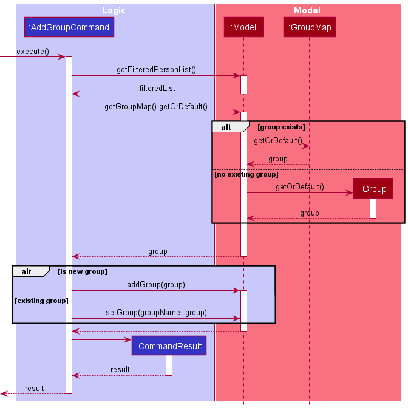
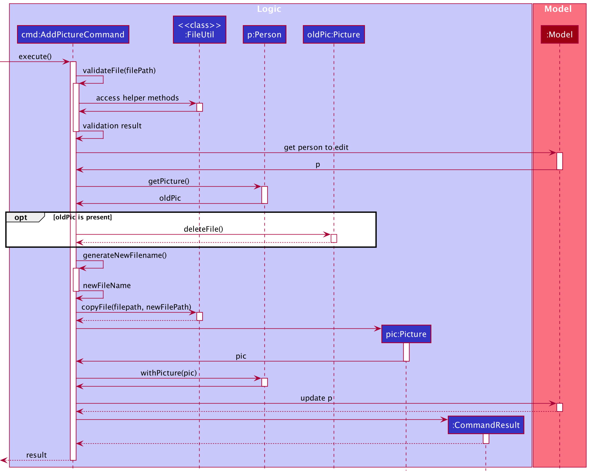

* Table of Contents
{:toc}

--------------------------------------------------------------------------------------------------------------------

## **Setting up, getting started**

Refer to the guide [_Setting up and getting started_](SettingUp.md).

--------------------------------------------------------------------------------------------------------------------

## **Design**

### Architecture

The ***Architecture Diagram*** given above explains the high-level design of the App. Given below is a quick overview of
each component.

:bulb: **Tip:** The `.puml` files used to create diagrams in this document can be found in
the [diagrams](https://github.com/AY2021S2-CS2103T-W14-1/tp/blob/master/docs/diagrams/) folder. Refer to the [_PlantUML
Tutorial_ at se-edu/guides](https://se-education.org/guides/tutorials/plantUml.html) to learn how to create and edit
diagrams.

**`Main`** has two classes
called [`Main`](https://github.com/AY2021S2-CS2103T-W14-1/tp/blob/master/src/main/java/seedu/address/Main.java)
and [`MainApp`](https://github.com/AY2021S2-CS2103T-W14-1/tp/blob/master/src/main/java/seedu/address/MainApp.java). It
is responsible for,

* At app launch: Initializes the components in the correct sequence, and connects them up with each other.
* At shut down: Shuts down the components and invokes cleanup methods where necessary.

[**`Commons`**](#common-classes) represents a collection of classes used by multiple other components.

The rest of the App consists of four components.

* [**`UI`**](#ui-component): The UI of the App.
* [**`Logic`**](#logic-component): The command executor.
* [**`Model`**](#model-component): Holds the data of the App in memory.
* [**`Storage`**](#storage-component): Reads data from, and writes data to, the hard disk.

Each of the four components,

* defines its *API* in an `interface` with the same name as the Component.
* exposes its functionality using a concrete `{Component Name}Manager` class (which implements the corresponding
  API `interface` mentioned in the previous point.

For example, the `Logic` component (see the class diagram given below) defines its API in the `Logic.java` interface and
exposes its functionality using the `LogicManager.java` class which implements the `Logic` interface.

**How the architecture components interact with each other**

The *Sequence Diagram* below shows how the components interact with each other for the scenario where the user issues
the command `delete 1`.

The sections below give more details of each component.

### UI component

**API** :
[`Ui.java`](https://github.com/AY2021S2-CS2103T-W14-1/tp/blob/master/src/main/java/seedu/address/ui/Ui.java)

The UI consists of a `MainWindow` that is made up of parts e.g.`CommandBox`, `ResultDisplay`, `PersonListPanel`
, `StatusBarFooter` etc. All these, including the `MainWindow`, inherit from the abstract `UiPart` class.

The `UI` component uses JavaFx UI framework. The layout of these UI parts are defined in matching `.fxml` files that are
in the `src/main/resources/view` folder. For example, the layout of
the [`MainWindow`](https://github.com/AY2021S2-CS2103T-W14-1/tp/blob/master/src/main/java/seedu/address/ui/MainWindow.java)
is specified
in [`MainWindow.fxml`](https://github.com/AY2021S2-CS2103T-W14-1/tp/blob/master/src/main/resources/view/MainWindow.fxml)

The `UI` component,

* Executes user commands using the `Logic` component.
* Listens for changes to `Model` data so that the UI can be updated with the modified data.

### Logic component

**API** :
[`Logic.java`](https://github.com/AY2021S2-CS2103T-W14-1/tp/blob/master/src/main/java/seedu/address/logic/Logic.java)

1. `Logic` uses the `AddressBookParser` class to parse the user command.
1. This results in a `Command` object which is executed by the `LogicManager`.
1. The command execution can affect the `Model` (e.g. adding a person).
1. The result of the command execution is encapsulated as a `CommandResult` object which is passed back to the `Ui`.
1. In addition, the `CommandResult` object can also instruct the `Ui` to perform certain actions, such as displaying
   help to the user.

Given below is the Sequence Diagram for interactions within the `Logic` component for a typical Command.

:information_source: **Note:** The lifeline for `CommandParser` should end at the destroy marker (X) but due to a limitation of PlantUML, the lifeline reaches the end of diagram.

### Model component

**
API** : [`Model.java`](https://github.com/AY2021S2-CS2103T-W14-1/tp/blob/master/src/main/java/seedu/address/model/Model.java)

The `Model`,

* stores a `UserPref` object that represents the user’s preferences.
* stores the address book data.
* exposes an unmodifiable `ObservableList<Person>` that can be 'observed' e.g. the UI can be bound to this list so that
  the UI automatically updates when the data in the list change.
* does not depend on any of the other three components.
* stores a `PersonStreakList` for use in the Streaks dashboard. The additional class diagram can be found [here](#streaks-dashboard).

### Storage component

**
API** : [`Storage.java`](https://github.com/AY2021S2-CS2103T-W14-1/tp/blob/master/src/main/java/seedu/address/storage/Storage.java)

The `Storage` component,

* can save `UserPref` objects in json format and read it back.
* can save the address book data in json format and read it back.

### Common classes

Classes used by multiple components are in the `seedu.addressbook.commons` package.

--------------------------------------------------------------------------------------------------------------------

## **Implementation**

This section describes some noteworthy details on how certain features are implemented.

### Theme

The implementation of theme is done by parsing the raw values of the `json` file containing a color palette, and then
transforming them into a `css` file that is then applied to `MainWindow.fxml`. All other elements will read from the
same `css` file. When the application is first launched, it will apply the default theme constructed by `ThemeFactory`.
When a theme is set by the command, it and it's temporary `css` file will be stored as variables in `ThemeManager`,
which will subsequently be used by the other parts of the application (for e.g. messageboxes).

#### Initialization

When the application starts up, it first checks for any previously used themes in `UserPrefs`. If not found, the
application continues to use the default theme. Otherwise, it attempts to load the theme file with
`ThemeFactory#load()`.

#### Command Invocation

When the command `theme` is invoked, the following happens:

1. A `Theme t` instance is created by calling `ThemeManager#load(FILE)`, where `FILE` is the supplied file path.
2. `ThemeManager#setTheme(t, FILE)` is then called. This stores/generates the following:
    * `theme` - The `Theme` object currently used.
    * `themePath` - The path of the `json` file.
    * `cssCacheUri` - The temp file containing the `CSS` to be used by `MainWindow.fxml`'s `scene`.
3. When the command gets executed, the result is processed by `MainWindow#executeCommand()`. The flag `theme` will be
   set, informing the application that there is a change in `cssCacheUri` and it applies the theme.

The following sequence diagram depicts the simplified workings of the command:

#### Termination

When the program terminates, `themePath` is saved into `UserPrefs` so it can locate the same theme for subsequent runs.

### Details panel tab switching

The `DetailsPanel` is used for displaying multiple types of content. We will refer to each type of content as a tab. By
default, it displays a list of upcoming dates, but it can be toggled to display other tabs as well.

#### Implementation

Each tab should have its own respective UI component and an instance of the component should be stored in `DetailsPanel`
. All tabs should also be recorded as enums
under [`DetailsPanelTab`](https://github.com/AY2021S2-CS2103T-W14-1/tp/blob/master/src/main/java/seedu/address/commons/core/DetailsPanelTab.java)
. Toggling to a new tab is done via the execution of commands.

1. The user will first enter a command text which requests for the tab to be switched.
2. The command text will be parsed by `InputParser` and the respective command will be created.
3. The command will be executed by `LogicManager`, and a `CommandResult` containing information of the new tab to toggle
   to will be created.
4. When `MainWindow` receives the `CommandResult`, it will check if there is a new tab to toggle to.
5. If so, `MainWindow` will execute `DetailsPanel#toggleTab()` and `DetailsPanel` will update its display accordingly.

The sequence diagram below depicts the execution path when the user enters a command which requests for the tab to be
switched.

### Streaks dashboard

The Streaks Dashboard shows the streaks maintained with each contact sorted in descending order. Refer to the UG Streaks section for more information.
Each streak has to be calculated based on the recorded meetings of each person and today's date. This operation is costly and so we want to avoid recomputing this value
as much as possible. Since streaks can be computed from the attributes of a person, they are not stored in the data file. The classes that are used to display the Streaks Dashboard
is shown below.

#### Initialization

This section will detail the steps the program takes to calculate streaks of everyone when it is started. 

1. `AddressBook` receives a copy of the deserialized `AddressBook` data. It calls `setPersons` of `PersonStreaklist` with the persons found in the data.
2. `PersonStreakList` will process this data and create a `PersonStreak` from each `Person`. A `PersonStreak` will bind a `Person` and his/her `Streak` together in a single class. 
3. This is done by calling `PersonStreak#fromPerson()` which will use the `Streak#from()` to calculate the Streak from a Person.
4. Once all the `PersonStreak` are created, they will be sent back to the `PersonStreakList` and put into an internal observable list, named `internalLst`. 

`internalLst` will contain all the `PersonStreak` objects that will be used to display the dashboard. It will be enclosed by a filtered list to show only `PersonStreak` that have an active goal set. 
An active goal is any valid goal that is not `NONE`, refer to UG `set-goal` for more information. The filtered list will then be made unmodifiable before being exposed to UI components to consume.

The sequence diagram below depicts the execution path when the program is initialized.

#### Updating a person

This section will detail how a `PersonStreak` is updated when the `Person` in it is modified.

1. When the `AddressBook#setPerson()` is run, `PersonStreakList#setPerson()` will also be executed. This is the entry point to updating a `Person` in the `PersonStreakList`.
2. Internally, the `PersonStreakList` will remove the original `Person` and add the edited `Person` into the internal observable list, named `internalList`. 
3. The `PersonStreakList` will calculate the streak of the added person and insert it correctly into `internalList`.
4. Once the `internalList` is updated, any UI components listening to it through the API exposed by `PersonStreakList` will be updated automatically.

The sequence diagram below depicts the execution path when a person is updated.

### Add Group

The sequence diagram below depicts the execution path when a `AddGroupCommand` is executed.

### Add Picture

FriendDex allows users to add a picture to their contact. This section details the implementation of that feature.

#### Implementation

1. The user will first supply the index of the contact to edit and the path to an image file.
2. `AddPictureCommand` will take the file path and validate it.
3. If everything looks good, the image file will be renamed to a random UUID and copied to `[JAR file location]/data`.
   The renaming is done to avoid problems with two image files having the same file name.
4. A `Picture` object will then be created, storing the file path of the copied image file.
5. Lastly, it will be attached to the `Person` being edited and saved to `Model`.

The sequence diagram below depicts the execution path when a `AddPictureCommand` is executed.

--------------------------------------------------------------------------------------------------------------------

## **Documentation, logging, testing, configuration, dev-ops**

* [Documentation guide](Documentation.md)
* [Testing guide](Testing.md)
* [Logging guide](Logging.md)
* [Configuration guide](Configuration.md)
* [DevOps guide](DevOps.md)

--------------------------------------------------------------------------------------------------------------------

## **Appendix: Requirements**

### Product scope

**Target user profile**:

* is a young programmer studying in NUS Computer Science
* prefers typing to mouse interactions
* has difficulty maintaining personal relationships
* cannot recall previous conversations with others
* is a goal-driven individual and seeks new challenges.

**Value proposition**:

* makes relationship management easier for the user
* keeps track of personal relationship with users' friends
* manages relationship faster than a mouse-driven app.

### User stories

| Category            | As a/an...         | I can...                                                                               | So that...                                                          |
|---------------------|--------------------|----------------------------------------------------------------------------------------|---------------------------------------------------------------------|
| Grouping/tagging    | Orderly User       | Create new friend groups                                                               | I can filter my friends by groups                                   |
|                     |                    |                                                                                        |                                                                     |
| Friend details      | Forgetful User     | Add a birthday to a contact                                                            | I can remember when that person's birthday is                       |
| Friend details      | Forgetful User     | Track how much debt is owed by/to the person                                           | I can get my money back or settle my debts.                         |
| Friend details      | Forgetful User     | Add a profile picture to the contact                                                   | I can remember how they look like                                   |
|                     |                    |                                                                                        |                                                                     |
| Customized UI       | Artsy User         | Customize the way the application looks                                                | It matches the aesthetics of my computer                            |
|                     |                    |                                                                                        |                                                                     |
| Special Dates       | Forgetful User     | Add reminders for special dates (special dates are events that occur yearly)           | I can remember my anniversary                                       |
|                     |                    |                                                                                        |                                                                     |      
| Friendship Journal  | User               | Record brief summary of last meeting with the other person (include last meeting date) | I know why we last met.                                             |
|                     |                    |                                                                                        |                                                                     |
| UX                  | Forgetful User     | See suggested commands as I type in the command bar                                    | I do not have to memorise all commands                              |
|                     |                    |                                                                                        |                                                                     |
| Search              | Tech-Savvy User    | Search for contacts via regex                                                          | I can find contacts easily                                          |
|                     |                    |                                                                                        |                                                                     |
| Relationship management   | Good friend        | Set a desired frequency (weekly. monthly, yearly) for meeting each contact       | I can set a goal on how frequent to meet my friends.                |
| Relationship management   | Forgetful friend   | Be reminded of who I should meet soon                                            | I do not forget to meet my friends.                                 |
| Relationship management   | Friend             | See upcoming dates (birthdays/ special dates)                                    | I can prepare myself before I meet them                             |
|                     |                    |                                                                                        |                                                                     |
| Dashboard           | User               | See upcoming birthdays at a glance                                                     | I can prepare myself for the week to come                           |
| Dashboard           | User               | See upcoming special dates at a glance                                                 | "                                       "                           | 
| Dashboard           | User               | See goals that will reach deadline                                                     | "                                       "                           |
| Dashboard           | Friend             | See which friends I have to meet soon                                                  | "                                       "                           |
|                     |                    |                                                                                        |                                                                     |

### Use cases

(For all use cases below, the **System** is the `FriendDex` and the **Actor** is the `user`, unless specified otherwise)

**Use case: Add profile picture to person**

**MSS**

1. User requests to list persons.
2. FriendDex shows a list of persons.
3. User requests to add a picture to a person in the list.
4. FriendDex attaches a picture to the person.

   Use case ends.

**Extensions**

* 2a. The list is empty.

  Use case ends.

* 3a. User supplies an invalid file location to FriendDex

    * 3a1. FriendDex shows an error message of the error.

      Use case resumes at step 2.

* 3b. User supplies a valid file location but wrong file format

    * 3b1. FriendDex shows an error message of the error.

      Use case resumes at step 2.

**Use case: Add birthday to a person**

**MSS**

1. User requests to list persons
2. FriendDex shows a list of persons
3. User requests to add a birthday to a specific person in the list
4. FriendDex stores the birthday information for the person

   Use case ends

**Extensions**

* 2a. The list is empty

  Use case ends

* 3a. The given date is invalid

    * 3a1. FriendDex shows an error message, and the accepted date format(s)

      Use case ends

**Use case: Create a friend group**

**MSS**

1. User requests to list persons
2. FriendDex shows a list of persons
3. User requests to add a group of friends to a new friend group.
4. FriendDex creates the friend group and adds the group of friends to the friend group.

   Use case ends

**Extensions**

* 3a. The friend group is already existing.

    * 3a1. FriendDex will add the indicated group to the existing group.

      Use case ends

* 4a. Some indicated users already exist in the friend group

    * 4a1. FriendDex will indicate the contacts that already exist in the friend group.

      Use case ends

**Use case: Edit a person**

**MSS**

1. User requests to list persons.
2. FriendDex shows a list of persons.
3. User requests to edit a specific person in the list.
4. FriendDex stores the edited information.

   Use case ends

**Extensions**

* 2a. The list is empty.

  Use case ends

* 3a. The new details supplied contain formatting errors.

    * 3a1. FriendDex shows an error message and displays the correct format for the command.

      Use case ends

* 3b. A supplied Date field is in an invalid format.

    * 3b1. FriendDex shows an error message and displays the accepted date formats.

      Use case ends

### Non-Functional Requirements

1. Should work on any mainstream OS as long as it has Java 11 or above installed.
2. The application should be able to support up to 1000 contacts.
3. The system should respond within two seconds.
4. The application should be portable (The user should be able to copy content over to another computer using some
   storage medium and still be able to work).
5. Should work on most mainstream keyboards (works without numpad/touchbar etc).

### Glossary

* **Mainstream OS**: Windows, Linux, Unix, OS-X

-------------------------------------------------------------------------------------

## **Appendix: Instructions for manual testing**

Given below are instructions to test the app manually. The instructions are mainly laid out in alphabetical order of the
command word (e.g. `add-group`) for ease of searching for specific features to test. The only exceptions are sections
that test FriendDex in its entirety. These instructions will be at the top.

:information_source: **Note:** These instructions only provide a starting point for testers to work on;
testers are expected to do more *exploratory* testing.

### Launch and shutdown

1. Initial launch

    1. Download the jar file and copy into an empty folder

    1. Double-click the jar file Expected: Shows the GUI with a set of sample contacts. The window size may not be
       optimum.

1. Saving window preferences

    1. Resize the window to an optimum size. Move the window to a different location. Close the window.

    1. Re-launch the app by double-clicking the jar file. 
       Expected: The most recent window size and location is retained.

1. _{ more test cases …​ }_

### Saving data

1. Dealing with missing/corrupted data files

    1. _{explain how to simulate a missing/corrupted file, and the expected behavior}_

1. _{ more test cases …​ }_

### Adding a person: `add`

### Adding a special date: `add-date`

Prerequisites: List all person using the `list` command. There is at least a person present in the list. The first
person on the list is born before 12-12-2020.

1. Adding a date to an existing person

    1. Test case: `add-date 1 d/12-12-2020 desc/sample desc`  
       Expected: Date is added to the first contact. A success message is shown in the status message.

    2. Test case: `add-date 0` (Invalid index)  
       Expected: Date is not added. Error details shown in the status message.

    3. Other incorrect `add-date` commands to try:
        * `add-date x` (where x is larger than list size),
        * `add-date 1 d/12-12-2020` (missing `DESCRIPTION` argument, other arguments can also be left out),

       Expected: Similar to previous

2. Adding a date with boundary date values. FriendDex will only allow adding of dates that have already occured.

    * These arguments should be replaced with their proper date representation.
        * `DATE_AFTER_TODAY`: a future date in the format of dd-MM-yyyy, e.g. `04-04-2099`
        * `DATE_BEFORE_BIRTHDAY`: a date prior to the person's birthday in the format of dd-MM-yyyy, e.g. `04-04-1800`

    1. Adding a date that happens in the future  
       Test case: `add-date 1 d/DATE_AFTER_TODAY desc/sample desc`  
       Expected: Date is not added. Error details shown in the status message.

    2. Adding a date that happens before the person is born Test  
       case: `add-date 1 d/DATE_BEFORE_BIRTHDAY desc/sample desc`  
       Expected: Similar to previous

### Adding a friend group: `add-group`

### Adding a meeting: `add-meeting`

Prerequisites: List all person using the `list` command. There is at least a person present in the list. The first
person on the list is born before 12-12-2020.

1. Adding a meeting to an existing person

    1. Test case: `add-meeting 1 d/12-12-2020 t/1945 desc/sample desc`  
       Expected: Meeting is added to the first contact. A success message is shown in the status message.

    2. Test case: `add-meeting 0` (Invalid index)  
       Expected: No meetings added. Error details shown in the status message.

    3. Other incorrect `add-meeting` commands to try:
        * `add-meeting x` (where x is larger than list size),
        * `add-meeting 1 d/12-12-2020 t/1945` (missing `DESCRIPTION` argument, other arguments can also be left out),
          Expected: Similar to previous

2. Adding a meeting with boundary time values. FriendDex will only allow adding of meetings that have already occurred.

    * These arguments should be replaced with their proper datetime representation.  
        * `TODAY_DATE`: today's date in the format of dd-MM-yyyy, e.g. `04-04-2021`  
        * `TIME_AFTER_NOW`: add a few minutes to the current time in the format of HHmm, e.g. `1230`

    1. Adding a meeting for today  
       Test case: `add-meeting 1 d/{TODAY_DATE} t/0000 desc/sample desc`.  
       Expected: Meeting is added to the first contact. A success message is shown in the status message.

    2. Adding a meeting for today but has not occurred yet  
       Test case: `add-meeting 1 d/{TODAY_DATE} t/{TIME_AFTER_NOW} desc/sample desc`  
       Expected: No meetings added. Error details shown in the status message.

    3. Adding a meeting that happens in the future  
       Test case: `add-meeting 1 d/12-12-2099 t/1945 desc/sample desc`  
       Expected: Similar to previous

### Adding a profile picture: `add-picture`

### Clearing all entries: `clear`

### Deleting a person: `delete`

1. Deleting a person while all persons are being shown

    1. Prerequisites: List all persons using the `list` command. Multiple persons in the list.

    1. Test case: `delete 1` 
       Expected: First contact is deleted from the list. Details of the deleted contact shown in the status message.
       Timestamp in the status bar is updated.

    1. Test case: `delete 0` (Invalid index) 
       Expected: No person is deleted. Error details shown in the status message. Status bar remains the same.

    1. Other incorrect delete commands to try: `delete`, `delete x`, `...` (where x is larger than the list size) 
       Expected: Similar to previous.

### Deleting a special date: `del-date`

Prerequisites: List all person using the `list` command. There is at least a person present in the list. The first
person on the list has at least one date.

1. Deleting a date from an existing person

    1. Test case: `del-date 1 i/1`  
       Expected: The first contact's first date is deleted. A success message is shown in the status message.

    2. Test case: `del-date 0 i/1` (Invalid index)  
       Expected: No date is deleted. Error details shown in the status message.

    3. Test case: `del-date 1 i/0` (Invalid date index)  
       Expected: Similar to previous

    4. Other incorrect `del-date` commands to try:
        * `del-date x i/1` (where x is larger than list size),
        * `del-date 1 i/x` (where x is larger than the number of dates the first person has),
        * `del-date 1` (missing `DATE_INDEX` argument),

       Expected: Similar to previous

### Deleting a meeting: `del-meeting`

### Deleting a profile picture `del-picture`

### Viewing full details: `details`

Prerequisites: List all person using the `list` command. There is at least a person present in the list.

1. Displaying the full details of an existing person

    1. Test case: `details 1`  
       Expected: Details for the first contact displayed on the details panel on the right. A success message is shown
       in the status message.

    2. Test case: `details 0`  
       Expected: Details panel not updated. Error details shown in the status message.

    3. Other incorrect `details` commands to try:
        * `details x` (where x is larger than the list size),
        * `details` (missing `INDEX` argument),

       Expected: Similar to previous

### Editing a person: `edit`

### Exiting the program: `exit`

1. Exiting the program

    1. Test case: `exit` 
       Process terminates with return code 0. FriendDex information is written to data files located in `./data`
       directory.

### Locating persons by name: `find`

1. Finding contacts with naive string search

    1. Prerequisites: List contains the default data included in FriendDex.

    2. Test case: `find alex` 
       Expected: All contact with the token `alex` will be listed. A success message is shown to the user.

    3. Test case: `find yeoh li yu` 
       Expected: All contact with name containing at least one token from the set of tokens `yeoh`, `li`, `yu` will be
       listed. A success message is shown to the user.

    4. Test case: `find` (Invalid format) 
       Expected: Listed contacts are not updated. Error details shown in the status message.

2. Finding contacts wth pattern matching

    1. Prerequisites: List contains the default data included in FriendDex.

    2. Test case: `find p/` 
       Expected: All contacts will be listed. A success message is shown to the user.

    3. Test case: `find .* p/` 
       Expected: All contacts will be listed. A success message is shown to the user.

    4. Test case: `find alex p/` 
       Expected: All contacts with names containing substring `alex` regardless of case will be listed. A success
       message is shown to the user.

    5. Test case: `find ^a.*h p/` 
       Expected: All contacts with names that starts with `a` and ends with `h` regardless of case will be listed. A
       success message is show to the user.

    6. Test case: `find [ p/` (Invalid argument) 
       Expected: Listed contacts are not updated. Error details shown in the status message.

### Viewing help: `help`

### Listing all persons: `list`

### Setting meeting goal: `set-goal`

1. Setting a relationship goal with a particular contact

    1. Prerequisites: List all persons using the `list` command. Multiple persons in the list. Everyone in FriendDex has
       their goal set to `NONE`.

    2. Test case: `set-goal 1 f/w` 
       Expected: A weekly goal will be set for the first contact in the list. A success message will be shown to the
       user. Goal information in various panels will be updated. Streaks for that contact will be shown when switched to
       the streaks tab.

    3. Test case: `set-goal 0 f/w` (Invalid index) 
       Expected: Goals for no one is set. Error details shown in the status message. No updates to FriendDex
       information.

    4. Test case: `set-goal 1 f/asdfg` (Invalid argument) 
       Expected: Goals for no one is set. Error details shown in the status message. No updates to FriendDex
       information.

    5. Test case: `set-goal f/w` (Invalid format) 
       Expected: Goals for no one is set. Error details shown in the status message. No updates to FriendDex
       information.

    6. Test case: `set-goal 1` (Invalid format) 
       Expected: Goals for no one is set. Error details shown in the status message. No updates to FriendDex
       information.

2. Removing a relationship goal for a particular contact:

    1. Prerequisites: List all persons using the `list` command. Contact at index 1 has a relationship goal set.

    2. Test case: `set-goal 1 f/n` 
       Expected: Goal will be removed from the first contact in the list. A success message will be shown to the user.
       Goal information in various panels will be updated. Streaks for that contact will no longer be shown when
       switching to the streaks tab.

    3. Test case: `set-goal 0 f/n` (Invalid index) 
       Expected: Goals for no one is removed. Error details shown in the status message. No updates to FriendDex
       information.

    4. Test case: `set-goal 1 f/asdfg` (Invalid argument) 
       Expected: Goals for no one is removed. Error details shown in the status message. No updates to FriendDex
       information.
    5. Test case: `set-goal 1` (Invalid format) 
       Expected: Goals for no one is removed. Error details shown in the status message. No updates to FriendDex
       information.

### Subtracting Debt: `subtract-debt`

### Styling the application: `theme`

1. Applying a predefined theme

    1. Test case: `theme @monokai` 
       Expected: Theme of the application changes. A success message will be shown.

    1. Test case: `theme @asdfg` (Invalid argument) 
       Expected: Nothing happens. Error details shown in the status message.

    1. Test case: `theme` (Invalid format) 
       Expected: Nothing happens. Error details shown in the status message.

2. Applying a user defined theme

    1. Test case: `theme monokai.json`, where `monokai.json` is a valid theme file 
       Expected: Theme of the application changes. A success message will be shown.

    2. Test case: `theme invalid.json`, where `invalid.json` is a theme file containing invalid values (Invalid data)
        
       Expected: Nothing happens. Error details shown in the status message.

    3. Test case: `theme not_found.json`, where `not_found.json` does not exist (Invalid data) 
       Expected: Nothing happens. Error details shown in the status message.

3. Automatically applying predefined theme across instances

    1. Test case: `theme @pulp`.

        1. Close the application.

        2. Relaunch the application. Observe that the theme of the application persists.

4. Automatically applying user defined theme across instances

    1. Test case: Applying valid theme with no external modification `theme some_theme.json`.

        1. Close the application.

        2. Reopen the application. Observe that the theme of the application persists.

    2. Test case: Applying valid theme with external modification `theme some_theme.json`.

        1. Close the application.

        2. Delete `some_theme.json`.

        3. Relaunch the application. Observe that the default theme is applied to the application.

### Viewing a different tab on the details panel: `view`

1. Displaying a different tab on the details panel

    1. Test case: `view streaks`  
       Expected: Streaks dashboard displayed on the details panel on the right. A success message is shown in the status
       message.

    2. Test case: `view upcoming events`  
       Expected: Upcoming events displayed on the details panel on the right. A success message is shown in the status
       message.

    3. Test case: `view details`  
       Expected: Details panel not updated. Information on the `details` command shown in the status message.

    4. Other incorrect `view` commands to try:
        * `view x` (where x is not a valid `TAB`),
        * `view` (missing `TAB` argument),

       Expected: Details panel not updated. Error details shown in the status message.
