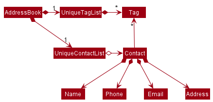

  

<h1 class="post-title">{{ page.title | escape }}</h1>
<h3 class="post-subtitle">v1.3</h3>

 

## Table of Contents
{:.no_toc}

* Table of Contents 
{:toc}

## **Introduction**
imPoster is a desktop application for beginners of API development to quickly grasp the basics. 
imPoster's simple and minimalistic style can help beginner API developers **explore** and **test** APIs, whether those **found online** or those that they have **built** themselves.
imPoster is also highly optimised fast typists and can be fully operated through keyboard commands.
This developer's guide assumes its readers to have a **basic understanding** of APIs. 
For a basic definition of [what an API is](), an appendix has been provided for readers who may be unfamiliar with the concept.
However, it is highly recommended for readers to refer to proper tutorial contents for the basics of APIs prior to developing the application.
Reader are also advised to download our [latest releases](https://imposter-dev.tk) from our main website in order to test out the application.

* to-do brief description and some navigation tips about the developer guide as to what was similarly done in the user guide.

## **Design**

### Architecture

The ***Architecture Diagram*** given above explains the high-level design of the App. Given below is a quick overview of each component.

**`Main`** has two classes called [`Main`](https://github.
com/AY2021S2-CS2103T-T12-4/tp/blob/master/src/main/java/seedu/us/among/Main.java) and [`ImPoster`](https://github.
com/AY2021S2-CS2103T-T12-4/tp/blob/master/src/main/java/seedu/us/among/ImPoster.java). They are responsible for,
* At app launch: Initializes the components in the correct sequence, and connects them up with each other.
* At shut down: Shuts down the components and invokes cleanup methods where necessary.

[**`Commons`**](#common-classes) represents a collection of classes used by multiple other components.

The rest of the App consists of four components.

* [**`UI`**](#ui-component): The UI of the App.
* [**`Logic`**](#logic-component): The command executor.
* [**`Model`**](#model-component): Holds the data of the App in memory.
* [**`Storage`**](#storage-component): Reads data from, and writes data to, the hard disk.

Each of the four components,

* defines its *API* in an `interface` with the same name as the Component.
* exposes its functionality using a concrete `{Component Name}Manager` class (which implements the corresponding API `interface` mentioned in the previous point.

For example, the `Logic` component (see the class diagram given below) defines its API in the `Logic.java` interface and exposes its functionality using the `LogicManager.java` class which implements the `Logic` interface.

**How the architecture components interact with each other**

The *Sequence Diagram* below shows how the components interact with each other for the scenario where the user 
issues the command `send 1`.

The sections below give more details of each component.

### UI component

**API** :
[`Ui.java`](https://github.com/AY2021S2-CS2103T-T12-4/tp/blob/master/src/main/java/seedu/us/among/ui/Ui.java)

The UI consists of a `MainWindow` that is made up of parts e.g.`CommandBox`, `ResultDisplay`, `EndpointListPanel`, 
`StatusBarFooter` etc. All these, including the `MainWindow`, inherit from the abstract `UiPart` class.

The `UI` component uses JavaFx UI framework. The layout of these UI parts are defined in matching `.fxml` files that 
are in the `src/main/resources/view` folder. For example, the layout of the 
[`MainWindow`](https://github.com/AY2021S2-CS2103T-T12-4/tp/blob/master/src/main/java/seedu/us/among/ui/MainWindow.java) 
is specified in 
[`MainWindow.fxml`](https://https://github.com/AY2021S2-CS2103T-T12-4/tp/blob/master/src/main/resources/view/MainWindow.fxml)

The `UI` component,

* Executes user commands using the `Logic` component.
* Listens for changes to `Model` data so that the UI can be updated with the modified data.

### Logic component

**API** :
[`Logic.java`](https://github.com/AY2021S2-CS2103T-T12-4/tp/blob/master/src/main/java/seedu/us/among/logic/Logic.java)

1. Logic first uses the `ImposterParser` class to parse a user's input, through the `parseCommand` method.
2. Depending on the Command, the user's input could be parsed by that command's specific parser. (e.g `AddCommandParser`) 
3. This causes a `Command` object to be created, which is executed by the `LogicManager`through the `execute` method.
4. The execution of Command can create, alter, retrieve or execute an `Endpoint` Object, or change the `EndpointList`. (eg. add, edit, find, show, run, send)
5. What occured in the execution is encapsulated in a `CommandResult`, which is then passed to `UI` component, which displays to user infomation about what has occured.

Given below is the Sequence Diagram for interactions within the `Logic` component for the `execute("delete 1")` API call.

:information_source: **Note:** The lifeline for `DeleteCommandParser` should end at the destroy marker (X) but due to a limitation of PlantUML, the lifeline reaches the end of diagram.

### Model component

**API** : [`Model.java`](https://github.com/AY2021S2-CS2103T-T12-4/tp/blob/master/src/main/java/seedu/us/among/model/Model.java)

The `Model`,
* stores a `UserPref` object that represents the user’s preferences.
* stores the Endpoint List data.
* exposes an unmodifiable `ObservableList<Endpoint>` that can be 'observed' e.g. the UI can be bound to this list so 
  that the UI automatically updates when the data in the list change.
* does not depend on any of the other three components.

:information_source: **Note:** An alternative (arguably, a more OOP) model
is given below. It has a `Tag` list in the `imPoster`, which `Endpoint` references. This allows `imPoster` to only 
require one `Tag` object per unique `Tag`, instead of each `Endpoint` needing their own `Tag` object. 

### Storage component

**API** : [`Storage.java`](https://github.com/AY2021S2-CS2103T-T12-4/tp/blob/master/src/main/java/seedu/us/among/storage/Storage.java)

The `Storage` component,
* can save `UserPref` objects in json format and read it back.
* can save the Endpoint List data in json format and read it back.

### Common classes

Classes used by multiple components are in the `seedu.us.among.commons` package.

--------------------------------------------------------------------------------------------------------------------

## **Implementation**

This section describes some noteworthy details on how certain features are implemented.
### Endpoint Components
* Change/Add classes in the Endpoint package to encapsulate an API endpoint.

#### Implementation

An `Endpoint`,
* is stored in `EndpointList` of the `Model`
* encapsulates an API endpoint

An `Endpoint` contains the following attributes:
1. a `Method`, which represents the type of request an API endpoint will send to the server
2. an `Address`, which represents the address to which the API request is made
3. a `Data`, which represents the data that is to be sent to the server when an API request is made
4. a Headers Set, which encapsulates a list of zero or more `Header` objects, where each `Header` represents a header that is to be sent to the server
5. a Tags Set, which encapsulates a list of zero or more `Tags` objects
6. a `Response`, which represents the response that an API receives from the server

* There are a certain set of requests that an API can make: GET, POST, PUT, DELETE, HEAD, OPTIONS, PATCH.
* A `Method` object will always be one of the above requests
* `Data` represents the data that is to be sent to the server when an API request is made
* `Data` can be empty, as some API calls do not send any data to the server
* Before an API call is made, the `Response` object will be empty
* Only when a Request#executeTimed(request) is called will a `Response` contain information about the API call response

The following activity diagram summarizes how an endpoint is created when a user executes an add command:

#### Design consideration:
##### Aspect: How the components within `Endpoint` are added or changed
* **Current Choice**: Attributes within `Endpoint` are immutable, meaning that if there is an attribute that has to be
  edited or added, a new Endpoint object has to be created.
    * Pros: Concept of Immutability is met, making the code less prone to bugs as all components of an Endpoint object are fixed
    * Cons: Less flexible, more steps needed in creating or editing Endpoint objects

* **Alternative 1**: Allow certain components within `Endpoint`, like `Header` and `Data` to be mutable
    * Pros: Less overhead as fewer objects are created
    * Cons: Prone to error as a Component might not be correctly changed
    
### Add endpoint feature

#### What it is

Adds an endpoint to the bottom of the list of currently existing endpoints. Users are able to add any valid endpoint to the list. If the exact same endpoint is already in the list, this command will not be allowed and an error will be shown.

Example: `add -x get -u https://localhost:3000`
#### Implementation

Upon the users entry of the endpoint, the `AddCommand` object is created. `AddCommand` is a class that extends `Command` abstract class. `AddCommand` implements the `execute()` method from the `Command` abstract class whereby upon execution, the method will add the given endpoint in the model's list of endpoints if a valid endpoint is given.

Given below is an example usage scenario and how the add command behaves at each step.

Step 1. The user launches the application and executes `add -x get -u https://api.data.gov.sg/v1/environment/air-temperature` to save an endpoint.

Step 2. The endpoint is added to the model.

The following sequence diagram shows how the add operation works:

:information_source: **Note:** The lifeline for `AddCommand` should end at the destroy marker (X) but due to a limitation of PlantUML, the lifeline reaches the end of diagram.

### Find command feature

#### What it is

Looks for an endpoint in the list of endpoints and displays all the endpoints that match the requested specifications. If there are no specifications, `find` will do a general search through all fields that endpoint has.
#### Implementation

Upon the users entry of the find keyword, the parser will check if prefixes have been specified, if the user decided to specify prefixes, the `FindCommand` object will be created with predicates looking through the specified prefixes. Else, a general endpoint predicate that will scan through all fields of endpoint will be created. `FindCommand` is a class that extends `Command` abstract class. `FindCommand` implements the `execute()` method from the `Command` abstract class whereby upon execution, the method will search through the given endpoints in the model's list of endpoints and check if any endpoints match the specifications. It will then update the model with the filtered endpoint list.

Given below is an example usage scenario and how the find command behaves at each step.

Step 1. The user launches the application and executes `find -x get -u https://localhost:3000` to find an endpoint.

Step 2. The find command will check and see if there are any endpoints that contain the method `get` and the address `https://localhost:3000` using the `Model#updateFilteredEndpointList` method.

Step 3. `Model#updateFilteredEndpointList` will be called and model will be updated.

:information_source: **Note:** `find get` will work as well, but will look through all fields instead of just one

The following activity diagram summarizes what happens when a user executes a find command:

### Send/run command feature

#### Implementation

The send/run mechanism is very involved in the invocation of an actual outbound request that is facilitated by the `request` package. Both commands allow users to get the latest response from an endpoint and display the result for inspection.

Given below is an example usage scenario and how the send command behaves at each step.

Step 1. The user launches the application and executes `add -x get -u https://api.data.gov.sg/v1/environment/air-temperature` to save an endpoint (a `get` request to the API URL above).

Step 2. The user executes `send 1` command to first retrieve the endpoint stored at index 1. The endpoint at that index will then be used to generate an `EndpointCaller` object.

Step 3. The `send` command calls `EndpointCaller#callEndpoint()`, sending out the HTTP request to the targeted API service provider and retrieves a response. The existing endpoint used to invoke the request will be used to generate an updated endpoint with the returned response and saved into the model.

Step 4. The response retrieved will also be parsed and passed to UI for further formatting and displaying to the user.

:information_source: **Note:** If a send command fails its execution, it will not call `model.setEndpoint()`, so the endpoint list state will not be updated or saved.

The following sequence diagram shows how the send operation works:

:information_source: **Note:** The lifeline for `SendCommand` should end 
at the destroy marker (X) but due to a limitation of PlantUML, the lifeline reaches the end of diagram.

The `run` command deploys a similar trick but for an endpoint specified directly within the command arguments.

The following activity diagram summarizes what happens when a user executes a run command:

#### Design consideration:

##### Aspect: How send & run executes

* **Alternative 1 (current choice):** The Send and Run command parsers verify the validity of endpoint/url before generating the respective commands.
    * Pros: Keep the checking logic within the same place.
    * Cons: It may not be clear if the command contains a valid endpoint.

* **Alternative 2:** Individual command checks if the endpoint/url is valid by itself.
    * Pros: Checking of url validity right before execution will ensure proper request is processed.
    * Cons: Duplication of code across Send and Run commands.

### Request feature

#### Implementation

The request mechanism is invoked by the `EndpointCaller` object when the user executes a send/run command and is facilitated by the `Apache HttpComponents` library. When invoked, it performs an API call to a specific endpoint and returns a response if the call is performed successfully. It supports API calls for the following methods, each represented by a class:
- `GET`
- `PUT`
- `POST`
- `DELETE`
- `HEAD`
- `OPTIONS`
- `PATCH`

Given below is an example usage scenario where the behaviour of request mechanism is captured in step 3.

Step 1. The user launches the application for the first time which comes with a default list of endpoints.

Step 2. The user executes `send 1` command to first retrieve the endpoint stored at index 1 (`GET` request to `https://api.github.com/repos/AY2021S2-CS2103T-T12-4/tp/readme`). The endpoint at that index will then be used to generate an `EndpointCaller` object.

Step 3. The `send` command calls `EndpointCaller#callEndpoint()`, which in turn calls `EndpointCaller#sendRequest`. Next, a `GetRequest` object is created for the associated endpoint and its `send` method is invoked. Following this, a `HttpUriRequest` object is created and `Headers` and `Data` fields are populated with values retrieved from the endpoint. Finally, the `#execute` method from the abstract `Request` class is called and a timed execution of the API call is carried out to the targeted API service provider. A response is returned and the existing endpoint used to invoke the request will be updated with the returned response and saved into the model.

Step 4. The response retrieved will also be parsed and passed to UI for further formatting and displaying to the user.

:information_source: **Note:** If an API call fails to return a response (e.g. due to connection error), it will not call `model.setEndpoint()` so the endpoint list state will not be updated or saved.

The following sequence diagram shows how the request operation works when a user executes a `send` command for an endpoint with a `GET` request:

:information_source: **Note:** The lifeline for `SendCommand`, `EndpointCaller` and `GetRequest` should end 
at the destroy marker (X) but due to a limitation of PlantUML, the lifeline reaches the end of diagram.

The following activity diagram summarizes what happens when a user executes a `send` command for an endpoint with a `GET` request:
 

#### Design consideration:

##### Aspect: How request executes

* **Alternative 1 (current choice):** The request class executes the API call and differentiates types of exceptions into multiple catch blocks.
    * Pros: Error messages are specific enough to help the user debug the error.
    * Cons: Individual exceptions have to be verified thoroughly to ensure that error messages do not mislead the user.

* **Alternative 2:** The request class executes the API call and catches all exceptions together in one catch block.
    * Pros: Most if not all instances of failed API calls are caught.
    * Cons: Error message is not specific enough to help the user debug the error.
    
### TODO MORE IMPLEMENTATION

---
## **Documentation, logging, testing, configuration, dev-ops**

* [Documentation guide](Documentation.md)
* [Testing guide](Testing.md)
* [Logging guide](Logging.md)
* [Configuration guide](Configuration.md)
* [DevOps guide](DevOps.md)

---

## **Appendix A: Product Scope**

**Target user profile**:

- has a need to test a significant number of APIs
- prefers a quick means of testing APIs
- can type fast
- prefers typing to mouse interactions
- is reasonably comfortable with APIs
- is keen to develop software products that involve APIs
- requires testing of APIs in projects or work-related tasks

**Value proposition**:

- beautify response
- save requests for quick execution again
- general analysis/recommendation system based on certain metrics
- no need to create any account
- simple and easy to get started
- unintrusive
- great user experience

## **Appendix B: User Stories**

Priorities: High (must have) - `* * *`, Medium (nice to have) - `* *`, Low
(unlikely to have) - `*`

| Priority | As a …​               | I want to …​                              | So that I can…​                                                 |
| -------- | --------------------- | ----------------------------------------- | --------------------------------------------------------------- |
| `* * *`  | new user              | view a quick description of APIs          | quickly review the concepts of APIs                             |
| `* * *`  | long time user        | test my APIs on the fly                   | run API tests anytime                                           |
| `* * *`  | long time user        | quickly load my previous APIs             | save time and not have to type them all out again               |
| `* * *`  | experienced developer | test out my API multiple times repeatedly | know if my API can cope under significant traffic               |
| `* * *`  | new API developer     | clear error messages                      | quickly learn where I went wrong                                |
| `* * *`  | API tester            | a focused simple design                   | quickly validate the state of an endpoint                       |
| `* * *`  | new user              | have an optional features walkthrough     | have a broad overview of functionalities                        |
| `* * *`  | moderate user         | find/locate saved API endpoints           | can easily view the information for the endpoint of my interest |
| `*`      | experienced developer | export my saved API endpoints             | can easily port or integrate the data with other platforms      |
| `*`      | expert user           | have API recommendations                  | help to optimise or are more suited for my product              |
| `*`      | moderate user         | learn to optimise my usage                | can have a faster and smoother workflow                         |

_{More to be added}_

## **Appendix C: Use Cases**

(For all use cases below, the **System** is the `imPoster` and the **Actor** is
the `user`, unless specified otherwise)

### <ins>General Use Cases</ins>

**Use case G01 - View Help**

**MSS**

1.  User requests for help with using the application
2.  User enters help command into command box
3.  imPoster returns a help link for the user to click

    Use case ends.

**Extensions**

- 2a. The given command/format is invalid

  - 2a1. imPoster shows an error message to the user

    Use case resumes at step 2.

**Use case G02 - Exit imPoster**

**MSS**

1.  User requests to exit the application
2.  User enters exit command into command box
3.  imPoster exits

    Use case ends.

**Extensions**

- 2a. The given command/format is invalid

  - 2a1. imPoster shows an error message to the user

    Use case resumes at step 2.

### <ins>Endpoint Use Cases</ins>

**Use case E01 - Add an API endpoint**

**MSS**

1.  User requests to add an API endpoint
2.  User enters add command into command box
3.  imPoster saves the API endpoint to the API endpoint list

    Use case ends.

**Extensions**

- 2a. The given command/format is invalid

  - 2a1. imPoster shows an error message to the user

    Use case resumes at step 2.

**Use case E02 - Edit an API endpoint**

**MSS**

1.  User requests to edit an API endpoint
2.  User enters edit command into command box
3.  imPoster edits the API endpoint and updates the API endpoint list

    Use case ends.

**Extensions**

- 2a. The given command/format is invalid

  - 2a1. imPoster shows an error message to the user

    Use case resumes at step 2.

- 2b. The given index is invalid

  - 2b1. imPoster shows an error message to the user

    Use case resumes at step 2.

**Use case E03 - Remove an API endpoint**

**MSS**

1.  User requests to remove an API endpoint
2.  User enters remove command into command box
3.  imPoster removes the API endpoint and updates the API endpoint list

    Use case ends.

**Extensions**

- 2a. The given command/format is invalid

  - 2a1. imPoster shows an error message to the user

    Use case resumes at step 2.

- 2b. The given index is invalid

  - 2b1. imPoster shows an error message to the user

    Use case resumes at step 2.

**Use case E04 - Find a saved API endpoint**

**MSS**

1.  User requests to find a saved API endpoint
2.  User enters find command into command box
3.  imPoster searches the existing records
4.  imPoster returns a list of matching API endpoints

    Use case ends.

**Extensions**

- 2a. The given command/format is invalid

  - 2a1. imPoster shows an error message to the user

    Use case resumes at step 2.

- 2b. The given search result is empty

  - 2b1. imPoster shows a friendly message about mistyped keywords to the user

    Use case resumes at step 1.

**Use case E05 - List all saved API endpoints**

**MSS**

1.  User requests to view all saved API endpoints
2.  User enters list command into command box
3.  imPoster displays all existing records

    Use case ends.

**Extensions**

- 2a. The given command/format is invalid

  - 2a1. imPoster shows an error message to the user

    Use case resumes at step 2.

**Use case E06 - Clear all saved API endpoints**

**MSS**

1.  User requests to clear all saved API endpoints
2.  User enters clear command into command box
3.  imPoster clears all existing records

    Use case ends.

**Extensions**

- 2a. The given command/format is invalid

  - 2a1. imPoster shows an error message to the user

    Use case resumes at step 2.

**Use case E07 - Call a saved API endpoint**

**MSS**

1.  User requests to call a saved API endpoint
2.  User enters send command into command box
3.  imPoster makes a call to the desired API endpoint
4.  API call is successful and response is shown to the user
5.  imPoster saves the response to a file that the user can view

    Use case ends.

**Extensions**

- 2a. The given command/format is invalid

  - 2a1. imPoster shows an error message to the user

    Use case resumes at step 2.

- 2b. imPoster receives an invalid index

  - 2b1. imPoster shows an error message to the user

    Use case resumes at step 2.

- 3a. imPoster receives a status code indicating an error

  - 3a1. imPoster forwards and shows the error message (from the server, if any)
    to the user

    Use case resumes at step 1.

**Use case E08 - Call an API endpoint directly without saving**

**MSS**

1.  User requests to call a saved API endpoint
2.  User enters run command into command box
3.  imPoster makes a call to the desired API endpoint
4.  API call is successful and response is shown to the user
5.  imPoster saves the response to a file that the user can view

    Use case ends.

**Extensions**

- 2a. The given command/format is invalid

  - 2a1. imPoster shows an error message to the user

    Use case resumes at step 2.

- 3a. imPoster receives a status code indicating an error

  - 3a1. imPoster forwards and shows the error message (from the server, if any)
    to the user

    Use case resumes at step 1.

*{More to be added}*

### Non-Functional Requirements

1.  Should work on any _mainstream OS_ as long as it has Java `11` or above
    installed.
2.  Should be able to hold up to 1000 API endpoints without a noticeable
    sluggishness in performance for typical usage.
3.  A user with above average typing speed for regular English text (i.e. not
    code, not system admin commands) should be able to accomplish most of the
    tasks faster using commands than using the mouse.
4.  Should feel simple and easy to use as compared to existing
    solutions such as [Postman](https://www.postman.com/).
5.  Should be able to provide a proper response even if a call to an API
    endpoint fails due to third-party unavailability.
6.  Should not crash or throw unexpected errors when internet connection is
    unavailable.

_{More to be added}_

### Glossary

- **Mainstream OS**: Windows, Linux, Unix, OS-X
- **Endpoint/API endpoint**: The point of entry in a communication channel for two
  systems to interact
- **API Call/Call**: A process where information is transferred, processed and a response is returned
- **Postman**: An existing API client for developers

_{More to be added}_

## **Appendix D: Developer Workflow**
 
Please checkout the [workflow guide](https://ay2021s2-cs2103t-t12-4.github.io/tp/WorkflowGuide.html) to understand
the adopted approach in maintaining imPoster.

## **Appendix E: API definition**
### What is an API?
Broadly speaking, an **API** is an interface that enables and defines how **two systems** interact with one another. In a classic analogy, the interaction above is usually likened to a **waiter** communicating a **customer** order to the restaurant **kitchen**. In this analogy, the **customer** and **kitchen** represents the **two systems** and the **waiter** represents the **API** allowing them to communicate. The **order** and **food** delivered then corresponds to the terms **request** and **response** associated with an API call. The annotated diagrams below capture these interactions and may aid in providing a better understanding:

  

### Why learn about APIs?

You may be surprised to know that APIs are not only widely used in our daily lives, it is also likely that you have been using them frequently without actually noticing them! For example, the simple act of visiting a website involves an API request which is responsible for bringing back a response to you in the form of a webpage. Even a simple text message to your friend relies on an API to reliably deliver your message! The use of APIs is extensive in today’s highly connected world so even if they are completely unrelated to your job, it helps to have some basic understanding of them!

