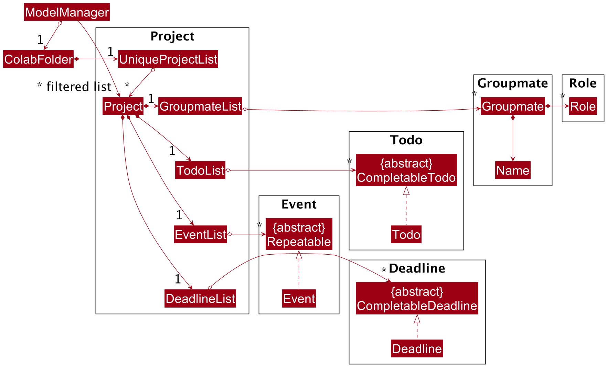

* Table of Contents
{:toc}

--------------------------------------------------------------------------------------------------------------------

## **Setting up, getting started**

Refer to the guide [_Setting up and getting started_](SettingUp.md).

--------------------------------------------------------------------------------------------------------------------

## **Design**

### Architecture

The ***Architecture Diagram*** given above explains the high-level design of the App. Given below is a quick overview of each component.

:bulb: **Tip:** The `.puml` files used to create diagrams in this document can be found in the [diagrams](https://github.com/AY2021S2-CS2103T-T11-2/tp/tree/master/docs/diagrams/) folder. Refer to the [_PlantUML Tutorial_ at se-edu/guides](https://se-education.org/guides/tutorials/plantUml.html) to learn how to create and edit diagrams.

**`Main`** has two classes called [`Main`](https://github.com/AY2021S2-CS2103T-T11-2/tp/tree/master/src/main/java/seedu/address/Main.java) and [`MainApp`](https://github.com/AY2021S2-CS2103T-T11-2/tp/tree/master/src/main/java/seedu/address/MainApp.java). It is responsible for,
* At app launch: Initializes the components in the correct sequence, and connects them up with each other.
* At shut down: Shuts down the components and invokes cleanup methods where necessary.

[**`Commons`**](#common-classes) represents a collection of classes used by multiple other components.

The rest of the App consists of four components.

* [**`UI`**](#ui-component): The UI of the App.
* [**`Logic`**](#logic-component): The command executor.
* [**`Model`**](#model-component): Holds the data of the App in memory.
* [**`Storage`**](#storage-component): Reads data from, and writes data to, the hard disk.

Each of the four components,

* defines its *API* in an `interface` with the same name as the Component.
* exposes its functionality using a concrete `{Component Name}Manager` class (which implements the corresponding API `interface` mentioned in the previous point.

For example, the `Logic` component (see the class diagram given below) defines its API in the `Logic.java` interface and exposes its functionality using the `LogicManager.java` class which implements the `Logic` interface.

**How the architecture components interact with each other**

The *Sequence Diagram* below shows how the components interact with each other for the scenario where the user issues the command `deleteP 1`.

The sections below give more details of each component.

### UI component

**API** :
[`Ui.java`](https://github.com/AY2021S2-CS2103T-T11-2/tp/tree/master/src/main/java/seedu/address/ui/Ui.java)

The UI consists of a `MainWindow` that is made up of parts e.g.`CommandBox`, `ResultDisplay`, `ContactListPanel`, `StatusBarFooter` etc. All these, including the `MainWindow`, inherit from the abstract `UiPart` class.

The `UI` component uses JavaFx UI framework. The layout of these UI parts are defined in matching `.fxml` files that are in the `src/main/resources/view` folder. For example, the layout of the [`MainWindow`](https://github.com/AY2021S2-CS2103T-T11-2/tp/tree/master/src/main/java/seedu/address/ui/MainWindow.java) is specified in [`MainWindow.fxml`](https://github.com/AY2021S2-CS2103T-T11-2/tp/tree/master/src/main/resources/view/MainWindow.fxml)

The `UI` component,

* Executes user commands using the `Logic` component.
* Listens for changes to `Model` data so that the UI can be updated with the modified data.

### Logic component

**API** :
[`Logic.java`](https://github.com/AY2021S2-CS2103T-T11-2/tp/tree/master/src/main/java/seedu/address/logic/Logic.java)

1. `Logic` uses the `ColabParser` class to parse the user command.
1. This results in a `Command` object which is executed by the `LogicManager`.
1. The command execution can affect the `Model` (e.g. adding a project).
1. The result of the command execution is encapsulated as a `CommandResult` object which is passed back to the `Ui`.
1. In addition, the `CommandResult` object also contains a `UiCommand` object, which encapsulates information needed to instruct the `Ui` to perform certain actions, such as displaying help to the user.

Given below is the Sequence Diagram for interactions within the `Logic` component for the `execute("deleteP 1")` API call.

:information_source: **Note:** The lifeline for `DeleteProjectCommandParser` should end at the destroy marker (X) but due to a limitation of PlantUML, the lifeline reaches the end of diagram.

### Model component

**API** : [`Model.java`](https://github.com/AY2021S2-CS2103T-T11-2/tp/tree/master/src/main/java/seedu/address/model/Model.java)

The `Model`,

* stores a `UserPref` object that represents the user's preferences.
* stores the `ColabFolder` data, which contains data of contacts and projects.
* exposes an unmodifiable `ObservableList<Contact>` and `ObservableList<Project>` that can be 'observed' e.g. the UI can be bound to this list so that the UI automatically updates when the data in the list change.
* does not depend on any of the other components.

#### Inner Workings

A `Contact` stores a `Name`, `Email`, `Phone` number, `Address` and zero or more `Tag`s.

A `Project` stores an `EventList`, `DeadlineList`, `TodoList` and a `GroupmateList`. The `EventList`, `DeadlineList`, `TodoList` and `GroupmateList` stores zero or more `Repeatable`, `CompletableDeadline`, `CompletableTodo` and `Groupmate` objects respectively.

### Storage component

**API** : [`Storage.java`](https://github.com/AY2021S2-CS2103T-T11-2/tp/tree/master/src/main/java/seedu/address/storage/Storage.java)

The `Storage` component,
* can save `UserPref` objects in json format and read it back.
* can save the user's data in json format and read it back.

### Common classes

Classes used by multiple components are in the `seedu.addressbook.commons` package.

--------------------------------------------------------------------------------------------------------------------

## **Implementation**

This section describes some noteworthy details on how certain features are implemented.

### View Projects Feature

This section explains the implementation of the View Project feature. The implementation of other commands that opens panels, windows or tabs are similar.

The `ViewProject` command results in the UI displaying the specified project together with all its related information.

The mechanism to issue the command to display a new project is facilitated by `ViewProjectUiCommand`, a concrete implementation of the `UiCommand` abstract class, which encapsulates the project `Index` as well as the logic that determines which methods to call in the `MainWindow`.

Given below is an example usage scenario and how the mechanism behaves at each step.

Step 1. The user issues the command `viewP 1` to display a panel containing information about the first project in the project list.

Step 2. A `CommandResult` object is created (see section on [Logic Component](#logic-component)) containing a `ViewProjectUiCommand` object. The `ViewProjectUiCommand` object stores the `Index` of the first project in the project list.

Step 3. The `CommandResult` is passed to the `MainWindow`, which gets the `UiCommand` by calling `CommandResult#getUiCommand()`.

Step 4. The `MainWindow` now calls `UiCommand#execute`, which will result in a call to the overridden method `ViewProjectUiCommand#execute`.

Step5. Execution of this method will result in a call to `MainWindow#selectProject` with the `Index` of the first project as an argument. This will display the first project in the project list.

#### Design Considerations

##### Aspect: How to store and pass around UI related instructions

* **Alternative 1 (current choice):** Encapsulate instructions using `UiCommand` Object.
    * Pros:
        * Design allows behaviour of `UI` to be extended without (or with minimal) changes to the `MainWindow` and `CommandResult`. This makes it relatively easy to add many `UiCommands`.
        * `UiCommand` encapsulates all information needed to execute the instruction (e.g. `Index` of project). It is easy to add new commands that store different types of information.
        * Easy to support complex `UiCommands` that perform multiple instructions or contain logic.

    * Cons:
        * Many classes required.
        * `MainWindow` and `UiCommand` are still highly coupled, as `MainWindow` both invokes the command and performs the requested action.

* **Alternative 2 (implementation used in AB3):** Store instructions in `CommandResult` as boolean fields.
    * Pros:
        * Easy to implement.
        * Minimal changes needed if the new instruction is a combination of already existing instructions as the already existing boolean fields can be set to true.
        * No need for extra classes.
    * Cons:
        * `MainWindow` and `CommandResult` are not closed to modification. A new instruction to change the UI might require the addition of fields to `CommandResult` (boolean fields for instructions and other fields for related data) as well as a new conditional statement in `MainWindow#execute` to handle the new instruction. This makes it relatively difficult to add new instructions.

### Update Commands [Coming soon in v1.3]

CoLAB has several update commands for projects, events, deadlines, tasks and groupmates. They are used to edit details of entities that have already been created.

Below is a sequence diagram of how an `updateP` command is executed.

Step 1. The user types an update project command `updateP 1 n/Group Project`.

Step 2. User input is passed to the `colabParser`, which creates a new `UpdateProjectCommand`.

Step 3. The `UpdateProjectCommand` will then be executed by calling its `execute` method.

Step 4. Since the `ModelManager` is passed to `UpdateProjectCommand#execute`, it is able to call a method `ModelManager#setProject` to change an existing project of a given `Index` in the `ProjectsFolder` to the modified version.

Step 5. After the project gets updated, `Model#saveProjectsFolder` is called to save the list of projects to files.

The other update commands require some more work because events, deadlines, tasks and groupmates are sub-components of a project. It is therefore necessary to specify a project in the command so that edits can be applied to that project. Below is a sequence diagram of how an `updateG` (update groupmate) command is executed.

Step 1. The user types an update project command `updateG 1 n/Alice`.

Step 2. User input is passed to the `colabParser`, which creates a new `UpdateGroupmateCommand`.

Step 3. The `UpdateGroupmateCommand` will then be executed by calling its `execute` method.

Step 4. It will then get the list of projects through `Model#getFilteredProjectList`, and use the project `Index` to get the project to be updated.

Step 5. It will then call a method `Project#setGroupmate` to change an existing groupmate of a given `Index` in the `GroupmateList` to the modified version.

Step 5. After the project gets updated, `Model#saveProjectsFolder` is called to save the list of projects to files.

#### Design consideration:

##### Aspect: How the target contact is specified when updating contacts

* **Alternative 1 (current choice):** Pass the `Index` object down to `UniqueContactList#setContact`.
    * Pros: More Consistent in how to pass indexes and locate an element in a `List` throughout the codebase.
    * Cons: Higher coupling since `UniqueContactList` now relies on `Index`.

* **Alternative 2 (implementation used in AB3):** Pass the target `Contact` object to be edited to `UniqueContactList#setContact`.
    * Pros: Lower coupling since `Index` is not a dependency of `UniqueContactList`.
    * Cons: Extra computation of index from the `Contact` object since the index is already provided in the command. Passing the original project around does not provide more information than passing only the index.

* **Alternative 3:** Pass the zero-based index as an integer down to `UniqueContactList#setContact`.
    * Pros: Will use less memory (only needs memory for an integer instead of a `Contact` object or an `Index` object), no reliance on `Index`.
    * Cons: May be confusing for new developers since some other parts of the code use one-based indexes instead.

### Add Event to Project Command [Implemented in v1.2]

The mechanism is used to add an event to the `EventList` of `Project` specified by the index in the project list shown.

The client creates a concrete `AddEventCommand` that contains the specified index of project and a valid Event object. Each concrete `AddEventCommand` implements the `AddEventCommand#execute` method, which calls the appropriate method(s) in `Project` to update its `EventList` and appropriate method(s) in `Model` to update the Project List.

Given below is an example usage scenario and how the mechanism behaves at each step.

Step 1. The user executes the command `addEto 1 d/Tutorial i/WEEKLY at/25-03-2021`, which adds an `Event` with description, interval and date specified to `Project` 1 in Project List.

Step 2: The input is parsed by `AddEventCommandParser`. It checks if `Event` provided is valid or not. If input is invalid, an exception will be throw and `Ui` will help print out the exception message. Otherwise, an `AddEventCommand` will be created.

Step 3: The `AddEventCommand#execute` is called. It checks whether `Index` provided is valid or not and if `Event` provided is duplicated. If check fails, an exception will be thrown, `Ui` will help print out the exception message. Otherwise, the change will be made to `Project`and `Model` in the next step.

Step 4: The `Project` specified by Index will call addEvent function to add the given `Event` to its `EventList`. `Model` updates its Project List based on the change.

Step 5: A `CommandResult` object is created (see section on [Logic Component](#logic-component)) containing the Event added. The `Ui` will help print out the success message.

#### Design Considerations

##### Aspect: How to add a new `Event` to a `Project`.

* **Alternative 1 (current choice):** `Project` tells its `EventList` to update the list of Events stored.
    * Pros:
        * This implementation requires no additional time and space (for creation of new 'Project` and `EventList` object).
    * Cons:
        * This implementation will not work with an immutable implementation of `EventList`

* **Alternative 2:** A new `Project` object is initialized with a new `EventList` object containing the added `Event`.
    * Pros:
        * If the implementation of `EventList` becomes immutable. This implementaion still works.
    * Cons:
        * This implementation requires more time and space (for creation of new 'Project` and `EventList` object).

### Delete Todo Feature

This section explains the implementation of the Delete Todo command feature. As the implementation of deleting Deadlines, Events and Groupmates are similar, this section will focus only on the implementation of the deletion of Todos.

The `DeleteTodoCommand` results in the specified todo being removed from the application. This command requires two compulsory fields Project Index & Todo Index to specify which project the todo is to be deleted from.

This is done through the use of the `ParserUtil#parseIndex` method inside the `seedu.address.logic.parser` package, which checks and extracts the index field from the provided command string.

If the provided project index and todo index are valid, then `DeleteTodoCommandParser` creates a `DeleteTodoCommand` object. The sequence diagram below shows how the `DeleteTodoCommand` object is created.

For a better understanding, take a look at the Logic Class Diagram in the Logic Component section of the DG where you can see `DeleteTodoCommandParser` being represented as `XYZCommandParser`.

*Sequence Diagram for the Delete Todo command*

The `DeleteTodoCommand` has been successfully created and its execute method would be called by `LogicManager#execute`, which was called by `MainWindow#executeCommand`. 

Depicted below is another sequence diagram that shows the interaction between `StorageManager`, `ModelManager`, `LogicManager` and `DeleteTodoCommand`, when `DeleteTodoCommand#execute` is called.

*Sequence Diagram for `DeleteTodoCommand#execute()`*

As shown, the original todo in CoLAB's Model Component has been deleted. Moreover, the updated list of todos has been saved to the Storage Component of CoLAB. As the operation comes to an end, the `CommandResult` object returned is used for UI purposes, where a message is displayed to the user to inform him/her about the status of their input command and the deleted todo.

With this, the Delete Todo command finishes executing and CoLAB's UI displays the status messages for the user to see.

--------------------------------------------------------------------------------------------------------------------

## **Documentation, logging, testing, configuration, dev-ops**

* [Documentation guide](Documentation.md)
* [Testing guide](Testing.md)
* [Logging guide](Logging.md)
* [Configuration guide](Configuration.md)
* [DevOps guide](DevOps.md)

--------------------------------------------------------------------------------------------------------------------

## **Appendix A: Requirements**

### Product scope

**Target user profile**:

Our target users are students currently enrolled in a university who,

* need to manage school projects
* prefer using desktop apps over other types
* can type fast and prefer typing to mouse interactions
* are reasonably comfortable using CLI apps

**Value proposition**:

* Organise information by projects
    * Unlike other similar applications, CoLAB organises our users' tasks by project rather than by week. We believe this is better as students are likely already familiar with their weekly schedule. Grouping it by project allows us to give more emphasis to project tasks and deadlines rather than weekly recurring classes.

* Minimalistic and Designed for Students
    * CoLAB is designed to be simple and clutter free. We only add features students are likely to use and use terms that are appropriate for students. This improves the user experience for students.

* Faster compared to other applications
    * Users who are comfortable with using a CLI can potentially do their project management tasks much faster than traditional applications as they can do everything from the keyboard.

### User stories

Priorities: High (must have) - `* * *`, Medium (nice to have) - `* *`, Low (unlikely to have) - `*`

| Priority | As a …​                                     | I want to …​                        | So that I can…​                                                               |
| -------- | ------------------------------------------ | ---------------------------------- | ---------------------------------------------------------------------------- |
| `* * *`  | University Student                         | add a new contact                  | keep track of details from peers I have crossed paths with                   |                      
| `* * *`  | University Student                         | edit a contact's details           | update the contact's details when there is change                            |
| `* * *`  | University Student                         | delete a contact                   | remove contacts that I no longer need                                        |
| `* * *`  | University Student                         | find a contact by name             | locate details of contacts without having to go through an entire list       |
| `* * *`  | University Student                         | tag a contact with tags            | easily keep track of who the contact is                                      |
| `* * *`  | University Student                         | view all my contacts               | see the overall contents of my contact list                                  |
| `* * *`  | University Student                         | add a new project                  | keep track of my projects                                                    |
| `* * *`  | University Student                         | edit a project's details           | update the project's details when there is change                            |
| `* * *`  | University Student                         | delete a project                   | remove projects that I no longer need                                        |
| `* * *`  | University Student                         | view a project                     | see details of that project                                                  |
| `* * *`  | University Student                         | view the overview of a project     | see my deadlines, events and groupmates of that project                      |
| `* * *`  | University Student                         | view todos of a project            | see my todos of that project                                                 |
| `* * *`  | University Student                         | add a new todo to a project        | keep track of my project's todos                                             |
| `* * *`  | University Student                         | delete a todo from a project       | remove todos that I no longer need                                           |
| `* * *`  | University Student                         | edit a todo's details              | update the todo's details when there is change                               |
| `* * *`  | University Student                         | mark a todo as done                | know when a todo is done                                                     |
| `* * *`  | University Student                         | add a new deadline to a project    | keep track of my project's deadline                                          |
| `* * *`  | University Student                         | delete a deadline from a project   | remove deadlines that I no longer need                                       |
| `* * *`  | University Student                         | edit a deadline's details          | update the deadline's details when there is change                           |
| `* * *`  | University Student                         | mark a deadline as done            | know when a deadline is done                                                 |
| `* * *`  | University Student                         | keep track of a deadline's date    | know when the deadline is due                                                |
| `* * *`  | University Student                         | add an new event to a project      | keep track of my project's events                                            |
| `* * *`  | University Student                         | delete an event from a project     | remove events that I no longer need                                          |
| `* * *`  | University Student                         | edit an event's details            | update the event's details when there is change                              |
| `* *`    | University Student                         | indicate an event as weekly        | have events that repeat weekly                                               |
| `* * *`  | University Student                         | keep track of an event's date      | know when the event is                                                       |
| `* * *`  | University Student                         | add a new groupmate to a project   | keep track of my project's groupmates                                        |
| `* * *`  | University Student                         | delete a groupmate from a project  | remove groupmates that I no longer need                                      |
| `* * *`  | University Student                         | edit a groupmate's details         | update the groupmate's details when there is change                          |
| `* * *`  | University Student                         | add roles to a groupmate           | easily keep track of the groupmate's roles                                   |
| `* *`    | University Student                         | undo an action made in the app     | revert an unintended action                                                  |
| `* *`    | University Student                         | redo an action made in the app     | redo an action that was previously undone                                    |
| `* *`    | University Student                         | clear all data in the app          | start my application from fresh                                              |

### Use cases

(For all use cases below, the **System** is `CoLAB` and the **Actor** is the `user`, unless specified otherwise)

<ul id="use-cases-toc"></ul>

#### Projects

##### UC1 - Add a project

**MSS**

1. User requests to add a project.
2. CoLAB adds the project.

   Use case ends.

**Extensions**

* 1a. The given name argument is invalid.

    * 1a1. CoLAB shows an error message.

      Use case resumes at step 1.

* 2a. User decides to undo the add action.

    * 2a1. CoLAB reverses the effects of the previous command.

      Use case ends.

* *a. At any time, User <u>requests to view help (<a href="#uc24---view-help">UC24</a>)</u>.

##### UC2 - Delete a project

**MSS**

1. User requests to delete a specific project in the list of projects.
2. CoLAB deletes the project.

   Use case ends.

**Extensions**

* 1a. The given project index is invalid.

    * 1a1. CoLAB shows an error message.

      Use case resumes at step 1.

* 2a. User decides to undo the delete action.

    * 2a1. CoLAB reverses the effects of the previous command.

      Use case ends.

* *a. At any time, User <u>requests to view help (<a href="#uc24---view-help">UC24</a>)</u>.

##### UC3 - Modify information about a project

**MSS**

1. User requests to edit information about a project.
2. CoLAB updates the entry with new information.

   Use case ends.

**Extensions**

* 1a. The given arguments are invalid.

    * 1a1. CoLAB shows an error message.

      Use case resumes at step 1.

* 2a. User decides to undo the update action.

    * 2a1. CoLAB reverses the effects of the previous command.

      Use case ends.

* *a. At any time, User <u>requests to view help (<a href="#uc24---view-help">UC24</a>)</u>.

#### Todos

##### UC4 - Add a todo to a project

**MSS**

1. User switches to the project panel of a specific project.
2. User lists all todos under the project.
3. User requests to add a todo to the project.
4. CoLAB adds the project.

   Use case ends.

**Extensions**

* 1a. The given project index is invalid.

    * 1a1. CoLAB shows an error message.

      Use case resumes at step 1.

* 3a. The given arguments are invalid.

    * 2a1. CoLAB shows an error message.

      Use case resumes at step 3.

* 4a. User decides to undo the add action.

    * 4a1. CoLAB reverses the effects of the previous command.

      Use case ends.

* *a. At any time, User <u>requests to view help (<a href="#uc24---view-help">UC24</a>)</u>.

##### UC5 - Delete a todo from a project

**MSS**

1. User switches to the project panel of a specific project.
2. User lists all todos under the project.
3. User requests to delete a specific todo in the list.
4. CoLAB deletes the todo.

   Use case ends.

**Extensions**

* 1a. The given project index is invalid.

    * 1a1. CoLAB shows an error message.

      Use case resumes at step 1.

* 2a. The list of todos is empty.

  Use case ends.

* 3a. The given todo index is invalid.

    * 3a1. CoLAB shows an error message.

      Use case resumes at step 3.

* 4a. User decides to undo the delete action.

    * 4a1. CoLAB reverses the effects of the previous command.

      Use case ends.

* *a. At any time, User <u>requests to view help (<a href="#uc24---view-help">UC24</a>)</u>.

##### UC6 - Modify information about a todo in a project

**MSS**

1. User switches to the project panel of a specific project.
2. User lists all todos under the project.
3. User requests to edit information about a todo.
4. CoLAB updates the entry with new information.

   Use case ends.

**Extensions**

* 1a. The given project index is invalid.

    * 1a1. CoLAB shows an error message.

      Use case resumes at step 1.

* 2a. The list of todos is empty.

  Use case ends.

* 3a. The given arguments are invalid.

    * 3a1. CoLAB shows an error message.

      Use case resumes at step 3.

* 4a. User decides to undo the update action.

    * 4a1. CoLAB reverses the effects of the previous command.

      Use case ends.

* *a. At any time, User <u>requests to view help (<a href="#uc24---view-help">UC24</a>)</u>.

##### UC7 - Mark a todo in a project as done

**MSS**

1. User switches to the project panel of a specific project.
2. User lists all todos under the project.
3. User requests to mark a todo as done.
4. CoLAB marks the given todo as done.

   Use case ends.

**Extensions**

* 1a. The given project index is invalid.

    * 1a1. CoLAB shows an error message.

      Use case resumes at step 1.

* 2a. The list of todos is empty.

  Use case ends.

* 3a. The given arguments are invalid.

    * 3a1. CoLAB shows an error message.

      Use case resumes at step 3.

* 4a. User decides to undo the mark action.

    * 4a1. CoLAB reverses the effects of the previous command.

      Use case ends.

* *a. At any time, User <u>requests to view help (<a href="#uc24---view-help">UC24</a>)</u>.

#### Deadlines

##### UC8 - Add a deadline to a project

**MSS**

1. User switches to the project panel of a specific project.
2. User lists all deadlines under the project.
3. User requests to add a deadline to the project.
4. CoLAB adds the project.

   Use case ends.

**Extensions**

* 1a. The given project index is invalid.

    * 1a1. CoLAB shows an error message.

      Use case resumes at step 1.

* 3a. The given arguments are invalid.

    * 2a1. CoLAB shows an error message.

      Use case resumes at step 3.

* 4a. User decides to undo the add action.

    * 4a1. CoLAB reverses the effects of the previous command.

      Use case ends.

* *a. At any time, User <u>requests to view help (<a href="#uc24---view-help">UC24</a>)</u>.

##### UC9 - Delete a deadline from a project

**MSS**

1. User switches to the project panel of a specific project.
2. User lists all deadlines under the project.
3. User requests to delete a specific deadline in the list.
4. CoLAB deletes the deadline.

   Use case ends.

**Extensions**

* 1a. The given project index is invalid.

    * 1a1. CoLAB shows an error message.

      Use case resumes at step 1.

* 2a. The list of deadlines is empty.

  Use case ends.

* 3a. The given deadline index is invalid.

    * 3a1. CoLAB shows an error message.

      Use case resumes at step 3.

* 4a. User decides to undo the delete action.

    * 4a1. CoLAB reverses the effects of the previous command.

      Use case ends.

* *a. At any time, User <u>requests to view help (<a href="#uc24---view-help">UC24</a>)</u>.

##### UC10 - Modify information about a deadline in a project

**MSS**

1. User switches to the project panel of a specific project.
2. User lists all deadlines under the project.
3. User requests to edit information about a deadline.
4. CoLAB updates the entry with new information.

   Use case ends.

**Extensions**

* 1a. The given project index is invalid.

    * 1a1. CoLAB shows an error message.

      Use case resumes at step 1.

* 2a. The list of deadlines is empty.

  Use case ends.

* 3a. The given arguments are invalid.

    * 3a1. CoLAB shows an error message.

      Use case resumes at step 3.

* 4a. User decides to undo the update action.

    * 4a1. CoLAB reverses the effects of the previous command.

      Use case ends.

* *a. At any time, User <u>requests to view help (<a href="#uc24---view-help">UC24</a>)</u>.

##### UC11 - Mark a deadline in a project as done

**MSS**

1. User switches to the project panel of a specific project.
2. User lists all deadlines under the project.
3. User requests to mark a deadline as done.
4. CoLAB marks the given deadline as done.

   Use case ends.

**Extensions**

* 1a. The given project index is invalid.

    * 1a1. CoLAB shows an error message.

      Use case resumes at step 1.

* 2a. The list of deadlines is empty.

  Use case ends.

* 3a. The given arguments are invalid.

    * 3a1. CoLAB shows an error message.

      Use case resumes at step 3.

* 4a. User decides to undo the mark action.

    * 4a1. CoLAB reverses the effects of the previous command.

      Use case ends.

* *a. At any time, User <u>requests to view help (<a href="#uc24---view-help">UC24</a>)</u>.

#### Events

##### UC12 - Add an event to a project

**MSS**

1. User switches to the project panel of a specific project.
2. User lists all events under the project.
3. User requests to add an event to the project.
4. CoLAB adds the project.

   Use case ends.

**Extensions**

* 1a. The given project index is invalid.

    * 1a1. CoLAB shows an error message.

      Use case resumes at step 1.

* 3a. The given arguments are invalid.

    * 2a1. CoLAB shows an error message.

      Use case resumes at step 3.

* 4a. User decides to undo the add action.

    * 4a1. CoLAB reverses the effects of the previous command.

      Use case ends.

* *a. At any time, User <u>requests to view help (<a href="#uc24---view-help">UC24</a>)</u>.

##### UC13 - Delete an event from a project

**MSS**

1. User switches to the project panel of a specific project.
2. User lists all events under the project.
3. User requests to delete a specific event in the list.
4. CoLAB deletes the deadline.

   Use case ends.

**Extensions**

* 1a. The given project index is invalid.

    * 1a1. CoLAB shows an error message.

      Use case resumes at step 1.

* 2a. The list of events is empty.

  Use case ends.

* 3a. The given event index is invalid.

    * 3a1. CoLAB shows an error message.

      Use case resumes at step 3.

* 4a. User decides to undo the delete action.

    * 4a1. CoLAB reverses the effects of the previous command.

      Use case ends.

* *a. At any time, User <u>requests to view help (<a href="#uc24---view-help">UC24</a>)</u>.

##### UC14 - Modify information about an event in a project

**MSS**

1. User switches to the project panel of a specific project.
2. User lists all events under the project.
3. User requests to edit information about an event.
4. CoLAB updates the entry with new information.

   Use case ends.

**Extensions**

* 1a. The given project index is invalid.

    * 1a1. CoLAB shows an error message.

      Use case resumes at step 1.

* 2a. The list of events is empty.

  Use case ends.

* 3a. The given arguments are invalid.

    * 3a1. CoLAB shows an error message.

      Use case resumes at step 3.

* 4a. User decides to undo the update action.

    * 4a1. CoLAB reverses the effects of the previous command.

      Use case ends.

* *a. At any time, User <u>requests to view help (<a href="#uc24---view-help">UC24</a>)</u>.

#### Groupmates

##### UC15 - Add a groupmate to a project

**MSS**

1. User switches to the project panel of a specific project.
2. User lists all groupmates under the project.
3. User requests to add a groupmate to the project.
4. CoLAB adds the project.

   Use case ends.

**Extensions**

* 1a. The given project index is invalid.

    * 1a1. CoLAB shows an error message.

      Use case resumes at step 1.

* 3a. The given arguments are invalid.

    * 2a1. CoLAB shows an error message.

      Use case resumes at step 3.

* 4a. User decides to undo the add action.

    * 4a1. CoLAB reverses the effects of the previous command.

      Use case ends.

* *a. At any time, User <u>requests to view help (<a href="#uc24---view-help">UC24</a>)</u>.

##### UC16 - Delete a groupmate from a project

**MSS**

1. User switches to the project panel of a specific project.
2. User lists all groupmates under the project.
3. User requests to delete a specific groupmate in the list.
4. CoLAB deletes the deadline.

   Use case ends.

**Extensions**

* 1a. The given project index is invalid.

    * 1a1. CoLAB shows an error message.

      Use case resumes at step 1.

* 2a. The list of groupmates is empty.

  Use case ends.

* 3a. The given groupmate index is invalid.

    * 3a1. CoLAB shows an error message.

      Use case resumes at step 3.

* 4a. User decides to undo the delete action.

    * 4a1. CoLAB reverses the effects of the previous command.

      Use case ends.

* *a. At any time, User <u>requests to view help (<a href="#uc24---view-help">UC24</a>)</u>.

##### UC17 - Modify information about a groupmate in a project

**MSS**

1. User switches to the project panel of a specific project.
2. User lists all groupmates under the project.
3. User requests to edit information about a groupmate.
4. CoLAB updates the entry with new information.

   Use case ends.

**Extensions**

* 1a. The given project index is invalid.

    * 1a1. CoLAB shows an error message.

      Use case resumes at step 1.

* 2a. The list of groupmates is empty.

  Use case ends.

* 3a. The given arguments are invalid.

    * 3a1. CoLAB shows an error message.

      Use case resumes at step 3.

* 4a. User decides to undo the update action.

    * 4a1. CoLAB reverses the effects of the previous command.

      Use case ends.

* *a. At any time, User <u>requests to view help (<a href="#uc24---view-help">UC24</a>)</u>.

#### Contacts

##### UC18 - Add a contact

**MSS**

1. User requests to add a contact.
2. CoLAB adds the contact.

   Use case ends.

**Extensions**

* 1a. The given arguments are invalid.

    * 1a1. CoLAB shows an error message.

      Use case resumes at step 1.

* 2a. User decides to undo the add action.

    * 2a1. CoLAB reverses the effects of the previous command.

      Use case ends.

* *a. At any time, User <u>requests to view help (<a href="#uc24---view-help">UC24</a>)</u>.

##### UC19 - Find a specific contact

**MSS**

1. User requests to find a contact.
2. CoLAB shows a list of contacts that match user's query.

   Use case ends.

**Extensions**

* 2a. The list of contacts is empty.

  Use case ends.

* *a. At any time, User <u>requests to view help (<a href="#uc24---view-help">UC24</a>)</u>.

##### UC20 - Delete a contact

**MSS**

1. User requests to list contacts.
2. CoLAB shows a list of contacts.
3. User requests to delete a specific contact in the list.
4. CoLAB deletes the contact.

   Use case ends.

**Extensions**

* 2a. The list of contacts is empty.

  Use case ends.

* 3a. The given index is invalid.

    * 3a1. CoLAB shows an error message.

      Use case resumes at step 2.

* 4a. User decides to undo the delete action.

    * 4a1. CoLAB reverses the effects of the previous command.

      Use case ends.

* *a. At any time, User <u>requests to view help (<a href="#uc24---view-help">UC24</a>)</u>.

##### UC21 - Modify information about a contact

**MSS**

1. User requests to edit information about a contact.
2. CoLAB updates the entry with new information.

   Use case ends.

**Extensions**

* 1a. The given arguments are invalid.

    * 1a1. CoLAB shows an error message.

      Use case resumes at step 1.

* 2a. User decides to undo the update action.

    * 2a1. CoLAB reverses the effects of the previous command.

      Use case ends.

* *a. At any time, User <u>requests to view help (<a href="#uc24---view-help">UC24</a>)</u>.

#### Others

##### UC22 - Manage today's deadlines and events

**MSS**

1. User switches to the today panel.
2. User <u>adds a new deadline (<a href="#uc8---add-a-deadline-to-a-project">UC8</a>)</u>.
3. User <u>adds a new event (<a href="#uc12---add-an-event-to-a-project">UC12</a>)</u>.
4. User <u>marks a deadline as done (<a href="#uc11---mark-a-deadline-in-a-project-as-done">UC11</a>)</u>.

   Use case ends.

**Extensions**

* *a. At any time, User <u>requests to view help (<a href="#uc24---view-help">UC24</a>)</u>.

##### UC23 - Purge all entries from the app

**MSS**

1. User requests to delete all entries from the app.
2. CoLAB deletes all data from the app.

   Use case ends.

**Extensions**

* 2a. User decides to undo the purge action.

    * 2a1. CoLAB reverses the effects of the previous command.

      Use case ends.

* *a. At any time, User <u>requests to view help (<a href="#uc24---view-help">UC24</a>)</u>.

##### UC24 - View help

**MSS**

1. User opens the help page.
2. CoLAB shows a summary of commands as well as a link to the online User Guide.

   Use case ends.

### Non-Functional Requirements

* Technical requirements:
    * CoLAB should work on any _mainstream OS_ on both 32-bit and 64-bit architectures as long as it has Java `11` or above installed.
    * CoLAB should work under _common screen resolutions_. (i.e. the window should not be out of boundary)
* Performance requirements:
    * CoLAB should be able to hold _up to 1000 contacts_ and _1000 projects_ without a noticeable sluggishness in performance for typical usage.
    * The response to any command should be shown _within 1 second_.
* Constraints:
    * CoLAB should be _backward compatible_ with data files produced by earlier versions as much as possible. If one release is not compatible with earlier versions, a migration guide should be provided.
    * CoLAB must be open source under the [MIT License](https://raw.githubusercontent.com/AY2021S2-CS2103T-T11-2/tp/master/LICENSE).
* Quality requirements:
    * A user with above average typing speed for regular English text (i.e. not code, not system admin commands) should be able to accomplish most of the tasks faster using commands than using the mouse.
    * A user familiar with CLI tools should find CoLAB commands very intuitive.
    * A user who has no experience with CLI tools should be able to find CoLAB easy to use with the help of the [_User Guide_](UserGuide.md).
* Process requirements:
    * the project is expected to adhere to a schedule that delivers a feature set every two weeks.

### Glossary

* **CLI**: Command Line Interface
* **Common screen resolutions**: minimum _1024×786_, maximum _3840×2160_
* **Mainstream OS**: Windows, Linux, macOS
* **MSS**: Main Success Scenario

--------------------------------------------------------------------------------------------------------------------

## **Appendix B: Instructions for manual testing**

Given below are instructions to test the app manually.

:information_source: **Note:** These instructions only provide a starting point for testers to work on;
testers are expected to do more *exploratory* testing.

### Launch and shutdown

1. Initial launch

    1. Download the jar file and copy into an empty folder

    1. Double-click the jar file Expected: Shows the GUI with a set of sample entries. The window size may not be optimum.

1. Saving window preferences

    1. Resize the window to an optimum size. Move the window to a different location. Close the window.

    1. Re-launch the app by double-clicking the jar file. 
       Expected: The most recent window size and location is retained.

### Deleting a contact

1. Deleting a contact while all contacts are being shown

    1. Prerequisites: List all contacts using the `contacts` command. Multiple contacts in the list.

    1. Test case: `deleteC 1` 
       Expected: First contact is deleted from the list. Details of the deleted contact shown in the status message.

    1. Test case: `deleteC 0` 
       Expected: No contact is deleted. Error details shown in the status message.

    1. Other incorrect delete commands to try: `deleteC`, `deleteC x`, `...` (where x is larger than the list size) 
       Expected: Similar to previous.

### Deleting a project

1. Test case: `deleteP 1` 
    Expected: First project is deleted from the list. Details of the deleted project shown in the status message.

1. Test case: `deleteP 0` 
    Expected: No project is deleted. Error details shown in the status message.

1. Other incorrect delete commands to try: `deleteP`, `deleteP x`, `...` (where x is larger than the number of projects) 
    Expected: Similar to previous.

### Saving data

1. Dealing with missing/corrupted data files

    1. Make sure there is a `./data/colab.json` file. 
       If not, open the app, make some changes (e.g. ), and close the app.

    1. Open `./data/colab.json` in a text editor (preferably not Windows Notepad).

    1. Remove the starting `{` character of the json file and save the file.

    1. Launch the app by runing `java -jar CoLAB.jar` in the console. 
       Expected: The GUI should pop up with no entry. The console output should give warnings about incorrect data file format.

## **Appendix C: Effort**

If the effort required to create **AB3** is 100, we would place the effort required to implement the current version of **CoLAB** at 200.

Our team has put in a significant amount of effort to get CoLAB to the current state. As evidence, we currently have over [20,000 lines of code contributed](https://nus-cs2103-ay2021s2.github.io/tp-dashboard/?search=AY2021S2-CS2103T-T11-2%2Ftp&sort=totalCommits%20dsc&sortWithin=title&timeframe=commit&mergegroup=&groupSelect=groupByRepos&breakdown=true&checkedFileTypes=docs~functional-code~test-code~other&since=2021-02-19) and over 500 automated tests. Below, we list some notable changes that required a significant amount of effort.

### Notable Changes

1. **Adding projects model**

    In order to support projects, our team had to add a projects model. While some sections of the code could be adapted from AB3's Person model, the majority had to be redesigned.

    Firstly, we had to create a new model for `Event`, `Deadline`, `Todo` and `Groupmate`. Each of these models exposes its functionality via an interface.

    Secondly, we had to create the projects model itself. This required the creation of the `EventList`, `DeadlineList`, `TodoList` and `GroupmateList` classes. These classes had their own challenges, as we had to maintain each of these lists in sorted order.

    Lastly, we had to integrate all these models with the existing code to save persons to a data file in AB3. This required the creation of many classes and major refactoring of existing classes to support multiple models.

2. **Redesigned GUI**

    Compared to AB3, CoLAB has more than double the number of UI components. Each of these components had to be painstakingly designed and styled.

    In addition, in line with our focus on user experience, we had to design a new `UiCommand` class to allow each command to display their own combination of UI components.

    We also had to implement a combination of listeners to ensure CoLAB's UI is also navigable using a mouse. This involved a complex combination of event listeners to ensure that the behaviour of each button is consistent with the corresponding command, and the correct buttons or list cells are highlighted in the side panel.

    Each of the Ui components are also responsive and work on a large range of screen sizes. To handle edge cases, we had to find a way to allow horizontal scrolling of each component individually without affecting the ability to scroll the entire window vertically.

3. **Automated GUI Testing**

    We implemented automated GUI testing using the TestFX library. Although we were able to reference AB4's codebase, we still had to spend many hours integrating it with our project because,
        - Libraries in AB4 were outdated and had to be upgraded to the newest versions.
        - As AB4 did not use github actions, we had to spend time to make sure automated GUI tests ran properly with github actions.
        - Since our GUI and Model were so different compared to AB4, we had to spend countless hours adapting AB4's code for our project. We also had to write our own GUI tests, which took up a lot more effort than expected.

4. **CRUD operations**

    We had to implement create, read, update, and delete (CRUD) operations for each of the new models we created. This was not as simple due to the complexity and size of our models. For example, we had to ensure that the operations were executed on the correct task as the index shown to the user may not be the same as the index in the list (as the list displayed to the user is sorted). We also had to ensure that the many lists were all updated correctly and kept in sync with each other.

5. **Undo/Redo**

    We implemented the `Undo/Redo` feature in CoLAB. Unlike other similar projects where the `Undo/Redo` command simply reverts the data to the previous state, we wanted our Undo/Redo command to keep track of the state of the UI when a command is executed. This meant that we could not take reference from existing projects and had to design our own implementation of the `Undo/Redo` command.

    In addition, since many of our commands did not change any data, we had to design a way to save data only after executing some selected commands.

6. **Command History**

    Keeping in mind that CoLAB is a CLI based application, we implemented the Command History feature to provide an authentic CLI experience. This required designing a way to store previously executed commands. In addition, our solution had to take into account the current command the user was typing in order to better mimic a real command line.
