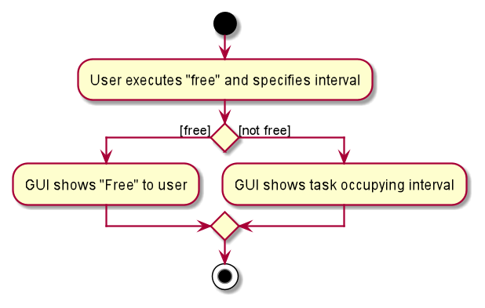
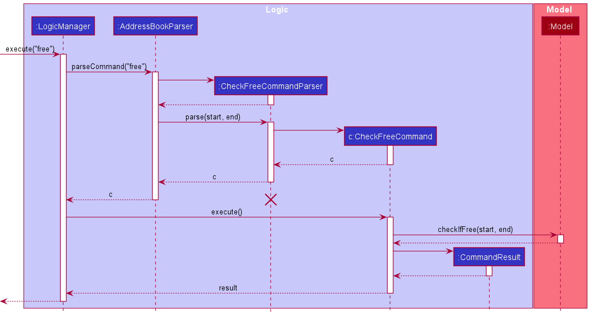
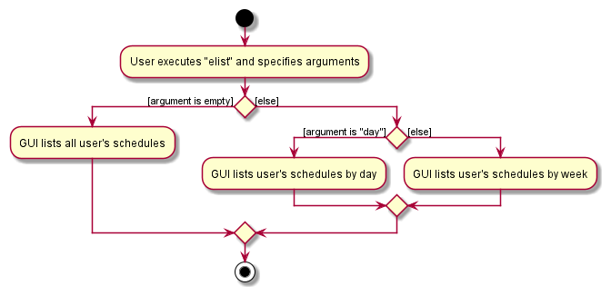
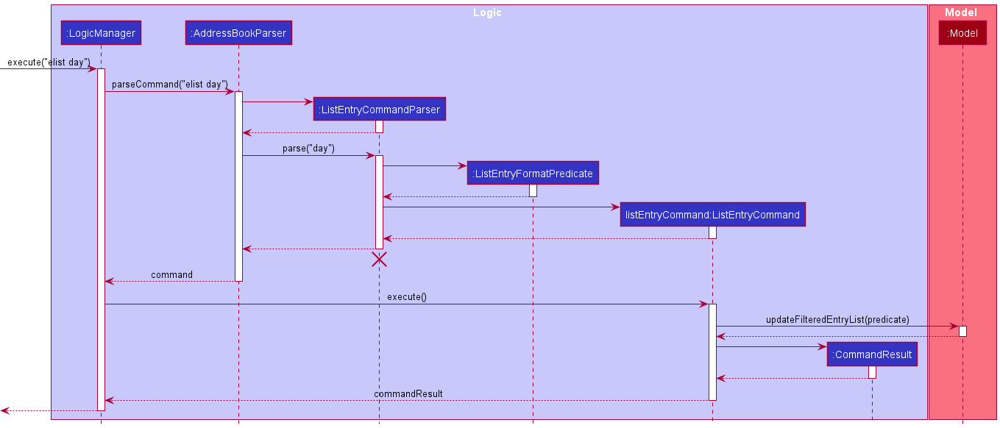

* Table of Contents
  {:toc}

--------------------------------------------------------------------------------------------------------------------

## **Setting up, getting started**

Refer to the guide [_Setting up and getting started_](SettingUp.md).

--------------------------------------------------------------------------------------------------------------------

# Design

## Architecture

The ***Architecture Diagram*** given above explains the high-level design of the App. Given below is a quick overview of each component.

**`Main`** has two classes called [`Main`](https://github.com/AY2021S2-CS2103T-W13-4/tp/blob/master/src/main/java/seedu/address/Main.java) and [`MainApp`](https://github.com/AY2021S2-CS2103T-W13-4/tp/blob/master/src/main/java/seedu/address/MainApp.java). It is responsible for,
* At app launch: Initializes the components in the correct sequence, and connects them up with each other.
* At shut down: Shuts down the components and invokes cleanup methods where necessary.

[**`Commons`**](#common-classes) represents a collection of classes used by multiple other components.

The rest of the App consists of four components.

* [**`UI`**](#ui-component): The UI of the App.
* [**`Logic`**](#logic-component): The command executor.
* [**`Model`**](#model-component): Holds the data of the App in memory.
* [**`Storage`**](#storage-component): Reads data from, and writes data to, the hard disk.

Each of the four components,

* defines its *API* in an `interface` with the same name as the Component.
* exposes its functionality using a concrete `{Component Name}Manager` class (which implements the corresponding API `interface` mentioned in the previous point.

---

**How the architecture components interact with each other**

The ***Sequence Diagram*** below shows how the components interact with each other for the scenario where the user issues the command `cdelete 1`.

The sections below give more details of each component.

---

### UI Component

**API** :
[`Ui.java`](https://github.com/AY2021S2-CS2103T-W13-4/tp/blob/master/src/main/java/seedu/address/ui/Ui.java)

The UI consists of a `MainWindow` that is made up of parts e.g.`CommandBox`, `ResultDisplay`, `ContactListPanel`, `StatusBarFooter` etc. All these, including the `MainWindow`, inherit from the abstract `UiPart` class.

The `UI` component uses JavaFx UI framework. The layout of these UI parts are defined in matching `.fxml` files that are in the `src/main/resources/view` folder. For example, the layout of the [`MainWindow`](https://github.com/AY2021S2-CS2103T-W13-4/tp/blob/master/src/main/java/seedu/address/ui/MainWindow.java) is specified in [`MainWindow.fxml`](https://github.com/AY2021S2-CS2103T-W13-4/tp/blob/master/src/main/resources/view/MainWindow.fxml)

The `UI` component,

* Executes user commands using the `Logic` component.
* Listens for changes to `Model` data so that the UI can be updated with the modified data.

---

### Logic component

**API** :
[`Logic.java`](https://github.com/AY2021S2-CS2103T-W13-4/tp/blob/master/src/main/java/seedu/address/logic/Logic.java)

1. `Logic` uses the `TeachingAssistantParser` class to parse the user command.
1. This results in a `Command` object which is executed by the `LogicManager`.
1. The command execution can affect the `Model` (e.g. adding a person).
1. The result of the command execution is encapsulated as a `CommandResult` object which is passed back to the `Ui`.
1. In addition, the `CommandResult` object can also instruct the `Ui` to perform certain actions, such as displaying help to the user.

Given below is the Sequence Diagram for interactions within the `Logic` component for the `execute("cdelete 1")` API call.

---

### Model component

**API** : [`Model.java`](https://github.com/AY2021S2-CS2103T-W13-4/tp/blob/master/src/main/java/seedu/address/model/Model.java)

The `Model`,

* stores a `UserPref` object that represents the user’s preferences.
* stores Teaching Assistant data.
* exposes an unmodifiable `ObservableList<Contact>` and `ObservableList<Entry>` that can be 'observed' e.g. the UI can be bound to this list so that the UI automatically updates when the data in the list change.
* does not depend on any of the other components.

---

### Storage component

**API** : [`Storage.java`](https://github.com/AY2021S2-CS2103T-W13-4/tp/blob/master/src/main/java/seedu/address/storage/Storage.java)

The `Storage` component,
* can save `UserPref` objects in json format and read it back.
* can save Teaching Assistant data in json format and read it back.

---

### Common Classes

Classes used by multiple components are in the `seedu.ta.commons` package.

---

# Implementation

This section describes some noteworthy details on how certain features are implemented.

### Enquire if time interval is free

The free command mechanism provides users a quick way to find out if certain time intervals are available.

An outline of the proposed implementation is as follows:

The `TeachingAssistantParser` should accept another case of command word `free` which eventually returns `FreeCommand`
back to Logic Manager.

This command is then executed to return `CommandResult` which is either shown on the result display of the GUI as:

* "You're Free!"
* Or "Sorry, you're not free. Entries occupying that time interval listed below!". The occupying entries are shown in
  the entry list at the main window.

The following activity diagram summarizes what happens when a user executes the new command:

The implementation of this command is similar to the List Command but requires a new predicate class to be created.
A `ListOccupyingEntryPredicate` class is implemented that provides a predicate that accepts user provided start and end
interval. The predicate is provided to `ModelManager#updateFilteredEntryList` and updates the entry list according to
the condition under `ListOccupyingEntryPredicate#test`.

The following sequence diagram outlines how the free operation works:

:information_source: **Note:** Details about creation of `ListOccupyingEntryPredicate`
has been ommitted for simplicity.

### [Proposed] Merge Schedule and Task

The proposed merger attempts to combine the functionalities of both the Task and Schedule classes. \
As the Task and Schedule classes are similar in features, we can merge them into an Entry class for maintainability.

Previously, we allowed schedules and tasks to be added separately through using two commands, `sadd` and `tadd`. \
Combining them into an Entry task, we propose a "eadd" command.

Below, we can see the before and after activity diagrams involving this merger.

**Before:** \

**After:** \

### Filtering entries via tags

Following the proposal above, there were no commands that utilise the tags attached to the objects. Hence,
this proposal aims to allow filtering these entries via their tags.

The Model class will be required to implement the `updateFilteredEntryList` which can incorporate
`updateFilteredTaskList` or `updateFilteredScheduleList` implemented in the previous two classes. This method will then
accept an argument of type `EntryTagContainsKeywordsPredicate`.

The following diagram omits the parser object created, namely `FilterEntryCommandParser` for simplicity.

**Design consideration**

1. Allow filtering by more than one tag.
1. Decide whether the filtering above considers Union or Intersection of tags.

### List entry feature

The proposed list entry mechanism allows users to see all of their schedules, or see them by day or by week.

An outline of the proposed implementation is as follows:

The `TeachingAssistantParser` should accept another case of command word `elist` which eventually returns a `ListEntryCommand` 
back to `LogicManager`. This command can take in three arguments: an empty string, the string “day” or the string “week”. 
The arguments will be parsed by the `ListEntryCommandParser` to determine the behaviour of `ListEntryFormatPredicate`.
Then, `updateFilteredEntryList` method in the `Model` interface is called, passing in the `ListEntryFormatPredicate` as 
an argument.

The following activity diagram (Fig 2.3.1) summarizes what happens when a user executes the list entry command.

Fig 2.3.1

The following sequence diagram (Fig 2.3.2) shows how the list entry operation works:

Fig 2.3.2

### Clear overdue entry feature
Clear overdue entry feature allows users to quickly discard entries that are no longer relevant. i.e. entries with end dates
that have passed.

An outline of the implementation is as follows:

The `TeachingAssistantParser` should accept another case of command word `eclear` which eventually returns a
`ClearOverdueEntryCommand` back to `LogicManager`. This command has no arguments and will immediately call
`clearOverdueEntries` method in `Model` interface. Finally, a new `CommandResult` is created to handle the result
of this command.

The following sequence diagram (Fig 2.3.3) shows how clear overdue entry command works:

Fig 2.3.3

The following activity diagram (Fig 2.3.4) shows how `Model` executes `clearOverdueEntries`:

# Appendix: Requirements

## Product Scope

**Target user profile**:

* Are JC/Secondary school teachers
* Do not have their schedules and students' contacts digitalised
* Prefer to use typing over mouse/voice commands

**Value proposition**: efficient tool to keep track of schedules and tasks as well as find and add student contact
information easily.

---

## User Stories

### Contacts

Priority | As a... | I want to... | So that I can...
--- | --- | --- | ---
high | teacher | add a contact | have a consolidated list of contacts that I require
high | teacher | delete a contact | remove a contact I no longer need
medium | teacher | edit a contact | modify contact details without going through the tedious process of removing and re-adding the contact
high | teacher | find and view a contact based on name | quickly find the details of a specific contact I need
high | teacher | list all contacts | keep track of the contacts of all the people I have saved
medium | teacher | filter contacts via tags | categorise and find a group of contacts easily

### Schedules

Priority | As a... | I want to... | So that I can...
--- | --- | --- | ---
high | teacher | add an event into my schedule | have a consolidated list of events
high | teacher | delete an event from my schedule | remove events that have been cancelled
medium | teacher | edit an event in my schedule | modify event details without going through the tedious process of removing and re-adding the event
high | teacher | list my schedule according to day/week | view my schedule in a more organised way
high | teacher | find and view an event based on name | see the details of an event I have saved
low | teacher | list all the timings in my schedule when I am free | check the timings when I am free
low | teacher | view all events in my schedule for a specific time period | check if I am free during that timing
medium | teacher | filter events via tags | categorise and find events easily
medium | teacher | mark and event as done | keep track of what events are remaining
medium | teacher | link a contact with my schedule if necessary | easily access the contact details of the person relevant to my schedule
low | teacher | get notified of upcoming schedules on the same day | be reminded of upcoming events

### Tasks

Priority | As a... | I want to... | So that I can...
--------- | --------- | -------------- | -----------------
high | teacher | add a task into my tasks list | have a consolidated list of my tasks
high | teacher | delete a task from my tasks list | I can remove tasks that I no longer have to do
medium | teacher | edit a task in my tasks list | modify task details without going through the tedious process of removing and re-adding it
high | teacher | list my tasks according to module/week/day | view my tasks in a more organised way
high | teacher | find and view a task by name | see the details of a task I have saved
medium | teacher | filter for tasks via tags | categorise and find tasks easily

### Others

Priority | As a... | I want to... | So that I can...
--------- | --------- | -------------- | -----------------
high | forgetful user | be prompted for the commands’ syntax | type all commands without memorising their syntax
medium | teacher | access the guide or the commands list | eliminate the need to memorise all the commands
low | teacher | confirm crucial commands with a confirmation message | avoid entering the wrong command
low | user adopting this products | clear all my contacts from Teaching Assistant | clear dummy data easily when I use the app for testing

---

## Use Cases
(For all use cases below, the **System** is the `Teaching Assistant` and the **Actor** is the `user`, unless specified otherwise)

### Use case: UC01 - Add a contact

**MSS**

1. User requests to add a contact
2. Teaching Assistant adds the contact into the list

   Use case ends.

**Extensions**

* 2a. The given field(s) are invalid.

    * 2a1. Teaching Assistant shows an error message 
      
      Use case ends.

* 2b. The contact to be added already exists in Teaching Assistant.

    * 2b1. Teaching Assistant shows an error message.

      Use case ends.

 

### Use case: UC02 - Delete an Entry

**MSS**

1. User requests to list entries **(UC03)**
2. Teaching Assistant shows a list of entries
3. User requests to delete a specific entry in the list
4. Teaching Assistant deletes the specified entry
   
   Use case ends.

**Extensions**

* 2a. The list of entries is empty.
  
    Use case ends.

* 3a. The given index is invalid
    * 3a1. Teaching Assistant shows an error message.
    
        Use case ends.

 

### Use case: UC03 - List entries

**MSS**

1. User requests to list entries.
2. Teaching Assistant shows a list of entries.
   
   Use case ends.

**Extensions**

* 1a. User requests to list entries that occurs today.

    * 1a1. Teaching Assistant shows a list of entries that happen today.
      
      Use case ends.

* 1b. User requests to list entries that occurs this week.

    * 1b1. Teaching Assistant shows a list of entries that occurs this week

        Use case ends.
    
* 1c. The given parameter is invalid.

    * 1c1. Teaching Assistant shows an error message.
    
        Use case ends.

 

### Use case: UC04 - Check if user is free on a given timeslot

**MSS**

1. User requests to if he/she is free on a given timeslot.
2. Teaching Assistant replies that the user is free.

    Use case ends.

* 1a. The given timeslot is invalid.

    * 1a1. Teaching Assistant shows an error message.
    
        Use case ends
    
* 1b. The user is not free on the given timeslot.

    * 1b1. Teaching Assistant replies that the user is not free.
      
    * 1b2. Teaching Assistant shows a list of entries that coincide with the given timeslot.
    
        Use case ends

### Use case: UC05 - Find a contact

**MSS**

1. User requests to find a contact with specified keyword(s)
2. Teaching Assistant replies to the user contacts that matches the keyword(s)

   Use case ends.

* 1a. The given keyword(s) are invalid

    * 1a1. Teaching Assistant shows an error message.
    
      Use case ends

* 2a. No contact matches the specified keyword(s).

    * 2a1. Teaching Assistant shows an empty list.

      Use case ends

---

## Non-Functional Requirements

1. Should work on any mainstream OS as long as it has Java 11 or above installed.
2. A user with above average typing speed for regular English text (i.e. not code, not system admin commands) should be
   able to accomplish most of the tasks faster using commands than using the mouse.
3. The system should be usable by a novice who has never used virtual management applications.
4. The user interface should be intuitive enough for users who are not IT-savvy.
5. The product is offered as an open source software.

---

## Glossary

### JC

Junior College (JC) is the post-secondary education level where students are preparing for university. JC is also the
high-school equivalent in other countries. Hence, JC teachers may be packed with consultation schedules which can
leverage our software.

### Mainstream OS

Mainstream operating systems are the current operating systems with a significant market share, namely Windows, Linux,
Unix, and OS-X.

### MSS

Main Success Scenario (MSS) defines the optimal outcome of our commands, i.e. in the case where no errors occurred.

---

