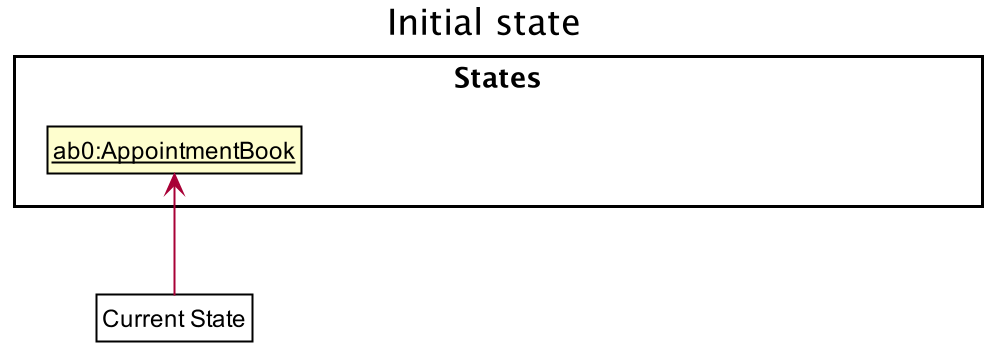
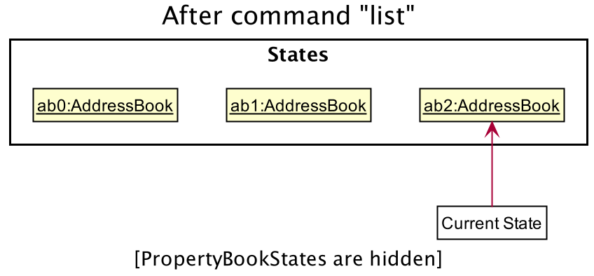
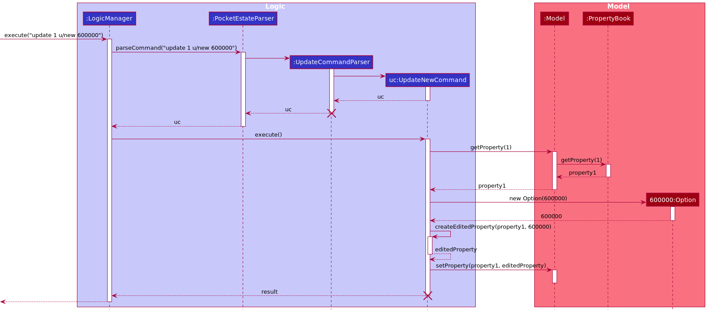

Welcome to the PocketEstate Developer Guide! This guide will take you through the underlying components that make up PocketEstate, and provide the essential information required for you to get started with becoming a PocketEstate developer.

## Table of Contents
{: .no_toc}

* Table of Contents 
{:toc}

--------------------------------------------------------------------------------------------------------------------

## **1. Setting up, getting started**

Please refer to the guide [_Setting up and getting started_](SettingUp.md) to learn how to set up this project in your computer.

--------------------------------------------------------------------------------------------------------------------

## **2. Design**

### 2.1 Architecture

The ***Architecture Diagram*** given above explains the high-level design of the App. Given below is a quick overview of each component.

:bulb: **Tip:** The `.puml` files used to create diagrams in this document can be found in the [diagrams](https://github.com/AY2021S2-CS2103T-T13-4/tp/tree/master/docs/diagrams/) folder. Refer to the [_PlantUML Tutorial_ at se-edu/guides](https://se-education.org/guides/tutorials/plantUml.html) to learn how to create and edit diagrams.

**`Main`** has two classes called [`Main`](https://github.com/AY2021S2-CS2103T-T13-4/tp/blob/master/src/main/java/seedu/address/Main.java) and [`MainApp`](https://github.com/AY2021S2-CS2103T-T13-4/tp/blob/master/src/main/java/seedu/address/MainApp.java). It is responsible for,
* At app launch: Initializes the components in the correct sequence, and connects them up with each other.
* At shut down: Shuts down the components and invokes cleanup methods where necessary.

[**`Commons`**](#common-classes) represents a collection of classes used by multiple other components.

The rest of the App consists of four components.

* [**`UI`**](#ui-component): The UI of the App.
* [**`Logic`**](#logic-component): The command executor.
* [**`Model`**](#model-component): Holds the data of the App in memory.
* [**`Storage`**](#storage-component): Reads data from, and writes data to, the hard disk.

Each of the four components,

* defines its *API* in an `interface` with the same name as the Component.
* exposes its functionality using a concrete `{Component Name}Manager` class (which implements the corresponding API `interface` mentioned in the previous point.

For example, the `Logic` component (see the class diagram given below) defines its API in the `Logic.java` interface and exposes its functionality using the `LogicManager.java` class which implements the `Logic` interface.

**How the architecture components interact with each other**

The *Sequence Diagram* below shows how the components interact with each other for the scenario where the user issues the command `delete property 1`.

The sections below give more details of each component.

### 2.2 UI component

:information_source: **Note:** Due to the limitation of PlantUML, some triangles that are used to indicate class inheritance may overlap with each other.

**API** :
[`Ui.java`](https://github.com/AY2021S2-CS2103T-T13-4/tp/blob/master/src/main/java/seedu/address/ui/Ui.java)

The UI consists of a `MainWindow` that is made up of parts e.g.`CommandBox`, `ResultDisplay`, `PropertyListPanel`, `AppointmentListPanel` etc. All these, including the `MainWindow`, inherit from the abstract `UiPart` class.

The `UI` component uses JavaFx UI framework. The layout of these UI parts are defined in matching `.fxml` files that are in the `src/main/resources/view` folder. For example, the layout of the [`MainWindow`](https://github.com/AY2021S2-CS2103T-T13-4/tp/blob/master/src/main/java/seedu/address/ui/MainWindow.java) is specified in [`MainWindow.fxml`](https://github.com/AY2021S2-CS2103T-T13-4/tp/blob/master/src/main/resources/view/MainWindow.fxml)

The `UI` component,

* Executes user commands using the `Logic` component.
* Listens for changes to `Model` data so that the UI can be updated with the modified data.

### 2.3 Logic component

**API** :
[`Logic.java`](https://github.com/AY2021S2-CS2103T-T13-4/tp/blob/master/src/main/java/seedu/address/logic/Logic.java)

1. `Logic` uses the `PocketEstateParser` class to parse the user's input command.
1. Depending on the command string passed in by the user,
   * a specific command parser (e.g. `AddPropertyCommandParser`) may be created to parse the input arguments to produce the corresponding `Command` object, or
   * the `Command` object can be directly created for some commands (e.g. `HelpCommand`).
1. The `Command` object is then executed by the `LogicManager`.
1. The command execution can affect the `Model` (e.g. adding a property, deleting a property).
1. The result of the command execution is encapsulated as a `CommandResult` object, which is passed back to the `Ui`. The feedback to the user is then displayed to the user.
1. In addition, the `CommandResult` object can also instruct the `Ui` to perform certain actions, such as displaying help to the user.

Given below is the Sequence Diagram for interactions within the `Logic` component for the `execute("add property n/Bishan t/Hdb a/Blk 150 Bishan Street 11 #02-101 p/570150 d/30-06-2021")` API call.

:information_source: **Note:** The lifeline for `AddPropertyCommandParser` should end at the destroy marker (X) but due to a limitation of PlantUML, the lifeline reaches the end of diagram.

### 2.4 Model component

**API** : [`Model.java`](https://github.com/AY2021S2-CS2103T-T13-4/tp/blob/master/src/main/java/seedu/address/model/Model.java)

:information_source: **Note:** Due to the limitation of PlantUML, some multiplicities and association roles may be slightly out of place.

The `Model`,

* stores a `UserPrefs` object that represents the user’s preferences, such as
  * the preferred GUI settings (e.g. window size of the app)
  * the preferred storage filepath for the property book
  * the preferred storage filepath for the appointment book
* stores the property book and appointment book data
* exposes an unmodifiable `ObservableList<Property>` and an unmodifiable `ObservableList<Appointment>` that can be 'observed' e.g. the UI can be bound to this list so that the UI automatically updates when the data in the list change
* does not depend on any of the other three components

### 2.5 Storage component

**API** : [`Storage.java`](https://github.com/AY2021S2-CS2103T-T13-4/tp/blob/master/src/main/java/seedu/address/storage/Storage.java)

The `Storage` component,
* can save `UserPrefs` objects in json format and read it back.
* can save the appointment book data in json format and read it back.
* can save the property book data in json format and read it back.

### 2.6 Common classes

Classes used by multiple components are in the `seedu.address.commons` package.

Some examples of common classes:

* [`Messages.java`](https://github.com/AY2021S2-CS2103T-T13-4/tp/blob/master/src/main/java/seedu/address/commons/core/Messages.java): Container for user visible messages
* [`FileUtil.java`](https://github.com/AY2021S2-CS2103T-T13-4/tp/blob/master/src/main/java/seedu/address/commons/util/FileUtil.java): Writes and reads files
* [`JsonUtil.java`](https://github.com/AY2021S2-CS2103T-T13-4/tp/blob/master/src/main/java/seedu/address/commons/util/JsonUtil.java): Converts a Java object instance to JSON and vice versa

--------------------------------------------------------------------------------------------------------------------

## **3. Implementation**

This section describes some noteworthy details on how certain features are implemented.

### 3.1 Property component

:information_source: **Note:** Due to the limitation of PlantUML, some solid diamonds that are used to denote composition may overlap with each other.

#### 3.1.1 Current Implementation

A `Property` is stored in a `UniquePropertyList`, which ensures that there are no duplicate properties in the `PropertyBook`. Each `Property` is uniquely identified by its pair of `Address` and `PostalCode`.

A `Property consists of the following mandatory attributes,
  * a `Name`: the name of the property
  * a `Type`: the housing type of the property (HDB , Condo , Landed , etc.)
  * an `Address`: the address of the property
  * a `PostalCode`: the postal code of the property
  * a `Deadline`: the property's deadline for selling

and the following optional attributes,
  * a `Remark`: a note about the property
  * a `Status`: represents the current stage of the selling (Option, Sales Agreement, Completion)
  * a `Client`: represents the seller of the property
  * a `Tag` set: a set of zero or more `Tag` objects describing the property

A `Client` consists of at least one of the following attributes,
  * a `Name`: the name of the client
  * a `Contact`: the contact number of the client
  * an `Email`: the email of the client
  * an `AskingPrice`: the asking price of the client

#### 3.1.2 Design Consideration

##### Aspect: How each attribute of `Property` is stored

* **Current implementation:** Each attribute of `Property` is immutable. When a property is to be edited, a new `Property` containing the updated fields will be created to replace the original `Property` object.
    * Pros: Prevent accidental modification of a `Property` object (less prone to bugs)
    * Cons: More code to be written as a separate `Property` object has to be created for each edit operation

* **Alternative:** Allow mutable `Property` objects (provide setter methods to update the attributes of a `Property`)
    * Pros: Easy to implement
    * Cons: More prone to bugs

##### Aspect: How each tag is stored

* An alternative (arguably, a more OOP) model is given below. It has a `Tag` list in the `PropertyBook`, which `Property` references. This allows `PropertyBook` to only require one `Tag` object per unique `Tag`, instead of each `Property` needing their own `Tag` object.
    * Pros: Prevents creating the same tag multiple times when each `Property` needs to refer to the tag
    * Cons: Harder to implement

### 3.2 Appointment component

#### 3.2.1 Current Implementation

An `Appointment` is stored in a `UniqueAppointmentList`, which ensures that there are no duplicate appointments in the `AppointmentBook`. Each `Appointment` is uniquely identified by its pair of `Date` and `Time`.

An `Appointment` consists of the following mandatory attributes,
* a `Name`: the name of the appointment
* a `Remark`: a note about the appointment
* a `Date`: the date of the appointment
* a `Time`: the time of the appointment

#### 3.2.2 Design Consideration

##### Aspect: How each attribute of `Appointment` is stored

Similar design considerations as [how each attribute of `Property` is stored](#aspect-how-each-attribute-of-property-is-stored)

### 3.3 Undo feature

#### 3.3.1 Current Implementation

The undo mechanism is facilitated by `PocketEstate`. It implements the undo feature with an undo history, stored internally as `previousAppointmentLists` and `previousPropertyLists` respectively.

* `AppointmentBook#undo()` — Restores the previous appointment book state from its history.
* `PropertyBook#undo()` — Restores the previous property book state from its history.

These operations are exposed in the `Model` interface as `Model#undoAppointmentBook()` and `Model#undoPropertyBook()` respectively.

Given below is an example usage scenario and how the undo mechanism behaves at each step.

Step 1. The user launches the application for the first time. The `PocketEstate` will be initialized with the initial appointment book state and property book state, and the currentAppointmentBookStatePointer currentPropertyBookStatePointer pointing to the two initial book states respectively.

Step 2. The user executes `delete appointment 1` command to delete the 1st appointment in the appointment book. The `delete appointment` executes `previousAppointmentLists.push(new ArrayList<>(appointments.asUnmodifiableObservableList()))`, causing the previous state of the appointment book before the `delete appointment 1` command executes to be saved in the `previousAppointmentLists`, and the currentAppointmentBookStatePointer still points to the current appointment book state.

Step 3. The user executes `add appointment …​` to add a new appointment. The `add appointment` command also executes `previousAppointmentLists.push(new ArrayList<>(appointments.asUnmodifiableObservableList()))`, causing a copy of the current appointment book state to be saved into the `previousAppointmentLists`.

:information_source: **Note:** If a command fails its execution, it will not executes `previousAppointmentLists.push(new ArrayList<>(appointments.asUnmodifiableObservableList()))`, so the appointment book state will not be saved into the `previousAppointmentLists`.

Step 4. The user now decides that adding the appointment was a mistake, and decides to undo that action by executing the `undo` command. The `undo` command will call `Model#undoAppointmentBook()`, which will shift the `currentAppointmentBookStatePointer` to the most recently saved state, pointing it to the previous appointment book state, and restores the appointment book to that state.

:information_source: **Note:** If the `previousAppointmentLists` is empty, then there are no previous AppointmentBook states to restore. The `undo` command uses `commandHistory.empty()` to check if this is the case. If so, it will return an error to the user rather than attempting to perform the undo.

The following sequence diagram shows how the undo operation works:

Step 5. The user then decides to execute the command `list`. Commands that do not modify the appointment book, such as `list`, will usually not executes `previousAppointmentLists.push(new ArrayList<>(appointments.asUnmodifiableObservableList()))`. Thus, the `previousAppointmentLists` remains unchanged.

The following activity diagram summarizes what happens when a user executes a new command:

#### 3.3.2 Design consideration:

##### Aspect: How undo executes

* **Alternative 1 (current choice):** Saves the entire appointment/property book.
  * Pros: Easy to implement.
  * Cons: May have performance issues in terms of memory usage.
    
* **Alternative 2:** Saves only changes made by previous commands (Similar to commit and restore in version control).
  * Pros: Will use less memory (e.g. for `delete`, may only save the appointment/property being deleted, and the deleted appointment/property is added back if the command is undone).
  * Cons: Difficult to implement, different implementations are required to restore different changes.
    
### 3.4 Update feature

#### 3.4.1 Current Implementation

The update mechanism is facilitated by `PocketEstate`. It implements the update feature with 3 parts, the `Status` field in `Property`, a `UpdateCommandParser` and `UpdateCommand`.

The `Status` field consists of a `Status` interface with a `next()` method that returns a `Status` representing the next stage of the property selling process. There are 3 classes that implement `Status`, `Option`, `SalesAgreement` and `Completion`. Each class takes in an `Offer` which represents the price that was offered for the property.

* `Option` — Represents the stage where the buyer exercises the Option to Purchase.
* `SalesAgreement` — Represents the stage where the buyer is considering the Sales and Purchase Agreement.
* `Completion` — Represents the stage where the property has been sold.

The `UpdateCommand` is assisted by 3 subcommands that extend the abstract class `UpdateCommand` which itself extends `Command`. The subcommands are, `UpdateNewCommand`, `UpdateProceedCommand` and `UpdateCancelCommand`. The subcommands help execute on the model when the user calls `u/new`, `u/proceed` or `u/cancel` respectively.

* `UpdateNewCommand` — Takes in an `Index` and an Amount to create a new `Status` with the given Amount for the property at the given `Index`.
* `UpdateProceedCommand` — Takes in an `Index` and moves the `Status` of the property at the given `Index` to the next `Status` if applicable.
* `UpdateNewCommand` — Takes in an `Index` and removes the `Status` of the property at the given `Index` if applicable.

Given below is an example usage scenario and how the update mechanism behaves at each step.

Step 1. The user launches the application for the first time. The `PocketEstate` will be initialized with the initial appointment book state and property book state.

Step 2. The user executes `update 1 u/new 600,000` command to add a new status with value 600,000 to the first property.

Step 3. The user executes `update 1 u/proceed` to move the `Status` of the first property to `SalesAgreement`.

Step 4. The user executes `update 1 u/proceed` to move the `Status` of the first property to `Completion`.

Step 5. The user then decides that having the `Completion` status on the first property was a mistake and executes the command `update 1 u/cancel`.

#### 3.4.2 Design consideration:

##### Aspect: How Update executes

The following activity diagram summarizes what happens when a user executes an `UpdateCommand`:

The following sequence diagram shows how the update operation works:

--------------------------------------------------------------------------------------------------------------------

## **4. Documentation, logging, testing, configuration, dev-ops**

* [Documentation guide](Documentation.md)
* [Testing guide](Testing.md)
* [Logging guide](Logging.md)
* [Configuration guide](Configuration.md)
* [DevOps guide](DevOps.md)

--------------------------------------------------------------------------------------------------------------------

## **Appendix A: Product scope**

**Target user profile**:

* property agent who has a need to manage a significant number of properties and appointments
* prefer desktop apps over other types
* can type fast
* prefers typing to mouse interactions
* is reasonably comfortable using CLI apps

**Value proposition**: PocketEstate enables easy organization of mass clientele property information through sorting of information by price, location and housing type, that may otherwise be difficult to manage.

## **Appendix B: User Stories**

Priorities: High (must have) - `* * *`, Medium (nice to have) - `* *`, Low (unlikely to have) - `*`

| Priority | As a …​                                 | I want to …​                                                            | So that I can…​                                                                        |
| -------- | ------------------------------------------ | -------------------------------------------------------------------------- | ----------------------------------------------------------------------------------------- |
| `* * *`  | new user                                   | see usage instructions                                                     | refer to instructions when I forget how to use the App                                    |
| `* * *`  | user                                       | be able to add a property                                                  | keep track of my clients' properties                                                      |
| `* * *`  | user                                       | be able to add an appointment                                              | keep track of my upcoming schedule                                                        |
| `* * *`  | user                                       | list all properties on sale                                                | know the number of properties that I have to sell                                         |
| `* * *`  | user                                       | list all appointments I have                                               | know all the meetings I have                                                              |
| `* * *`  | user                                       | view all properties and appointments side by side                          | simultaneously view related property and appointment data                                 |
| `* * *`  | user                                       | view the notes/special remarks of a seller                                 | so that I keep in mind special considerations when negotiating with a potential buyer.    |
| `* * *`  | user                                       | identify properties with expired deadlines                                 | focus on current properties that I have to sell                                           |
| `* * *`  | user                                       | view the client asking price of a property                                 | keep the price in mind when negotiating with the buyer                                    |
| `* *`    | user                                       | edit the address of the property listing                                   | change the address of the property when I have made a mistake                             |
| `* *`    | user                                       | search for properties based on some criteria                               | easily filter out the properties I want to see                                            |
| `* *`    | user                                       | search for appointments based on some criteria                             | easily filter out the appointments I want to see                                          |
| `* *`    | user                                       | search for all appointments and properties related to a client             | easily find out any appointments with a client and what properties they are interested in |
| `* *`    | potential user exploring the app           | see the app populated with sample data                                     | easily see how the app looks like when it is in use                                       |
| `* *`    | careless user                              | be able to categorize housing information based on predefined tags         | prevent typos while keying in information and avoid storing the wrong information         |
| `* *`    | user                                       | update the status of property listings(completed, Option, Sale Agreement)  | follow up with clients on time                                                            |
| `* *`    | user                                       | edit the deadline of the property listing                                  | extend the time period for selling the property                                           |
| `* *`    | user                                       | edit the name of the property listing                                      | change the name of the property when I have made a mistake                                |
| `* *`    | user                                       | edit the address of the property listing                                   | change the address of the property when I have made a mistake                             |
| `* *`    | user                                       | edit the address of the property listing                                   | change the address of the property when I have made a mistake                             |

## **Appendix C: Use Cases**

(For all use cases below, the **System** is the `PocketEsate` app, and the **Actor** is the `user`, unless specified otherwise)

**Use case: UC01 - Add a property**

**MSS**

1. User request to add a property
2. PocketEstate shows an updated list of properties

   Use case ends.

**Extensions**

* 1a. The property to be added has missing required fields.

    * 1a1. PocketEstate shows an error message.

      Use case ends.

* 1b. The property to be added has a deadline that is already over.

    * 1b1. PocketEstate shows an error message.

      Use case ends.

**Use case: UC02 - Add an appointment**

**MSS**

1. User request to add an appointment
2. PocketEstate shows an updated list of appointments

   Use case ends.

**Extensions**

* 1a. The appointment to be added has missing required fields.

    * 1a1. PocketEstate shows an error message.

      Use case ends.

* 1b. The appointment to be added has a date and time that is already over.

    * 1b1. PocketEstate shows an error message.

      Use case ends.

**Use case: UC03 - Listing all properties and appointments**

**MSS**

1. User requests to list all properties and appointments.
2. PocketEstate shows the entire list of properties and appointments.

    Use case ends.

**Extensions**

* 1a. List command used has unrecognized fields.

    * 1a1. PocketEstate shows an error message.

      Use case ends.

**Use case: UC04 - Edit a property**

**MSS**

1. User request to edit a property
2. PocketEstate shows an updated list of properties

   Use case ends.

**Extensions**

* 1a. The property to be edited has unrecognized fields.

    * 1a1. PocketEstate shows an error message with the unrecognized fields.

      Use case ends.

* 1b. The property to be edited has a deadline that is already over.

    * 1b1. PocketEstate shows an error message.

      Use case ends.

**Use case: UC05 - Edit an appointment**

**MSS**

1. User request to edit an appointment
2. PocketEstate shows an updated list of appointments

   Use case ends.

**Extensions**

* 1a. The appointment to be edited has unrecognized fields.

    * 1a1. PocketEstate shows an error message with the unrecognized fields.

      Use case ends.

* 1b. The appointment to be edited has a date and time that is already over.

    * 1b1. PocketEstate shows an error message.

      Use case ends.

**Use case: UC06 - Update status of a property**

**MSS**

1. User request to update status of a property
2. PocketEstate shows an updated list of properties

   Use case ends.

**Extensions**

* 1a. The property to be updated has incorrect fields.

    * 1a1. PocketEstate shows an error message.

      Use case ends.

**Use case: UC07 - Searching for property**

**MSS**
1. User requests to search for properties of a certain type.
2. PocketEstate shows a list of properties that are of that type.

    Use case ends.

**Use case: UC08 - Searching for appointment**

**MSS**
1. User requests to search for appointments with a certain person.
2. PocketEstate shows a list of all appointments with that person.

    Use case ends.

## **Appendix D: Non-Functional Requirements**

1. Should work on any _mainstream OS_ as long as it has Java `11` or above installed.
2. A user with above average typing speed for regular English text (i.e. not code, not system admin commands) should be able to accomplish most of the tasks faster by using commands over the mouse.
3. Should be able to hold up to 500 properties and 500 appointments concurrently without a noticeable sluggishness in performance for typical usage.
4. The app should respond within two seconds after each user command.
5. The GUI of the app should clearly differentiate the different property types (HDB , Condo , Landed , etc.) of each property in the list.
6. The app should be able to run without internet connection.
7. The app should be resizable and can be enlarged to the maximum window width.
8. There should be sample data in the app when the user opens the app for the first time.

## **Appendix E: Glossary**

* **Mainstream OS**: Windows, Linux, Unix, OS-X
* **Property**: A property listing with mandatory attributes: Name, Property type, Address, Postal code, Deadline, and with optional attributes: Remarks, Status, Client name, Client contact, Client email, Client asking price, a set of Tags (containing 0 or more tags)
* **Appointment**: An appointment listing with mandatory attributes: Name, Remarks, Date, Time

--------------------------------------------------------------------------------------------------------------------

## **Appendix F: Instructions for manual testing**

Given below are instructions to test the app manually.

:information_source: **Note:** These instructions only provide a starting point for testers to work on;
testers are expected to do more *exploratory* testing.

### Launch and shutdown

1. Initial launch

   1. Download the jar file and copy into an empty folder

   1. Double-click the jar file Expected: Shows the GUI with a set of sample properties and appointments. The window size may not be optimum.

1. Saving window preferences

   1. Resize the window to an optimum size. Move the window to a different location. Close the window.

   1. Re-launch the app by double-clicking the jar file. 
       Expected: The most recent window size and location is retained.
      
1. Exiting

   1. Prerequisites: The application is running.

   1. Test case: `exit`  
      Expected: App shuts down.

### Adding a property

1. Adding a new unique property.

   1. Prerequisites: None of the current properties in the app has an (address, postal code) pair of  (`Blk 150 Bishan Street 11 #02-101`, `570150`)

   1. Test case: `add property n/Bishan t/Hdb a/Blk 150 Bishan Street 11 #02-101 p/570150 d/30-06-2021`  
      Expected: A new property is added to the property list. The result display panel shows the details of the newly added property.

   1. Test case: `add property`  
      Expected: No property is added. An error message `Invalid command format!` is shown in the result display.

   1. Other incorrect add property commands to try: `add property n/Bishan`, `add property t/Condo`  
      Expected: No property is added. An error message `Invalid command format!` is shown in the result display.

1. Adding a duplicate property.

   1. Prerequisites: A property with an (address, postal code) pair of (`Blk 150 Bishan Street 11 #02-101`, `570150`) already exist in the app.

   1. Test case: `add property n/Bishan t/Hdb a/Blk 150 Bishan Street 11 #02-101 p/570150 d/30-06-2021`  
      Expected: No property is added. An error message `This property already exists in the app` is shown in the result display.

### Adding an appointment

1. Adding a new unique appointment.

    1. Prerequisites: None of the current appointments in the app has a (date, time) pair of  (`19-05-2021`, `1930`)

    1. Test case: `add appointment n/Meet Jacob r/For collection of commission d/19-05-2021 t/1930`  
       Expected: A new appointment is added to the appointment list. The result display panel shows the details of the newly added appointment.

    1. Test case: `add appointment`  
       Expected: No appointment is added. An error message `Invalid command format!` is shown in the result display.

    1. Other incorrect add appointment commands to try: `add appointment n/Meet Jacob`, `add appointment d/19-05-2021 t/1930`  
       Expected: No appointment is added. An error message `Invalid command format!` is shown in the result display.

1. Adding a duplicate appointment.

    1. Prerequisites: An appointment with a (date, time) pair of (`19-05-2021`, `1930`) already exist in the app.

    1. Test case: `add appointment n/Meet Jacob r/For collection of commission d/19-05-2021 t/1930`  
       Expected: No appointment is added. An error message `This appointment already exists in the app` is shown in the result display.

### Deleting a property

1. Deleting a property while all properties are being shown

   1. Prerequisites: List all properties using the `list property` command. Multiple properties in the list.

   1. Test case: `delete property 1` 
      Expected: First property is deleted from the list. Details of the deleted property shown in the status message.

   1. Test case: `delete property 0` 
      Expected: No property is deleted. Error details shown in the status message.

   1. Other incorrect delete commands to try: `delete`, `delete property x` (where x is larger than the list size) 
      Expected: Similar to previous.

### Find commands

1. Find

    1. Test case: `find` 
        Expected: Both lists are not updated, error message showing the two types of `find` commands is shown. 
        
1. Finding properties
    
    1. Prerequisites: Using default example data (or make sure when `list property` is entered, you can see the property `Woodlands Crescent` that has type `hdb` and price at `$800,000`). 
    
    1. Test case: `find property n/woodlands` 
        Expected: `Woodlands Crescent` property is shown in the list, properties that do not contain the word `woodlands` in the name are not shown. 
       
    1. Test case: `find property pm/$700000 t/hdb` 
        Expected: `Woodlands Crescent` property is shown in the list, properties with price less than $700,000 or are not HDB are not shown. 
        
    1. Test case: `find property n/` 
        Expected: Property list is not updated. Error details shown in the status message. 
        
    1. Test case: `find property pm/abc` 
        Expected: Property list is not updated. Error details shown in the status message. 
        
    1. Other incorrect find property commands to try: `find property x/ `, where x is any of the permissible options. 
        Expected: Similar to previous. 
        
1. Finding appointments
    
    1. Prerequisites: Using default example data (or make sure when `list appointment` is entered, you can see the appointment `Meet Emily` that has remarks `At Mayfair Gardens`, date at `Jun 15 2021`, and time at `11:00AM`). 
    
    1. Test case: `find appointment n/emily` 
        Expected: `Meet Emily` appointment is shown in the list, appointments that do not contain the word `emily` in the name are not shown. 
        
    1. Test case: `find appointment d/15-06-2021 t/1100` 
        Expected: `Meet Emily` appointment is shown in the list, appointments whose date is not `Jun 15, 2021` and time is not `11:00AM` are not shown. 
        
    1. Test case: `find appointment n/ ` 
        Expected: Appointment list is not updated. Error details shown in the status message. 
        
    1. Test case: `find appointment d/abc`  
        Expected: Appointment list is not updated. Error details shown in the status message. 

    1. Other incorrect find property commands to try: `find appointment x/ `, where x is any of the permissible options. 
        Expected: Similar to previous. 

1. Finding clients

    1. Prerequisite: Using default example data (or make sure when `list all` is entered, you can see the appointment `Meet Alice` and the property with `Alice` as client name). 
    
    1. Test case: `find client alice`
        Expected: `Meet Alice` appointment is shown in appointment list, and properties with `Alice` in `Client Name` field are shown in property list. 
        
    1. Test case: `find client`
        Expected: Both lists are not updated. Error details shown in the status message. 

### Editing a property

1. Editing a property.

    1. Prerequisites: Property list has at least 1 property

    1. Test case: `edit property 1 n/Bishan Village`  
       Expected: The first property in the property list is edited to have the name `Bishan Village`. The result display panel shows the full details of the edited property.

    1. Test case: `edit property`  
       Expected: No property is edited. An error message `Invalid command format!` is shown in the result display.

    1. Other incorrect edit property commands to try: `edit property n/Bishan Village`, `edit property +1`  
       Expected: No property is added. An error message `Invalid command format!` is shown in the result display.

1. Editing to a duplicate property.

    1. Prerequisites: A property with an (address, postal code) pair of (`Blk 150 Bishan Street 11 #02-101`, `570150`) already exist in the app that is not the first property in the property list.

    1. Test case: `edit property 1 a/Blk 150 Bishan Street 11 #02-101 p/570150`  
       Expected: No property is edited. An error message `Another property with the same address and postal code already exists in the app` is shown in the result display.

### Editing an appointment

1. Editing an appointment.

    1. Prerequisites: The appointment list is not empty

    1. Test case: `edit appointment 1 n/Meet Nathaniel`  
       Expected: The first appointment in the appointment list has the name changed to `Meet Nathaniel`. The result display panel shows the full details of the edited appointment.

    1. Test case: `edit appointment`  
       Expected: No appointment is edited. An error message `Invalid command format!` is shown in the result display.

    1. Other incorrect edit appointment commands to try: `edit appointment n/Meet Nathaniel`, `edit appointment +1 n/Meet Nathaniel` 
       Expected: No appointment is edited. An error message `Invalid command format!` is shown in the result display.

1. Editing to a duplicate appointment.

    1. Prerequisites: An appointment with a (date, time) pair of (`19-05-2021`, `1930`) already exist in the app that is not the first appointment in the appointment list.

    1. Test case: `edit appointment 1 d/19-05-2021 t/1930`  
       Expected: No appointment is edited. An error message `Another appointment with the same date and time already exists in the app` is shown in the result display.

## **Appendix G: Effort**

### Introduction
AB3 only dealt with one entity type, but PocketEstate took twice the effort since it involved 2 entity types - Properties & Appointments. The number of commands and attributes implemented were doubled in PocketEstate, signifying greater parsing, storage and tests effort due to the numerous different commands and data types involved.

To support all of that, we greatly expanded the application, increasing the lines of code from 6k to 16k. 

### New Features
**1. Update Command**
    
* Implementation of `update` command required effort due to addition of 3 sub commands, namely `new`, `proceed`, `cancel` commands.  
  `new` command introduces a new status attribute to each property for display in Ui.  
  `proceed` command moves status of the property to the next stage.  
  `cancel` command removes the status bar associated with that property. 

**2. Find Command**

* AB3’s `find` command only searched for existence of keywords in the Names of Properties and Appointments.  
  To make the `Find` command more useful and flexible, we expanded the `Find` command to apply keyword search in all attributes for Properties and Appointments. 

**3. Sort Command**

* Significant effort was required to implement individual comparators for each sorting key.  
  For example, supporting `sort` by name requires a comparator for the `name` attribute that provides alphabetical ordering while being case insensitive.

**4. Undo Command**

* Great effort was necessary to retrieve and store data in the AddressBook log, as well as to save the state of property and appointment books after each command.

### Challenges 1: User Interface

The user interface for original AddressBook was only optimised to display only one list. During the conceptualisation of PocketEstate, we struggled to find a way to display both property and appointments list in an organised but minimalist manner due to the numerous attributes associated with properties and appointments.

We found our original implementation of displaying one list at a time to be less user friendly as the user had to use `list property` or `list appointment` command before using other commands.

We overcame this by displaying both properties and appointments side by side for easy referral, without having to call `list property` or `list appointment` prior to a sort or filter. This design was also optimal in allowing find features that are simultaneously done on both lists. Eg. `find client [keyword]` where keyword is searched from both property and appointment lists.

The new UI structure of a side by side property and appointment list required a redesign of the user interface that was more complex, where we faced some sizing issues such as text wrapping, window issues due to the large amount of data displayed. In doing so, we also changed the colour scheme of the UI to be a light themed one in order to allow greater emphasis on some data (bolding of words) and less focus on other data Eg. Greying out of properties and appointments with expired deadlines. The original UI that was dark themed would not allow colour play with the different shades of black.

### Challenges 2: Parsing

Several attributes such as date, time and price are new attributes relative to AB3, so we have to implement parsing support for these attributes from scratch. The challenge was to provide maximum convenience to the user by allowing flexible inputs (such as having optional commas in prices), but at the same time ensuring correct input validation. To achieve this, a strict validation regex is implemented for all of the input attributes, and all input arguments for each attribute is validated upon the execution of a user command.

There was also a challenge in determining what was considered a valid or invalid input. Eg. How do we validate postal code / email. Such problems were further reviewed during the mock practical exam, where questions to what were considered valid inputs were further raised. By considering the suggestions of our peers, we improved our input validation by implementing stricter regex.

### Achievements:

1. User story - We originally planned to fulfill 15 [User stories](#appendix-b-user-stories), but exceeded expectation by adding new User stories upon addition of new features,  eventually fulfilling a total of 20 user stories.
2. Design - Kept the simplicity and cohesiveness of the features from the original AB3 project.

3. Testing - Provided extensive unit and manual testing on the product, making it reliable and efficient for production usage.
