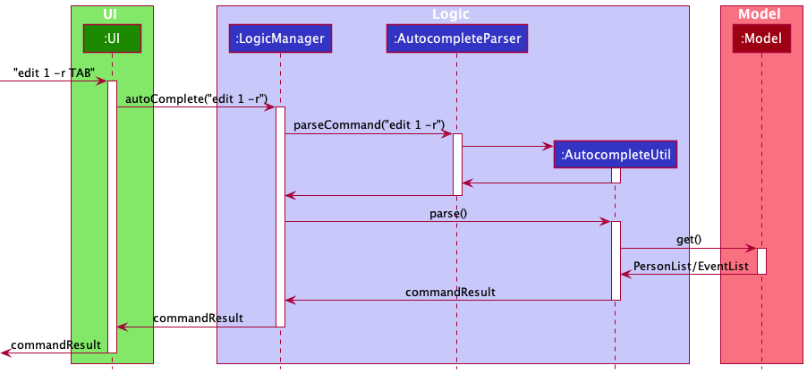

* Table of Contents
{:toc}

--------------------------------------------------------------------------------------------------------------------

## **Setting up, getting started**

Refer to the guide [_Setting up and getting started_](SettingUp.md).

--------------------------------------------------------------------------------------------------------------------

## **Design**

### Architecture

The ***Architecture Diagram*** given above explains the high-level design of the App. Given below is a quick overview of each component.

:bulb: **Tip:** The `.puml` files used to create diagrams in this document can be found in the [diagrams](https://github.com/se-edu/addressbook-level3/tree/master/docs/diagrams/) folder. Refer to the [_PlantUML Tutorial_ at se-edu/guides](https://se-education.org/guides/tutorials/plantUml.html) to learn how to create and edit diagrams.

**`Main`** has two classes called [`Main`](https://github.com/se-edu/addressbook-level3/tree/master/src/main/java/seedu/address/Main.java) and [`MainApp`](https://github.com/se-edu/addressbook-level3/tree/master/src/main/java/seedu/address/MainApp.java). It is responsible for,
* At app launch: Initializes the components in the correct sequence, and connects them up with each other.
* At shut down: Shuts down the components and invokes cleanup methods where necessary.

[**`Commons`**](#common-classes) represents a collection of classes used by multiple other components.

The rest of the App consists of four components.

* [**`UI`**](#ui-component): The UI of the App.
* [**`Logic`**](#logic-component): The command executor.
* [**`Model`**](#model-component): Holds the data of the App in memory.
* [**`Storage`**](#storage-component): Reads data from, and writes data to, the hard disk.

Each of the four components,

* defines its *API* in an `interface` with the same name as the Component.
* exposes its functionality using a concrete `{Component Name}Manager` class (which implements the corresponding API `interface` mentioned in the previous point).

For example, the `Logic` component (see the class diagram given below) defines its API in the `Logic.java` interface and exposes its functionality using the `LogicManager.java` class which implements the `Logic` interface.

**How the architecture components interact with each other**

The *Sequence Diagram* below shows how the components interact with each other for the scenario where the user issues the command `delete 1`.

The sections below give more details of each component.

### UI component

**API** :
[`Ui.java`](https://github.com/se-edu/addressbook-level3/tree/master/src/main/java/seedu/address/ui/Ui.java)

The UI consists of a `MainWindow` that is made up of parts e.g.`CommandBox`, `ResultDisplay`, `PersonListPanel`, `StatusBarFooter` etc. All these, including the `MainWindow`, inherit from the abstract `UiPart` class.

The `UI` component uses JavaFx UI framework. The layout of these UI parts are defined in matching `.fxml` files that are in the `src/main/resources/view` folder. For example, the layout of the [`MainWindow`](https://github.com/se-edu/addressbook-level3/tree/master/src/main/java/seedu/address/ui/MainWindow.java) is specified in [`MainWindow.fxml`](https://github.com/se-edu/addressbook-level3/tree/master/src/main/resources/view/MainWindow.fxml)

The `UI` component,

* Executes user commands using the `Logic` component.
* Listens for changes to `Model` data so that the UI can be updated with the modified data.

### Logic component

**API** :
[`Logic.java`](https://github.com/se-edu/addressbook-level3/tree/master/src/main/java/seedu/address/logic/Logic.java)

1. `Logic` uses the `AddressBookParser` class to parse the user command.
1. This results in a `Command` object which is executed by the `LogicManager`.
1. The command execution can affect the `Model` (e.g. adding a person).
1. The result of the command execution is encapsulated as a `CommandResult` object which is passed back to the `Ui`.
1. In addition, the `CommandResult` object can also instruct the `Ui` to perform certain actions, such as displaying help to the user.

Given below is the Sequence Diagram for interactions within the `Logic` component for the `execute("delete 1")` API call.

:information_source: **Note:** The lifeline for `DeleteCommandParser` should end at the destroy marker (X) but due to a limitation of PlantUML, the lifeline reaches the end of diagram.

### Model component

**API** : [`Model.java`](https://github.com/se-edu/addressbook-level3/tree/master/src/main/java/seedu/address/model/Model.java)

The `Model`,

* stores a `UserPref` object that represents the user’s preferences.
* stores the address book data.
* stores the event book data.
* exposes an unmodifiable `ObservableList<Person>` that can be 'observed' e.g. the UI can be bound to this list so that the UI automatically updates when the data in the list change.
* exposes an unmodifiable `ObservableList<Event>` that can be 'observed' e.g. the UI can be bound to this list so that the UI automatically updates when the data in the list change.
* does not depend on any of the other three components.

:information_source: **Note:** An alternative (arguably, a more OOP) model is given below. It has a `Tag` list in the `AddressBook`, which `Person` references. This allows `AddressBook` to only require one `Tag` object per unique `Tag`, instead of each `Person` needing their own `Tag` object. 

### Storage component

**API** : [`Storage.java`](https://github.com/se-edu/addressbook-level3/tree/master/src/main/java/seedu/address/storage/Storage.java)

The `Storage` component,
* can save `UserPref` objects in json format and read it back.
* can save the address book data in json format and read it back.
* can save the event book data in json format and read it back.

### Common classes

Classes used by multiple components are in the `seedu.addressbook.commons` package.

--------------------------------------------------------------------------------------------------------------------

## **Implementation**

This section describes some noteworthy details on how certain features are implemented.

### Help feature

#### Current Implementation

When called as `help`, the user will be given the concise command-line syntax of all implemented commands and their arguments following the conventions listed in https://developers.google.com/style/code-syntax

This is facilitated by `MESSAGE_USAGE_CONCISE` in each `Command` that the user is able to use.

When called as `help [COMMAND]`, the user will be given the detailed description of the usage of the specified `COMMAND`.

This is facilitated by `MESSAGE_USAGE` in each `Command`.

Given below is an example usage scenario and how the `HelpCommand` mechanism behaves at each step.

Step 1. The user launches the application for the first time. The user is unsure of the syntax and attempts to type
in the CLI a command that is unlikely to fit the syntax of implemented commands. `AddressBookParser#ParseCommand()` throws a `ParseException` and the user receives a prompt "Unknown command, try the command: help".

Step 2. The user executes `help`. `AddressBookParser#ParseCommand()` instantiates a `HelpCommandParser` to parse the arguments for `help`. Since there are no arguments, the default constructor for `HelpCommand` is called, and the user receives a concise description of the complete set of implemented commands.

Step 3. The user executes `help add`. `AddressBookParser#ParseCommand()` instantiates a `HelpCommandParser` to parse the arguments for `help add`. The constructor taking in a `commandWord` is called, and when `HelpCommand#execute` is run, the `MESSAGE_USAGE` of the `Command` matching the `commandWord` is shown to the user.

:information_source: **Note:** If the subsequent arguments are not successfully parsed, `help` is called instead. If multiple arguments are found, only the first one is parsed.

#### Design consideration:

##### Aspect: How HelpCommand executes

* **Alternative 1 (current choice):** Entire help message is composed of `MESSAGE_USAGE_CONCISE` of the various commands in `SHOWING_HELP_MESSAGE`, which is printed.
    * Pros: Each `Command` takes care of its own syntax, only needs to be updated at one place for changes to take effect.
    * Cons: The list of commands is still hard coded into `SHOWING_HELP_MESSAGE`, and needs to be manually updated every time a new `Command` is implemented.

* **Alternative 2:** Maintain a list of Commands, which `HelpCommand` will iterate over to print the concise syntax for each command when printing the help message.
    * Pros: Need not hard code the possible commands, only have to update the list of commands
    * Cons: Possible reduced performance, especially later if a large number of commands is added.

_{more aspects and alternatives to be added}_

### \[Proposed\] Undo/redo feature

#### Proposed Implementation

The proposed undo/redo mechanism is facilitated by `VersionedAddressBook`. It extends `AddressBook` with an undo/redo history, stored internally as an `addressBookStateList` and `currentStatePointer`. Additionally, it implements the following operations:

* `VersionedAddressBook#commit()` — Saves the current address book state in its history.
* `VersionedAddressBook#undo()` — Restores the previous address book state from its history.
* `VersionedAddressBook#redo()` — Restores a previously undone address book state from its history.

These operations are exposed in the `Model` interface as `Model#commitAddressBook()`, `Model#undoAddressBook()` and `Model#redoAddressBook()` respectively.

Given below is an example usage scenario and how the undo/redo mechanism behaves at each step.

Step 1. The user launches the application for the first time. The `VersionedAddressBook` will be initialized with the initial address book state, and the `currentStatePointer` pointing to that single address book state.

Step 2. The user executes `delete 5` command to delete the 5th person in the address book. The `delete` command calls `Model#commitAddressBook()`, causing the modified state of the address book after the `delete 5` command executes to be saved in the `addressBookStateList`, and the `currentStatePointer` is shifted to the newly inserted address book state.

Step 3. The user executes `add n/David …​` to add a new person. The `add` command also calls `Model#commitAddressBook()`, causing another modified address book state to be saved into the `addressBookStateList`.

:information_source: **Note:** If a command fails its execution, it will not call `Model#commitAddressBook()`, so the address book state will not be saved into the `addressBookStateList`.

Step 4. The user now decides that adding the person was a mistake, and decides to undo that action by executing the `undo` command. The `undo` command will call `Model#undoAddressBook()`, which will shift the `currentStatePointer` once to the left, pointing it to the previous address book state, and restores the address book to that state.

:information_source: **Note:** If the `currentStatePointer` is at index 0, pointing to the initial AddressBook state, then there are no previous AddressBook states to restore. The `undo` command uses `Model#canUndoAddressBook()` to check if this is the case. If so, it will return an error to the user rather
than attempting to perform the undo.

The following sequence diagram shows how the undo operation works:

:information_source: **Note:** The lifeline for `UndoCommand` should end at the destroy marker (X) but due to a limitation of PlantUML, the lifeline reaches the end of diagram.

The `redo` command does the opposite — it calls `Model#redoAddressBook()`, which shifts the `currentStatePointer` once to the right, pointing to the previously undone state, and restores the address book to that state.

:information_source: **Note:** If the `currentStatePointer` is at index `addressBookStateList.size() - 1`, pointing to the latest address book state, then there are no undone AddressBook states to restore. The `redo` command uses `Model#canRedoAddressBook()` to check if this is the case. If so, it will return an error to the user rather than attempting to perform the redo.

Step 5. The user then decides to execute the command `list`. Commands that do not modify the address book, such as `list`, will usually not call `Model#commitAddressBook()`, `Model#undoAddressBook()` or `Model#redoAddressBook()`. Thus, the `addressBookStateList` remains unchanged.

Step 6. The user executes `clear`, which calls `Model#commitAddressBook()`. Since the `currentStatePointer` is not pointing at the end of the `addressBookStateList`, all address book states after the `currentStatePointer` will be purged. Reason: It no longer makes sense to redo the `add n/David …​` command. This is the behavior that most modern desktop applications follow.

The following activity diagram summarizes what happens when a user executes a new command:

#### Design consideration:

##### Aspect: How undo & redo executes

* **Alternative 1 (current choice):** Saves the entire address book.
  * Pros: Easy to implement.
  * Cons: May have performance issues in terms of memory usage.

* **Alternative 2:** Individual command knows how to undo/redo by
  itself.
  * Pros: Will use less memory (e.g. for `delete`, just save the person being deleted).
  * Cons: We must ensure that the implementation of each individual command are correct.

_{more aspects and alternatives to be added}_

### [Feature] Adding Persons
The Persons stored inside PartyPlanet should not have any compulsory fields except for name. This is to allow
for addition of contacts where the user is unable to, or does not need to fill up all fields.

One example of such case is a vendor's contact. The user does not need to store information on a vendor's birthday.

Additionally, the user should also be able to store remarks for that contact.

#### Implementation
* The remark is a new class that stores a String containing the specific remark
* Each `Person` class contains fields `Name`, `Address`, `Phone`, `Birthday`, `Email` and `Remark`
    * To allow for optional fields `Address`, `Phone`, `Birthday`, `Email` and `Remark`, each class has an attribute
  `isEmpty` that indicates whether the field in the person is empty.
    * The empty fields will then be stored as an empty string `""` in the `addressbook.json` folder and be read as an
  empty field accordingly.
* Syntax for adding Person: `add -n NAME [-a ADDRESS] [-p PHONE] [-b BIRTHDAY] [-e EMAIL] [-r REMARK]`

Given below is an example usage scenario and how the `add` mechanism behaves at each step.

1. The user executes `add -n James -r Loves sweets` command to add a person with name `James` and remark `Loves
   sweets`, represented by `execute("add -n James -r Loves sweets"")`. Note that fields `Address`, `Phone`,
   `Birthday` and `Email` are not specified and hence are empty fields.
2. `LogicManager` uses the `AddressBookParser` class to parse the user command, represented by `parseCommand("add -n
   James -r Loves sweets")`

Below is the partial sequence diagram for steps 1 and 2.

3. `AddressBookParser` creates an `AddCommandParser` which is used to parse the arguments provided by the user. This
   is represented by `parse("-n James -r Loves sweets")`.
4. `AddCommandParser` calls the constructor of a `Person` with the given arguments as input and creates a `Person`
   This is represented by `Person("James", "", "", "", "", "Loves sweets", [])`. Note empty
   string `""` and `[]` represent empty fields.
5. The `AddCommandParser` then passes this newly created `Person` as input to create an `AddCommand` which will be
   returned to the `LogicManager`. This is represented by `AddCommand(p)`

Below is the partial sequence diagram for steps 3, 4 and 5.

6. The `LogicManager` executes the `AddCommand` by calling `AddCommand#execute()` and passes the `CommandResult`
   back to the `UI`.

Given below is the full Sequence Diagram for interactions within the `Logic` component for the `execute("add -n
James -r Loves sweets")` API call.

### [Feature] Marking `Event` as Done

We want to allow `Event` to be marked as done. So that the user can easily keep track of what events have been completed,
and what events are upcoming.

`Event` titles could include a tick to represent completion.

#### Implementation
* Syntax for EDoneCommand: `edone INDEX [INDEX]...`
* Modification to `Event` class
  * New attribute `isDone` should be added to represent a done and not done event.
  * A `setDone()` method to return a new `Event` object that is done.
  * A `getStatus()` method that returns a tick if the `Event` is done (for UI display).

Given below is an example usage scenario and how `edone` will work.

1. The user executes `edone 1 2 3` command to mark event at index 1, 2 and 3 as done.

2. `LogicManager` calls `parseCommand("edone 1 2 3")` of `AddressBookParser` to parse the input.

3. `AddressBookParser` detects command word `edone` and creates an `EDoneCommandParser`.

4. `AddressBookParser` calls `parse("1 2 3")` of `EDoneCommandParser`.

5. `EDoneCommandParser` processes the input and compiles the valid indexes into a list `List<Index>`.

6. `EDoneCommandParser` creates an `EDoneCommand(List<Index>)` and returns it to `LogicManager`.

7. `LogicManger` excutes the `EDoneCommand`.

8. `EDoneCommand` loops through the list of index, and set the events, at the given index, as a done event.

9. `EDoneCommand` creates an `CommandResult` containing the output message and returns it to `LogicManager`.

Given below is the full Sequence Diagram for interactions for the `execute("edone 1 2 3")` API call.

### [Feature] Autocompleting `Edit` Command (Remark)

Since `Remark`s are intended to be capable of containing long sentences or paragraphs,
it brings an unintended chore of a User having to retype an entire `Remark` in order to edit it.

The Autocomplete feature allows the user to autocomplete a current `Person`'s remark into the
command box once the correct `Person` id and remark prefix has been keyed.

#### Implementation
* Syntax for EditAutocomplete: `edit INDEX -r` + `TAB`
* The user is expected to keypress the TAB key after typing the command in order to activate the autocomplete feature.
* The feature is implemented with the help of a new `EditAutocompleteUtil` class that handles parsing and retrieving the
relavant remark from the `Model`.

Given below is an example usage scenario and how `EditAutocomplete` will work.

1. The user executes `edit 1 -r` + `TAB` command to autocomplete `Person` 1's Remark.

2. `UI` calls `autocomplete("edit 1 -r")` of `LogicManager` to handle the input.

3. `LogicManager` calls `parseEditCommand("edit 1 -r", model)` of `EditAutocompleteUtil` to parse the input.

4. `EditAutocompleteUtil` processes the input and retrieves the relevant `Person`'s `Remark` from the `Model`.

5. `EditAutocompleteUtil` creates the autocompleted output String and returns it to `LogicManager`.

7. `LogicManger` returns the autocompleted output String to `UI`.

8. `UI` updates `CommandBox` to reflect the autocompleted command input.

Given below is the full Sequence Diagram for interactions for the `edit 1 -r` + `TAB` API call.

### \[Proposed\] Data archiving

_{Explain here how the data archiving feature will be implemented}_

--------------------------------------------------------------------------------------------------------------------

## **Documentation, logging, testing, configuration, dev-ops**

* [Documentation guide](Documentation.md)
* [Testing guide](Testing.md)
* [Logging guide](Logging.md)
* [Configuration guide](Configuration.md)
* [DevOps guide](DevOps.md)

--------------------------------------------------------------------------------------------------------------------

## **Appendix: Requirements**

### Product scope

**Target user profile**:

* has a need to manage a significant number of contacts within CCA
* has a need to keep track of all the birthdays of CCA members to plan celebrations
* has a need to store contacts of favourite vendors to contact for birthday celebrations
* prefer desktop apps over other types
* can type fast
* prefers typing to mouse interactions
* is reasonably comfortable using CLI apps

**Value proposition**:
* manage planning of birthdays faster than a typical mouse/GUI driven app
* group and access CCA members by information such as matriculation batch/sub-committees
* track upcoming birthdays to plan for

### User stories

Priorities: High (must have) - `* * *`, Medium (nice to have) - `* *`, Low (unlikely to have) - `*`

| Priority | As a … | I want to … | So that I can… |
| --- | --- | --- | --- |
| `***` | Potential user | See the app populated with sample data | See how the app will look like when it is in use |
| `***` | New user | Purge all current data | Get rid of sample data used for exploring the app |
| `***` | New user | Record birthdays | Keep track of birthdays of CCA members |
| `**` | New user | Add contacts tagged to a subcommittee | Easily organise members in CCA |
| `***` | New user | Add vendors tagged to a particular product/service | Easily look for vendors providing a particular service |
| `***` | New user | Edit existing details tagged to a person | Append new information without retyping the same details |
| `***` | New user | View a help page / use a help command | Know the correct syntax to use the functions/ know what functions the app supports |
| `***` | New user | Add remarks to a person | Take note of their preferences (dietary, allergy, etc) |
| `**` | Returning user | Sort / search through contacts based on tags | Easily find groups of relevant contacts / members |
| `*` | Returning user | Sort / search through contacts based on birthday month | Plan mass celebration for everyone born in the same month |
| `***` | Returning user | Change the details of a birthday plan | Reflect the changed plans |
| `**` | Returning user | Delete all members belonging to a group | Reduce clutter and prepare for incoming batches of members |
| `*` | Returning user | Encrypt application access as well as application data | Protect inadvertent data leak |
| `*` | Returning user | Mark celebrations as completed | Know which birthdays are done |
| `**` | Returning user | Delete completed/irrelevant contacts | Reduce the clutter on PartyPlanet |
| `***` | Retiring welfare IC | Pass down the data to successor | (they) would not need to re-gather and re-enter details |
| `*` | Expert user | Create shortcuts | Run multiple repeated commands at once to save time |
| `**` | Clumsy user | Edit misspelled commands | Fix typo mistakes in the app |
| `**` | Clumsy user | Undo/edit misspelled names/numbers/notes | Fix mistakes |
| `*` | Reflective user | Archive past birthday celebrations | Revisit previous birthday celebration and their details for reuse |
| `*` | CCA welfare IC with many sub-groups | Color tags | Differentiate contacts easily |
| `**` | Welfare IC who plans ahead of time | Search date | See all birthdays on that day |
| `**` | Night owl | Enable dark mode | Use the app safely in dark environments |
| `*` | Overworked welfare IC | See all upcoming birthdays as a weekly view / monthly calendar | Prioritize birthdays to plan |
| `*` | Satisfied user | Share the application with my family and friends | Encourage close contacts to use the application |
| `***` | Returning user | Delete events | Reduce clutter on PartyPlanet |
| `***` | Welfare IC | Add a birthday plan (event) to the app | Keep track of the celebration planning progress |
| `***` | Welfare IC | Set a date for a birthday plan (event) | Ensure details are planned on time |
| `**` | Busy Welfare IC | Sort through the list of events | Look at upcoming events  |
| `*` | Busy Welfare IC | Search for events by details | Find similar events to refer to for planning |
| `**` | Busy Welfare IC | Search for events by title | Filter out particular events with that title  |

### Use cases

(For all use cases below, the **System** is the `PartyPlanet` application while the **Actor** is the `User`,
unless specified otherwise)

    Use case: UC1 - Add a contact
    MSS:
      1. User requests to add a new contact.
      2. PartyPlanet displays the new list of contacts with the added contact.
      Use case ends.
    Extensions:
      1a. PartyPlanet detects an error in the entered data.
        1a1. PartyPlanet shows the user an example of the correct format.
        1a2. PartyPlanet requests for the correct data.
        Use case ends.

    Use case: UC2 - Clear
    MSS:
      1. User requests to clear all data.
      2. PartyPlanet clears all existing data.
      Use case ends.

    Use case: UC3 - Delete a contact
    MSS:
      1. User requests for a contact to be deleted.
      2. PartyPlanet displays the list of contacts without the deleted contact.
      Use case ends.
    Extensions:
      1a. The contact is invalid.
        1a1. PartyPlanet shows an error message.
        Use case ends.
      1b. PartyPlanet detects invalid format.
        1b1. PartyPlanet shows the user an example of the correct format.
        1b2. PartyPlanet requests for the correct data.
        Use case ends.

    Use case: UC4 - Edit a contact
    MSS:
      1. User request for a contact to be edited.
      2. PartyPlanet displays the updated details.
      Use case ends.
    Extensions:
      1a. PartyPlanet detects invalid format.
        1a1. PartyPlanet shows the user an example of the correct format.
        1a2. PartyPlanet requests for the correct data.
        Use case ends.
      1b. The contact is invalid.
        1b1. PartyPlanet requests for the correct data.
        Use case ends.

    Use case: UC5 - Find a contact
    MSS:
      1. User requests to search for relevant contacts.
      2. PartyPlanet displays a list of contacts that match the input.
      Use case ends.
    Extensions:
      1a. PartyPlanet detects invalid format.
        1a1. PartyPlanet shows the user an example of the correct format.
        1a2. PartyPlanet requests for the correct data.
        Use case ends.

    Use case: UC6 - List contacts
    MSS:
      1. User requests to list out all contacts.
      2. PartyPlanet displays a list of all contacts.
      Use case ends.
    Extensions:
      1a. User chooses a sort order from a list of possible sort orders.
        1a1. PartyPlanet displays the list of all contacts in the given sort order.
        Use case ends.
      1b. User enters an invalid / missing sort order.
        1b1. PartyPlanet displays an error.
        Use case ends.

    Use case: UC7 - Find tags
    MSS:
      1. User requests a search for relevant tags.
      2. PartyPlanet displays all relevant tags.
      Use case ends.
    Extensions:
      1a. PartyPlanet detects wrong parameters.
        1a1. PartyPlanet displays an error message.
        1a2. PartyPlanet prompts users to re-enter input.
        Use case ends.
      1b. PartyPlanet detects specific tags supplied.
        1b1. PartyPlanet displays all tags matching the name of the specified tag.
        Use case ends.

    Use case: UC8 - Get Help
    MSS:
      1. User requests for help.
      2. PartyPlanet displays all available commands.
      Use case ends.
    Extensions:
      1a. User supplied a specific command as a parameter.
        1a1. PartyPlanet displays help for the specific command supplied.
        Use case ends.
      1b. User supplied an unrecognised command as a parameter.
        1b1. PartyPlanet displays an error.
        Use case ends.
      1c. PartyPlanet detects an error in the entered data.
        1c1. PartyPlanet shows the user an example of the correct format.
        1c2. PartyPlanet requests for the correct data.
        Use case ends.

    Use case: UC9 - Exit PartyPlanet
    MSS:
      1. User requests to exit.
      2. PartyPlanet exits and closes the window.
      Use case ends.

### Non-Functional Requirements

1. PartyPlanet should be usable by a novice who has never used a CLI address book before.
2. PartyPlanet should work on any _mainstream OS_ with minimally Java `11` installed.
3. PartyPlanet Should be able to hold up to 1000 contacts without a noticeable sluggishness in performance for typical
   usage.
4. PartyPlanet should store data _locally only_, in a human editable text file, for privacy reasons.
5. PartyPlanet should only be for a _single user_ and should not require interaction with other users of PartyPlanet.
6. A user with above average typing speed for regular English text (i.e. not code, not system admin commands)
    should be able to accomplish most of the tasks faster using commands than using the mouse.
7. The source code should be open source.
8. PartyPlanet should work without requiring an installer, the installation of any additional software, or any
   external connections.
9. The total file size should not exceed _100MB_.

### Glossary

* **Mainstream OS**: Windows, Linux, Unix, OS-X
* **Private contact detail**: A contact detail that is not meant to be shared with others

--------------------------------------------------------------------------------------------------------------------

## **Appendix: Instructions for manual testing**

Given below are instructions to test the app manually.

:information_source: **Note:** These instructions only provide a starting point for testers to work on;
testers are expected to do more *exploratory* testing.

### Launch and shutdown

1. Initial launch

   1. Download the jar file and copy into an empty folder

   1. Double-click the jar file Expected: Shows the GUI with a set of sample contacts. The window size may not be optimum.

1. Saving window preferences

   1. Resize the window to an optimum size. Move the window to a different location. Close the window.

   1. Re-launch the app by double-clicking the jar file. 
       Expected: The most recent window size and location is retained.

1. _{ more test cases …​ }_

### Deleting a person

1. Deleting a person while all persons are being shown

   1. Prerequisites: List all persons using the `list` command. Multiple persons in the list.

   1. Test case: `delete 1` 
      Expected: First contact is deleted from the list. Details of the deleted contact shown in the status message. Timestamp in the status bar is updated.

   1. Test case: `delete 0` 
      Expected: No person is deleted. Error details shown in the status message. Status bar remains the same.

   1. Other incorrect delete commands to try: `delete`, `delete x`, `...` (where x is larger than the list size) 
      Expected: Similar to previous.

1. _{ more test cases …​ }_

### Saving data

1. Dealing with missing/corrupted data files

   1. _{explain how to simulate a missing/corrupted file, and the expected behavior}_

1. _{ more test cases …​ }_
