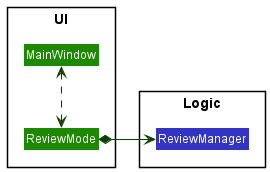
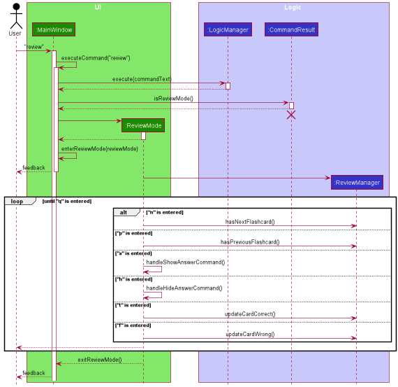

## Table of Contents

* [Setting up, getting started](#setting-up-getting-started)
* [Design](#design)
    * [Architecture](#architecture)
    * [UI component](#ui-component)
    * [Logic component](#logic-component)
    * [Model component](#model-component)
    * [Storage component](#storage-component)
    * [Common classes](#common-classes)
* [Implementation](#implementation)
    * [Sort feature](#implemented-sort-feature)
    * [Review feature](#implemented-review-feature)
    * [Statistics feature](#implemented-statistics-feature)
    * [UndoRedo feature](#implemented-undoredo-feature)  
    * [Filter feature](#implemented-filter-feature)
    * [Alias feature](#implemented-alias-feature)
* [Documentation, logging, testing, configuration, dev-ops](#documentation-logging-testing-configuration-dev-ops)
* [Appendix: Requirements](#appendix-requirements)
    * [Product scope](#product-scope)
    * [User stories](#user-stories)
    * [Use cases](#use-cases)
    * [Non-Functional Requirements](#non-functional-requirements)
    * [Glossary](#glossary)
* [Appendix: Instructions for manual testing](#appendix-instructions-for-manual-testing)
    * [Launch and shutdown](#launch-and-shutdown)
    * [Listing all flashcards](#listing-all-flashcards)
    * [Adding a flashcard](#adding-a-flashcard)
    * [Deleting a flashcard](#deleting-a-flashcard)
    * [Editing a flashcard](#editing-a-flashcard)
    * [Finding flashcards](#finding-flashcards)
    * [Filtering flashcards](#filtering-flashcards)
    * [Clearing all flashcards](#clearing-all-flashcards)
    * [Viewing a flashcard](#viewing-a-flashcard)
    * [Sorting flashcards](#sorting-flashcards)
    * [Review mode](#review-mode)
    * [Displaying statistics](#displaying-statistics)
    * [Undoing a command](#undoing-a-command)
    * [Redoing a command](#redoing-a-command)
    * [Adding an alias](#adding-an-alias)
* [Appendix: Effort](#appendix-effort)
    * [Refactor from AB3 to FlashBack](#refactor-from-ab3-to-flashback)
    * [Find feature](#find-feature)
    * [Filter feature](#filter-feature)
    * [View feature](#view-feature)
    * [Review Mode](#review-mode)
    * [Sort feature](#sort-feature)
    * [UndoRedo feature](#undoredo-feature)
    * [Alias feature](#alias-feature)
    * [UI improvement](#ui-improvement)

--------------------------------------------------------------------------------------------------------------------

## **Setting up, getting started**

Refer to the guide [_Setting up and getting started_](SettingUp.md).

--------------------------------------------------------------------------------------------------------------------

## **Design**

### Architecture

The ***Architecture Diagram*** given above explains the high-level design of the App. Given below is a quick overview of
each component.

:bulb: **Tip:** The `.puml` files used to create diagrams in this document can be found in
the [diagrams](https://github.com/AY2021S2-CS2103T-T13-3/tp/tree/master/docs/diagrams) folder. Refer to the [_PlantUML
Tutorial_ at se-edu/guides](https://se-education.org/guides/tutorials/plantUml.html) to learn how to create and edit
diagrams.

**`Main`** has two classes
called [`Main`](https://github.com/AY2021S2-CS2103T-T13-3/tp/blob/master/src/main/java/seedu/flashback/Main.java)
and [`MainApp`](https://github.com/AY2021S2-CS2103T-T13-3/tp/blob/master/src/main/java/seedu/flashback/MainApp.java). It is responsible for,
* At app launch: Initializes the components in the correct sequence, and connects them up with each other.
* At shut down: Shuts down the components and invokes cleanup methods where necessary.

[**`Commons`**](#common-classes) represents a collection of classes used by multiple other components.

The rest of the App consists of four components.

* [**`UI`**](#ui-component): The UI of the App.
* [**`Logic`**](#logic-component): The command executor.
* [**`Model`**](#model-component): Holds the data of the App in memory.
* [**`Storage`**](#storage-component): Reads data from, and writes data to, the hard disk.

Each of the four components,

* defines its *API* in an `interface` with the same name as the Component.
* exposes its functionality using a concrete `{Component Name}Manager` class (which implements the corresponding
  API `interface` mentioned in the previous point.

For example, the `Logic` component (see the class diagram given below) defines its API in the `Logic.java` interface and
exposes its functionality using the `LogicManager.java` class which implements the `Logic` interface.

**How the architecture components interact with each other**

The *Sequence Diagram* below shows how the components interact with each other for the scenario where the user issues
the command `delete 1`.

The sections below give more details of each component.

### UI component

**API** :
[`Ui.java`](https://github.com/AY2021S2-CS2103T-T13-3/tp/blob/master/src/main/java/seedu/flashback/ui/Ui.java)

The UI consists of a `MainWindow` that is made up of parts e.g.`CommandBox`, `ResultDisplay`, `FlashcardListPanel`
, `StatusBarFooter` etc and a `ReviewMode` that is made up of parts `CommandBox`, `ResultDisplay` and `FlashcardViewCard` . All these, including the `MainWindow` and `ReviewMode`, inherit from the abstract `UiPart` class.

The `ReviewMode` can be accessed from `MainWindow` through `review` command. The `MainWindow` can be accessed from `ReviewMode` through `q` command.

The `UI` component uses JavaFx UI framework. The layout of these UI parts are defined in matching `.fxml` files that are
in the `src/main/resources/view` folder. For example, the layout of
the [`MainWindow`](https://github.com/AY2021S2-CS2103T-T13-3/tp/blob/master/src/main/java/seedu/flashback/ui/MainWindow.java)
is specified
in [`MainWindow.fxml`](https://github.com/AY2021S2-CS2103T-T13-3/tp/blob/master/src/main/resources/view/MainWindow.fxml)

The `UI` component,

* Executes user commands using the `Logic` component.
* Listens for changes to `Model` data so that the UI can be updated with the modified data.

### Logic component

**API** :
[`Logic.java`](https://github.com/AY2021S2-CS2103T-T13-3/tp/blob/master/src/main/java/seedu/flashback/logic/Logic.java)

1. `Logic` uses the `FlashBackParser` class to parse the user command.
1. This results in a `Command` object which is executed by the `LogicManager`.
1. The command execution can affect the `Model` (e.g. adding a new card).
1. The result of the command execution is encapsulated as a `CommandResult` object which is passed back to the `Ui`.
1. In addition, the `CommandResult` object can also instruct the `Ui` to perform certain actions, such as displaying
   help to the user.

Given below is the Sequence Diagram for interactions within the `Logic` component for the `execute("delete 1")` API
call.

:information_source: **Note:** The lifeline for `DeleteCommandParser` should end at the destroy marker (X) but due to a limitation of PlantUML, the lifeline reaches the end of diagram.

### Model component

:information_source: **Note:** Due to plantUML automatic placement of elements, some multiplicities are in the wrong position.

**API** : [`Model.java`](https://github.com/AY2021S2-CS2103T-T13-3/tp/blob/master/src/main/java/seedu/flashback/model/Model.java)

The `Model`
* stores a `UserPref` object that represents the user’s preferences.
* stores the FlashBack data.
* exposes an unmodifiable `ObservableList<Flashcard>` that can be 'observed' e.g. the UI can be bound to this list so that
  the UI automatically updates when the data in the list change.
* does not depend on any of the other three components.

### Storage component

**API** : [`Storage.java`](https://github.com/AY2021S2-CS2103T-T13-3/tp/blob/master/src/main/java/seedu/flashback/storage/Storage.java)

The `Storage` component,

* can save `UserPref` objects in json format and read it back.
* can save the FlashBack data in json format and read it back.

### Common classes

Classes used by multiple components are in the `seedu.flashback.commons` package.

--------------------------------------------------------------------------------------------------------------------

## **Implementation**

This section describes some noteworthy details on how certain features are implemented.

### \[Implemented\] Sort feature
The sort mechanism is managed by `ModelManager`. As `Flashcard` contains `Question` and `Priority`, these are utilised along with the enum `SortOptions` which
comprises comparators needed for respective sort options.

It implements the following operations:

* `ModelManager#SortFilteredCardList(Comparator<Flashcard> cmp)` - Sorts the flashcard list
according to an option and shows the updated list.
* `SortOptions#getOption(String option)` - Returns the enum according to the specified option

Given below is an example usage scenario and how the sort mechanism behaves at each step.

Step 1. User launches the application.

Step 2. User executes `sort priority -d`. This command get parsed and 
`Model#sortFilteredFlashcardList` is called with the respective comparator, 
resulting in flashcards sorted by decreasing priority.

The following sequence diagram illustrates how the sort function operates:

:information_source: **Note:** The lifeline for `SortCommand` should end at the destroy marker (X) but due to a limitation of PlantUML, the lifeline reaches the end of diagram.

### \[Implemented\] Review feature
The review mechanism is managed by `ReviewManager`. It 
maintains a list of `Flashcard` and `currentIndex` internally. In addition, it involves the UI through `ReviewMode` that handles user inputs and displays flashcards to users.
 
 `ReviewManager` implements the following operations:
 * `ReviewManager#getFlashcardDeckSize()` - Returns the size of the current list of flashcards.
 * `ReviewManager#hasNextFlashcard()` - Checks if there is a flashcard after the current flashcard.
 * `ReviewManager#hasPreviousFlashcard()` - Checks if there is a flashcard before the current flashcard.
 * `ReviewManager#getCurrentFlashcard()` - Returns the flashcard at `currentIndex` of the flashcard list.
 * `ReviewManager#updateCardCorrect(Flashcard cardToUpdate)` - Updates the statistics of a specified `cardToUpdate` when user answers the question correctly.
 * `ReviewManager#updateCardWrong(Flashcard cardToUpdate)` - Updates the statistics of a specified `cardToUpdate` when user answers the question wrongly.
 
 The following class diagram illustrates how classes involved in this feature interact with each other:   
    
Given below is an example usage scenario and how the review mechanism behaves at each step:

Step 1: The user launches the application.

Step 2: The user enters `review` command in `CommandBox`. After the logic executes the command, it returns a `CommandResult` to the `MainWindow` where the `CommandResult#isReviewMode()` method returns true. After that, a `MainWindow#enterReviewMode()` method is called and user enters `ReviewMode`.

Step 3: Depending on the command that user enters in the `CommandBox` of `ReviewMode`, different methods in `ReviewManager` are called to handle user inputs.

Step 4: If the user enters `q` in the `CommandBox`, `ReviewMode#handleQuitCommand` method is called, and the user returns to the `MainWindow`.

The following sequence diagram illustrates how the user enter `ReviewMode`:  
  

:information_source: **Note:** The lifeline for `CommandResult` should end at the destroy marker (X) but due to a limitation of PlantUML, the lifeline reaches the end of diagram.

#### Design consideration:

##### Aspect: How user interacts in Review Mode.

* **Alternative 1 (current choice):** interacts via `CommandBox` similar to the `MainWindow`
    * Pros: Easy to implement.
    * Cons: User experience might not be good since user needs to type many commands.

* **Alternative 2:** interacts via keyboard
    * Pros: Better user experience since user can move to next/previous flashcard a lot faster.
    * Cons: Harder to implement.

### \[Implemented\] Statistics feature

The statistics feature is supported by `LogicManager` and `ModelManager`.

To show flashcard statistics, `LogicManager` first calls `FlashBackParser#parseCommand` to parse through user input.
If user input is recognized as a command to display statistics, `StatsCommandParser#parse` is invoked to create a new `StatsCommand` object.

The `StatsCommand` is then executed:
* The current flashcard list is obtained from the `ModelManager`.

* If a valid flashcard index is included in the user input, the flashcard identified by the provided index is retrieved from the current flashcard list, and the statistics associated with the card is obtained by
`Flashcard#getStats()`.

* If the flashcard index is omitted from the user input. A new `Statistics` object is created, representing the
overall statistics of the current flashcard list.

A `CommandResult` is created with the generated flashcard `Statistics`. It is then passed to `MainWindow`, where the UI is updated to display the retrieved statistics.

Example: `stats 3` is entered by the user.

It implements the following operations:

* `StatsCommandParser.parse(String command)` - Parses through user input and returns an executable `StatsCommand`.
* `ModelManager#getFilteredFlashcardList()` - Retrieves the current flashcard list.
* `Flashcard#getStats()` - Retrieves statistics of the flashcard at index 3 of the list.

The following sequence diagram illustrates this scenario.

:information_source: **Note:** The lifeline for `StatsCommandParser` should end at the destroy marker (X) but due to a limitation of PlantUML, the lifeline reaches the end of diagram.

### \[Implemented\] Undo/redo feature
The undo/redo mechanism is facilitated by `VersionedFlashBack`. It extends `FlashBack` with an undo/redo
history, stored internally as an `flashBackStates` and `currentStatePointer`. Additionally, it implements the
following operations:

* `VersionedFlashBack#commit()` — Saves the current flashback state in its history.
* `VersionedFlashBack#undo()` — Restores the previous flashback state from its history.
* `VersionedFlashBack#redo()` — Restores a previously undone flashback state from its history.

These operations are exposed in the `Model` interface as `Model#commitFlashBack()`, `Model#undoFlashBack()`
and `Model#redoFlashBack()` respectively.

Given below is an example usage scenario and how the undo/redo mechanism behaves at each step.

Step 1. The user launches the application for the first time. The `VersionedFlashBack` will be initialized with the
initial flashback state, and the `currentStatePointer` pointing to that single flashback state.

Step 2. The user executes `delete 5` command to delete the 5th flashcard in flashback. The `delete` command
calls `Model#commitFlashBack()`, causing the modified state of the flashback after the `delete 5` command executes
to be saved in the `flashBackStates`, and the `currentStatePointer` is shifted to the newly inserted flashback
state.

Step 3. The user executes `add q/What is recursion? …​` to add a new flashcard. The `add` command also calls `Model#commitFlashBack()`
, causing another modified flashback state to be saved into the `flashBackStates`.

:information_source: **Note:** If a command fails its execution, it will not call `Model#commitFlashBack()`, so the flashback state will not be saved into the `flashBackStates`.

Step 4. The user now decides that adding the flashcard was a mistake, and decides to undo that action by executing
the `undo` command. The `undo` command will call `Model#undoFlashBack()`, which will shift the `currentStatePointer`
once to the left, pointing it to the previous flashback state, and restores the flashback to that state.

:information_source: **Note:** If the `currentStatePointer` is at index 0, pointing to the initial FlashBack state, then there are no previous FlashBack states to restore. The `undo` command uses `Model#canUndoFlashBack()` to check if this is the case. If so, it will return an error to the user rather
than attempting to perform the undo.

The following sequence diagram shows how the undo operation works:

:information_source: **Note:** The lifeline for `UndoCommand` should end at the destroy marker (X) but due to a limitation of PlantUML, the lifeline reaches the end of diagram.

The `redo` command does the opposite — it calls `Model#redoFlashBack()`, which shifts the `currentStatePointer` once
to the right, pointing to the previously undone state, and restores the flashback to that state.

:information_source: **Note:** If the `currentStatePointer` is at index `flashBackStates.size() - 1`, pointing to the latest flashback state, then there are no undone FlashBack states to restore. The `redo` command uses `Model#canRedoFlashBack()` to check if this is the case. If so, it will return an error to the user rather than attempting to perform the redo.

Step 5. The user then decides to execute the command `view 4`. Commands that do not modify flashback, such
as `view 2`, will usually not call `Model#commitFlashBack()`, `Model#undoFlashBack()` or `Model#redoFlashBack()`.
Thus, the `flashBackStates` remains unchanged.

Step 6. The user executes `clear`, which calls `Model#commitFlashBack()`. Since the `currentStatePointer` is not
pointing at the end of the `flashBackStates`, all flashback states after the `currentStatePointer` will be
purged. Reason: It no longer makes sense to redo the `add q/What is recursion? …​` command. This is the behavior that most modern
desktop applications follow.

The following activity diagram summarizes what happens when a user executes a new command:

#### Design consideration:

##### Aspect: How undo & redo executes

* **Alternative 1 (implemented):** Saves the entire FlashBack.
    * Pros: Easy to implement.
    * Cons: May have performance issues in terms of memory usage.

* **Alternative 2:** Individual command knows how to undo/redo by itself.
    * Pros: Will use less memory (e.g. for `delete`, just save the flashcard being deleted).
    * Cons: We must ensure that the implementation of each individual command are correct.

### \[Implemented\] Filter feature

The implemented filter mechanism is facilitated by `LogicManager` and `ModelManager`. The user inputs the filter 
command with specified fields (e.g. question, category, priority, and tag), the `LogicManager` receives and parse this 
input, and the `ModelManager` updates FlashBack with a list of filtered flashcards matching all specified fields.

The filter command is executed by parsing the user input through `FlashBackParser#parseCommand(String userInput)`, which 
continues to parse the user input through `FilterCommandParser#parse(String args)`. This creates a new `FilterCommand` 
object that takes in a `FlashcardFilterPredicate` object.

The `FlashcardFilterPredicate` class implements `Predicate<Flashcard>` and takes in:
* `List<String> questions` — List of question keywords to filter by.
* `List<String> categories` — List of category keywords to filter by.
* `List<String> priorities` — List of priority keywords to filter by.
* `List<String> tags` — List of tag keywords to filter by.
  
The filter feature implements the following operations:
* `FilterCommand#execute(Model model)` — executes filter function to update `Model` to display filtered flashcards.
* `FlashcardFilterPredicate#test(Flashcard flashcard)` — Compares the flashcard fields with user specified filter fields
  and returns true only if the flashcard fields matches all the user specified filter fields.
* `ModelManager#updateFilteredFlashcardList(Predicate<Flashcard> predicate)` — Updates the predicate of 
  `FilteredList<Flashcard> filteredFlashcards` field in `ModelManager`.
  
Given below is an example usage scenario and how the filter mechanism behaves at each step.

Step 1. The user launches the application that contains existing flashcards.

Step 2. The user executes `filter q/formula p/mid` command to filter and display all flashcards that have both `formula`
contained in its question field and `mid` in its priority field. The `LogicManager#execute(String commandText)` is
called, which then calls the `FlashBackParser#parseCommand(String userInput)` to parse the user input. This would result
in calling `FilterCommandParser#parse(String args)` to further parse the user input.

Step 3. `FilterCommandParser#parse(String args)` parse the user input, creating four lists of keywords, one for
each specified field. A `FlashcardFilterPredicate` object would be created using these four lists, and this 
`FlashcardFilterPredicate` would be used to create and return a `FilterCommand` object.

Step 4. After returning the `FilterCommand` object to the `LogicManager`, `FilterCommand#execute(Model model)` is called.

Step 5. `FilterCommand#execute(Model model)` then calls 
`ModelManager#updateFilteredFlashcardList(Predicate<Flashcard> predicate)` which will update the predicate of 
`FilteredList<Flashcard> filteredFlashcards` field in `ModelManager`.

Step 6. FlashBack is then updated with the new filtered flashcard list.

The following sequence diagram shows how the filter operation works:  

:information_source: **Note:** The lifeline for `FilterCommandParser` and `FilterCommand` should end at the destroy marker (X) but due to a limitation of PlantUML, the lifeline reaches the end of diagram.

The following activity diagram summarizes what happens when a user executes the filter command:  

### \[Implemented\] Alias feature

The alias feature is faciliated by `AliasMap`. It is a seperate class that is stored in `UserPrefs` and 
contains the mapping of aliases, stored internally as an `aliasMap`. 
Additionally, it implements the following operations:

* `AliasMap#addAlias(String command, String alias)` — Adds an alias to the mapping.
* `AliasMap#parseAlias(String input)` — Returns the actual command text if the input is an alias.

These operations are exposed in the `Model` interface as `Model#addAlias(String command, String alias)` and `Model#parseAlias(String input)` respectively.

To add an alias, `LogicManager` first calls `FlashBackParser#parseCommand` to parse through user input.
If user input is recognized as a command to add an alias, `AliasCommandParser#parse` is invoked to 
create a new `AliasCommand` object.

The `AliasCommand` is then executed:
* If the alias already exists in FlashBack, a message associating to that error will be generated.
* If the command contains invalid fields, a message associating to that error will be generated.
* If all the fields are valid and is not duplicate alias, the alias will be added to the mapping in `AliasMap` 
by calling `Model#addAlias(String command, String alias)`

A `CommandResult` is created with the generated message. It is then passed to `MainWindow`, where
the UI is updated to display the retrieved message.

:information_source: **Note:** The lifeline for `AliasCommandParser` and `AliasCommand` should end at the destroy marker (X) but due to a limitation of PlantUML, the lifeline reaches the end of diagram.

Now, when user executes a command in the main mode, `FlashBackParser` will check if the `commandWord` is an alias. If `commandWord` is an alias, The `commandWord` will be parsed into the actual command before the specified CommandParser is created.
The following activity diagram summarizes what happens when a user tries to execute a command using the alias.  

--------------------------------------------------------------------------------------------------------------------

## **Documentation, logging, testing, configuration, dev-ops**

* [Documentation guide](Documentation.md)
* [Testing guide](Testing.md)
* [Logging guide](Logging.md)
* [Configuration guide](Configuration.md)
* [DevOps guide](DevOps.md)

--------------------------------------------------------------------------------------------------------------------

## **Appendix: Requirements**

### Product scope

**Target user profile**:

* student revising for examinations
* has a hard time remembering concepts from different fields of study.
* prefers desktop apps over other types
* can type fast
* prefers typing to mouse interactions
* is reasonably comfortable using CLI apps

**Value proposition**: Offers productive study sessions to students via improved accessibility and organisation of
flashcards, as well as faster management of flashcards compared to a typical mouse/GUI driven app

### User stories

Priorities: High (must have) - `* * *`, Medium (nice to have) - `* *`, Low (unlikely to have) - `*`

| Priority | As a …​                                     |I want to …​                     | So that I can…​
| -------- | ------------------------------------------ | ------------------------------ | ----------------------------------------------------------------------
| `* * *`  | new user                                   | see usage instructions         | refer to instructions when I forget how to use the App
| `* * *`  | new user | use the app with sample data | see how the app look like
| `* * *`  | student                                    | add a new card                 | take down important concepts for future reference
| `* * *`  | long-time user                             | delete an old card             | remove some notes that I no longer need
| `* * *`  | student                                    | view all my notes   | easily refer to all my study materials
| `* * *`  | student                                    | view the question and answer of a specific card | check if I remember the concepts correctly
| `* * * ` | careless user | modify the details of a flashcard | avoid having to delete and add a new card when I wish to update card information
| `* *` | multi-discipline student | put my notes under different tags and categories | easily organize them
| `* *`     | angry student   | undo/redo my actions| my emotion will not cloud my judgements
| `* *` | student | review my own performance after each study session | know what to improve on
| `* *`   | student | look at the statistics | focus on topics that I am not good at
| `* *` | student | sort the cards based on priority | know which cards I should focus on
| `* *` | long-time user | find what I need easily | search through the list of decks without doing it manually
| `* *` | student studying many modules | Filter cards according to subjects | it is easier to learn|
| `*`   | student | export a part of my materials | share it with others
| `*`   | experienced user | define my own aliases for commands | use them faster
| `*`   | careless student | archive my notes | easily restore them

### Use cases

(For all use cases below, the **System** is the `FlashBack` and the **Actor** is the `user`, unless specified
otherwise)   
**Use case: UC01 - Add a flashcard**

**MSS**

1. User requests to add a new flashcard into the list.
2. FlashBack adds the new flashcard.

   Use case ends.

**Extensions**

* 1a. The given fields are empty.
    * 1a1. FlashBack shows an error message.

      Use case ends.

**Use case: UC02 - Remove a flashcard**

**MSS**

1. FlashBack shows a list of flashcards
2. User requests to delete a specific flashcard from the list
3. FlashBack deletes the specified flashcard

   Use case ends.

**Extensions**

* 1a. The list is empty.

  Use case ends.

* 2a. The given index is invalid.
    * 2a1. FlashBack shows an error message.

      Use case resumes at step 1.

**Use case: UC03 - Edit a flashcard**

**MSS**

1. FlashBack shows a list of flashcards.
2. User requests to edit a specific flashcard on the list.
3. User enters the details of updated flashcard.
4. FlashBack updates the flashcard with the given details.

   Use case ends

**Extensions**

* 1a. The list is empty.

  Use case ends.

* 2a. The given index is invalid.
    * 2a1. FlashBack shows an error message.

      Use case resumes at step 1.

* 3a. The updated flashcard is a duplicate of an existing card.
    * 3a1. FlashBack shows an error message.

      Use case resumes at step 1.

**Use case: UC04 - View a flashcard**

**MSS**

1. FlashBack shows the list of flashcards.
1. User requests to view a specific flashcard on the list.
1. FlashBack shows the requested card.

   Use case ends.

**Extensions**

* 1a. The list is empty.

  Use case ends.

* 2a. The given index is invalid.
    * 2a1. FlashBack shows an error message.

      Use case resumes at step 1.

**Use case: UC05 - Find flashcards**

**MSS**

1. User requests to find flashcards with given keywords.
1. FlashBack shows a list of flashcards matching given keywords.

   Use case ends.

**Extensions**

* 1a. The list is empty.

  Use case ends.

* 1b. The input format is invalid.
    * 1b1. FlashBack shows an error message.

      Use case ends.
    
* 1c. The keywords are empty.
    * 1c1. FlashBack shows an error message.
    
      Use case ends.

**Use case: UC06 - List all flashcards**

**MSS**

1. User requests to list all flashcards.
1. FlashBack shows a list of flashcards.

   Use case ends.

**Use case: UC07 - Undo an undoable command**

**MSS**

1. User requests to execute a command.
1. FlashBack executes the specified command.
1. User requests to undo a command.
1. FlashBack reverts to its state before the previous command was executed.

   Use case ends.
   
**Extensions**
   
* 1a. The command is invalid.
   
     Use case ends.
   
* 3a. The command executed is not an undoable command. (Only `add`, `edit`, `delete` and `clear` can be undone)
   * 3a1. FlashBack shows an error message.

     Use case ends.

   
**Use case: UC08 - Redo an undoable command**

**MSS**

1. User undoes an undoable command (UC07).
1. User requests to redo the command.
1. FlashBack reverts to its previous state before undo command.

   Use case ends.
   
**Use case: UC09 - Enter review mode**

**MSS**
1. User requests to review flashcard.
1. FlashBack enters review mode.
1. User requests to show/hide answer, go to next/previous flashcard.
1. FlashBack handles user input.

Step 3 and 4 are repeated until `q` command is entered. 
Use case ends.

**Extension**
* 1a. The list is empty. 
Use case ends.
* 3a. User enters invalid command.
    * 3a1. FlashBack shows an error message  
    Use case resumes at step 3.
* 3b. User enters `h` command when the answer is currently hidden.
    * 3b1. FlashBack shows an error message  
    Use case resumes at step 3.
* 3c. User enters `a` command when the answer is currently shown.
    * 3c1. FlashBack shows an error message  
    Use case resumes at step 3.
* 3d. User enters `t` or `f` command when the answer is currently hidden.
    * 3d1. FlashBack shows an error message  
    Use case resumes at step 3.
    
**Use case: UC10 - Display flashcard statistics**

**MSS**

1. FlashBack shows a list of flashcards.
1. User requests to display statistics of a flashcard.
1. FlashBack displays the statistics of the requested flashcard.

    Use case ends.

**Extensions**

* 1a. The list is empty.

  Use case ends.

* 2a. The given index is invalid.
    * 2a1. FlashBack shows an error message.

      Use case resumes at step 1.

**Use case: UC11 - Filter flashcards**

Similar to UC05 except:
* FlashBack filters and shows flashcards according to given keywords of specified fields instead of given keywords
in step 1 and 2 of MSS
* FlashBack shows error message if given keywords of specified fields are empty instead of given keywords in 1c of Extensions.

**Use case: UC12 - Define an alias**

**MSS**

1. User requests to add an alias to a command.
1. FlashBack displays alias added successfully.

    Use case ends.

**Extensions**

* 1a. The alias already exist in FlashBack.
    * 1a1. FlashBack shows an error message.

    Use case ends.

* 1b. The given field is invalid.
    * 1b1. FlashBack shows an error message.
    
    Use case ends.
    
### Non-Functional Requirements

1. Should work on any _mainstream OS_ as long as it has Java `11` or above installed.
2. Should be able to respond to user commands within 3 seconds for up to 1000 cards.
3. A user with above average typing speed for regular English text (i.e. not code, not system admin commands) should be
   able to accomplish most of the tasks faster using commands than using the mouse.
4. A user should be able to use this application even without internet access.
5. A user should not be required to install this application in order to use it.
6. A user should be able to manually transfer data files to another user, and the recipient would be able to use
   existing data created by the sender.
7. A user that is not used to the command line interface should still be able to use this application.  

### Glossary

* **Mainstream OS**: Windows, Linux, Unix, OS-X
* **Flashcard**: A card that contains study materials with its topic name
* **Undoable Command**: A command that modifies the content of FlashBack

--------------------------------------------------------------------------------------------------------------------

## **Appendix: Instructions for manual testing**

Given below are instructions to test the app manually.

:information_source: **Note:** 
These instructions only provide a starting point for testers to work on;
testers are expected to do more *exploratory* testing.

### Launch and shutdown
1. Initial launch
   
    1. Download the jar file and copy into an empty folder

    1. Double-click the jar file Expected: Shows the GUI with a set of sample contacts. The window size may not be optimum.

1. Saving window preferences

    1. Resize the window to an optimum size. Move the window to a different location. Close the window.

    1. Re-launch the app by double-clicking the jar file. 
       Expected: The most recent window size and location is retained.

1. Exiting the application

    1. Prerequisites: The application is already launched.
    
    1. Test case: `exit`  
       Expected: The application exits and window closes.

### Listing all flashcards

1. Listing all flashcards in FlashBack.

    1. Prerequisites: There must be at least 1 flashcard that is currently shown in the list.
    
    1. Test cases: `list`  
    Expected: `FlashcardListPanel` displays all flashcards stored in `flashback.json` file. The result display shows a message: `Listed all flashcards`.

### Adding a flashcard
1. Adding a flashcard with a specific question, answer, category, priority and tags(if possible).
   
    1. Prerequisites: Application is in main mode and running
       
    1. Test case: `add q/Who invented the alternating current? a/Nikola Tesla c/Physics p/Mid`
    Expected: A new card is added to the list. Result display shows the details of the added flashcards.
       
    1. Test case: `add q/Who initiated the Arab Spring operation? a/Barack Obama c/Political Studies p/High t/war`
    Expected: A new card is added to the list. Result display shows the details of the added flashcards with tags.
       
    1. Test case: `add`
    Expected: No flashcard is deleted, and the text in `CommandBox` turns red to indicate an error. The result display shows a message: `Invalid command format!`.

### Deleting a flashcard

1. Deleting a flashcard at a specific index.

    1. Prerequisites: There must be at least 1 and at most 2000 flashcards that is currently shown in the list.
    
    1. Test case: `delete 1`  
    Expected: First flashcard shown in the list is deleted. Result display shows the detail of the deleted flashcard.
    
    1. Test case: `delete -1`  
    Expected: No flashcard is deleted, and the text in `CommandBox` turns red to indicate an error. The result display shows a message: `Invalid command format!`.
    
    1. Test case: `delete 2001`  
    Expected: No flashcard is deleted, and the text in `CommandBox` turns red to indicate an error. The result display shows a message: `The flashcard index provided is invalid`

### Editing a flashcard

1. Editing a flashcard in FlashBack
    
    1. Prerequisites: There must be at least one flashcard in the list.
       
    1. Test case: `edit`  
       Expected: No flashcard will be edited, and an invalid command format error message will be 
       shown on the result display.
       
    1. Test case: `edit 1`  
       Expected: Flashcard identified by index 1 in the list will not be edited, and an error message will be displayed to prompt
       the user to enter at least one field to edit.
       
    1. Test case: `edit 1 p/Low`  
       Expected: The flashcard identified by index 1 in the list will be modified. Its priority is changed to `Low`. If the flashcard already has 
       `Low` priority, an error message will be displayed, and no modifications will be made to the flashcard.
       
    1. Test case: `edit 1 c/CompSci p/Mid t/sorting t/algorithms`  
       Expected: The flashcard identified by index 1 will be modified. Its category is changed to `CompSci`, the priority is changed to `Mid`.
       and it now has tags `sorting` and `algorithms`. If the flashcard already has category `CompSci`, priority
       `Mid`, as well as tags `sorting` and `algorithms`, an error message will be displayed, and no modifications will be made to the flashcard.

### Finding flashcards

1. Finding flashcards in FlashBack

    1. Prerequisites: There must be at least one flashcard in the list.
       
    1. Test case: `find` 
       Expected: The list will not be updated, and an invalid command format error is shown in the result display.
       

 
       
    1. Test case: `find equa` 
       Expected: The list will be updated, listing the flashcards that have `equa` contained any of its fields (e.g. question, answer, category, priority, tags). The result display states the number of flashcards found.
       
    1. Test case: `find newton random` 
       Expected: The list will be updated, listing the flashcards that have either `newton` or `random` contained in any of its fields. The result display states the number of flashcards found.

### Filtering flashcards

1. Filtering flashcards in FlashBack

    1. Prerequisites: There must be at least one flashcard in the list.
    
    1. Test case: `filter` 
       Expected: The list will not be updated, and an invalid command format error is shown in the result display.
       
    1. Test case: `filter q/newton` 
       Expected: The list will be updated, listing the flashcards that have `newton` contained in its question. The result display states the number of flashcards filtered.
       
    1. Test case: `filter q/new p/mid t/formula` 
       Expected: The list will be updated, listing the flashcards that have `new` contained in its question, `mid` contained in its priority, and `formula` contained in any of its tags. The result display states the number of flashcards filtered.
       
    1. Test case: `filter c/math physics p/mid` 
       Expected: The list will be updated, listing the flashcards that have either `math` or `physics` contained in its question, and `mid` contained in its priority. The result display states the number of flashcards filtered.

### Clearing all flashcards

1. Clearing all flashcards in FlashBack.
    
    1. Prerequisites: The application is in Main Window.
    
    1. Test case: `clear`  
       Expected: All flashcards shown in `FlashcardListPanel` are deleted. The result display shows the message: `FlashBack has been cleared!`.

### Viewing a flashcard

1. Viewing a flashcard at a specific index.
    
    1. Prerequisites: There must be at least 1 and at most 2000 flashcards that is currently shown in the list.
    
    1. Test case: `view 1`  
       Expected: The view pane on the bottom left displays the details of the flashcard at index 1 including the full question and the answer of the flashcard. The result display states the details of the shown flashcard. 
    
    1. Test case: `view -1`  
       Expected: The view pane on the bottom left does not display anything, and the text in `CommandBox` turns red to indicate an error. The result display shows a message: `Invalid command format!`.
    
    1. Test case: `view 2001`  
    Expected: The view pane on the bottom left does not display anything, and the text in `CommandBox` turns red to indicate an error. The result display shows a message: `The flashcard index provided is invalid`.

### Sorting flashcards
1. Sorting all flashcards in FlashBack.
   
    1. Prerequisites: There must be at least 1 flashcard currently shown in the list.
       
    1. Test case: `sort priority -a`
    Expected: The display list will be updated to show flashcards sorted in ascending order of priority.
       
    1. Test case: `sort`
    Expected: No flashcards sorted, and the text in `CommandBox` turns red to indicate an error. The result display shows a message: `Invalid command format!`.

### Review mode

1. Entering the review mode
    
    1. Prerequisites: There must be at least 1 flashcard that is currently shown in the list.
    
    1. Test case: `review`  
       Expected: The main window switches to review mode, a random flashcard in the list is displayed with its answer hidden. The result display shows the message: `Enter review mode`, followed by the instruction.

1. Showing next flashcard
    
    1. Prerequisites: The application is currently in the review mode and there is at least 1 flashcard after the current one to show.
    
    1. Test case: `n`  
       Expected: A flashcard that is different from the current one is displayed with its answer hidden. The result display shows the message: `Show next flashcard`, followed by the instruction.

1. Showing previous flashcard
    
    1. Prerequisites: The application is currently in the review mode and there is at least 1 flashcard before the current one to show.
    
    1. Test case: `p`  
       Expected: A flashcard that is different from the current one is displayed with its answer hidden. The result display shows the message: `Show previous flashcard`, followed by the instruction.

1. Showing answer
    
    1. Prerequisites: The application is currently in the review mode, and the answer of the current flashcard is hidden.
    
    1. Test case: `a`  
       Expected: The answer of the current flashcard is displayed to the user. The result display shows the message: `The answer is shown, did you get it correct? (t/f)`, followed by the instruction.
    

1. Hiding answer
    
    1. Prerequisites: The application is currently in the review mode, and the answer of the current flashcard is shown.
    
    1. Test case: `h`  
       Expected: The answer of the current flashcard is hidden from the user. The result display shows the message: `Hide answer`, followed by the instruction.

1. Reviewing a flashcard as correct
    
    1. Prerequisites: The application is currently in the review mode, and the answer of the current flashcard is shown.
    
    1. Test case: `t`  
       Expected: The statistics of the current flashcard is updated accordingly (reflected in the `stats` command). The result display shows the message: `The correct answer is provided. Good Job!`, followed by the instruction.

1. Reviewing a flashcard as wrong
    
    1. Prerequisites: The application is currently in the review mode, and the answer of the current flashcard is shown.
    
    1. Test case: `t`  
       Expected: The statistics of the current flashcard is updated accordingly (reflected in the `stats` command). The result display shows the message: `An incorrect answer is provided. Try harder next time!`, followed by the instruction.

1. Exiting the review mode
    
    1. Prerequisites: The application is currently in the review mode.
    
    1. Test case: `q`  
       Expected: The application goes back to the main window. The result display shows the message: `Exit review mode`. 
    
### Displaying statistics

1. Displaying statistics of flashcard(s) in FlashBack

    1. Prerequisites: There must be at least one reviewed flashcard in the list.
       

       
    1. Test case: `stats`  
       Expected: The UI will be updated to display a pie chart representing the overall correct rate of all flashcards in the list.
       The total review count, total correct count and overall correct rate is also displayed below the pie chart.
       
    1. Test case: `stats 1`  
       Expected: The UI  will be updated to display a pie chart representing the correct rate of the flashcard represented
       by index 1 in the list. The review count, correct count and correct rate is also displayed below the pie chart. 
       
    1. Test case: `stats abc`  
       Expected: No statistics will be displayed. An invalid command format error message will be shown on the result display. 
        
### Undoing a command

1. Undoing an undoable command in FlashBack

    1. Prerequisites: There must be at least one undoable command executed.
    
    1. Test case: `undo`  
       Expected: FlashBack will be updated to the previous state before the undoable command is executed.
       The UI will be updated to display all flashcards in FlashBack.
       The result display shows a message: `FlashBack has been undo!`.
       
### Redoing a command

1. Redoing an undone command in FlashBack

   1. Prerequisites: There must be at least one command that is undone.
   
   1. Test case: `redo`  
      Expected: FlashBack will be updated to the previous state before `undo` is executed.
      The UI will be updated to display all flashcards in FlashBack.
      The result display shows a message: `FlashBack has been redo!`.

### Adding an alias

1. Defining an alias for a command in FlashBack.
    
    1. Prerequisites: The application is in Main Window.
    
    1. Test case: `alias cmd/view al/v`  
       Expected: The alias `v` will be mapped to `view`. Users will now be able to perform `view` command using `v`
       The result display shows a message: `New alias added for "view" command: v`.
    
    1. Test case: `alias cmd/add al/delete`  
       Expected: No alias is added, and the text in `CommandBox` turns red to indicate an error.
       The result display shows a message: `The alias "delete" should not be a command in FlashBack.`.
    
    1. Test case: `alias cmd/cleaaar al/c`  
       Expected: No alias is added, and the text in `CommandBox` turns red to indicate an error.
       The result display shows a message: `The command "cleaaar" does not exist in FlashBack.`.

------------------------------------------------------------------------------------------------------------------------

## **Appendix: Effort**
### Refactor from AB3 to FlashBack
* All fields in AB3 (`Person`,`Name`, `Email`, `Address`, `Phone`) were replaced with new fields that suited FlashBack(`Flashcard`, `Question`, `Answer`, `Category`, `Priority`).
* All class, method and variable names in the code and documentation were refactored.

### Find feature

* Challenge was to use multiple keywords provided by user, look through every field of the flashcard, and displaying any flashcards that have any fields (e.g. question, answer, category, priority, tags) matching any of the provided keywords.
* AB3 have a `find` feature, but it was only able to search by names and did not have the ability to search through all fields.
* Enhanced the feature to allow users to search for flashcards using multiple keywords matching any of its fields.
* With reference from the `find` feature available in AB3, learnt and implemented the feature to search through all fields.

### Filter feature

* Challenge was to parse user input with multiple specified fields (e.g. question, category, priority, tags) regardless of order with multiple keywords, and only displaying flashcards that matched the keywords of all specified fields.
* AB3 did not have a `filter` feature.
* Implemented the `filter` feature to allow users to filter flashcards matching the specified fields with multiple keywords.
* With little reference from the `find` and `add` feature available in AB3, learnt and implemented the feature to match all specified fields.

### View feature
* The challenge was to redesign the Main Window, from just 3 main components in AB3: `CommandBox`, `ResultDisplay` and `PersonListPanel` to 4 components in `FlashBack`: `CommandBox`, `ResultDisplay` and `FlashcardListPanel` and `FlashcardViewPanel`.
* We first need to divide the Main Window into 2 columns: The second one is for displaying the flashcard list. The first column is further divided into 3 rows: The first row is the `CommandBox`, the second is the `ResultDisplay` and the last one is `FlashcardViewPanel`.

### Review Mode
* This is a totally new feature relative to AB3.
* This feature mostly involved in UI work since a completely new window must be created from the beginning.
* A new class called `ReviewManager` is created to handle the logic for this mode.

### Sort feature
* Challenge was to add flags and prefixes, totally different from other features, and parsing inputs.
* AB3 did not have a `sort` feature.
* Implemented a new enum `SortOptions` to contain sorting options for the user, as well as parse functions.

### Undo/redo feature
* Challenge was to store the states of FlashBack so that users are able to undo/redo an action.
* As AB4 have `undo` and `redo` feature, the implementations of FlashBack's `undo` and `redo` is adapted from AB4.

### Alias feature
* Challenge was to create a new class to handle the mapping of alias and command.
* AB3 did not have a `alias` feature.
* A new class `AliasMap` is created to handle the mapping.
* As `AliasMap` is stored in `UserPrefs` which is stored as a json file as `preferences.json`, users are able to modify the mapping directly. Hence an additional check is added to ensure that the alias mapping is valid when starting the application.

### UI improvement
* There is a significant change from the initial UI of AB3 to the final UI to make the application more visually appealing.
* We considered many color choices and UI design and actively asked for feedback from all members in the team, and some of our friends also to reach the finalized design for the UI.
* The `CommandBox` is changed so that the input can be split into multiple line, which increases the readability for the user. Although the code for the custom command box came from an online source, it was extremely difficult to find this source code.
