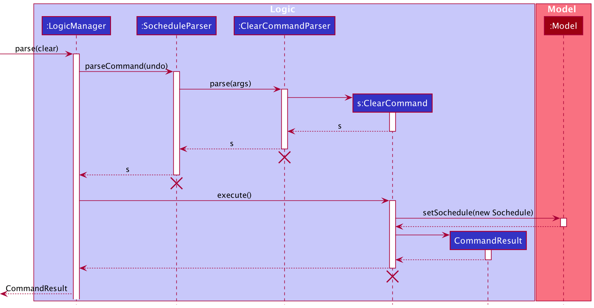
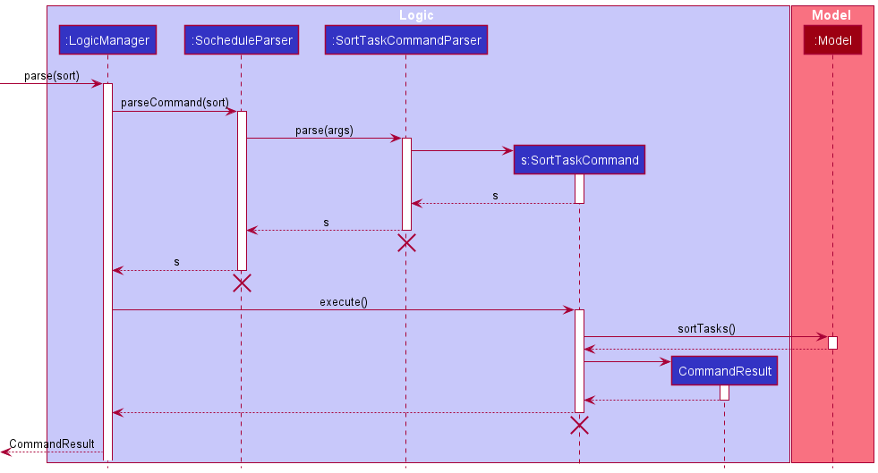
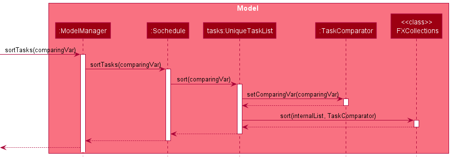
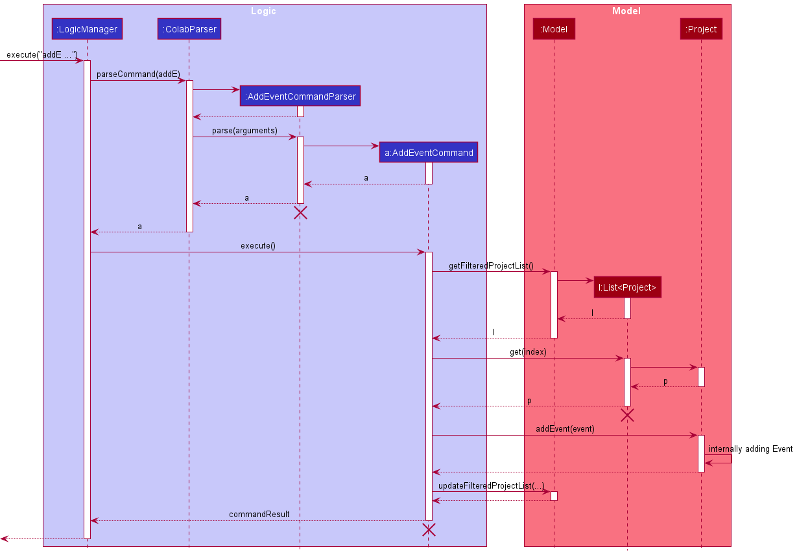

## Table of Contents
1. [Preface](#1-preface) 
1. [Setting up, getting started](#2-setting-up-getting-started) 
1. [Design](#3-design) 
   3.1  [Architecture: High Level View](#31-architecture) 
   3.2  [UI Component](#32-ui-component) 
   3.3  [Logic Component](#33-logic-component) 
   3.4  [Model Component](#34-model-component) 
   3.5  [Storage Component](#35-storage-component) 
   3.6  [Common Classes](#36-common-classes) 
1. [Implementation](#4-implementation) 
   4.1 [SOChedule](#41-sochedule) 
   &nbsp;&nbsp;4.1.1 [Overview](#411-overview) 
   &nbsp;&nbsp;4.1.2 [Implementation of SOChedule-level Commands](#412-implementation) 
   4.2 [Task](#42-task) 
   &nbsp;&nbsp;4.2.1 [Overview](#421-overview) 
   &nbsp;&nbsp;4.2.2 [Implementation of Task-level Commands](#422-implementation) 
   4.3 [Event](#43-event) 
   &nbsp;&nbsp;4.3.1 [Overview](#431-overview) 
   &nbsp;&nbsp;4.3.2 [Implementation of Event-level Commands](#432-implementation) 
1. [Planned Features](#5-documentation-logging-testing-configuration-dev-ops) 
1. [Appendix](#appendix) 
   A1. [Product Scope](#a1-product-scope) 
   A2. [User Stories](#a2-user-stories) 
   A3. [Use Cases](#a3-use-cases) 
   A4. [Non-Functional Requirements](#a4-non-functional-requirements) 
   A5. [Glossary](#a5-glossary) 
   A6. [Instructions for Manual Testing](#a6-instructions-for-manual-testing) 
   A7. [Launch and Shutdown](#a7-launch-and-shutdown) 
   A8. [Saving Data](#a8-saving-data) 
   
--------------------------------------------------------------------------------------------------------------------
## 1. Preface
SOChedule is a one-stop solution for managing tasks and events, optimized for use via a Command Line Interface (CLI) while still having the benefits of a Graphical User Interface (GUI).  

The Developer Guide for Sochedule is designed to showcase the high level architecture systems used to design and implement Sochedule.

The link to the repository can be found [here](https://github.com/AY2021S2-CS2103-W16-1/tp).

--------------------------------------------------------------------------------------------------------------------

## 2. Setting up, getting started

Refer to the guide [_Setting up and getting started_](SettingUp.md).

--------------------------------------------------------------------------------------------------------------------

## 3. Design

### 3.1 Architecture

The ***Architecture Diagram*** given above explains the high-level design of the App. Given below is a quick overview of each component.

:bulb: **Tip:** The `.puml` files used to create diagrams in this document can be found in the [diagrams](https://github.com/se-edu/addressbook-level3/tree/master/docs/diagrams/) folder. Refer to the [_PlantUML Tutorial_ at se-edu/guides](https://se-education.org/guides/tutorials/plantUml.html) to learn how to create and edit diagrams.
 

**`Main`** has two classes called [`Main`](https://github.com/se-edu/addressbook-level3/tree/master/src/main/java/seedu/address/Main.java) and [`MainApp`](https://github.com/se-edu/addressbook-level3/tree/master/src/main/java/seedu/address/MainApp.java). It is responsible for,
* At app launch: Initializes the components in the correct sequence, and connects them up with each other.
* At shut down: Shuts down the components and invokes cleanup methods where necessary.

[**`Commons`**](#common-classes) represents a collection of classes used by multiple other components.

The rest of the App consists of four components.

* [**`UI`**](#ui-component): The UI of the App.
* [**`Logic`**](#logic-component): The command executor.
* [**`Model`**](#model-component): Holds the data of the App in memory.
* [**`Storage`**](#storage-component): Reads data from, and writes data to, the hard disk.

Each of the four components,

* defines its *API* in an `interface` with the same name as the Component.
* exposes its functionality using a concrete `{Component Name}Manager` class (which implements the corresponding API `interface` mentioned in the previous point.

For example, the `Logic` component (see the class diagram given below) defines its API in the `Logic.java` interface and exposes its functionality using the `LogicManager.java` class which implements the `Logic` interface.

**How the architecture components interact with each other**

The *Sequence Diagram* below shows how the components interact with each other for the scenario where the user issues the command `delete_task 1`.

The sections below give more details of each component.

### 3.2 UI component

**API** :
[`Ui.java`](https://github.com/se-edu/addressbook-level3/tree/master/src/main/java/seedu/address/ui/Ui.java)

The UI consists of a `MainWindow` that is made up of parts e.g.`CommandBox`, `ResultDisplay`, `PersonListPanel`, `StatusBarFooter` etc. All these, including the `MainWindow`, inherit from the abstract `UiPart` class.

The `UI` component uses JavaFx UI framework. The layout of these UI parts are defined in matching `.fxml` files that are in the `src/main/resources/view` folder. For example, the layout of the [`MainWindow`](https://github.com/se-edu/addressbook-level3/tree/master/src/main/java/seedu/address/ui/MainWindow.java) is specified in [`MainWindow.fxml`](https://github.com/se-edu/addressbook-level3/tree/master/src/main/resources/view/MainWindow.fxml)

The `UI` component,

* Executes user commands using the `Logic` component.
* Listens for changes to `Model` data so that the UI can be updated with the modified data.

### 3.3 Logic component

**API** :
[`Logic.java`](https://github.com/se-edu/addressbook-level3/tree/master/src/main/java/seedu/address/logic/Logic.java)

1. `Logic` uses the `SocheduleParser` class to parse the user command.
1. This results in a `Command` object which is executed by the `LogicManager`.
1. The command execution can affect the `Model` (e.g. adding a task or an event).
1. The result of the command execution is encapsulated as a `CommandResult` object which is passed back to the `Ui`.
1. In addition, the `CommandResult` object can also instruct the `Ui` to perform certain actions, such as displaying help to the user.

Given below is the Sequence Diagram for interactions within the `Logic` component for the `execute("delete_task 1")` API call.

:information_source: **Note:** The lifeline for `DeleteTaskCommandParser`should end at the destroy marker (X) but due to a limitation of PlantUML, the lifeline reaches the end of diagram.

[Return to Table of Contents](#table-of-contents)  

### 3.4 Model component

This section explains the high level design of the `Model` component of our application.

The `Model` stores:
* a `UserPref` object that represents the user’s preferences.
* the Sochedule data.

There are two main packages in `Model`:
* the `Task` package contains classes that represent a task.
* the  `Event` package contains classes that represent an event.

Also, the `Model`:
* exposes an unmodifiable `ObservableList<Task>` and an unmodifiable `ObservableList<Event>`that can be 'observed' e.g. the UI can be bound to this list so that the UI automatically updates when the data in the list change.
* does not depend on any of the other three components.

The class diagram below gives an overview of the `Model` component. 
Due to size constraint, this diagram omitted the details of the `Task` and `Event` packages. 
For more information, please refer to the class diagrams for `Task` and `Event` at the later section.

**API** : [`Model.java`](https://github.com/AY2021S2-CS2103-W16-1/tp/blob/master/src/main/java/seedu/address/model/Model.java)

The class diagram below gives the design of the `Task` package.

The class diagram below gives the design of the `Event` package.

:information_source: 
**Note:** An (arguably) more OOP model can store a `Tag` list and a `Category` list in the `Sochedule`, which `Task` and `Event` can refer.
This allows `Sochedule` to only require one `Tag` object per unique `Tag`, and one `Category` object per unique `Object`, 
instead of each `Task` and `Event` needing their own `Tag` and `Category` object. 

#### 3.4.1 Design considerations for Task-related Models
When implementing Task-related models, it is important to avoid adding duplicate tasks. 
For example, it is undesirable for users to add the same task, completing CS2103 Quiz before 2021-06-01, twice into the task list. 
Because these two tasks contain the same information and can potentially cause confusion for users 
when he completes one and finds another task with the same description still left uncompleted.

In our application, we require users to minimally provide the name, deadline and priority when creating a task.
To ensure duplicates are handled, our team went through several alternatives and here are our considerations.

* Alternative 1 (Chosen Implementation): `isSameTask(Task task)` method should check if the name, priority, deadline, 
  tags (if any) and categories (if any) are equal.
  * Pros:  
    * Tasks with same name but different deadline, priority and/or any other fields are allowed.
  * Cons:
    * Harder to implement.
* Alternative 2 : `isSameTask(Task task)` method should check for the equality of task name only.
    * Pros:
        * Easier to implement.
        * Ensure that the task names are always distinct.
    * Cons:
        * Less flexibility and may not meet some users' need because task with same name but other different fields are not allowed.

We chose Alternative 1 because it is more flexible and suitable for users' need. 
There can be multiple tasks with same name but other different fields, like deadlines. 
For example, a user may need to create two tasks with the same name '2103 quiz',
but one is due on this Monday and the other is due the next Monday. Both of these 2 tasks should be allowed in our task list.

#### 3.4.2 Design considerations for Event-Related Models
Similar to Task-related Models, we face the same challenge when choosing between checking for the equality of name only and 
checking for all fields entered by the user. We chose to check for all fields for the same reasons as mentioned above.

#### 3.4.3 Design considerations for `Name` Object
When implementing the Name class, one of the considerations we need to decide is about its maximum length. 
Due to constraints in GUI, if the task or event has an extremely long name, only part of the name can be displayed
and the rest will be hidden and cannot be viewed. This is something undesirable.

* Alternative 1 (Chosen Implementation): set the maximum length to 30 characters long.
    * Pros:
        * Resolved the potential bug where tasks or events with excessively long names are displayed
        incompletely.
    * Cons:
        * More restrictive as a hard maximum limit has been set to disallow users from creating a 
        task or event with a name of longer than 20 characters.
* Alternative 2: do not set a maximum length and find other potential solutions.
    * Pros:
        * Users can have more freedom in creating or editing the tasks and events.
    * Cons:
        * May require major changes to the design and implementation of GUI, which may be time consuming and 
          lead to other undesirable bugs.

We chose Alternative 1 because this is the most suitable option given the limited development time 
and more controllable impacts on other components of the application. More importantly, we estimate that 
the current maximum length is sufficient to meet most of our users' common needs. 
Thus, under normal usage, this additional restrictions will not cause great inconveniences to our users.

#### 3.4.3 Design considerations for `Tag` and `Category` Object
Similar to `Name` Object, we face the same challenge when displaying tasks or events with tags and categories
of excessively long length. 
We choose to set the maximum length to 15 characters long for the similar reasons as mentioned above.

### 3.5 Storage component

**API** : [`Storage.java`](https://github.com/AY2021S2-CS2103-W16-1/tp/blob/master/src/main/java/seedu/address/storage/Storage.java)

The `Storage` component,
* can save `UserPref` objects in json format and read it back.
* can save the Sochedule data in json format and read it back.

### 3.6 Common classes

Classes used by multiple components are in the `seedu.address.commons` package.

Classes used by both `Task` and `Event` are in the `seedu.address.model.common` package.

[Return to Table of Contents](#table-of-contents)  

--------------------------------------------------------------------------------------------------------------------

## 4 Implementation

This section describes some noteworthy details on how [SOChedule](#41-sochedule), [Task](#42-task) and [Event](#43-event) are implemented.

### 4.1 SOChedule

#### 4.1.1 Overview

SOChedule consists of two lists: a task list and an event list. The task list is used to accommodate different tasks
specified by users while the event list is used to accommodate different events specified by users.

While both task list and event list can be updated independently by their corresponding commands (e.g. `add_task`, 
`delete_event`), there are some SOChedule-Level commands listed as follows that can act on both task list and event list:

* `clear`
* `summary`
* `find_schedule`

#### 4.1.2 Implementation of SOChedule-Level Commands

**Implementation of ClearCommand**  
The following is a detailed explanation on how ClearCommand is implemented.

**Step 1**: User executes `clear` command to clear task and event lists.
An `ClearCommandParser` object is created, and the `ClearCommandParser#parse(String args)` method is called.
A `ClearCommand` object is returned.

**Step 2**: On `ClearCommand#execute()`, `Model#setSochedule(new Sochedule())` is called.
This will replace Sochedule data with a new empty Sochedule.
For brevity, lower level implementation is omitted.

**Step 3**: On execution completion a `CommandResult` is created.
A success message will be appended with `CommandResult#MESSAGE_SUCCESS`.

The sequence diagram for `ClearCommand` can be found below.

[Return to Table of Contents](#table-of-contents)  

**Implementation of SummaryCommand**  
The following is a detailed explanation on how SummaryCommand is implemented.

**Step 1**: User executes `summary` command to get a summary of the current completion status of tasks and events.
An `SummaryCommandParser` object is created, and the `SummaryCommandParser#parse(String args)` method is called.
A `SummaryCommand` object is returned.

**Step 2**: On `SummaryCommand#execute()`, `Model#getNumCompletedTask()`,
`Model#getFilteredTaskList()`,
`Model#getNumOverdueTask()`,
`Model#getNumIncompleteTask()`,
`Model#getNumIncomingEvents()` are called.
This will get different statistics on task and event completion.
For brevity, lower level implementation is omitted.

**Step 3**: On execution completion a `CommandResult` is created.
A success message will be appended with `CommandResult#MESSAGE_SUCCESS`.

The sequence diagram for `SummaryCommand` can be found below.

[Return to Table of Contents](#table-of-contents)  

#### 4.1.2.3 Find Schedule feature
**Implementation of FindScheduleCommand**  

The find schedule mechanism is supported mainly by `FindScheduleCommand` and `FindScheduleCommandParser`.

The relevant methods include:
* `FindScheduleCommandParser#parse(String args)` - Parses the user input into a Date object.
* `FindScheduleCommand#execute(Model model)` - Finds the uncompleted tasks with deadlines before or on the specified date and
events with start date before or on and end date after or on the specified date.

Given below is an example usage scenario and how the find schedule mechanism behaves at each step.

**Step 1**: User executes `find_schedule 2021-04-01` command to find the ongoing tasks and events before or on the given date.
An `FindScheduleCommandParser` object is created, and the `FindScheduleCommandParser#parse(String args)` method is called.
The method parses the `2021-04-01` and conducts validation checks to ensure that it complies with the specification.
Two predicates, `TaskFindSchedulePredicate(Date date)` and `EventFindSchedulePredicate(Date date)` are created based on the given date.
Then, a `FindScheduleCommand` object is created given the two predicates and returned.

**Step 2**: On `FindScheduleCommand#execute()`, 
`Model#updateFilteredTaskList(TaskFindSchedulePredicate taskPredicate)` 
and `Model#updateFilteredEventList(EventFindSchedulePredicate eventPredicate)` are called.
This will update the task list to only show the uncompleted tasks with the deadline before or on the given date.
Similarly, the event list will be updated to only show the events with start date before or on the given date and end date after or on the given date.
For brevity, lower level implementation of `Model#updateFilteredTaskList(TaskFindSchedulePredicate taskPredicate)` 
and `Model#updateFilteredEventList(EventFindSchedulePredicate eventPredicate)` are omitted.

**Step 3**: On execution completion a `CommandResult` is created.
A success message will be appended with `CommandResult#MESSAGE_FIND_SCHEDULE_SUCCESS`.

The sequence diagram for `FindScheduleCommand` can be found below.

:information_source: 
**Note:** Due to the size constraint, the argument `taskPredicate` is not shown in the sequence diagram 
when calling the method `Model#updateFilteredTaskList(TaskFindSchedulePredicate taskPredicate)`.
Same for the method `Model#updateFilteredEventList(EventFindSchedulePredicate eventPredicate)`.

**Design Considerations**

The purpose of find schedule is to find and show our users the list of tasks and events that are worth to be paid
attention to at the specified date. 

For events, it is clear that events which have not started at the given date (i.e. start date
is before the given date) and events which have ended before the given date (i.e. end date is earlier than the given date)
should not be selected. This leads to only finding events that are ongoing at the specified date 
(i.e. with start date before or on and end date after or on the specified date). 

For tasks, it is rather debatable. Tasks which are completed should not selected. However, it needs some
considerations with regards to what kinds of uncompleted tasks to be selected.

* Alternative 1 (current implementation): Select uncompleted tasks with deadline before or on the given date.
    * Pros:
        * Less tasks are being shown. This may be more helpful as users can focus more on these tasks with an earlier deadline
            than the other tasks.
    * Cons:
        * More restrictive and less tasks being shown also means that less information may be provided to users.
* Alternative 2: Select all existing uncompleted tasks.
    * Pros:
        * More tasks are being shown and presented to users.
    * Cons:
        * The date provided is not adding useful value here and users may find this implementation less helpful.

Alternative 1 is chosen because we believe this implementation can make better use of the date provided and can be more 
helpful for users to know what tasks should be dealt with first and improve their efficiency in task and event managements.

[Return to Table of Contents](#table-of-contents)  

### 4.2 Task

#### 4.2.1 Overview

`Task` is a type of activity that comes with a `Deadline` attribute and can be marked as complete or incomplete. It is
specified by the following attributes:

* `Name`
* `Deadline`
* `Priority`
* `[Category] ...` (Optional, can be multiple)
* `[Tag] ...` (Optional, can be multiple)

Note that a `Task` is defined to be the same as another `Task` if and only if all of their attributes listed above are
equal correspondingly.

Our `Task` supports the following features through a `LogicManager`.

* `add_task`
* `delete_task`
* `edit_task`
* `list_task`
* `done_task`
* `undone_task`
* `today_task`
* `find_task`
* `sort_task`
* `pin_task`
* `unpin_task`
* `clear_completed_task`
* `clear_expired_task`

The implementation of the noteworthy ones will be listed in the next section. Some implementations of features are 
omitted here because their implementation is similar to that of other features.

#### 4.2.2 Implementation

#### 4.2.2.1 Add Task Feature

**Implementation of AddTaskCommand**

The following is a detailed explanation on how AddTaskCommand is implemented.

**Step1**: User executes `add_task n/TASKNAME d/DEADLINE p/PRIORITY [c/CATEGORY]... [t/TAG]...` command to add the 
specific task with given arguments. An `AddTaskCommandParser` object is created, and the 
`AddTaskParser#parse(String args)` method is called. The method conducts parses the `args` and conducts validation
checks to ensure that it compiles with the specification. An `AddTaskCommand` object is returned.

**Step 2**: On `AddTaskCommand#execute()`, `Model#addTasks(Task taskToAdd)` is called.
This will add the task specified into the task list.
For brevity, lower level implementation of `Model#addTasks(Task taskToAdd)` is omitted.

**Step 3**: On execution completion a `CommandResult` is created.
A success message will be appended with `CommandResult#MESSAGE_ADD_TASK_SUCCESS`.
The UI will also update as the underlying task list has been modified.

The sequence diagram for `AddTaskCommand` can be found below.

[Return to Table of Contents](#table-of-contents)  

#### 4.2.2.2 Delete Task Feature

**Implementation of DeleteTaskCommand**  

The following is a detailed explanation on how DeleteTaskCommand is implemented.

**Step 1**: User executes `delete_task Index` command to delete the task at the given index.
A `DeleteTaskParser` object is created, and the `DeleteTaskParser#parse(String args)` method is called.
The method conducts parses the `args` and conducts validation checks to ensure that it complies with the specification.
A `DeleteTaskCommand` object is returned.

**Step 2**: On `DeleteTaskCommand#execute()`, `Model#deleteTasks(Task taskToDelete)` is called.
This will delete the task at the specified index.
For brevity, lower level implementation of `Model#deleteTasks(Task taskToDelete)` is omitted.

**Step 3**: On execution completion a `CommandResult` is created.
A success message will be appended with `CommandResult#MESSAGE_DELETE_TASK_SUCCESS`.
The UI will also update as the underlying task list has been modified.

The sequence diagram for `DeleteTaskCommand` can be found below.

[Return to Table of Contents](#table-of-contents)

#### 4.2.2.3 Done Task feature

**Implementation of DoneTaskCommand**

The done task mechanism is supported mainly by `DoneTaskCommand` and `DoneTaskCommandParser`.

The relevant methods include:
* `DoneTaskCommandParser#parse(String args)` - Parses the user input into one or more Index objects.
* `DoneTaskCommand#execute(Model model)` - Marks the tasks at the given indexes as completed.

Given below is an example usage scenario and how the done task mechanism behaves at each step.

**Step 1**: User executes `done_task 1 2`.
Let us call these task the target tasks.
A `DoneTaskCommandParser` object is created, and the `DoneTaskCommandParser#parse(String args)` method is called.
The method parses the `1 2` and conducts validation checks to ensure that the given indexes are all valid unsigned non-zero integers.
A `DoneTaskCommand` object is returned.

**Step 2**: On `DoneTaskCommand#execute()`, 
the indexes are further checked to ensure the tasks they refer to exist in the task list
and all target tasks are uncompleted.
Afterwards, the information of the target tasks are copied and completed tasks with exactly the same information as the target tasks are created.
Finally, `Model#setTask(Task taskToDone, Task completedTask)` are called two times to update the respective target tasks in the task list.
`Model#updateFilteredTaskList(PREDICATE_SHOW_ALL_TASKS)` method is called to refresh the UI and show the update.
For brevity, lower level implementation of `Model#setTask(Task taskToUndone, Task uncompletedTask)`, 
and `Model#updateFilteredTaskList(PREDICATE_SHOW_ALL_TASKS)` are omitted.

**Step 3**: On execution completion a `CommandResult` is created.
A success message will be appended with `CommandResult#MESSAGE_DONE_TASK_SUCCESS`.

The sequence diagram for `DoneTaskCommand` can be found below.

:information_source: 
**Note:** Due to the size constraint, the argument `PREDICATE_SHOW_ALL_TASKS` is not shown in the sequence diagram 
when calling the method `Model#updateFilteredTaskList(PREDICATE_SHOW_ALL_TASKS)`.

**Design Considerations**

One of the challenges is if we should add additional support to allow done task command to mark more than one tasks as completed.
Here are our considerations.

* Alternative 1: Done task only marks one task as uncompleted.
    * Pros:
        * Easier to implement, maintain and integrate with other commands and components.
    * Cons:
        * More restrictive and users may need slightly more time to done the tasks.

* Alternative 2 (current implementation): Done task can mark more than one tasks as uncompleted.
    * Pros:
        * Users may frequently need to done multiple tasks. This can save a significant amount of time.
    * Cons:
        * More time-consuming to implement, increases difficulty in testing and integration with other commands and components.

Alternative 2 is chosen because we believe this implementation is a more suitable choice. 
Unlike undone task, users are likely to have the demand to done multiple tasks frequently
under normal usage. Thus, we feel alternative 1 is necessary to serve our users efficiently.

[Return to Table of Contents](#table-of-contents)

#### 4.2.2.4 Undone Task feature

**Implementation of UndoneTaskCommand**

The undone task mechanism is supported mainly by `UndoneTaskCommand` and `UndoneTaskCommandParser`.

The relevant methods include:
* `UndoneTaskCommandParser#parse(String args)` - Parses the user input into an Index object.
* `UndoneTaskCommand#execute(Model model)` - Marks the task at the given index as uncompleted.

Given below is an example usage scenario and how the undone task mechanism behaves at each step.

**Step 1**: User executes `undone_task 1` command to mark the completed task at the given index as uncompleted. 
Let us call this task the target task.
A `UndoneTaskCommandParser` object is created, and the `UndoneTaskCommandParser#parse(String args)` method is called.
The method parses the `1` and conducts validation checks to ensure that the given index is a valid unsigned non-zero integer.
A `UndoneTaskCommand` object is returned.

**Step 2**: On `UndoneTaskCommand#execute()`, the index is further checked to ensure it is not out of range (i.e. larger than the size of task list)
and the target task is indeed a completed task.
Afterwards, the information of the target task is copied ,and an uncompleted task with exactly the same information as the target task is created.
Finally, `Model#setTask(Task taskToUndone, Task uncompletedTask)` and `Model#updateFilteredTaskList(PREDICATE_SHOW_ALL_TASKS)` method are called.
These two methods update the target task in the task list and refresh the UI to show the update.
For brevity, lower level implementation of `Model#setTask(Task taskToUndone, Task uncompletedTask)` 
and `Model#updateFilteredTaskList(PREDICATE_SHOW_ALL_TASKS)` are omitted.

**Step 3**: On execution completion a `CommandResult` is created.
A success message will be appended with `CommandResult#MESSAGE_UNDONE_TASK_SUCCESS`.

The sequence diagram for `UndoneTaskCommand` can be found below.

:information_source: 
**Note:** Due to the size constraint, the argument `PREDICATE_SHOW_ALL_TASKS` is not shown in the sequence diagram 
when calling the method `Model#updateFilteredTaskList(PREDICATE_SHOW_ALL_TASKS)`.

The activity diagram that summaries what happens when users execute the `UndoneTaskCommand` can be found below.

**Design Considerations**

One of the challenges is if we should add additional support to allow undone task command to mark more than one tasks as uncompleted.
Here are our considerations.

* Alternative 1 (current implementation): Undone task only marks one task as uncompleted.
    * Pros:
        * Easier to implement, maintain and integrate with other commands and components.
    * Cons:
        * More restrictive and users may need slightly more time to undone the tasks.
    

* Alternative 2: Undone task can mark more than one tasks as uncompleted.
    * Pros:
        * May save a small amount of time when users need to undone multiple tasks.
    * Cons:
        * More time-consuming to implement, increases difficulty in testing and integration with other commands and components.

Alternative 1 is chosen because we believe this implementation is a more suitable choice given the limited development and
testing time. More importantly, unlike done task, users are unlikely to have the demand to undone multiple tasks frequently 
under normal usage. Thus, we feel alternative 1 is sufficient to serve our users.

[Return to Table of Contents](#table-of-contents)

#### 4.2.2.5 Today Task Feature

**Implementation of TodayTaskCommand**

The following is a detailed explanation on how TodayTaskCommand is implemented.

The TodayTaskCommand is supported mainly by `TodayTaskCommand`.

The relevant methods include:
* `TodayTaskCommand#execute(Model model)` - Updates the task list on UI to show all the tasks that has deadline on 
  today which are stored in the internal task list.

Given below is an example usage scenario and how the `today_task` mechanism behaves at each step.

**Step 1**: User executes `today_task` command to list all the tasks with deadline on today in the task list.
A `TodayTaskCommand` object is returned

**Step 2**: On `TodayTaskCommand#execute()`, `Model#updateFilteredTaskList(Predicate<Task> predicate)` is called. This 
will update the filtered task list with the predicate specified by the input predicate, which is a predicate of type
`TaskDeadlineIsTodayPredicate`. For brevity, lower level implementation of 
`Model#updateFilteredTasks(Predicate<Task> predicate)` is omitted.

**Step 3**: On execution completion, a `CommandResult` is created. A success message will be appended with
`CommandResult#MESSAGE_TODAY_TASK_SUCCESS` and `MESSAGE_TASK_LISTED_OVERVIEW`. The UI will also update as the underlying 
task list that has been modified.

The sequence diagram for TodayTaskCommand can be found below.

[Return to Table of Contents](#table-of-contents)

#### 4.2.2.6 Find Task Feature

**Implementation of FindTaskCommand**

The following is a detailed explanation on how FindTaskCommand is implemented.

The FindTaskCommand is supported mainly by `FindTaskCommand` and `FindTaskCommandParser`.

The relevant methods include:
* `FindTaskCommandParser#parse(String args)` - Parses the user input into a list of keywords.
* `FindTaskCommand#execute(Model model)` - Updates the task list on UI to show all the tasks whose names contain any of 
  the given keywords from the internal task list.

Given below is an example usage scenario and how the find task mechanism behaves at each step.

**Step 1**: User executes `find_task homework assignment` to find all tasks whose names contain any of `homework` or 
`assignment`.
Let us call these task the target tasks.
A `FindTaskCommandParser` object is created, and the `FindTaskCommandParser#parse(String args)` method is called.
The method parses the `homework assignment` into a list of strings : [`homwork`, `assignment`], which is the original
string splitted by whitespace. This list of strings will be passed into the constructor of 
`TaskNameContainsKeywordPredicate`, which will then be passed into the constuctor of a `FindTaskCommand`.
The `FindTaskCommand` object with input predicate is returned.

**Step 2**:
On `FindTaskCommand#execute()`, `Model#updateFilteredTaskList(Predicate<Task> predicate)` is called. This
will update the filtered task list with the predicate specified by the input predicate, which is a predicate of type
`TaskNameContainsKeywordPredicate`. For brevity, lower level implementation of
`Model#updateFilteredTasks(Predicate<Task> predicate)` is omitted.

**Step 3**: On execution completion a `CommandResult` is created.
A success message will be appended with `CommandResult#MESSAGE_TASKS_LISTED_OVERVIEW`.

The sequence diagram for `FindTaskCommand` can be found below.

[Return to Table of Contents](#table-of-contents)

#### 4.2.2.6 Edit Task feature

**Implementation of EditTaskCommand**  

The edit task mechanism is supported mainly by `EditTaskCommand` and `EditTaskCommandParser`.

The relevant methods include:
* `EditTaskCommandParser#parse(String args)` - Parses the user input arguments.
* `EditTaskCommand#execute(Model model)` - Edits the task at the specified index and updates its respective
values with the supplied values.

Given below is an example usage scenario and how the edit task mechanism behaves at each step.

**Step 1**: User executes `Edit_task 1 n/t1` command to Edit the task at the given index.
An `EditTaskCommandParser` object is created, and the `EditTaskCommandParser#parse(String args)` method is called.
The method parses the `1 n/t1` and conducts validation checks to ensure that it complies with the specification.
An `EditTaskDescriptor` object is created, and it contains all the field a task needed. 
If the field is edited, then store the edited one; otherwise, store the original value.
An `EditTaskCommand` object (with the `EditTaskDescriptor` as a parameter) is returned.

**Step 2**: On `EditTaskCommand#execute()`, `Model#getFilteredTaskList()` and 
`Model#createEditedTask(Task taskToEdit, EditTaskDescriptor editTaskDescriptor)` are called.
These will create the edited Task. Then, `Model#setTask(Task taskToEdit, Task editedTask)` and 
`Model#updateFilteredTaskList()` are called. These will update the edited Task into the task list.

**Step 3**: On execution completion a `CommandResult` is created.
A success message `EditTaskCommand#MESSAGE_EDIT_TASK_SUCCESS` will be displayed.

The UI will also update as the underlying task list has been modified.

The sequence diagram for `EditTaskCommand` can be found below.

**Design Considerations**

One of the challenges is if we should allow overdue tasks (task with deadlines before today) to be edited.

* Alternative 1 (current implementation): Overdue tasks can be edited.
    * Pros:
        * At very frequent occasions, users may need to edit an overdue task. For example, users may wish to
        extend the deadline of an overdue task, or increasing its priority to remind themselves that this task
          needs more attention.
    * Cons:
        * At very rare occasions, users may not want overdue tasks to be edited. 
          For example, they wanted to evaluate their overall progress for this week and do not wish
          overdue tasks to be accidentally edited.
          

* Alternative 2: Overdue tasks cannot be edited.
    * Pros:
        * May satisfy the demand of users as described in cons of alternative 1.
    * Cons:
        * May not meet the requirements of users as described in pros of alternative 1.

Alternative 1 is chosen because we believe this implementation is a more suitable choice given our users' need at
normal usage. Furthermore, if users wish to their overall progress for this week, they may choose to act with caution before
editing a task or editing it back quickly if they realize they have edited the wrong task.

[Return to Table of Contents](#table-of-contents)  

**Implementation of SortTaskCommand**  
The following is a detailed explanation on how SortTaskCommand is implemented in the Logic component.

**Step 1**: User executes `sort SORT_VAR` command to sort the tasks based on the `SORT_VAR` provided.
An `SortTaskCommandParser` object is created, and the `SortTaskCommandParser#parse(String args)` method is called. 
The method conducts parses the `SORT_VAR` and conducts validation checks to ensure that it complies with the specification.
A `SortTaskCommand` object is returned.

**Step 2**: On `SortTaskCommand#execute()`, `Model#sortTasks(String comparingVar)` is called.
This will cause the task list to sort itself, based on the provided `comparingVar`.
For brevity, lower level implementation of `Model#sortTasks(String comparingVar)` is omitted.

**Step 3**: On execution completion a `CommandResult` is created.
A success message will be appended with `CommandResult#MESSAGE_SORT_TASK_SUCCESS`.
The UI will also update as the underlying task list has been modified.

The sequence diagram for `sortTaskCommand` can be found below.

***Lower Level implementation***  
The following is a brief explanation , as shown in a sequence diagram, of how sorting is implemented inside the Model component.

***Design Considerations for `SortTaskCommand`***
<table>
    <tr>
        <th> Alternative 1 (Chosen Implementation) </th>
        <th> Alternative 2 </th>
    </tr>
    <tr>
        <td> 
            <ul>
                <li>Persistent Sorting using a Comparator</li>
                <li> Pros:
                    <ul>
                        <li>UX considerations when users expect sorting to be persistent over multiple commands</li>
                    </ul>
                </li>
                <li> Cons:
                    <ul>
                        <li>Additional Testing of Comparator needed</li>
                        <li>Additional component added might add to complexity</li>
                    </ul>
                </li>
            </ul>
        </td>
        <td> 
            <ul>
                <li>Transient Sorting by sorting the UniqueTaskList directly</li>
                <li> Pros:
                    <ul>
                        <li>Straightforward implementation</li>
                        <li>Less testing required due to less components</li>
                    </ul>
                </li>
                <li> Cons:
                    <ul>
                        <li>UX might be compromised as order is not maintained over command executions</li>
                    </ul>
                </li>
            </ul>
        </td>
    </tr>
</table>

Our group decided to go with alternative 1 and implemented an additional sort comparator known as `TaskComparator`.
This is to ensure smoother UX, as well as better integration with other commands.

By implementing it in this way, our group is able to ensure that the sort order remains consistent over commands that could either:
* Alter the number of tasks shown at any one time (See <code>find_task</code>)</li>
* Change the order of task appearance independent of <code>sort_task</code> (See <code>pin_task</code>)</li>

This would enable SOChedule to better serve the needs of its user base. 

[Return to Table of Contents](#table-of-contents)

**Implementation of PinTaskCommand/UnpinTaskCommand**  
The following is a detailed explanation on how PinTaskCommand is implemented.
UnpinTaskCommand is largely similar in implementation to PinTaskCommand and will be omitted for brevity.

**Step 1**: User executes `pin_task INDEX` command to pin the task at the given index.
An `PinTaskCommandParser` object is created, and the `PinTaskCommandParser#parse(String args)` method is called.
The method conducts parses the `args` and conducts validation checks to ensure that it complies with the specification.
A `PinTaskCommand` object is returned.

**Step 2**: On `PinTaskCommand#execute()`, `Model#pinTask(Task task)` is called.
This will pin the task at the specified index.
Subsequently, the underlying task list will be sorted by calling `Model#sortTasksDefault()`, with pinned tasks being first in priority, followed by the last sorted variable 
(if `sort_task` was not called before, task list will be sorted by name).
For brevity, lower level implementation of `Model#pinTask(Task task)` is omitted.

**Step 3**: On execution completion a `CommandResult` is created.
A success message will be appended with `CommandResult#MESSAGE_PIN_TASK_SUCCESS`.
The UI will also update as the underlying task list has been modified.

The sequence diagram for `PinTaskCommand` can be found below.
It is largely similar to `SortTaskCommand`, with a some minor differences:
* Instead of `SortTask`-related parsers and commands, `PinTask`-related parsers and commands are created and activated.
* Additional call to `Model#sortTaskDefault()` after `Model#pinTask(Task)`

The below activity diagram summarises what happens when `pin_task` is called.
It can also be similarly extrapolated to apply to `unpin_task`.

[Return to Table of Contents](#table-of-contents)  

**Implementation of ClearCompletedTaskCommand**  
The following is a detailed explanation on how ClearCompletedTaskCommand is implemented.

**Step 1**: User executes `clear_completed_task` command to clear completed tasks in task list.
A `ClearCompletedTaskCommand` object is created and returned.

**Step 2**: On `ClearCompletedTaskCommand#execute()`, `Model#clearCompletedTasks()` is called.
This will delete all ticked tasks (all completed tasks).
For brevity, lower level implementation of `Model#clearCompletedTasks()` is omitted.

**Step 3**: On execution completion a `CommandResult` is created.
A success message `ClearCompletedTaskCommand#MESSAGE_CLEAR_COMPLETED_TASK_SUCCESS` will be displayed.

The sequence diagram for `ClearCompletedTaskCommand` can be found below.

[Return to Table of Contents](#table-of-contents)  

**Implementation of ClearExpiredTaskCommand**  
The following is a detailed explanation on how ClearExpiredTaskCommand is implemented.

**Step 1**: User executes `clear_completed_task` command to clear completed tasks in task list.
A `ClearExpiredTaskCommand` object is created and returned.

**Step 2**: On `ClearExpiredTaskCommand#execute()`, `Model#clearExpiredTasks()` is called.
This will delete all expired tasks whose deadline have already past.
For brevity, lower level implementation of `Model#clearExpiredTasks()` is omitted.

**Step 3**: On execution completion a `CommandResult` is created.
A success message `ClearExpiredTaskCommand#MESSAGE_CLEAR_EXPIRED_TASK_SUCCESS` will be displayed.

The sequence diagram for `ClearExpiredTaskCommand` can be found below.

[Return to Table of Contents](#table-of-contents)  

### 4.3 Event

#### 4.3.1 Overview

`Event` is a type of activity that has a specific `StartDate` and `StartTime` following an `EndDate` and `EndTime`.
It is specified by the following attributes:

* `Name`
* `StartDate`
* `StartTime`
* `EndDate`
* `EndTime`
* `[Category] ...` (Optional, can be multiple)
* `[Tag] ...` (Optional, can be multiple)

Note that an `Event` is defined to be the same as another `Event` if and only if all of their attributes listed above 
are equal correspondingly.

Our `Event` supports the following features through a `LogicManager`

* `add_event`
* `delete_event`
* `edit_event`
* `list_event`
* `today_event`
* `find_event`
* `clear_expired_event`

The implementation of the noteworthy ones will be listed in the next section. Some implementations of features are
omitted here because their implementation is similar to that of other features.

#### 4.3.2 Implementation

**Implementation of AddEventCommand**
The following is a detailed explanation on how AddEventCommand is implemented.

**Step1**: User executes `add_event n/TASKNAME sd/STARTDATE st/STARTTIME ed/ENDDATE et/ENDTIME [c/CATEGORY]... [t/TAG]...` 
command to add the specific event with given arguments. An `AddEventCommandParser` object is created, and the 
`AddEventParser#parse(String args)` method is called. The method conducts parses the `args` and conducts validation
checks to ensure that it compiles with the specification. An `AddEventCommand` object is returned.

**Step 2**: On `AddEventCommand#execute()`, `Model#addEvents(Event eventToAdd)` is called.
This will add the event specified into the event list.
For brevity, lower level implementation of `Model#addEvents(Event eventToAdd)` is omitted.

**Step 3**: On execution completion a `CommandResult` is created.
A success message `AddEventCommand#MESSAGE_ADD_EVENT_SUCCES` will be displayed.
The UI will also update as the underlying event list has been modified.

The sequence diagram for `AddEventCommand` can be found below.

[Return to Table of Contents](#table-of-contents)  

**Implementation of DeleteEventCommand**  
The following is a detailed explanation on how DeleteEventCommand is implemented.

**Step 1**: User executes `delete_event Index` command to delete the event at the given index.
A `DeleteEventParser` object is created, and the `DeleteEventParser#parse(String args)` method is called.
The method conducts parses the `args` and conducts validation checks to ensure that it complies with the specification.
A `DeleteEventCommand` object is returned.

**Step 2**: On `DeleteEventCommand#execute()`, `Model#deleteEvents(Event eventToDelete)` is called.
This will delete the event at the specified index.
For brevity, lower level implementation of `Model#deleteEvents(Event eventToDelete)` is omitted.

**Step 3**: On execution completion a `CommandResult` is created.
A success message `DeleteEventCommand#MESSAGE_DELETE_EVENT_SUCCESS` will be displayed.
The UI will also update as the underlying event list has been modified.

The sequence diagram for `DeleteEventCommand` can be found below.

[Return to Table of Contents](#table-of-contents)

**Implementation of TodayEventCommand**

The following is a detailed explanation on how TodayEventCommand is implemented.

The TodayEventCommand is supported mainly by `TodayEventCommand`.

The relevant methods include:
* `TodayEventCommand#execute(Model model)` - Updates the event list on UI to show all the events whose time duration has
  overlaps with today in the event list.

Given below is an example usage scenario and how the `today_event` mechanism behaves at each step.

**Step 1**: User executes `today_event` command to list all the events whose duration has overlap with today
in the event list.
A `TodayEventCommand` object is returned

**Step 2**: On `TodayEventCommand#execute()`, `Model#updateFilteredEventList(Predicate<Event> predicate)` is called. This
will update the filtered event list with the predicate specified by the input predicate, which is a predicate of type
`EventCoversTodayPredicate`. For brevity, lower level implementation of
`Model#updateFilteredEvents(Predicate<Event> predicate)` is omitted.

**Step 3**: On execution completion, a `CommandResult` is created. A success message will be appended with
`CommandResult#MESSAGE_TODAY_EVENT_SUCCESS` and `MESSAGE_EVENT_LISTED_OVERVIEW`. The UI will also update as the underlying
event list that has been modified.

The sequence diagram for TodayEventCommand can be found below.

[Return to Table of Contents](#table-of-contents)

**Implementation of FindEventCommand**

The following is a detailed explanation on how FindEventCommand is implemented.

The FindEventCommand is supported mainly by `FindEventCommand` and `FindEventCommandParser`.

The relevant methods include:
* `FindEventCommandParser#parse(String args)` - Parses the user input into a list of keywords.
* `FindEventCommand#execute(Model model)` - Updates the event list on UI to show all the events whose names contain any of
  the given keywords from the internal event list.

Given below is an example usage scenario and how the find event mechanism behaves at each step.

**Step 1**: User executes `find_event project meeting` to find all events whose names contain any of `project` or
`meeting`.
Let us call these task the target tasks.
A `FindEventCommandParser` object is created, and the `FindEventCommandParser#parse(String args)` method is called.
The method parses the `project meeting` into a list of strings : [`project`, `meeting`], which is the original
string splitted by whitespace. This list of strings will be passed into the constructor of
`EventNameContainsKeywordPredicate`, which will then be passed into the constuctor of a `FindEventCommand`.
The `FindEventCommand` object with input predicate is returned.

**Step 2**:
On `FindEventCommand#execute()`, `Model#updateFilteredEventList(Predicate<Event> predicate)` is called. This
will update the filtered event list with the predicate specified by the input predicate, which is a predicate of type
`EventNameContainsKeywordPredicate`. For brevity, lower level implementation of
`Model#updateFilteredEvents(Predicate<Eventk> predicate)` is omitted.

**Step 3**: On execution completion a `CommandResult` is created.
A success message will be appended with `CommandResult#MESSAGE_EVENTS_LISTED_OVERVIEW`.

The sequence diagram for `FindEventCommand` can be found below.

[Return to Table of Contents](#table-of-contents)

**Implementation of EditEventCommand**  
The following is a detailed explanation on how EditEventCommand is implemented.

The `edit_event` feature was implemented with a static class `EditEventDescriptor` introduced.

**Step 1**: User executes `edit_event Index` command to Edit the event at the given index.
An `EditEventParser` object is created, and the `EditEventParser#parse(String args)` method is called.
The method conducts parses the `args` and conducts validation checks to ensure that it complies with the specification.
An `EditEventDescriptor` object is created, and it contains all the field an Event needed. 
If the field is edited, then store the edited one; otherwise, store the original value.
An `EditEventCommand` object (with the `EditEventDescriptor` as a parameter) is returned.

**Step 2**: On `EditEventCommand#execute()`, `Model#getFilteredEventList()` and 
`Model#createEditedEvent(Event eventToEdit, EditEventDescriptor editEventDescriptor)` are called.
These will create the edited Event. Then, `Model#setEvent(Event eventToEdit, Event editedEvent)` and 
`Model#updateFilteredEventList()` are called. These will update the edited Event into the event list.

**Step 3**: On execution completion a `CommandResult` is created.
A success message `EditEventCommand#MESSAGE_EDIT_TASK_SUCCESS` will be displayed.
The UI will also update as the underlying event list has been modified.

The sequence diagram for `EditEventCommand` can be found below.

The following activity diagram summarises what happens when a user executes a EditEventCommand:
(For brevity, "Show error" actions are omitted.)

›

***Design Considerations for `EditEventCommand`***
<table>
    <tr>
        <th> Alternative 1 (Chosen Implementation) </th>
        <th> Alternative 2 </th>
    </tr>
    <tr>
        <td> 
            <ul>
                <li>Allows an expired event to be edited only when end date time need to be extended to an unexpired time</li>
                <li> Pros:
                    <ul>
                        <li>Similar checks to AddEventCommand</li>
                    </ul>
                </li>
                <li> Cons:
                    <ul>
                        <li>Only end date time of an unexpired event can be edited</li>
                        <li>Affects other classes</li>
                    </ul>
                </li>
            </ul>
        </td>
        <td> 
            <ul>
                <li>Allows all fields in an expired event to be edited</li>
                <li> Pros:
                    <ul>
                        <li>Users have more freedom to edited things</li>
                    </ul>
                </li>
                <li> Cons:
                    <ul>
                        <li>Need to add extra checks in EditEventCommand</li>
                    </ul>
                </li>
            </ul>
        </td>
    </tr>
</table>

We chose alternative 1 because if the event in the real world ended, it’s meaningless to let users make changes 
on any field other than end date time. We did consider the fact that an event in the real world could be extended, 
so we allow users to make changes on end date time from an expired timestamp to an unexpired timestamp. Besides, 
we allowed an expired task to be edited is because if the task is expired but not completed yet, it would then become 
an “overdue task”, while there’s no “overdue event”.

[Return to Table of Contents](#table-of-contents)

**Implementation of FindFreeTimeCommand**  
The following is a detailed explanation on how FindFreeTaskCommand is implemented.

**Step 1**: User executes `free_time DATE` command to find free time slots in the given day.
An `FindFreeTimeCommandParser` object is created, and the `FindFreeTimeCommandParser#parse(String args)` method is called.
The method conducts parses the `args` and conducts validation checks to ensure that it complies with the specification.
A `FindFreeTimeCommand` object is returned.

**Step 2**: On `FindFreeTimeCommand#execute()`, `Model#getFreeTimeSlots(Date date)` is called.
This will get free time slots and store in a string arraylist.
For brevity, lower level implementation of `Model#getFreeTimeSlots(Date date)` is omitted.

**Step 3**: On execution completion a `CommandResult` is created.
A success message will be appended with `CommandResult#MESSAGE_FIND_FREE_TIME_SUCCESS`.

The sequence diagram for `FindFreeTimeCommand` can be found below.

The below activity diagram summarises what happens when `free_time` is called.

***Design Considerations for `FindFreeTimeCommand`***
<table>
    <tr>
        <th> Alternative 1 (Chosen Implementation) </th>
        <th> Alternative 2 </th>
    </tr>
    <tr>
        <td> 
            <ul>
                <li>Several helper functions were implemented in UniqueEventList class</li>
                <li> Pros:
                    <ul>
                        <li>Each function handles a small part of logic</li>
                        <li>Easier to detect bugs</li>
                        <li>Better readability of code</li>
                    </ul>
                </li>
                <li> Cons:
                    <ul>
                        <li>Longer lines of code</li>
                        <li>Affects other classes</li>
                    </ul>
                </li>
            </ul>
        </td>
        <td> 
            <ul>
                <li>Write methods in FindFreeTimeCommand class directly</li>
                <li> Pros:
                    <ul>
                        <li>Straightforward implementation</li>
                        <li>Less testing required due to less components</li>
                    </ul>
                </li>
                <li> Cons:
                    <ul>
                        <li>Strong dependency on Event class and UniqueEventList class</li>
                    </ul>
                </li>
            </ul>
        </td>
    </tr>
</table>

We choose alternative 1 because it presents code in a clearer way. Breaking up long methods into shorter methods will improve
readability of the code. Implementing codes under UniqueEventList also reduces dependency.

[Return to Table of Contents](#table-of-contents)  

**Implementation of ClearExpiredEventCommand**  
The following is a detailed explanation on how ClearExpiredEventCommand is implemented.

**Step 1**: User executes `clear_completed_event` command to clear completed events in event list.
A `ClearExpiredEventCommand` object is created and returned.

**Step 2**: On `ClearExpiredEventCommand#execute()`, `Model#clearExpiredEvents()` is called.
This will delete all expired events whose end date time have already past.
For brevity, lower level implementation of `Model#clearExpiredEvents()` is omitted.

**Step 3**: On execution completion a `CommandResult` is created.
A success message `ClearExpiredEventCommand#MESSAGE_CLEAR_COMPLETED_TASK_SUCCESS` will be displayed.

The sequence diagram for `ClearExpiredEventCommand` can be found below.

[Return to Table of Contents](#table-of-contents)  

--------------------------------------------------------------------------------------------------------------------

## 5. Documentation, logging, testing, configuration, dev-ops

* [Documentation guide](Documentation.md)
* [Testing guide](Testing.md)
* [Logging guide](Logging.md)
* [Configuration guide](Configuration.md)
* [DevOps guide](DevOps.md)

--------------------------------------------------------------------------------------------------------------------

## Appendix

### A1. Product scope

**Target user profile**:

* NUS SOC Student
* Prefer using CLI rather than GUI
* Struggle to manage their schedule
* Have a lot of commitments (6 modules, TA and RA roles while balancing a part time internship)
* Can type fast, hate mouse

**Value proposition**:

* Provide a simple platform for target users to manage their schedule
* CLI commands to manage meetings or schedule with some contacts
* CLI commands to add tasks and reminders
* GUI to display the schedule of user

### A2. User stories

Priorities: High (must have) - `* * *`, Medium (nice to have) - `* *`, Low (unlikely to have) - `*`

#### Task Related

| Priority | As a …​                            | I want to …​                                                        | So that …​                                                                |
| -------- | ------------------------------------- | ---------------------------------------------------------------------- | ---------------------------------------------------------------------------- |
| `* * *`  | SOC Student                           | Add a task to my schedule                                              | I can track my task better                                                   |
| `* * *`  | SOC Student                           | Delete a task from my schedule                                         | I can have flexibility in my schedule                                        |
| `* * *`  | SOC Student                           | Edit tasks in my schedule                                              | I can have flexibility in my schedule                                        |
| `* * *`  | SOC Student                           | View tasks in my schedule                                              | I can have a better sense of what will happen in the following days or weeks |
| `* *`    | SOC Student                           | Mark a task complete in my schedule                                    | I can track which tasks I have completed                                     |
| `* *`    | SOC Student                           | Undo a completed task in my schedule                                   | I undo the marking if it is done by mistake                                  |
| `* *`    | SOC Student                           | Sort my tasks in my schedule in various orderings                      | I can prioritise my time better                                              |
| `* *`    | SOC Student                           | Pin certain tasks in my schedule                                       | I can prioritise my time better                                              |
| `* *`    | SOC Student                           | Unpin certain tasks in my schedule                                     | I can prioritise my time better                                              |
| `*`      | SOC Student                           | View tasks with the deadline on current date                           | I can have a better sense of what tasks are due today                        |
| `*`      | SOC Student                           | Search tasks by certain keywords                                       | I can view the details of the task that I want to find                       |
| `*`      | SOC Student                           | Clear completed tasks                                                  | I can make my schedule cleaner                                               |
| `*`      | SOC Student                           | Clear expired tasks                                                    | I can make my schedule cleaner                                               |
| `*`      | SOC Student                           | Allocate a priority score to a task                                    | I can prioritise my time better                                              |
| `*`      | SOC Student                           | Allocate a category to a task                                          | I can know what category my tasks belong to                                  |

#### Event Related

| Priority | As a …​                            | I want to …​                                                        | So that …​                                                                |
| -------- | ------------------------------------- | ---------------------------------------------------------------------- | ---------------------------------------------------------------------------- |
| `* * *`  | SOC Student                           | Add an event to my schedule                                            | I can track my events better                                                 |
| `* * *`  | SOC Student                           | Delete an event from my schedule from my schedule                      | I can have flexibility in my schedule                                        |
| `* * *`  | SOC Student                           | Edit events in my schedule                                             | I can have flexibility in my schedule                                        |
| `* * *`  | SOC Student                           | View events in my schedule                                             | I can have a better sense of what will happen in the following days or weeks |
| `*`      | SOC Student                           | View events that are happening today                                   | I can have a better sense of what events are happening today                 |
| `*`      | SOC Student                           | Search events by certain keywords                                      | I can view the details of the event that I want to find                      |
| `*`      | SOC Student                           | Clear expired events                                                   | I can make my schedule cleaner                                               |
| `*`      | SOC Student                           | Allocate a priority score to an event                                  | I can prioritise my time better                                              |
| `*`      | SOC Student                           | Allocate a category to an event                                        | I can know what category my events belong to                                 |

#### Both Task and Event Related

| Priority | As a …​                            | I want to …​                                                        | So that …​                                                                |
| -------- | ------------------------------------- | ---------------------------------------------------------------------- | ---------------------------------------------------------------------------- |
| `* *`    | SOC Student                           | Find tasks and events before or on a given date                        | I can keep track of my tasks and events better                               |
| `* *`    | SOC Student                           | Find free time slots on a specific date                                | I can allocate my time better                                                |
| `* *`    | SOC Student                           | Have a summary of task completion status and events in next 7 days     | I can keep track of my progress and plan ahead for my schedule               |
| `*`      | SOC Student                           | Clear the entire schedule                                              | I can start adding tasks and events from fresh                               |

*{More to be added}*

### A3. Use cases

(For all use cases below, the **System** is the `SOChedule` and the **Actor** is the `User`, unless specified otherwise)

**Use case: UC01 - Adding a task**

**MSS**

1. User wishes to add a new task.
2. User enters the required parameters.
3. SOChedule displays a success message for adding the task.
  
Use case ends.

**Extensions**

* 2a. Some required information about the task is missing in the command.

    * 1a1. SOChedule displays an error message suggesting that information provided when creating
      the task is incomplete.
      Use case ends.

* 2b. The date provided for the deadline of task is invalid

    * 2b1. SOChedule displays an error message suggesting that date provided for the event
      is invalid, or not following the `YYYY-MM-DD` format.
      Use case ends.

**Use case: UC02 - Deleting a task**

**MSS**

1. User requests to <u> list tasks (UC04)</u>.
2. SOChedule shows a list of tasks.
3. User chooses to delete a task.
4. User enters the index of the task to be deleted.
5. SOChedule displays a success message for deleting the task.
     
   Use case ends.

**Extensions**

* 2a. The task list is empty.

  Use case ends.

   

* 3a. The given index is invalid.

    * 3a1. SOChedule shows an error message.

      Use case resumes at step 2.

**Use case: UC03 - Editing a task**

**MSS**

1. User requests to <u> list tasks (UC04)</u>.
2. SOChedule shows a list of tasks.
3. User chooses to edit a task.
4. SOChedule edits the task and displays a success message for editing the task.
     
   Use case ends.
   
**Extensions**

* 2a. The task list is empty.

  Use case ends.

   

* 3a. The task specified by the user is not found in the current task list.

    * 3a1. SOChedule shows an error message.

      Use case resumes at step 2.
    
    
* 3b. The input by user has an invalid command format.
  Some (but not all) examples may include that no index is given, 
  index provided is not a valid positive integer.

    * 3b1. SOChedule shows an error message.

      Use case resumes at step 2.

* 3c. Any of the given attribute by user is invalid.
  Some examples may include that `p/10` is given to update the priority of the task,
  but priority can only be a single digit integer from 0 to 9 inclusive.
  
    * 3c1. SOChedule shows an error message.

      Use case resumes at step 2.

* 3d. No field to edit is provided. An example may be `edit_task 1`.

  * 3d1. SOChedule shows an error message.

      Use case resumes at step 2.

    
* 3e. No field to edit is provided. An example may be `edit_task 1`.

    * 3e1. SOChedule shows an error message.

      Use case resumes at step 2.
    

* 3f. The edited task is equivalent to the original task.

    * 3f1. SOChedule shows an error message.

      Use case resumes at step 2.

* 3g. The edited task is equivalent to an existing task in the task list.

    * 3g1. SOChedule shows an error message.

      Use case resumes at step 2.
    

**Use case: UC04 - List tasks**

**MSS**

1. User requests to list all tasks in the SOChedule.
1. SOChedule displays a list of all tasks added.
     
   Use case ends.

**Extensions**

* 1a. No task have been added.

    * 1a1. SOChedule displays an empty list and informs user that the task list is empty.

      Use case ends.

**Use case: UC05 - Marking one or more tasks as completed**

**MSS**

1. User requests to <u> list tasks (UC04)</u>.
2. SOChedule shows a list of tasks.
3. User chooses to mark one or more tasks as completed.
4. SOChedule displays a success message for marking the task as completed.
     
   Use case ends.

**Extensions**

* 2a. The task list is empty.

  Use case ends.

* 3a. Any of the tasks specified by the user is not found in the current task list.

    * 3a1. SOChedule shows an error message.

      Use case resumes at step 2.

* 3b. Any of the task specified by the user is already marked as completed.

    * 3b1. SOChedule shows an error message.

      Use case resumes at step 2.

* 3c. The input by user has an invalid command format.
  Some examples may include that no index is given, any of the indexes provided is not a valid positive integer.

    * 3c1. SOChedule shows an error message.

      Use case resumes at step 2.

**Use case: UC06 - Undone a task**

**MSS**

1. User requests to <u> list tasks (UC04)</u>.
2. SOChedule shows a list of tasks.
3. User chooses to mark a task as uncompleted.
4. SOChedule displays a success message for marking the task as uncompleted.
     
   Use case ends.

**Extensions**

* 2a. The task list is empty.

  Use case ends.

* 3a. The task specified by the user is not found in the current task list.

    * 3a1. SOChedule shows an error message.

      Use case resumes at step 2.

* 3b. The task specified by the user is already marked as uncompleted.

    * 3b1. SOChedule shows an error message.

      Use case resumes at step 2.

* 3c. The input by user has an invalid command format.
  Some examples may include that no index is given, index provided is not a valid positive integer.

    * 3c1. SOChedule shows an error message.

      Use case resumes at step 2.

**Use case: UC07 - Getting tasks today**

**MSS**

1. User requests to list all tasks with deadline on today in the SOChedule.
2. SOChedule displays a list of all tasks with deadline on today.
     
   Use case ends.

**Extensions**

* 1a. No task have deadline on today.

    * 1a1. SOChedule displays an empty list and informs user that the 0 task has been listed.

      Use case ends.

**Use case: UC08 - Finding tasks by name**

**MSS**

1. User requests to search all the tasks whose name contains any of the input keywords.
2. SOChedule displays a list of all tasks with name containing any of the input keywords.
      
   Use case ends.
   
**Extensions**

* 1a. No task name contains any of the given keywords.

    * 1a1. SOChedule displays an empty list and informs user that 0 task has been listed.
    
        Use case ends.

**Use case: UC09 - Sorting all tasks**

**MSS**

1. User requests to <u> list tasks (UC04)</u>.
2. SOChedule shows a list of tasks.
3. User chooses to sort task.
4. User enters the sort parameter.
5. SOChedule sorts the task list, and displays a success message.
     
   Use case ends.

**Extensions**

* 2a. The task list is empty.

  Use case ends.

* 4a. The given sort argument is invalid.

    * 4a1. SOChedule shows an error message indicating the invalidity of the sort argument.

      Use case resumes at step 2.

**Use case: UC10 - Pinning a task**

**MSS**

1. User requests to <u> list tasks (UC04)</u>.
2. SOChedule shows a list of tasks.
3. User requests to pin a specific task in the list.
4. SOChedule pins the task, <u> sorts the task list (UC09)</u>, and displays a success message for pinning the task.
     
   Use case ends.

**Extensions**

* 2a. The task list is empty.

  Use case ends.

* 3a. The given index is invalid.

    * 3a1. SOChedule shows an error message indicating the invalidity of the index.

      Use case resumes at step 2.
        
* 3b. The task specified by index is already pinned

    * 3b1. SOChedule shows an error message indicating that task is already pinned.

      Use Case resumes at step 2.

**Use case: UC11 - Unpinning a task**

**MSS**

1. User requests to <u> list tasks (UC04)</u>.
2. SOChedule shows a list of tasks.
3. User requests to unpin a specific task in the list.
4. SOChedule unpins the task, <u> sorts the task list (UC09)</u>, and displays a success message for unpinning the task.
     
   Use case ends.

**Extensions**

* 2a. The task list is empty.

  Use case ends.

* 3a. The given index is invalid (negative or out of range).

    * 3a1. SOChedule shows an error message indicating the invalidity of the index.

      Use case resumes at step 2.
    
* 3b. The task specified by index is not pinned

    * 3b1. SOChedule shows an error message indicating that task is not pinned.
    
      Use Case resumes at step 2.

**Use case: UC12 - Clearing all completed tasks**

1. User requests to clear all completed tasks.
1. SOChedule displays a success message for clearing all completed tasks.
  
Use case ends.

**Use case: UC13 - Clearing all expired tasks**

1. User requests to clear all expired tasks.
1. SOChedule displays a success message for clearing all expired tasks.
  
Use case ends.

**Use case: UC14 - Adding an event**

**MSS**

1. User requests to add a new event.
1. SOChedule displays a success message for adding the event.
  
Use case ends.

**Extensions**

* 1a. Some required information about the event is missing in the command.

    * 1a1. SOChedule displays an error message suggesting that information provided when creating
      the event is incomplete.
      Use case ends.

* 1b. The date provided for the event is invalid

    * 1b1. SOChedule displays an error message suggesting that date provided for the event
      is invalid, or not following the `YYYY-MM-DD` format.
      Use case ends.

**Use case: UC15 - Deleting an event**

**MSS**

1. User requests to <u> list events (UC17)</u>.
1. SOChedule shows a list of events.
1. User requests to delete a specific event in the list.
1. SOChedule displays a success message for deleting the event.
  
Use case ends.

**Extensions**

* 2a. The event scheduler is empty.

  Use case ends.

* 3a. The given index is invalid.

    * 3a1. SOChedule shows an error message.

      Use case resumes at step 2.

**Use case: UC16 - Editing an event**

1. User requests to <u> list events (UC17)</u>.
1. SOChedule shows a list of events.
1. User requests to edit a specific event in the list.
1. SOChedule displays a success message for editing the event.
     
   Use case ends.
   
* 3a. No edited field is provided

    * 3a1. SOChedule displays an error message suggesting that information provided when editing
      the event is incomplete.
      Use case resumes at step 2.

* 3b. The event is expired

    * 3b1. SOChedule displays an error message suggesting that an expired event cannot be edited.
      Use case resumes at step 2.
      
* 3c. The date provided for the event is invalid

    * 3c1. SOChedule displays an error message suggesting that date provided for the event
      is invalid, or not following the `YYYY-MM-DD` format.
      Use case resumes at step 2.
      
* 3d. The given index is invalid.

    * 3d1. SOChedule shows an error message.
      Use case resumes at step 2.

**Extensions**

* 2a. The task list is empty.

  Use case ends.

* 3a. The given index is invalid.

    * 3a1. SOChedule shows an error message indicating the invalidity of the index.

      Use case resumes at step 2.

**Use case: UC17 - Listing events**

**MSS**

1. User requests to list all events in the SOChedule.
2. SOChedule displays a list of all events added.
     
   Use case ends.

**Extensions**

* 1a. No events have been added.

    * 1a1. SOChedule displays an empty list and informs user that the event list is empty.
    
      Use case ends.

**Use case: UC18 - Getting today's events**

**MSS**

1. User requests to list all events that are happening on today in the SOChedule.
1. SOChedule displays a list of all events that are happening on today.
     
   Use case ends.

**Extensions**

* 1a. No event is happening on today.

    * 1a1. SOChedule displays an empty list and informs user that the 0 event has been listed.

      Use case ends.

**Use case: UC19 - Find an event**

**MSS**

1. User requests to search all the events whose name contains any of the input keywords.
2. SOChedule displays a list of all events with name containing any of the input keywords.
     
   Use case ends.

**Extensions**

* 1a. No event name contains any of the given keywords.

    * 1a1. SOChedule displays an empty list and informs user that 0 event has been listed.

      Use case ends.

**Use case: UC20 - Clearing expired events**

1. User requests to clear all expired events.
1. SOChedule displays a success message for clearing all expired events.
  
Use case ends.
   
**Use case: UC21 - Finding Schedule Given a Date**

**MSS**
1. User requests to <u> list events (UC17)</u>.
2. SOChedule shows a list of events.
3. User requests to <u> list tasks (UC04)</u>.
4. SOChedule shows a list of tasks.
5. User wishes to find schedule given a specified date.
6. SOChedule shows uncompleted tasks that are due before or on the specified date (if any)
   and events that are ongoing given the specified date (if any).
     
   Use case ends.

**Extensions**

* 5a. The specified date is invalid or does not follow the required format.

    * 5a1. SOChedule shows an error message.

      Use case resumes at step 4.

* 5b. The input by user has an invalid command format.
  Some examples may include that no date is provided.
  
    * 5b1. SOChedule shows an error message.

      Use case resumes at step 4.

* 5c. Both task list and event list are empty.

    * 5c1. SOChedule shows an empty task list and event list.

      Use case ends.

**Use case: UC22 - Finding free time slots**

**MSS**

1. User requests to find free time slots on a given date.
2. SOChedule shows a list of free time slots on that date.
   Use case ends.

**Extensions**

* 2a. SOChedule notifies that there is no free time slots.

  Use case ends.

* 3a. The given date is invalid.

    * 3a1. SOChedule shows an error message indicating the invalidity of the date.

      Use case ends.

**Use case: UC23 - Getting a summary of SOChedule**

**MSS**

1. User requests to have a summary.
2. SOChedule shows a list of different types of tasks and events happening in the next 7 days.
   Use case ends.

**Use case: UC24 - Clearing SOChedule**

**MSS**

1. User requests to clear the whole SOChedule.
2. SOChedule clears all tasks and events stored.
3. SOChedule shows an empty list of tasks and events.

*{More to be added}*

### A4. Non-Functional Requirements

1.  Should work on any _mainstream OS_ as long as it has Java `11` or above installed.
1.  Should be able to hold up to 1000 tasks without a noticeable sluggishness in performance for typical usage.
1.  Should be able to hold up to 500 events without a noticeable sluggishness in performance for typical usage.
1.  A user with above average typing speed for regular English text (i.e. not code, not system admin commands) should be able to accomplish most of the tasks faster using commands than using the mouse.
1.  Should give a response to user's input within 5 seconds.
1.  The user interface should be intuitive to a SoC freshman with little knowledge about programming.
1.  The source code should be open source.

*{More to be added}*

### A5. Glossary

* **Mainstream OS**: Windows, Linux, Unix, OS-X
* **Event**: Activities that start at a specific time and ends at a specific time.
* **Task**: Activities to be undertaken that can be marked complete/incomplete. It also has a compulsory date field to 
  indicate its deadline.

--------------------------------------------------------------------------------------------------------------------

### A6. Instructions for manual testing

Given below are instructions to test the app manually.

:information_source: **Note:** These instructions only provide a starting point for testers to work on;
testers are expected to do more *exploratory* testing.

1. Initial launch

   1. Download the jar file and copy into an empty folder
   
   1. For testing purposes, a sample `sochedule.json` is provided [here](https://raw.githubusercontent.com/AY2021S2-CS2103-W16-1/tp/master/https://github.com/AY2021S2-CS2103-W16-1/tp/tree/master/src/test/data/sochedule.json). Place this file in a directory named `data`. `data` should be in the same relative path as `SOChedule.jar`.

   1. Double-click the jar file Expected: Shows the GUI with a set of sample data.

### Adding a task

1. Adding a task

    1. Prerequisites: No duplicates tasks could exist.

    1. Test case: `add_task n/Homework 1 d/2021-05-10 p/8`
       
        Expected: Task successfully added, detailed information shown in the status bar.

    1. Test case: `add_task n/Assignment d/2021-05-11 p/9 c/Assignment`
       
        Expected: Task successfully added, detailed information shown in the status bar.

    1. Test case: `add_task n/Past Task d/2021-01-07 p/7`
       Expected: Task is not added, since deadline is past. Detailed error message shown in the status bar.

    1. Other incorrect commands to try: `add_task`, `add_task n/Task 1`, etc.

1. _{ more test cases …​ }_

### Deleting a task (Not in use yet)

1. Deleting a task while all tasks are being shown

   1. Prerequisites: List all tasks using the `list_task` command. Multiple tasks in the list.

   1. Test case: `delete_task 1` 
      Expected: First task is deleted from the list. Details of the deleted task shown in the status message.

   1. Test case: `delete_task 0` 
      Expected: No task is deleted. Error details shown in the status message. Status bar remains the same.

   1. Other incorrect delete commands to try: `delete_task`, `delete_task x`, `...` (where x is larger than the list size) 
      Expected: Similar to previous.

1. _{ more test cases …​ }_

### Editing a task
1. Edits an uncompleted task in the task list
    1. Prerequisites: List all tasks using the `list_task` command. Task list is not empty. 
       Currently, no tasks in the task list has a task name `task1`.

    1. Test case: `edit_task 1 n/task1`  
       Expected: The name of the first task in the task list is updated to `task1`.
       Details of the edited task to appear in status bar.
    1. Other incorrect command to try : `edit_task`

### Marking one or more tasks as done
1. Marks one or more uncompleted tasks from the task list as completed

    1. Prerequisites: List all tasks using the `list_task` command. Task list is not empty.
       All of the tasks to be completed are currently marked as uncompleted.

    1. Test case: `done 1 2`  
       Expected: The first and second task in the task list are marked as completed.
       "Completed 2 Task(s)." to appear in status bar.
       
    1. Other incorrect command to try : `done abc`.

### Marking a task as uncompleted

1. Marks a completed task from the task list as uncompleted

    1. Prerequisites: List all tasks using the `list_task` command. Task list is not empty. 
       The task to be uncompleted is currently marked as completed.
    
    1. Test case: `undone 1`  
    Expected: The first task in the task list are marked as uncompleted.
       "Uncompleted 1 Task." to appear in status bar.
       
    1. Other incorrect command to try : `undone abc`.

### Listing all tasks

1. Listing all tasks

    1. Test case: `list_task` 
       Expected: All the tasks currently present in the task list will be shown. If the task list is currently empty,
       a message `There is no task present!` will be shown. Otherwise, a message `Listed all task(s).` will be shown.

### Getting today's tasks

1. Getting today's tasks

    1. Test case: `today_task` 
        Expected: All the tasks with deadline on today will be shown. A message `Listed all tasks whose deadline
       is today` and `x task(s) listed!` will be shown, where `x` is the number of tasks with deadline on today.

### Finding tasks by names

1. Finding tasks by names

    1. Test case: `find_task homework assignment` 
       Expected: All the tasks whose name contains any of `homework` or `assignment` in the task list will be shown.
       A message `x task(s) listed!` will be shown, where `x` is the number of tasks that satisfies the condition.

### Sorting the task list

1. Sorting the task list

    1. Prerequisites: List all tasks using the `list_task` command. Task list is not empty.

    1. Test case: `sort_task priority` 
       Expected: "Sorted Tasks" to appear in status bar. Task list is now sorted by priority (highest priority to lowest priority). Pinned tasks remain on top, but also sorted by priority.

    1. Test case: `sort_task 123` 
       Expected: This is an invalid input. "Invalid command format!" to appear in status bar. Task list remains unchanged.

    1. Other valid parameters to test: `name`, `completion` and `deadline`.

1. _{ more test cases …​ }_

### Pinning a task

1. Pinning a task while all tasks are being shown

    1. Prerequisites: List all tasks using the `list_task` command. Task list is not empty.

    1. Test case: `pin_task 3` (Assuming there are 3 tasks in task list) 
       Expected: "Pinned Task" to appear in status bar. Third task is now on top of the task list, with a pin icon beside its name.

   1. Test case: `pin_task 0` 
      Expected: This is an invalid input. "Invalid command format!" to appear in status bar. No task is pinned and task list remains unchanged.
   
   1. Test case: `pin_task 1` (Assuming Task 1 is already pinned) 
      Expected: This is an invalid input. "This task is already pinned." to appear in status bar. Task list remains unchanged.

   1. Test case: `pin_task 999` (Assuming there are less than 999 tasks in task list) 
      Expected: This is an out-of-bounds input. "The task at this index does not exist." to appear in status bar. No task is pinned and task list remains unchanged.

    1. Other incorrect delete commands to try: `pin_task`, `pin_task x` (where x is larger than the list size) 
       Expected: Similar to previous cases.

1. _{ more test cases …​ }_

### Unpinning a task

1. Unpinning a task while all tasks are being shown

    1. Prerequisites: List all tasks using the `list_task` command. Multiple tasks in the list. At least one task in pinned.

    1. Test case: `unpin_task 1` (Assuming Task 1 is pinned)  
       Expected: "Unpinned Task" to appear in status bar. First task may or may not be at the top of task list. For that task, pin icon beside its name is removed.

   1. Test case: `unpin_task 0` 
      Expected: This is an invalid input. "Invalid command format!" to appear in status bar. Task list remains unchanged.

   1. Test case: `unpin_task 3` (Assuming Task 3 exists and is not pinned) 
      Expected: This is an invalid input. "This task is not pinned to begin with." to appear in status bar. Task list remains unchanged.

   1. Test case: `unpin_task 999` (Assuming there are less than 999 tasks in task list) 
      Expected: This is an out-of-bounds input. "The task at this index does not exist." to appear in status bar. No task is pinned and task list remains unchanged.

   1. Other incorrect delete commands to try: `unpin_task`, `unpin_task x` (where x is larger than the list size) 
      Expected: Similar to previous cases.

1. _{ more test cases …​ }_

### Clearing completed tasks

1. Clearing completed tasks

   1. Test case: `clear_completed_task` 
      Expected: Tasks marked as done are cleared from the list. Success message `Completed tasks (if any) have been cleared!` 
      will always be shown in the status message, regardless of whether there is any completed task or not.   

### Clearing expired tasks

1. Clearing expired tasks

   1. Test case: `clear_expired_task` 
      Expected: Tasks with past deadlines are cleared from the list. Success message `Expired tasks (if any) have been cleared!` 
      will always be shown in the status message, regardless of whether there is any expired task or not. 
      
### Adding an event

1. Adding an event

    1. Prerequisites: No duplicates events could exist.
    
    1. Test case: `add_event n/CS2103 meeting sd/2022-05-27 st/15:00 ed/2022-05-27 et/17:00`
           Expected: Event successfully added, detailed information shown in the status bar.
           
    1. Test case: `add_event n/1 Year Anniversary sd/2021-03-14 st/08:00 ed/2022-03-17 et/21:00`
                  Expected: Event successfully added, detailed information shown in the status bar.
                  
    1. Test case: `add_event n/Inter College Game sd/2000-03-23 st/12:00 ed/2000-03-23 et/14:00`
                  Expected: No event is added, since end date time is past. Detailed error message shown in the status bar.              
                  
    1. Other incorrect commands to try: `add_event`, `add_event n/Meeting 1`, etc.
    
### Deleting an event

1. Deleting an event 

   1. Prerequisites: List all events using the `list` command. At least one event in the list.

   1. Test case: `delete_event 1` 
      Expected: First event is deleted from the list. Details of the deleted event shown in the status message.

   1. Test case: `delete_event 50` (50 is larger than the list size)   
      Expected: No event is deleted. Error message `The event index provided is invalid.` shown in the status message.
      
   1. Test case: `delete_event -1`  
      Expected: No event is deleted. Error message `Index should be an integer greater then 0.` shown in the status message.

   1. Other incorrect delete commands to try: `delete_event`, `delete_event x`, `...` (where x is larger than the list size) 
      Expected: Similar to previous.
      
      
### Editing an event

1. Editing an event

    1. Prerequisites: There are events in the list.

    1. Test case: `edit_event 1 t/`
       Expected: Clearing all the tags of the first event in the list. 
           
    1. Test case: `edit_event 1 n/editedEventName`
       Expected: The name of the first event in the list is changed to `editedEventName`.
               
    1. Other incorrect commands to try: `edit_event`, `edit_event n/editedEventName`, etc.

### Listing all events

1. Listing all events

    1. Test case: `list_event` 
       Expected: All the events currently present in the event list will be shown. If the event list is currently empty,
       a message `There is no event present!` will be shown. Otherwise, a message `Listed all event(s).` will be shown.

### Getting today's events

1. Getting today's events

    1. Test case: `today_event` 
       Expected: All the events that happening on today will be shown. A message `Listed events happen on today` and 
       `x event(s) listed!` will be shown, where `x` is the number of events that happen on today.

### Finding events by names

1. Finding events by names

    1. Test case: `find_event project meeting` 
       Expected: All the events whose name contains any of `project` or `meeting` in the event list will be shown.
       A message `x event(s) listed!` will be shown, where `x` is the number of events that satisfies the condition.

### Clearing expired events

1. Clearing expired events

   1. Test case: `clear_expired_event` 
      Expected: Events with past end date time are cleared from the list. Success message `Expired events (if any) have been cleared!` 
      will always be shown in the status message, regardless of whether there is any expired event or not.

### Finding schedule given a date

1. Finding uncompleted tasks that are due before or on the specified date
   and events with start date before or on the specified date and end date after or on specified date.

   1. Prerequisites: List all tasks using `list_task` command and all events using the `list_event` command.
      
     1. Test case: `find_schedule 2021-05-01`  
        1. Assuming task list only has one task and its deadline is at `2021-05-01` and 
        event list only has one event and its start date is at `2021-04-01` and end date is at `2021-06-01`.
    
        1. Excepted: Displays uncompleted tasks with deadline before or on `2021-05-01`
        and events with start date before or on `2021-05-01` and end date after or on `2021-05-01`.
         "Displayed the required tasks and events.  
            1 task(s) listed!  
            1 event(s) listed!" appears in the status bar.
    1. Other incorrect command to try: `find_schedule 2021-005-01`.

### Finding free time slots

1. Finding free time slots

    1. Test case: `free_time 2021-06-10` 
       Expected: Displays a list of free time slots on 2021-06-10. Success message `Found free time slots on 2021-04-27:` 
       will be shown if free time slots were found.
            
       1. if there are available free time slots, a list of free time slots will be displayed after the success message.
       2. if there are no events happening on the day, `The entire day is free!` will be displayed after the success message.
       3. if no free time slots were found, `There is no free time in the day!` will be displayed.

### Getting a summary of SOChedule

1. Getting a summary of SOChedule

    1. Test case: `summary` 
       Expected: Displays a summary for SOChedule. Success message `Summary:`, followed by detailed about `Task`,
       and details about `Event`.

### Clearing SOChedule

1. Clearing SOChedule

    1. Test case: `clear` 
       Expected: All Tasks and Events in SOChedule are cleared. Success message `Sochedule has been cleared!`
       will always be shown in the status message, regardless of whether there is any Task or Event.
       
### A8. Saving data

1. Dealing with missing/corrupted/missing data files

   1. SOChedule will re-initialise and provide an empty Task list and Event list.

### Effort
SOChedule morphs AddressBook 3(AB3) to an application that help NUS School of Computing (SoC) students
to effectively manage their tasks and events. Since we are not building our product based on AB3, significant amount of efforts
are needed to convert the AB3 code base to suit the needs of SOChedule. This involves rewriting the major components including
Model, Logic, UI, Storage and more. Even before we started to implement our unique features, efforts 
similar to than building an AB3-level product from scratch are needed. 

Compared to AB3 which only stores and updates `Person`, SOChedule doubles the difficulty and handles multiple entity types. 
Two main ones are related to `Task` and `Event`. This means our project requires more, if not doubled, efforts as compared to implementing AB3 from scratch 
because of the additional attributes needed to be dealt with.
Some of them are specific to `Task`, like `Completion Status` and `Priority`. 
Some of them are specific to `Event`, like `Time`. 
Some of them are used by both `Task` and `Event`, like `Name` and `Date`.

Because of these additional attributes, Logic component needs more parsers to handle various inputs and commands to achieve
the features we designed to improve the efficiency of our users. Such examples include parsing and validating of `Date` and `Time` from user inputs.
Some challenges we faced can be ensuring no invalid events (events with start date time later than end date time) can be created. 
Also, we need to add further constraints with our commands to ensure users do not perform invalid operations with our commands. 
For example, users cannot edit an event to make its start date time later than end date time. 
All of these require a significant amount of efforts in designing, developing and testing.

Similarly, Storage component needs to deal with more complicated data and data structures that involve both tasks and events. 

Also, we need to redesign the GUI to show both task list and event lists and the additional attributes we introduced as compared to AB3.

Some of the achievements in SOChedule may include our `pin_task` and `sort_task` method.  
