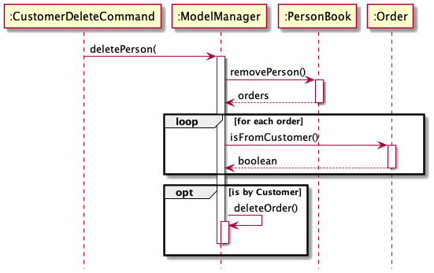

* Table of Contents
{:toc}

--------------------------------------------------------------------------------------------------------------------

## **Setting up, getting started**

Refer to the guide [_Setting up and getting started_](SettingUp.md).

--------------------------------------------------------------------------------------------------------------------

## **Design**

### Architecture

The ***Architecture Diagram*** given above explains the high-level design of the App. Given below is a quick overview of each component.

:bulb: **Tip:** The `.puml` files used to create diagrams in this document can be found in the [diagrams](https://github.com/se-edu/addressbook-level3/tree/master/docs/diagrams/) folder. Refer to the [_PlantUML Tutorial_ at se-edu/guides](https://se-education.org/guides/tutorials/plantUml.html) to learn how to create and edit diagrams.

**`Main`** has two classes called [`Main`](https://github.com/se-edu/addressbook-level3/tree/master/src/main/java/seedu/address/Main.java) and [`MainApp`](https://github.com/se-edu/addressbook-level3/tree/master/src/main/java/seedu/address/MainApp.java). It is responsible for,
* At app launch: Initializes the components in the correct sequence, and connects them up with each other.
* At shut down: Shuts down the components and invokes cleanup methods where necessary.

[**`Commons`**](#common-classes) represents a collection of classes used by multiple other components.

The rest of the App consists of four components.

* [**`UI`**](#ui-component): The UI of the App.
* [**`Logic`**](#logic-component): The command executor.
* [**`Model`**](#model-component): Holds the data of the App in memory.
* [**`Storage`**](#storage-component): Reads data from, and writes data to, the hard disk.

Each of the four components,

* defines its *API* in an `interface` with the same name as the Component.
* exposes its functionality using a concrete `{Component Name}Manager` class (which implements the corresponding API `interface` mentioned in the previous point.

For example, the `Logic` component (see the class diagram given below) defines its API in the `Logic.java` interface and exposes its functionality using the `LogicManager.java` class which implements the `Logic` interface.

**How the architecture components interact with each other**

The *Sequence Diagram* below shows how the components interact with each other for the scenario where the user issues the command `delete 1`.

The sections below give more details of each component.

### UI component

**API** :
[`Ui.java`](https://github.com/se-edu/addressbook-level3/tree/master/src/main/java/seedu/address/ui/Ui.java)

The UI consists of a `MainWindow` that is made up of parts e.g.`CommandBox`, `ResultDisplay`, `PersonListPanel`, `StatusBarFooter` etc. All these, including the `MainWindow`, inherit from the abstract `UiPart` class.

The `UI` component uses JavaFx UI framework. The layout of these UI parts are defined in matching `.fxml` files that are in the `src/main/resources/view` folder. For example, the layout of the [`MainWindow`](https://github.com/se-edu/addressbook-level3/tree/master/src/main/java/seedu/address/ui/MainWindow.java) is specified in [`MainWindow.fxml`](https://github.com/se-edu/addressbook-level3/tree/master/src/main/resources/view/MainWindow.fxml)

The `UI` component,

* Executes user commands using the `Logic` component.
* Listens for changes to `Model` data so that the UI can be updated with the modified data.

### Logic component

**API** :
[`Logic.java`](https://github.com/se-edu/addressbook-level3/tree/master/src/main/java/seedu/address/logic/Logic.java)

1. `Logic` uses the `AddressBookParser` class to parse the user command.
1. This results in a `Command` object which is executed by the `LogicManager`.
1. The command execution can affect the `Model` (e.g. adding a person).
1. The result of the command execution is encapsulated as a `CommandResult` object which is passed back to the `Ui`.
1. In addition, the `CommandResult` object can also instruct the `Ui` to perform certain actions, such as displaying help to the user.

Given below is the Sequence Diagram for interactions within the `Logic` component for the `execute("delete 1")` API call.

:information_source: **Note:** The lifeline for `DeleteCommandParser` should end at the destroy marker (X) but due to a limitation of PlantUML, the lifeline reaches the end of diagram.

### Model component

**API** : [`Model.java`](https://github.com/se-edu/addressbook-level3/tree/master/src/main/java/seedu/address/model/Model.java)

The `Model`,

* stores a `UserPref` object that represents the user’s preferences.
* stores the address book data.
* exposes an unmodifiable `ObservableList<Person>` that can be 'observed' e.g. the UI can be bound to this list so that the UI automatically updates when the data in the list change.
* does not depend on any of the other three components.

:information_source: **Note:** An alternative (arguably, a more OOP) model is given below. It has a `Tag` list in the `AddressBook`, which `Person` references. This allows `AddressBook` to only require one `Tag` object per unique `Tag`, instead of each `Person` needing their own `Tag` object. 

### Storage component

**API** : [`Storage.java`](https://github.com/se-edu/addressbook-level3/tree/master/src/main/java/seedu/address/storage/Storage.java)

The `Storage` component,
* can save `UserPref` objects in json format and read it back.
* can save the address book data in json format and read it back.

### Common classes

Classes used by multiple components are in the `seedu.addressbook.commons` package.

--------------------------------------------------------------------------------------------------------------------

## **Implementation**

This section describes some noteworthy details on how certain features are implemented.

### Week 10 Task

#### James

**Enhancement**: Update model for new functions
- Made new classes for Dish, Order, Ingredient components
- Made new `Book` classes for each
- Exposed functionality of each book through `ModelManager` (Facade pattern)

**Enhancement**: Update storage for new functions
- Ensure JSON serializability of each class by using `Jackson` annotations
- Update sample data for each book
- Update Storage classes to support new `Book`

#### Jian Wei

**Enhancement**: Component Parser

The `ComponentParser` mechanism is facilitated by `JJIMYParser` with an input format of

    [component] [commands] [arguments]

`JJIMYParser` will read in the first word of the input which is the `[component]` and parse into respective component parsers such as `CustomerParser`, `MenuParser`, `OrderParser` and `InventoryParser` that implements `ComponentParser`
with an input format of

    [commands] [arguments]

Finally, the respective `ComponentParser` will read in the `[command]` and return their respective `ComponentCommand` to be executed by `LogicManager`

The following sequence diagram shows how the parser on a `CustomerAddCommand` operation

The following activity diagram summarizes what happens when a user executes a new command.

**Enhancement**: Visualisation of 2 lists concurrently

To increase the efficiency of adding food order, the GUI has been improved to display 2 lists at the same time. Customer list will always be on the left column whereas the rest of the component list will be on the right column.
 
The component list on the right column will be controlled by any of the respective component's command. Example

    - menu list [arguments]
    - order list [arguments]
    - menu add [arguments]
    ...etc.

#### Ian
**Enhancement**: Component List
- Implement list command for each component
- Call GUI to list all items for a component

The `Component List` command mechanism is facilitated in `MainWindow` of the UI with an input format of

	[component] list

`MainWindow` sends the command to `LogicManager` to be parsed by `JJIMYParser`. As outlined in ** **Enhancement**: Component Parser ** it returns the respective `ComponentCommand` to be executed by `LogicManager`. Finally, a `CommandResult` is sent back to MainWindow which changes what is shown in the GUI. Display is outlined in ** **Enhancement**: Visualisation ** of 2 lists concurrently.

The following sequence diagram shows how the parser on a `Menu List` command operation:

#### Yang Ze
**Enhancement**: Add command
- Implement add command for each component
- Ensure validity of parameters and lookup

#### Marcus
**Enhancement**: Delete command
- Implement delete command for each component

**Enhancement**: Data consistency
- Implement cascading deletion of appropriate models 
  (for ie deletion of a `Person` should also delete all associated `Order` objects)
  

As seen from the above sequence diagram, when `deletePerson` is called on `ModelManager`, it first deletes the `Person`
from `PersonBook`. Then, it retrieves the entire order list from `OrderBook` and checks each individual `Order`. If the
`Order` is associated with the `Person`, then the `Order` is removed by `ModelManger` via the `deleteOrder` method. This
check is done via `Order::isFromCustomer` which returns `true` if the `Order` is associated with the `Customer` and
`false` otherwise.

### \[Proposed\] Data archiving

_{Explain here how the data archiving feature will be implemented}_

--------------------------------------------------------------------------------------------------------------------

## **Documentation, logging, testing, configuration, dev-ops**

* [Documentation guide](Documentation.md)
* [Testing guide](Testing.md)
* [Logging guide](Logging.md)
* [Configuration guide](Configuration.md)
* [DevOps guide](DevOps.md)

--------------------------------------------------------------------------------------------------------------------

--------------------------------------------------------------------------------------------------------------------

## **Appendix: Requirements**

### Product scope

**Target user profile**:

* has a need to manage a significant number of contacts, orders, menu items and inventory
* prefer desktop apps over other types
* can type fast
* prefers typing to mouse interactions
* is reasonably comfortable using CLI apps

**Value proposition**: manage contacts, orders, menu items and inventory faster than a typical mouse/GUI driven app

### User stories

Priorities: High (must have) - `* * *`, Medium (nice to have) - `* *`, Low (unlikely to have) - `*`

| Priority | As a...                        | I want to...                                               | So that I can...                                            |
| -------- | ------------------------------ | ---------------------------------------------------------- | ----------------------------------------------------------- |
| `* * *`  | new user                       | see usage instructions                                     | refer to instructions when I forget how to use the App      |
| `* * *`  | fast typer                     | be able to input by CLI                                    | key in commands faster                                      |
| `* * *`  | restaurant owner               | add a customer's contact                                   | keep track of each customer's details                       |
| `* * *`  | restaurant owner               | remove a customer's contact                                | remove customers who no longer patronize the restaurant     |
| `* * *`  | restaurant owner               | add dishes to the menu                                     | keep track of dishes being offered                          |
| `* * *`  | restaurant owner               | remove dishes from the menu                                | remove dishes that are not being offered anymore            |
| `* * *`  | restaurant owner               | add food orders to the order list                          | keep track of the food I need to prepare                    |
| `* * *`  | restaurant owner               | remove food orders from the order list                     | remove the order if my customers changed their minds        |
| `* * *`  | restaurant owner               | add the ingredients that I have restocked to the inventory | know which ingredients I have in stock                      |
| `* * *`  | restaurant owner               | remove ingredients from the food inventory                 | remove an ingredient I have just used                       |
| `* * *`  | restaurant owner               | view a list of ingredients from the food inventory         | so I know which ingredients I have in stock                 |
| `* * *`  | restaurant owner               | add tasks to my shopping list        			 | so I can remember which items to restock                    |
| `* * *`  | restaurant owner               | remove tasks from my shopping list    		         | so I can remove tasks I don't need anymore                  |
| `* * *`  | restaurant owner               | view all tasks to my shopping list                         | so I can view which items to restock                        |
| `* * *`  | restaurant owner               | add dishes to the menu list                                | so I can keep track of the dishes being offered             |
| `* * *`  | restaurant owner               | remove dishes to the menu list                             | so I can remove dishes that are not being offered anymore   |
| `* * *`  | restaurant owner               | view all dishes to the menu list                           | so I can view all the dishes being offered                  |
| `* * *`  | restaurant owner               | view the list of food orders                               | so I know which dishes to prepare                           |
| `* *`    | restaurant owner               | edit a customer's contact                                  | rectify typos for customer errors                           |
| `* *`    | user with many contacts        | find a customer's contact                                  | quickly locate the contact details of a particular customer |
| `* *`    | owner with a large menu        | find a dish on the menu                                    | quickly locate details of a dish on the menu                |
| `* *`    | owner of a busy restaurant     | find a food order from the order list                      | quickly locate the details of an order I'm working on       |
| `* *`    | owner with a complex inventory | find the quantity of an ingredient in the food inventory   | quickly check how much of a certain ingredient I have left  |

### Use cases

(For all use cases below, the **System** is the `AddressBook` and the **Actor** is the `user`, unless specified otherwise)

**Use case: Request help**

**MSS**

1.  User requests help
2.  JJIMY displays a list of commands

    Use case ends.

**Use case: Exit**

**MSS**

1.  User requests to exit
2.  JJIMY exits

    Use case ends.

**Use case: Add a contact**

**MSS**

1.  User requests to add a contact
2.  JJIMY adds the contact

**Extensions**

*1a. JIMMY detects duplicate
 *1a1. JIMMY shows an error message
	Use case ends

    Use case ends.

**Use case: List all contacts**

**MSS**

1.  User requests to list contacts
2.  JJIMY shows a list of contacts

    Use case ends.

**Use case: Delete a contact**

**MSS**

1.  User requests to list contacts
2.  JJIMY shows a list of contacts
3.  User requests to delete a specific contact in the list
4.  JJIMY deletes the contact

    Use case ends.

**Extensions**

* 2a. The list is empty.

  Use case ends.

* 3a. The given index is invalid.

    * 3a1. JJIMY shows an error message.

      Use case resumes at step 2.

**Use case: Find a contact**

1. User requests to list contacts
2. JJIMY shows a list of contacts
3. User requests to find contacts based on keywords.
4. JJIMY returns a list of matching contacts for the keywords.

**Extensions**

* 2a. The list is empty.

  Use case ends.

* 3a. The given keywords do not match any contacts.

    * 3a1. JJIMY shows an error message.

      Use case resumes at step 2.

**Use case: Add a menu item**

**MSS**

1.  User requests to add a menu item
2.  JJIMY adds the menu item

**Extensions**

*1a. JIMMY detects duplicate
 *1a1. JIMMY shows an error message
	Use case ends

    Use case ends.

**Use case: List all menu items**

**MSS**

1.  User requests to list menu items
2.  JJIMY shows a list of menu items

    Use case ends.

**Use case: Delete a menu item from the menu**

**MSS**

1.  User requests to list menu items
2.  JJIMY shows a list of menu items
3.  User requests to delete a specific menu item in the list
4.  JJIMY deletes the menu item

    Use case ends.

**Extensions**

* 2a. The list is empty.

  Use case ends.

* 3a. The given index is invalid.

    * 3a1. JJIMY shows an error message.

      Use case resumes at step 2.

**Use case: Find a menu item**

1. User requests to list menu items
2. JJIMY shows a list of menu items
3. User requests to find menu items based on keywords.
4. JJIMY returns a list of matching menu items for the keywords.

**Extensions**

* 2a. The list is empty.

  Use case ends.

* 3a. The given keywords do not match any menu item.

    * 3a1. JJIMY shows an error message.

      Use case resumes at step 2.

**Use case: Add an order**

**MSS**

1.  User requests to add an order
2.  JJIMY adds the order

**Extensions**

*1a. JIMMY detects duplicate
 *1a1. JIMMY shows an error message
	Use case ends

    Use case ends.

**Use case: List all orders**

**MSS**

1.  User requests to list orders
2.  JJIMY shows a list of orders

    Use case ends.

**Use case: Delete an order**

**MSS**

1.  User requests to list orders
2.  JJIMY shows a list of orders
3.  User requests to delete a specific order in the list
4.  JJIMY deletes the order

    Use case ends.

**Extensions**

* 2a. The list is empty.

  Use case ends.

* 3a. The given index is invalid.

    * 3a1. JJIMY shows an error message.

      Use case resumes at step 2.

**Use case: Find an order**

1. User requests to list orders
2. JJIMY shows a list of orders
3. User requests to find orders based on keywords.
4. JJIMY returns a list of matching orders for the keywords.

**Extensions**

* 2a. The list is empty.

  Use case ends.

* 3a. The given keywords do not match any order.

    * 3a1. JJIMY shows an error message.

      Use case resumes at step 2.

**Use case: Add an inventory item**

**MSS**

1.  User requests to add an inventory item
2.  If the quantity is 0, JJIMY adds a new ingredient, otherwise it increments the quantity

**Extensions**

    Use case ends.

**Use case: List all inventory items**

**MSS**

1.  User requests to list all inventory items
2.  JJIMY shows a list of all inventory items

    Use case ends.

**Use case: Delete an inventory item**

**MSS**

1.  User requests to list all inventory items
2.  JJIMY shows a list of all inventory items
3.  User requests to delete a specific inventory item in the list
4.  JJIMY deletes the inventory item

    Use case ends.

**Extensions**

* 2a. The list is empty.

  Use case ends.

* 3a. The given index is invalid.

    * 3a1. JJIMY shows an error message.

      Use case resumes at step 2.

**Use case: Decrease the quantity of an inventory item**

**MSS**

1. User requests to list all inventory items
2.  JJIMY shows a list of all inventory items
3.  User requests to decrease the quantity of a specific inventory item in the list
4.  JJIMY decreases the quantity inventory item

**Extensions**

* 2a. The list is empty.

  Use case ends.

* 3a. The given index is invalid.

    * 3a1. JJIMY shows an error message.

      Use case resumes at step 2.

**Use case: Find a inventory item**

1. User requests to list all inventory items
2. JJIMY shows a list of all inventory items
3. User requests to find inventory items based on keywords.
4. JJIMY returns a list of matching inventory items for the keywords.

**Extensions**

* 2a. The list is empty.

  Use case ends.

* 3a. The given keywords do not match any inventory item.

    * 3a1. JJIMY shows an error message.

      Use case resumes at step 2.

### Non-Functional Requirements

1.  Should work on any _mainstream OS_ as long as it has Java `11` or above installed.
2.  Should be able to hold up to 2000 total items (contacts, menu items, inventory stock) without a noticeable sluggishness in performance for typical usage.
3.  Should be able to complete any single request within 200ms.
4.  Should work entirely client-side, without involving a remote server.
5.  A user with above average typing speed for regular English text (i.e. not code, not system admin commands) should be able to accomplish most of the tasks faster using commands than using the mouse.

### Glossary

* **Inventory**: A list of necessary food ingredients and their associated stock quantities
* **Mainstream OS**: Windows, Linux, Unix, OS X
* **Private contact detail**: A contact detail that is not meant to be shared with others

