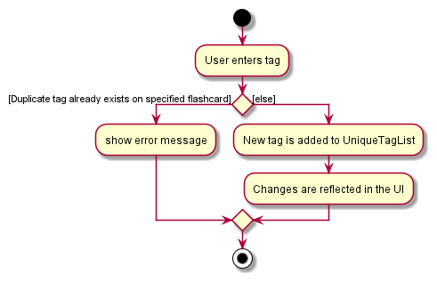
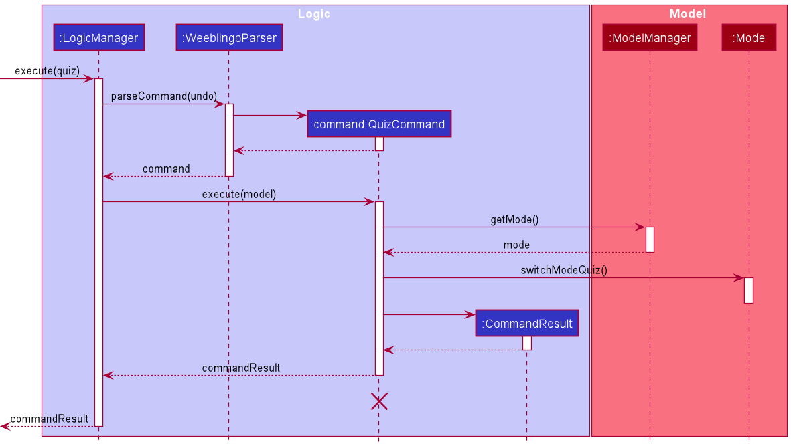

Weeblingo is a desktop app for managing flashcards, **optimized for use via a Command Line Interface** (CLI) while still having the benefits of a Graphical User Interface (GUI). With a nice and friendly interface, users can learn Japanese at a comfortable pace with this application.

# Table of Contents
* [Setting Up](#setting-up-getting-started)
* [Design](#design)
  * [Architecture Overview](#architecture)
  * [UI Component](#ui-component)
  * [Logic Component](#logic-component)
  * [Model Component](#model-component)
  * [Storage Component](#storage-component)
  * [Common Classes](#common-classes)
* [Implementation](#implementation)
  * [Tagging Flashcards](#implemented-tagging-flashcards)
  * [Quiz Feature](#implemented-quiz-feature)
    * [Entering Quiz Mode](#entering-quiz-mode)
    * [Starting a Session](#starting-a-session)
    * [Checking User Attempt](#checking-user-attempt)
    * [Quiz Scoring](#quiz-scoring)
  * [View Quiz Attempt Histories](#view-past-quiz-attempts)
* [Documentation, Logging, Testing, Configuration, Dev-ops](#documentation-logging-testing-configuration-dev-ops)
* [Appendix: Requirements](#appendix-requirements)
  * [Product Scope](#product-scope)
  * [User Stories](#user-stories)
  * [Use Cases](#use-cases)
  * [NFRs](#non-functional-requirements)
  * [Glossary](#glossary)
* [Appendix: Instructions For Manual Testing](#appendix-instructions-for-manual-testing)

--------------------------------------------------------------------------------------------------------------------

## **Setting Up, Getting Started**

Refer to the guide [_Setting up and getting started_](SettingUp.md).

--------------------------------------------------------------------------------------------------------------------

## **Design**

### Architecture

The ***Architecture Diagram*** given above explains the high-level design of the App. Given below is a quick overview of each component.

:bulb: **Tip:** The `.puml` files used to create diagrams in this document can be found in the [diagrams](https://github.com/AY2021S2-CS2103T-T13-1/tp/tree/master/docs/diagrams) folder. Refer to the [_PlantUML Tutorial_ at se-edu/guides](https://se-education.org/guides/tutorials/plantUml.html) to learn how to create and edit diagrams.

**`Main`** has two classes called [`Main`](https://github.com/AY2021S2-CS2103T-T13-1/tp/blob/master/src/main/java/seedu/weeblingo/Main.java) and [`MainApp`](https://github.com/AY2021S2-CS2103T-T13-1/tp/blob/master/src/main/java/seedu/weeblingo/MainApp.java). It is responsible for,
* At app launch: Initializes the components in the correct sequence, and connects them up with each other.
* At shut down: Shuts down the components and invokes cleanup methods where necessary.

[**`Commons`**](#common-classes) represents a collection of classes used by multiple other components.

The rest of the App consists of four components.

* [**`UI`**](#ui-component): The UI of the App.
* [**`Logic`**](#logic-component): The command executor.
* [**`Model`**](#model-component): Holds the data of the App in memory.
* [**`Storage`**](#storage-component): Reads data from, and writes data to, the hard disk.

Each of the four components,

* defines its *API* in an `interface` with the same name as the Component.
* exposes its functionality using a concrete `{Component Name}Manager` class (which implements the corresponding API `interface` mentioned in the previous point).

For example, the `Logic` component (see the class diagram given below) defines its API in the `Logic.java` interface and exposes its functionality using the `LogicManager.java` class which implements the `Logic` interface.

**How the architecture components interact with each other**

The *Sequence Diagram* below shows how the components interact with each other for the scenario where the user issues the command `learn`.

The sections below give more details of each component.

### UI Component

**API** :
[`Ui.java`](https://github.com/AY2021S2-CS2103T-T13-1/tp/blob/master/src/main/java/seedu/weeblingo/ui/Ui.java)

The UI consists of a `MainWindow` that is made up of parts e.g.`CommandBox`, `ResultDisplay`,
`FlashcardListPanel`, `ScoreHistoryListPanel`, `StatusBarFooter` etc.
All these, including the `MainWindow`, inherit from the abstract `UiPart` class.

The `UI` component uses JavaFx UI framework. The layout of these UI parts are defined in matching `.fxml` files
that are in the `src/main/resources/view` folder.
For example, the layout of the [`MainWindow`](https://github.com/AY2021S2-CS2103T-T13-1/tp/blob/master/src/main/java/seedu/weeblingo/ui/MainWindow.java)
is specified in [`MainWindow.fxml`](https://github.com/AY2021S2-CS2103T-T13-1/tp/blob/master/src/main/resources/view/MainWindow.fxml)

The `UI` component,

* Executes user commands using the `Logic` component.
* Listens for changes to `Model` data so that the UI can be updated with the modified data.

### Logic Component

**API** :
[`Logic.java`](https://github.com/AY2021S2-CS2103T-T13-1/tp/blob/master/src/main/java/seedu/weeblingo/logic/Logic.java)

1. `Logic` uses the `WeeblingoParser` class to parse the user command.
1. This results in a `Command` object which is executed by the `LogicManager`.
1. The command execution can affect the `Model` (e.g. updating mode).
1. The result of the command execution is encapsulated as a `CommandResult` object which is passed back to the `Ui`.
1. In addition, the `CommandResult` object can also instruct the `Ui` to perform certain actions, such as displaying help to the user.

Given below is the Sequence Diagram for interactions within the `Logic` component for the `execute("learn")` API call.

:information_source: **Note:** The lifeline for `LearnCommandParser` should end at the destroy marker (X) but due to a limitation of PlantUML, the lifeline reaches the end of diagram.

### Model Component

**API** : [`Model.java`](https://github.com/AY2021S2-CS2103T-T13-1/tp/blob/master/src/main/java/seedu/weeblingo/model/Model.java)

The `Model`,

* stores a `UserPref` object that represents the user’s preferences.
* stores the flashcard book data.
* exposes an unmodifiable `ObservableList<Flashcard>` and `ObservableList<Score>` that can be 'observed' e.g. the UI can be bound to this list so that the UI automatically updates when the data in the list change.
* does not depend on any of the other three components.

:information_source: **Note:** An alternative (arguably, a more OOP) model is given below. It has a `Tag` list in the `FlashcardBook`, which `Flashcard` references. This allows `FlashcardBook` to only require one `Tag` object per unique `Tag`, instead of each `Flashcard` needing their own `Tag` object. 

### Storage Component

**API** : [`Storage.java`](https://github.com/AY2021S2-CS2103T-T13-1/tp/blob/master/src/main/java/seedu/weeblingo/storage/Storage.java)

The `Storage` component,
* can save `UserPref` objects in json format and read it back.
* can save the flashcard book data (flashcards and scores) in json format and read it back.

### Common Classes

Classes used by multiple components are in the [`seedu.weeblingo.commons`](https://github.com/AY2021S2-CS2103T-T13-1/tp/tree/master/src/main/java/seedu/weeblingo/commons) 
package.

--------------------------------------------------------------------------------------------------------------------

## **Implementation**

This section describes some noteworthy details on how certain features are implemented.

### Learn Mode

The `learn` command is used to enter Learn Mode, allowing the user to view all flashcards with the question and answer
both displayed. Tagging and deletion of tags is also only available in this mode. 

The following activity diagram summarizes what happens when a user attempts to enter Learn Mode:

### [Implemented] Tagging Flashcards

The tagging mechanism allows users to add tags to flashcards of their choice while in the Learn Mode
of the Weeblingo application. Each flashcard has a set of default tags which cannot be edited, followed by
any unique user added tags.

The following activity diagram summarizes what happens when a user adds a new tag:

The tags function ties together with the Start, Learn and Quiz function of the application,
as users can choose to start a quiz, enter Start Mode or enter Learn Mode with a filtered set of flashcards.

### [Implemented] Deleting Tags from Flashcards

This mechanism works with the above flashcard tagging feature to allow users to customise tags for their flashcards
while in the Learn Mode of the Weeblingo application. 

The following sequence diagram summarises how the DeleteTagCommand works:

Default tags cannot be deleted by this command and will throw an error if the user attempts to do so.

### [Implemented] Quiz Feature

The quiz feature for users to test the vocabulary is facilitated by `Model#Quiz`, `Model#Mode` and `Logic`. It does so by allowing a `Command`
to set model to quiz mode. When model is in quiz mode, it will take commands allowing users to start a quiz session,
attempt answering the quiz question or skip the flashcard.

`Model#Mode` implments the following operations:
  * `switchModeQuiz()`: Sets model to quiz mode
  * `switchModeQuizSession()`: Sets model to quiz session mode
  * `switchModeCheckSuccess()`: Sets model to check success mode 
  * `switchModeQuizSessionEnded()`: Sets model to quiz session ended mode

`Model#Quiz` implments the following operations:
  * `getRandomisedQueue()`: Generates randomised questions for the quiz session
  * `getNextQuestion()`: Provides a question to be bested
  * `isCorrectAttempt(Answer attempt)`: Checks if attempt is correct English definition of question shown on flashcard

These operations are executed through `QuizCommand`, `StartCommand`, `CheckCommand` and `NextCommand` in the `Logic` class.

#### Entering Quiz Mode

The `quiz` command is used to enter Quiz mode, allowing the user to start various quizzes from there.
The following activity diagram summarizes what happens when a user enters the Quiz command:

The following sequence diagram shows how the Quiz command works:

#### Starting a Session

The `start` command is used to start a quiz session, enabling users to define the number and categories of
questions they want to be tested on. The activity diagram below shows the flow of events when a user
enters the start command.

Thr following sequence diagram shows the interactions that occur when the start command is executed:

#### Checking User Attempt

The `check` command is used to check if user provided attempt is correct. This feature is implemented by creating an 
instance of `CheckCommand` that can be executed on the `Model`. The `Model` will then invoke appropriate methods in `Quiz`.
Depending on whether the user attempt is correct, `CheckCommand` will return an instance of `CommandResult` which will 
inform the `MainWindow` if it is time to reveal the answer of current question.

The following activity diagram summarizes the general workflow of `check` command:

The following sequence diagram shows how the `check` command works:

#### Quiz Scoring

The quiz can be scored for each individual quiz session. The scoring data will be written into the storage file
after the quiz session is completed. A quiz session is completed if and only if the message indicating the end of
quiz is displayed in the GUI window. The following activity diagrams summarize how the score is generated and recorded
along with each quiz session.

#### View Past Quiz Attempts

The view quiz history mechanism allows users to view their past attempts of quizzes. Each entry of quiz history is
represented in a way similar to how the flashcards are represented in the Weeblingo application.

Below is the class diagram
for how `Score` is represented in *Model* component.

The *UI* component, which originally only handles the display of flashcards,
now needs to handle the display for scoring history as well.

The following sequence diagram shows how the UI switches display from flashcards to score history. The mechanism of
switching UI display the other way around is similar. 

#### Design consideration:

##### Aspect: How to represent `Score` in the application

* **Alternative 1 (current choice):** Make `Score` and `Flashcard` two separate classes.
    * Pros: Easy to implement.
    * Cons:
      * May have the overhead of writing similar code. For instance, `JsonAdaptedFlashcard` and `JsonAdaptedScore`.
      * Changing the GUI display from flashcards to score history may be cumbersome.
* **Alternative 2:** Let `Score` have inheritance relationship with `Flashcard`.
    * Pros: Changing GUI display is easy.
    * Cons:
      * The design choice is not intuitive (`Score` does not seem to be a `Flashcard` and vice versa).
      * The overhead of maintaining the inheritance is non-trivial.

### [Proposed] Auto-tagging feature for difficult Flashcards

The proposed feature will track user attempts for each flashcard and suggest tagging flashcards that took more than a
set number of attempts as difficult at the end of the quiz. This is facilitated by the `check` command triggering an
internal check on the current number of attempts for this `flashcard`. Beyond a set number of attempts, the `Quiz` will
store the current `flashcard` in a separate list to be shown at the end of the quiz. The user can then tag them as
difficult if they so wish to.

`Model#Quiz` will implement the following operation:
* `Quiz#updateDifficult`: Adds the current `flashcard` to the list of difficult flashcards.

### [Proposed] Tag Search
The tag searching feature will allow users to view and search through the tags that exist, such that they can easily
know what tags are available to be used. `Tag` will store a static map of each tag to the number of flashcards with
that tag, updating as needed when a tag is added or deleted.

`Model#Tag` will implement the following operations:
* `Tag#showTags()`: Iterates through the map and shows all existing tags.
* `Tag#doesTagExist(Tag tag)`: Checks if tag exists.
* `Tag#tagCount(Tag tag)`: Searches the map for the number of flashcards with the provided tag. If the tag does not
  exist, it should return 0.

These operations will be executed through `ShowTagsCommand` and `SearchTagsCommand` in the `Logic` class.

--------------------------------------------------------------------------------------------------------------------

## **Documentation, logging, testing, configuration, dev-ops**

* [Documentation guide](Documentation.md)
* [Testing guide](Testing.md)
* [Logging guide](Logging.md)
* [Configuration guide](Configuration.md)
* [DevOps guide](DevOps.md)

--------------------------------------------------------------------------------------------------------------------

## **Appendix: Requirements**

### Product scope

**Target user profile**:

* Young aspiring J-Culture enthusiast who wants to learn basic Japanese
* goes to a Japanese Culture Club so is low on time after school
* interested in learning the Japanese language
* prefers using flashcards to learn
* prefers desktop apps over other types
* prefers typing to mouse interactions
* is reasonably comfortable using CLI apps

**Value proposition**: Ability to learn the Japanese language through flashcards in a fun and interactive manner

### User stories

Priorities: High (must have) - `* * *`, Medium (nice to have) - `* *`, Low (unlikely to have) - `*`

| Priority | As a …​         | I want to …​                            | So that I can…​                              |
| -------- | ------------------ | ------------------------------------------ | ----------------------------------------------- |
| `* * *`  | new user           | view valid commands                        | learn how to use the Weeblingo               |
| `* * *`  | user               | view a flashcard                           |                                                 |
| `* * *`  | user               | view all flashcards                        | study the flashcards before a quiz session           |
| `* * *`  | user               | see the answer to a flashcard              | check if I answered correctly                   |
| `* * *`  | user               | start a quiz session                       | assess my knowledge of the Japanese language          |
| `* * *`  | hardworking user   | start a quiz containing all flashcards     | practice all flashcards in a single quiz session     |
| `* *`    | user               | quiz myself on a specific set of flashcards| practice a specific group of words that I may be bad at |
| `* *`    | busy user          | quiz myself on a specific number of flashcards| roughly control how long I spend on the quiz |
| `* *`    | user               | add tags to certain flashcards             | group flashcards to test myself (e.g. specific coverage for an exam) |
| `* *`    | results-oriented user | know how well I scored on a Quiz        | see how many mistakes I made in this Quiz       |
| `* *`    | competitive user   | see the duration of a Quiz                 | gauge how fast I am at answering questions      |
| `* *`    | user               | see my past quiz attempts                  | track my progress      |

*{More to be added}*

### Use cases

(For all use cases below, the **System** is the `Weeblingo` and the **Actor** is the `user`, unless specified otherwise)

**Use case : UC01 - See the list of flashcards**

**MSS**

1.  User requests to enter learn mode.
2.  Weeblingo shows a list of flashcards on the screen.

    Use case ends.

**Use case: UC02 - Take a quiz**

**MSS**

1.  User requests to enter quiz mode.
2.  Weeblingo shows a new question on the screen.
3.  User enters and checks his answer.
4.  Weeblingo shows whether user's answer is correct/wrong.
5.  User requests to see the next question.
6.  Weeblingo removes this question from the list of questions for this session.
7.  Go to step 2 again.

**Extensions**

* 2a. All questions have been shown.

    * 2a1. Weeblingo informs user that the quiz is over.

      Use case ends.

* 3a. User already got the question correct.

    * 3a1. Weeblingo prompts user to proceed to the next question.

      Use case resumes at step 5.

* 4a. User got the question wrong.

    * 4a1a. User wants to proceed to the next question.

      Use case resumes at step 5.

    * 4a1b. User wants to reattempt the same question.

      Use case resumes at step 3.

* 4b. User got the question correct.

    * 4b1. Weeblingo prompts user to proceed to the next question.

      Use case resumes at step 5.

**Use case: UC03 - See my past quiz attempts history**

**MSS**

1.  User requests to see the history of past attempts.
2.  Weeblingo shows the history, including relevant details of the quiz attempts.

    Use case ends.

*{More to be added}*

### Non-Functional Requirements
<!-- Updated and maintained by [Yucheng](https://github.com/cheng20010201) -->
1.  The product should work on any _mainstream OS_ as long as it has Java `11` or above installed.
2.  The product should be available for downloads after each [GitHub release](https://github.com/AY2021S2-CS2103T-T13-1/tp/releases).
3.  The product's size in terms of the final `Jar` released should not exceed 100MB.
4.  The product should be an offline application, which should work regardless of internet connection.
5.  The product should be able to hold at least 100 flashcards without causing a delay in commands longer than
    0.2 seconds.
6.  The product is not required to handle concurrency resulting from multiple instances of the applications running at the same
    time, as the product is supposed to support a single user's usage.
6.  The product should be open-sourced in the [GitHub repo](https://github.com/AY2021S2-CS2103T-T13-1/tp).
7.  The project is expected to adhere to a schedule that delivers a new iteration every one or two weeks throughout the whole development cycle.
8.  A user with above average typing speed for regular English text (i.e. not code, not system admin commands) and
    should be able to accomplish most of the learning faster using commands than using the mouse/GUI.

### Glossary

* **Mainstream OS**: Windows, Linux, Unix, OS-X
* **Question**: A Japanese character/word
* **Answer**: The pronunciation/translation of the Japanese word given in the corresponding question
* **Flashcard**: An object that can display a question and its answer
* **Quiz Session**: During a quiz session, flashcards with only question displayed will be shown one by one. 
  Users may chooses to answer or skip the questions. Score and time spent will be recorded.
* **Score**: Calculated during a quiz session. Calculated by: number of user correct attempts / number of user checks.

--------------------------------------------------------------------------------------------------------------------

## **Appendix: Instructions for manual testing**

Given below are instructions to test the app manually.

:information_source: **Note:** These instructions only provide a starting point for testers to work on;
testers are expected to do more *exploratory* testing.

By the nature of Weeblingo, it is inconvenient for testers who do not possess some elementary
knowledge of Japanese to test our application. Therefore, to facilitate testers, we have provided a list of flashcards which reside in the database
of the current version of application for your reference. The link is [here](Flashcards.html).

### Launch and shutdown

1. Initial launch

   1. Download the jar file and copy into an empty folder

   1. Double-click the jar file Expected: Shows the GUI with a set of sample contacts. The window size may not be optimum.

1. Saving window preferences

   1. Resize the window to an optimum size. Move the window to a different location. Close the window.

   1. Re-launch the app by double-clicking the jar file. 
       Expected: The most recent window size and location is retained.

### Using the  `end` command

1. Ending a quiz before it is started

   1. Prerequisites: No quiz has been started

   1. Test case: `end` _while in the quiz_ 
      Expected: The current quiz is ended and displayed flashcard disappears.

   1. Test case: `end` _while in the start menu_ 
      Expected: Nothing happens. An error message is displayed to the user telling them that no Quiz has started yet.

   1. Other incorrect end commands locations to try: _while in learn mode_, _right after ending a Quiz, …​  
      Expected: Similar to previous.

### Saving data

1. Dealing with corrupted data files

   1. Do an initial launch of the application as described in _Launch and shutdown_ segment above. Type `learn` to view all flashcards available.
   
   1. Open `current_folder/data/flashcards.json`.
    
   1. Do some modifications that are possibly malicious.
       - Modify a field name of `flashcards.json`. E.g. change `question` to `questions`
       - Modify the `tag` value of some flashcard to include characters that are neither alphabetic or numeric. E.g. `&*&`, `你好世界`.
       - Modify the `question` value of some flashcard to include latin-specific characters. E.g. `Español`.
   

   1. Relaunch the application. Type `learn` to go into the `learn` mode. Original (unmodified) data content should present.
    
   1. **Close the application** and inspect the `flashcards.json` file. Modified parts of the original data content should disappear.
    
    
1. Dealing with missing data files

   1. Delete the `flashcards.json` file, but keep the `data` folder.

   1. Relaunch the application. Type `learn` to go into the `learn` mode. Original data content should present.

   1. **Close the application** and inspect the `data` folder, a new `flashcards.json` loaded with content should be present.
    
   1. Now delete the `data` folder recursively (i.e. deleting the file(s) inside it as well).

   1. Repeat the second step.

   1. **Close the application**, and the `data` folder and the `flashcards.json` should be present (regenerated).
    

:information_source: Data file is recovered on a lazy basis. That is, if the data file is corrupted/missing, and a new application instance is
  created and then closed without **any** command entered. The data file will not be recovered.

--------------------------------------------------------------------------------------------------------------------
