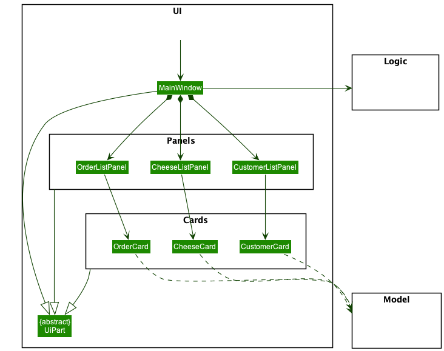

* Table of Contents
{:toc}

--------------------------------------------------------------------------------------------------------------------

## **Setting up, getting started**

Refer to the guide [_Setting up and getting started_](SettingUp.md).

--------------------------------------------------------------------------------------------------------------------

## **Design**

### Architecture

The **Architecture Diagram** given above explains the high-level design of the
App. Given below is a quick overview of each component.

`Main` has two classes called `Main` and `MainApp`. It is responsible for:
* At app launch: Initializes the components in the correct sequence, and connects them up with each other.
* At shut down: Shuts down the components and invokes cleanup methods where necessary.

`Commons` represents a collection of classes used by multiple other components.

The rest of the App consists of four components:

* `UI`: The UI of the App.
* `Logic`: The command executor.
* `Model`: Holds the data of the App in memory.
* `Storage`: Reads data from, and writes data to, the hard disk.

Each of the four components,

* defines its API in an `interface` with the same name as the Component.
* exposes its functionality using a concrete `{Component Name}Manager` class (which implements the corresponding API `interface` mentioned in the previous point.

For example, the `Logic` component defines its API in `Logic.java` and exposes
its functionality using `LogicManager.java` which implements the `Logic` interface.
Similarly, we have `Model` interface and `ModelManager` class that implements
`Model`.

**How the architecture components interact withe each other**

The Sequence Diagram below shows how the components interact with each other
for the scenario where the user issues the command `delete 1`.

The sections below give more details of each component.

### UI component

**API**: [`Ui.java`](https://github.com/AY2021S2-CS2103-W16-2/tp/blob/master/src/main/java/chim/ui/Ui.java)

The UI consists of a `MainWindow` that is made up of parts e.g.`CommandBox`, `ResultDisplay`, `StatusBarFooter` etc. All
these, including the `MainWindow`, inherit from the abstract `UiPart` class.

The `UI` component uses the JavaFX UI framework. The layout of these UI parts are defined in matching `.fxml` files that
are in the `src/main/resources/view` folder. For example, the layout of the `MainWindow` is specified in
`MainWindow.fxml`.

The `UI` component:

* Executes users' commands using the `Logic` component.
* Listens for changes to `Model` data so that the UI can be updated with the modified data.
* Any changes in `Model` data, i.e. customers, cheeses or orders data, are reflected through the `Panels` and `Cards`
  sub-components.

The class diagram below shows in more detail the compositions of the `Panels` and `Cards` components as well as their
relationships with other classes.

### Logic component

**API**: [`Logic.java`](https://github.com/AY2021S2-CS2103-W16-2/tp/blob/master/src/main/java/chim/logic/Logic.java)

1. `Logic` uses the `ChimParser` class to parse the user command.
2. This results in a `Command` object which is executed by the `LogicManager`.
3. The command execution can affect the `Model` (e.g. by adding customers, orders or cheeses).
4. The result of the command execution is encapsulated as a `CommandResult`
object which is passed back to the `Ui`.
5. In addition, the `CommandResult` object can also instruct the `Ui` to perform
certain actions, such as displaying help to the user.

Given below is the Sequence Diagram for interactions within the `Logic` component
for the `execute("deletecheese 1")` API call.

### Model component

**API** : [`Model.java`](https://github.com/AY2021S2-CS2103-W16-2/tp/blob/master/src/main/java/chim/model/Model.java)

The `Model`,
* stores a `UserPref` object that represents the user`s preferences.
* stores Cheese Inventory Management's customers, orders, and cheeses data.
* exposes an unmodifiable `ObservableList<Customer>`, `ObservableList<Order>`,`ObservableList<Cheese>` that can be 'observed'.
e.g. the Ui can be bound to this list so that the UI automatically updates when the data in the list change.
* does not depend on any of the other three components.

### Storage component

**API** : [`Storage.java`](https://github.com/AY2021S2-CS2103-W16-2/tp/blob/master/src/main/java/chim/storage/Storage.java)

The `Storage` component,
* can save `UserPref` objects in json format and read it back.
* can save CHIM's data in json format and read it back.

### Common classes

Classes used by multiple components are in the `chim.commons` package.

--------------------------------------------------------------------------------------------------------------------

## **Implementation**

This section describes some noteworthy details on how certain features are implemented.

### Delete Feature

#### Implementation

Deleting customers, orders and cheeses are implemented in `DeleteCustomerCommand`,
`DeleteOrderCommand` and `DeleteCheeseCommand` respectively. These commands extend
abstract class `DeleteCommand`, and they all implement the operations `execute()` and `equals()`.

Cascading of Delete commands has been implemented such that if a customer is deleted,
any orders they have placed are also deleted. Similarly, when an order is deleted,
any cheeses assigned to it are deleted.

An example usage scenario representing the cascading of delete commands is given below.

Step 1. The user launches CHIM which has been initialised with customers,
orders (both complete and incomplete), and cheeses.

Step 2. The user executes `deletecustomer p/87438807` to delete the customer with the
phone number `87438807`. The command calls `DeleteCustomerCommand.execute()`
which calls on `ModelManager.deleteCustomer()`.

Step 3. The `ModelManager` calls `Chim.deleteCustomer()` where CHIM will delete
the customer and iterate through the orders list to find any orders placed by this customer.
These orders are deleted by calling `Chim.deleteOrder()`.

Step 4. `Chim.deleteOrder()` will delete the order. If the order was completed,
it will iterate through the cheeses list to find any cheeses assigned to this order.
These cheeses are deleted by calling `Chim.deleteCheese()`.

Step 5. `Chim.deleteCheese()` will delete the cheese.

The following sequence diagram shows how the operation `deletecustomer p/87438807`
is carried out as detailed above.

#### Design consideration

* Cascading of Delete commands has been implemented with the assumption that when a customer
or order is deleted, all information related to that customer or order must also be removed from CHIM.
* The cascading of Delete commands is implemented only in one direction (Customer to Order to Cheese).
Deleting an order will not delete the customer who placed the order.
Furthermore, deleting a cheese which has been assigned to an order is not allowed.
This is to prevent any extra erroneous deletions.
* All `execute()` calls by `DeleteCustomerCommand`, `DeleteOrderCommand` and `DeleteCheeseCommand`
will call on `Model.Chim` which will handle the cascading of delete commands in one place.

### Automatic Toggling of UI List Panels

#### Implementation

The application's user-interface shows, at any one time, **only one** of the following three lists:

1. Customer List
2. Cheese List
3. Order List

The UI automatically toggles between the three lists with respect to the user's latest command. For example:

- After running the `ListCheeseCommand`, the UI switches to showing the cheese list.
- After running the `AddCustomerCommand`, the UI switches to showing the customer list.
- After running the `FindOrderCommand`, the UI switches to showing the order list.

To enable the toggling, `GuiSettings` (of the `commons` package) stores an enumerable property to control which list to
show.

When the user keys in a valid input:

1. The `Command` object corresponding to the input, when executed, updates the enum in `GuiSettings`; the enum records
   which list is to be shown. This is done through the `ModelManager`.
2. The `UI` component then checks the `GuiSettings` and renders the desired list.

To better illustrate the idea - take, for instance, when the user inputs `listcheeses` which executes the
`ListCheesesCommand`:

### Find Command

#### Implementation

The find command is used by the users to search for a `Cheese`, `Order` or `Customer`
based on the given parameters. For example, a user can search for a `Customer` with
the surname `Lee` in their database using the command. The command is facilitated
by the `FindXCommandParser`, where `X` depends on the model that is concerned.

Each `FindXCommandParser` creates a `FindXCommand` object which contains details on
how the data should be filtered, sorted and displayed to the user.

The `FindXCommand` contains a `FieldPredicate`, which defines how the model should be
filtered and sorted. In the case of `Customer`s, which can be filtered by `Name`,
`Phone` or `Email`, a `FieldPredicate` was defined for each of the specified field.
Each `FieldPredicate` outlines how the filtering should be handled, for example,
`Name`s should be filtered by partial keyword match (using prefix).

The second part of the `FieldPredicate` is the `Comparator` that it implements.
The comparator outlines the order of the results, to ensure that the most relevant
results are displayed to the users at a higher priority. In the case of `Name`, the
keyword "David" should rank the name "David" above the name "Davida", as a complete
match is more relevant for users compared to a partial match.

To facilitate filtering of the models by multiple fields, `CompositeFieldPredicate`
takes in multiple `FieldPredicate`s and composes them. Each object in the list will
be compared using all the predicates defined, and the results will be ranked by the
sum of the relevance of each predicate.

The following shows the structure of the `FieldPredicate` classes which will be used to
filter and sort the different lists.

The diagram below shows how the `FindCommand`, specifically the `FindCheeseCommand` works:

### Edit Command

Currently we support editing of the three models: `Cheese`, `Customer` and `Order`,
but only under certain preconditions to reflect the real life domains.

The Sequence Diagram below shows how an `EditOrderCommand` is executed.

#### Editing a Customer
We always allow editing of all fields of any `Customer` instances. This is possible
since the `Order` class only maintain a reference to `Customer` with a `CustomerId`.
This design approach allows us to only require to update a `Customer` object only
at a particular location. This is important as the `Customer` class has a one-to-many
relationship with `Order`.

#### Editing a Cheese
We allow editing of all fields of any `Cheese` instances only when the instances
are not marked as assigned (to an `Order`). This is essentially to maintain the
consistency of contract between the `Cheese` and `Order` class, namely `Cheese`
instances that are used to fulfil an `Order` require to have the same
`CheeseType` as the `Order`. This is consistent with the domain design as once
an order is marked as complete, the order and cheeses involved are only kept
as view-only  archives.

#### Editing an Order
Similarly, we only allow editing of any `Order` instances only when the instances
are not marked as completed (with a list of assigned `CheeseID`s). An completed
`Order` is only kept as a view-only archieve. Furthermore, since the `Order` class
contains dependencies to `Customer` class, if the `Phone` parameter is provided,
we are required to check that the customer phone exists and a different customer
is being referenced.

#### Alternative Designs
An alternative approach to store a `Customer` instance in every `Order` objects
is clearly undesirable, as that would require us to update at multiple locations
that may cost more time and risk more bugs. Alternatively, we could choose to
model `Customer` and `Order` via composition, where we have the `Customer` class
maintain a list of `Order` as a field. Then, modifying customer details would be
intuitive. However, we believe having the `Order` class being able to navigate
to `Customer` and not the other way around is a better way to represent the real
life applications because we require the `Order` to keep track of the `Customer`,
but not necessarily the other way around.

An alternative approach to handle the contract between `Cheese` and `Order` is
to warn the users about modifying the sensitive fields of linked instances, and
mark the `Order` instance as incomplete and unassign the corresponding `Cheese`
instances to accommodate the changes. We do not choose this design as it is very
unlikely a user would want to modify a completed `Order`, and the user can always
add a new `Order` instance in the worst case.

### Mark an order as complete feature

#### implementation

Marking an order as completed is implemented in [`DoneCommand.java`](https://github.com/AY2021S2-CS2103-W16-2/tp/blob/master/src/main/java/chim/logic/commands/DoneCommand.java).

`DoneCommand` extends from `command` and overwrites the operations `execute()` and `equals()`.

Given below is an example usage scenario and how the feature of marking an order as complete feature behaves at each step.

Step 1. The user launches CHIM which will restore archived customers , orders and cheeses.

Step 2. The user issues the command `done 1` to mark the first order shown in the `listorders` as completed.
The `done` command calls `DoneCommand.execute()` which will check the index given is valid and order selected is not completed yet.

Step 3. After initial checks are completed, `DoneCommand.execute()` will call on `ModelManager.getUnassignedCheeses()`
to retrieve unAssigned Cheese(s) required for the order.

Step 4. `DoneCommand.execute()` will call `DoneCommand.createDoneOrder()` to create a new `order`
if there is enough unassigned Cheese(s) from `ModelManager.getUnassignedCheeses()`.

Step 5. `DoneCommand.execute()` will call `ModelManager.setOrder()`
to replace the original order with the new order created from `DoneCommand.createDoneOrder()`
and calls `ModelManager.updateCheesesStatus()` to update all cheese(s)'s assign status used for this order.

The following sequence diagram shows how the operation `done 1` is carried out as detailed above.

#### Design consideration
* Aspect : Searching for available cheese(s) for the order.
    * Current choice : Searching for unassigned cheeses for the order is implemented in the `Model.Chim`.
        * Pros: no dependency between `Done` command and `Cheese`.
        * Cons: performance issues due to multiple functions calls.
    * Alternative 1 : `Done` command will search for unassigned cheeses.
        * Pros: better in terms of performance as there are lesser functions to be called.
        * Cons: This introduces another reason for 'DoneCommand.execute()' to change in the future.

## **Documentation, logging, testing, configuration, dev-ops**

* [Documentation guide](Documentation.html)
* [Testing guide](Testing.html)
* [Logging guide](Logging.html)
* [Configuration guide](Configuration.html)
* [DevOps guide](DevOps.html)

--------------------------------------------------------------------------------------------------------------------

## **Appendix: Requirements**

### Product scope

**Target user profile**:
* Freelance cheesemaker
* Runs home-based business
* Prefers desktop apps over other types
* Can type fast

**Value proposition**:
1. Specific properties of each cheese
2. Track order status of each cheese (either by batches or individually)

### User stories

Priorities: High (must have) - `* * *`, Medium (nice to have) - `* *`, Low (unlikely to have) - `*`

| Priority | As a …​                      | I want to …​                     | So that I can …​                                                        |
| -------- | ----------------------------| ------------------------------- | ---------------------------------------------------------------------- |
| `* * *`  | New user                    | Input a new order |  |
| `* * *`  | New user                    | Delete an existing order |  |
| `* * *`  | New user                    | Add cheese entries |  |
| `* * *`  | New user                    | Mark a sample order as delivered |  |
| `* * *`  | New user                    | Search for a customer | Find the customer’s contact information |
| `* *`    | New user                    | Save the data input | Retrieve the same information later |
| `* *`    | User with some familiarity  | View a summary of my inventory | See if there is a need to increase production |
| `* *`    | User                        | See the introduction message |  |
| `*`      | User with some familiarity  | Search up orders of a specific customer | Efficiently find the order status |

[More to be added]

### Use cases

(For all use cases below, the **System** is the `CHIM` and the **Actor** is the `user`, unless specified otherwise)

#### Use case: Input a new order

**MSS**

1. User adds an order by specifying the cheese type and quantity of the order, and the phone number of the customer, with optional field order date.
2. CHIM creates the order and shows the details of the new order.

   Use case ends.

**Extensions**
1a. The given cheese quantity is invalid.
  * 1a1. CHIM shows an error message.

    Use case resumes at step 1.

1b. The customer with the given phone number cannot be found.
  * 1b1. CHIM shows an error message.

    Use case resumes at step 1.

#### Use case: Input a cheese

**MSS**

1. User adds a cheese to the inventory by specifying its type and quantity.
2. CHIM shows a confirmation message that the cheese has been added.

   Use case ends.

**Extensions**
1a. The given cheese quantity is invalid.
  * 1a1. CHIM shows an error message.

    Use case reumes at step 1.

#### Use case: Input a Customer

**MSS**

1. User adds a customer by specifying name, phone number and address.
2. CHIM creates the new customer and shows details of the new customer.

   Use case ends.

**Extensions**
* 1a. The given phone number is invalid.
  * 1a1. CHIM displays an error message.

    Use case resumes at step 1.

* 1b. The given phone number is a duplicated customer.
  * 1b1. CHIM displays an error message.

    Use case resumes at step 1.

#### Use case: Edit an Order

**MSS**

1. User enters an order number to edit with at least 1 field: cheese type, quantity, phone number and order date.
2. CHIM edits the order and shows details of the new order.

   Use case ends.

**Extensions**
* 1a. The supplied fields are all the same.
  * 1a1. CHIM displays an error message.

    Use case resumes at step 1.

* 1b. The order is marked as completed.
  * 1b1. CHIM shows an error message.

    Use case resumes at step 1.

* 1c. The given cheese quantity is invalid.
  * 1c1. CHIM shows an error message.

    Use case resumes at step 1.

* 1d. The customer with the given phone number cannot be found.
  * 1d1. CHIM shows an error message.

    Use case resumes at step 1.

#### Use case: Edit a Cheese

**MSS**

1. User enters a cheese number to edit with at least 1 field: cheese type, manufacture date and expiry date.
2. CHIM edits the cheese and shows details of the new cheese.

   Use case ends.

**Extensions**
* 1a. The supplied fields are all the same.
  * 1a1. CHIM displays an error message.

    Use case resumes at step 1.

* 1b. The given cheese is marked as assigned.
  * 1b1. CHIM shows an error message.

    Use case resumes at step 1.

#### Use case: Edit a Customer

**MSS**

1. User enters a customer number to edit with at least 1 field: name, phone number, email and address.
2. CHIM edits the customer and shows details of the new customer.

   Use case ends.

**Extensions**
* 1a. The supplied fields are all the same.
  * 1a1. CHIM displays an error message.

    Use case resumes at step 1.

* 1b. The given phone number is invalid.
  * 1b1. CHIM displays an error message.

    Use case resumes at step 1.

* 1c. The given phone number is a duplicated customer.
  * 1c1. CHIM displays an error message.

    Use case resumes at step 1.

#### Use case: Delete an Order

**MSS**

1. User enters an order number to delete.
2. CHIM deletes the order from the list of orders.

   Use case ends.

**Extensions**
* 1a. No such order with the specified order number exists.
  * 1a1. CHIM displays an error message.

    Use case resumes at step 1.

#### Use case: Delete a cheese

**MSS**

1. User enters the index of cheese to be deleted.
2. CHIM deletes the cheese from the list of cheese.

   Use case ends.

**Extensions**
* 1a. The list is empty.
    * 1a1. CHIM responds that there are no existing customers.

        Use case ends.
* 1b. No such cheese with the specified cheese number.
    * 1b1. CHIM shows an error message.

        Use case resumes at step 1.

#### Use case: Delete a customer

**MSS**

1. User enters the index of the customer to be deleted.
2. CHIM deletes the customer.

   Use case ends.

**Extensions**
* 1a. The list is empty.
    * 1a1. CHIM responds that there are no existing customers.

        Use case ends.
* 1b. The given index is invalid.
    * 1b1. CHIM shows an error message.

        Use case resumes at step 1.

#### Use case: List orders

**MSS**

1. User enters the command to list all the orders recorded in CHIM.
2. CHIM displays a list with the customers’ summary details.

   Use case ends.

**Extensions**
* 1a. CHIM does not have any orders added.
  * 1a1. CHIM informs the user that there are no orders recorded in the application.

    Use case resumes at step 1.

#### Use case: List cheeses

**MSS**

1. User enters the command to list all the cheeses recorded in CHIM.
2. CHIM displays all the cheeses in CHIM.

   Use case ends.

**Extensions**
* 1a. CHIM does not have any cheese added.
  * 1a1. CHIM informs the user that there is no cheese recorded in the application.

    Use case resumes at step 1.

* 1b. User provides an optional parameter, CHEESE_TYPE.
  * 1b1. User enters a valid CHEESE_TYPE.
    * 1b1a1. CHIM displays the current inventory count for the specific cheese_TYPE.

      Use case resumes at step 1.

  * 1b1. User enters a invalid CHEESE_TYPE.
    * 1b1b1. CHIM displays an error message.

      Use case resumes at step 1.

#### Use case: List customers

**MSS**

1. User enters the command to list all the customers recorded in CHIM.
1. CHIM displays a list with the customers’ summary details.

   Use case ends.

**Extensions**
* 1a. CHIM does not have any customers added.
  * 1a1. CHIM informs the user that there are no customers recorded in the application.

    Use case resumes at step 1.

#### Use case: Marks order as complete

**MSS**
1. User enters the index of the order to be marked as complete.
1. CHIM assigns available cheeses to the order and marks the order as complete.

   Use case ends.

**Extensions**
* 1a. User provides an index which does not exist.
  * 1a1. CHIM displays an error message.

    Use case resumes at step 1.

* 1b. User provides an index in which order is already completed.
  * 1b1. CHIM responds that the order is already completed.

    Use case resumes at step 1.

* 1c. User provides an index of an order that cannot be completed due to lack of cheeses in inventory.
  * 1c1. CHIM responds that there are insufficient cheeses to complete the order.

    Use case resumes at step 1.

#### Use case: Search for a customer

**MSS**
1. User enters a request to search for a customer by a particular name.
1. CHIM shows the customer’s details.

   Use case ends.

**Extensions**
* 1a. More than one customer has the input name.
  * 1a1. CHIM shows a list of customers with the matching name.

    Use case ends.
* 1b. There are no existing customers with the input name.
  * 1b1. CHIM responds that there are no existing customers with the input name.

    Use case resumes at step 1.

#### Use case: Search for particular cheeses

**MSS**
1. User enters a request to search for cheeses matching certain cheese types or assignment status.
2. CHIM shows the matching cheeses.

   Use case ends.

**Extensions**
* 1a. No cheeses match the input given by the user.
  * 1a1. CHIM shows an empty list.

   Use case ends.

* 1b. User input is invalid.
  * 1b1. CHIM shows an error message.

   Use case ends.

#### Use case: Search for particular orders

**MSS**
1. User enters a request to search for orders matching certain cheese types, customer names, phone number or completion status.
2. CHIM shows the matching orders.

   Use case ends.

**Extensions**
* 1a. No orders match the input given by the user.
    * 1a1. CHIM shows an empty list.

  Use case ends.

* 1b. User input is invalid.
    * 1b1. CHIM shows an error message.

  Use case ends.

#### Use case: Clear all data

**MSS**
1. User enters the command to clear all data.
2. CHIM clears customer , orders and cheese data and informs the user.

    Use case ends.

#### Use case: Exit the application

**MSS**
1. User enters the command to exit the application.
2. CHIM saves customers, orders and cheese data into data files.

   Use case ends.

### Non-Functional Requirements

1. Should work on any mainstream OS as long as it has Java 11 or above installed.

1. Should be able to recover latest state of CHIM (before the command that causes the crash was executed) if the application crashes.

1. Should be able to hold up to 1000 customers without a noticeable sluggishness in performance for typical usage.

1. General queries (especially filter queries) should be completed within 5 seconds.

### Glossary

* **Mainstream OS**: Windows, Linux, Unix, OS-X

--------------------------------------------------------------------------------------------------------------------

## **Appendix: Instructions for manual testing**

Given below are instructions to test the app manually.

:information_source: **Note:** These instructions only provide a starting point for testers to work on;
testers are expected to do more *exploratory* testing.

### Launch and shutdown
1. Initial launch
    1. Download the latest release jar file from [here](https://github.com/AY2021S2-CS2103-W16-2/tp/releases).
    2. Copy the downloaded jar file into an empty folder.
    3. Navigate your command prompt to the folder containing the downloaded jar file and run the command `java -jar chim.jar`.

        Launch the application by double-clicking only as a last resort if the command does not work.

2. Saving window size and location preferences.
    1. Resize the window to an optimum size. Move the window to a different location. Close the window.
    2. Re-launch the application by following either the command or by double-clicking.

        Expected: The most recent window size and location is retained.

3. Saving application launch display list.
    1. Launch the application and run either `listorders` , `listcustomers` or `listcheeses`. Close the window.
    2. Re-launch the application by following either the command or by double-clicking.

        Expected: The most recent list depending on last `list` command will be displayed.

### Adding a customer
1. Adding a customer into CHIM.
    1. Prerequisites:
       - Arguments are valid and compulsory parameters are provided. No duplicated phone number exist in CHIM.

    2. Test case: `addcustomer n/Tim p/96284715 e/tim@example.com a/Blk 55 Woodlands Street 99, #99-23`.

        Expected: Customer is added into CHIM. The new customer appears at the bottom. 
        Details of the new customer is shown in the status message.

    3. Test case: `addcustomer n/Jerry p/841264562 e/jerry@example.com a/Blk 381 Yishun Ave 23, #55-25`.

        Expected: similar to above test case.

    4. Test case: `addcustomer n/Mary p/841264562 e/mary@example.com a/Blk 654 Jurong East Street 21, #54-84`.

        Expected: No customer is added , Error message stating that an customer with supplied phone number exist in CHIM.

    5. Test case: 'addcustomer'.

        Expected: No customer is added , Error message with command requirements is shown in status message.

    6. Other incorrect / missing compulsory fields.

        Expected: similar to previous.

### Editing a customer
1. Editing a customer in CHIM.
    1. Prerequisites:
       - There are some customer in CHIM.

    2. Test case: `editcustomer 1 n/Berry`.

        Expected: The name of the first customer in `listcustomers` is updated to Berry.
        Details of the customer is as shown in the status message.

    3. Test case: `editcustomer 1 p/x` (where x is another customer's phone number).

        Expected: No customer is edited, Error message is shown in status message.

    4. Test case: `editcustomer`.

        Expected: No customer is edited, Error message with command requirements is shown in the status message.

    5. Test case: `editcustomer 0 n/Sally`.

        Expected: Similar to previous.

    6. Other incorrect `editcustomer` to try: `editcustomer x` (where x is an index larger than the list size).

        Expected: Similar to previous.

### Deleting a customer
1. Deleting a customer in CHIM.
    1. Prerequisites:
       - There are some customer in CHIM, customer with phone number provided exist in CHIM.

    2. Test case: `deletecustomer p/87438807`.

        Expected: The customer with phone number of 87438807 is deleted. Details of the deleted customer is as shown in the status message.

    3. Test case: `deletecustomer`.

        Expected: No customer is deleted, Error messsage with command requirements is shown in the status message.

    4. Other incorrect `deletecustomer` to try: `deletecustomer p/x`(where x is a phone number does not exist in CHIM).

### Finding customers
1. Finding a customer in CHIM.
    1. Prerequisites:
       - There are some customer in CHIM, at least 1 optional field is provided.

    2. Test case: `findcustomer n/A B C`.

        Expected: Customers with name containing prefix of either `A` , `B` or `C` will be displayed.
        i.e `A` will match alice , Alice and Marry anderson.

    3. Test case: `findcustomer n/A B C p/9 8`.

        Expected: Customers with name containing prefix of either `A` , `B` or `C` and phone number of prefix `9` or `8`
        will be displayed.

   4. Test case : `findcustomer`.

        Expected: Error message with command requirements is shown in the status message. 

    5. Other incorrect `findcustomer` to try: include any invalid keyword prefix like `findcustomer n/A B C u/TEST`.

        Expected: similar to previous.

### Listing Customers
1. Listing all customers in CHIM.
    1. Test case: `listcustomers`.

        Expected: all customers are listed.

### Adding an Order
1. Adding an Order into CHIM. 
    1. Prerequisites: 
       - Arguments are valid and compulsory parameters are provided.
       - There are some customer in CHIM, customer with phone number provided exist in CHIM.
       - `ORDER_DATE` must be any date up to current date , and not in the future.
       - If `ORDER_DATE` is not specified, it will be defaulted to current date.

    2. Test case: `addorder t/Mascarpone q/50 p/99272758`.

        Expected: A new order is added in CHIM , the new order will appear at the bottom of the list.
        The details of the order will be shown in the status message.

    3. Test case: `addorder t/Mascarpone q/50 p/99272758 d/9/4/2021`

        Expected: similar to previous.

    4. Test case: `addorder`.

        Expected: No new orders are added, Error message with command requirements is shown in the status message.

    5. Other incorrect / missing parameters to try: `addorder t/Mascarpone`, `addorder u/Test` and more.

        Expected: similar to previous.

### Editing an Order
1. Editing an order in CHIM.
    1. Prerequisites:
        - Arguments are valid and at least 1 optional fields must be provided.
        - There are some customer in CHIM, customer with phone number provided exist in CHIM.
        - `ORDER_DATE` must be any date up to current date , and not in the future.

    2. Test case: `editorder 1 t/Gruyere`.

        Expected: The cheese type of the first order in `listorders` will be edited to `Gruyere`.
        The order details will be shown in the status message.

    3. Test case: `editorder 1 q/10 d/9/4/2021`.

        Expected: The quantity of the first order in `listorders` will be edited to `10` and order date will be updated to `9/4/2021`.

    4. Test case: `editorder 0`.

        Expected: No order is edited, Error message with command requires is shown in the status message.

    5. Test case: `editorder 1 d/31/12/9999`.

        Expected: similar to previous.

    6. Other incorrect / extra parameters.

        Expected: similar to previous.

### Deleting an Order
1. Deleting an order in CHIM.
    1. Prerequisites:
        - There are some orders in CHIM.

    2. Test case: `deleteorder 1`.

        Expected: Order is deleted , order details is shown in status message.

    3. Test case: `deleteorder 0`.

        Expected: No order is deleted, Error message is shown in the status message.

    4. Other incorrect commands to try: `deleteorder x` (where x is a negative index or index outside of the number of orders).

### Finding Orders
1. Finding orders in CHIM.
    1. Prerequisites:
        - There are some orders in CHIM.
        - Arguments are valid and at least 1 optional fields must be provided.

    2. Test case: `findorder t/Brie Cam`.

        Expected: Orders with cheese type containing of `Brie` or `Cam` will be displayed.

    3. Test case: `findorder t/Brie Cam p/9 8`

        Expected: Orders with cheese type containing of `Brie` or `Cam`
        and Customer phone number containing prefix of `9` or `8` will be displayed.

    4. Test case: `findorder`

        Expected: Error message with command requires is shown in the status message.

    5. Any extra parameters

        Expected: similar to previous

### Listing Orders
1. Listing all orders in CHIM.
    1. Test case: `listorders`.

       Expected: all orders in CHIM are listed.

### Add a Cheese
1. Adding a cheese into CHIM.
    1. Prerequisites:
        - Arguments are valid and compulsory parameters are provided.
        - If `MANUFACTURE_DATE` is given , it must be any date up to current date , not in the future. 
        - If `MANUFACTURE_DATE` is not given, it defaults to current date.
        - `EXPIRY_DATE` if given must occur after `MANUFACTURE_DATE`.

    2. Test case: `addcheese t/Gruyere q/4`.

        Expected: New cheese is added , The list will increase by 4 cheese with type `Gruyere`.

    3. Test case: `addcheese t/Gruyere q/10 d/9/4/2021 e/20/4/2021`.

        Expected: similar to previous.

    4. Test case: `addcheese t/Gruyere q/10 e/9/4/2021`.

        Expected: Error message will be displayed in the status message.

    5. Test case: `addcheese t/Gruyere q/10 d/31/12/9999`.

        Expected: similar to previous.

    6. Any extra parameters or invalid parameters

        Expected: similar to previous.

### Edit a Cheese
1. Edit a cheese in CHIM.
    1. Prerequisites:
        - There are some cheeses in CHIM.
        - Arguments are valid and at least 1 optional fields must be provided.

    2. Test case: `editcheese x t/Parmesan` (where x is the index of the cheese that is not assigned)

       Expected: The cheese type of the x cheese in `listcheeses` will be edited to `Parmesan`.
       The cheese details will be shown in the status message.

    3. Test case: `editcheese y t/Parmesan` (where y is the index of a cheese that is assigned)

        Expected: No cheese is edited , Error message will be displayed in the status message

    4. Test case: `editcheese x d/31/12/9999` (where x is the index of the cheese that is not assigned)

        Expected: similar to previous 
    
    5. Test case: `editcheese x e/DATE` (where DATE occurs before `MANUFACTURE_DATE`)

        Expected: similar to previous

   6. Any extra parameters or invalid parameters

      Expected: similar to previous.

### Delete a Cheese
1. Deleting a cheese in CHIM.
    1. Prerequisites:
        - There are some cheese in CHIM.

    2. Test case: `deletecheese x` (where x is the index of a cheese that is not assigned).

       Expected: cheese is deleted , order details is shown in status message.

    3. Test case: `deletecheese y` (where y is the index of a cheese that is assigned).

        Expected: no cheese is deleted, Error message is shown in status message.

    4. Test case: `deletecheese 0`.

       Expected: No cheese is deleted, Error message is shown in the status message.

    5. Other incorrect commands to try: `deleteorder x` (where x is a negative index or index outside of the number of cheese).
    
### Finding Cheeses
1. Finding cheeses in CHIM.
    1. Prerequisites:
        - There are some cheeses in CHIM.
        - Arguments are valid and at least 1 optional fields must be provided.

    2. Test case: `findcheese t/Cam Brie`

        Expected: Cheese with cheese type that contains the prefix of `Cam` or `Brie` will be shown

    3. Test case: `findcheese t/Cam Brie s/assigned`

       Expected: Cheese with cheese type that contains the prefix of `Cam` or `Brie` 
            and assignment status of `assigned` will be shown.

    4. Test case: `findcheese s/TEST`

        Expected: Error message will be shown in the status message

    5. Test case: `findcheese`

        Expected: Error message with command requirements is shown in status message.

    6. Any extra parameters

        Expected: similar to previous

### Listing Cheeses
1. Listing all cheeses in CHIM.
    1. Test case: `listcheeses`.

       Expected: all cheeses in CHIM are listed

### Clear data
1. Clearing all data in the inventory
    1. Test case: `clear`
        
        Expected: All customers , orders and cheeses are cleared in CHIM
