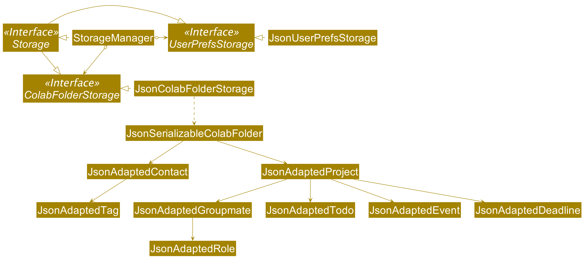
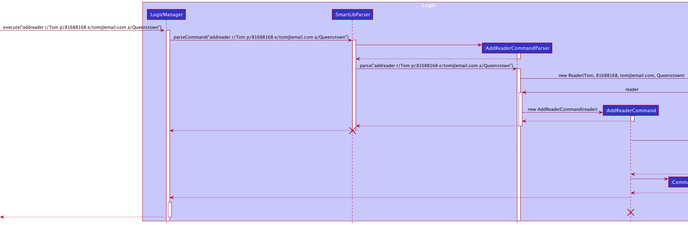
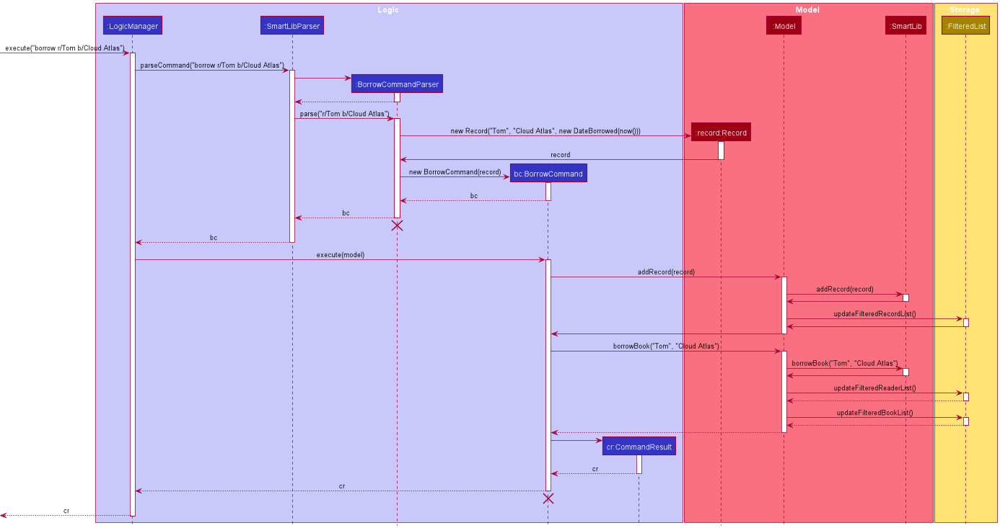
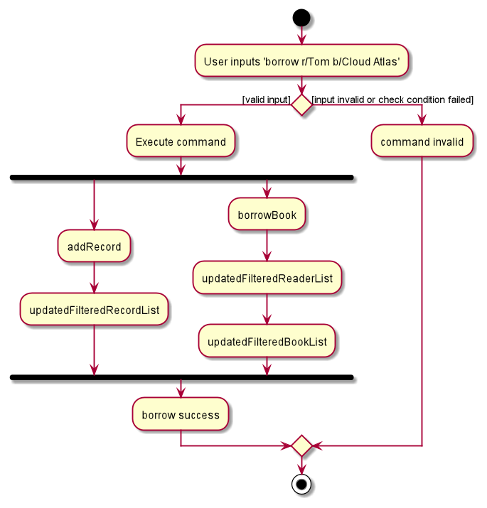
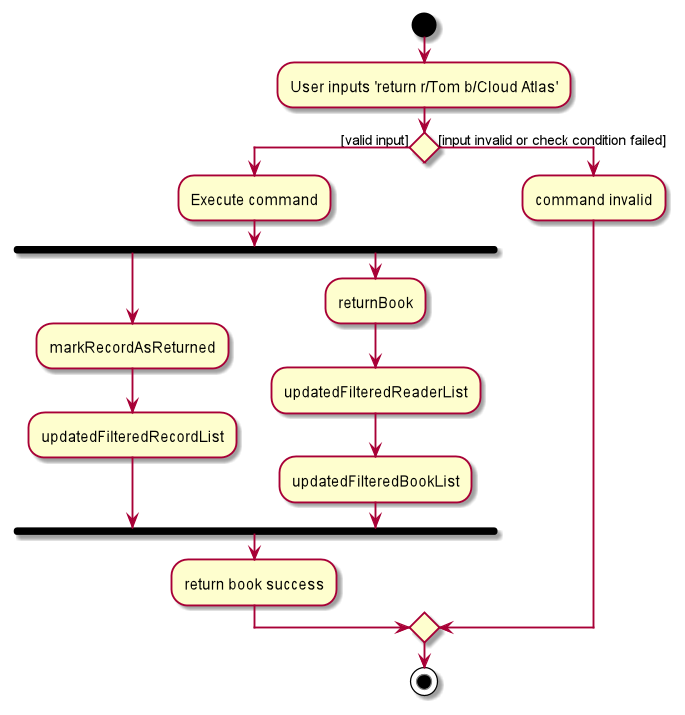

# Table of Contents
* [Getting started](#setting-up-getting-started)
* [Design](#design)
    * [Architecture](#architecture)
    * [UI component](#ui-component)
    * [Logic component](#logic-component)
    * [Model component](#model-component)
    * [Storage component](#storage-component)
    * [Common classes](#common-classes)
* [Implementation](#implementation)
    * [List all readers](#list-all-readers)
    * [\[Proposed\] Undo/redo feature](#proposed-undoredo-feature)
    * [\[Proposed\] Data archiving](#proposed-data-archiving)
* [Documentation, logging, testing, configuration, dev-ops](#documentation-logging-testing-configuration-dev-ops)
* [Appendix: Requirements](#appendix-requirements)
    * [Product scope](#product-scope)
    * [User stories](#user-stories)
    * [Use cases](#use-cases)
    * [Non-functional requirements](#non-functional-requirements)
    * [Glossary](#glossary)
* [Appendix: Instructions for manual testing](#appendix-instructions-for-manual-testing)
    * [Launch and shutdown](#launch-and-shutdown)
    * [Deleting a reader](#deleting-a-reader)
    * [Saving data](#saving-data)

--------------------------------------------------------------------------------------------------------------------

## **Setting up, getting started**

Refer to the guide [_Setting up and getting started_](SettingUp.md).

--------------------------------------------------------------------------------------------------------------------

## **Design**

### Architecture

The ***Architecture Diagram*** given above explains the high-level design of the App. Given below is a quick overview of each component.

:bulb: **Tip:** The `.puml` files used to create diagrams in this document can be found in the [diagrams](https://github.com/AY2021S2-CS2103T-W13-2/tp/tree/master/docs/diagrams) folder. Refer to the [_PlantUML Tutorial_ at se-edu/guides](https://se-education.org/guides/tutorials/plantUml.html) to learn how to create and edit diagrams.

**`Main`** has two classes called [`Main`](https://github.com/AY2021S2-CS2103T-W13-2/tp/blob/master/src/main/java/seedu/smartlib/Main.java) and [`MainApp`](https://github.com/AY2021S2-CS2103T-W13-2/tp/blob/master/src/main/java/seedu/smartlib/MainApp.java). It is responsible for,
* At app launch: Initializes the components in the correct sequence, and connects them up with each other.
* At shut down: Shuts down the components and invokes cleanup methods where necessary.

[**`Commons`**](#common-classes) represents a collection of classes used by multiple other components.

The rest of the App consists of four components.

* [**`UI`**](#ui-component): The UI of the App.
* [**`Logic`**](#logic-component): The command executor.
* [**`Model`**](#model-component): Holds the data of the App in memory.
* [**`Storage`**](#storage-component): Reads data from, and writes data to, the hard disk.

Each of the four components,

* defines its *API* in an `interface` with the same name as the Component.
* exposes its functionality using a concrete `{Component Name}Manager` class (which implements the corresponding API `interface` mentioned in the previous point.

For example, the `Logic` component (see the class diagram given below) defines its API in the `Logic.java` interface and exposes its functionality using the `LogicManager.java` class which implements the `Logic` interface.

**How the architecture components interact with each other**

The *Sequence Diagram* below shows how the components interact with each other for the scenario where the user issues the command `delete 1`.

The sections below give more details of each component.

### UI component

**API** :
[`Ui.java`](https://github.com/AY2021S2-CS2103T-W13-2/tp/blob/master/src/main/java/seedu/smartlib/ui/Ui.java)

The UI consists of a `MainWindow` that is made up of parts e.g.`CommandBox`, `ResultDisplay`, `ReaderListPanel`, `StatusBarFooter` etc. All these, including the `MainWindow`, inherit from the abstract `UiPart` class.

The `UI` component uses JavaFx UI framework. The layout of these UI parts are defined in matching `.fxml` files that are in the `src/main/resources/view` folder. For example, the layout of the [`MainWindow`](https://github.com/AY2021S2-CS2103T-W13-2/tp/blob/master/src/main/java/seedu/smartlib/ui/MainWindow.java) is specified in [`MainWindow.fxml`](https://github.com/AY2021S2-CS2103T-W13-2/tp/blob/master/src/main/resources/view/MainWindow.fxml)

The `UI` component,

* Executes user commands using the `Logic` component.
* Listens for changes to `Model` data so that the UI can be updated with the modified data.

### Logic component

**API** :
[`Logic.java`](https://github.com/AY2021S2-CS2103T-W13-2/tp/blob/master/src/main/java/seedu/smartlib/logic/Logic.java)

1. `Logic` uses the `SmartLibParser` class to parse the user command.
1. This results in a `Command` object which is executed by the `LogicManager`.
1. The command execution can affect the `Model` (e.g. adding a reader).
1. The result of the command execution is encapsulated as a `CommandResult` object which is passed back to the `Ui`.
1. In addition, the `CommandResult` object can also instruct the `Ui` to perform certain actions, such as displaying help to the user.

Given below is the Sequence Diagram for interactions within the `Logic` component for the `execute("delete 1")` API call.

:information_source: **Note:** The lifeline for `DeleteCommandParser` should end at the destroy marker (X) but due to a limitation of PlantUML, the lifeline reaches the end of diagram.

### Model component

**API** : [`Model.java`](https://github.com/AY2021S2-CS2103T-W13-2/tp/blob/master/src/main/java/seedu/smartlib/model/Model.java)

The `Model`,

* stores a `UserPref` object that represents the user’s preferences.
* stores the SmartLib data.
* exposes an unmodifiable `ObservableList<Reader>` that can be 'observed' e.g. the UI can be bound to this list so that the UI automatically updates when the data in the list change.
* does not depend on any of the other three components.

:information_source: **Note:** An alternative (arguably, a more OOP) model is given below. It has a `Tag` list in the `SmartLib`, which `Reader` references. This allows `SmartLib` to only require one `Tag` object per unique `Tag`, instead of each `Reader` needing their own `Tag` object. 

### Storage component

**API** : [`Storage.java`](https://github.com/AY2021S2-CS2103T-W13-2/tp/blob/master/src/main/java/seedu/smartlib/storage/Storage.java)

The `Storage` component,
* can save `UserPref` objects in json format and read it back.
* can save the SmartLib data in json format and read it back.

### Common classes

Classes used by multiple components are in the `seedu.smartlib.commons` package.

--------------------------------------------------------------------------------------------------------------------

## **Implementation**

This section describes some noteworthy details on how certain features are implemented.

### Add a reader
Adding a reader into a class requires user input from the CLI.
The `SmartLibParser` will parse the user input to check the validity of it, the input is valid if
1. The reader does not already exist in the code base.
2. The formats for the name, phone, email and address are correct.

Given below is an example usage scenario of how the `addreader` mechanism behaves at each step.
* Step 1: The user launches the SmartLib application with all of his/her readers already added to the reader list.
* Step 2: The user inputs `addreader r/Tom p/81688168 e/tom@email.com a/Queestown` to SmartLib, which calls upon `LogicManager#execute()`.
* Step 3: `SmartLibParser` and `AddReaderCommandParser` checks the user input and returns an `AddReaderCommand` to the `LogicManager` if the input is valid.
* Step 4: `LogicManager` calls `AddReaderCommand#execute()`, which in turn calls `Model#addReader()`.
* Step 5: By calling `Model#addReader()`, `ModelManager` then calls `SmartLib#addReader()` and `Model#updateFilteredReaderList()`.
* Step 6: `SmartLib#addReader()` adds the reader to the reader list.
* Step 7: `ModelManager#updateFilteredReaderList()` updates the reader list in local storage file.
* Step 8: The reader list is updated in the storage and reflected on the GUI.

The following sequence diagram shows how the `addreader` operation works:

The following activity diagram summarizes what happens when a user executes the `addreader` command:

### List all readers

Listing all readers in a class requires user input from the CLI.
The `SmartLibParser` will then create a `ListReaderCommand`, which will trigger Model to update the GUI with a full list of the readers.

**Notes:**
* Any arguments that the user inputs after the command `listreader` will not be examined by the application.
* If the current view of the GUI is already the full list of readers, `listreader` will not refresh or update the GUI.

Given below is an example usage scenario of how the `listreader` mechanism behaves at each step:
* Step 1: The user launches the SmartLib application with all of his/her readers already added to the reader list. 
* Step 2: The user inputs `listreader` to SmartLib, which calls upon `LogicManager#execute()`.
* Step 3: `SmartLibParser` checks the user input and returns a `ListReaderCommand` to the `LogicManager` if the input is valid.
* Step 4: `LogicManager` will then call `ListReaderCommand#execute()`, which in turn calls `Model#updateFilteredReaderList()`.
* Step 5: The reader list is updated and reflected on the GUI.

The following sequence diagram shows how the `listreader` operation works:

The following activity diagram summarizes what happens when a user executes the `listreader` command:

### Find all readers

Finding all readers in a class requires a user input from the CLI.
The respective parsers will parse the user input to check whether the input is valid, and obtain the name(s) of the reader(s) that the user wants to find.

Given below is an example usage scenario of how the `findreader` mechanism behaves at each step. In our example and the diagrams below, we assume that the user input is `findreader Tom`:
* Step 1: The user launches the SmartLib application with all of his/her readers already added to the reader list.
* Step 2: The user inputs `findreader Tom` to SmartLib, which calls upon `LogicManager#execute()`.
* Step 3: `SmartLibParser` and `FindReaderCommandParser` will check the user input, and return a `FindReaderCommand` to the `LogicManager` if the input is valid.
* Step 4: `LogicManager` will then call `FindReaderCommand#execute()`, which in turn calls `Model#updateFilteredReaderList()`.
* Step 5: The reader list is updated and reflected on the GUI.

The following sequence diagram shows how the `findreader` operation works:

The following activity diagram summarizes what happens when a user executes the `findreader` command:

### Record a reader borrowing a book

Recording a reader borrowing a book requires a user input from the CLI.
The respective parsers will parse the user input to check whether the input is valid, the input is valid if 
1. The book and reader specified exist in the code base
2. The book is available
3. The reader does not have overdue books or exceed his borrowing quota

Then take the following pesudo processes:
1. Obtain the Reader object and the Book object based on the identity provided by the user
2. Add a corresponding record to the record List
3. Update reader and book's borrowing status by adding the book in reader's borrowing list and setting the book's borrower to the reader

Given below is an example usage scenario of how the `borrow` mechanism behaves at each step. In our example and the diagrams below, 
we assume that the user input is `borrow r/Tom b/Cloud Atlas`:
* Step 1: The user launches the SmartLib application with all of his/her readers already added to the reader list and books added to the book list
* Step 2: The user inputs `borrow r/Tom b/Cloud Atlas` to SmartLib, which calls upon `LogicManager#execute()`.
* Step 3: `SmartLibParser` and `BorrowCommandParser` will check the user input, and return a `BorrowCommand` to 
  the `LogicManager` if the input is valid.
* Step 4: `LogicManager` will then call `BorrowCommand#execute()`, which in turn calls `Model#addRecord()` and `Model#borrowBook()`.
* Step 5: For calling `Model#addRecord()`, `ModelManager` will then call `SmartLib#addRecord()` and `Model#updateFilteredRecordList()`
* Step 6: `SmartLib#addRecord()` will add the corresponding record to record list
* Step 7: `ModelManager#updateFilteredRecordList()` will update corresponding record list in local storage file
* Step 8: On the other hand, `ModelManager#borrowBook()` will change the borrowing status of book and reader's borrowing list by calling `SmartLib#borrowBook()` and 
  update local storage by calling `Model#updateFilteredReaderList()` and `Model#updateFilteredBookList()`.
* Step 9: All reader list, book list and record list will be updated in storage and reflected on the GUI

The following sequence diagram shows how the `borrow` operation works:

The following activity diagram summarizes what happens when a user executes the `borrow` command:

### Record a reader returning a book

Recording a reader returning a book requires a user input from the CLI.
The respective parsers will parse the user input to check whether the input is valid, the input is valid if 
1. The reader and book specified exists in the code base.
2. The reader is borrowing the book and the book is borrowed by the reader
3. There is such a valid borrowing record existing in the code base

Then take the following pesudo processes:
1. Obtain the Reader object and the Book object based on the identity provided by the user
2. Mark a corresponding record as returned by indicating the dateReturned field.
3. Remove the book from reader's borrowing list and set book's borrower to null

Given below is an example usage scenario of how the `return` mechanism behaves at each step. In our example and the diagrams below,
we assume that the user input is `return r/Tom b/Cloud Atlas`:
* Step 1: The user launches the SmartLib application with all of his/her readers already added to the reader 
  list and books added to the book list and records added to record list
* Step 2: The user inputs `return r/Tom b/Cloud Atlas` to SmartLib, which calls upon `LogicManager#execute()`.
* Step 3: `SmartLibParser` and `ReturnCommandParser` will check the user input, and return a `ReturnCommand` to
  the `LogicManager` if the input is valid.
* Step 4: `LogicManager` will then call `ReturnCommand#execute()`, which in turn calls `Model#markRecordAsReturned()` and `Model#returnBook()`.
* Step 5: For calling `Model#markRecordAsReturned()`, `ModelManager` will then call `SmartLib#markRecordAsReturned()` and `Model#updateFilteredRecordList()`
* Step 6: `SmartLib#markRecordAsReturned()` will find the corresponding record in the record list and set the 
  dateReturned to LocalDate.now()
* Step 7: `ModelManager#updateFilteredRecordList()` will update corresponding record list in local storage file
* Step 8: `ModelManager#returnBook()` will change the status of book and reader specified by calling `SmartLib#returnBook()` and
  update local storage by calling `Model#updateFilteredReaderList()` and `Model#updateFilteredBookList()`.
* Step 9: All reader list, book list and record list will be updated in storage and reflected on the GUI

The following sequence diagram shows how the `return` operation works:

The following activity diagram summarizes what happens when a user executes the `return` command:

### \[Proposed\] Undo/redo feature

#### Proposed Implementation

The proposed undo/redo mechanism is facilitated by `VersionedSmartLib`. It extends `SmartLib` with an undo/redo history, stored internally as an `smartLibStateList` and `currentStatePointer`. Additionally, it implements the following operations:

* `VersionedSmartLib#commit()` — Saves the current SmartLib state in its history.
* `VersionedSmartLib#undo()` — Restores the previous SmartLib state from its history.
* `VersionedSmartLib#redo()` — Restores a previously undone SmartLib state from its history.

These operations are exposed in the `Model` interface as `Model#commitSmartLib()`, `Model#undoSmartLib()` and `Model#redoSmartLib()` respectively.

Given below is an example usage scenario and how the undo/redo mechanism behaves at each step.

Step 1. The user launches the application for the first time. The `VersionedSmartLib` will be initialized with the initial SmartLib state, and the `currentStatePointer` pointing to that single SmartLib state.

Step 2. The user executes `delete 5` command to delete the 5th reader in the SmartLib. The `delete` command calls `Model#commitSmartLib()`, causing the modified state of the SmartLib after the `delete 5` command executes to be saved in the `smartLibStateList`, and the `currentStatePointer` is shifted to the newly inserted SmartLib state.

Step 3. The user executes `add n/David …​` to add a new reader. The `add` command also calls `Model#commitSmartLib()`, causing another modified SmartLib state to be saved into the `smartLibStateList`.

:information_source: **Note:** If a command fails its execution, it will not call `Model#commitSmartLib()`, so the SmartLib state will not be saved into the `smartLibStateList`.

Step 4. The user now decides that adding the reader was a mistake, and decides to undo that action by executing the `undo` command. The `undo` command will call `Model#undoSmartLib()`, which will shift the `currentStatePointer` once to the left, pointing it to the previous SmartLib state, and restores the SmartLib to that state.

:information_source: **Note:** If the `currentStatePointer` is at index 0, pointing to the initial SmartLib state, then there are no previous SmartLib states to restore. The `undo` command uses `Model#canUndoSmartLib()` to check if this is the case. If so, it will return an error to the user rather
than attempting to perform the undo.

The following sequence diagram shows how the undo operation works:

:information_source: **Note:** The lifeline for `UndoCommand` should end at the destroy marker (X) but due to a limitation of PlantUML, the lifeline reaches the end of diagram.

The `redo` command does the opposite — it calls `Model#redoSmartLib()`, which shifts the `currentStatePointer` once to the right, pointing to the previously undone state, and restores the SmartLib to that state.

:information_source: **Note:** If the `currentStatePointer` is at index `smartLibStateList.size() - 1`, pointing to the latest SmartLib state, then there are no undone SmartLib states to restore. The `redo` command uses `Model#canRedoSmartLib()` to check if this is the case. If so, it will return an error to the user rather than attempting to perform the redo.

Step 5. The user then decides to execute the command `list`. Commands that do not modify the SmartLib, such as `list`, will usually not call `Model#commitSmartLib()`, `Model#undoSmartLib()` or `Model#redoSmartLib()`. Thus, the `smartLibStateList` remains unchanged.

Step 6. The user executes `clear`, which calls `Model#commitSmartLib()`. Since the `currentStatePointer` is not pointing at the end of the `smartLibStateList`, all SmartLib states after the `currentStatePointer` will be purged. Reason: It no longer makes sense to redo the `add n/David …​` command. This is the behavior that most modern desktop applications follow.

The following activity diagram summarizes what happens when a user executes a new command:

#### Design consideration:

##### Aspect: How undo & redo executes

* **Alternative 1 (current choice):** Saves the entire SmartLib.
  * Pros: Easy to implement.
  * Cons: May have performance issues in terms of memory usage.

* **Alternative 2:** Individual command knows how to undo/redo by
  itself.
  * Pros: Will use less memory (e.g. for `delete`, just save the reader being deleted).
  * Cons: We must ensure that the implementation of each individual command are correct.

### \[Proposed\] Data archiving

_{Explain here how the data archiving feature will be implemented}_

--------------------------------------------------------------------------------------------------------------------

## **Documentation, logging, testing, configuration, dev-ops**

* [Documentation guide](Documentation.md)
* [Testing guide](Testing.md)
* [Logging guide](Logging.md)
* [Configuration guide](Configuration.md)
* [DevOps guide](DevOps.md)

--------------------------------------------------------------------------------------------------------------------

## **Appendix: Requirements**

### Product scope

**Target user profile**:

* an owner of a private book loan service
* prefers desktop apps over other types
* types fast
* prefers typing to mouse interactions
* is proficient with using CLI apps
* is very meticulous
* wants to keep track of his/her loans
* wants to keep track of the details of all of his/her books
* wants to keep track of the condition of the book before and after the loan

**Value proposition**: systematic management of books and borrowers' information.
* It would be a pain for private book loan services to have to keep track of their books by paper.
* By having a reliable system to keep track of things, it would help save the owners of private book loan services an immense amount of time.

### User stories

Priorities: High (must have) - `* * *`, Medium (nice to have) - `* *`, Low (unlikely to have) - `*`

| Priority | As a …​                                    | I want to …​                     | So that I can…​                                                        |
| -------- | ------------------------------------------ | ------------------------------ | ---------------------------------------------------------------------- |
| `* * *`  | user                                       | add a new book                 |                                                                        |
| `* * *`  | user                                       | delete a book                  | remove entries that I no longer need                                   |
| `* * *`  | user                                       | list all books                 | keep track of my books                                                 |
| `* * *`  | user                                       | find a book by name            | locate details of books without having to go through the entire list   |
| `* * *`  | user                                       | add a new reader               |                                                                        |
| `* * *`  | user                                       | delete a reader                | remove entries that I no longer need                                   |
| `* * *`  | user                                       | list all readers               | keep track of my readers                                               |
| `* * *`  | user                                       | find a reader by name          | locate details of readers without having to go through the entire list |
| `* * *`  | user                                       | record the borrowing of a book | keep track of whether the book is borrowed out                         |
| `* * *`  | user                                       | record the returning of a book | keep track of whether the book has been returned                       |
| `* *`    | meticulous user                            | keep track of due date of a book | ensure that the book is returned on time                             |
| `* *`    | concerned user                             | keep track of cost of each book | ensure that I receive the correct reimbursement for lost books        |
| `* *`    | meticulous user                            | keep track of readers' borrow records | know my readers' preferences and fill my store with suitable books |
| `* *`    | user                                       | rank the most borrowed books   | know my readers' preferences and increase the quantity of these books  |
| `* *`    | user                                       | rank the least borrowed books  | know my readers' preferences and reduce the quantity of these books    |
| `*`      | user with a huge membership base           | find readers using other particulars | differentiate between readers with similar names                 |
| `*`      | user                                       | rank the readers who borrowed most books | reward him/her for his/her studiousness                      |
| `*`      | user                                       | sort books by name             | locate a book easily                                                   |
| `*`      | user                                       | sort readers by name           | locate a reader easily                                                 |
| `*`      | user                                       | tag books based on their genre | local a book easily                                                    |
| `*`      | user                                       | find a book by their genre     | locate a book easily                                                   |
| `*`      | user                                       | sort books by their genre      | locate a book easily                                                   |
| `*`      | concerned user                             | remind readers to return books | get my readers to return their books on time                           |
| `*`      | concerned but lazy user                     | automate my reminders          | get my readers to return their books on time without putting in any extra effort |

### Use cases

(For all use cases below, the **System** is `SmartLib` and the **Actor** is the `user`, unless specified otherwise)

**Use case: UC01 - List all readers**

**MSS**

1.  User requests to list readers.
2.  SmartLib shows a list of readers (if any).

    Use case ends.

**Extensions**

* 2a. The list is empty.

  Use case ends.

**Use case: UC02 - Search for a reader's information**

**MSS**

1.  User finds a reader by his or her name.
2.  SmartLib shows a list of readers with the given name.

    Use case ends.

**Extensions**

* 2a. The list is empty.

  Use case ends.

**Use case: UC03 - Find the most or least borrowed books**

**MSS**

1.  User requests to list books.
2.  SmartLib shows a list of books.
3.  User requests to sort the books by popularity.
4.  SmartLib sorts the books based on the number of times the books were borrowed.

**Extensions**

* 2a. The list is empty.

  Use case ends.

**Use case: UC04 - Borrow a book**

**MSS**

1.  User enter book id and reader id to allow that reader to borrow a book
2.  SmartLib displays successful borrowing information

**Extensions**

* 1a. The book does not exist
* 1b. The reader does not exist
* 1c. The book is currently not available
* 1d. The reader has borrowed more than the number of books allowed

  Use case ends.

**Use case: UC05 - Return a book**

**MSS**

1.  User enter book id and reader id to allow that reader to return a book
2.  SmartLib displays successful returning information

**Extensions**

* 1a. The book does not exist
* 1b. The reader does not exist
* 1c. The book is not currently borrowed under that reader
* 1d. The book in loan has exceeded expire date, extra charge

  Use case ends.

**Use case: UC06 - Check a reader's balance**

**MSS**

1.  User enter reader id to check the balance left in reader's account
2.  SmartLib displays reader's balance information

**Extensions**

* 1a. The reader does not exist

  Use case ends.

**Use case: UC07 - Delete a reader**

**Guarantee: Reader will be deleted from the registered reader base**

**MSS**

1.  User requests to list readers
2.  SmartLib shows a list of readers
3.  User requests to delete a specific reader in the list
4.  SmartLib deletes the reader

    Use case ends.

**Extensions**

* 2a. The list is empty.

  Use case ends.

* 3a. The given index is invalid.

    * 3a1. SmartLib shows an error message.

      Use case resumes at step 2.

**Use case: UC08 - Add a book**

**MSS**

1.  User requests to add a book to the list.
2.  SmartLib adds the book to the list and displays a success message.

    Use case ends.

**Extensions**

* 1a. The format of the `addbook` command is incomplete.
    
    * 1a1. SmartLib requests the user to reenter the command.
    
      Use case resumes at step 2. 

**Use case: UC09 - Delete a book**

**MSS**

1.  User requests to list books.
2.  SmartLib shows a list of books.
3.  User requests to delete a specific book in the list.
4.  SmartLib deletes the book.

    Use case ends.

**Extensions**

* 2a. The list is empty.

  Use case ends.

* 3a. The given index is invalid.

    * 3a1. SmartLib shows an error message.

      Use case resumes at step 2.

**Use case: UC10 - Add a reader**

**Guarantee: New reader will be added into the registered reader base**

**MSS**

1. User enters data about the reader to be added
2. SmartLib confirms the addition

   Use case ends.

**Extensions**

* 1a. SmartLib detects an error in the entered data.

    * 1a1. SmartLib requests for the correct data.

      1a2. User enters new data.

      Steps 1a1-1a2 are repeated until the data entered are correct.

      Use case resumes from step 2.

* 1b. SmartLib detects that the reader has already been added.

    * 1b1. User proceeds to enter new data to add another reader.

    * 1b2. Steps 1b and 1b1 are repeated until the data entered is a non-existing reader

      Use case resumes from step 2.

**Use case: UC11 - List all books**

**MSS**

1.  User requests to list books in the store.
2.  SmartLib shows a list of books (if any).

    Use case ends.

**Extensions**

* 2a. The list is empty.

  Use case ends.

**Use case: UC12 - Find books whose names contain the given keywords **

**MSS**

1.  User requests to find a book.
2.  SmartLib shows a list of books whose names contain the keywords.

    Use case ends.

**Extensions**

* 2a. The list is empty.

  Use case ends.

### Non-Functional Requirements

1.  Should work on any _mainstream OS_ as long as it has Java `11` or above installed.
2.  Should be able to hold up to 1000 readers without a noticeable sluggishness in performance for typical usage.
3.  A user with above average typing speed for regular English text (i.e. not code, not system admin commands) should be able to accomplish most of the tasks faster using commands than using the mouse.
4.  Portability and compatibility across different devices.
5.  The SmartLib system should respond within one second.
6.  The user inferface must be intuitive and clear, so that new users can use the app without much difficulty.
7.  The product is offered as a free online service.

### Glossary

* **Mainstream OS**: Windows, Linux, Unix, OS-X
* **Private contact detail**: A contact detail that is not meant to be shared with others
* **Regex**: A string of text that allows you to create patterns that help match, locate, and manage text

--------------------------------------------------------------------------------------------------------------------

## **Appendix: Instructions for manual testing**

Given below are instructions to test the app manually.

:information_source: **Note:** These instructions only provide a starting point for testers to work on;
testers are expected to do more *exploratory* testing.

### Launch and shutdown

1. Initial launch

   1. Download the jar file and copy into an empty folder

   1. Double-click the jar file Expected: Shows the GUI with a set of sample contacts. The window size may not be optimum.

1. Saving window preferences

   1. Resize the window to an optimum size. Move the window to a different location. Close the window.

   1. Re-launch the app by double-clicking the jar file. 
       Expected: The most recent window size and location is retained.

1. _{ more test cases …​ }_

### Deleting a reader

1. Deleting a reader while all readers are being shown

   1. Prerequisites: List all readers using the `list` command. Multiple readers in the list.

   1. Test case: `delete 1` 
      Expected: First contact is deleted from the list. Details of the deleted contact shown in the status message. Timestamp in the status bar is updated.

   1. Test case: `delete 0` 
      Expected: No reader is deleted. Error details shown in the status message. Status bar remains the same.

   1. Other incorrect delete commands to try: `delete`, `delete x`, `...` (where x is larger than the list size) 
      Expected: Similar to previous.

1. _{ more test cases …​ }_

### Saving data

1. Dealing with missing/corrupted data files

   1. _{explain how to simulate a missing/corrupted file, and the expected behavior}_

1. _{ more test cases …​ }_
