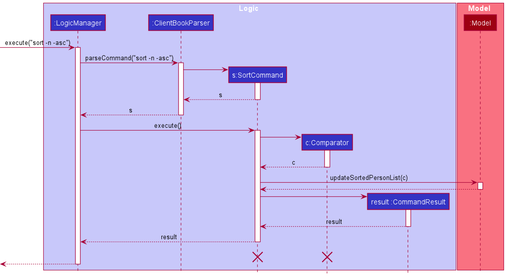

* Table of Contents
  {:toc}

--------------------------------------------------------------------------------------------------------------------

## **Setting up, getting started**

Refer to the guide [_Setting up and getting started_](SettingUp.md).

--------------------------------------------------------------------------------------------------------------------

## **Design**

### Architecture

The ***Architecture Diagram*** given above explains the high-level design of the App. Given below is a quick overview of each component.

:bulb: **Tip:** The `.puml` files used to create diagrams in this document can be found in the [diagrams](https://github.com/se-edu/addressbook-level3/tree/master/docs/diagrams/) folder. Refer to the [_PlantUML Tutorial_ at se-edu/guides](https://se-education.org/guides/tutorials/plantUml.html) to learn how to create and edit diagrams.

**`Main`** has two classes called [`Main`](https://github.com/se-edu/addressbook-level3/tree/master/src/main/java/seedu/address/Main.java) and [`MainApp`](https://github.com/se-edu/addressbook-level3/tree/master/src/main/java/seedu/address/MainApp.java). It is responsible for,
* At app launch: Initializes the components in the correct sequence, and connects them up with each other.
* At shut down: Shuts down the components and invokes cleanup methods where necessary.

[**`Commons`**](#common-classes) represents a collection of classes used by multiple other components.

The rest of the App consists of four components.

* [**`UI`**](#ui-component): The UI of the App.
* [**`Logic`**](#logic-component): The command executor.
* [**`Model`**](#model-component): Holds the data of the App in memory.
* [**`Storage`**](#storage-component): Reads data from, and writes data to, the hard disk.

Each of the four components,

* defines its *API* in an `interface` with the same name as the Component.
* exposes its functionality using a concrete `{Component Name}Manager` class (which implements the corresponding API `interface` mentioned in the previous point.

For example, the `Logic` component (see the class diagram given below) defines its API in the `Logic.java` interface and exposes its functionality using the `LogicManager.java` class which implements the `Logic` interface.

**How the architecture components interact with each other**

The *Sequence Diagram* below shows how the components interact with each other for the scenario where the user issues the command `delete 1`.

The sections below give more details of each component.

### UI component

**API** :
[`Ui.java`](https://github.com/se-edu/addressbook-level3/tree/master/src/main/java/seedu/address/ui/Ui.java)

The UI consists of a `MainWindow` that is made up of parts e.g.`CommandBox`, `ResultDisplay`, `PersonListPanel`, `StatusBarFooter` etc. All these, including the `MainWindow`, inherit from the abstract `UiPart` class.

The `UI` component uses JavaFx UI framework. The layout of these UI parts are defined in matching `.fxml` files that are in the `src/main/resources/view` folder. For example, the layout of the [`MainWindow`](https://github.com/se-edu/addressbook-level3/tree/master/src/main/java/seedu/address/ui/MainWindow.java) is specified in [`MainWindow.fxml`](https://github.com/se-edu/addressbook-level3/tree/master/src/main/resources/view/MainWindow.fxml)

The `UI` component,

* Executes user commands using the `Logic` component.
* Listens for changes to `Model` data so that the UI can be updated with the modified data.

### Logic component

**API** :
[`Logic.java`](https://github.com/se-edu/addressbook-level3/tree/master/src/main/java/seedu/address/logic/Logic.java)

1. `Logic` uses the `AddressBookParser` class to parse the user command.
1. This results in a `Command` object which is executed by the `LogicManager`.
1. The command execution can affect the `Model` (e.g. adding a person).
1. The result of the command execution is encapsulated as a `CommandResult` object which is passed back to the `Ui`.
1. In addition, the `CommandResult` object can also instruct the `Ui` to perform certain actions, such as displaying help to the user.

Given below is the Sequence Diagram for interactions within the `Logic` component for the `execute("delete 1")` API call.

:information_source: **Note:** The lifeline for `DeleteCommandParser` should end at the destroy marker (X) but due to a limitation of PlantUML, the lifeline reaches the end of diagram.

### Model component

**API** : [`Model.java`](https://github.com/se-edu/addressbook-level3/tree/master/src/main/java/seedu/address/model/Model.java)

The `Model`,

* stores a `UserPref` object that represents the user’s preferences.
* stores the address book data.
* exposes an unmodifiable `ObservableList<Person>` that can be 'observed' e.g. the UI can be bound to this list so that the UI automatically updates when the data in the list change.
* does not depend on any of the other three components.

:information_source: **Note:** An alternative (arguably, a more OOP) model is given below. It has a `Tag` list in the `AddressBook`, which `Person` references. This allows `AddressBook` to only require one `Tag` object per unique `Tag`, instead of each `Person` needing their own `Tag` object. 

### Storage component

**API** : [`Storage.java`](https://github.com/se-edu/addressbook-level3/tree/master/src/main/java/seedu/address/storage/Storage.java)

The `Storage` component,
* can save `UserPref` objects in json format and read it back.
* can save the address book data in json format and read it back.

### Common classes

Classes used by multiple components are in the `seedu.addressbook.commons` package.

--------------------------------------------------------------------------------------------------------------------

## **Implementation**

This section describes some noteworthy details on how certain features are implemented.

### Blacklist feature
The blacklist mechanism is facilitated by `Person`.
It represents if a `Person` is blacklisted or not, stored internally by adding a `Blacklist` object to the parameters of `Person`.
Blacklist status is displayed externally via `PersonListCard#blacklist`.

Given below is an example usage scenario.

Step 1. The user executes `add n/David …​` to add a new person.
A new `Person` is created, with the default status of un-blacklisted.
It is then added to `AddressBook`.

Step 2. The user decides to blacklist the person, and executes the `blist INDEX` command.
The `blist INDEX` command will create a new `Person` with the same information as the person at `INDEX` in `AddressBook`,
but with a new `Blacklist` with a different blacklist status, which then replaces the original person.

The following sequence diagram shows how the blacklist operation works:

The following activity diagram summarizes what happens when a user executes a blacklist command:

#### Design consideration:

##### Aspect: The command format of blacklist

* **Alternative 1 (current choice):** `blist INDEX` to toggle blacklist status.
    * Pros: Easier to remember, faster to type.
            More straightforward and logical for a value with only 2 states.
    * Cons: Requires checking current blacklist status.

* **Alternative 2:** `+blist INDEX` to blacklist, `-blist INDEX` to un-blacklist.
    * Pros: Able to directly set blacklist status without checking current status.
    * Cons: More commands to remember.
    
### Sort feature
The sort feature is implemented in the `SortCommand` class. 
Below is an example usage scenario.

Step 1: The user executes `sort c/...` to sort the contact list according to some specific criteria.
The `UI` component passes the string to the `LogicManager` class in the `Logic` component. 

Step 2: The `Logic` component parses the string and creates a corresponding `SortCommand` object.

Step 3: The `LogicManager` executes the `SortCommand` object. This calls the appropriate `sort` method in
the `Model` component.

Step 4: The `Model` component sorts the internal contact list. After sorting, the appropriate method in the `Storage`
component is called to update the file.

Step 5: Finally, the `Model` component passes the `CommandResult` back to the `Logic` component, which in turn passes
it back to the `UI` component to display it to the user.

The following sequence diagram illustrates how the sort operation works:

### Find persons by tag feature
This feature is built on the current `find` command, which is used to be limited to only finding persons by names. With this change, the format of the `find` command is now modified to `find n/[NAME] t/[TAG]`.
This command returns the persons with attributes that matches at least one of the attributes of interest (See User Guide for more details).
Note that users are only required to provide at least one of the parameters to use this command. In other words, commands such as `find n/Alex` and `find t/autistic` are valid commands.

To facilitate the implementation of this feature, two new predicate classes are introduced, namely `PersonTagContainsKeywordsPredicate` and `ReturnTruePredicate`. The former class is to check whether any of the `tag`s contain the keywords. The latter predicate always returns `true`. 

The introduction of `ReturnTruePredicate` may seem pointless, but it is of great use. The key here is to realize that if X is a boolean variable, then X `and` `true` simplifies to X. If both `name` and `tag` keywords are given, the `FindCommand` class will receive `NameContainsKeywordsPredicate` and `PersonTagContainsKeywordsPredicate`. If, say, only `name` keywords are given, then `ReturnTruePredicate` will instead be supplied to `FindCommand`.
As such, the filter will now solely depend on `NameContainsKeywordsPredicate` since the second predicate always returns true.

The following sequence diagram shows how the `find` command works:

The following activity diagram shows what happens when `find` command is executed.

#### Design considerations:

##### Aspect: Command design

* **Alternative 1 (current choice):** `find` command alone supports finding by names and tags.
    * Pros: More intuitive to use since most commands have similar format. Makes further extensions easier as developers only need to define a new predicate class.
    * Cons: Can make debugging harder since further extensions are centralized into one class.

* **Alternative 2:** Find by names and find by tags are separate commands.
    * Pros: Easier to debug as one command is meant for one criterion.
    * Cons: It is now not possible to combine both criteria together. More commands to remember. Due to similarity of the commands, they can be confused from one another.
    
### \[Proposed\] Undo/redo feature

#### Proposed Implementation

The proposed undo/redo mechanism is facilitated by `VersionedAddressBook`. It extends `AddressBook` with an undo/redo history, stored internally as an `addressBookStateList` and `currentStatePointer`. Additionally, it implements the following operations:

* `VersionedAddressBook#commit()` — Saves the current address book state in its history.
* `VersionedAddressBook#undo()` — Restores the previous address book state from its history.
* `VersionedAddressBook#redo()` — Restores a previously undone address book state from its history.

These operations are exposed in the `Model` interface as `Model#commitAddressBook()`, `Model#undoAddressBook()` and `Model#redoAddressBook()` respectively.

Given below is an example usage scenario and how the undo/redo mechanism behaves at each step.

Step 1. The user launches the application for the first time. The `VersionedAddressBook` will be initialized with the initial address book state, and the `currentStatePointer` pointing to that single address book state.

Step 2. The user executes `delete 5` command to delete the 5th person in the address book. The `delete` command calls `Model#commitAddressBook()`, causing the modified state of the address book after the `delete 5` command executes to be saved in the `addressBookStateList`, and the `currentStatePointer` is shifted to the newly inserted address book state.

Step 3. The user executes `add n/David …​` to add a new person. The `add` command also calls `Model#commitAddressBook()`, causing another modified address book state to be saved into the `addressBookStateList`.

:information_source: **Note:** If a command fails its execution, it will not call `Model#commitAddressBook()`, so the address book state will not be saved into the `addressBookStateList`.

Step 4. The user now decides that adding the person was a mistake, and decides to undo that action by executing the `undo` command. The `undo` command will call `Model#undoAddressBook()`, which will shift the `currentStatePointer` once to the left, pointing it to the previous address book state, and restores the address book to that state.

:information_source: **Note:** If the `currentStatePointer` is at index 0, pointing to the initial AddressBook state, then there are no previous AddressBook states to restore. The `undo` command uses `Model#canUndoAddressBook()` to check if this is the case. If so, it will return an error to the user rather
than attempting to perform the undo.

The following sequence diagram shows how the undo operation works:

:information_source: **Note:** The lifeline for `UndoCommand` should end at the destroy marker (X) but due to a limitation of PlantUML, the lifeline reaches the end of diagram.

The `redo` command does the opposite — it calls `Model#redoAddressBook()`, which shifts the `currentStatePointer` once to the right, pointing to the previously undone state, and restores the address book to that state.

:information_source: **Note:** If the `currentStatePointer` is at index `addressBookStateList.size() - 1`, pointing to the latest address book state, then there are no undone AddressBook states to restore. The `redo` command uses `Model#canRedoAddressBook()` to check if this is the case. If so, it will return an error to the user rather than attempting to perform the redo.

Step 5. The user then decides to execute the command `list`. Commands that do not modify the address book, such as `list`, will usually not call `Model#commitAddressBook()`, `Model#undoAddressBook()` or `Model#redoAddressBook()`. Thus, the `addressBookStateList` remains unchanged.

Step 6. The user executes `clear`, which calls `Model#commitAddressBook()`. Since the `currentStatePointer` is not pointing at the end of the `addressBookStateList`, all address book states after the `currentStatePointer` will be purged. Reason: It no longer makes sense to redo the `add n/David …​` command. This is the behavior that most modern desktop applications follow.

The following activity diagram summarizes what happens when a user executes a new command:

#### Design consideration:

##### Aspect: How undo & redo executes

* **Alternative 1 (current choice):** Saves the entire address book.
    * Pros: Easy to implement.
    * Cons: May have performance issues in terms of memory usage.

* **Alternative 2:** Individual command knows how to undo/redo by
  itself.
    * Pros: Will use less memory (e.g. for `delete`, just save the person being deleted).
    * Cons: We must ensure that the implementation of each individual command are correct.

_{more aspects and alternatives to be added}_

### \[Proposed\] Data archiving

_{Explain here how the data archiving feature will be implemented}_

--------------------------------------------------------------------------------------------------------------------

## **Documentation, logging, testing, configuration, dev-ops**

* [Documentation guide](Documentation.md)
* [Testing guide](Testing.md)
* [Logging guide](Logging.md)
* [Configuration guide](Configuration.md)
* [DevOps guide](DevOps.md)

--------------------------------------------------------------------------------------------------------------------

## **Appendix: Requirements**

### Product scope

**Target user profile**:

* has a need to manage a significant number of contacts
* prefer desktop apps over other types
* can type fast
* prefers typing to mouse interactions
* is reasonably comfortable using CLI apps
* is an NUS Computer Science undergraduate
* works in the NUS Office of Campus Amenities communications team

**Value proposition**: OCA has a wide range of information to disseminate
to students / staff at NUS. The large number of emails to send, and the large
student / staff population may introduce errors during dissemination.
We aim to help them classify this information based on the relevant parties
and the required means of communication.

### User stories

Priorities: High (must have) - `* * *`, Medium (nice to have) - `* *`, Low (unlikely to have) - `*`

| Priority | As a …​                                 | I want to …​                                      | So that I can…​                                                      |
| -------- | ------------------------------------------ | ---------------------------------------------------- | ----------------------------------------------------------------------- |
| `* * *`  | new user                                   | see usage instructions                               | refer to instructions when I forget how to use the App                  |
| `* * *`  | user                                       | add a new contact                                    |                                                                         |
| `* * *`  | user                                       | delete a contact                                     | remove entries that I no longer need                                    |
| `* * *`  | user                                       | find a contact by name                               | locate details of contacts without having to go through the entire list |
| `* * *`  | user                                       | filter contacts by tag                               | minimize chance of sending emails to the wrong recipient                |
| `* * *`  | user                                       | specify preferred mode of contact                    | maximize chance of recipient seeing the information                     |
| `* * *`  | user                                       | blacklist a contact                                  | reduce dissemination of information to people who do not want it        |
| `* *`    | user                                       | hide private contact details                         | minimize chance of someone else seeing them by accident                 |
| `* *`    | user with many contacts                    | assign each contact an additional optional remark    | remember contacts more accurately                                       |
| `* *`    | user with many contacts                    | sort contacts by name                                | locate a contact easily                                                 |

*{More to be added}*

### Use cases

(For all use cases below, the **System** is the `AddressBook` and the **Actor** is the `user`, unless specified otherwise)

**Use case: Delete a person**

**MSS**

1.  User requests to list contacts
2.  SpamEZ shows a list of contacts
3.  User requests to delete a specific contact in the list
4.  SpamEZ deletes the contact

    Use case ends.

**Extensions**

* 2a. The list is empty.

  Use case ends.

* 3a. The given index is invalid.

    * 3a1. SpamEZ shows an error message.

      Use case resumes at step 2.

**Use case: Filter contacts by tags**

**MSS**
1. User requests to list contacts
2. SpamEZ shows a list of contacts
3. User requests to find the contacts using name and/or tags
4. SpamEZ returns a filtered list of contacts

   Use case ends.

**Extensions**
* 2a. The list is empty.

  Use case ends.

* 3a. No keywords are given or invalid syntax.
    * 3a1. SpamEZ shows an error message.

      Use case resumes at step 2.

**Use case: Specify a preferred mode of contact for a contact**

**MSS**

1.  User requests to list contacts
2.  SpamEZ shows a list of contacts
3.  User requests to edit the preferred mode of contact for a contact
4.  SpamEZ edits the contact
    
    Use case ends.

**Extensions**

* 2a. The list is empty.

  Use case ends.

**Use case: Blacklist a contact**

**MSS**

1. User requests to list contacts
2. SpamEZ shows a list of contacts
3. User requests to change the blacklist status of a specific contact 
   in the list
4. SpamEZ changes the blacklist status of the contact

   Use case ends.

**Extensions**

* 2a. The list is empty.

  Use case ends.

* 3a. The given index is invalid.

    * 3a1. SpamEZ shows an error message.

      Use case resumes at step 2.

**Use case: Assign an optional remark to a contact**

**MSS**

1. User requests to list contacts.
2. SpamEZ shows a list of contacts.
3. User requests to add an optional remark to a specific contact in the list.
4. SpamEZ adds the optional remark to the specific contact.
5. SpamEZ shows the updated list of contacts.
   
   Use case ends.

**Extensions**

* 3a. The given index is invalid.

  * 3a1. SpamEZ shows an error message.
    
    Use case resumes at step 3.

* 3b. The user enters details in the wrong format.

    * 3b1. SpamEZ shows an error message and the correct format.

      Use case resumes at step 3.

**Use case: Sort contacts by name**

**MSS**

1. User requests to sort the contact list by name in alphabetical order.
2. SpamEZ sorts the contact list.
3. SpamEZ displays the updated contact list.
   
   Use case ends.

*{More to be added}*

### Non-Functional Requirements

1.  Should work on any _mainstream OS_ as long as it has Java `11` or above installed.
2.  Should be able to hold up to 1000 persons without a noticeable sluggishness in performance for typical usage.
3.  A user with above average typing speed for regular English text (i.e. not code, not system admin commands) should be able to accomplish most of the tasks faster using commands than using the mouse.
4.  Every command that is accessible via the graphical user interface should be possible using only command line inputs.

*{More to be added}*

### Glossary

* **Mainstream OS**: Windows, Linux, Unix, OS-X
* **Private contact detail**: A contact detail that is not meant to be shared with others

--------------------------------------------------------------------------------------------------------------------

## **Appendix: Instructions for manual testing**

Given below are instructions to test the app manually.

:information_source: **Note:** These instructions only provide a starting point for testers to work on;
testers are expected to do more *exploratory* testing.

### Launch and shutdown

1. Initial launch

    1. Download the jar file and copy into an empty folder

    1. Double-click the jar file Expected: Shows the GUI with a set of sample contacts. The window size may not be optimum.

1. Saving window preferences

    1. Resize the window to an optimum size. Move the window to a different location. Close the window.

    1. Re-launch the app by double-clicking the jar file. 
       Expected: The most recent window size and location is retained.

1. _{ more test cases …​ }_

### Deleting a contact

1. Deleting a contact while all contacts are being shown

    1. Prerequisites: List all persons using the `list` command. Multiple persons in the list.

    1. Test case: `delete 1` 
       Expected: First contact is deleted from the list. Details of the deleted contact shown in the status message. Timestamp in the status bar is updated.

    1. Test case: `delete 0` 
       Expected: No contact is deleted. Error details shown in the status message. Status bar remains the same.

    1. Other incorrect delete commands to try: `delete`, `delete x`, `...` (where x is larger than the list size) 
       Expected: Similar to previous.

1. _{ more test cases …​ }_

### Saving data

1. Dealing with missing/corrupted data files

    1. _{explain how to simulate a missing/corrupted file, and the expected behavior}_

1. _{ more test cases …​ }_

### Filtering the contacts

1. Filter the list of contacts based on the keywords provided.

    1. Prerequisites: List all contacts using the `list` command. Multiple contacts in the list.

    1. Test case: `find n/Alex Bernice`  
       Expected: A list of contacts whose name contains `Alex` **or** `Bernice`. The filter is case-insensitive, so `Alex` will match with `aLeX` too, for instance.

    1. Test case: `find t/friends NEIGHBOUR`  
       Expected: A list of contacts whose tags contain `friends` **or** `NEIGHBOUR`.

    1. Test case: `find n/Alex Bernice t/friends neighbour`  
       Expected: A list of contacts whose name contains `Alex` or `Bernice` **and** tags contains `friends` or `neighbour`.

    1. Test case: `find`  
       Expected: No filtering is done, and the original list is presented. Error details shown in the status message.

    1. Other incorrect find commands to try: `find n/`, `find t/`, `...`  
       Expected: Similar to previous.
       
