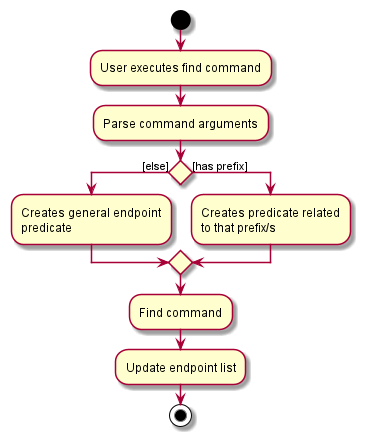

  

<h1 class="post-title">{{ page.title | escape }}</h1>
<h3 class="post-subtitle">v1.4b</h3>

## Table of Contents
{:.no_toc}

* Table of Contents 
{:toc}

## **Introduction**
imPoster is a desktop application for beginners of API development to quickly grasp the basics. 
imPoster's simple and minimalistic style can help beginner API developers **explore** and **test** APIs, whether those **found online** or those that they have **built** themselves.
imPoster is also highly optimised fast typists and can be fully operated through keyboard commands.  

This developer's guide assumes its readers to have a **basic understanding** of APIs. 
For a basic definition of [what an API is](#what-is-an-api), an appendix has been provided for readers who may be unfamiliar with the concept.
However, it is highly recommended for readers to refer to proper tutorial contents for the basics of APIs prior to developing the application.  

Readers are also advised to download our latest releases from our [main website](https://imposter-dev.tk) in order to test out the application.  

## **Navigating this Developer Guide**

Before diving into the rest of the contents in our developer guide, the following are a few important syntaxes to take note of to facilitate your reading:

| Syntax              | Description                                    |
| ------------------- | ---------------------------------------------- |
|`Markdown`           | Denotes distinct classes, their methods or examples|
|
:information_source: Note | Important things to take note of |
|<kbd>Keyboard</kbd>  | Keyboard actions                               |

## **Design**
### Architecture

  

The ***Architecture Diagram*** given above explains the high-level design of the App. Given below is a quick overview of each component.

**`Main`** has two classes called [`Main`](https://github.com/AY2021S2-CS2103T-T12-4/tp/blob/master/src/main/java/seedu/us/among/Main.java) and [`ImPoster`](https://github.com/AY2021S2-CS2103T-T12-4/tp/blob/master/src/main/java/seedu/us/among/ImPoster.java). They are responsible for,
* At app launch: Initializes the components in the correct sequence, and connects them up with each other.
* At shut down: Shuts down the components and invokes cleanup methods where necessary.

[**`Commons`**](#common-classes) represents a collection of classes used by multiple other components.

The rest of the App consists of four components.

* [**`UI`**](#ui-component): The UI of the App.
* [**`Logic`**](#logic-component): The command executor.
* [**`Model`**](#model-component): Holds the data of the App in memory.
* [**`Storage`**](#storage-component): Reads data from, and writes data to, the hard disk.

Each of the four components,

* defines its *API* in an `interface` with the same name as the Component.
* exposes its functionality using a concrete `{Component Name}Manager` class (which implements the corresponding API `interface` mentioned in the previous point.

For example, the `Logic` component (see the class diagram given below) defines its API in the `Logic.java` interface and exposes its functionality using the `LogicManager.java` class which implements the `Logic` interface.

  

**How the architecture components interact with each other**

The *Sequence Diagram* below shows how the components interact with each other for the scenario where the user issues the command `remove 1`.

  

The sections below give more details of each component.

### UI component

  

**API** :
[`Ui.java`](https://github.com/AY2021S2-CS2103T-T12-4/tp/blob/master/src/main/java/seedu/us/among/ui/Ui.java)

The UI consists of a `MainWindow` that is made up of parts e.g.`CommandBox`, `ResultDisplay`, `EndpointListPanel`, `StatusBarFooter` etc. All these, including the `MainWindow`, inherit from the abstract `UiPart` class.

The `UI` component uses JavaFx UI framework. The layout of these UI parts are defined in matching `.fxml` files that are in the `src/main/resources/view` folder. For example, the layout of the 
[`MainWindow`](https://github.com/AY2021S2-CS2103T-T12-4/tp/blob/master/src/main/java/seedu/us/among/ui/MainWindow.java) is specified in 
[`MainWindow.fxml`](https://https://github.com/AY2021S2-CS2103T-T12-4/tp/blob/master/src/main/resources/view/MainWindow.fxml)

The `UI` component,

* Executes user commands using the `Logic` component.
* Listens for changes to `Model` data so that the UI can be updated with the modified data.

### Logic component

  

**API** :
[`Logic.java`](https://github.com/AY2021S2-CS2103T-T12-4/tp/blob/master/src/main/java/seedu/us/among/logic/Logic.java)

1. `Logic` uses the `ImposterParser` class to parse the user command
2. This results in a `Command` object which is executed by the `LogicManager`.
3. The command execution can affect the `Model` (e.g. adding a endpoint).
4. The result of the command execution is encapsulated as a `CommandResult` object which is passed back to the `Ui`.
5. In addition, the `CommandResult` object can also instruct the `Ui` to perform certain actions, such as displaying help to the user.

Given below is the Sequence Diagram for interactions within the `Logic` component for the `execute("remove 1")` API call.

  

:information_source: **Note:** The lifeline for `DeleteCommandParser` should end at the destroy marker (X) but due to a limitation of PlantUML, the lifeline reaches the end of diagram.

### Model component

  

**API** : [`Model.java`](https://github.com/AY2021S2-CS2103T-T12-4/tp/blob/master/src/main/java/seedu/us/among/model/Model.java)

The `Model`,
* stores a `UserPref` object that represents the user’s preferences.
* stores the Endpoint List Data.
* exposes an unmodifiable `ObservableList<Endpoint>` that can be 'observed' e.g. the UI can be bound to this list so that the UI automatically updates when the data in the list change.
* does not depend on any of the other three components.

:information_source: **Note:** An alternative (arguably, a more OOP) model
is given below. It has a `Tag` list in the `imPoster`, which `Endpoint` references. This allows `imPoster` to only 
require one `Tag` object per unique `Tag`, instead of each `Endpoint` needing their own `Tag` object. 

  

### Storage component

  

**API** : [`Storage.java`](https://github.com/AY2021S2-CS2103T-T12-4/tp/blob/master/src/main/java/seedu/us/among/storage/Storage.java)

The `Storage` component,
* can save `UserPref` objects in json format and read it back.
* can save the Endpoint List data in json format and read it back.

### Common classes

Classes used by multiple components are in the `seedu.us.among.commons` package.

--------------------------------------------------------------------------------------------------------------------

## **Implementation**

This section describes some noteworthy details on how certain features are implemented.

### Endpoint components

* Change/Add classes in the Endpoint package to encapsulate an API endpoint.

#### Implementation

  

An `Endpoint`,
* is stored in `EndpointList` of the `Model`
* encapsulates an API endpoint

An `Endpoint` contains the following attributes:
1. a `Method`, which represents the type of request an API endpoint will send to the server
2. an `Address`, which represents the URL address to which the API request is made
3. a `Data`, which represents the data that is to be sent to the server when an API request is made
4. a Headers Set, which encapsulates a list of zero or more `Header` objects, where each `Header` represents a header that is to be sent to the server
5. a Tags Set, which encapsulates a list of zero or more `Tags` objects
6. a `Response`, which represents the response that an API receives from the server

* There are a certain set of requests that an API can make: GET, POST, PUT, DELETE, HEAD, OPTIONS, PATCH.
* A `Method` object will always be one of the above requests
* `Data` represents the data that is to be sent to the server when an API request is made
* `Data` can be empty, as some API calls do not send any data to the server
* Before an API call is made, the `Response` object will be empty
* Only when a Request#executeTimed(request) is called will a `Response` contain information about the API call response

#### Design consideration:
##### Aspect: How the components within `Endpoint` are added or changed
* **Current Choice**: Attributes within `Endpoint` are immutable, meaning that if there is an attribute that has to be
  edited or added, a new Endpoint object has to be created.
    * Pros: Concept of Immutability is met, making the code less prone to bugs as all components of an Endpoint object are fixed
    * Cons: Less flexible, more steps needed in creating or editing Endpoint objects

* **Alternative 1**: Allow certain components within `Endpoint`, like `Header` and `Data` to be mutable
    * Pros: Less overhead as fewer objects are created
    * Cons: Prone to error as a Component might not be correctly changed
    

### Add endpoint feature

#### What it is

Adds an endpoint to the bottom of the list of currently existing endpoints. Users are able to add any valid endpoint to the list. If the exact same endpoint is already in the list, this command will not be allowed and an error will be shown.

Example: `add -x get -u https://localhost:3000`

#### Implementation

Upon the users entry of the endpoint, the `AddCommand` object is created. `AddCommand` is a class that extends `Command` abstract class. `AddCommand` implements the `execute()` method from the `Command` abstract class whereby upon execution, the method will add the given endpoint in the model's list of endpoints if a valid endpoint is given.

Given below is an example usage scenario and how the add command behaves at each step.

Step 1. The user launches the application and executes `add -x get -u https://api.data.gov.sg/v1/environment/air-temperature` to save an endpoint.

Step 2. The endpoint is added to the model.

The following sequence diagram shows how the add operation works:

  

:information_source: **Note:** The lifeline for `AddCommand` should end at the destroy marker (X) but due to a limitation of PlantUML, the lifeline reaches the end of diagram.

### Find command feature

#### What it is

Looks for an endpoint in the list of endpoints and displays all the endpoints that match the requested specifications. If there are no specifications, `find` will do a general search through all fields that endpoint has.

#### Implementation

Upon the users entry of the find keyword, the parser will check if prefixes have been specified, if the user decided to specify prefixes, the `FindCommand` object will be created with predicates looking through the specified prefixes. Else, a general endpoint predicate that will scan through all fields of endpoint will be created. `FindCommand` is a class that extends `Command` abstract class. `FindCommand` implements the `execute()` method from the `Command` abstract class whereby upon execution, the method will search through the given endpoints in the model's list of endpoints and check if any endpoints match the specifications. It will then update the model with the filtered endpoint list.

Given below is an example usage scenario and how the find command behaves at each step.

Step 1. The user launches the application and executes `find -x get -u https://localhost:3000` to find an endpoint.

Step 2. The find command will check and see if there are any endpoints that contain the method `get` and the address `https://localhost:3000` using the `Model#updateFilteredEndpointList` method.

Step 3. `Model#updateFilteredEndpointList` will be called and model will be updated.

:information_source: **Note:** `find get` will work as well, but will look through all fields instead of just one

The following activity diagram summarizes what happens when a user executes a find command:

  

### Send & run command feature

#### What it is

Allows the user to make a request to a specific API endpoint, either with data from a saved endpoint (`send` command) or values passed in from the command box (`run` command). The main use cases for send and run commands are as follows:
* Send: the user wants to get the latest response from the API service provider of a particular endpoint in the endpoint list. The endpoint invoked will also update its response details in the storage file.
* Run: the user wants to run a quick API request without saving. The parameters required for the API request is supplied as part of the command parameters, and the response will be displayed for inspection.

#### Implementation

The send and run commands both involve the invocation of an actual outbound request that is facilitated by the `request` package. Both commands allow users to get the latest response from an endpoint and display the result for inspection.

Given below is an example usage scenario of how the `run` command behaves at each step.

Step 1. The user launches the application and executes `run -x get -u https://api.data.gov.sg/v1/environment/air-temperature` to make a call to the specified API (which is a `get` request to the URL above).

Step 2. The `run` command parser first validates the user input. According to the format of the run command supplied, the parser retrieves the relevant endpoint details in order to construct a `run` command.

Step 3. The `run` command creates an `EndpointCaller` object to execute the request via `EndpointCaller#callEndpoint()`, sending out the HTTP request to the targeted API service provider and retrieves a response.

Step 4. The response will then be parsed and forwarded to `UI` for further formatting before displaying to the user.

:information_source: **Note:** If a run command fails to execute, relevant error message will be provided.

The following sequence diagram shows how the `run` operation works:

  

:information_source: **Note:** The lifeline for 
`RunCommandParser`, `RunCommand` and `EndpointCaller` should end at the destroy marker (X) but due to a limitation 
of PlantUML, the lifeline reaches the end of diagram.

The following activity diagram summarizes what happens when a user executes a valid run command:

  

#### Design consideration:

##### Aspect: How run executes

* **Alternative 1 (current choice):** The `run` command parser does a primitive verification of the url via
  the helper method `ParserUtil#parseAddress`. The helper method in term invokes `Address#isValidAddress` to
  intercept obvious non-urls provided by the user. The parser thereafter generates a `run` command with the verified
  input.
  * Pros: By abstracting out the `parseAddress` method and encapsulating the validity of URL address in the `Address`
    class, the helper method can be utilised by other commands such as the `add` command.
  * Cons: An extra layer of abstraction may make it harder to make quick changes to the logic in URL address
    verification.

* **Alternative 2:** Individual command parser checks for the url address validity by itself.
  * Pros: Making it obvious to developers to view the exact steps taken in parsing the user input within
    each command parser.
  * Cons: Duplication of code across all command parsers that require the verification of URLs, such as `add` and
    `run` commands.

### Request feature

#### What it is

Supports the core functionality of our product which involves the sending of requests and receiving of responses from a specified endpoint. Required by the `send` and `run` command to perform API calls as requested by the user.

#### Implementation

The request mechanism is invoked by the `EndpointCaller` object when the user executes a send/run command and is facilitated by the `Apache HttpComponents` library. When invoked, it performs an API call to a specific endpoint and returns a response if the call is performed successfully. It supports API calls for the following methods, each represented by a class:
- `GET`
- `PUT`
- `POST`
- `DELETE`
- `HEAD`
- `OPTIONS`
- `PATCH`

Given below is an example usage scenario where the behaviour of request mechanism is captured in step 3.

Step 1. The user launches the application for the first time which comes with a default list of endpoints.

Step 2. The user executes `send 1` command. The endpoint at the first index will then be used to generate an `EndpointCaller` object.

Step 3. The `send` command calls `EndpointCaller#callEndpoint()`, which in turn calls `EndpointCaller#sendRequest`. Next, a `GetRequest` object is created for the associated endpoint and its `send` method is invoked. Following this, a `HttpUriRequest` object is created and `Headers` and `Data` fields are populated with values retrieved from the endpoint. Finally, the `#execute` method from the abstract `Request` class is called and a timed execution of the API call is carried out to the targeted API service provider. A response is returned and the existing endpoint used to invoke the request will be updated with the returned response and saved into the model.

Step 4. The response retrieved will also be parsed and passed to UI for further formatting and displaying to the user.

:information_source: **Note:** If an API call fails to return a response (e.g. due to connection error), it will not call `model.setEndpoint()` so the endpoint list state will not be updated or saved.

The following sequence diagram shows how the request operation works when a user executes a `send` command for an endpoint with a `GET` request:

  

:information_source: **Note:** The lifeline for `SendCommand`, `EndpointCaller` and `GetRequest` should end 
at the destroy marker (X) but due to a limitation of PlantUML, the lifeline reaches the end of diagram.

The following activity diagram summarizes what happens when a user executes a `send` command for an endpoint with a `GET` request: 

  

#### Design consideration:

##### Aspect: How request executes

* **Alternative 1 (current choice):** A request class is inherited by classes representing the various types of supported HTTP request methods.
    * Pros: Common operations are abstracted out into the request class which improves code reusability and is easily extensible to support new methods.
    * Cons: Introduces a tightly coupled relationship between the request class and its child classes as changing the request class may affect all its child classes.

* **Alternative 2:** Each HTTP request method is represented by a single class that does not inherit from a request class.
    * Pros: Less coupling between the request classes where the logic for each HTTP method is handled independently.
    * Cons: Common operations are repeated in each of the method class leading to significant code duplications.

### Toggle command feature

#### What it is

Allows the user to switch between supported themes (colour palettes) within the product.

#### Implementation

Upon entry of the toggle command, it is parsed to check if the input theme is valid (ie. among the list of available themes). If it is valid, a `ToggleCommand` is created. `ToggleCommand` is a class that extends the `Command` class and hence also inherits the `execute()` method. When `execute()` is called, it will set the theme of the application to be the input theme.

Given below is an example usage scenario and how the toggle command behaves at each step.

Step 1. The user launches the application and executes `toggle light` to change the application theme to the light theme.

Step 2. The `toggle` command returns a `CommandResult` that triggers the `updateTheme()` method within `MainWindow`. `MainWindow` then finds the relevant .css file containing all theme information and applies it to all elements it contains.

The following sequence diagram shows how the toggle command works for the above example: 

  

:information_source: **Note:** The lifeline for `ToggleCommand`, `ToggleCommandParser` and `CommandResult` should end 
at the destroy marker (X) but due to a limitation of PlantUML, the lifeline reaches the end of diagram.

---

## **Documentation, logging, testing, configuration, dev-ops**

* [Documentation guide](Documentation.md)
* [Testing guide](Testing.md)
* [Logging guide](Logging.md)
* [Configuration guide](Configuration.md)
* [DevOps guide](DevOps.md)

---

## **Appendix A: Product Scope**

**Target user profile**:

- prefers a quick means of testing APIs
- can type fast and prefer typing to mouse interactions
- is a beginner in API development
- is keen to develop software products that involve APIs
- requires testing of APIs in projects or work-related tasks
- needs to learn and interact with APIs
- prefers a portable and lightweight application

**Value proposition**:

- beautify and highlight key metrics of API responses
- shortcuts to execute common API testing tasks
- able to save APIs for repeated execution and continuous debugging
- relevant prompts and comprehensive supporting documentations
- no need to create any account
- simple and easy to get started
- clutter free user interface
- one-step download and light on system resources
- optimised for keyboard navigation and shortcuts 
- unintrusive
- great user experience

## **Appendix B: User Stories**

Priorities: High (must have) - `* * *`, Medium (nice to have) - `* *`, Low
(unlikely to have) - `*`

| Priority | As a …​               | I want to …​                              | So that I can…​                  |
| -------- | --------------------- | ----------------------------------------- | --------------------------------------------------------------- |
| `* * *`  | new user              | view a quick description of APIs          | quickly review the basic concepts of APIs                             |
| `* * *`  | long time user        | test API endpoints without saving them                  | have a quick way to verify if an API is working                                           |
| `* * *`  | long time user        | quickly load my previous APIs             | save time and not have to type them all out again               |
| `* * *`  | new API developer     | view clear error messages                      | quickly learn what went wrong                                |
| `* * *`  | API tester            | a simple user interface                   | quickly validate the state of an endpoint                       |
| `* * *`  | new user              | view a table of command summary    | have a broad overview of available functionalities                        |
| `* * *`  | moderate user         | find/locate saved API endpoints           | easily view the details of a particular endpoint |
| `* * *`  | API developer         | cancel my API call if it takes too long           | proceed to verify the errors or work on another API request |
| `* * *`  | API developer         | organize my APIs by categories           | easily find the ones that I want to test |
| `* * *`  | beginner API developer         | call up APIs that I have just used           | quickly verify the output again after fixing bugs  |
| `* *`  | API developer         | see a loading spinner when making an API call           | clearly know when an API call is still in-progress or when an error has occurred |
| `* *`  | moderate user              | be able to change the application theme          | make the user interface more comfortably suit my visual needs                             |
| `* *`      | long time developer | have shortcuts to certain commands that I frequently use             | save time typing certain commands      |
| `*`      | experienced developer | export my saved API endpoints             | easily port or integrate the data with other platforms      |
| `*`      | expert user           | have analysis reports of my usage                  | identify trends and consolidate my API testing progress              |
| `*`      | moderate user         | get tips on how to optimise my usage                | can have a faster and smoother workflow                         |
| `*`  | experienced developer | send out multiple requests to an API endpoint concurrently | test if the API can cope under significant traffic               |
| `*`  | expert user | store my API data in the cloud | use the tester across multiple workstations               |
| `*`  | moderate user | generate bug report for the API under test | share and request bug fixes from the developers               |

## **Appendix C: Use Cases**

(For all use cases below, the **System** is the `imPoster` and the **Actor** is
the `user`, unless specified otherwise)

### General Use Cases

**Use case G01 - View Help**

**MSS**

1.  User requests for help with using the application
2.  User enters `help` command into command box
3.  imPoster returns a help page with links and command summary for the user

    Use case ends.

**Extensions**

- 2a. The given command/format is invalid

  - 2a1. imPoster shows an error message to the user

    Use case resumes at step 2.

**Use case G02 - Exit imPoster**

**MSS**

1.  User requests to exit the application
2.  User enters `exit` command into command box
3.  imPoster exits

    Use case ends.

**Extensions**

- 2a. The given command/format is invalid

  - 2a1. imPoster shows an error message to the user

    Use case resumes at step 2.

**Use case G03 - Toggle Application Theme**

**MSS**

1.  User requests to toggle application theme
2.  User enters `toggle` command into command box
3.  imPoster switches to user specified application theme

    Use case ends.

**Extensions**

- 2a. The given command/format is invalid

  - 2a1. imPoster shows an error message to the user

    Use case resumes at step 2.

- 2b. The given theme does not exist

  - 2b1. imPoster shows an error message to the user

    Use case resumes at step 2.

### Endpoint Use Cases

**Use case E01 - Add an API endpoint**

**MSS**

1.  User requests to add an API endpoint
2.  User enters `add` command into command box
3.  imPoster saves the API endpoint to the API endpoint list

    Use case ends.

**Extensions**

- 2a. The given command/format is invalid

  - 2a1. imPoster shows an error message to the user

    Use case resumes at step 2.

- 2b. Adding the endpoint results in a duplicate

  - 2b1. imPoster shows a message informing the user that the desired endpoint already exist

    Use case resumes at step 1.

**Use case E02 - Edit an API endpoint**

**MSS**

1.  User requests to edit an API endpoint
2.  User enters `edit` command into command box
3.  imPoster edits the API endpoint and updates the API endpoint list

    Use case ends.

**Extensions**

- 2a. The given command/format is invalid

  - 2a1. imPoster shows an error message to the user

    Use case resumes at step 2.

- 2b. Editing the endpoint results in a duplicate

  - 2b1. imPoster shows a message informing the user that the desired endpoint already exist

    Use case resumes at step 1.

- 2c. The given index is invalid

  - 2c1. imPoster shows an error message to the user

    Use case resumes at step 2.

**Use case E03 - Remove an API endpoint**

**MSS**

1.  User requests to remove an API endpoint
2.  User enters `remove` command into command box
3.  imPoster removes the API endpoint and updates the API endpoint list

    Use case ends.

**Extensions**

- 2a. The given command/format is invalid

  - 2a1. imPoster shows an error message to the user

    Use case resumes at step 2.

- 2b. The given index is invalid

  - 2b1. imPoster shows an error message to the user

    Use case resumes at step 2.

**Use case E04 - Find a saved API endpoint**

**MSS**

1.  User requests to find a saved API endpoint
2.  User enters `find` command into command box
3.  imPoster searches the existing records
4.  imPoster returns a list of matching API endpoints

    Use case ends.

**Extensions**

- 2a. The given command/format is invalid

  - 2a1. imPoster shows an error message to the user

    Use case resumes at step 2.

- 3a. The search result comes up empty

  - 3a1. imPoster shows a message informing the user that there are no endpoints found

    Use case ends.

**Use case E05 - List all saved API endpoints**

**MSS**

1.  User requests to view all saved API endpoints
2.  User enters `list` command into command box
3.  imPoster displays all existing records

    Use case ends.

**Extensions**

- 2a. The given command/format is invalid

  - 2a1. imPoster shows an error message to the user

    Use case resumes at step 2.
    
- 3a. The API endpoint list is empty

  - 3a1. imPoster shows an additional message to inform the user that the endpoint list is empty

    Use case ends.

**Use case E06 - Clear all saved API endpoints**

**MSS**

1.  User requests to clear all saved API endpoints
2.  User enters `clear` command into command box
3.  imPoster clears all existing records

    Use case ends.

**Extensions**

- 2a. The given command/format is invalid

  - 2a1. imPoster shows an error message to the user

    Use case resumes at step 2.

**Use case E07 - Call a saved API endpoint**

**MSS**

1.  User requests to call a saved API endpoint
2.  User enters `send` command into command box
3.  imPoster makes a call to the desired API endpoint
4.  API call is successful and response is shown to the user
5.  imPoster saves the response to a file that the user can view

    Use case ends.

**Extensions**

- 2a. The given command/format is invalid

  - 2a1. imPoster shows an error message to the user

    Use case resumes at step 2.

- 2b. imPoster receives an invalid index

  - 2b1. imPoster shows an error message to the user

    Use case resumes at step 2.

- 3a. imPoster receives a status code indicating an error

  - 3a1. imPoster forwards and shows the error message (from the server, if any)
    to the user

    Use case resumes at step 1.

**Use case E08 - Call an API endpoint directly without saving**

**MSS**

1.  User requests to call a saved API endpoint
2.  User enters `run` command into command box
3.  imPoster makes a call to the desired API endpoint
4.  API call is successful and response is shown to the user
5.  imPoster saves the response to a file that the user can view

    Use case ends.

**Extensions**

- 2a. The given command/format is invalid

  - 2a1. imPoster shows an error message to the user

    Use case resumes at step 2.

- 3a. imPoster receives a status code indicating an error

  - 3a1. imPoster forwards and shows the error message (from the server, if any)
    to the user

    Use case resumes at step 1.

**Use case E09 - Abort an ongoing API call**

**Preconditions:** There is an ongoing API call

**MSS**

1.  User requests to cancel a saved API endpoint
2.  User inputs <kbd>ctrl</kbd> + <kbd>d</kbd> through the keyboard
3.  imPoster aborts the API call

    Use case ends.

**Extensions**

- 2a. The keyboard input is invalid

  - 2a1. imPoster takes no action

    Use case resumes at step 2.

**Use case E10 - View details of an API endpoint**

**MSS**

1.  User requests to view the details of a saved API endpoint
2.  User enters `show` command into command box
3.  imPoster shows the details of the API endpoint

    Use case ends.

**Extensions**

- 2a. The given command/format is invalid

  - 2a1. imPoster shows an error message to the user

    Use case resumes at step 2.

- 2b. The given index is invalid

  - 2b1. imPoster shows an error message to the user

    Use case resumes at step 2.

## **Appendix D: Non-Functional Requirements**

1.  Should work on any [mainstream OS](#glossary-OS) as long as it has Java `11` or above
    installed.
2.  Should be able to hold up to 1000 API endpoints without a noticeable
    sluggishness in performance for typical usage.
3.  A user with above average typing speed for regular English text (i.e. not
    code, not system admin commands) should be able to accomplish most of the
    tasks faster using commands than using the mouse.
4.  Should feel simple and easy to use as compared to existing
    solutions such as [Postman](#glossary-postman).
5.  Should be able to provide a proper response even if a call to an API
    endpoint fails due to third-party unavailability.
6.  Should not crash or throw unexpected errors when internet connection is
    unavailable.
7.  Should be able to display responses not exceeding 100000 characters from an
    API call without crashing or throwing unexpected errors.

## **Appendix E: Glossary**

| Term                                         | Description                                               |
| -------------------------------------------- | --------------------------------------------------------- |
| **Mainstream OS** |  Windows, Linux, Unix, OS-X  |
| **API** |  API is short for **Application Programming Interface** and allows two systems to interact with each other  |
| **Call** |  A call to an API endpoint refers to the process of sending a [request to the server and then receiving a response](#83-what-are-requests-and-responses)          |
| **Endpoint** |  The communication point of a system that allows it to interact with another system, commonly accessed through a URL |
| **Request** | A process in which information is sent out to an endpoint through one of the [request methods](#84-request-methods) (a more detailed explanation can be found [here](#83-what-are-requests-and-responses)) |
| **Response** | The information obtained from an endpoint after a request is sent to it (a more detailed explanation can be found [here](#83-what-are-requests-and-responses)) |
| **Parameter**   | Information passed in as part of a command with its type identified by a prefix (e.g. `METHOD`) |
| **Prefix**   | Characters used to identify the following parameter (e.g. `-x` is the prefix for the parameter `METHOD`) |
| **JSON** | JSON is short for **JavaScript Object Notation** which is a lightweight format for data storage (a more detailed explanation can be found [here](#85-json-format)) |
| **Protocol** |  A protocol is a system of rules that define how data is exchanged within or between systems |
| **Postman** |  An existing API client for developers. See more [here](https://www.postman.com/) |

## **Appendix F: Developer Workflow**
 
Please checkout the [workflow guide](https://ay2021s2-cs2103t-t12-4.github.io/tp/WorkflowGuide.html) to understand
the adopted approach in maintaining imPoster.

## **Appendix G: API definition**

### What is an API?
Broadly speaking, an **API** is an interface that enables and defines how **two systems** interact with one another. In a classic analogy, the interaction above is usually likened to a **waiter** communicating a **customer** order to the restaurant **kitchen**. In this analogy, the **customer** and **kitchen** represents the **two systems** and the **waiter** represents the **API** allowing them to communicate. The **order** and **food** delivered then corresponds to the terms **request** and **response** associated with an API call. The annotated diagram below captures these interactions and may aid in providing a better understanding:

  

### Why learn about APIs?

You may be surprised to know that APIs are not only widely used in our daily lives, it is also likely that you have been using them frequently without actually noticing them! For example, the simple act of visiting a website involves an API request which is responsible for bringing back a response to you in the form of a webpage. Even a simple text message to your friend relies on an API to reliably deliver your message! The use of APIs is extensive in today’s highly connected world so even if they are completely unrelated to your job, it helps to have some basic understanding of them!

## **Appendix H: Instructions for Manual Testing**

Given below are instructions to test the app manually.

:information_source: **Note:** These instructions only provide a starting point for testers to work on and testers are expected to do more *exploratory* testing.

### Launch and shutdown

1. Initial launch

    1. Download the jar file and copy into an empty folder.

    1. Double-click the jar file.  
       Expected: Shows the GUI with a set of sample endpoints. The window size may not be optimum.

1. Saving window preferences

   1. Resize the window to an optimum size. Move the window to a different location. Close the window.

   1. Re-launch the app by double-clicking the jar file. 
      Expected: The most recent window size and location is retained.

1. Exiting the app
   
   1. With the app still open, enter `exit` in the command box or click on the close window button. 
      Expected: App closes.

### Show an endpoint

1. Show the details of a selected endpoint from the endpoint list in the result display

   1. Prerequisites: There exists at least one (but less than 100) endpoints in the endpoint list.

   1. Test case: `show 1` 
      Expected: Details of the first endpoint in the endpoint list is shown in the result display.

   1. Test case: `show` 
      Expected: Error details shown in the result display, with a result message saying `Invalid command format!...`.

   1. Test case: `show 0` 
      Expected: Error details shown in the result display, with a result message saying `An index must be specified...`.  
      Other incorrect show commands to try: `show -1`, `show one`

   1. Test case: `show 100` 
      Expected: Error details shown in the result display, with a result message saying `Index provided is not within...`.  
      Other incorrect remove commands to try: `show 101`,`show 999`

### Add an endpoint

1. Add an endpoint

   1. There are less than 100 endpoints in the endpoint list, and endpoint that is to be added is not the same as any currently in the list.

   1. Test case: `add -x get -u https://sg.yahoo.com/?p=us`  
      Expected: A new endpoint with the `GET` method and `https://sg.yahoo.com/?p=us` address is added into the endpoint list.

   1. Test case: `add -x get -u https://sg.yahoo.com/?p=us -t yahoo`  
      Expected: A new endpoint with the `GET` method, `https://sg.yahoo.com/?p=us` address and `yahoo` tag is added into the endpoint list.

   1. Test case: `add -x get -u https://reqres.in/api/users -d {"name": "john doe", "job": "developer"} -h "key: value" -t common`  
      Expected: A new endpoint with the `GET` method, `https://reqres.in/api/users` address, `{"name": "john doe", "job": "developer"}` data, `"key: value"` header and `common` tag is added into the endpoint list.

   1. Test case: `add`  
      Expected: No endpoint is added. Error details shown in the result display, with a result message saying `Invalid command format!...`

   1. Test case: `add -x get`  
      Expected: No endpoint is added. Error details shown in the result display, with a result message saying `Invalid command format!...`

   1. Test case: `add -x get -u invalidurl\\`  
      Expected: No endpoint is added. Error details shown in the result display, with a result message saying `URL provided has to be valid...`  

   1. Test case: `add -x abc -u https://sg.yahoo.com/?p=us`  
      Expected: No endpoint is added. Error details shown in the result display, with a result message saying `Methods only consists...`

   1. Test case: `add -x get -u https://sg.yahoo.com/?p=us -d abc`  
      Expected: No endpoint is added. Error details shown in the result display, with a result message saying `Data must be...`

### Edit an endpoint

1. Edit an endpoint

   1. Prerequisites: List all endpoints using the `list` command. There exists at least 1 endpoint in the list, and there are less than 100 endpoints.

   1. Test case: `edit 1 -x get`  
      Expected: The method of the endpoint at index 1 is changed to `GET` and any existing response is cleared.

   1. Test case: `edit 1 -u https://sg.yahoo.com/?p=us`  
      Expected: The url address of the endpoint at index 1 is changed to `https://sg.yahoo.com/?p=us` and any existing response is cleared.

   1. Test case: `edit 1 -d`  
      Expected: Any existing data of the endpoint at index 1 are removed and any existing response is cleared.

   1. Test case: `edit 1 -t`  
      Expected: Any existing tags of the endpoint at index 1 are removed and any existing response is cleared.

   1. Test case: `edit 1 -h`  
      Expected: Any existing headers of the endpoint at index 1 are removed and any existing response is cleared.

   1. Test case: `edit 1 -x POST -u https://reqres.in/api/users -d {"name": "john doe", "job": "developer"} -t common -t important`  
      Expected: The method of the endpoint at index 1 is change to `POST`, its url addresss is changed to `https://reqres.in/api/users`, its data is changed to `{"name": "john doe", "job": "developer"}` and its tags are changed to `common` and `important` and any existing response is cleared.

   1. Test case: `edit`  
      Expected: No endpoint is edited. Error details shown in the result display, with a result message saying `Invalid command format!...`

   1. Test case: `edit 0`  
      Expected: No endpoint is edited. Error details shown in the result display, with a result message saying `An index must be specified...`  
      Other incorrect edit commands to try: `edit x` (where x is a number that is less than or equal to zero or greater than the maximum integer size).

   1. Test case: `edit 10`  
      Expected: No endpoint is edited. Error details shown in the result display, with a result message saying `At least one parameter to edit must be provided.`  
      Other incorrect edit commands to try: `edit x` (where x is larger than the list size, and is a positive integer that is less than the maximum integer size).

   1. Test case: `edit 1 -x abc`  
      Expected: No endpoint is edited. Error details shown in the result display, with a result message saying `Methods only consists...`

   1. Test case: `edit 1 -d abc`  
      Expected: No endpoint is edited. Error details shown in the result display, with a result message saying `Data must be...`

   1. Test case: `edit 1 -h abc`  
      Expected: No endpoint is edited. Error details shown in the result display, with a result message saying `Headers should be...`

### Find an endpoint

1. Find an endpoint (General Search)
   
   1. Prerequisites: None, but if the list is empty, all searches will also lead to no results.
    
   1. Test case: `find get` 
      Expected: Looks through all fields for any partial or full word of `get` then displays them on the endpoint list.  
      E.g. `get` from any field will be matched.

   1. Test case: `find g`  
      Expected: Looks through all fields for any partial or full word of `g` then displays them on the endpoint list.  
      E.g. `go` from any field will be matched.

   1. Test case: `find get post`  
      Expected: Looks through all fields for any partial or full word of `get` or `post` then displays them on the endpoint list.  
      E.g. `get` or `post` from any field will be matched. (`OR` search).

   1. Test case: `find 123 post`  
      Expected: Looks through all fields for any partial or full word of `123` or `post` then displays them on the endpoint list.  
      E.g. `123` or `post` from any field will be matched. (`OR` search).

   1. Test case: `find `  
      Expected: No endpoint is found. Error details shown in the result display, with a result message saying `Invalid command format!...`

   1. Test case: `find0`  
      Expected: No endpoint is found. Error details shown in the result display, with a result message saying `Unknown command`

2. Find an endpoint (Precise Search)

   1. Prerequisites: None, but if the list is empty, all searches will also lead to no results.

   1. Test case: `find -x get`  
      Expected: Looks through the method field for any partial or full word of `get` then displays them on the endpoint list.  
      E.g. `get` from the method field will be matched.

   1. Test case: `find -x get -u yahoo`  
      Expected: Looks through the method field for any partial or full word of `get` and the address field for any partial or full word of `yahoo` then displays them on the endpoint list.  
      E.g. **Both** `get` from the method field and `yahoo` from the address field must be present to be matched. (`AND` search between multiple prefixes)

   1. Test case: `find -h key -d name`  
      Expected: Looks through the header field for any partial or full word of `key` and the data field for any partial or full word of `name` then displays them on the endpoint list.  
      E.g. **Both** `key` from the method field and `name` from the address field must be present to be matched. (`AND` search between multiple prefixes)

   1. Test case: `find -x get post`  
      Expected: Looks through the method for any partial or full word of `get` or `post` then displays them on the endpoint list.  
      E.g. `get` or `post` from the method field will be matched. (`OR` search within one prefix).

   1. Test case: `find -x get post -u yahoo`  
      Expected: Looks through the method for any partial or full word of `get` or `post` and the address field for any partial or full word of `yahoo` then displays them on the endpoint list.  
      E.g. `get` or `post` from the method field and `yahoo` from the address field  will be matched. (`OR` search within one prefix and `AND` search between multiple prefixes).

   1. Test case: `find -x`  
      Expected: No endpoint is found. Error details shown in the result display, with a result message saying `Invalid command format!...`

   1. Test case: `find -x get -x post`  
      Expected: Looks through the method field for any partial or full word of `post` then displays them on the endpoint list. (Ignores the first instance of -x)  
      E.g. `post` from the method field will be matched.

### Remove an endpoint

1. Remove an endpoint while all endpoints are being shown

   1. Prerequisites: List all endpoints using the `list` command. There exists multiple endpoints in the list, and there are less than 100 endpoints.

   1. Test case: `remove 1` 
      Expected: First endpoint is deleted from the list. Details of the deleted endpoint shown in the result display.

   1. Test case: `remove` 
      Expected: No endpoint is deleted. Error details shown in the result display, with a result message saying `Invalid command format!...`

   1. Test case: `remove 0` 
      Expected: No endpoint is deleted. Error details shown in the result display, with a result message saying `An index must be specified...`
      Other incorrect remove commands to try: `remove x` (where x is a number that is less than or equal to zero or greater than the maximum integer size).
      
   1. Test case: `remove 100` 
      Expected: No endpoint is deleted. Error details shown in the result display, with a result message saying `Index provided is not within...`
      Other incorrect remove commands to try: `remove x` (where x is larger than the list size, and is a positive integer that is less than the maximum integer size).

### List all endpoints

1. List all endpoints

   1. Prerequisites: There exists multiple endpoints in the list.

   1. Test case: `list` 
      Expected: All endpoints are shown in the endpoint list, with a
      result message saying `Listed all saved...`.

2. List all endpoints from the endpoint list after a `find` command

   1. Prerequisites: List all endpoints using the `list` command. There exists multiple endpoints in the list.
     Perform a `find` command such that the endpoint list shows less than actual number of endpoints.

   1. Test case: `list` 
      Expected: Filter from the `find` will be cleared and all endpoints are shown in the endpoint list, with a result message saying `Listed all saved...`.

3. List all endpoints from the endpoint list after a `clear` command

   1. Prerequisites: List all endpoints using the `list` command. There exists multiple endpoints in the list.
     
   1. Perform a `clear` command such that all endpoints are cleared from the endpoint list.

   1. Test case: `list` 
      Expected: No endpoints are shown in the endpoint list, with a result message saying `It seems like your list is empty!...`.
     
### Clear all endpoints

1. Clear all endpoints from the endpoint list

   1. Prerequisites: None

   1. Test case: `clear` 
      Expected: All endpoints are cleared from the list.

   1. Test case: `clear 123` 
      Expected: All endpoints are cleared from the list.

### Call a saved endpoint

1. Call a saved endpoint while all endpoints are being shown

   1. Prerequisites: List all endpoints using the `list` command. There exists at least 1 endpoint in the list, and there are less than 100 endpoints.

   1. Test case: `send 1` 
      Expected: First endpoint is called from the list. Details of the response is shown in the result display.

   1. Test case: `send` 
      Expected: No endpoint is called. Error details shown in the result display, with a result message saying `Invalid command format!...`

   1. Test case: `send 0` 
      Expected: No endpoint is called. Error details shown in the result display, with a result message saying `An index must be specified...`  
      Other incorrect remove commands to try: `send x` (where x is a number that is less than or equal to zero or greater than the maximum integer size).
      
   1. Test case: `send 100` 
      Expected: No endpoint is called. Error details shown in the result display, with a result message saying `Index provided is not within...`  
      Other incorrect remove commands to try: `send x` (where x is larger than the list size, and is a positive integer that is less than the maximum integer size).  

### Call an endpoint (without saving)

1. Call an endpoint directly
   
   1. Prerequisites: None
    
   1. Test case: `run -x get -u https://google.com` 
      Expected: Endpoint is called successfully. Details of the response is shown in the result display.

   1. Test case: `run https://google.com`  
      Expected: Endpoint is called successfully. Details of the response is shown in the result display.

   1. Test case: `run -x POST -u https://reqres.in/api/users -d {"name": "john doe", "job": "developer"}`  
      Expected: Endpoint is called successfully. Details of the response is shown in the result display..

   1. Test case: `run`  
      Expected: No endpoint is called. Error details shown in the result display, with a result message saying `Invalid command format!...`

   1. Test case: `run https://thisisarandomanyhowlink.com`  
      Expected: No endpoint is called. Error details shown in the result display, with a result message saying `Connection could not be established.`  
      Other incorrect remove commands to try: `run x` (where x is any URL whose connection cannot be established).

### Saving data

1. Saving endpoints between sessions
   
   1. Launch the app.
      
   1. Save an endpoint with a valid `add` command. Confirm the endpoint has been saved by checking its existence at the end of the list of saved endpoints.
      
   1. Close the app.
      
   1. Re-launch the app by double-clicking the jar file. 
      Expected: The new endpoint is still present at the end of the list of saved endpoints.

1. Dealing with corrupted/missing data files

   1. Prerequisite: Have opened and closed the application and confirmed that the files `preferences.json` and `data/imposter.json` have been created in the same directory that imPoster was run from.
      
   1. Manually edit any of the aforementioned files with any text editing software to break the JSON format. For example, removing the opening curly brace of the JSON file. Alternatively, you may delete these files.
      
   1. Re-launch the app by double-clicking the jar file.
    
   1. Test case: `data/imposter.json` was corrupted.  
      Expected: The app starts with a list of saved endpoints (on the left) that is empty.
      
   1. Test case: `data/imposter.json` was deleted.  
      Expected: The app starts with the default list of saved endpoints.
      
   1. Test case: `preferences.json` was corrupted/deleted.  
      Expected: The app starts with the default theme, window size and location.

### Toggle the theme

1. Toggle the theme

   1. Test case: `toggle imposter`  
      Expected: Theme changes to the `imposter` theme.

   1. Test case: `toggle material`  
      Expected: Theme changes to the `material` theme.

   1. Test case: `toggle dark`  
      Expected: Theme changes to the `dark` theme.

   1. Test case: `toggle light`  
      Expected: Theme changes to the `light` theme.

   1. Test case: `toggle`  
      Expected: Theme is not changed. Error details shown in the result display, with a result message saying `Invalid command format!...`.

   1. Test case: `toggle abc`  
      Expected: Theme is not changed. Error details shown in the result display, with a result message saying `You may only toggle to supported themes...`.
       
### Opening help window

1. Opening help window

   1. Test case: `help`  
      Expected: Help window with command examples and helpful links appears.
      
   1. Test case: `help thisisarandomstring`  
      Expected: Help window appears.

## **Appendix I: Effort**

| Features | AB3    | imPoster |
| -------- | ------ | -------- |
| Effort   | 10     | 20       |
| Lines of Code | 6k | 15k     |

**Logic**

The Logic of imPoster was evolved to become more complex than that of the original address book. While for the address book, its core functionality focused on adding and maintaining of contacts, imPoster took it a step further by requiring support for the sending and receiving of requests and responses.

As such, to provide for this new functionality, on top of refactoring the `Person` model into an `Endpoint`, the logic for calling an endpoint also had to be written from scratch. As there were numerous approaches that can be taken to include this logic, experimenting to find the best approach turned out to be a long process that took significant time and effort as we also had to look out for possible issues that may arise from regressions.

Eventually, we settled with an implementation that involved having to make an API call on a thread as well as used a GIF to indicate an API call in-progress. Such an approach was undertaken after we realised that extended API calls had the tendency to freeze up the UI of the application and is just one of the many issues that we had to resolve and adapt to along the way.

The implementation of this request feature is also done in an OOP fashion, where the request logic is abstracted out in a `Request` class and then inherited by subclasses which represent the different HTTP request methods.

**Ui**

The Ui of imPoster was evolved to be slightly more complex than that of the original address book. This is because due to the nature of our application (which involved the receiving of API responses), we needed a much larger result display that was able to show more information.

As none of our team members had any experience with JavaFX prior to this module, tampering around with the Ui required significant effort. The Ui also had to be frequently revisited as we continued with other aspects of implementation for our project. For example, when the request feature was being worked on, a GIF had to be shown to the user to indicate an API call in-progress, along with a GIF that accompanied error messages. On top of that, additional prettifying of JSON responses also had to be done for information to be shown neatly to the users. To prevent cluttering of the result display, several information were also chosen to be displayed as smaller neat tags at the top of the result display panel.

Eventually, the team got more comfortable with working on the Ui and to that end, an easily extensible feature was also implemented for the Ui through the `toggle` command (which supported the switching of application theme for our users). The implementation of the `toggle` command allowed for new themes to be added through merely adding the name of the new theme in an enum as well as its corresponding css file.

