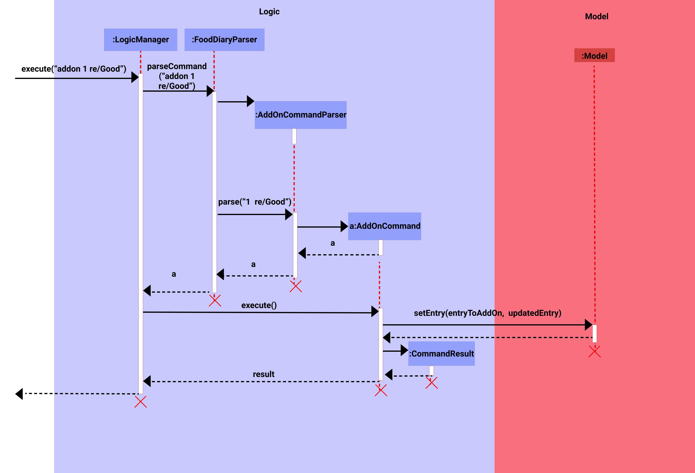

* Table of Contents
{:toc}
--------------------------------------------------------------------------------------------------------------------

## **Description**

The Food Diary is a desktop app for managing food diary entries, optimized with a Command Line Interface (CLI) and 
packaged with a Graphical User Interface (GUI).

The Food Diary caters to food-passionate NUS students who would ideally benefit from keeping records of food options 
tasted in the vicinity of NUS.

The Food Diary will allow students to save time and effort when finding places to eat around the NUS vicinity. The Food 
Diary especially caters to students mainly on 4 aspects:

1. The ability for users to save food diary entries for future reference.
2. The ability for users to find entries based on specific fields.
3. The ability for users to have multiple food reviews for a food place.
4. The option for users to use Commands / UI to perform some tasks quickly.

## **Design**
### Architecture

The **Architecture Diagram** given above explains the high-level design of the App. 
Given below is a quick overview of each component.

`Main` has two classes called `Main` and `MainApp`. It is responsible for, 
* At app launch: Initializes the components in the correct sequence, and connects them up with each other.
* At shut down: Shuts down the components and invokes cleanup methods where necessary.

`Commons` represents a collection of classes used by multiple other components.

The rest of the App consists of four components.
* `UI`: The UI of the App.
* `Logic`: The command executor.
* `Model`: Holds the data of the App in memory.
* `Storage`: Reads data from, and writes data to, the hard disk.

Each of the four components,
* defines its API in an `interface` with the same name as the Component. 
* exposes its functionality using a concrete `{Component Name}Manager` 
  class which implements the corresponding API interface mentioned in the previous point.

For example, the `Logic` component (see the class diagram given below) 
defines its API in the `Logic.java` interface and exposes its functionality 
using the `LogicManager.java` class which implements the `Logic` interface.

#### How the architecture components interact with each other
The *Sequence Diagram* below shows how the components interact with each other for the scenario 
where the user issues the command `addon 1 re/i like this food`.

The sections below give more details of each component. 

### UI component

### Logic Component
**API:** [`Logic.java`](../src/main/java/fooddiary/logic/Logic.java)

1. `Logic` uses the `FoodDiaryParser` class to parse the user command.
2. This results in a `Command` object which is executed by the `LogicManager`.
3. The command execution can affect the `Model` (e.g. adding an entry to the Food Diary)
4. The result of the command execution is encapsulated as a `CommandResult` object which is
passed back to the `Ui`.
5. In addition, the `CommandResult` object can also instruct the `Ui` to perform certain actions,
such as displaying help to the user.
   
Given below is the Sequence Diagram for interactions within the `Logic` component for the
`execute("addon 1 re/Good")` API call.

### Model Component

**API :** [`Model.java`](../src/main/java/fooddiary/model/Model.java)

The `Model`,
- stores a `UserPref` object that represents the user’s preferences.
- stores the user's food entries data.
- exposes an unmodifiable `ObservableList<Entry>` that can be ‘observed’ e.g. the UI can be bound to this list so that 
  the UI automatically updates when the data in the list change.
- does not depend on any of the other three components.

### Storage Component

### Common classes
Classes used by multiple components are in the seedu.fooddiary.commons package.

## **Implementation**
This section describes some noteworthy details on how certain features are implemented.
### AddOn Feature
The AddOn feature allows the user to add review(s) and/or a price to a single entry of a food place. This will be useful
for users who frequently visit a particular place and would like to enter their reviews and the price spent every visit.
The reviews are added to the specifed entry and the price added on will be refelcted as a price range the of the user's spending history 
(e.g. if the current entry has a price of $5, adding on a price of 10 will update the current price of 5 to a price range of $5-10)
This feature follows the architecture of AB3.

The following sequence diagram shows how the AddOn feature works:

The following activity diagram summaries the flow of event when a user executes the addon command:

### FindAll Feature
The FindAll feature allows a user to find entries that match all the keywords provided by the user.
This enables the user to easily sieve out all the entries that meet every single requirement the user
is looking for, which will be useful when deciding where to eat.

The FindAll feature is similar to the Find feature. The Find feature finds for all entries that meet
at least one of the given keywords, while the FindAll feature only finds for entries that meet all the
given keywords.

One of the alternatives considered was to make the Find command serve the purpose of both the Find & FindAll
commands, as they behave similarly. However, this would require the user to key in additional syntax to
specify which method of find they would like to use. This was deemed to be less user-friendly and more prone
to errors as the command now consists of 3 parts (command word, type of find to use & keywords to find),
instead of 2 (command word & keywords to find). As a result, FindAll was implemented as a separate feature.

The following sequence diagram shows how the FindAll feature works:

The following activity diagram summarises the events that take place when a user executes the FindAll
command:

### Revise Feature
The Revise feature allows a user to quickly edit different sections of an entry. It is often misunderstood to be 
mutually exclusive with the edit feature or the slower alternative. This feature shines when a user wishes to edit 
while also adding into multiple sections in an entry. The edit and addon features are still necessities for making 
quick and small chanegs to an entry.

The command opens an additional window when a user enters the command in the UI, the command will be passed into 
`MainWindow#executeCommand()`, in which `Logic#execute()` will be called to parse the user input in  `FoodDiaryParser#parseCommand()`.
The user input will be parsed as a 'Revise' command and executed to retrieve all the details related to the specified entry.
With the window for revision of the entry, a user can easily make changes to the sections all at once. 

With the revise button, all the changes made are passed into the `MainWindow#executeCommand()`, and makes its way to 
`ReviseCommand#revise()` with calls `MainWindow#executeCommand()` with the content at each section concatenated with its
prefix and the EditCommand. 

The following sequence diagram shows how Revise feature works:

The following activity diagram summarises the events that take place when a user executes the Revise
command:

#### Design Consideration

##### Aspect: Whether to revise entry in command line or in a new UI window.
* **Alternative 1 (current choice):** Revise entry in a new UI window.
    * Pros: View all details of an entry and easily revise them with keyboard shortcuts.
    * Cons: Revise is not done purely in command line, but rather in a UI window.
* **Alternative 2:** Revise entry in command line.
  * Pros: Revise is purely done in the command line.
  * Cons: For entry with lengthy details, it will flood the command line space and be difficult for revising.

### View Feature
`view`: Allows the user to view a specified entry in a new window, allowing the user to carefully look through
all the details of an entry. This feature is mainly used to read lengthy food reviews which cannot be shown on the Main 
UI window.

Given below is an example usage scenario:

Step 1. The user launches The Food Diary application. Data will be loaded from the storage to the application memory. 
The `FoodDiary` will be populated with a list of `Entry`, each contains: `Name`, `Address`, `Price` 
, `Rating`, `Review`, `TagCategory` and `TagSchool`.

Step 2. The user executes `view <INDEX>`, for whichever entry with lengthy reviews he/she wants to view.

Step 3. If the user input is invalid, an error message will be displayed in the command box, If the entry specified do
not exist, the filteredEntryList will be empty and no entry will be displayed on the Main Window.  

The mechanism works in such a way where after the user enters a command in the UI, the command will be passed into
`MainWindow#executeCommand()`, in which `Logic#execute()` will be called to parse the user input in
`FoodDiaryParser#parseCommand()`. The parsed command will be recognised as a 'View' command and executed to 
retrieve all the details related to the specified entry. The result of this execution will be passed back to the UI and 
shown in a new window.

The following sequence diagram shows how the `view` feature works:

The following activity diagram summarizes what happens when a user executes the `view` command:

:information_source: 
**Note:** If the index specified by the user do not exist in The Food Diary, a CommandException will be thrown and the
error will be displayed to the user in the command box. If index is not specified, the error message in the command box
will show the correct syntax to use for the `View` command.

#### Design Consideration

##### Aspect: Whether to view entry with lengthy reviews in the Main UI or in a new window.
* **Alternative 1 (current choice):** View entry with lengthy reviews in a new window.
    * Pros: Easier to implement, do not need to deal with complex UI codes. Entry information looks neater.
    * Cons: User has to close/minimize the window to return to Main Window.
* **Alternative 2:** View entry with lengthy reviews in the Main UI.
    * Pros: Design is integrated within Main UI, which gives it a cleaner look.
    * Cons: Difficult to implement, lesser time for testability given the project deadline duration.

### Clear Feature
`clear`: Allows the user to clear entries in The Food Diary.

Given below is an example usage scenario:

Step 1. The user launches The Food Diary application. Data will be loaded from the storage to the application memory.
The `FoodDiary` will be populated with a list of `Entry`, each contains: `Name`, `Address`, `Price`
, `Rating`, `Review`, `TagCategory` and `TagSchool`.

Step 2. The user executes `clear` to clear all entries in The Food Diary.

This feature was brought over to The Food Diary from AB3. There were not much changes apart from modifying it to clear
entries instead. Similiar to other commands,`MainWindow#executeCommand()` runs and `Logic#execute()` 
will be called to parse the user input in `FoodDiaryParser#parseCommand()`. The parsed command will be identified
as a `clear` command.

## **Documentation, logging, testing, configuration, dev-ops**
- [Documentation guide](Documentation.md)
- [Testing guide](Testing.md)
- [Logging guide](Logging.md)
- [Configuration guide](Configuration.md)
- [DevOps guide](DevOps.md)

## **Appendix A: Effort**
### Challenges & Effort Required
### Achievements

## **Appendix B: Product scope**

**Target user profile**:

This product caters to food-fervent NUS students who would ideally benefit from
keeping records of food options tasted in the vicinity of NUS.

* prefer desktop apps over other types

* can type fast and prefers typing to mouse interactions

* is reasonably comfortable using CLI apps

* occasionally prefers to use ui for certain tasks

**Value proposition**:

The Food Diary will allow NUS foodies to save time and effort when finding places to eat around the NUS vicinity.
The Food Diary especially caters to students chiefly on 3 aspects
– One, the ability for users to log personal food reviews tagged under different categories for future reference;
Two, the ability to effortlessly reference food options based on relevant filters in a user-friendly GUI;
and Three, the ability to import and export their personal food diary to share with friends.

## **Appendix C: User stories**
Priorities: High (must have) - `* * *`, Medium (nice to have) - `* *`, Low (unlikely to have) - `*`

| Priority| As a …​                                                       | I want to …​                                  | So that I can…​                                             |
| ------- | ---------------------------------------------------------------- | ------------------------------------------------ | ---------------------------------------------------------------------- |
| `* * *` | User wanting to add a review of food experience to a particular restaurant | Add a review of food experience                  | refer back to the particular element that defined my food experience  |
| `* * *` | User with little patience and time                               | Add names of places I have visited               | efficiently add a review to a place I have visited               |
| `* *`   | User who wants to look at the places I have visited              | View the list of experiences I have had          | easily show them to my friends              |
| `* * *` | Student trying to decide where to eat                            | Look at the places i have visited before         | decide where I shall re-visit                                          |
| `* * *` | User who would like to create custom category of food place      | Add the category of the place                    | I can have a specific view of certain places                           |
| `* * *` | User who does not want to visit a place again                    | Remove the place                                 | reduce redundant food places in my list                           |
| `* * *` | User who wants to remember food ratings | Give a rating on the overall food experience | I can gauge/ballpark the satisfaction level I get against other food experiences           |
| `* * *` | User who wants to read lengthy reviews of an entry | Glance through reviews of an entry | Quickly arrive at a conclusion for a food place|
| `* *`   | User frequently revisiting a place                          | Add multiple reviews to a single place           | Store all my food experiences with the place   |
| `* *`   | User who wants to eat good food at an affordable price           | Search for places that match both the rating and price that I want | visit the best food places without overspending
| `* * *`   | User who made a mistake in an entry           | Perform revisions and updates to the entry | keep accurate and up-to-date information of food places

## **Appendix D: Use cases**
(For all use cases below, the **System** is the `Food Diary` and the **Actor** is the `user`, unless specified otherwise)

**UC01: Add an Entry**
Preconditions: There are lesser than 1 000 000 entries in the Food Diary application.

**MSS**

1.  User enters details to add an entry to the Food Diary.
2.  Food Diary adds a new entry to the app.
    Use case ends.

**Extensions**

* 1a.  Food Diary detects invalid command from user.

    *   1a1. Food Diary warns user about invalid command syntax.

    *	1a2. User enters correct command syntax.

         Use case resumes from step 2.

* 2a. Food Diary detects duplicate entry that is already stored in the application.

    *	2a1. Food Diary warns user that the entry to be added already exists in the application.

         Use case ends.

**UC02: List all restaurants**

**MSS**

1.  User requests to list all restaurants.
2.  Food Diary displays all the restaurants.

**Extensions**

* 1a. Food Diary detects invalid command from user.

    * 1a1. Food Diary warns user about wrong syntax.
    * 1a2. User enters correct syntax.

      Use case resumes from step 2.

* 2a. No Restaurants to display.

    * 2a1. Tells users that there are no restaurants.
    * 1a2. User enters correct syntax.

      Use case ends.

**UC04: Add category**

**MSS**

1. User adds a new category.
2. Food Diary adds the new category into the app.
3. Food Diary displays the new category added in a tag.

   Use case ends.

**Extensions**

* 1a. Food Diary detects invalid command from user.
    * 1a1. Food Diary warns user about wrong syntax.
    * 1a2. User enters correct syntax.

      Use case resumes from step 2.

* 1b. New category already exists.
    * 1b1. Food Diary tells user that the category already exists.

      Use case ends.

**UC05: Add on review(s) and/or price to a specified Food Diary Entry**

**MSS**

1. User requests to add a review(s) and/or a price to a specified entry.
2. Food Diary checks for the specified entry.
3. Food Diary adds review(s) and/or a price to the specified entry.

**Extensions**:

* 1a. Food Diary detects invalid command from user.
    * 1a1. Food Diary warns user about invalid command syntax.
    * 1a2. User enters correct command.

      Use case resumes from step 2.

* 2a. Specified Food Diary entry not found
    * 2a1. Food Diary tells user that the specified entry is invalid.

      Use case ends.

**UC06: Delete an Entry**

**MSS**

1. User requests to delete a Food Diary entry.
2. Food diary removes the entry from its database.

**Extensions**:
* 1a. Food diary detects invalid command from user.
    * 1a1. Food Diary warns user about invalid command syntax.
    * 1a2. User enters a valid command.

      Use case resumes from step 2.

* 2a. Specified Food Diary entry not found
    * 2a1. Food Diary tells user that the specified entry is invalid.

      Use case ends.

**UC07: View an Entry**

**MSS**
1. User requests to view a specific entry.
2. Food Diary checks requested entry.
3. Food diary shows specified entry details.

**Extensions**:
* 1a. Food diary detects invalid command from user.
    * 1a1. Food Diary warns user about wrong syntax.
    * 1a2. User enters correct syntax.

      Use case resumes from step 2.

* 2a. No entry found
    * 2a1. Food Diary tells user that no entry was found.

      Use case ends.

**UC08: Find all specific entries**

**MSS**
1. User enters keywords to specify requirements for entries.
2. Food Diary shows all entries matching user requirements (if any).

   Use case ends.

**Extensions**:
* 1a. Food Diary detects invalid command from user.
    * 1a1. Food Diary warns user about wrong syntax.
    * 1a2. User enters correct syntax.

  Use case resumes from step 2.

**UC09: Revise an Entry**

**MSS**
1. User requests to revise a specific entry.
2. Food Diary checks requested entry.
3. Food diary allows user to make revisions to the entry.

**Extensions**:
* 1a. Food diary detects invalid command from user.
    * 1a1. Food Diary warns user about wrong syntax.
    * 1a2. User enters correct syntax.

      Use case ends.

* 2a. User key in non-existent index in list
    * 2a1. Food Diary tells user that no entry was found.

      Use case ends.

**UC10: Exit**

**MSS**
1. User exits.
2. Food Diary closes and data is saved.

**Extensions**:
* 1a. Food diary detects invalid command from user.
    * 1a1. Food Diary warns user about wrong syntax.
    * 1a2. User enters correct syntax.

      Use case ends.

**UC11: Clear**

**MSS**
1. User requests to clear all entries.
2. Food Diary clears all entries.

**Extensions**:
* 1a. Food diary detects invalid command from user.
    * 1a1. Food Diary warns user about wrong syntax.
    * 1a2. User enters correct syntax.

      Use case resumes from step 2.

## **Appendix E: Non-Functional Requirements**

Non-functional requirements specify the constraints under which the system for The Food Diary is developed and operated.
The Food Diary system is made up of the front-end, which is interchangeably referred to as the User Interface (UI),
and the back-end, which handles data management and operations.

### Technical requirements:

* The system should be operable on Windows, MacOS and Linux operating systems, with Java 11 or above installed.

### Performance requirements:

* The system should be loaded up within 2 seconds or less.
* The UI should appear within 2 seconds or less and be responsive to User input.
* The back-end should be responsive to processing User input at the same time the UI appears.
* The back-end should be able to handle 1,000 or more data entries (Food Diary entries) without noticeable sluggishness
  in performance for typical usage.

### Usability requirements:

* The user should have access to a keyboard, and be proficient with typing alphanumeric English characters for commands
  to accomplish most of the usages of The Food Diary.

### Project scope:
* The system should mainly comprise the handling of Food Diary-entry addition, deletion, and listing.
* The system would not be responsible for features involving multiple users

### Scalability requirements:
* The system can handle a larger user base with many more food reviews being added to it
* Program is extendable for future addition of features easily

### Other Noteworthy Points:

* The system should preserve data keyed in by the user

## **Appendix F: Glossary**
The glossary serves to ensure that all stakeholders, including users, have a common understanding of the noteworthy terms, and abbreviations.

* **Sluggishness**: The system starts to be slow in displaying user input when typed, and processing user input when entered.

## **Appendix G: Instructions for manual testing**
Given below are instructions to test the app manually.

:information_source: **Note:** These instructions only provide a starting point for testers
to work on.

### Launch and shutdown
1. Initial launch
    1. Download the jar file and copy into an empty folder
    2. Double-click the jar file Expected: Shows the GUI with a set of sample contacts. The window size may not be optimum.

2. Saving window preferences
    1. Resize the window to an optimum size. Move the window to a different location. Close the window.
    2. Re-launch the app by double-clicking the jar file.
    
        Expected: The most recent window size and location is retained.

### View an entry
1. View an expanded view of an entry with lengthy review
    1. Prerequisite: Must have entries listed out in the Main Window    

    2. Test Case: Correct command with valid parameters:`view 1` (provided that entry of index 1 already exists)
        
        Expected: A window pops up which shows all details of the specified entry.
    3. Test Case: Command without parameters: `view`
       
        Expected: User will be notified that invalid command format is provided. The command box
        Will show the correct syntax for `view` command.
    4. Test Case: Command not in lower-case: `ViEw 1` (provided that entry of index 1 already exists)
    
        Expected: User will be notified about unknown command in the command box.
    5. Test Case: Correct command but with non-existent index: `view 100000` (provided that entry of index 100000 
       do not exists)
       
        Expected: User will be notified of invalid command and the number of entries in The Food Diary.

### Clear all entries
1. Remove all entries from The Food Diary
    1. Prerequisite: None
    
    2. Test Case: Correct command:`clear` 

       Expected: Success message will show up in command box informing user that all entries are cleared.
    3. Test Case: Command not in lower-case: `cLeAr`

       Expected: User will be notified about unknown command in the command box.
    

## **UI Mockup**

